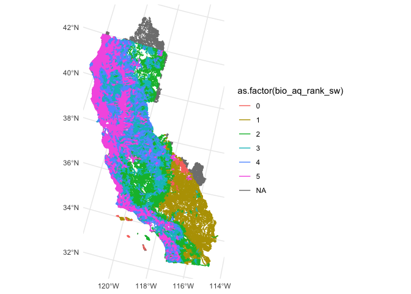
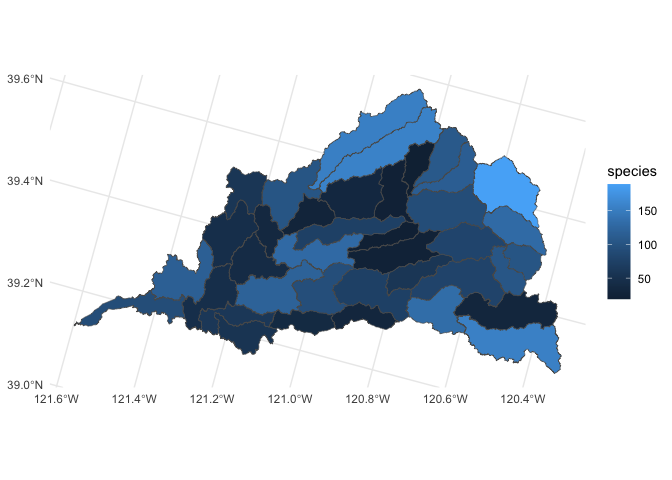

Aquatic Species
================
Maddee Rubenson (FlowWest)
2024-01-26

``` r
project_crs <- "ESRI:102039" # NAD83 CONUS Albers USGS Version

selected_huc_8 <- c("18020107", "18020125")

flowlines <- readRDS("../data/flowline_geometries.Rds") |>
  left_join(readRDS("../data/flowline_attributes.Rds")) |>
  filter(huc_8 %in% selected_huc_8) |>
  st_transform(project_crs)
```

    ## Joining with `by = join_by(comid)`

``` r
catchments <- readRDS("../data/catchments.Rds")
```

##### Aquatic Biodiveristy Summary

The aquatic biodiversity summary combines the three measures of
biodiversity developed for ACE into a single metric: 1) aquatic native
species richness, which represents overall native diversity of all
species in the state, both common and rare; 2) aquatic rare species
richness, which represents diversity of rare species; and, 3) aquatic
irreplaceability, which is a weighted measure of rarity and endemism.

<https://data-cdfw.opendata.arcgis.com/datasets/CDFW>::aquatic-species-list-ace-ds2740-2/explore

``` r
# CDFW:
drive_download(file = 'Aquatic_Species_List_-_ACE_[ds2740].geojson', path = "git_ignore/Aquatic_Species_List_-_ACE_[ds2740].geojson", overwrite = TRUE)

aquatic_sf <- read_sf('git_ignore/Aquatic_Species_List_-_ACE_[ds2740].geojson') |> 
  janitor::clean_names() |> 
  rename(huc_12_aq = huc12) |> 
  select(huc_12_aq, bio_aq_rank_sw) |> 
  mutate(huc_8 = str_sub(huc_12_aq, start=1, end=8)) |> 
  glimpse()
```

    ## Rows: 4,473
    ## Columns: 4
    ## $ huc_12_aq      <chr> "180201590400", "180600080503", "180400010703", "180703…
    ## $ bio_aq_rank_sw <int> 5, 5, 4, 2, 1, 5, 5, 5, 5, 5, 5, 5, 5, 5, 5, 5, 5, 5, 5…
    ## $ geometry       <MULTIPOLYGON [°]> MULTIPOLYGON (((-121.6377 3..., MULTIPOLYG…
    ## $ huc_8          <chr> "18020159", "18060008", "18040001", "18070304", "180902…

``` r
aquatic_selected <- aquatic_sf |> filter(huc_8 %in% selected_huc_8) |> st_transform(project_crs)
flowlines_selected <- flowlines |> filter(huc_8 %in% selected_huc_8) |> st_zm()

crosswalk <- 
  flowlines_selected |> 
  st_point_on_surface() |> 
  st_join(aquatic_selected, join=st_within) |>
  select(comid, huc_12_aq) |>
  st_drop_geometry()

flowlines_joined <-
  flowlines_selected |>
  left_join(crosswalk) |>
  left_join(st_drop_geometry(aquatic_selected))

ggplot() + 
  geom_sf(data=aquatic_selected, aes(fill=bio_aq_rank_sw)) 
```

<!-- --> \#####
California Freshwater Species Database V2

The California Freshwater Species Database is the first comprehensive
geospatial database of California’s freshwater species compiled and
standardized into single format from nearly 500 sources. It provides a
single source for geodata covering the plants and animals that rely on
California’s freshwater resources to survive.

<https://www.scienceforconservation.org/products/california-freshwater-species-database>

``` r
## TNC: 

richness <- read_csv('ca_freshwater_species/RichnessSummary.csv') |> 
  janitor::clean_names() |> 
  rename(huc_12 = au_id) |> 
  mutate(huc_12_aq = as.character(huc_12)) |> glimpse()
```

    ## Rows: 4450 Columns: 33
    ## ── Column specification ────────────────────────────────────────────────────────
    ## Delimiter: ","
    ## dbl (32): AU_ID, species, species_fish, species_crust, species_herps, specie...
    ## num  (1): OBJECTID
    ## 
    ## ℹ Use `spec()` to retrieve the full column specification for this data.
    ## ℹ Specify the column types or set `show_col_types = FALSE` to quiet this message.

    ## Rows: 4,450
    ## Columns: 34
    ## $ objectid                   <dbl> 1, 2, 3, 4, 5, 6, 7, 8, 9, 10, 11, 12, 13, …
    ## $ huc_12                     <dbl> 1.50301e+11, 1.50301e+11, 1.50301e+11, 1.50…
    ## $ species                    <dbl> 8, 27, 8, 9, 56, 9, 13, 43, 38, 2, 2, 2, 3,…
    ## $ species_fish               <dbl> 2, 3, 1, 3, 3, 1, 2, 3, 3, 0, 0, 0, 0, 0, 0…
    ## $ species_crust              <dbl> 0, 0, 0, 0, 0, 0, 0, 0, 0, 0, 0, 0, 0, 0, 0…
    ## $ species_herps              <dbl> 1, 1, 1, 2, 4, 1, 1, 1, 2, 2, 2, 2, 2, 2, 2…
    ## $ species_inverts            <dbl> 0, 0, 0, 0, 0, 0, 0, 6, 2, 0, 0, 0, 0, 0, 0…
    ## $ species_mollusks           <dbl> 0, 0, 0, 0, 0, 0, 0, 0, 1, 0, 0, 0, 0, 0, 0…
    ## $ species_plants             <dbl> 2, 1, 0, 0, 9, 0, 1, 4, 5, 0, 0, 0, 0, 1, 1…
    ## $ species_birds              <dbl> 1, 19, 4, 2, 37, 5, 7, 27, 23, 0, 0, 0, 1, …
    ## $ species_mammals            <dbl> 2, 3, 2, 2, 3, 2, 2, 2, 2, 0, 0, 0, 0, 0, 0…
    ## $ species_mollusks_crust     <dbl> 0, 0, 0, 0, 0, 0, 0, 0, 1, 0, 0, 0, 0, 0, 0…
    ## $ species_endemic            <dbl> 0, 0, 0, 0, 0, 0, 0, 0, 0, 0, 0, 0, 0, 0, 0…
    ## $ species_endemic_fish       <dbl> 0, 0, 0, 0, 0, 0, 0, 0, 0, 0, 0, 0, 0, 0, 0…
    ## $ species_endemic_crust      <dbl> 0, 0, 0, 0, 0, 0, 0, 0, 0, 0, 0, 0, 0, 0, 0…
    ## $ species_endemic_herps      <dbl> 0, 0, 0, 0, 0, 0, 0, 0, 0, 0, 0, 0, 0, 0, 0…
    ## $ species_endemic_inverts    <dbl> 0, 0, 0, 0, 0, 0, 0, 0, 0, 0, 0, 0, 0, 0, 0…
    ## $ species_endemic_mollusks   <dbl> 0, 0, 0, 0, 0, 0, 0, 0, 0, 0, 0, 0, 0, 0, 0…
    ## $ species_endemic_plants     <dbl> 0, 0, 0, 0, 0, 0, 0, 0, 0, 0, 0, 0, 0, 0, 0…
    ## $ species_endemic_birds      <dbl> 0, 0, 0, 0, 0, 0, 0, 0, 0, 0, 0, 0, 0, 0, 0…
    ## $ species_endemic_mammals    <dbl> 0, 0, 0, 0, 0, 0, 0, 0, 0, 0, 0, 0, 0, 0, 0…
    ## $ species_vulnerable         <dbl> 3, 14, 2, 4, 14, 6, 7, 11, 15, 1, 1, 1, 2, …
    ## $ species_listed             <dbl> 2, 5, 1, 2, 4, 3, 4, 5, 5, 0, 0, 0, 0, 0, 0…
    ## $ species_endemic_vulnerable <dbl> 0, 0, 0, 0, 0, 0, 0, 0, 0, 0, 0, 0, 0, 0, 0…
    ## $ species_endemic_listed     <dbl> 0, 0, 0, 0, 0, 0, 0, 0, 0, 0, 0, 0, 0, 0, 0…
    ## $ genus                      <dbl> 8, 26, 8, 8, 43, 9, 13, 36, 35, 2, 2, 2, 3,…
    ## $ family                     <dbl> 8, 19, 8, 7, 29, 8, 12, 24, 27, 2, 2, 2, 3,…
    ## $ tax_order                  <dbl> 6, 11, 7, 4, 19, 5, 8, 15, 19, 1, 1, 1, 2, …
    ## $ tax_class                  <dbl> 6, 5, 4, 4, 6, 4, 5, 7, 8, 1, 1, 1, 2, 3, 3…
    ## $ phylum                     <dbl> 2, 2, 1, 1, 2, 1, 2, 3, 4, 1, 1, 1, 1, 2, 2…
    ## $ species_current            <dbl> 2, 20, 3, 3, 41, 5, 8, 31, 32, 0, 0, 0, 0, …
    ## $ species_historical         <dbl> 2, 8, 1, 3, 15, 1, 2, 9, 3, 0, 0, 0, 0, 0, …
    ## $ species_other              <dbl> 5, 5, 4, 5, 7, 4, 5, 6, 7, 2, 2, 2, 3, 2, 3…
    ## $ huc_12_aq                  <chr> "150301010305", "150301010307", "1503010104…

``` r
analysis_units <- read_sf('ca_freshwater_species/AnalysisUnits.shp') |> 
  janitor::clean_names() |> 
  rename(huc_12_aq = au_id) |> 
  mutate(huc_12_aq = as.character(huc_12_aq)) |> 
  left_join(richness) |> 
  mutate(huc_8 = str_sub(huc_12_aq, start=1, end=8)) |> 
  select(-huc_12) |> 
  glimpse()
```

    ## Joining with `by = join_by(huc_12_aq)`

    ## Rows: 4,450
    ## Columns: 36
    ## $ huc_12_aq                  <chr> "150301010305", "150301010307", "1503010104…
    ## $ au_name                    <chr> "Montana Wash-Colorado River", "Red Spring-…
    ## $ geometry                   <MULTIPOLYGON [m]> MULTIPOLYGON (((486938.1 -3...…
    ## $ objectid                   <dbl> 1, 2, 3, 4, 5, 6, 7, 8, 9, 10, 11, 12, 13, …
    ## $ species                    <dbl> 8, 27, 8, 9, 56, 9, 13, 43, 38, 2, 2, 2, 3,…
    ## $ species_fish               <dbl> 2, 3, 1, 3, 3, 1, 2, 3, 3, 0, 0, 0, 0, 0, 0…
    ## $ species_crust              <dbl> 0, 0, 0, 0, 0, 0, 0, 0, 0, 0, 0, 0, 0, 0, 0…
    ## $ species_herps              <dbl> 1, 1, 1, 2, 4, 1, 1, 1, 2, 2, 2, 2, 2, 2, 2…
    ## $ species_inverts            <dbl> 0, 0, 0, 0, 0, 0, 0, 6, 2, 0, 0, 0, 0, 0, 0…
    ## $ species_mollusks           <dbl> 0, 0, 0, 0, 0, 0, 0, 0, 1, 0, 0, 0, 0, 0, 0…
    ## $ species_plants             <dbl> 2, 1, 0, 0, 9, 0, 1, 4, 5, 0, 0, 0, 0, 1, 1…
    ## $ species_birds              <dbl> 1, 19, 4, 2, 37, 5, 7, 27, 23, 0, 0, 0, 1, …
    ## $ species_mammals            <dbl> 2, 3, 2, 2, 3, 2, 2, 2, 2, 0, 0, 0, 0, 0, 0…
    ## $ species_mollusks_crust     <dbl> 0, 0, 0, 0, 0, 0, 0, 0, 1, 0, 0, 0, 0, 0, 0…
    ## $ species_endemic            <dbl> 0, 0, 0, 0, 0, 0, 0, 0, 0, 0, 0, 0, 0, 0, 0…
    ## $ species_endemic_fish       <dbl> 0, 0, 0, 0, 0, 0, 0, 0, 0, 0, 0, 0, 0, 0, 0…
    ## $ species_endemic_crust      <dbl> 0, 0, 0, 0, 0, 0, 0, 0, 0, 0, 0, 0, 0, 0, 0…
    ## $ species_endemic_herps      <dbl> 0, 0, 0, 0, 0, 0, 0, 0, 0, 0, 0, 0, 0, 0, 0…
    ## $ species_endemic_inverts    <dbl> 0, 0, 0, 0, 0, 0, 0, 0, 0, 0, 0, 0, 0, 0, 0…
    ## $ species_endemic_mollusks   <dbl> 0, 0, 0, 0, 0, 0, 0, 0, 0, 0, 0, 0, 0, 0, 0…
    ## $ species_endemic_plants     <dbl> 0, 0, 0, 0, 0, 0, 0, 0, 0, 0, 0, 0, 0, 0, 0…
    ## $ species_endemic_birds      <dbl> 0, 0, 0, 0, 0, 0, 0, 0, 0, 0, 0, 0, 0, 0, 0…
    ## $ species_endemic_mammals    <dbl> 0, 0, 0, 0, 0, 0, 0, 0, 0, 0, 0, 0, 0, 0, 0…
    ## $ species_vulnerable         <dbl> 3, 14, 2, 4, 14, 6, 7, 11, 15, 1, 1, 1, 2, …
    ## $ species_listed             <dbl> 2, 5, 1, 2, 4, 3, 4, 5, 5, 0, 0, 0, 0, 0, 0…
    ## $ species_endemic_vulnerable <dbl> 0, 0, 0, 0, 0, 0, 0, 0, 0, 0, 0, 0, 0, 0, 0…
    ## $ species_endemic_listed     <dbl> 0, 0, 0, 0, 0, 0, 0, 0, 0, 0, 0, 0, 0, 0, 0…
    ## $ genus                      <dbl> 8, 26, 8, 8, 43, 9, 13, 36, 35, 2, 2, 2, 3,…
    ## $ family                     <dbl> 8, 19, 8, 7, 29, 8, 12, 24, 27, 2, 2, 2, 3,…
    ## $ tax_order                  <dbl> 6, 11, 7, 4, 19, 5, 8, 15, 19, 1, 1, 1, 2, …
    ## $ tax_class                  <dbl> 6, 5, 4, 4, 6, 4, 5, 7, 8, 1, 1, 1, 2, 3, 3…
    ## $ phylum                     <dbl> 2, 2, 1, 1, 2, 1, 2, 3, 4, 1, 1, 1, 1, 2, 2…
    ## $ species_current            <dbl> 2, 20, 3, 3, 41, 5, 8, 31, 32, 0, 0, 0, 0, …
    ## $ species_historical         <dbl> 2, 8, 1, 3, 15, 1, 2, 9, 3, 0, 0, 0, 0, 0, …
    ## $ species_other              <dbl> 5, 5, 4, 5, 7, 4, 5, 6, 7, 2, 2, 2, 3, 2, 3…
    ## $ huc_8                      <chr> "15030101", "15030101", "15030101", "150301…

``` r
analysis_units_selected <- analysis_units |> filter(huc_8 %in% selected_huc_8) |> st_transform(project_crs)
flowlines_selected <- flowlines |> filter(huc_8 %in% selected_huc_8) |> st_zm()

crosswalk_tnc <- 
  flowlines_selected |> 
  st_point_on_surface() |> 
  st_join(analysis_units_selected, join=st_within) |>
  select(comid, huc_12_aq) |>
  st_drop_geometry()
```

    ## Warning: st_point_on_surface assumes attributes are constant over geometries

``` r
flowlines_joined_tnc <-
  flowlines_selected |>
  left_join(crosswalk_tnc) |>
  left_join(st_drop_geometry(analysis_units_selected))
```

    ## Joining with `by = join_by(comid)`
    ## Joining with `by = join_by(huc_8, huc_12_aq)`

``` r
ggplot() + 
  geom_sf(data=analysis_units_selected, aes(fill=species)) 
```

<!-- -->
