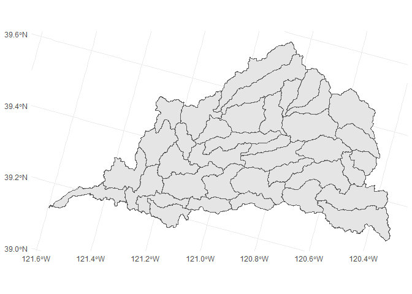
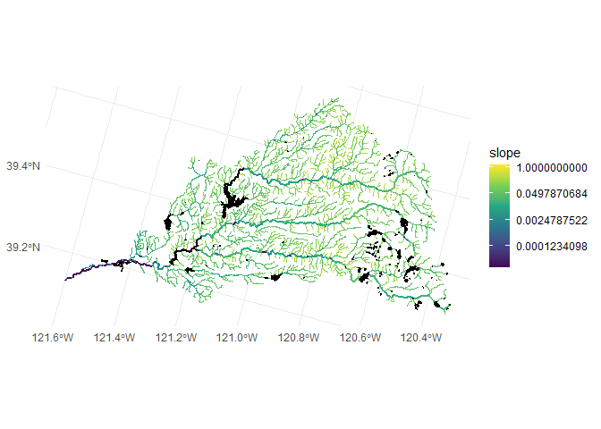
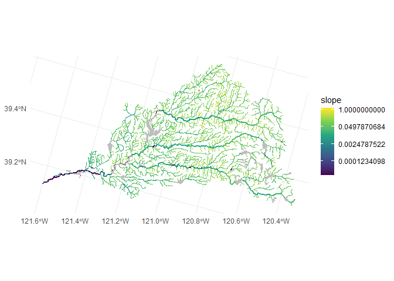
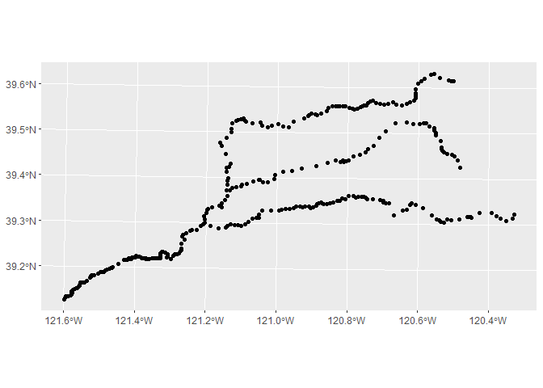
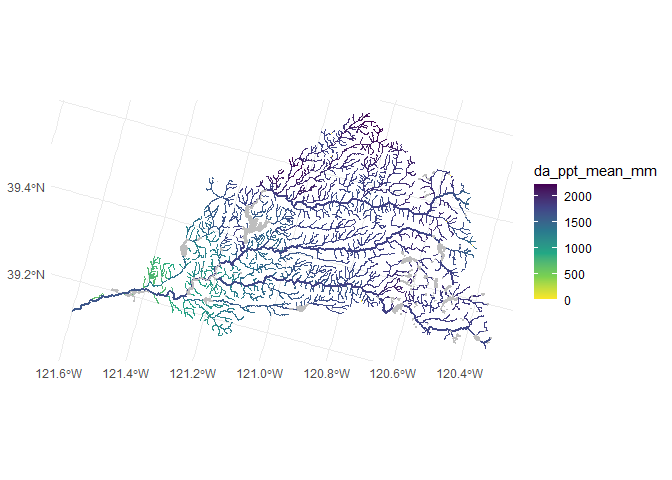
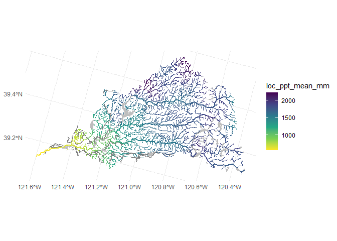

SWC Habitat Model Data Discovery
================
[Skyler Lewis](mailto:slewis@flowwest.com)
2024-01-08

- [Data Import](#data-import)
- [Import HUC Watersheds](#import-huc-watersheds)
- [Import Supplemental Tables](#import-supplemental-tables)
  - [Import flowline geometry](#import-flowline-geometry)
  - [Import catchments](#import-catchments)
- [Stream Widths?](#stream-widths)
- [DEM](#dem)
  - [10m NHDPlusHR](#10m-nhdplushr)
  - [1m CA NoCAL Wildfires B2 2018](#1m-ca-nocal-wildfires-b2-2018)

*Selected HUCs*

- Lower Yuba 18020107
- Upper Yuba 18020125

*Data Source*

- NHDPlusV2 dataset <https://nhdplus.com/NHDPlus/NHDPlusV2_home.php>
- As retrievedfrom
  <https://www.epa.gov/waterdata/nhdplus-california-data-vector-processing-unit-18>
- User Guide
  <https://www.epa.gov/system/files/documents/2023-04/NHDPlusV2_User_Guide.pdf>
- (This is different from
  [NHDPlusHR](https://pubs.usgs.gov/of/2019/1096/ofr20191096.pdf) which
  is generated at a higher resolution and more computationally
  intensive)

## Data Import

## Import HUC Watersheds

``` r
selected_huc_8 <- c("18020107", "18020125")

# HUC-12 watersheds and higher level heirarchies
watersheds <- st_read("nhdplus/WBD_Subwatershed.shp") |> 
  janitor::clean_names() |>
  filter(huc_8 %in% selected_huc_8) |>
  st_transform(project_crs)
```

    ## Reading layer `WBD_Subwatershed' from data source 
    ##   `C:\Users\skylerlewis\Github\swc-habitat-suitability\data-raw\nhdplus\WBD_Subwatershed.shp' 
    ##   using driver `ESRI Shapefile'
    ## Simple feature collection with 4564 features and 21 fields
    ## Geometry type: POLYGON
    ## Dimension:     XY
    ## Bounding box:  xmin: -124.5351 ymin: 32.133 xmax: -114.6198 ymax: 43.34273
    ## Geodetic CRS:  NAD83

``` r
watersheds |> ggplot() + geom_sf()
```

<!-- -->

## Import Supplemental Tables

``` r
# identifiers of each flowline (COMID)
flowline_comid_reachcode_crosswalk <- 
  foreign::read.dbf("nhdplus/NHDReachCode_Comid.dbf") |> 
  as_tibble() |> 
  janitor::clean_names() |>
  mutate(huc_8 = substr(reachcode, 1, 8),
         huc_10 = substr(reachcode, 1, 10),
         huc_12 = substr(reachcode, 1, 12)) |>
  filter(huc_8 %in% selected_huc_8)

# slopes and endpoint elevations
flowline_slopes <- 
  foreign::read.dbf("nhdplus/NHDPlusAttributes/elevslope.dbf") |> 
  as_tibble() |> 
  janitor::clean_names() |>
  mutate(slope = if_else(slope==-9998, NA, slope))

# cumulative upstream area
flowline_cumarea <- 
  foreign::read.dbf("nhdplus/NHDPlusAttributes/CumulativeArea.dbf") |> 
  as_tibble() |> 
  janitor::clean_names() |>
  rename(comid = com_id)

# flow routing attributes as described in https://www.usgs.gov/national-hydrography/value-added-attributes-vaas
flowline_vaattr <- 
  foreign::read.dbf("nhdplus/NHDPlusAttributes/PlusFlowlineVAA.dbf") |> 
  as_tibble() |> 
  janitor::clean_names()

# fcode table
fcodes <- 
  foreign::read.dbf("nhdplus/NHDFCode.dbf") |> 
  as_tibble() |> 
  janitor::clean_names() |>
  rename(fcode = f_code, fcode_desc = descriptio)
```

### Import flowline geometry

``` r
flowlines <- 
  st_read("nhdplus/Hydrography/NHDFlowline.shp") |>
  janitor::clean_names() |>
  mutate(huc_8 = substr(reachcode, 1, 8),
         huc_10 = substr(reachcode, 1, 10),
         huc_12 = substr(reachcode, 1, 12)) |>
  filter(huc_8 %in% selected_huc_8) |>
  inner_join(fcodes |> select(fcode, fcode_desc)) |>
  inner_join(flowline_slopes |> select(comid, slope, maxelevsmo, minelevsmo, slopelenkm), by = join_by(comid)) |>
  inner_join(flowline_cumarea, by = join_by(comid)) |>
  arrange(comid) |>
  st_transform(project_crs)
```

    ## Reading layer `NHDFlowline' from data source 
    ##   `C:\Users\skylerlewis\Github\swc-habitat-suitability\data-raw\nhdplus\Hydrography\NHDFlowline.shp' 
    ##   using driver `ESRI Shapefile'
    ## Simple feature collection with 178868 features and 14 fields
    ## Geometry type: LINESTRING
    ## Dimension:     XYZM
    ## Bounding box:  xmin: -124.4096 ymin: 32.50006 xmax: -114.5885 ymax: 43.33627
    ## z_range:       zmin: 0 zmax: 0
    ## m_range:       mmin: 0 mmax: 100
    ## Geodetic CRS:  NAD83

    ## Joining with `by = join_by(fcode)`

``` r
#flowareas <- 
#  st_read("nhdplus/Hydrography/NHDArea.shp") |>
#  janitor::clean_names() |>
#  arrange(comid) #|>
#  #inner_join(flowlines |> st_drop_geometry() |> select(comid)) |>
#  #select(comid, ftype, fcode, geometry)

waterbodies <- 
  st_read("nhdplus/Hydrography/NHDWaterbody.shp") |>
  janitor::clean_names() |>
  mutate(huc_8 = substr(reachcode, 1, 8),
         huc_10 = substr(reachcode, 1, 10),
         huc_12 = substr(reachcode, 1, 12)) |>
  filter(huc_8 %in% selected_huc_8) |>
  arrange(comid) |>
  st_transform(project_crs)
```

    ## Reading layer `NHDWaterbody' from data source 
    ##   `C:\Users\skylerlewis\Github\swc-habitat-suitability\data-raw\nhdplus\Hydrography\NHDWaterbody.shp' 
    ##   using driver `ESRI Shapefile'
    ## Simple feature collection with 9651 features and 12 fields
    ## Geometry type: POLYGON
    ## Dimension:     XYZ
    ## Bounding box:  xmin: -124.3796 ymin: 32.54717 xmax: -114.9462 ymax: 43.24877
    ## z_range:       zmin: 0 zmax: 0
    ## Geodetic CRS:  NAD83

``` r
# plot showing slopes
flowlines |> 
  st_zm() |>
  filter(gnis_name %in% c("Yuba River", "South Yuba River", "Middle Yuba River", "North Yuba River")) |>
  ggplot() + 
  geom_sf(data=st_zm(flowlines), aes(color = slope)) +
  geom_sf(aes(color = slope), linewidth=1) + 
  geom_sf(data=waterbodies, fill="black", color="black") +
  scale_color_viridis_c(trans = "log")
```

<!-- -->

``` r
# plot showing drainage area
flowlines |> 
  st_zm() |>
  filter(gnis_name %in% c("Yuba River", "South Yuba River", "Middle Yuba River", "North Yuba River")) |>
  ggplot() + 
  geom_sf(data=st_zm(flowlines), aes(color = tot_da_sq_km)) +
  geom_sf(aes(color = tot_da_sq_km), linewidth=1) + 
  geom_sf(data=waterbodies, fill="black", color="black") +
  scale_color_viridis_c(direction=-1)
```

<!-- -->

### Import catchments

``` r
# catchment associated with each flowline reach (COMID)
catchments <- 
  st_read("nhdplus/Catchment.shp") |> 
  janitor::clean_names() |>
  mutate(comid = as.numeric(featureid)) |>
  inner_join(flowlines |> st_drop_geometry() |> select(comid)) |>
  arrange(comid) |>
  st_transform(project_crs) 
```

    ## Reading layer `Catchment' from data source 
    ##   `C:\Users\skylerlewis\Github\swc-habitat-suitability\data-raw\nhdplus\Catchment.shp' 
    ##   using driver `ESRI Shapefile'
    ## Simple feature collection with 140835 features and 4 fields
    ## Geometry type: MULTIPOLYGON
    ## Dimension:     XY
    ## Bounding box:  xmin: -124.4098 ymin: 32.13295 xmax: -114.6198 ymax: 43.34269
    ## Geodetic CRS:  NAD83

    ## Joining with `by = join_by(comid)`

``` r
# examples
ggplot() + geom_sf(data = catchments, color="orange") + 
  geom_sf(data = watersheds, color="red", fill=NA) + 
  geom_sf(data = st_zm(flowlines), color="blue") 
```

<!-- -->

## Stream Widths?

#### Points along line

using st_line_sample or st_segmentize

``` r
# approach with one point every 100 ft
sample_points_100ft <- 
  flowlines |> 
  filter(gnis_name %in% c("Yuba River", "South Yuba River", "Middle Yuba River", "North Yuba River")) |>
  st_line_sample(density = 1 / 100) 

# approach with just the midpoint of each segment
sample_points_midpt <- 
  flowlines |>
  filter(gnis_name %in% c("Yuba River", "South Yuba River", "Middle Yuba River", "North Yuba River")) |>
  #st_line_sample(sample = c(0, 0.25, 0.5, 0.75, 1))
  st_line_sample(sample = c(0.5))

sample_points_midpt |> ggplot() + geom_sf()
```

<!-- -->

``` r
cvpia_extents <- st_read("habitat_extents_cvpia/habitat_extents_combined_gradients_v3.shp")
```

    ## Reading layer `habitat_extents_combined_gradients_v3' from data source 
    ##   `C:\Users\skylerlewis\Github\swc-habitat-suitability\data-raw\habitat_extents_cvpia\habitat_extents_combined_gradients_v3.shp' 
    ##   using driver `ESRI Shapefile'
    ## Simple feature collection with 323 features and 12 fields
    ## Geometry type: MULTILINESTRING
    ## Dimension:     XY
    ## Bounding box:  xmin: -251634.9 ymin: -139292.4 xmax: 61284.41 ymax: 364940.4
    ## Projected CRS: NAD83 / California Albers

``` r
cvpia_extents |> 
  st_cast("LINESTRING") |>
  mutate(geometry = st_line_sample(geometry, sample = c(0,1))) |>
  ggplot() + geom_sf()
```

    ## Warning in st_cast.sf(cvpia_extents, "LINESTRING"): repeating attributes for
    ## all sub-geometries for which they may not be constant

<!-- -->

## DEM

### 10m NHDPlusHR

``` r
dem <- read_stars("nhdplushr/dem_nhdplushr_yuba_meters_v2.tif")
# this input has already been clipped to the AOI, converted from cm to m, and crs redefined
ggplot() + geom_stars(data=dem) + coord_fixed()
```

<!-- -->

#### export flowlines within this raster domain

``` r
flowlines_for_vbet <- flowlines |>
  filter(gnis_name %in% c("Yuba River")) |>
  st_transform(st_crs(dem)) |>
  st_zm() |> 
  st_crop(st_bbox(dem)) |>
  smoothr::densify(5)
```

    ## Warning: attribute variables are assumed to be spatially constant throughout
    ## all geometries

``` r
flowlines_for_vbet |>
  st_write("out/flowlines_for_vbet.shp", append=FALSE)
```

    ## Warning in abbreviate_shapefile_names(obj): Field names abbreviated for ESRI
    ## Shapefile driver

    ## Deleting layer `flowlines_for_vbet' using driver `ESRI Shapefile'
    ## Writing layer `flowlines_for_vbet' to data source 
    ##   `out/flowlines_for_vbet.shp' using driver `ESRI Shapefile'
    ## Writing 124 features with 24 fields and geometry type Line String.

``` r
flowlines_for_vbet |> ggplot() + geom_sf(aes(color = tot_da_sq_km)) #+ geom_stars(data=dem)
```

<!-- -->

### 1m CA NoCAL Wildfires B2 2018

Not generalizable/automatable

<https://rockyweb.usgs.gov/vdelivery/Datasets/Staged/Elevation/LPC/Projects/CA_NoCAL_3DEP_Supp_Funding_2018_D18/CA_NoCAL_Wildfires_B2_2018/>

<https://prd-tnm.s3.amazonaws.com/index.html?prefix=StagedProducts/Elevation/OPR/Projects/CA_NoCAL_Wildfires_B2_2018>

<https://prd-tnm.s3.amazonaws.com/index.html?prefix=StagedProducts/Elevation/metadata/CA_NoCAL_3DEP_Supp_Funding_2018_D18/CA_NoCAL_Wildfires_B2_2018>
