SWC Habitat Model Data Discovery
================
[Skyler Lewis](mailto:slewis@flowwest.com)
2024-01-19

- [Data Import](#data-import)
  - [Import HUC Watersheds](#import-huc-watersheds)
  - [Import Flowline Tables](#import-flowline-tables)
  - [Combine all attributes](#combine-all-attributes)
  - [Import flowline geometry](#import-flowline-geometry)
  - [Plots of attribute data](#plots-of-attribute-data)
  - [Import catchments](#import-catchments)
- [DEM](#dem)
  - [1m CA NoCAL Wildfires B2 2018](#1m-ca-nocal-wildfires-b2-2018)
  - [10m NHDPlusHR DEM](#10m-nhdplushr-dem)
- [Lithology](#lithology)
- [Confinement](#confinement)
  - [mTPI as a measure of topographic
    confinement](#mtpi-as-a-measure-of-topographic-confinement)
  - [Catchment slope cutoff method](#catchment-slope-cutoff-method)
  - [VBET](#vbet)
- [Test](#test)
  - [Stream Widths?](#stream-widths)

*Selected HUCs*

- Lower Yuba 18020107
- Upper Yuba 18020125

*Data Source*

- NHDPlusV2 dataset <https://nhdplus.com/NHDPlus/NHDPlusV2_home.php>
- As retrievedfrom
  <https://www.epa.gov/waterdata/nhdplus-california-data-vector-processing-unit-18>
- User Guide
  <https://www.epa.gov/system/files/documents/2023-04/NHDPlusV2_User_Guide.pdf>
- (This is different from
  [NHDPlusHR](https://pubs.usgs.gov/of/2019/1096/ofr20191096.pdf) which
  is generated at a higher resolution and more computationally
  intensive)
- Note also if we need to do routing:
  <https://www.sciencebase.gov/catalog/item/5b92790be4b0702d0e809fe5>

*Supplemental Data*

<https://www.sciencebase.gov/catalog/item/5669a79ee4b08895842a1d47>

- Upstream catchment characteristics: Wieczorek, M.E., Jackson, S.E.,
  and Schwarz, G.E., 2018, Select Attributes for NHDPlus Version 2.1
  Reach Catchments and Modified Network Routed Upstream Watersheds for
  the Conterminous United States (ver. 4.0, August 2023): U.S.
  Geological Survey data release, <https://doi.org/10.5066/F7765D7V>
  <https://www.sciencebase.gov/catalog/item/57976a0ce4b021cadec97890>

- Streamcat dataset
  <https://gaftp.epa.gov/epadatacommons/ORD/NHDPlusLandscapeAttributes/StreamCat/HydroRegions/>
  <https://www.epa.gov/national-aquatic-resource-surveys/streamcat-web-tool-table-view>

*Potential sources of channel widths:*

- Simplest version: <https://digitalcommons.unl.edu/usdaarsfacpub/1515>
  as available in dataset: Schwarz, G. E., Jackson, S. E., &
  Wieczorek, M. E. (2018). Select Attributes for NHDPlus Version 2.1
  Reach Catchments and Modified Network Routed Upstream Watersheds for
  the Conterminous United States (ver. 4.0, August 2023) \[Data set\].
  U.S. Geological Survey. <https://doi.org/10.5066/F7765D7V>
  <https://data.usgs.gov/datacatalog/data/USGS:5cf02bdae4b0b51330e22b85>

- More complex modelled dataset:
  <https://doi.org/10.1111/1752-1688.13116> (provided in StreamCat)

- Best: empirical data

*Channel vegetation*

- Very coarse version from MODIS
  <https://gaftp.epa.gov/Exposure/CurveNumberNDVI/READNow.pdf>
  <https://gaftp.epa.gov/Exposure/CurveNumberNDVI/>

- Best: empirical from NAIP

## Data Import

### Import HUC Watersheds

``` r
selected_huc_8 <- c("18020107", "18020125")

# HUC-12 watersheds and higher level heirarchies
watersheds <- st_read("nhdplus/WBD_Subwatershed.shp") |> 
  janitor::clean_names() |>
  filter(huc_8 %in% selected_huc_8) |>
  st_transform(project_crs)
```

    ## Reading layer `WBD_Subwatershed' from data source 
    ##   `C:\Users\skylerlewis\Github\swc-habitat-suitability\data-raw\nhdplus\WBD_Subwatershed.shp' 
    ##   using driver `ESRI Shapefile'
    ## Simple feature collection with 4564 features and 21 fields
    ## Geometry type: POLYGON
    ## Dimension:     XY
    ## Bounding box:  xmin: -124.5351 ymin: 32.133 xmax: -114.6198 ymax: 43.34273
    ## Geodetic CRS:  NAD83

``` r
watersheds |> ggplot() + geom_sf()
```

<!-- -->

### Import Flowline Tables

NHD Flowlines

``` r
#if(!file.exists("flowline_attributes.Rds")) {

    # fcode table
fcodes <- 
  foreign::read.dbf("nhdplus/NHDFCode.dbf") |> 
  as_tibble() |> 
  janitor::clean_names() |>
  rename(fcode = f_code, fcode_desc = descriptio) |>
  mutate(ftype_desc = map(fcode_desc, function(x) str_split(x, ":", simplify=TRUE)[1])) |>
  unnest(ftype_desc) |>
  select(fcode, ftype_desc)

# flowline shapefile attribute table
flowline_table <- 
  foreign::read.dbf("nhdplus/Hydrography/NHDFlowline.dbf") |> 
  janitor::clean_names() |>
  select(comid, reachcode, gnis_id, gnis_name, lengthkm, ftype, fcode) |>
  mutate(huc_8 = substr(reachcode, 1, 8),
         huc_10 = substr(reachcode, 1, 10),
         huc_12 = substr(reachcode, 1, 12)) |>
  inner_join(fcodes |> select(fcode, ftype_desc))
```

NHDPlusV2 tables

``` r
# # cumulative upstream area
# flowline_cumarea <- 
#   foreign::read.dbf("nhdplus/NHDPlusAttributes/CumulativeArea.dbf") |> 
#   as_tibble() |> 
#   janitor::clean_names() |>
#   rename(comid = com_id)

# flow routing attributes as described in https://www.usgs.gov/national-hydrography/value-added-attributes-vaas
flowline_vaattr <- 
  foreign::read.dbf("nhdplus/NHDPlusAttributes/PlusFlowlineVAA.dbf") |> 
  as_tibble() |> 
  select(comid = ComID, 
         hydro_seq = Hydroseq,
         reach_code = ReachCode,
         stream_level = StreamLeve, 
         stream_order = StreamOrde, 
         us_length_km = ArbolateSu,
         ds_length_km = Pathlength,
         da_area_sq_km = DivDASqKM, # using divergence-routed version 
         #da_area_sq_km_tot = TotDASqKM,
         reach_length_km = LengthKM
         )

# slopes and endpoint elevations
flowline_slopes <- 
  foreign::read.dbf("nhdplus/NHDPlusAttributes/elevslope.dbf") |> 
  as_tibble() |> 
  mutate(slope = if_else(SLOPE==-9998, NA, SLOPE),
         elev_min = MINELEVSMO/100, # convert from cm to m
         elev_max = MAXELEVSMO/100) |>
  select(comid = COMID, slope, elev_min, elev_max)

# # identifiers of each flowline (COMID)
# flowline_comid_huc_crosswalk <- 
#   foreign::read.dbf("nhdplus/NHDReachCode_Comid.dbf") |> 
#   as_tibble() |> 
#   janitor::clean_names() |>
#   mutate(huc_8 = substr(reachcode, 1, 8),
#          huc_10 = substr(reachcode, 1, 10),
#          huc_12 = substr(reachcode, 1, 12)) |>
#   filter(huc_8 %in% selected_huc_8) |>
#   select(comid, huc_8, huc_10, huc_12)
```

NHDPlusV2 extension tables

``` r
# vogel method mean annual flow and mean annual velocity
vogel_flow <- 
  foreign::read.dbf("nhdplus/VogelExtension/vogelflow.dbf") |> 
  as_tibble() |>
  janitor::clean_names() |>
  mutate(across(maflowv:mavelv, function(x) if_else(x>=0, x, NA))) |>
  select(comid, vogel_q_ma_cfs = maflowv, vogel_v_ma_fps = mavelv)

  # incremental precipitation at reach
loc_precip_annual <- 
  read_delim("nhdplus/VPUAttributeExtension/IncrPrecipMA.txt") |>
  mutate(comid = as.numeric(FeatureID), loc_ppt_mean_mm = PrecipV/100) |>
  select(comid, loc_ppt_mean_mm)
import_loc_precip <- function(m) {
  mm <- str_pad(m, width=2, pad="0")
  read_delim(paste0("nhdplus/VPUAttributeExtension/IncrPrecipMM", mm, ".txt")) |>
    mutate(month = m) |>
    mutate(comid = as.numeric(FeatureID), loc_ppt_mean_mm = PrecipV/100) |>
    select(month, comid, loc_ppt_mean_mm)
}
loc_precip_monthly <- 
  seq(1,12,1) |> 
  map(import_loc_precip) |> 
  reduce(bind_rows) |>
  pivot_wider(names_from = month, names_prefix = "loc_ppt_mean_mm_", values_from = loc_ppt_mean_mm)

# cumulative precipitation in upstream drainage area
precip_annual <- 
  read_delim("nhdplus/VPUAttributeExtension/CumTotPrecipMA.txt") |>
  mutate(comid = as.numeric(ComID), da_ppt_mean_mm = PrecipVC/100) |>
  select(comid, da_ppt_mean_mm)
import_precip <- function(m) {
  mm <- str_pad(m, width=2, pad="0")
  read_delim(paste0("nhdplus/VPUAttributeExtension/CumTotPrecipMM", mm, ".txt")) |>
    mutate(month = m) |>
    mutate(comid = as.numeric(ComID), da_ppt_mean_mm = PrecipVC/100) |>
    select(month, comid, da_ppt_mean_mm)
}
precip_monthly <- 
  seq(1,12,1) |> 
  map(import_precip) |> 
  reduce(bind_rows) |>
  pivot_wider(names_from = month, names_prefix = "da_ppt_mean_mm_", values_from = da_ppt_mean_mm)

# EROM method mean annual and monthly flows
erom_annual <- 
  foreign::read.dbf(paste0("nhdplus/EROMExtension/EROM_MA0001.dbf")) |>
  as_tibble() |>
  select(comid = ComID, erom_q_ma_cfs = Q0001E, erom_v_ma_fps = V0001E, 
         #temp = Temp0001, ppt = PPT0001, pet = PET0001, qetloss = QLoss0001,
         #catchment_lat = Lat, catchment_sqkm = AreaSqKm,
         ) |>
  mutate(across(erom_q_ma_cfs:erom_v_ma_fps, function(x) if_else(x>=0, x, NA)))
import_erom <- function(m) {
  mm <- str_pad(m, width=2, pad="0")
  foreign::read.dbf(paste0("nhdplus/EROMExtension/EROM_", mm, "0001.dbf")) |>
    as_tibble() |>
    mutate(month = m) |>
    select(month, comid = ComID, erom_q_ma_cfs = Q0001E, erom_v_ma_fps = V0001E, 
           #temp = Temp0001, ppt = PPT0001, pet = PET0001, qetloss = QLoss0001,
           #catchment_lat = Lat, catchment_sqkm = AreaSqKm,
           ) |> 
    mutate(across(erom_q_ma_cfs:erom_v_ma_fps, function(x) if_else(x>=0, x, NA)))
}
erom_monthly <- 
  seq(1,12,1) |> 
  map(import_erom) |> 
  reduce(bind_rows)
erom_monthly_flows <- erom_monthly |> pivot_wider(names_from = month, names_prefix = "erom_q_ma_cfs_", values_from = erom_q_ma_cfs)
erom_monthly_velocities <- erom_monthly |> pivot_wider(names_from = month, names_prefix = "erom_v_ma_fps_", values_from = erom_v_ma_fps)
```

Third party NHDPlusV2 extension tables

``` r
# sinuosity from https://www.sciencebase.gov/catalog/item/57976a0ce4b021cadec97890
flowline_sinuosity <- 
  read_delim("nhdplus_extension/Sinuousity_CONUS.TXT") |>
  janitor::clean_names() |>
  filter(comid %in% flowline_table$comid)

# catchment characteristics from https://www.sciencebase.gov/catalog/item/57976a0ce4b021cadec97890
da_suppl_attrs <- # using divergence routed version
  read_delim("nhdplus_extension/BASIN_CHAR_ACC_CONUS.TXT") |>
  filter(COMID %in% flowline_table$comid) |>
  select(comid = COMID, 
         da_avg_slope = ACC_BASIN_SLOPE, 
         da_elev_mean = ACC_ELEV_MEAN,
         da_elev_min = ACC_ELEV_MIN,
         da_elev_max = ACC_ELEV_MAX) |>
  mutate(da_elev_rel = da_elev_max - da_elev_min)
```

StreamCat extension tables

``` r
# supplemental data from Streamcat
bfi <- 
  read_csv("streamcat/BFI_Region18.csv") |>
  select(comid = COMID,
         loc_bfi = BFICat,
         da_bfi= BFIWs
         )
twi <- 
  read_csv("streamcat/WetIndx_Region18.csv") |>
  select(comid = COMID,
         loc_twi = WetIndexCat,
         da_twi= WetIndexWs
         )
soiltext <- 
  read_csv("streamcat/STATSGO_Set1_Region18.csv") |>
  select(comid = COMID,
         loc_pct_clay = ClayCat,
         da_pct_clay = ClayWs,
         loc_pct_sand = SandCat,
         da_pct_sand = SandWs,
         )
soilprop <- 
  read_csv("streamcat/STATSGO_Set2_Region18.csv") |>
  select(comid = COMID,
         loc_permeability = PermCat,
         loc_bedrock_depth = RckDepCat,
         da_permeability = PermWs,
         da_bedrock_depth = RckDepWs,
         )
kffact <- 
  read_csv("streamcat/Kffact_Region18.csv") |>
  select(comid = COMID,
         loc_k_erodibility = KffactCat,
         da_k_erodibility = KffactWs,
         )
precip <- 
  read_csv("streamcat/PRISM_1981_2010_Region18.csv") |>
  select(comid = COMID,
         loc_precip = Precip8110Cat,
         da_precip = Precip8110Ws,
         )
runoff <- 
  read_csv("streamcat/Runoff_Region18.csv") |>
  select(comid = COMID,
         loc_runoff = RunoffCat,
         da_runoff = RunoffWs,
         )
bankfull <- 
  read_csv("streamcat/Bankfull_Region18.csv") |>
  select(comid = COMID,
         bf_width_m = BANKFULL_WIDTH_M,
         bf_depth_m = BANKFULL_DEPTH_M,
         ) |>
  mutate(bf_w_d_ratio = bf_width_m/bf_depth_m)
# this bankfull dataset is incomplete so best to supplement with the coarser calculation

streamcat_data <- 
  reduce(list(bfi, twi, soiltext, soilprop, kffact, precip, runoff, bankfull),
         function(x, y) left_join(x, y, by=join_by(comid)))
```

coarse catchment NDVI data

``` r
catchment_ndvi_ts <- archive::archive_read("nhdplus_cn_ndvi/18-California-NDVI.zip", file="18-California-NDVI.csv") |>
  read_csv() |>
  filter(ComID %in% flowline_table$comid) |>
  pivot_longer(cols=-ComID, names_to="modis_date", names_transform = lubridate::ymd, values_to="ndvi") |>
  rename(comid = ComID)
catchment_ndvi <- 
  catchment_ndvi_ts |> 
  group_by(comid) |>
  summarize(mean_ndvi = mean(ndvi)/10000)
catchment_ndvi
```

    ## # A tibble: 140,618 × 2
    ##     comid mean_ndvi
    ##     <dbl>     <dbl>
    ##  1 341095     0.287
    ##  2 341097     0.275
    ##  3 341099     0.322
    ##  4 341101     0.253
    ##  5 341103     0.186
    ##  6 341105     0.258
    ##  7 341107     0.287
    ##  8 341745     0.272
    ##  9 342395     0.225
    ## 10 342397     0.310
    ## # ℹ 140,608 more rows

### Combine all attributes

``` r
# gravitational constant, cm/s2
g_cgs <- 981
# grain density and water density, g/cm3
rho_s_cgs <- 2.65
rho_cgs <- 1.00
# kinematic viscosity of water, cm2/s
nu_cgs <- 0.01

flowline_attributes <-
  flowline_table |>
  left_join(flowline_vaattr) |> 
  left_join(flowline_slopes) |>
  mutate(stream_power = slope * da_area_sq_km) |>
  left_join(precip_annual) |>
  left_join(loc_precip_annual) |>
  left_join(vogel_flow) |>
  left_join(erom_annual) |>
  left_join(flowline_sinuosity) |>
  left_join(da_suppl_attrs) |> 
  left_join(streamcat_data) |>
  left_join(catchment_ndvi) |> 
  # fill in gaps in the RF bankfull estimates with the simple Bieger model
  mutate(bf_width_m = coalesce(bf_width_m, 2.76*da_area_sq_km^0.399),
         bf_depth_m = coalesce(bf_depth_m, 0.23*da_area_sq_km^0.294),
         bf_xarea_m = coalesce(bf_width_m*bf_depth_m, 0.87*da_area_sq_km^0.652),
         bf_w_d_ratio = bf_width_m / bf_depth_m) |>
  # add some back of the envelope sediment transport calculations
  mutate(velocity_m_s = erom_v_ma_fps / 0.3048,
         wetted_perimeter_m = 2*bf_depth_m + bf_width_m,
         hydraulic_radius_m = bf_xarea_m / wetted_perimeter_m,
         critical_shields_number = 0.15 * slope^(1/4),
         grain_size_mobilized_mm = 10 * rho_cgs * hydraulic_radius_m * slope / 
                         (critical_shields_number * (rho_s_cgs - rho_cgs)),
         shear_velocity_cm_s = sqrt(g_cgs * (hydraulic_radius_m*100) * slope),
         settling_velocity_ndim = rho_cgs * shear_velocity_cm_s^3 / 
                         ((rho_s_cgs - rho_cgs) * g_cgs * nu_cgs),
         grain_size_suspended_ndim = sqrt(5832 * settling_velocity_ndim),
         grain_size_suspended_mm = 10 * grain_size_suspended_ndim * rho_cgs * nu_cgs^2 /
                         ((rho_s_cgs - rho_cgs) * g_cgs)^(1/3))

flowline_attributes |> saveRDS("flowline_attributes.Rds")
  
#} else {
#  
#  flowline_attributes <- readRDS("flowline_attributes.Rds")
#  
#}
```

### Import flowline geometry

``` r
flowlines <- 
  st_read("nhdplus/Hydrography/NHDFlowline.shp") |>
  janitor::clean_names() |>
  select(comid) |>
  inner_join(flowline_attributes) |>
  filter(huc_8 %in% selected_huc_8) |>
  arrange(hydro_seq) |>
  st_transform(project_crs)
```

    ## Reading layer `NHDFlowline' from data source 
    ##   `C:\Users\skylerlewis\Github\swc-habitat-suitability\data-raw\nhdplus\Hydrography\NHDFlowline.shp' 
    ##   using driver `ESRI Shapefile'
    ## Simple feature collection with 178868 features and 14 fields
    ## Geometry type: LINESTRING
    ## Dimension:     XYZM
    ## Bounding box:  xmin: -124.4096 ymin: 32.50006 xmax: -114.5885 ymax: 43.33627
    ## z_range:       zmin: 0 zmax: 0
    ## m_range:       mmin: 0 mmax: 100
    ## Geodetic CRS:  NAD83

    ## Joining with `by = join_by(comid)`

``` r
#flowareas <- 
#  st_read("nhdplus/Hydrography/NHDArea.shp") |>
#  janitor::clean_names() |>
#  arrange(comid) #|>
#  #inner_join(flowlines |> st_drop_geometry() |> select(comid)) |>
#  #select(comid, ftype, fcode, geometry)

waterbodies <- 
  st_read("nhdplus/Hydrography/NHDWaterbody.shp") |>
  janitor::clean_names() |>
  mutate(huc_8 = substr(reachcode, 1, 8),
         huc_10 = substr(reachcode, 1, 10),
         huc_12 = substr(reachcode, 1, 12)) |>
  filter(huc_8 %in% selected_huc_8) |>
  arrange(comid) |>
  st_transform(project_crs)
```

    ## Reading layer `NHDWaterbody' from data source 
    ##   `C:\Users\skylerlewis\Github\swc-habitat-suitability\data-raw\nhdplus\Hydrography\NHDWaterbody.shp' 
    ##   using driver `ESRI Shapefile'
    ## Simple feature collection with 9651 features and 12 fields
    ## Geometry type: POLYGON
    ## Dimension:     XYZ
    ## Bounding box:  xmin: -124.3796 ymin: 32.54717 xmax: -114.9462 ymax: 43.24877
    ## z_range:       zmin: 0 zmax: 0
    ## Geodetic CRS:  NAD83

### Plots of attribute data

``` r
# plot showing slopes
flowlines |> 
  st_zm() |>
  filter(gnis_name %in% c("Yuba River", "South Yuba River", "Middle Yuba River", "North Yuba River")) |>
  ggplot() + 
  geom_sf(data=st_zm(flowlines), aes(color = slope)) +
  geom_sf(aes(color = slope), linewidth=1) + 
  geom_sf(data=waterbodies, fill="gray", color="gray") +
  scale_color_viridis_c(trans = "log")
```

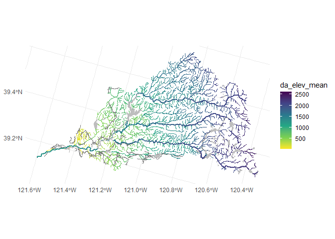<!-- -->

``` r
# plot showing drainage area
flowlines |> 
  st_zm() |>
  filter(gnis_name %in% c("Yuba River", "South Yuba River", "Middle Yuba River", "North Yuba River")) |>
  ggplot() + 
  geom_sf(data=st_zm(flowlines), aes(color = da_area_sq_km)) +
  geom_sf(aes(color = da_area_sq_km), linewidth=1) + 
  geom_sf(data=waterbodies, fill="gray", color="gray") +
  scale_color_viridis_c(direction=-1)
```

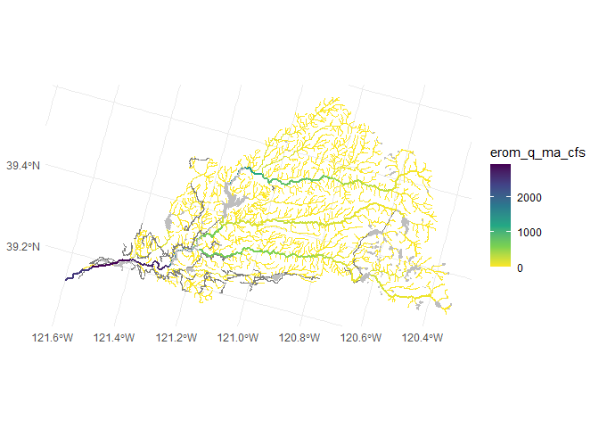<!-- -->

``` r
# plot showing stream order
flowlines |> 
  st_zm() |>
  filter(gnis_name %in% c("Yuba River", "South Yuba River", "Middle Yuba River", "North Yuba River")) |>
  ggplot() + 
  geom_sf(data=st_zm(flowlines), aes(color = stream_order)) +
  geom_sf(aes(color = stream_order), linewidth=1) + 
  geom_sf(data=waterbodies, fill="gray", color="gray") +
  scale_color_viridis_c(direction=-1)
```

<!-- -->

``` r
# plot showing mean annual precip at local reach location
flowlines |> 
  st_zm() |>
  filter(gnis_name %in% c("Yuba River", "South Yuba River", "Middle Yuba River", "North Yuba River")) |>
  ggplot() + 
  geom_sf(data=st_zm(flowlines), aes(color = loc_ppt_mean_mm)) +
  geom_sf(aes(color = loc_ppt_mean_mm), linewidth=1) + 
  geom_sf(data=waterbodies, fill="gray", color="gray") +
  scale_color_viridis_c(direction=-1)
```

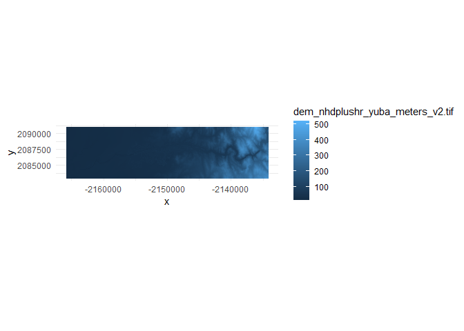<!-- -->

``` r
# plot showing mean annual precip in upstream drainage area
flowlines |> 
  st_zm() |>
  filter(gnis_name %in% c("Yuba River", "South Yuba River", "Middle Yuba River", "North Yuba River")) |>
  ggplot() + 
  geom_sf(data=st_zm(flowlines), aes(color = da_ppt_mean_mm)) +
  geom_sf(aes(color = da_ppt_mean_mm), linewidth=1) + 
  geom_sf(data=waterbodies, fill="gray", color="gray") +
  scale_color_viridis_c(direction=-1)
```

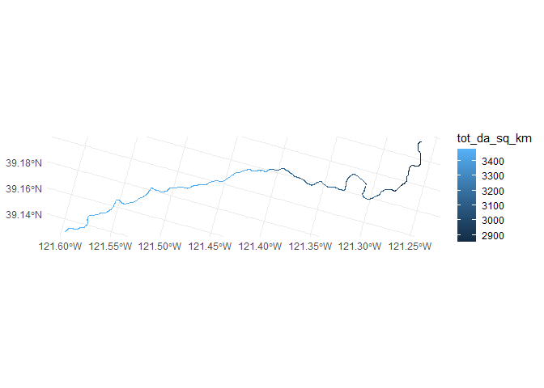<!-- -->

``` r
# plot showing mean elevation of upstream drainage area
flowlines |> 
  st_zm() |>
  filter(gnis_name %in% c("Yuba River", "South Yuba River", "Middle Yuba River", "North Yuba River")) |>
  ggplot() + 
  geom_sf(data=st_zm(flowlines), aes(color = da_elev_mean)) +
  geom_sf(aes(color = da_elev_mean), linewidth=1) + 
  geom_sf(data=waterbodies, fill="gray", color="gray") +
  scale_color_viridis_c(direction=-1)
```

<!-- -->

``` r
# plot showing EROM flow estimates
flowlines |> 
  st_zm() |>
  filter(gnis_name %in% c("Yuba River", "South Yuba River", "Middle Yuba River", "North Yuba River")) |>
  ggplot() + 
  geom_sf(data=st_zm(flowlines), aes(color = erom_q_ma_cfs)) +
  geom_sf(aes(color = erom_q_ma_cfs), linewidth=1) + 
  geom_sf(data=waterbodies, fill="gray", color="gray") +
  scale_color_viridis_c(direction=-1)
```

<!-- -->

``` r
# plot showing EROM velocity estimates
flowlines |> 
  st_zm() |>
  filter(gnis_name %in% c("Yuba River", "South Yuba River", "Middle Yuba River", "North Yuba River")) |>
  ggplot() + 
  geom_sf(data=st_zm(flowlines), aes(color = erom_v_ma_fps)) +
  geom_sf(aes(color = erom_v_ma_fps), linewidth=1) + 
  geom_sf(data=waterbodies, fill="gray", color="gray") +
  scale_color_viridis_c(direction=-1)
```

<!-- -->

``` r
# plot showing sinuousity estimates
flowlines |> 
  st_zm() |>
  filter(gnis_name %in% c("Yuba River", "South Yuba River", "Middle Yuba River", "North Yuba River")) |>
  ggplot() + 
  geom_sf(data=st_zm(flowlines), aes(color = sinuosity)) +
  geom_sf(aes(color = sinuosity), linewidth=1) + 
  geom_sf(data=waterbodies, fill="gray", color="gray") +
  scale_color_viridis_c(direction=-1)
```

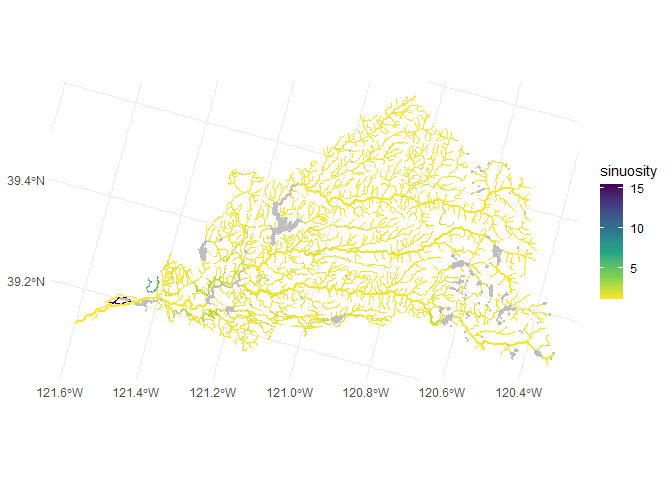<!-- -->

``` r
# plot showing sinuousity estimates
flowlines |> 
  st_zm() |>
  filter(gnis_name %in% c("Yuba River", "South Yuba River", "Middle Yuba River", "North Yuba River")) |>
  ggplot() + 
  geom_sf(data=st_zm(flowlines), aes(color = sinuosity)) +
  geom_sf(aes(color = sinuosity), linewidth=1) + 
  geom_sf(data=waterbodies, fill="gray", color="gray") +
  scale_color_viridis_c(direction=-1)
```

<!-- -->

``` r
# plot showing bankfull width
flowlines |> 
  st_zm() |>
  filter(gnis_name %in% c("Yuba River", "South Yuba River", "Middle Yuba River", "North Yuba River")) |>
  ggplot() + 
  geom_sf(data=st_zm(flowlines), aes(color = bf_width_m)) +
  geom_sf(aes(color = bf_width_m), linewidth=1) + 
  geom_sf(data=waterbodies, fill="gray", color="gray") +
  scale_color_viridis_c(direction=-1)
```

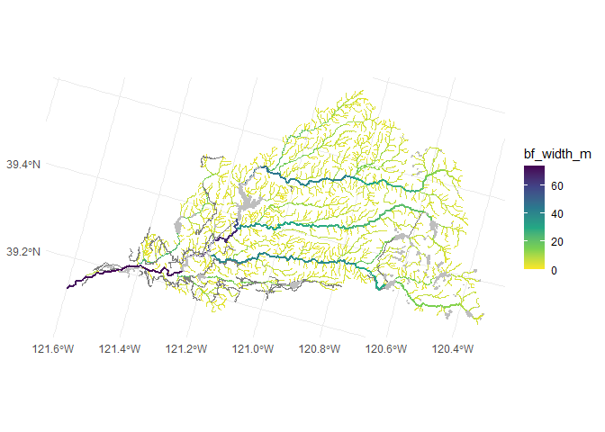<!-- -->

``` r
# plot showing bankfull width/depth ratio
flowlines |> 
  st_zm() |>
  filter(gnis_name %in% c("Yuba River", "South Yuba River", "Middle Yuba River", "North Yuba River")) |>
  ggplot() + 
  geom_sf(data=st_zm(flowlines), aes(color = bf_w_d_ratio)) +
  geom_sf(aes(color = bf_w_d_ratio), linewidth=1) + 
  geom_sf(data=waterbodies, fill="gray", color="gray") +
  scale_color_viridis_c(direction=-1)
```

<!-- -->

``` r
# plot showing local soil erodibility
flowlines |> 
  st_zm() |>
  filter(gnis_name %in% c("Yuba River", "South Yuba River", "Middle Yuba River", "North Yuba River")) |>
  ggplot() + 
  geom_sf(data=st_zm(flowlines), aes(color = loc_k_erodibility)) +
  geom_sf(aes(color = loc_k_erodibility), linewidth=1) + 
  geom_sf(data=waterbodies, fill="gray", color="gray") +
  scale_color_viridis_c(direction=-1)
```

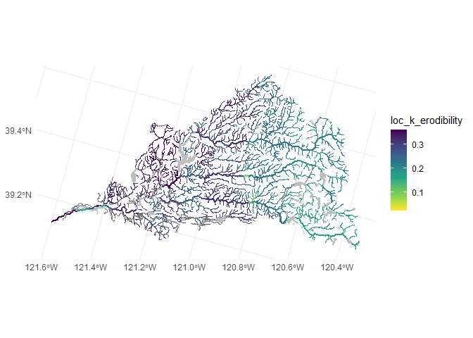<!-- -->

``` r
# plot showing local soil depth to bedrock
flowlines |> 
  st_zm() |>
  filter(gnis_name %in% c("Yuba River", "South Yuba River", "Middle Yuba River", "North Yuba River")) |>
  ggplot() + 
  geom_sf(data=st_zm(flowlines), aes(color = loc_bedrock_depth)) +
  geom_sf(aes(color = loc_bedrock_depth), linewidth=1) + 
  geom_sf(data=waterbodies, fill="gray", color="gray") +
  scale_color_viridis_c(direction=-1)
```

<!-- -->

``` r
# plot showing local topographic wetness index
flowlines |> 
  st_zm() |>
  filter(gnis_name %in% c("Yuba River", "South Yuba River", "Middle Yuba River", "North Yuba River")) |>
  ggplot() + 
  geom_sf(data=st_zm(flowlines), aes(color = loc_twi)) +
  geom_sf(aes(color = loc_twi), linewidth=1) + 
  geom_sf(data=waterbodies, fill="gray", color="gray") +
  scale_color_viridis_c(direction=-1)
```

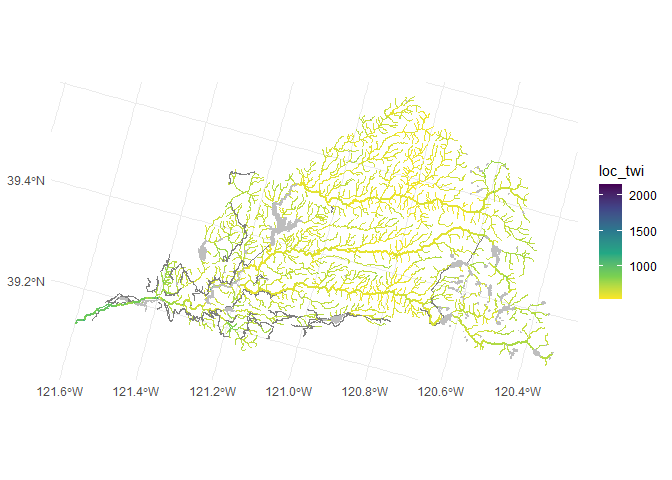<!-- -->

``` r
# plot showing local baseflow index (ratio of baseflow to total flow)
flowlines |> 
  st_zm() |>
  filter(gnis_name %in% c("Yuba River", "South Yuba River", "Middle Yuba River", "North Yuba River")) |>
  ggplot() + 
  geom_sf(data=st_zm(flowlines), aes(color = loc_bfi)) +
  geom_sf(aes(color = loc_bfi), linewidth=1) + 
  geom_sf(data=waterbodies, fill="gray", color="gray") +
  scale_color_viridis_c(direction=-1)
```

<!-- -->

``` r
# plot showing NDVI
flowlines |> 
  st_zm() |>
  filter(gnis_name %in% c("Yuba River", "South Yuba River", "Middle Yuba River", "North Yuba River")) |>
  ggplot() + 
  geom_sf(data=st_zm(flowlines), aes(color = mean_ndvi)) +
  geom_sf(aes(color = mean_ndvi), linewidth=1) + 
  geom_sf(data=waterbodies, fill="gray", color="gray") +
  scale_color_viridis_c(direction=-1)
```

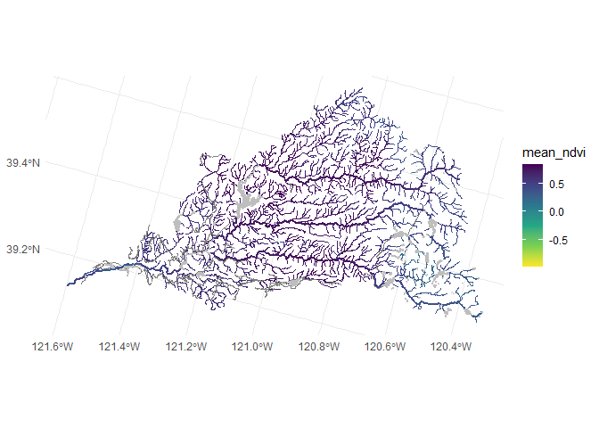<!-- -->

``` r
# plot showing theoretical grain size mobilized
flowlines |> 
  st_zm() |>
  filter(gnis_name %in% c("Yuba River", "South Yuba River", "Middle Yuba River", "North Yuba River")) |>
  ggplot() + 
  geom_sf(data=st_zm(flowlines), aes(color = grain_size_mobilized_mm)) +
  geom_sf(aes(color = grain_size_mobilized_mm), linewidth=1) + 
  geom_sf(data=waterbodies, fill="gray", color="gray") +
  scale_color_viridis_c(direction=-1, trans="log2")
```

<!-- -->

### Import catchments

``` r
# local catchment associated with each flowline reach (COMID)
catchments <- 
  st_read("nhdplus/Catchment.shp") |> 
  janitor::clean_names() |>
  mutate(comid = as.numeric(featureid)) |>
  inner_join(flowlines |> st_drop_geometry() |> select(comid)) |>
  arrange(comid) |>
  st_transform(project_crs) 
```

    ## Reading layer `Catchment' from data source 
    ##   `C:\Users\skylerlewis\Github\swc-habitat-suitability\data-raw\nhdplus\Catchment.shp' 
    ##   using driver `ESRI Shapefile'
    ## Simple feature collection with 140835 features and 4 fields
    ## Geometry type: MULTIPOLYGON
    ## Dimension:     XY
    ## Bounding box:  xmin: -124.4098 ymin: 32.13295 xmax: -114.6198 ymax: 43.34269
    ## Geodetic CRS:  NAD83

    ## Joining with `by = join_by(comid)`

``` r
# examples
ggplot() + geom_sf(data = catchments, color="orange") + 
  geom_sf(data = watersheds, color="red", fill=NA) + 
  geom_sf(data = st_zm(flowlines), color="blue") 
```

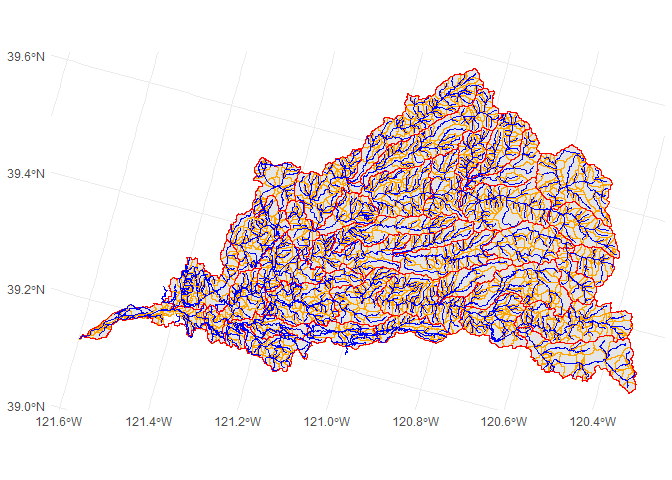<!-- -->

## DEM

### 1m CA NoCAL Wildfires B2 2018

Not generalizable/automatable

<https://rockyweb.usgs.gov/vdelivery/Datasets/Staged/Elevation/LPC/Projects/CA_NoCAL_3DEP_Supp_Funding_2018_D18/CA_NoCAL_Wildfires_B2_2018/>

<https://prd-tnm.s3.amazonaws.com/index.html?prefix=StagedProducts/Elevation/OPR/Projects/CA_NoCAL_Wildfires_B2_2018>

<https://prd-tnm.s3.amazonaws.com/index.html?prefix=StagedProducts/Elevation/metadata/CA_NoCAL_3DEP_Supp_Funding_2018_D18/CA_NoCAL_Wildfires_B2_2018>

### 10m NHDPlusHR DEM

``` r
dem <- read_stars("nhdplushr/dem_nhdplushr_yuba_meters_v2.tif") |>
  rename(elev = dem_nhdplushr_yuba_meters_v2.tif)
# this input has already been clipped to the AOI, converted from cm to m, and crs redefined
ggplot() + geom_stars(data=dem) + coord_fixed()
```

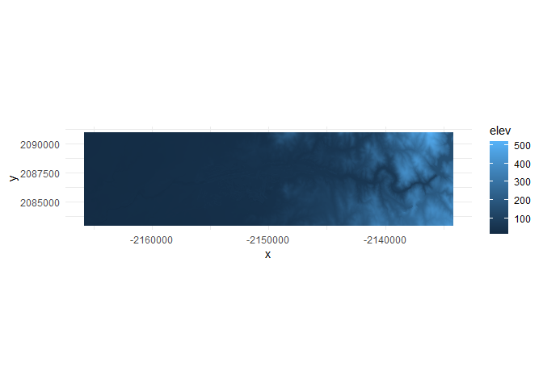<!-- -->

Calculate slope

``` r
slope <- dem |> starsExtra::slope()
#slope <- dem |> terra::rast() |> terra::slope()
ggplot() + geom_stars(data=slope) + coord_fixed()
```

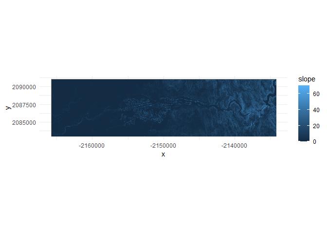<!-- -->

## Lithology

<https://pubs.usgs.gov/ds/425/>

## Confinement

### mTPI as a measure of topographic confinement

Theobald DM, Harrison-Atlas D, Monahan WB, Albano CM. 2015.
Ecologically-relevant maps of landforms and physiographic diversity for
climate adaptation planning. PLOS ONE. DOI: 10.1371/journal.pone.0143619

``` r
dem_rast <- terra::rast(dem) 
cell_size <- 10 # mean(terra::res(dem_rast))
tpi_90 <- dem_rast - terra::focal(dem_rast, w=90/cell_size, fun="mean")
tpi_270 <- dem_rast - terra::focal(dem_rast, w=270/cell_size, fun="mean")
tpi_810 <- dem_rast - terra::focal(dem_rast, w=810/cell_size, fun="mean")
#tpi_2430 <- dem_rast - terra::focal(dem_rast, w=2430/cell_size, fun="mean")
mtpi <- terra::app(c(tpi_90, tpi_270, tpi_810), mean)
mtpi |> st_as_stars() |> plot()
```

    ## downsample set to 1

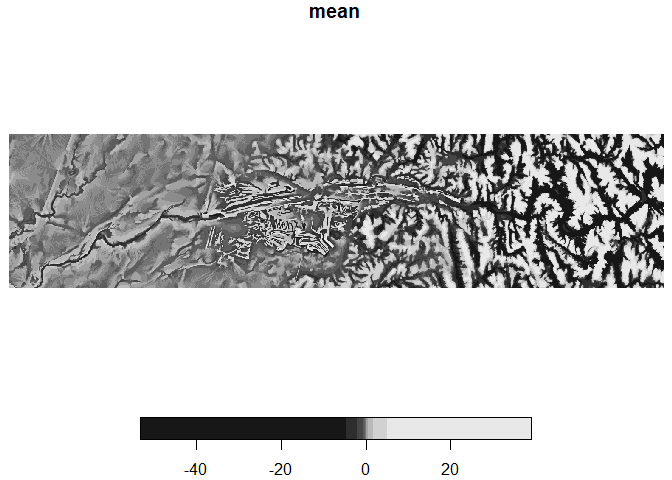<!-- -->

Apply TPI to datasets

``` r
#cat_vect <- terra::vect(catchments)
#vec_mtpi_min <- terra::zonal(mtpi, cat_vect, "min") |> rename(mtpi_min = mean)
#vec_mtpi_mean <- terra::zonal(mtpi, cat_vect, "mean") |> rename(mtpi_mean = mean)
#mtpi_comid <- catchments |> 
#  mutate(vec_mtpi_min, vec_mtpi_mean) |> 
#  st_drop_geometry() |> 
#  select(comid, mtpi_min, mtpi_mean) |>
#  filter(!is.nan(mtpi_min) & !is.nan(mtpi_mean))
#flowlines |>
#  inner_join(mtpi_comid) |>
#  st_zm() |>
#  ggplot() + 
#  geom_sf(aes(color = mtpi_min), linewidth=1) + 
#  scale_color_viridis_c(direction=-1)

flow_buffered <- terra::vect(flowlines) |> terra::buffer(width=50)
vec_mtpi_min <- terra::zonal(mtpi, flow_buffered, "min") |> rename(mtpi_min = mean)
#vec_mtpi_mean <- terra::zonal(mtpi, flow_buffered, "mean") |> rename(mtpi_mean = mean)
mtpi_comid <- flowlines |>
  select(comid) |>
  mutate(vec_mtpi_min) |>#, vec_mtpi_mean) |> 
  st_drop_geometry() |> 
  select(comid, mtpi_min) |> #, mtpi_mean) |>
  filter(!is.nan(mtpi_min))# & !is.nan(mtpi_mean))
flowlines |>
  inner_join(mtpi_comid) |>
  st_zm() |>
  ggplot() + 
  #geom_stars(data=st_as_stars(mtpi)) +
  geom_sf(aes(color = mtpi_min), linewidth=1) + 
  scale_color_viridis_c(direction=-1)
```

    ## Joining with `by = join_by(comid)`

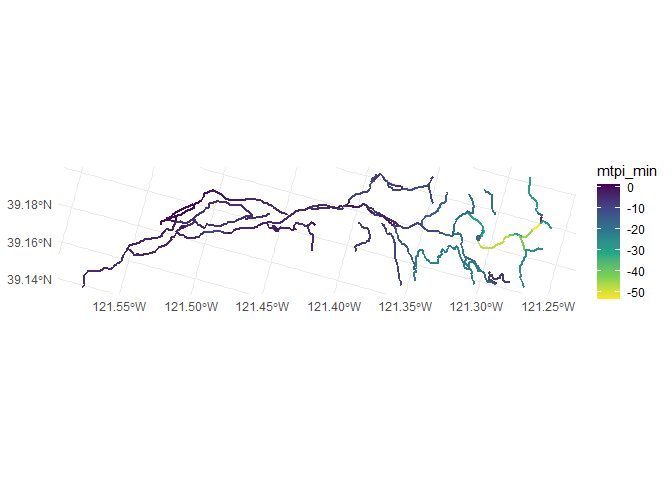<!-- -->

### Catchment slope cutoff method

Method described in
<https://watermanagement.ucdavis.edu/download_file/view_inline/144>

``` r
#slope <- dem |> starsExtra::slope()
#valley_bottom_test <- slope |>
#  mutate(valley_bottom = if_else(slope<units::set_units(atan(0.25)*180/pi,"degrees"), 1, 0)) |>
#  select(valley_bottom)

valley_bottom <- function(catchment, flowline, dem) {
  dem |> 
    st_crop(catchment) |> 
    starsExtra::slope() |>
    mutate(valley_bottom = if_else(slope<units::set_units(atan(0.25)*180/pi,"degrees"), 1, NA)) |>
    select(valley_bottom) |>
    st_as_sf(merge=TRUE) |>
    st_filter(st_zm(flowline))
}

valley_bottom_by_comid <- function(x) {
  c <- catchments |> filter(comid==x)
  f <- flowlines |> filter(comid==x)
  valley_bottom(c, f, dem)
}

valley_width <- function(geom_valley_bottom) {
   geom_valley_bottom |> 
    terra::vect() |> 
    terra::width()
}

#TEST
catchment <- catchments |> filter(comid==8062593)
flowline <- flowlines |> filter(comid==8062593)
ggplot() + 
  #geom_stars(data=catchment_confinement(catchment, flowline, dem)) + 
  geom_sf(data=valley_bottom(catchment, flowline, dem)) +
  geom_sf(data=st_zm(flowline))
```

<!-- -->

``` r
valley_width(valley_bottom(catchment, flowline, dem))
```

    ## [1] 666.9869

``` r
#flowlines |>
#  rename(geometry_flowline = geometry) |>
#  left_join(catchments |> select(comid, geometry_catchment = geometry) |> as.data.frame(), by = join_by(comid)) |>
#  mutate(valley_bottom_width = pmap_dbl(c(as.list.data.frame(geometry_catchment), as.list.data.frame(geometry_flowline)), function(c,f) valley_width(valley_bottom(c, f, dem))))

valley_bottoms <- flowlines |> head(10) |>
  st_drop_geometry() |>
  mutate(valley_bottom_geoms = map(comid, possibly(function(x) valley_bottom_by_comid(x), otherwise=NA))) |>
  #mutate(is_empty = map(valley_bottom_geoms, st_is_empty)) |>
  #unnest(is_empty) |>
  #filter(!is_empty) |>
  #mutate(geometry = valley_bottom_geoms |> bind_rows()) |>
  #st_as_sf() |>
  mutate(valley_bottom_width = map(valley_bottom_geoms, possibly(function(x) valley_width(x), otherwise=NA))) 
```

    ## Warning: There was 1 warning in `mutate()`.
    ## ℹ In argument: `valley_bottom_geoms = map(comid, possibly(function(x)
    ##   valley_bottom_by_comid(x), otherwise = NA))`.
    ## Caused by warning in `st_crop.stars()`:
    ## ! st_crop: bounding boxes of x and y do not overlap

    ## Warning: There were 4 warnings in `mutate()`.
    ## The first warning was:
    ## ℹ In argument: `valley_bottom_width = map(...)`.
    ## Caused by warning:
    ## ! [SpatVector from sf] empty SpatVector
    ## ℹ Run `dplyr::last_dplyr_warnings()` to see the 3 remaining warnings.

``` r
valley_bottoms
```

    ##      comid      reachcode gnis_id  gnis_name lengthkm          ftype fcode
    ## 1  7983198 18020125035586  238295 Yuba River    0.091 ArtificialPath 55800
    ## 2  7982918 18020125035586  238295 Yuba River    0.585 ArtificialPath 55800
    ## 3  7981882 18020125035586  238295 Yuba River    0.246    StreamRiver 46006
    ## 4  7982916 18020125035586  238295 Yuba River    0.925 ArtificialPath 55800
    ## 5  7981880 18020125035586  238295 Yuba River    0.327    StreamRiver 46006
    ## 6  7982914 18020125035586  238295 Yuba River    0.212 ArtificialPath 55800
    ## 7  7981878 18020125035586  238295 Yuba River    0.061    StreamRiver 46006
    ## 8  7982912 18020125035586  238295 Yuba River    0.606 ArtificialPath 55800
    ## 9  7981874 18020125035586  238295 Yuba River    0.161    StreamRiver 46006
    ## 10 7982910 18020125035586  238295 Yuba River    0.488 ArtificialPath 55800
    ##       huc_8     huc_10       huc_12      ftype_desc hydro_seq     reach_code
    ## 1  18020125 1802012503 180201250355 Artificial Path  10004596 18020125035586
    ## 2  18020125 1802012503 180201250355 Artificial Path  10004611 18020125035586
    ## 3  18020125 1802012503 180201250355    Stream/River  10004630 18020125035586
    ## 4  18020125 1802012503 180201250355 Artificial Path  10004648 18020125035586
    ## 5  18020125 1802012503 180201250355    Stream/River  10004666 18020125035586
    ## 6  18020125 1802012503 180201250355 Artificial Path  10004688 18020125035586
    ## 7  18020125 1802012503 180201250355    Stream/River  10004709 18020125035586
    ## 8  18020125 1802012503 180201250355 Artificial Path  10004728 18020125035586
    ## 9  18020125 1802012503 180201250355    Stream/River  10004744 18020125035586
    ## 10 18020125 1802012503 180201250355 Artificial Path  10004760 18020125035586
    ##    stream_level stream_order us_length_km ds_length_km da_area_sq_km
    ## 1             3            5     2989.574      169.036      3475.218
    ## 2             3            5     2989.483      169.127      3475.197
    ## 3             3            5     2988.898      169.712      3475.097
    ## 4             3            5     2988.652      169.958      3475.036
    ## 5             3            5     2987.727      170.883      3474.732
    ## 6             3            5     2987.400      171.210      3474.597
    ## 7             3            5     2987.188      171.422      3469.237
    ## 8             3            5     2987.127      171.483      3468.715
    ## 9             3            5     2986.521      172.089      3468.495
    ## 10            3            5     2986.360      172.250      3468.430
    ##    reach_length_km      slope elev_min elev_max stream_power da_ppt_mean_mm
    ## 1            0.091 0.00001000    14.53    14.53   0.03475218       1614.225
    ## 2            0.585 0.00051282    14.53    14.83   1.78215053       1614.231
    ## 3            0.246 0.00001000    14.83    14.83   0.03475097       1614.262
    ## 4            0.925 0.00001000    14.83    14.83   0.03475036       1614.280
    ## 5            0.327 0.00001000    14.83    14.83   0.03474732       1614.373
    ## 6            0.212 0.01669811    14.83    18.37  58.01919790       1614.414
    ## 7            0.061 0.00001000    18.37    18.37   0.03469237       1616.030
    ## 8            0.606 0.00001000    18.37    18.37   0.03468715       1616.188
    ## 9            0.161 0.00001000    18.37    18.37   0.03468495       1616.255
    ## 10           0.488 0.00001000    18.37    18.37   0.03468430       1616.275
    ##    loc_ppt_mean_mm vogel_q_ma_cfs vogel_v_ma_fps erom_q_ma_cfs erom_v_ma_fps
    ## 1          557.569       4250.488        1.13926      2468.201       1.10347
    ## 2          557.660       4250.504        1.86226      2468.197       1.79533
    ## 3          557.679       4250.581        1.13925      2468.177       1.10346
    ## 4          558.635       4250.629        1.13925      2468.165       1.10346
    ## 5          559.946       4250.863        1.13924      2468.105       1.10345
    ## 6          568.497       4250.967        3.01189      2468.077       2.89541
    ## 7          562.583       4255.032        1.13912      2466.971       1.10323
    ## 8          560.449       4255.434        1.13910      2466.866       1.10321
    ## 9          560.460       4255.604        1.13910      2466.822       1.10320
    ## 10         563.379       4255.655        1.13910      2466.809       1.10320
    ##    sinuosity da_avg_slope da_elev_mean da_elev_min da_elev_max da_elev_rel
    ## 1       1.00        27.82      1277.57       12.65     2757.74     2745.09
    ## 2       1.01        27.82      1277.58       12.65     2757.74     2745.09
    ## 3       1.03        27.82      1277.61       12.65     2757.74     2745.09
    ## 4       1.07        27.82      1277.64       12.65     2757.74     2745.09
    ## 5       1.01        27.82      1277.75       13.40     2757.74     2744.34
    ## 6       1.07        27.82      1277.80       14.16     2757.74     2743.58
    ## 7       1.00        27.87      1279.73       14.20     2757.74     2743.54
    ## 8       1.06        27.87      1279.92       14.20     2757.74     2743.54
    ## 9       1.00        27.87      1280.00       14.32     2757.74     2743.42
    ## 10      1.12        27.87      1280.03       14.32     2757.74     2743.42
    ##    loc_bfi  da_bfi   loc_twi   da_twi loc_pct_clay da_pct_clay loc_pct_sand
    ## 1  35.0000 54.8311  892.0000 667.8799      20.0200     19.7876      34.5000
    ## 2  35.0000 54.8313  974.6036 667.8785      20.0200     19.7876      34.5000
    ## 3  35.0000 54.8318  955.8529 667.8697      20.0200     19.7876      34.5135
    ## 4  35.0000 54.8322  974.8580 667.8646      20.0200     19.7876      34.5000
    ## 5  35.0000 54.8339  919.0533 667.8378      20.0200     19.7876      34.5065
    ## 6  35.0002 54.8347 1114.4786 667.8280      20.8052     19.7876      36.1211
    ## 7  35.0000 54.8653 1099.6466 667.1380      20.0200     19.7860      34.5815
    ## 8  35.0000 54.8683  853.5020 667.0729      20.0200     19.7860      34.5547
    ## 9  35.0000 54.8696  893.7917 667.0610      20.0200     19.7860      34.5000
    ## 10 35.0000 54.8699  898.5104 667.0568      20.0200     19.7860      34.5273
    ##    da_pct_sand loc_permeability loc_bedrock_depth da_permeability
    ## 1      41.4413           7.3700          150.8700          6.4252
    ## 2      41.4413           7.3700          150.8700          6.4252
    ## 3      41.4415           7.3700          150.8700          6.4251
    ## 4      41.4417           7.3700          150.8700          6.4251
    ## 5      41.4423           7.3700          150.8700          6.4250
    ## 6      41.4426           6.5985          150.7316          6.4250
    ## 7      41.4508           7.3700          150.8700          6.4247
    ## 8      41.4519           7.3700          150.8700          6.4246
    ## 9      41.4523           7.3700          150.8700          6.4245
    ## 10     41.4524           7.3700          150.8700          6.4245
    ##    da_bedrock_depth loc_k_erodibility da_k_erodibility loc_precip da_precip
    ## 1          106.2929            0.3600           0.2509   547.0807  1588.995
    ## 2          106.2926            0.3600           0.2509   547.1399  1589.001
    ## 3          106.2913            0.3600           0.2509   549.1356  1589.031
    ## 4          106.2905            0.3600           0.2509   549.0496  1589.050
    ## 5          106.2866            0.3600           0.2509   549.8961  1589.141
    ## 6          106.2848            0.3594           0.2509   557.7352  1589.181
    ## 7          106.2157            0.3600           0.2507   553.0782  1590.774
    ## 8          106.2089            0.3600           0.2507   552.1675  1590.931
    ## 9          106.2060            0.3556           0.2507   553.3683  1590.997
    ## 10         106.2052            0.3584           0.2507   555.5640  1591.016
    ##    loc_runoff da_runoff bf_width_m bf_depth_m bf_w_d_ratio mean_ndvi bf_xarea_m
    ## 1    562.0000  734.3881      70.04       3.46     20.24277 0.4065721   242.3384
    ## 2    514.3874  734.3891      69.26       2.83     24.47350 0.4352609   196.0058
    ## 3    411.0000  734.3954      70.07       3.46     20.25145 0.3692269   242.4422
    ## 4    422.6154  734.4011      70.07       3.46     20.25145 0.2748678   242.4422
    ## 5    415.0267  734.4284      70.07       3.46     20.25145 0.3423697   242.4422
    ## 6    445.6628  734.4408      68.59       2.76     24.85145 0.5177779   189.3084
    ## 7    411.0000  734.8869      70.39       3.46     20.34393 0.5132347   243.5494
    ## 8    411.0000  734.9357      70.18       3.46     20.28324 0.4962265   242.8228
    ## 9    444.5556  734.9563      70.18       3.46     20.28324 0.5186082   242.8228
    ## 10   423.3216  734.9617      70.18       3.46     20.28324 0.4753110   242.8228
    ##    velocity_m_s wetted_perimeter_m hydraulic_radius_m critical_shields_number
    ## 1      3.620308              76.96           3.148888              0.00843512
    ## 2      5.890190              74.92           2.616201              0.02257265
    ## 3      3.620276              76.99           3.149009              0.00843512
    ## 4      3.620276              76.99           3.149009              0.00843512
    ## 5      3.620243              76.99           3.149009              0.00843512
    ## 6      9.499377              74.11           2.554425              0.05392102
    ## 7      3.619521              77.31           3.150296              0.00843512
    ## 8      3.619455              77.10           3.149453              0.00843512
    ## 9      3.619423              77.10           3.149453              0.00843512
    ## 10     3.619423              77.10           3.149453              0.00843512
    ##    grain_size_mobilized_mm shear_velocity_cm_s settling_velocity_ndim
    ## 1               0.02262466            1.757572           3.354180e-01
    ## 2               0.36022153           11.472354           9.328348e+01
    ## 3               0.02262553            1.757606           3.354373e-01
    ## 4               0.02262553            1.757606           3.354373e-01
    ## 5               0.02262553            1.757606           3.354373e-01
    ## 6               4.79422439           64.686656           1.672211e+04
    ## 7               0.02263478            1.757965           3.356430e-01
    ## 8               0.02262871            1.757730           3.355082e-01
    ## 9               0.02262871            1.757730           3.355082e-01
    ## 10              0.02262871            1.757730           3.355082e-01
    ##    grain_size_suspended_ndim grain_size_suspended_mm
    ## 1                   44.22847             0.003766902
    ## 2                  737.58337             0.062819354
    ## 3                   44.22975             0.003767010
    ## 4                   44.22975             0.003767010
    ## 5                   44.22975             0.003767010
    ## 6                 9875.39167             0.841078785
    ## 7                   44.24331             0.003768165
    ## 8                   44.23442             0.003767408
    ## 9                   44.23442             0.003767408
    ## 10                  44.23442             0.003767408
    ##                                                                                                                                                                                                                                                                                                                                                                                                                                                                                                                                                                                                                                                                                                                                                                                                                                                                                                                                                                                                                                                                                                                                                                                                                                                                                                                                                                                                                                                                                                                                                                                                                                                                                                                                                                                                                                                                                                                                                                                                                                                                                                                                                                                                                                                                                                                                                                                                                                                                                                                                                                                                                                                                                                                                                                                                                                                                                                                                                                                                                                                                                                                                                                                                                                                                                                                                                                                                                                                                                                                                                                                                                                                                                                                                                                                                                                                                                                                                                                                                                                                                                                                                                                                                                                                                                                                                                                                                                                                                                                                                                                                                                                                                                                                                                                                                                                                                                                                                                                                                                                                                                                                                                                                                                                                                                                                                                                                                                                                                                                                                                                                                                                                                                                                                                                                                                                                                                                                                                                                                                                                                                                                                       valley_bottom_geoms
    ## 1                                                                                                                                                                                                                                                                                                                                                                                                                                                                                                                                                                                                                                                                                                                                                                                                                                                                                                                                                                                                                                                                                                                                                                                                                                                                                                                                                                                                                                                                                                                                                                                                                                                                                                                                                                                                                                                                                                                                                                                                                                                                                                                                                                                                                                                                                                                                                                                                                                                                                                                                                                                                                                                                                                                                                                                                                                                                                                                                                                                                                                                                                                                                                                                                                                                                                                                                                                                                                                                                                                                                                                                                                                                                                                                                                                                                                                                                                                                                                                                                                                                                                                                                                                                                                                                                                                                                                                                                                                                                                                                                                                                                                                                                                                                                                                                                                                                                                                                                                                                                                                                                                                                                                                                                                                                                                                                                                                                                                                                                                                                                                                                                                                                                                                                                                                                                                                                                                                                                                                                                                                                                                                                                                        
    ## 2                                                                                                                                                                                                                                                                                                                                                                                                                                                                                                                                                                                                                                                                                                                                                                                                                                                                                                                                                                                                                                                                                                                                                                                                                                                                                                                                                                                                                                                                                                                                                                                                                                                                                                                                                                                                                                                                                                                                                                                                                                                                                                                                                                                                                                                                                                                                                                                                                                                                                                                                                                                                                                                                                                                                                                                                                                                                                                                                                                                                                                                                                                                                                                                                                                                                                                                                                                                                                                                                                                                                                                                                                                                                                                                                                                                                                                                                                                                                                                                                                                                                                                                                                                                                                                                                                                                                                                                                                                                                                                                                                                                                                                                                                                                                                                                                                                                                                                                                                                                                                                                                                                                                                                                                                                                                                                                                                                                                                                                                                                                                                                                                                                                                                                                                        1, -2165737, -2165727, -2165727, -2165637, -2165637, -2165607, -2165607, -2165637, -2165637, -2165697, -2165697, -2165727, -2165727, -2165817, -2165817, -2165797, -2165797, -2165767, -2165767, -2165737, -2165737, 2083172, 2083172, 2083142, 2083142, 2083112, 2083112, 2083102, 2083102, 2083072, 2083072, 2083012, 2083012, 2082982, 2082982, 2083082, 2083082, 2083112, 2083112, 2083142, 2083142, 2083172
    ## 3                                                                                                                                                                                                                                                                                                                                                                                                                                                                                                                                                                                                                                                                                                                                                                                                                                                                                                                                                                                                                                                                                                                                                                                                                                                                                                                                                                                                                                                                                                                                                                                                                                                                                                                                                                                                                                                                                                                                                                                                                                                                                                                                                                                                                                                                                                                                                                                                                                                                                                                                                                                                                                                                                                                                                                                                                                                                                                                                                                                                                                                                                                                                                                                                                                                                                                                                                                                                                                                                                                                                                                                                                                                                                                                                                                                                                                                                                                                                                                                                                                                                                                                                                                                                                                                                                                                                                                                                                                                                                                                                                                                                                                                                                                                                                                                                                                                                                                                                                                                                                                                                                                                                                                                                                                                                                                                                                                                                                                                                                                                                                                                1, -2165557, -2165517, -2165517, -2165487, -2165487, -2165547, -2165547, -2165617, -2165617, -2165707, -2165707, -2165677, -2165677, -2165647, -2165647, -2165617, -2165617, -2165587, -2165587, -2165557, -2165557, -2165527, -2165527, -2165557, -2165557, -2165587, -2165587, -2165557, -2165557, 2083562, 2083562, 2083532, 2083532, 2083162, 2083162, 2083132, 2083132, 2083162, 2083162, 2083232, 2083232, 2083262, 2083262, 2083292, 2083292, 2083322, 2083322, 2083352, 2083352, 2083382, 2083382, 2083462, 2083462, 2083522, 2083522, 2083532, 2083532, 2083562
    ## 4                                                                                                                                                                                                                                                                                                                                                                                                                                                                                                                                                                                                                                                                                                                                                                                                                                                                                                                                                                                                                                                                                                                                                                                                                                                                                                                                                                                                                                                                                                                                                                                                                                                                                                                                                                                                                                                                                                                                                                                                                                                                                                                                                                                                                                                                                                                                                                                                                                                                                                                                                                                                                                                                                                                                                                                                                                                                                                                                                                                                                                                                                                                                                                                                                                                                                                                                                                                                                                                                                                                                                                                                                                                                                                                                                                                                                                                                                                                                                                                                                                                                                                                                                                                                                                                                                                                                                                                                                                                                                                                                                                                                                                                                                                                                                                                                                                                                                                                                                                                                                                                                                                        1, -2165467, -2165467, -2165377, -2165377, -2165347, -2165347, -2165197, -2165197, -2165107, -2165107, -2165077, -2165077, -2164947, -2164947, -2164807, -2164807, -2164747, -2164747, -2164717, -2164717, -2164437, -2164437, -2164467, -2164467, -2164497, -2164497, -2164527, -2164527, -2164557, -2164557, -2164587, -2164587, -2164657, -2164657, -2164747, -2164747, -2164807, -2164807, -2165007, -2165007, -2165157, -2165157, -2165247, -2165247, -2165307, -2165307, -2165367, -2165367, -2165397, -2165397, -2165457, -2165457, -2165467, 2083502, 2083192, 2083192, 2083162, 2083162, 2083132, 2083132, 2083102, 2083102, 2083072, 2083072, 2083042, 2083042, 2083072, 2083072, 2083042, 2083042, 2083012, 2083012, 2082982, 2082982, 2082992, 2082992, 2083022, 2083022, 2083082, 2083082, 2083112, 2083112, 2083202, 2083202, 2083382, 2083382, 2083352, 2083352, 2083322, 2083322, 2083292, 2083292, 2083322, 2083322, 2083352, 2083352, 2083382, 2083382, 2083412, 2083412, 2083442, 2083442, 2083472, 2083472, 2083502, 2083502
    ## 5                                                                                                                                                                                                                                                                                                                                                                                                                                                                                                                                                                                                                                                                                                                                                                                                                                                                                                                                                                                                                                                                                                                                                                                                                                                                                                                                                                                                                                                                                                                                                                                                                                                                                                                                                                                                                                                                                                                                                                                                                                                                                                                                                                                                                                                                                                                                                                                                                                                                                                                                                                                                                                                                                                                                                                                                                                                                                                                                                                                                                                                                                                                                                                                                                                                                                                                                                                                                                                                                                                                                                                                                                                                                                                                                                                                                                                                                                                                                                                                                                                                                                                                                                                                                                                                                                                                                                                                                                                                                                                                                                                                                                                                                                                                                                                                                                                                                                                                                                                                                                                                                                                                                                                                                                                                                                                                                                                                                                                                                                                                                          1, -2164507, -2164497, -2164497, -2164437, -2164437, -2164407, -2164407, -2164317, -2164317, -2164287, -2164287, -2164317, -2164317, -2164347, -2164347, -2164417, -2164417, -2164447, -2164447, -2164477, -2164477, -2164507, -2164507, -2164537, -2164537, -2164567, -2164567, -2164537, -2164537, -2164507, -2164507, 2083622, 2083622, 2083562, 2083562, 2083502, 2083502, 2083472, 2083472, 2083352, 2083352, 2083282, 2083282, 2083012, 2083012, 2082982, 2082982, 2083012, 2083012, 2083042, 2083042, 2083102, 2083102, 2083132, 2083132, 2083222, 2083222, 2083442, 2083442, 2083562, 2083562, 2083622
    ## 6  1, -2160067, -2159967, -2159967, -2159937, -2159937, -2159907, -2159907, -2159877, -2159877, -2159847, -2159847, -2159817, -2159817, -2159787, -2159787, -2159727, -2159727, -2159757, -2159757, -2159787, -2159787, -2159817, -2159817, -2159847, -2159847, -2159877, -2159877, -2159907, -2159907, -2159937, -2159937, -2159967, -2159967, -2159997, -2159997, -2160027, -2160027, -2160057, -2160057, -2160087, -2160087, -2160117, -2160117, -2160237, -2160237, -2160267, -2160267, -2160297, -2160297, -2160327, -2160327, -2160357, -2160357, -2160387, -2160387, -2160417, -2160417, -2160447, -2160447, -2160477, -2160477, -2160507, -2160507, -2160477, -2160477, -2160507, -2160507, -2160537, -2160537, -2160567, -2160567, -2160597, -2160597, -2160627, -2160627, -2160687, -2160687, -2160777, -2160777, -2160837, -2160837, -2160867, -2160867, -2160897, -2160897, -2160927, -2160927, -2160987, -2160987, -2164177, -2164177, -2164297, -2164297, -2164267, -2164267, -2164297, -2164297, -2164387, -2164387, -2164417, -2164417, -2164477, -2164477, -2164447, -2164447, -2164417, -2164417, -2164387, -2164387, -2164357, -2164357, -2164387, -2164387, -2164357, -2164357, -2164327, -2164327, -2164257, -2164257, -2164227, -2164227, -2164137, -2164137, -2164107, -2164107, -2164047, -2164047, -2164077, -2164077, -2164107, -2164107, -2164137, -2164137, -2164167, -2164167, -2164137, -2164137, -2164107, -2164107, -2164077, -2164077, -2164017, -2164017, -2163987, -2163987, -2163957, -2163957, -2163817, -2163817, -2163787, -2163787, -2163727, -2163727, -2163717, -2163717, -2163667, -2163667, -2163427, -2163427, -2163397, -2163397, -2163367, -2163367, -2163337, -2163337, -2163307, -2163307, -2163247, -2163247, -2163187, -2163187, -2163157, -2163157, -2163127, -2163127, -2163037, -2163037, -2163007, -2163007, -2162917, -2162917, -2162857, -2162857, -2162797, -2162797, -2162737, -2162737, -2162707, -2162707, -2162677, -2162677, -2162647, -2162647, -2162617, -2162617, -2162457, -2162457, -2162427, -2162427, -2162397, -2162397, -2162367, -2162367, -2162337, -2162337, -2162307, -2162307, -2162247, -2162247, -2162157, -2162157, -2162127, -2162127, -2162097, -2162097, -2162017, -2162017, -2161957, -2161957, -2161927, -2161927, -2161897, -2161897, -2161837, -2161837, -2161807, -2161807, -2161777, -2161777, -2161747, -2161747, -2161717, -2161717, -2161687, -2161687, -2161657, -2161657, -2161627, -2161627, -2161597, -2161597, -2161567, -2161567, -2161537, -2161537, -2161507, -2161507, -2161477, -2161477, -2161447, -2161447, -2161387, -2161387, -2161107, -2161107, -2161077, -2161077, -2161107, -2161107, -2161077, -2161077, -2161017, -2161017, -2160987, -2160987, -2160817, -2160817, -2160787, -2160787, -2160727, -2160727, -2160697, -2160697, -2160667, -2160667, -2160547, -2160547, -2160517, -2160517, -2160487, -2160487, -2160477, -2160477, -2160447, -2160447, -2160477, -2160477, -2160447, -2160447, -2160387, -2160387, -2160357, -2160357, -2160247, -2160247, -2160217, -2160217, -2160187, -2160187, -2160157, -2160157, -2160187, -2160187, -2160157, -2160157, -2160127, -2160127, -2160097, -2160097, -2160067, -2160067, 2085092, 2085092, 2085002, 2085002, 2084972, 2084972, 2084852, 2084852, 2084822, 2084822, 2084762, 2084762, 2084732, 2084732, 2084672, 2084672, 2084662, 2084662, 2084632, 2084632, 2084602, 2084602, 2084542, 2084542, 2084512, 2084512, 2084482, 2084482, 2084452, 2084452, 2084392, 2084392, 2084332, 2084332, 2084302, 2084302, 2084242, 2084242, 2084182, 2084182, 2084152, 2084152, 2084092, 2084092, 2084062, 2084062, 2084032, 2084032, 2084002, 2084002, 2083972, 2083972, 2083942, 2083942, 2083882, 2083882, 2083822, 2083822, 2083762, 2083762, 2083702, 2083702, 2083532, 2083532, 2083492, 2083492, 2083462, 2083462, 2083402, 2083402, 2083372, 2083372, 2083312, 2083312, 2083282, 2083282, 2083252, 2083252, 2083222, 2083222, 2083132, 2083132, 2083102, 2083102, 2083042, 2083042, 2083012, 2083012, 2082982, 2082982, 2083012, 2083012, 2083262, 2083262, 2083372, 2083372, 2083492, 2083492, 2083522, 2083522, 2083582, 2083582, 2083712, 2083712, 2083802, 2083802, 2083862, 2083862, 2083922, 2083922, 2083972, 2083972, 2084012, 2084012, 2084162, 2084162, 2084192, 2084192, 2084132, 2084132, 2084102, 2084102, 2084042, 2084042, 2084012, 2084012, 2083762, 2083762, 2083702, 2083702, 2083672, 2083672, 2083612, 2083612, 2083532, 2083532, 2083472, 2083472, 2083442, 2083442, 2083352, 2083352, 2083322, 2083322, 2083292, 2083292, 2083262, 2083262, 2083292, 2083292, 2083322, 2083322, 2083352, 2083352, 2083322, 2083322, 2083352, 2083352, 2083382, 2083382, 2083412, 2083412, 2083442, 2083442, 2083472, 2083472, 2083502, 2083502, 2083562, 2083562, 2083652, 2083652, 2083682, 2083682, 2083742, 2083742, 2083772, 2083772, 2083832, 2083832, 2083862, 2083862, 2083892, 2083892, 2083922, 2083922, 2083952, 2083952, 2083982, 2083982, 2084012, 2084012, 2084042, 2084042, 2084072, 2084072, 2084042, 2084042, 2084012, 2084012, 2083982, 2083982, 2083952, 2083952, 2083922, 2083922, 2083892, 2083892, 2083862, 2083862, 2083832, 2083832, 2083802, 2083802, 2083772, 2083772, 2083802, 2083802, 2083832, 2083832, 2083892, 2083892, 2083922, 2083922, 2083982, 2083982, 2084102, 2084102, 2084162, 2084162, 2084222, 2084222, 2084282, 2084282, 2084402, 2084402, 2084492, 2084492, 2084582, 2084582, 2084672, 2084672, 2084732, 2084732, 2084762, 2084762, 2084792, 2084792, 2084822, 2084822, 2084852, 2084852, 2084882, 2084882, 2084852, 2084852, 2084842, 2084842, 2084762, 2084762, 2084732, 2084732, 2084702, 2084702, 2084672, 2084672, 2084702, 2084702, 2084732, 2084732, 2084762, 2084762, 2084792, 2084792, 2084852, 2084852, 2084882, 2084882, 2084942, 2084942, 2084972, 2084972, 2084882, 2084882, 2084842, 2084842, 2084792, 2084792, 2084702, 2084702, 2084642, 2084642, 2084582, 2084582, 2084612, 2084612, 2084642, 2084642, 2084672, 2084672, 2084812, 2084812, 2084882, 2084882, 2084912, 2084912, 2085002, 2085002, 2085062, 2085062, 2085092
    ## 7                                                                                                                                                                                                                                                                                                                                                                                                                                                                                                                                                                                                                                                                                                                                                                                                                                                                                                                                                                                                                                                                                                                                                                                                                                                                                                                                                                                                                                                                                                                                                                                                                                                                                                                                                                                                                                                                                                                                                                                                                                                                                                                                                                                                                                                                                                                                                                                                                                                                                                                                                                                                                                                                                                                                                                                                                                                                                                                                                                                                                                                                                                                                                                                                                                                                                                                                                                                                                                                                                                                                                                                                                                                                                                                                                                                                                                                                                                                                                                                                                                                                                                                                                                                                                                                                                                                                                                                                                                                                                                                                                                                                                                                                                                                                                                                                                                                                                                                                                                                                                                                                                                                                                                                                                                                                                                                                                                                                                                                                                                                                                                                                                                                                                                                                                                                                                                                                                                                                                                                                                                                                                                                                                        
    ## 8                                                                                                                                                                                                                                                                                                                                                                                                                                                                                                                                                                                                                                                                                                                                                                                                                                                                                                                                                                                                                                                                                                                                                                                                                                                                                                                                                                                                                                                                                                                                                                                                                                                                                                                                                                                                                                                                                                                                                                                                                                                                                                                                                                                                                                                                                                                                                                                                                                                                                                                                                                                                                                                                                                                                                                                                                                                                                                                                                                                                                                                                                                                                                                                                                                                                                                                                                                                                                                                                                                                                                                                                                                                                                                                                                                                                                                                                                                                                                                                                                                                                                                                                                                                                                                                                                                                                                                                                                                                                                                                                                                                                                                                                                                                                                                                                                                                                                                                                                                                                                                                                                                                                              1, -2164027, -2163927, -2163927, -2163817, -2163817, -2163717, -2163717, -2163747, -2163747, -2163777, -2163777, -2163807, -2163807, -2163837, -2163837, -2163867, -2163867, -2163897, -2163897, -2163937, -2163937, -2163967, -2163967, -2163997, -2163997, -2164057, -2164057, -2164087, -2164087, -2164117, -2164117, -2164147, -2164147, -2164117, -2164117, -2164087, -2164087, -2164057, -2164057, -2164027, -2164027, 2083982, 2083982, 2083952, 2083952, 2083982, 2083982, 2083552, 2083552, 2083492, 2083492, 2083462, 2083462, 2083402, 2083402, 2083372, 2083372, 2083342, 2083342, 2083312, 2083312, 2083342, 2083342, 2083372, 2083372, 2083432, 2083432, 2083462, 2083462, 2083492, 2083492, 2083552, 2083552, 2083592, 2083592, 2083652, 2083652, 2083682, 2083682, 2083742, 2083742, 2083982, -2163837, -2163837, -2163827, -2163827, -2163837, 2083932, 2083872, 2083872, 2083932, 2083932, -2163837, -2163837, -2163827, -2163827, -2163837, 2083842, 2083782, 2083782, 2083842, 2083842
    ## 9                                                                                                                                                                                                                                                                                                                                                                                                                                                                                                                                                                                                                                                                                                                                                                                                                                                                                                                                                                                                                                                                                                                                                                                                                                                                                                                                                                                                                                                                                                                                                                                                                                                                                                                                                                                                                                                                                                                                                                                                                                                                                                                                                                                                                                                                                                                                                                                                                                                                                                                                                                                                                                                                                                                                                                                                                                                                                                                                                                                                                                                                                                                                                                                                                                                                                                                                                                                                                                                                                                                                                                                                                                                                                                                                                                                                                                                                                                                                                                                                                                                                                                                                                                                                                                                                                                                                                                                                                                                                                                                                                                                                                                                                                                                                                                                                                                                                                                                                                                                                                                                                                                                                                                                                                                                                                                                                                                                                                                                                                                                                                                                                                                                                                                  1, -2164057, -2164047, -2164047, -2163907, -2163907, -2163837, -2163837, -2163717, -2163717, -2163837, -2163837, -2163907, -2163907, -2164027, -2164027, -2164087, -2164087, -2164117, -2164117, -2164087, -2164087, -2164057, -2164057, 2084162, 2084162, 2084132, 2084132, 2084162, 2084162, 2084132, 2084132, 2084002, 2084002, 2083972, 2083972, 2084002, 2084002, 2084032, 2084032, 2084062, 2084062, 2084102, 2084102, 2084132, 2084132, 2084162
    ## 10                                                                                                                                                                                                                                                                                                                                                                                                                                                                                                                                                                                                                                                                                                                                                                                                                                                                                                                                                                                                                                                                                                                                                                                                                                                                                                                                                                                                                                                                                                                                                                                                                                                                                                                                                                                                                                                                                                                                                                                                                                                                                                                                                                                                                                                                                                                                                                                                                                                                                                                                                                                                                                                                                                            1, -2161957, -2161947, -2161947, -2161977, -2161977, -2162007, -2162007, -2162037, -2162037, -2162067, -2162067, -2162097, -2162097, -2162127, -2162127, -2162187, -2162187, -2162217, -2162217, -2162457, -2162457, -2162487, -2162487, -2162547, -2162547, -2162607, -2162607, -2162637, -2162637, -2162667, -2162667, -2162697, -2162697, -2162757, -2162757, -2162877, -2162877, -2162907, -2162907, -2162967, -2162967, -2163027, -2163027, -2163087, -2163087, -2163097, -2163097, -2163327, -2163327, -2163447, -2163447, -2163537, -2163537, -2163567, -2163567, -2163537, -2163537, -2163597, -2163597, -2163627, -2163627, -2163657, -2163657, -2163687, -2163687, -2163817, -2163817, -2163927, -2163927, -2164027, -2164027, -2164077, -2164077, -2164107, -2164107, -2164207, -2164207, -2164237, -2164237, -2164267, -2164267, -2164237, -2164237, -2164177, -2164177, -2164117, -2164117, -2164087, -2164087, -2164057, -2164057, -2163997, -2163997, -2163937, -2163937, -2163907, -2163907, -2163847, -2163847, -2163817, -2163817, -2163757, -2163757, -2163727, -2163727, -2163667, -2163667, -2163607, -2163607, -2163547, -2163547, -2163457, -2163457, -2163397, -2163397, -2163337, -2163337, -2163277, -2163277, -2163217, -2163217, -2163157, -2163157, -2163127, -2163127, -2163037, -2163037, -2162977, -2162977, -2162917, -2162917, -2162887, -2162887, -2162827, -2162827, -2162797, -2162797, -2162737, -2162737, -2162677, -2162677, -2162617, -2162617, -2162557, -2162557, -2162497, -2162497, -2162437, -2162437, -2162377, -2162377, -2162317, -2162317, -2162257, -2162257, -2162227, -2162227, -2162167, -2162167, -2162107, -2162107, -2162077, -2162077, -2162017, -2162017, -2161987, -2161987, -2161957, -2161957, 2085542, 2085542, 2085502, 2085502, 2085472, 2085472, 2085382, 2085382, 2085352, 2085352, 2085322, 2085322, 2085262, 2085262, 2085142, 2085142, 2085082, 2085082, 2085052, 2085052, 2085022, 2085022, 2084992, 2084992, 2084962, 2084962, 2084902, 2084902, 2084872, 2084872, 2084842, 2084842, 2084812, 2084812, 2084782, 2084782, 2084752, 2084752, 2084722, 2084722, 2084692, 2084692, 2084662, 2084662, 2084632, 2084632, 2084662, 2084662, 2084632, 2084632, 2084602, 2084602, 2084482, 2084482, 2084372, 2084372, 2084272, 2084272, 2084242, 2084242, 2084212, 2084212, 2084182, 2084182, 2084152, 2084152, 2084182, 2084182, 2084152, 2084152, 2084182, 2084182, 2084152, 2084152, 2084122, 2084122, 2084152, 2084152, 2084212, 2084212, 2084222, 2084222, 2084252, 2084252, 2084282, 2084282, 2084312, 2084312, 2084342, 2084342, 2084372, 2084372, 2084402, 2084402, 2084432, 2084432, 2084462, 2084462, 2084492, 2084492, 2084522, 2084522, 2084552, 2084552, 2084582, 2084582, 2084612, 2084612, 2084642, 2084642, 2084672, 2084672, 2084702, 2084702, 2084732, 2084732, 2084762, 2084762, 2084792, 2084792, 2084822, 2084822, 2084852, 2084852, 2084882, 2084882, 2084912, 2084912, 2084942, 2084942, 2084972, 2084972, 2085002, 2085002, 2085032, 2085032, 2085062, 2085062, 2085092, 2085092, 2085122, 2085122, 2085152, 2085152, 2085182, 2085182, 2085212, 2085212, 2085242, 2085242, 2085272, 2085272, 2085302, 2085302, 2085332, 2085332, 2085362, 2085362, 2085392, 2085392, 2085422, 2085422, 2085452, 2085452, 2085482, 2085482, 2085512, 2085512, 2085542, -2163597, -2163597, -2163577, -2163577, -2163597, 2084422, 2084412, 2084412, 2084422, 2084422
    ##    valley_bottom_width
    ## 1                     
    ## 2             141.4214
    ## 3                  220
    ## 4             414.0113
    ## 5                  280
    ## 6             1939.249
    ## 7                     
    ## 8             422.7484
    ## 9                  190
    ## 10            387.6122

### VBET

export flowlines within DEM raster domain

``` r
flowlines_for_vbet <- flowlines |>
  filter(gnis_name %in% c("Yuba River")) |>
  st_transform(st_crs(dem)) |>
  st_zm() |> 
  st_crop(st_bbox(dem)) |>
  smoothr::densify(5)
```

    ## Warning: attribute variables are assumed to be spatially constant throughout
    ## all geometries

``` r
#flowlines_for_vbet |>
#  st_write("out/flowlines_for_vbet.shp", append=FALSE)

#flowlines_for_vbet |> ggplot() + geom_sf(aes(color = )) #+ geom_stars(data=dem)
```

## Test

### Stream Widths?

Points along line using st_line_sample or st_segmentize

``` r
# approach with one point every 100 ft
sample_points_100ft <- 
  flowlines |> 
  filter(gnis_name %in% c("Yuba River", "South Yuba River", "Middle Yuba River", "North Yuba River")) |>
  st_line_sample(density = 1 / 100) 

# approach with just the midpoint of each segment
sample_points_midpt <- 
  flowlines |>
  filter(gnis_name %in% c("Yuba River", "South Yuba River", "Middle Yuba River", "North Yuba River")) |>
  #st_line_sample(sample = c(0, 0.25, 0.5, 0.75, 1))
  st_line_sample(sample = c(0.5))

sample_points_midpt |> ggplot() + geom_sf()
```

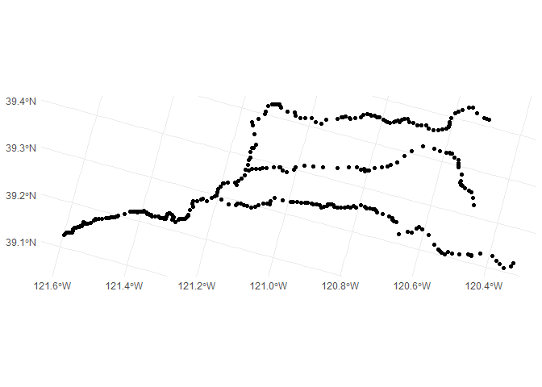<!-- -->

``` r
cvpia_extents <- st_read("habitat_extents_cvpia/habitat_extents_combined_gradients_v3.shp")
```

    ## Reading layer `habitat_extents_combined_gradients_v3' from data source 
    ##   `C:\Users\skylerlewis\Github\swc-habitat-suitability\data-raw\habitat_extents_cvpia\habitat_extents_combined_gradients_v3.shp' 
    ##   using driver `ESRI Shapefile'
    ## Simple feature collection with 323 features and 12 fields
    ## Geometry type: MULTILINESTRING
    ## Dimension:     XY
    ## Bounding box:  xmin: -251634.9 ymin: -139292.4 xmax: 61284.41 ymax: 364940.4
    ## Projected CRS: NAD83 / California Albers

``` r
cvpia_extents |> 
  st_cast("LINESTRING") |>
  mutate(geometry = st_line_sample(geometry, sample = c(0,1))) |>
  ggplot() + geom_sf()
```

    ## Warning in st_cast.sf(cvpia_extents, "LINESTRING"): repeating attributes for
    ## all sub-geometries for which they may not be constant

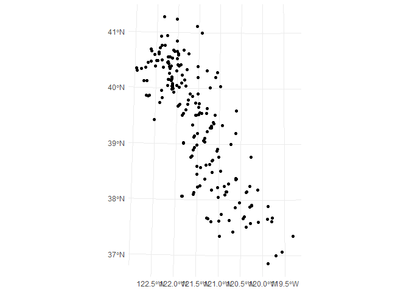<!-- -->

``` r
knitr::knit_exit()
```
