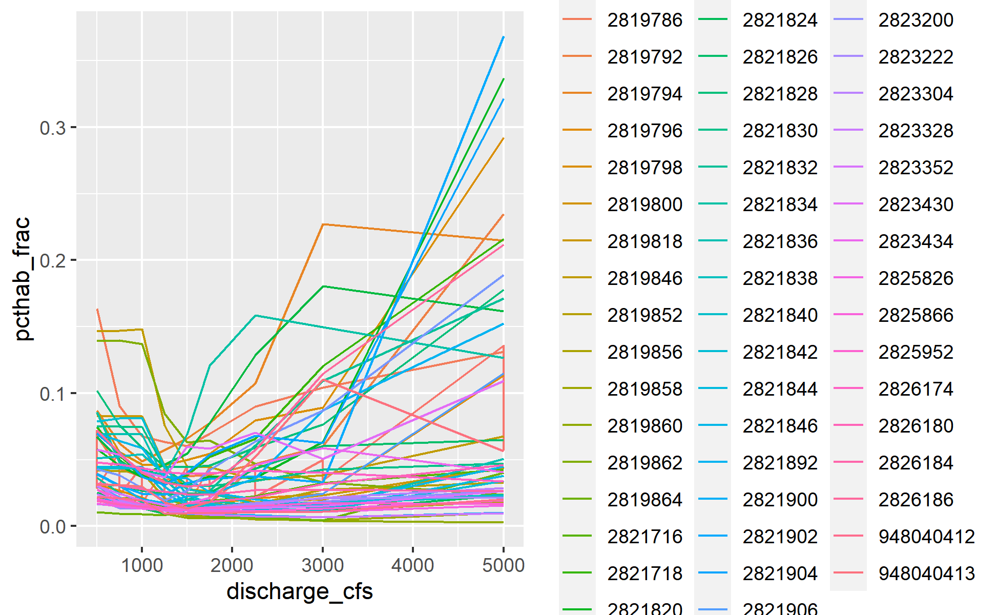

Hydraulic Training Data
================

``` r
library(tidyverse)
library(sf)
library(stars)
library(terra)

theme_set(theme_minimal())

#project_crs <- "EPSG:3310" # NAD83 California Teale Albers
#project_crs <- "EPSG:5070" # NAD83 CONUS Albers
project_crs <- "ESRI:102039" # NAD83 CONUS Albers USGS Version

library(googledrive)
drive_file_by_id <- function(id=character(), dir="temp", vsizip=FALSE) {
  d <- googledrive::as_dribble(googledrive::as_id(id))
  p <- file.path(dir, d$name)
  if(!file.exists(p)){
    googledrive::drive_download(file = d, path = p)
  }
  if(vsizip){
    return(file.path("/vsizip",p))
  } else {
    return(p)
  }
}
```

Define habitat suitability functions

Source: 1029_Yuba_Flow_Effects_Modeling_Task_1_2022-09-30_reduced.pdf

``` r
# simple linear interpolation function
linterp <- function(x, x1, x2, y1, y2){
  y1 + ((x-x1)/(x2-x1)) * (y2-y1)
}

# vectorized function to calculate the depth*velocity suitability factor
# if applicable, cover will also need to be applied.
# method=0 uses simple 1/0 thresholds (CVPIA)
# method=1 uses ranges defined in CBEC Lower Yuba River report, tables 8-9
# method=2 uses ranges defined for USBR San Joaquin model (which also did not incorporate cover)
dvhsi <- function(d, v, method=0) {
  
  if(method==0){
    
    return(if_else(d>0.5 & d<=5.2 & v>0.1 & v<=4.0, 1, 0))
    
  } else if(method==1){
    
    dhsi <- case_when(
      d<=0.5 ~ 0,
      d<=0.9 ~ linterp(d, 0.5, 0.9, 0, 1),
      d<=4.0 ~ 1,
      d<=5.2 ~ linterp(d, 4.0, 5.2, 1, 0),
      d>5.2 ~ 0)
    vhsi <- case_when(
      v<=0.1 ~ linterp(v, 0.0, 0.1, 0, 1),
      v<=0.8 ~ 1,
      v<=1.8 ~ linterp(v, 0.8, 1.8, 1, 0.35),
      v<=4.0 ~ linterp(v, 1.8, 4.0, 0.35, 0),
      v>4.0 ~ 0)
    return(sqrt(dhsi*vhsi))
    
  } else if(method==3){
    
    dhsi <- case_when(d<=0.01 ~ 0.00,
                      d<=0.10 ~ 0.10,
                      d<=0.20 ~ 0.20,
                      d<=0.60 ~ 0.15,
                      d<=0.80 ~ 0.35,
                      d<=1.00 ~ 0.46,
                      d<=1.20 ~ 0.53,
                      d<=1.50 ~ 0.64,
                      d<=2.10 ~ 0.86,
                      d<=2.50 ~ 0.86,
                      d<=2.90 ~ 0.57,
                      d<=4.00 ~ 0.34,
                      d<=4.50 ~ 0.14,
                      d<=5.00 ~ 0.30,
                      d<=7.00 ~ 0.20,
                      d<=7.10 ~ 0.10,
                      d<=10.0 ~ 0.00,
                      d>10.0 ~ 0.00)
    vhsi <- case_when(v<=0.1 ~ 0.94,
                      v<=0.2 ~ 0.98,
                      v<=0.3 ~ 1.00,
                      v<=0.5 ~ 0.99,
                      v<=0.7 ~ 0.98,
                      v<=1.0 ~ 0.96,
                      v<=1.2 ~ 0.95,
                      v<=1.5 ~ 0.93,
                      v<=2.0 ~ 0.68,
                      v<=2.5 ~ 0.30,
                      v<=2.8 ~ 0.08,
                      v<=3.4 ~ 0.01,
                      v<=3.5 ~ 0.01,
                      v>3.5 ~ 0.00)
    return(pmin(dhsi, vhsi))
    
  }
}
```

## Stanislaus

Import SRH2D model data for Stanislaus (unlike HEC-RAS, the SRH2D
outputs are natively vector format)

``` r
# SRH2D model domain, dissolved from SRH2D mesh faces using QGIS
stan_domain <- st_read("/vsizip/hydraulic_model_data/stanislaus_srh2d_2013/StanMesh072313_Domain.shp.zip", as_tibble=T)
```

    ## Reading layer `StanMesh072313_Domain' from data source 
    ##   `/vsizip/hydraulic_model_data/stanislaus_srh2d_2013/StanMesh072313_Domain.shp.zip' 
    ##   using driver `ESRI Shapefile'
    ## Simple feature collection with 1 feature and 1 field
    ## Geometry type: POLYGON
    ## Dimension:     XYZ
    ## Bounding box:  xmin: 655231.1 ymin: 4169204 xmax: 705835.6 ymax: 4188522
    ## z_range:       zmin: 0 zmax: 0
    ## Projected CRS: NAD83 / UTM zone 10N

``` r
# SRH2D model domain, manually split into polygons aligning with COMID segments
stan_comid <- st_read("/vsizip/hydraulic_model_data/stanislaus_srh2d_2013/StanMesh072313_Domain_COMID.shp.zip", as_tibble=T) |>
  st_zm() |> janitor::clean_names()
```

    ## Reading layer `StanMesh072313_Domain_COMID' from data source 
    ##   `/vsizip/hydraulic_model_data/stanislaus_srh2d_2013/StanMesh072313_Domain_COMID.shp.zip' 
    ##   using driver `ESRI Shapefile'
    ## Simple feature collection with 54 features and 1 field
    ## Geometry type: POLYGON
    ## Dimension:     XY
    ## Bounding box:  xmin: 655231.1 ymin: 4169204 xmax: 705835.6 ymax: 4188522
    ## Projected CRS: NAD83 / UTM zone 10N

``` r
# SRH2D mesh vertices, converted from 2DM using QGIS 
stan_vertices <- st_read("/vsizip/hydraulic_model_data/stanislaus_srh2d_2013/StanMesh072313_Vertices.shp.zip", as_tibble=T) |>
  mutate(vid = row_number()) |>
  select(vid)
```

    ## Reading layer `StanMesh072313_Vertices' from data source 
    ##   `/vsizip/hydraulic_model_data/stanislaus_srh2d_2013/StanMesh072313_Vertices.shp.zip' 
    ##   using driver `ESRI Shapefile'
    ## Simple feature collection with 241395 features and 1 field
    ## Geometry type: POINT
    ## Dimension:     XYZ
    ## Bounding box:  xmin: 655231.1 ymin: 4169204 xmax: 705835.6 ymax: 4188522
    ## z_range:       zmin: 2.461469 zmax: 151.0898
    ## Projected CRS: NAD83 / UTM zone 10N

``` r
# Thiessen (aka Voronoi) polygons for mesh vertices, generated using QGIS
stan_thiessen <- st_read("/vsizip/hydraulic_model_data/stanislaus_srh2d_2013/StanMesh072313_Thiessen.shp.zip", as_tibble=T) |>
  #mutate(vid = row_number()) # row order doesn't match the SRH2D outputs so need to spatial join
  st_join(stan_vertices, join=st_nearest_feature) |>
  select(vid) |>
  arrange(vid)
```

    ## Reading layer `StanMesh072313_Thiessen' from data source 
    ##   `/vsizip/hydraulic_model_data/stanislaus_srh2d_2013/StanMesh072313_Thiessen.shp.zip' 
    ##   using driver `ESRI Shapefile'
    ## Simple feature collection with 241395 features and 1 field
    ## Geometry type: POLYGON
    ## Dimension:     XY
    ## Bounding box:  xmin: 655231.1 ymin: 4169204 xmax: 705835.6 ymax: 4188522
    ## Projected CRS: NAD83 / UTM zone 10N

``` r
# confirm correct join via:
# ggplot() + geom_sf(data=stan_thiessen|>filter(vid<50)) + geom_sf(data=stan_vertices|>filter(vid<50)) 

# Bed elevations, extracted from mesh using QGIS "Export time series values from points of a mesh dataset"
stan_elev <- read_csv("hydraulic_model_data/stanislaus_srh2d_2013/StanMesh072313_BedElevation.csv.gz") |>
  janitor::clean_names() |>
  mutate(vid = row_number()) |>
  select(vid, bed_elevation)

# Material Manning coefficients, extracted from SRH2D DAT files for runs
stan_material_n <-
  read_delim("hydraulic_model_data/stanislaus_srh2d_2013/manning_coef.txt", delim="\t", col_names=c("manning_coef")) |>
  mutate(material_id = row_number())

# Material IDs (Manning's roughness classes) extracted from mesh using QGIS "Export time series values from points of a mesh dataset"
stan_material <- 
  read_csv("hydraulic_model_data/stanislaus_srh2d_2013/StanMesh072313_MaterialID.csv.gz") |>
  janitor::clean_names() |>
  mutate(vid = row_number()) |>
  select(vid, material_id) |>
  left_join(stan_material_n)

# alternate approach with spatial join yields the same result
# stan_material <- 
#   read_csv("hydraulic_model_data/stanislaus_srh2d_2013/StanMesh072313_MaterialID.csv.gz") |>
#   janitor::clean_names() |>
#   st_as_sf(coords=c("x","y"), crs=st_crs(stan_thiessen)) |>
#   st_join(stan_thiessen, join=st_nearest_feature)

# SRH2D results by vertex point, incl. depth, velocity, shear stress, froude
stan_result_filenames <- c(
   "500" = "hydraulic_model_data/stanislaus_srh2d_2013/500cfs_072313.csv.gz",
   "750" = "hydraulic_model_data/stanislaus_srh2d_2013/750cfs_072413.csv.gz",
  "1000" = "hydraulic_model_data/stanislaus_srh2d_2013/1000cfs_072413.csv.gz",
  "1250" = "hydraulic_model_data/stanislaus_srh2d_2013/1250cfs_090313.csv.gz",
  "1500" = "hydraulic_model_data/stanislaus_srh2d_2013/1500cfs_071013.csv.gz",
  "1750" = "hydraulic_model_data/stanislaus_srh2d_2013/1750cfs_090313.csv.gz",
  "2250" = "hydraulic_model_data/stanislaus_srh2d_2013/2250cfs_121713.csv.gz",
  "3000" = "hydraulic_model_data/stanislaus_srh2d_2013/3000cfs_061913.csv.gz",
  "5000" = "hydraulic_model_data/stanislaus_srh2d_2013/5000cfs_071113.csv.gz"
)
stan_result_cols <- c("x_m"="n", "y_m"="n", "z_m"="n", 
                      "wse_m"="n", "wdepth_m"="n", 
                      "vel_x"="n", "vel_y"="n", "vel_mag"="n", 
                      "froude"="n", "stress"="n")

stan_result <- 
  names(stan_result_filenames) |>
  lapply(function(x) read_csv(stan_result_filenames[x], col_names=names(stan_result_cols), col_types=stan_result_cols, skip=1) |> 
           mutate(discharge_cfs = as.numeric(x), vid=row_number())) |>
  bind_rows() |>
  mutate(across(everything(), function(x) if_else(x==-999,NA,x))) |>
  mutate(depth_ft = wdepth_m*3.28084, velocity_fps = vel_mag*3.28084) |>
  select(discharge_cfs, vid, depth_ft, velocity_fps) |>
  left_join(stan_elev, by=join_by(vid)) |> 
  left_join(stan_material, by=join_by(vid)) |>
  mutate(
    cover_hs = 1, # cover habitat suitability, for now, actually need to get it from stan_material
    hsi_simp = dvhsi(depth_ft, velocity_fps, method=0) * cover_hs,
    hsi_frac = dvhsi(depth_ft, velocity_fps, method=1) * cover_hs,
  ) |>
  glimpse()
```

    ## Rows: 2,172,555
    ## Columns: 10
    ## $ discharge_cfs <dbl> 500, 500, 500, 500, 500, 500, 500, 500, 500, 500, 500, 5…
    ## $ vid           <int> 1, 2, 3, 4, 5, 6, 7, 8, 9, 10, 11, 12, 13, 14, 15, 16, 1…
    ## $ depth_ft      <dbl> 0.0000000, 1.1168896, 3.6240659, 3.9757284, 3.9583468, 3…
    ## $ velocity_fps  <dbl> 0.0000000, 0.6719190, 1.5923429, 1.8671964, 1.2991604, 0…
    ## $ bed_elevation <dbl> 54.86779, 53.10716, 52.34171, 52.23186, 52.23380, 52.252…
    ## $ material_id   <dbl> 39, 28, 28, 28, 28, 25, 25, 28, 28, 28, 39, 39, 28, 28, …
    ## $ manning_coef  <dbl> 0.042, 0.015, 0.015, 0.015, 0.015, 0.040, 0.040, 0.015, …
    ## $ cover_hs      <dbl> 1, 1, 1, 1, 1, 1, 1, 1, 1, 1, 1, 1, 1, 1, 1, 1, 1, 1, 1,…
    ## $ hsi_simp      <dbl> 0, 1, 1, 1, 1, 1, 1, 1, 1, 0, 0, 0, 1, 1, 1, 1, 1, 1, 1,…
    ## $ hsi_frac      <dbl> 0.0000000, 1.0000000, 0.6964030, 0.5825029, 0.8219159, 1…

Import polygons created for each COMID reach, and calculate suitable
area for each

Proof of concept, first comid, 500 cfs:

``` r
test <- stan_thiessen |> 
  left_join(filter(stan_result, discharge_cfs==500), by=join_by(vid)) |>
  st_intersection(stan_comid[1]) |>
    mutate(area_m2 = units::drop_units(st_area(geometry)),
           wua_simp = hsi_simp * area_m2,
           wua_frac = hsi_frac * area_m2) |>
  glimpse()
```

    ## Warning: attribute variables are assumed to be spatially constant throughout
    ## all geometries

    ## Rows: 244,606
    ## Columns: 15
    ## $ vid           <int> 194330, 194471, 194472, 194473, 194475, 194476, 194477, …
    ## $ discharge_cfs <dbl> 500, 500, 500, 500, 500, 500, 500, 500, 500, 500, 500, 5…
    ## $ depth_ft      <dbl> 0, 0, 0, 0, 0, 0, 0, 0, 0, 0, 0, 0, 0, 0, 0, 0, 0, 0, 0,…
    ## $ velocity_fps  <dbl> 0, 0, 0, 0, 0, 0, 0, 0, 0, 0, 0, 0, 0, 0, 0, 0, 0, 0, 0,…
    ## $ bed_elevation <dbl> 13.83647, 13.84992, 13.86708, 13.86089, 13.86002, 13.826…
    ## $ material_id   <dbl> 41, 41, 41, 41, 41, 41, 41, 41, 41, 41, 41, 41, 41, 41, …
    ## $ manning_coef  <dbl> 0.04, 0.04, 0.04, 0.04, 0.04, 0.04, 0.04, 0.04, 0.04, 0.…
    ## $ cover_hs      <dbl> 1, 1, 1, 1, 1, 1, 1, 1, 1, 1, 1, 1, 1, 1, 1, 1, 1, 1, 1,…
    ## $ hsi_simp      <dbl> 0, 0, 0, 0, 0, 0, 0, 0, 0, 0, 0, 0, 0, 0, 0, 0, 0, 0, 0,…
    ## $ hsi_frac      <dbl> 0, 0, 0, 0, 0, 0, 0, 0, 0, 0, 0, 0, 0, 0, 0, 0, 0, 0, 0,…
    ## $ comid         <dbl> 2819852, 2819852, 2819852, 2819852, 2819852, 2819852, 28…
    ## $ geometry      <POLYGON [m]> POLYGON ((661138 4174738, 6..., POLYGON ((661145…
    ## $ area_m2       <dbl> 52.027195, 219.927514, 244.153508, 293.728856, 314.55599…
    ## $ wua_simp      <dbl> 0, 0, 0, 0, 0, 0, 0, 0, 0, 0, 0, 0, 0, 0, 0, 0, 0, 0, 0,…
    ## $ wua_frac      <dbl> 0, 0, 0, 0, 0, 0, 0, 0, 0, 0, 0, 0, 0, 0, 0, 0, 0, 0, 0,…

``` r
#test |> ggplot() + geom_sf(aes(fill=hsi_simp), color=NA)
```

Batch process, saving flow-to-suitable-area (fsa) by comid to file

``` r
stan_calc_hsi <- function(g, q){
  stan_thiessen |>
    left_join(filter(stan_result, discharge_cfs==q), by=join_by(vid)) |> 
    st_intersection(g) |>
    mutate(area_m2 = if_else(depth_ft>0, units::drop_units(st_area(geometry)), 0),
           wua_simp = hsi_simp * area_m2,
           wua_frac = hsi_frac * area_m2) |>
    summarize(area_m2 = sum(area_m2),
              wua_simp = sum(wua_simp),
              wua_frac = sum(wua_frac)) |>
    mutate(pcthab_simp = wua_simp / area_m2,
           pcthab_frac = wua_frac / area_m2) |>
    st_drop_geometry()
}

if(!file.exists("../data/fsa_stanislaus.Rds")) {
  fsa_stanislaus <- 
    stan_comid |>
    expand_grid(flow_cfs = as.numeric(names(stan_result_filenames))) |>
    mutate(result = map2(geometry, flow_cfs, function(g, q) stan_calc_hsi(st_sfc(g, crs=st_crs(stan_comid)), q))) |>
    unnest_wider(result) |>
    st_as_sf() |>
    glimpse()
  fsa_stanislaus |> saveRDS("../data/fsa_stanislaus.Rds")
} else {
  fsa_stanislaus <- readRDS("../data/fsa_stanislaus.Rds") |> glimpse()
}
```

    ## Warning: There were 486 warnings in `mutate()`.
    ## The first warning was:
    ## ℹ In argument: `result = map2(...)`.
    ## Caused by warning:
    ## ! attribute variables are assumed to be spatially constant throughout all geometries
    ## ℹ Run `dplyr::last_dplyr_warnings()` to see the 485 remaining warnings.

    ## Rows: 486
    ## Columns: 8
    ## $ comid       <dbl> 2819852, 2819852, 2819852, 2819852, 2819852, 2819852, 2819…
    ## $ geometry    <POLYGON [m]> POLYGON ((661091.5 4174815,..., POLYGON ((661091.5…
    ## $ flow_cfs    <dbl> 500, 750, 1000, 1250, 1500, 1750, 2250, 3000, 5000, 500, 7…
    ## $ area_m2     <dbl> 256545.67, 256959.04, 257852.31, 285238.61, 310057.34, 316…
    ## $ wua_simp    <dbl> 184235.315, 182968.634, 181451.715, 102791.552, 73867.991,…
    ## $ wua_frac    <dbl> 124882.432, 123558.843, 121039.274, 62002.932, 46502.493, …
    ## $ pcthab_simp <dbl> 0.7181385, 0.7120537, 0.7037040, 0.3603704, 0.2382398, 0.2…
    ## $ pcthab_frac <dbl> 0.4867844, 0.4808503, 0.4694132, 0.2173722, 0.1499803, 0.1…

``` r
#stan_hsi |> ggplot() + geom_sf(aes(fill=pcthab_simp), color=NA) + facet_wrap(~discharge_cfs)
```

``` r
fsa_stanislaus |> ggplot() + geom_line(aes(x = flow_cfs, y = pcthab_frac, color=factor(comid))) 
```

<!-- -->

## Deer Creek

Import 2018 HEC-RAS 2D model outputs for Deer Creek

``` r
# get land cover data
dir.create("temp/deer_land_cover", recursive = TRUE)
```

    ## Warning in dir.create("temp/deer_land_cover", recursive = TRUE):
    ## 'temp\deer_land_cover' already exists

``` r
drive_file_by_id("1OMJzuVoFdt1hygfMVPWrQBGr2BIuxSZj") |>
  archive::archive_extract(dir="temp/deer_land_cover")
```

    ## ! Using an auto-discovered, cached token.

    ##   To suppress this message, modify your code or options to clearly consent to
    ##   the use of a cached token.

    ##   See gargle's "Non-interactive auth" vignette for more details:

    ##   <https://gargle.r-lib.org/articles/non-interactive-auth.html>

    ## ℹ The googledrive package is using a cached token for 'slewis@flowwest.com'.

    ## Auto-refreshing stale OAuth token.

``` r
deer_lcc <- terra::rast("temp/deer_land_cover/existing_landcover_20181109.tif")
ggplot() + tidyterra::geom_spatraster(data=deer_lcc)
```

    ## <SpatRaster> resampled to 500490 cells for plotting

<!-- -->

``` r
# get 
dir.create("temp/deer_model_output", recursive = TRUE)
```

    ## Warning in dir.create("temp/deer_model_output", recursive = TRUE):
    ## 'temp\deer_model_output' already exists

``` r
#drive_file_by_id("XXXXX", dir="temp/deer_model_output") |>
#"temp/deer_model_output/Existing_Habitat.7z" |> 
#  archive::archive_extract(dir="temp/deer_model_output")
  
filenames <- tribble(~flow_cfs, ~timestep,
        100, "15NOV2018 06 00 00",
        250, "15NOV2018 16 00 00",
        300, "16NOV2018 02 00 00",
        400, "16NOV2018 12 00 00",
        500, "16NOV2018 22 00 00",
        600, "17NOV2018 08 00 00",
       1000, "17NOV2018 18 00 00",
       3000, "18NOV2018 04 00 00",
       5000, "18NOV2018 14 00 00",
       6000, "19NOV2018 00 00 00",
       7000, "19NOV2018 10 00 00",
       9000, "19NOV2018 20 00 00",
      10000, "20NOV2018 06 00 00",
      11000, "20NOV2018 16 00 00",
      12000, "21NOV2018 02 00 00",
      13000, "21NOV2018 12 00 00",
      14000, "21NOV2018 22 00 00",
      15000, "22NOV2018 08 00 00") |>
  mutate(depth = paste0("temp/deer_model_output/Depth (",timestep,").vrt"),
         velocity = paste0("temp/deer_model_output/Velocity (",timestep,").vrt"))

dep_r <- terra::rast(filenames$depth)
terra::set.names(dep_r, filenames$flow_cfs)

vel_r <- terra::rast(filenames$velocity)
terra::set.names(vel_r, filenames$flow_cfs)

# STARS VERSION

dep_s <- dep_r |> 
  st_as_stars() |> 
  st_set_dimensions(3, names="flow") |>
  setNames("depth")

vel_s <- vel_r |> 
  st_as_stars() |> 
  st_set_dimensions(3, names="flow") |>
  setNames("velocity")

#deer_dep_vel <- c(dep_s, vel_s)
# raster_hsi <- function(q) {
#   d <- dep_s[,,,q]
#   v <- vel_s[,,,q]
#   #...
# }

# TERRA VERSION

deer_comids <- 
  st_read("/vsizip/hydraulic_model_data/deercreek_hecras2d_2018/model_perim_split_comid_generalized.shp.zip", as_tibble=T) |>
  janitor::clean_names() |> filter(comid>0)
```

    ## Reading layer `model_perim_split_comid_generalized' from data source 
    ##   `/vsizip/hydraulic_model_data/deercreek_hecras2d_2018/model_perim_split_comid_generalized.shp.zip' 
    ##   using driver `ESRI Shapefile'
    ## Simple feature collection with 21 features and 1 field
    ## Geometry type: POLYGON
    ## Dimension:     XY
    ## Bounding box:  xmin: 6531944 ymin: 1849718 xmax: 6576221 ymax: 1889015
    ## Projected CRS: NAD83(2011) / California zone 1 (ftUS)

``` r
raster_hsi <- function(g, q, crs="EPSG:6416"){
  comid <- terra::vect(st_sfc(g, crs=crs))
  d <- dep_r[[as.character(q)]] |> terra::crop(comid) 
  v <- vel_r[[as.character(q)]] |> terra::crop(comid) 
  ext <- (d>0)
  hsi <- (d>0.5 & d<=5.2) & (v>0.1 & v<=4.0)
  area_wua <- terra::global(hsi, "sum", na.rm=TRUE)[[1]]
  area_tot <- terra::global(ext, "sum", na.rm=TRUE)[[1]]
  area_pct <- area_wua / area_tot
  return(list("area_tot"=area_tot, 
              "area_wua"=area_wua, 
              "area_pct"=area_pct))
}

# getting a memory error doing this all at once:
# deer_hsi_result <- 
#   deer_comids |> 
#   expand_grid(flow_cfs=filenames$flow_cfs) |>
#   mutate(result = pmap(list(geometry, flow_cfs), raster_hsi)) |>
#   unnest_wider(result)

run_for_flow <- function(q){
  message(paste0("calculating HSI for q=",q))
  deer_comids |> 
    mutate(result = map(geometry, function(g) raster_hsi(g, q))) |>
    unnest_wider(result) |> 
    st_drop_geometry() |>
    mutate(flow_cfs=q)
}

if(!file.exists("../data/fsa_deercreek.Rds")) {
  deer_hsi_result <- bind_rows(lapply(filenames$flow_cfs, run_for_flow))
  deer_hsi_result |> saveRDS("../data/fsa_deercreek.Rds")
} else {
  deer_hsi_result <- readRDS("../data/fsa_deercreek.Rds")
}

deer_hsi_result |> glimpse()
```

    ## Rows: 252
    ## Columns: 6
    ## $ comid    <dbl> 12069362, 12075424, 12071016, 12071090, 12071174, 12071228, 1…
    ## $ geometry <POLYGON [US_survey_foot]> POLYGON ((6574067 1887095, ..., POLYGON …
    ## $ area_tot <dbl> 24721, 173323, 120576, 189750, 92482, 47971, 42751, 66627, 97…
    ## $ area_wua <dbl> 23622, 122244, 81256, 117582, 74092, 39402, 33851, 54225, 778…
    ## $ area_pct <dbl> 0.9555439, 0.7052959, 0.6738986, 0.6196680, 0.8011505, 0.8213…
    ## $ flow_cfs <dbl> 100, 100, 100, 100, 100, 100, 100, 100, 100, 100, 100, 100, 1…

``` r
# examples
deer_hsi_result |> ggplot() + geom_line(aes(x = flow_cfs, y = area_pct, color=factor(comid))) 
```

<!-- -->
