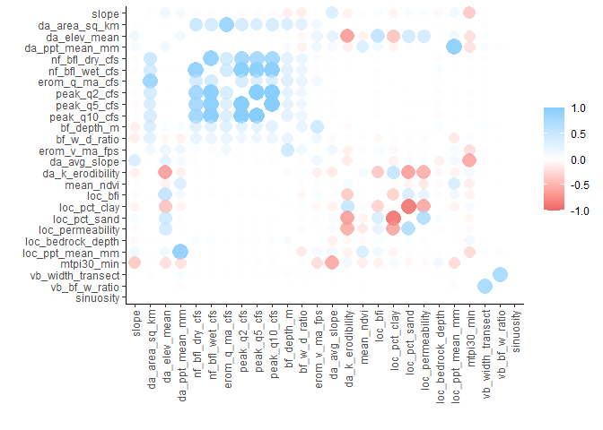
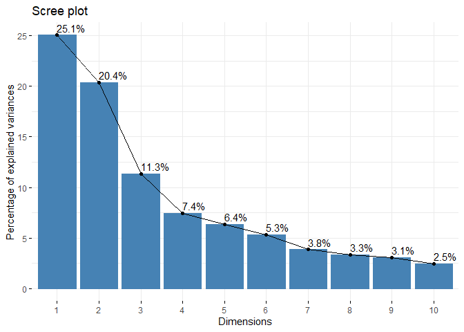
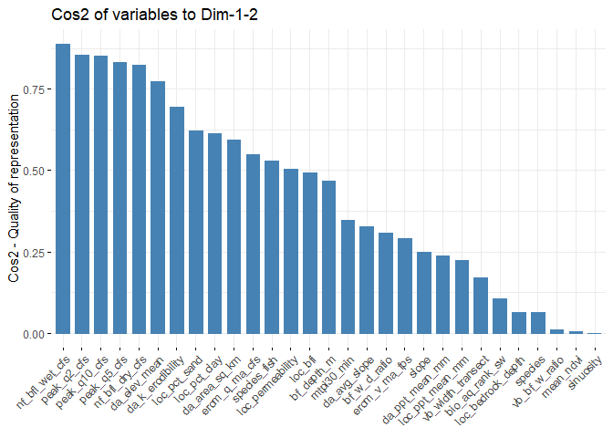
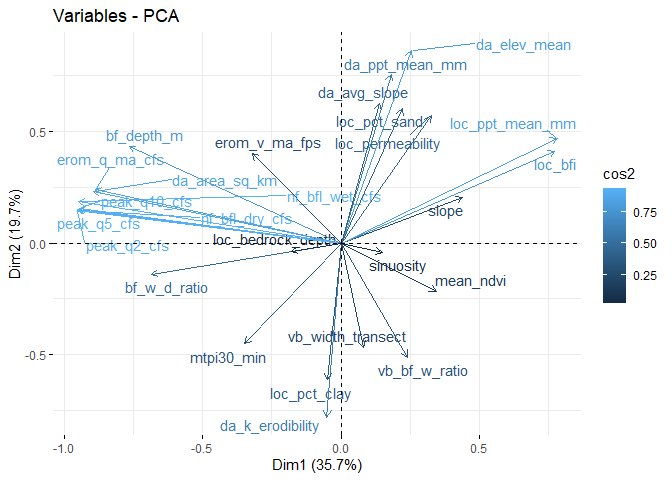
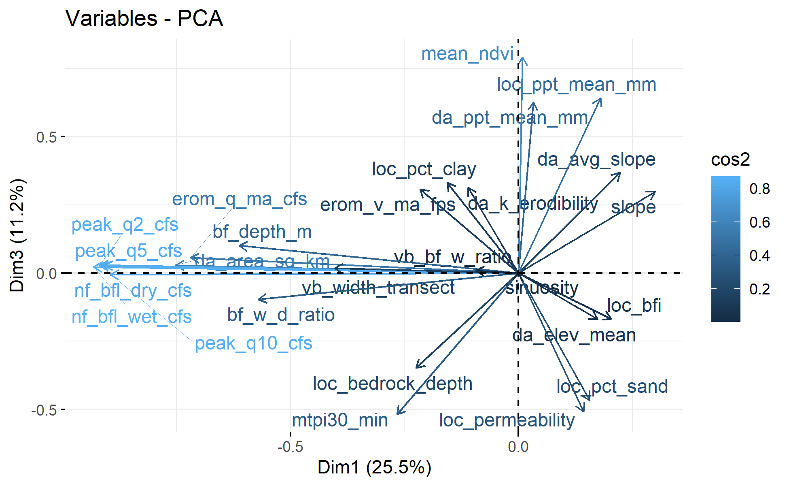
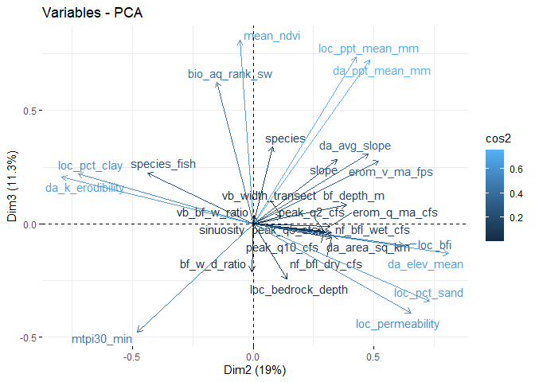

Exploratory Modeling
================
[Skyler Lewis](mailto:slewis@flowwest.com)
2024-01-26

- [Linear](#linear)
- [Lasso Feature Selection](#lasso-feature-selection)
- [Random Forest](#random-forest)

``` r
library(tidyverse)
```

    ## Warning: package 'ggplot2' was built under R version 4.3.1

    ## Warning: package 'dplyr' was built under R version 4.3.1

    ## ── Attaching core tidyverse packages ──────────────────────── tidyverse 2.0.0 ──
    ## ✔ dplyr     1.1.3     ✔ readr     2.1.4
    ## ✔ forcats   1.0.0     ✔ stringr   1.5.0
    ## ✔ ggplot2   3.4.4     ✔ tibble    3.2.1
    ## ✔ lubridate 1.9.2     ✔ tidyr     1.3.0
    ## ✔ purrr     1.0.1     
    ## ── Conflicts ────────────────────────────────────────── tidyverse_conflicts() ──
    ## ✖ dplyr::filter() masks stats::filter()
    ## ✖ dplyr::lag()    masks stats::lag()
    ## ℹ Use the conflicted package (<http://conflicted.r-lib.org/>) to force all conflicts to become errors

``` r
library(sf)
```

    ## Warning: package 'sf' was built under R version 4.3.1

    ## Linking to GEOS 3.11.2, GDAL 3.6.2, PROJ 9.2.0; sf_use_s2() is TRUE

``` r
library(stars)
```

    ## Warning: package 'stars' was built under R version 4.3.1

    ## Loading required package: abind

``` r
library(tidymodels)
```

    ## Warning: package 'tidymodels' was built under R version 4.3.2

    ## ── Attaching packages ────────────────────────────────────── tidymodels 1.1.1 ──
    ## ✔ broom        1.0.5     ✔ rsample      1.2.0
    ## ✔ dials        1.2.0     ✔ tune         1.1.2
    ## ✔ infer        1.0.5     ✔ workflows    1.1.3
    ## ✔ modeldata    1.3.0     ✔ workflowsets 1.0.1
    ## ✔ parsnip      1.1.1     ✔ yardstick    1.3.0
    ## ✔ recipes      1.0.9

    ## Warning: package 'broom' was built under R version 4.3.2

    ## Warning: package 'dials' was built under R version 4.3.2

    ## Warning: package 'infer' was built under R version 4.3.2

    ## Warning: package 'modeldata' was built under R version 4.3.2

    ## Warning: package 'parsnip' was built under R version 4.3.2

    ## Warning: package 'recipes' was built under R version 4.3.2

    ## Warning: package 'rsample' was built under R version 4.3.2

    ## Warning: package 'tune' was built under R version 4.3.2

    ## Warning: package 'workflows' was built under R version 4.3.2

    ## Warning: package 'workflowsets' was built under R version 4.3.2

    ## Warning: package 'yardstick' was built under R version 4.3.2

    ## ── Conflicts ───────────────────────────────────────── tidymodels_conflicts() ──
    ## ✖ scales::discard() masks purrr::discard()
    ## ✖ dplyr::filter()   masks stats::filter()
    ## ✖ recipes::fixed()  masks stringr::fixed()
    ## ✖ dplyr::lag()      masks stats::lag()
    ## ✖ yardstick::spec() masks readr::spec()
    ## ✖ recipes::step()   masks stats::step()
    ## • Use tidymodels_prefer() to resolve common conflicts.

``` r
library(broom.mixed) # tidy output of mixed model results
```

    ## Warning: package 'broom.mixed' was built under R version 4.3.2

``` r
library(dotwhisker) # visualize regression results
```

    ## Warning: package 'dotwhisker' was built under R version 4.3.2

``` r
knitr::opts_chunk$set(eval=TRUE)
```

``` r
flowlines <- readRDS("../data/flowline_geometries.Rds") |>
  left_join(readRDS("../data/flowline_attributes.Rds")) |>
  filter(huc_8 %in% c("18020107", "18020125")) |>
  st_transform("ESRI:102039")
```

    ## Joining with `by = join_by(comid)`

``` r
df <- flowlines |> 
  st_drop_geometry() |>
  select(slope, stream_order, 
         da_area_sq_km, da_elev_mean, da_ppt_mean_mm,
         mtpi30_min, 
         bf_width_m, bf_depth_m, bf_w_d_ratio, 
         vb_width_transect, vb_bf_w_ratio, 
         erom_q_ma_cfs, 
         erom_v_ma_fps, 
         loc_bfi, 
         da_k_erodibility) |> 
  na.omit() |> 
  scale() 

 # consider eliminating direct correlates with flow: erom_q, da area, ppt mean

df |> cor() |> corrr::rplot() + theme(axis.text.x = element_text(angle = 90, vjust = 0.5, hjust=1))
```

<!-- -->

``` r
# uniqueness: 
# df |> cor() |> abs() |> rowMeans() |> rank() 
pca <- princomp(df) 
#summary(pca)

factoextra::fviz_eig(pca, addlabels = TRUE)
```

<!-- -->

``` r
factoextra::fviz_cos2(pca, choice = "var", axes = 1:2)
```

<!-- -->

``` r
factoextra::fviz_pca_var(pca, axes=c(1,2), col.var = "cos2", repel = TRUE)
```

<!-- -->

``` r
factoextra::fviz_pca_var(pca, axes=c(1,3), col.var = "cos2", repel = TRUE)
```

<!-- -->

``` r
factoextra::fviz_pca_var(pca, axes=c(2,3), col.var = "cos2", repel = TRUE)
```

<!-- -->

``` r
# flowlines |> GGally::ggpairs()
```

======

pseudo code below this point, do not evaluate

``` r
knitr::opts_chunk$set(eval=FALSE)
```

``` r
training_data <- 
  hydraulic_model_outputs_by_flow_and_reach |>
  left_join(flowline_attributes, by = join_by(comid == comid)) |>
  mutate(flow_norm_cfs = flow_cfs / maf_cfs) |>
  mutate(suitable_habitat_area_pct = suitable_habitat_area / (reach_length * hydraulic_model_output_channel_width)) |>
  mutate(channel_width_relative = spatial_channel_width / valley_width) |>
  select(comid, suitable_habitat_area_pct,
         slope, stream_order, 
         da_area_sq_km, da_elev_mean, da_ppt_mean_mm,
         mtpi30_min, channel_width_relative,
         bf_depth_m, bf_w_d_ratio, erom_v_ma_fps,
         vb_width_transect, vb_bf_w_ratio, 
         loc_bfi, 
         da_k_erodibility,
         ) |>
  pivot_longer(cols = c(-comid, -suitable_habitat_area_pct), names_to = "x_name", values_to = "x_value") |>
  group_by(x_name) |>
  summarize(x_value_quantile = quantile(x_value, probs=seq(0,1,0.1))) |>
  unnest(x_value_quantile) |>
  ggplot() + 
  facet_wrap(~x_name) +
  geom_point(aes(x = flow_cfs, y = hab_pct, color = x_value_quantile))
```

## Linear

``` r
linear_reg() |> fit(formula = 
                      # suitable habitat area normalized by length and width
                      log(suitable_habitat_area/(reach_length*channel_width)) ~ 
                      # flow normalized by mean annual flow (may consider not normalizing)
                      log(flow_cfs/maf_cfs) + 
                      # channel gradient and stream order, to capture location within the watershed
                      log(slope)*log(stream_order) + 
                      # predictors of peak flow (this will be correlated with maf_cfs)
                      log(da_area_sq_km)*log(da_elev_mean)*log(da_ppt_mean_mm) + 
                      # channel confinement
                      log(mtpi30_min) + log(channel_width/valley_width) +
                      # theoretical bankfull hydraulics
                      log(bf_depth_m) + log(bf_w_d_ratio) + log(erom_v_ma_fps) + 
                      # theoretical hydrologic params
                      log(loc_bfi) +
                      # catchment sediment transport parameters
                      log(da_k_erodibility) +...
                      )
```

## Lasso Feature Selection

<https://juliasilge.com/blog/lasso-the-office/> or Relaxed Lasso

## Random Forest
