Exploratory Modeling
================
[Skyler Lewis](mailto:slewis@flowwest.com)
2024-02-23

- [Exploration and PCA of training
  data](#exploration-and-pca-of-training-data)
- [Set up training data](#set-up-training-data)
- [Split into training and testing
  datasets](#split-into-training-and-testing-datasets)
- [Modeling](#modeling)
  - [Linear regression](#linear-regression)
  - [Linear regression with regularized (lasso) feature
    selection](#linear-regression-with-regularized-lasso-feature-selection)
  - [Random Forest Regrssion](#random-forest-regrssion)
- [Random Forest model prediction
  output](#random-forest-model-prediction-output)
- [Predictions summarized by DSMHabitat
  reach](#predictions-summarized-by-dsmhabitat-reach)

``` r
library(tidyverse)
library(sf)
library(stars)
library(tidymodels)
library(broom.mixed) # tidy output of mixed model results
library(dotwhisker) # visualize regression results

knitr::opts_chunk$set(eval=TRUE)
```

``` r
flowlines <- readRDS("../data/flowline_geometries.Rds") |>
  st_transform("ESRI:102039")

flowline_attributes <- readRDS("../data/flowline_attributes.Rds")
```

    ## Warning in readRDS("../data/flowline_attributes.Rds"): input string 'Ca<bf>on
    ## Creek' cannot be translated to UTF-8, is it valid in 'ASCII'?

    ## Warning in readRDS("../data/flowline_attributes.Rds"): input string 'A<bf>o
    ## Nuevo Creek' cannot be translated to UTF-8, is it valid in 'ASCII'?

    ## Warning in readRDS("../data/flowline_attributes.Rds"): input string 'Pe<bf>a
    ## Creek' cannot be translated to UTF-8, is it valid in 'ASCII'?

``` r
flow_to_suitable_area <- readRDS("../data/fsa_combined.Rds")

# EXPERIMENTAL: Limit to flow ranges covered by all trianing data, and interpolate gaps
if(FALSE){
  interp_flows <- seq(700,5000,100)
  flow_to_suitable_area <- 
    readRDS("../data/fsa_combined.Rds") |>
    group_by(dataset, comid) |>
    complete(flow_cfs = interp_flows) |>
    arrange(dataset, comid, flow_cfs) |>
    mutate(across(c(area_tot_ft2, area_wua_ft2, hsi_frac), function(var) zoo::na.approx(var, x = flow_cfs))) |>
    filter(flow_cfs %in% interp_flows)
}

train_data <- flowlines |> st_drop_geometry() |>
  left_join(readRDS("../data/flowline_attributes.Rds"), by=join_by("comid"), relationship="one-to-one") |>
  inner_join(flow_to_suitable_area, by=join_by("comid"), relationship="one-to-many") |> 
  filter(hqt_gradient_class != "Valley Lowland") |>
  glimpse()
```

    ## Warning in readRDS("../data/flowline_attributes.Rds"): input string 'Ca<bf>on
    ## Creek' cannot be translated to UTF-8, is it valid in 'ASCII'?

    ## Warning in readRDS("../data/flowline_attributes.Rds"): input string 'A<bf>o
    ## Nuevo Creek' cannot be translated to UTF-8, is it valid in 'ASCII'?

    ## Warning in readRDS("../data/flowline_attributes.Rds"): input string 'Pe<bf>a
    ## Creek' cannot be translated to UTF-8, is it valid in 'ASCII'?

    ## Rows: 2,612
    ## Columns: 122

    ## Warning in grepl(",", levels(x), fixed = TRUE): input string 3 is invalid in
    ## this locale

    ## Warning in grepl(",", levels(x), fixed = TRUE): input string 4 is invalid in
    ## this locale

    ## Warning in grepl(",", levels(x), fixed = TRUE): input string 6 is invalid in
    ## this locale

    ## $ comid                        <dbl> 8061233, 8061233, 8061233, 8061233, 80612…
    ## $ reachcode                    <fct> 18020125000002, 18020125000002, 180201250…
    ## $ gnis_id                      <fct> 238295, 238295, 238295, 238295, 238295, 2…
    ## $ gnis_name                    <fct> "Yuba River", "Yuba River", "Yuba River",…
    ## $ lengthkm                     <dbl> 0.036, 0.036, 0.036, 0.036, 0.036, 0.036,…
    ## $ ftype                        <fct> StreamRiver, StreamRiver, StreamRiver, St…
    ## $ fcode                        <int> 46006, 46006, 46006, 46006, 46006, 46006,…
    ## $ huc_8                        <chr> "18020125", "18020125", "18020125", "1802…
    ## $ huc_10                       <chr> "1802012500", "1802012500", "1802012500",…
    ## $ huc_12                       <chr> "180201250000", "180201250000", "18020125…
    ## $ ftype_desc                   <chr> "Stream/River", "Stream/River", "Stream/R…
    ## $ hydro_seq                    <dbl> 10007863, 10007863, 10007863, 10007863, 1…
    ## $ reach_code                   <fct> 18020125000002, 18020125000002, 180201250…
    ## $ stream_level                 <dbl> 3, 3, 3, 3, 3, 3, 3, 3, 3, 3, 3, 3, 3, 3,…
    ## $ stream_order                 <dbl> 5, 5, 5, 5, 5, 5, 5, 5, 5, 5, 5, 5, 5, 5,…
    ## $ us_length_km                 <dbl> 2680.552, 2680.552, 2680.552, 2680.552, 2…
    ## $ ds_length_km                 <dbl> 202.394, 202.394, 202.394, 202.394, 202.3…
    ## $ da_area_sq_km                <dbl> 3110.287, 3110.287, 3110.287, 3110.287, 3…
    ## $ reach_length_km              <dbl> 0.036, 0.036, 0.036, 0.036, 0.036, 0.036,…
    ## $ slope                        <dbl> NA, NA, NA, NA, NA, NA, NA, NA, NA, NA, N…
    ## $ elev_min                     <dbl> 71.39, 71.39, 71.39, 71.39, 71.39, 71.39,…
    ## $ elev_max                     <dbl> 71.39, 71.39, 71.39, 71.39, 71.39, 71.39,…
    ## $ stream_power                 <dbl> NA, NA, NA, NA, NA, NA, NA, NA, NA, NA, N…
    ## $ da_ppt_mean_mm               <dbl> 1675.915, 1675.915, 1675.915, 1675.915, 1…
    ## $ loc_ppt_mean_mm              <dbl> NA, NA, NA, NA, NA, NA, NA, NA, NA, NA, N…
    ## $ vogel_q_ma_cfs               <dbl> 4225.676, 4225.676, 4225.676, 4225.676, 4…
    ## $ vogel_v_ma_fps               <dbl> 1.85044, 1.85044, 1.85044, 1.85044, 1.850…
    ## $ erom_q_ma_cfs                <dbl> 2649.201, 2649.201, 2649.201, 2649.201, 2…
    ## $ erom_v_ma_fps                <dbl> 1.70733, 1.70733, 1.70733, 1.70733, 1.707…
    ## $ sinuosity                    <dbl> 1, 1, 1, 1, 1, 1, 1, 1, 1, 1, 1, 1, 1, 1,…
    ## $ da_avg_slope                 <dbl> 29.4, 29.4, 29.4, 29.4, 29.4, 29.4, 29.4,…
    ## $ da_elev_mean                 <dbl> 1379.63, 1379.63, 1379.63, 1379.63, 1379.…
    ## $ da_elev_min                  <dbl> 71.19, 71.19, 71.19, 71.19, 71.19, 71.19,…
    ## $ da_elev_max                  <dbl> 2757.74, 2757.74, 2757.74, 2757.74, 2757.…
    ## $ da_elev_rel                  <dbl> 2686.55, 2686.55, 2686.55, 2686.55, 2686.…
    ## $ loc_bfi                      <dbl> NA, NA, NA, NA, NA, NA, NA, NA, NA, NA, N…
    ## $ da_bfi                       <dbl> NA, NA, NA, NA, NA, NA, NA, NA, NA, NA, N…
    ## $ loc_twi                      <dbl> NA, NA, NA, NA, NA, NA, NA, NA, NA, NA, N…
    ## $ da_twi                       <dbl> NA, NA, NA, NA, NA, NA, NA, NA, NA, NA, N…
    ## $ loc_pct_clay                 <dbl> NA, NA, NA, NA, NA, NA, NA, NA, NA, NA, N…
    ## $ da_pct_clay                  <dbl> NA, NA, NA, NA, NA, NA, NA, NA, NA, NA, N…
    ## $ loc_pct_sand                 <dbl> NA, NA, NA, NA, NA, NA, NA, NA, NA, NA, N…
    ## $ da_pct_sand                  <dbl> NA, NA, NA, NA, NA, NA, NA, NA, NA, NA, N…
    ## $ loc_permeability             <dbl> NA, NA, NA, NA, NA, NA, NA, NA, NA, NA, N…
    ## $ loc_bedrock_depth            <dbl> NA, NA, NA, NA, NA, NA, NA, NA, NA, NA, N…
    ## $ da_permeability              <dbl> NA, NA, NA, NA, NA, NA, NA, NA, NA, NA, N…
    ## $ da_bedrock_depth             <dbl> NA, NA, NA, NA, NA, NA, NA, NA, NA, NA, N…
    ## $ loc_k_erodibility            <dbl> NA, NA, NA, NA, NA, NA, NA, NA, NA, NA, N…
    ## $ da_k_erodibility             <dbl> NA, NA, NA, NA, NA, NA, NA, NA, NA, NA, N…
    ## $ loc_precip                   <dbl> NA, NA, NA, NA, NA, NA, NA, NA, NA, NA, N…
    ## $ da_precip                    <dbl> NA, NA, NA, NA, NA, NA, NA, NA, NA, NA, N…
    ## $ loc_runoff                   <dbl> NA, NA, NA, NA, NA, NA, NA, NA, NA, NA, N…
    ## $ da_runoff                    <dbl> NA, NA, NA, NA, NA, NA, NA, NA, NA, NA, N…
    ## $ bf_width_m                   <dbl> 68.3182, 68.3182, 68.3182, 68.3182, 68.31…
    ## $ bf_depth_m                   <dbl> 2.446871, 2.446871, 2.446871, 2.446871, 2…
    ## $ bf_w_d_ratio                 <dbl> 27.92063, 27.92063, 27.92063, 27.92063, 2…
    ## $ mean_ndvi                    <dbl> NA, NA, NA, NA, NA, NA, NA, NA, NA, NA, N…
    ## $ bio_aq_rank_sw               <int> 4, 4, 4, 4, 4, 4, 4, 4, 4, 4, 4, 4, 4, 4,…
    ## $ species                      <dbl> 45, 45, 45, 45, 45, 45, 45, 45, 45, 45, 4…
    ## $ species_fish                 <dbl> 9, 9, 9, 9, 9, 9, 9, 9, 9, 9, 9, 9, 9, 9,…
    ## $ species_crust                <dbl> 0, 0, 0, 0, 0, 0, 0, 0, 0, 0, 0, 0, 0, 0,…
    ## $ species_herps                <dbl> 9, 9, 9, 9, 9, 9, 9, 9, 9, 9, 9, 9, 9, 9,…
    ## $ species_inverts              <dbl> 3, 3, 3, 3, 3, 3, 3, 3, 3, 3, 3, 3, 3, 3,…
    ## $ species_mollusks             <dbl> 1, 1, 1, 1, 1, 1, 1, 1, 1, 1, 1, 1, 1, 1,…
    ## $ species_plants               <dbl> 4, 4, 4, 4, 4, 4, 4, 4, 4, 4, 4, 4, 4, 4,…
    ## $ species_birds                <dbl> 15, 15, 15, 15, 15, 15, 15, 15, 15, 15, 1…
    ## $ species_mammals              <dbl> 4, 4, 4, 4, 4, 4, 4, 4, 4, 4, 4, 4, 4, 4,…
    ## $ species_mollusks_crust       <dbl> 1, 1, 1, 1, 1, 1, 1, 1, 1, 1, 1, 1, 1, 1,…
    ## $ species_endemic              <dbl> 11, 11, 11, 11, 11, 11, 11, 11, 11, 11, 1…
    ## $ species_endemic_fish         <dbl> 7, 7, 7, 7, 7, 7, 7, 7, 7, 7, 7, 7, 7, 7,…
    ## $ species_endemic_crust        <dbl> 0, 0, 0, 0, 0, 0, 0, 0, 0, 0, 0, 0, 0, 0,…
    ## $ species_endemic_herps        <dbl> 3, 3, 3, 3, 3, 3, 3, 3, 3, 3, 3, 3, 3, 3,…
    ## $ species_endemic_inverts      <dbl> 0, 0, 0, 0, 0, 0, 0, 0, 0, 0, 0, 0, 0, 0,…
    ## $ species_endemic_mollusks     <dbl> 0, 0, 0, 0, 0, 0, 0, 0, 0, 0, 0, 0, 0, 0,…
    ## $ species_endemic_plants       <dbl> 1, 1, 1, 1, 1, 1, 1, 1, 1, 1, 1, 1, 1, 1,…
    ## $ species_endemic_birds        <dbl> 0, 0, 0, 0, 0, 0, 0, 0, 0, 0, 0, 0, 0, 0,…
    ## $ species_endemic_mammals      <dbl> 0, 0, 0, 0, 0, 0, 0, 0, 0, 0, 0, 0, 0, 0,…
    ## $ species_vulnerable           <dbl> 18, 18, 18, 18, 18, 18, 18, 18, 18, 18, 1…
    ## $ species_listed               <dbl> 4, 4, 4, 4, 4, 4, 4, 4, 4, 4, 4, 4, 4, 4,…
    ## $ species_endemic_vulnerable   <dbl> 9, 9, 9, 9, 9, 9, 9, 9, 9, 9, 9, 9, 9, 9,…
    ## $ species_endemic_listed       <dbl> 3, 3, 3, 3, 3, 3, 3, 3, 3, 3, 3, 3, 3, 3,…
    ## $ genus                        <dbl> 39, 39, 39, 39, 39, 39, 39, 39, 39, 39, 3…
    ## $ family                       <dbl> 30, 30, 30, 30, 30, 30, 30, 30, 30, 30, 3…
    ## $ tax_order                    <dbl> 23, 23, 23, 23, 23, 23, 23, 23, 23, 23, 2…
    ## $ tax_class                    <dbl> 10, 10, 10, 10, 10, 10, 10, 10, 10, 10, 1…
    ## $ phylum                       <dbl> 4, 4, 4, 4, 4, 4, 4, 4, 4, 4, 4, 4, 4, 4,…
    ## $ species_current              <dbl> 19, 19, 19, 19, 19, 19, 19, 19, 19, 19, 1…
    ## $ species_historical           <dbl> 17, 17, 17, 17, 17, 17, 17, 17, 17, 17, 1…
    ## $ species_other                <dbl> 22, 22, 22, 22, 22, 22, 22, 22, 22, 22, 2…
    ## $ hyd_cat                      <fct> Mixed, Mixed, Mixed, Mixed, Mixed, Mixed,…
    ## $ hyd_cls                      <fct> "High-volume snowmelt and rain", "High-vo…
    ## $ nf_bfl_dry_cfs               <dbl> NA, NA, NA, NA, NA, NA, NA, NA, NA, NA, N…
    ## $ nf_bfl_wet_cfs               <dbl> NA, NA, NA, NA, NA, NA, NA, NA, NA, NA, N…
    ## $ nf_wet_start                 <dbl> NA, NA, NA, NA, NA, NA, NA, NA, NA, NA, N…
    ## $ nf_wet_dur                   <dbl> NA, NA, NA, NA, NA, NA, NA, NA, NA, NA, N…
    ## $ peak_q2_cfs                  <dbl> NA, NA, NA, NA, NA, NA, NA, NA, NA, NA, N…
    ## $ peak_q5_cfs                  <dbl> NA, NA, NA, NA, NA, NA, NA, NA, NA, NA, N…
    ## $ peak_q10_cfs                 <dbl> NA, NA, NA, NA, NA, NA, NA, NA, NA, NA, N…
    ## $ merit_width_m                <dbl> 34.86407, 34.86407, 34.86407, 34.86407, 3…
    ## $ vb_width_transect            <dbl> 34.86407, 34.86407, 34.86407, 34.86407, 3…
    ## $ frac_leveed_longitudinal     <dbl> 0, 0, 0, 0, 0, 0, 0, 0, 0, 0, 0, 0, 0, 0,…
    ## $ lateral_levee_confinement_ft <dbl> NA, NA, NA, NA, NA, NA, NA, NA, NA, NA, N…
    ## $ geomorph_class               <fct> NA, NA, NA, NA, NA, NA, NA, NA, NA, NA, N…
    ## $ hqt_gradient_class           <fct> Bedrock, Bedrock, Bedrock, Bedrock, Bedro…
    ## $ bf_xarea_m                   <dbl> 167.1659, 167.1659, 167.1659, 167.1659, 1…
    ## $ chan_width_m                 <dbl> 34.86407, 34.86407, 34.86407, 34.86407, 3…
    ## $ velocity_m_s                 <dbl> 5.601476, 5.601476, 5.601476, 5.601476, 5…
    ## $ wetted_perimeter_m           <dbl> 73.21195, 73.21195, 73.21195, 73.21195, 7…
    ## $ hydraulic_radius_m           <dbl> 2.283314, 2.283314, 2.283314, 2.283314, 2…
    ## $ critical_shields_number      <dbl> NA, NA, NA, NA, NA, NA, NA, NA, NA, NA, N…
    ## $ grain_size_mobilized_mm      <dbl> NA, NA, NA, NA, NA, NA, NA, NA, NA, NA, N…
    ## $ shear_velocity_cm_s          <dbl> NA, NA, NA, NA, NA, NA, NA, NA, NA, NA, N…
    ## $ settling_velocity_ndim       <dbl> NA, NA, NA, NA, NA, NA, NA, NA, NA, NA, N…
    ## $ grain_size_suspended_ndim    <dbl> NA, NA, NA, NA, NA, NA, NA, NA, NA, NA, N…
    ## $ grain_size_suspended_mm      <dbl> NA, NA, NA, NA, NA, NA, NA, NA, NA, NA, N…
    ## $ mtpi30_min                   <dbl> -33, -33, -33, -33, -33, -33, -33, -33, -…
    ## $ vb_bf_w_ratio                <dbl> 1, 1, 1, 1, 1, 1, 1, 1, 1, 1, 1, 1, 1, 1,…
    ## $ dataset                      <chr> "Lower Yuba River", "Lower Yuba River", "…
    ## $ flow_cfs                     <dbl> 300, 350, 400, 450, 530, 600, 622, 700, 8…
    ## $ area_tot_ft2                 <dbl> 85674.83, 87418.12, 88986.52, 90401.46, 9…
    ## $ area_wua_ft2                 <dbl> 55276.70, 55670.01, 55687.43, 55934.38, 5…
    ## $ hsi_frac                     <dbl> 0.6451919, 0.6368246, 0.6257963, 0.618733…

## Exploration and PCA of training data

``` r
df <- flowline_attributes |>
  select(
         # predictors of flow (as would be found in a regional regression)
         slope, da_area_sq_km, da_elev_mean, da_ppt_mean_mm, 
         # baseflow and peakflow statistics
         nf_bfl_dry_cfs, nf_bfl_wet_cfs, erom_q_ma_cfs, peak_q2_cfs, peak_q5_cfs, peak_q10_cfs,
         # flow and channel characteristics, hydrologically predicted
         bf_depth_m, bf_w_d_ratio, erom_v_ma_fps,
         # misc characteristics of the catchment
         da_avg_slope, da_k_erodibility, mean_ndvi,
         # misc characteristics of the locality
         loc_bfi, loc_pct_clay, loc_pct_sand, loc_permeability, loc_bedrock_depth, loc_ppt_mean_mm,
         # channel confinement characteristics
         mtpi30_min, vb_width_transect, vb_bf_w_ratio, 
         # channel sinuosity
         sinuosity,
         # aquatic
         bio_aq_rank_sw, species, species_fish
         ) |> 
  na.omit() |> 
  scale() 

df |> cor() |> corrr::rplot() + theme(axis.text.x = element_text(angle = 90, vjust = 0.5, hjust=1))
```

<!-- -->

``` r
# uniqueness: 
# df |> cor() |> abs() |> rowMeans() |> rank() 
pca <- princomp(df) 
#summary(pca)

factoextra::fviz_eig(pca, addlabels = TRUE)
```

<!-- -->

``` r
factoextra::fviz_cos2(pca, choice = "var", axes = 1:2)
```

<!-- -->

``` r
factoextra::fviz_pca_var(pca, axes=c(1,2), col.var = "cos2", repel = TRUE)
```

<!-- -->

``` r
factoextra::fviz_pca_var(pca, axes=c(1,3), col.var = "cos2", repel = TRUE)
```

<!-- -->

``` r
factoextra::fviz_pca_var(pca, axes=c(2,3), col.var = "cos2", repel = TRUE)
```

<!-- -->

``` r
# flowlines |> GGally::ggpairs()
```

## Set up training data

``` r
td <- train_data |>
  mutate(flow_norm_cfs = flow_cfs / erom_q_ma_cfs) |> # flow as a percent of mean annual flow
  mutate(wua_per_lf = area_wua_ft2 / (reach_length_km*3280.84),
         log_wua_per_lf = log(wua_per_lf)) |> # transect-wise habitat area per linear foot
  select(dataset, comid, 
         # suitable habitat area normalized by reach length
         hsi_frac, wua_per_lf, log_wua_per_lf,
         # flow cfs normalized by mean annual flow
         flow_cfs, flow_norm_cfs,
         # predictors of flow (as would be found in a regional regression)
         slope, da_area_sq_km, da_elev_mean, da_ppt_mean_mm, 
         # baseflow and peakflow statistics
         nf_bfl_dry_cfs, nf_bfl_wet_cfs, erom_q_ma_cfs, peak_q2_cfs, peak_q5_cfs, peak_q10_cfs,
         # flow and channel characteristics, hydrologically predicted
         bf_depth_m, bf_w_d_ratio, erom_v_ma_fps,
         # misc characteristics of the catchment
         da_avg_slope, da_k_erodibility, mean_ndvi,
         # misc characteristics of the locality
         loc_bfi, loc_pct_clay, loc_pct_sand, loc_permeability, loc_bedrock_depth, loc_ppt_mean_mm,
         # channel confinement characteristics
         mtpi30_min, vb_width_transect, vb_bf_w_ratio, frac_leveed_longitudinal,
         # channel sinuosity
         sinuosity,
         # aquatic
         bio_aq_rank_sw, species, species_fish
         ) |> 
  mutate(nf_bfl_dry_cfs_norm = nf_bfl_dry_cfs/erom_q_ma_cfs, 
         nf_bfl_wet_cfs_norm = nf_bfl_wet_cfs/erom_q_ma_cfs) |>
  drop_na() |> glimpse()
```

    ## Rows: 2,427
    ## Columns: 39
    ## $ dataset                  <chr> "Lower Yuba River", "Lower Yuba River", "Lowe…
    ## $ comid                    <dbl> 8062583, 8062583, 8062583, 8062583, 8062583, …
    ## $ hsi_frac                 <dbl> 0.66303660, 0.64738763, 0.61938898, 0.5948859…
    ## $ wua_per_lf               <dbl> 178.86095, 178.20155, 174.54126, 170.24630, 1…
    ## $ log_wua_per_lf           <dbl> 5.186609, 5.182915, 5.162161, 5.137246, 5.119…
    ## $ flow_cfs                 <dbl> 300, 350, 400, 450, 530, 600, 700, 800, 880, …
    ## $ flow_norm_cfs            <dbl> 0.1132416, 0.1321153, 0.1509889, 0.1698625, 0…
    ## $ slope                    <dbl> 0.008, 0.008, 0.008, 0.008, 0.008, 0.008, 0.0…
    ## $ da_area_sq_km            <dbl> 3110.288, 3110.288, 3110.288, 3110.288, 3110.…
    ## $ da_elev_mean             <dbl> 1379.63, 1379.63, 1379.63, 1379.63, 1379.63, …
    ## $ da_ppt_mean_mm           <dbl> 1675.915, 1675.915, 1675.915, 1675.915, 1675.…
    ## $ nf_bfl_dry_cfs           <dbl> 502, 502, 502, 502, 502, 502, 502, 502, 502, …
    ## $ nf_bfl_wet_cfs           <dbl> 924, 924, 924, 924, 924, 924, 924, 924, 924, …
    ## $ erom_q_ma_cfs            <dbl> 2649.202, 2649.202, 2649.202, 2649.202, 2649.…
    ## $ peak_q2_cfs              <dbl> 31500, 31500, 31500, 31500, 31500, 31500, 315…
    ## $ peak_q5_cfs              <dbl> 73200, 73200, 73200, 73200, 73200, 73200, 732…
    ## $ peak_q10_cfs             <dbl> 110000, 110000, 110000, 110000, 110000, 11000…
    ## $ bf_depth_m               <dbl> 2.83, 2.83, 2.83, 2.83, 2.83, 2.83, 2.83, 2.8…
    ## $ bf_w_d_ratio             <dbl> 24.80565, 24.80565, 24.80565, 24.80565, 24.80…
    ## $ erom_v_ma_fps            <dbl> 2.58518, 2.58518, 2.58518, 2.58518, 2.58518, …
    ## $ da_avg_slope             <dbl> 29.4, 29.4, 29.4, 29.4, 29.4, 29.4, 29.4, 29.…
    ## $ da_k_erodibility         <dbl> 0.2423, 0.2423, 0.2423, 0.2423, 0.2423, 0.242…
    ## $ mean_ndvi                <dbl> 0.4897366, 0.4897366, 0.4897366, 0.4897366, 0…
    ## $ loc_bfi                  <dbl> 38, 38, 38, 38, 38, 38, 38, 38, 38, 38, 38, 3…
    ## $ loc_pct_clay             <dbl> 21.08, 21.08, 21.08, 21.08, 21.08, 21.08, 21.…
    ## $ loc_pct_sand             <dbl> 23.42, 23.42, 23.42, 23.42, 23.42, 23.42, 23.…
    ## $ loc_permeability         <dbl> 3.11, 3.11, 3.11, 3.11, 3.11, 3.11, 3.11, 3.1…
    ## $ loc_bedrock_depth        <dbl> 59.89, 59.89, 59.89, 59.89, 59.89, 59.89, 59.…
    ## $ loc_ppt_mean_mm          <dbl> 767.475, 767.475, 767.475, 767.475, 767.475, …
    ## $ mtpi30_min               <dbl> -33, -33, -33, -33, -33, -33, -33, -33, -33, …
    ## $ vb_width_transect        <dbl> 70.2, 70.2, 70.2, 70.2, 70.2, 70.2, 70.2, 70.…
    ## $ vb_bf_w_ratio            <dbl> 1, 1, 1, 1, 1, 1, 1, 1, 1, 1, 1, 1, 1, 1, 1, …
    ## $ frac_leveed_longitudinal <dbl> 0, 0, 0, 0, 0, 0, 0, 0, 0, 0, 0, 0, 0, 0, 0, …
    ## $ sinuosity                <dbl> 1.01, 1.01, 1.01, 1.01, 1.01, 1.01, 1.01, 1.0…
    ## $ bio_aq_rank_sw           <int> 4, 4, 4, 4, 4, 4, 4, 4, 4, 4, 4, 4, 4, 4, 4, …
    ## $ species                  <dbl> 45, 45, 45, 45, 45, 45, 45, 45, 45, 45, 45, 4…
    ## $ species_fish             <dbl> 9, 9, 9, 9, 9, 9, 9, 9, 9, 9, 9, 9, 9, 9, 9, …
    ## $ nf_bfl_dry_cfs_norm      <dbl> 0.189491, 0.189491, 0.189491, 0.189491, 0.189…
    ## $ nf_bfl_wet_cfs_norm      <dbl> 0.3487843, 0.3487843, 0.3487843, 0.3487843, 0…

``` r
interp_flows <- seq(700,5000,100)
td |> 
  # interpolate so that we are comparing like flows with like
  group_by(dataset, comid) |>
  complete(flow_cfs = interp_flows) |>
  arrange(dataset, comid, flow_cfs) |>
  mutate(across(slope:last_col(), function(var) zoo::na.approx(var, x = flow_cfs))) |>
  filter(flow_cfs %in% interp_flows) |>
  ungroup() |>
  # summarize by quantile of each variable
  mutate(across(slope:last_col(), function(x) factor(cut(x, breaks=5, labels=F)))) |>
  pivot_longer(cols=slope:last_col(), names_to="varname", values_to="qtile") |>
  mutate(qtile = factor(qtile, levels=c(1,2,3,4,5))) |>
  group_by(flow_cfs, varname, qtile) |> summarize(wua_per_lf=mean(wua_per_lf)) |> ungroup() |>
  ggplot() + geom_line(aes(x=flow_cfs, y=wua_per_lf, color=qtile)) + facet_wrap(~varname) + scale_color_viridis_d() + scale_y_log10() + scale_x_log10()
```

    ## `summarise()` has grouped output by 'flow_cfs', 'varname'. You can override
    ## using the `.groups` argument.

    ## Warning: Removed 15 rows containing missing values (`geom_line()`).

<!-- -->

## Split into training and testing datasets

``` r
set.seed(47)
td_split <- initial_split(td, strata=dataset)
```

## Modeling

### Linear regression

``` r
lm_spec <- linear_reg() 
```

First set up recipes (sets of predictor and response variables), then
train and predict

#### Scale-independent (%HSI versus dimensionless flow)

Scale-independent model version predicts the percent suitable habitat
area using normalized flow, and without using any direct correlates of
watershed size.

``` r
si_rec <- recipe(data=training(td_split), 
      formula=hsi_frac ~ 
        # flow as percent of mean annual flow
        flow_norm_cfs + 
        # channel characteristics: gradient and sinuosity
        slope + sinuosity + 
        # flow and channel characteristics, hydrologically predicted
        erom_v_ma_fps + bf_depth_m + bf_w_d_ratio + 
        # misc characteristics of the catchment
        da_k_erodibility + da_avg_slope + mean_ndvi +
        # misc characteristics of the locality
        loc_bfi + loc_pct_clay + loc_pct_sand + loc_permeability + loc_bedrock_depth + loc_ppt_mean_mm +
        # channel confinement
        mtpi30_min + vb_bf_w_ratio + frac_leveed_longitudinal +
        # baseflow as percent of mean annual flow
        nf_bfl_dry_cfs_norm + nf_bfl_wet_cfs_norm + 
        # aquatic
        bio_aq_rank_sw + species + species_fish
        ) |>
  step_log(all_numeric_predictors(), -mtpi30_min, -mean_ndvi, -bio_aq_rank_sw, -vb_bf_w_ratio, -frac_leveed_longitudinal) |>
  # let effect of flow vary with gradient
  step_interact(terms = ~ flow_norm_cfs:slope)
  # try interacting with all numeric predictors
  #step_interact(terms = ~ flow_norm_cfs:all_numeric_predictors()) 

lm_si <- workflow() |>
  add_recipe(si_rec |> step_normalize(all_numeric_predictors())) |>
  add_model(lm_spec) |>
  fit(data=training(td_split))

lm_si |> glance()
```

    ## # A tibble: 1 × 12
    ##   r.squared adj.r.squared  sigma statistic p.value    df logLik    AIC    BIC
    ##       <dbl>         <dbl>  <dbl>     <dbl>   <dbl> <dbl>  <dbl>  <dbl>  <dbl>
    ## 1     0.816         0.813 0.0947      331.       0    24  1719. -3385. -3242.
    ## # ℹ 3 more variables: deviance <dbl>, df.residual <int>, nobs <int>

``` r
lm_si |> tidy()
```

    ## # A tibble: 25 × 5
    ##    term             estimate std.error statistic   p.value
    ##    <chr>               <dbl>     <dbl>     <dbl>     <dbl>
    ##  1 (Intercept)       0.480     0.00222  216.     0        
    ##  2 flow_norm_cfs    -0.425     0.0129   -32.8    1.07e-185
    ##  3 slope             0.00609   0.0262     0.232  8.16e-  1
    ##  4 sinuosity        -0.00151   0.00279   -0.540  5.89e-  1
    ##  5 erom_v_ma_fps    -0.0360    0.0309    -1.16   2.45e-  1
    ##  6 bf_depth_m       -0.115     0.0801    -1.44   1.50e-  1
    ##  7 bf_w_d_ratio      0.00151   0.0228     0.0660 9.47e-  1
    ##  8 da_k_erodibility  0.0193    0.0227     0.850  3.95e-  1
    ##  9 da_avg_slope      0.0118    0.00891    1.32   1.86e-  1
    ## 10 mean_ndvi        -0.00205   0.00490   -0.419  6.75e-  1
    ## # ℹ 15 more rows

``` r
lm_si$fit$fit |> dotwhisker::dwplot()
```

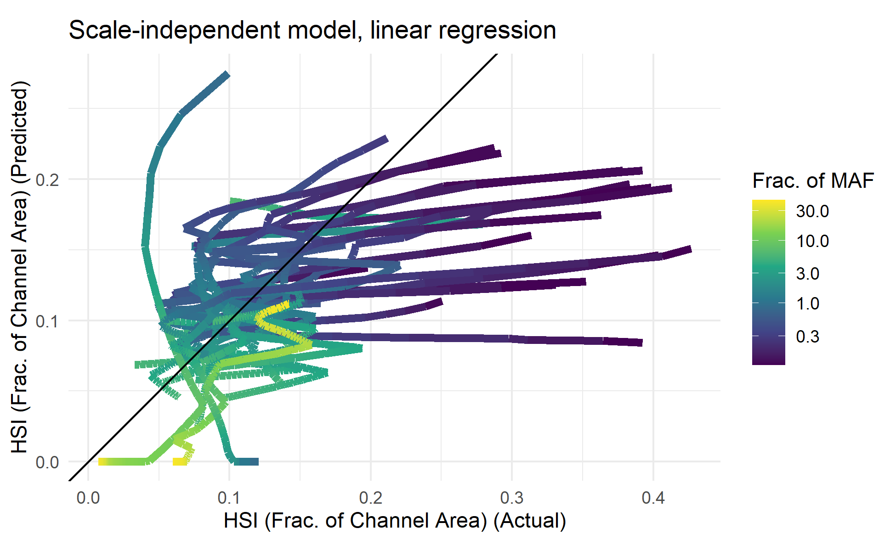<!-- -->

``` r
lm_si_res <- testing(td_split) |>
  mutate(hsi_frac_pred = predict(lm_si, testing(td_split))[[".pred"]]) |>
  select(comid, hsi_frac, hsi_frac_pred, flow_norm_cfs) 

lm_si_res |>
  ggplot() + geom_point(aes(x=hsi_frac, y=hsi_frac_pred, color=flow_norm_cfs)) + 
  coord_fixed() + geom_abline() + scale_color_viridis_c() + 
  ggtitle("Scale-independent model, linear regression")
```

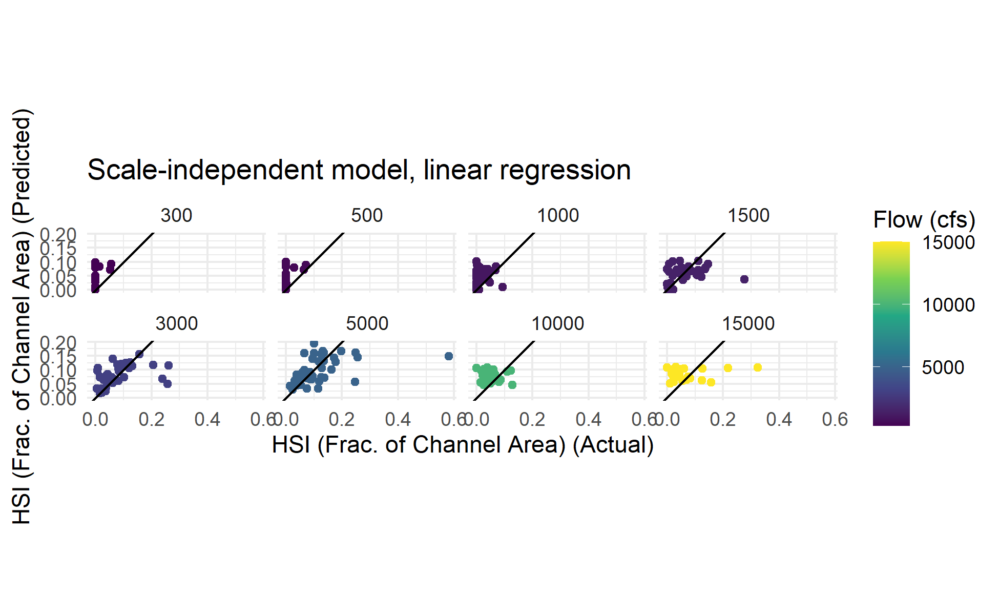<!-- -->

``` r
lm_si_res |> filter(comid %in% head(unique(testing(td_split)$comid),12)) |>
  left_join(transmute(flowline_attributes, comid, erom_q_ma_cfs)) |> #, chan_width_ft=chan_width_m/0.3048)) |>
  ggplot(aes(x=flow_norm_cfs*erom_q_ma_cfs, group=1)) + facet_wrap(~comid) + 
  geom_line(aes(y=hsi_frac_pred*100, color="predicted", group=1)) + geom_line(aes(y=hsi_frac*100, color="actual", group=1)) + 
  xlab("Flow (cfs)") + ylab("Suitable Habitat Area (% of Total Area)")
```

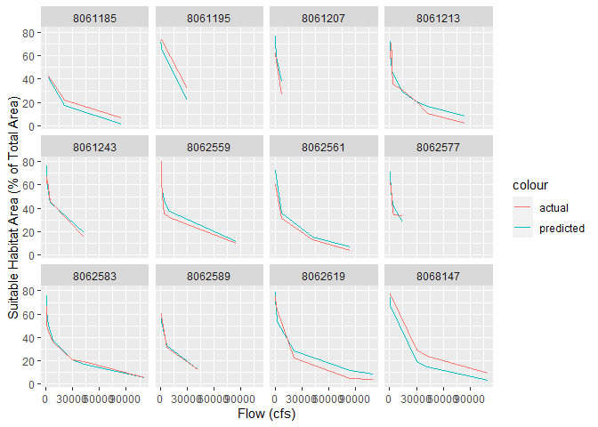<!-- -->

#### Scale-dependent (WUA-per-linear-ft versus flow)

Scale-dependent model version predicts the WUA per linear foot, using
absolute flow values as well as watershed scale parameters.

- interact flow and mean annual flow; flow and area/elev/ppt; to add
  scale dependence to the flow effect

``` r
sd_rec <- recipe(data=training(td_split), 
      formula = log_wua_per_lf ~ 
        # flow (cfs)
        flow_cfs + 
        # predictors of flow (catchment area, elevation, and MAP) -- attributes for gradient and upstream drainage area are interrelated
        slope + da_area_sq_km + da_elev_mean + da_ppt_mean_mm +
        # baseflow/peak flow statistics
        nf_bfl_dry_cfs + nf_bfl_wet_cfs + erom_q_ma_cfs + #log(peak_q2_cfs)  + log(peak_q5_cfs) + log(peak_q10_cfs) +
        # flow and channel characteristics, hydrologically predicted
        erom_v_ma_fps + bf_depth_m + bf_w_d_ratio + 
        # misc characteristics of the catchment
        da_k_erodibility + da_avg_slope + mean_ndvi +
        # misc characteristics of the locality
        loc_bfi + loc_pct_clay + loc_pct_sand + loc_permeability + loc_bedrock_depth + loc_ppt_mean_mm +
        # channel confinement characteristics
        mtpi30_min + vb_bf_w_ratio + frac_leveed_longitudinal + vb_width_transect +
        # channel sinuosity
        sinuosity + 
        # aquatic
        bio_aq_rank_sw + species + species_fish
        ) |>
  step_log(all_numeric_predictors(), -mtpi30_min, -mean_ndvi, -vb_bf_w_ratio, -frac_leveed_longitudinal) |>
  step_interact(terms = ~ flow_cfs:erom_q_ma_cfs) |>
  step_interact(terms = ~ slope:da_area_sq_km) |>
  step_interact(terms = ~ flow_cfs:da_area_sq_km) |>
  step_interact(terms = ~ flow_cfs:da_elev_mean) |>
  step_interact(terms = ~ flow_cfs:da_ppt_mean_mm) 

lm_sd <- workflow() |>
  add_recipe(sd_rec |> step_normalize(all_numeric_predictors())) |>
  add_model(lm_spec) |>
  fit(data=training(td_split))

lm_sd |> glance()
```

    ## # A tibble: 1 × 12
    ##   r.squared adj.r.squared sigma statistic p.value    df logLik   AIC   BIC
    ##       <dbl>         <dbl> <dbl>     <dbl>   <dbl> <dbl>  <dbl> <dbl> <dbl>
    ## 1     0.916         0.914 0.586      587.       0    33 -1591. 3253. 3445.
    ## # ℹ 3 more variables: deviance <dbl>, df.residual <int>, nobs <int>

``` r
lm_sd |> tidy()
```

    ## # A tibble: 34 × 5
    ##    term           estimate std.error statistic  p.value
    ##    <chr>             <dbl>     <dbl>     <dbl>    <dbl>
    ##  1 (Intercept)       5.41     0.0137    394.   0       
    ##  2 flow_cfs         34.5      2.64       13.1  2.85e-37
    ##  3 slope            -0.773    0.237      -3.26 1.12e- 3
    ##  4 da_area_sq_km    29.1      2.93        9.96 9.20e-23
    ##  5 da_elev_mean     -0.718    0.297      -2.41 1.59e- 2
    ##  6 da_ppt_mean_mm    4.66     0.303      15.4  2.39e-50
    ##  7 nf_bfl_dry_cfs    2.31     1.05        2.20 2.81e- 2
    ##  8 nf_bfl_wet_cfs   -1.98     0.776      -2.55 1.07e- 2
    ##  9 erom_q_ma_cfs   -22.8      2.53       -9.00 5.43e-19
    ## 10 erom_v_ma_fps     2.31     0.614       3.75 1.79e- 4
    ## # ℹ 24 more rows

``` r
lm_sd$fit$fit |> dotwhisker::dwplot()
```

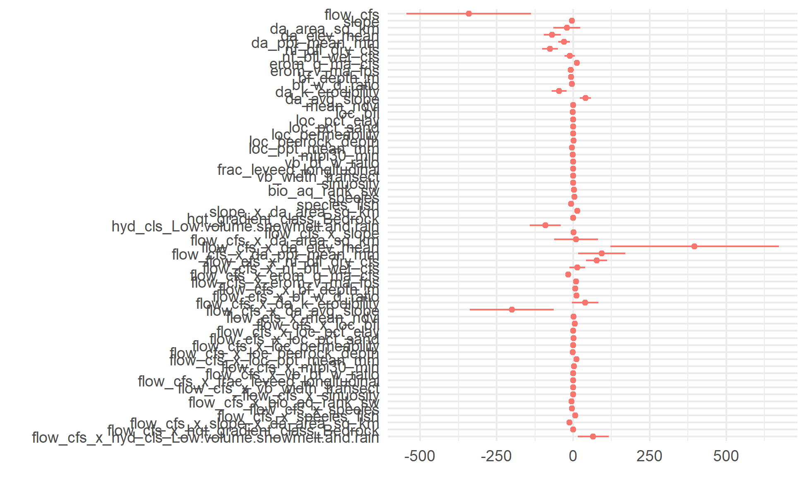<!-- -->

``` r
lm_sd_res <-
testing(td_split) |>
  mutate(log_wua_per_lf_pred = predict(lm_sd, testing(td_split))[[".pred"]]) |>
  transmute(comid, wua_per_lf=exp(log_wua_per_lf), wua_per_lf_pred=exp(log_wua_per_lf_pred), flow_cfs) 

lm_sd_res |>
  ggplot() + geom_point(aes(x=wua_per_lf, y=wua_per_lf_pred, color=flow_cfs)) + 
  scale_y_log10() + scale_x_log10() +  coord_fixed() + geom_abline() + scale_color_viridis_c() + 
  ggtitle("Scale-dependent model, linear regression")
```

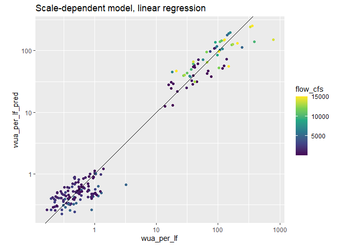<!-- -->

``` r
lm_sd_res |> filter(comid %in% head(unique(testing(td_split)$comid),12)) |>
  ggplot(aes(x=flow_cfs, group=1)) + facet_wrap(~comid) + 
  geom_line(aes(y=wua_per_lf_pred, color="predicted", group=1)) + geom_line(aes(y=wua_per_lf, color="actual", group=1)) + 
  scale_y_log10() + xlab("Flow (cfs)") + ylab("Suitable Habitat Area per LF Channel (ft)")
```

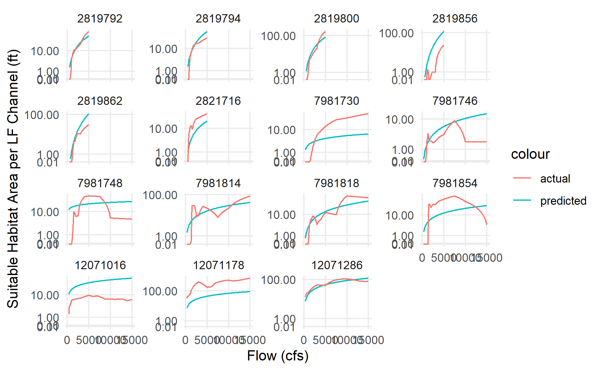<!-- -->

### Linear regression with regularized (lasso) feature selection

``` r
#install.packages("glmnet")
lasso_spec <- linear_reg(penalty = 0.01, mixture = 1) |> set_engine("glmnet")
```

#### Scale-independent (%HSI versus dimensionless flow)

``` r
drop_vars <- workflow() |>
  add_recipe(si_rec |> step_normalize(all_numeric_predictors())) |>
  add_model(lasso_spec) |>
  fit(data=training(td_split)) |>
  tidy() |> 
  filter(estimate==0) |> 
  pull(term)
```

    ## Warning: package 'glmnet' was built under R version 4.3.2

    ## Warning: package 'Matrix' was built under R version 4.3.2

``` r
lasso_si <- workflow() |>
  add_recipe(si_rec |> step_rm(all_of(drop_vars))) |>
  add_model(lm_spec) |>
  fit(data=training(td_split))

lasso_si |> glance()
```

    ## # A tibble: 1 × 12
    ##   r.squared adj.r.squared  sigma statistic p.value    df logLik    AIC    BIC
    ##       <dbl>         <dbl>  <dbl>     <dbl>   <dbl> <dbl>  <dbl>  <dbl>  <dbl>
    ## 1     0.806         0.805 0.0967      941.       0     8  1672. -3324. -3269.
    ## # ℹ 3 more variables: deviance <dbl>, df.residual <int>, nobs <int>

``` r
lasso_si |> tidy()
```

    ## # A tibble: 9 × 5
    ##   term                   estimate std.error statistic  p.value
    ##   <chr>                     <dbl>     <dbl>     <dbl>    <dbl>
    ## 1 (Intercept)            0.668     0.152         4.38 1.23e- 5
    ## 2 flow_norm_cfs         -0.118     0.00218     -54.1  0       
    ## 3 erom_v_ma_fps         -0.0760    0.0158       -4.81 1.59e- 6
    ## 4 bf_depth_m            -0.343     0.0211      -16.2  1.79e-55
    ## 5 bf_w_d_ratio          -0.123     0.0486       -2.53 1.16e- 2
    ## 6 loc_permeability      -0.0138    0.00447      -3.08 2.08e- 3
    ## 7 loc_ppt_mean_mm        0.102     0.0146        6.98 4.21e-12
    ## 8 nf_bfl_wet_cfs_norm    0.0159    0.00541       2.94 3.30e- 3
    ## 9 flow_norm_cfs_x_slope  0.000229  0.000195      1.17 2.40e- 1

``` r
lasso_si$fit$fit |> dotwhisker::dwplot()
```

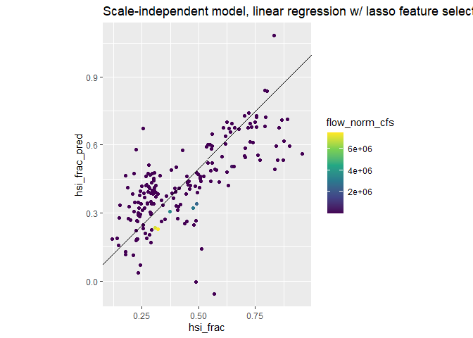<!-- -->

``` r
lasso_si_res <- 
testing(td_split) |>
  mutate(hsi_frac_pred = predict(lasso_si, testing(td_split))[[".pred"]]) |>
  select(comid, hsi_frac, hsi_frac_pred, flow_norm_cfs)

lasso_si_res |>
  ggplot() + geom_point(aes(x=hsi_frac, y=hsi_frac_pred, color=flow_norm_cfs)) + 
  coord_fixed() + geom_abline() + scale_color_viridis_c()  + 
  ggtitle("Scale-independent model, linear regression w/ lasso feature selection")
```

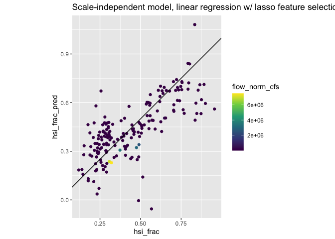<!-- -->

``` r
lasso_si_res |> filter(comid %in% head(unique(testing(td_split)$comid),12)) |>
  left_join(transmute(flowline_attributes, comid, erom_q_ma_cfs)) |> #, chan_width_ft=chan_width_m/0.3048)) |>
  ggplot(aes(x=flow_norm_cfs*erom_q_ma_cfs, group=1)) + facet_wrap(~comid) + 
  geom_line(aes(y=hsi_frac_pred*100, color="predicted", group=1)) + geom_line(aes(y=hsi_frac*100, color="actual", group=1)) + 
  xlab("Flow (cfs)") + ylab("Suitable Habitat Area (% of Total Area)")
```

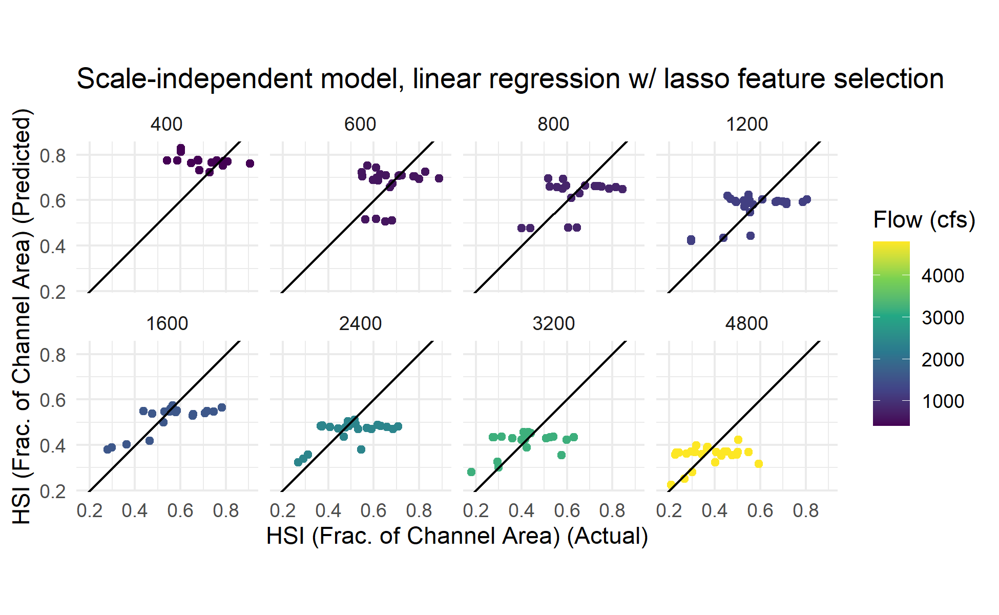<!-- -->

#### Scale-dependent (WUA-per-linear-ft versus flow)

``` r
drop_vars <- workflow() |>
  add_recipe(sd_rec |> step_normalize(all_numeric_predictors())) |>
  add_model(lasso_spec) |>
  fit(data=training(td_split)) |>
  tidy() |> 
  filter(estimate==0) |> 
  pull(term)

lasso_sd <- workflow() |>
  add_recipe(sd_rec |>
               step_rm(all_of(drop_vars))) |>
  add_model(lm_spec) |>
  fit(data=training(td_split))

lasso_sd |> glance()
```

    ## # A tibble: 1 × 12
    ##   r.squared adj.r.squared sigma statistic p.value    df logLik   AIC   BIC
    ##       <dbl>         <dbl> <dbl>     <dbl>   <dbl> <dbl>  <dbl> <dbl> <dbl>
    ## 1     0.890         0.889 0.666      856.       0    17 -1834. 3705. 3810.
    ## # ℹ 3 more variables: deviance <dbl>, df.residual <int>, nobs <int>

``` r
lasso_sd |> tidy()
```

    ## # A tibble: 18 × 5
    ##    term                       estimate std.error statistic   p.value
    ##    <chr>                         <dbl>     <dbl>     <dbl>     <dbl>
    ##  1 (Intercept)               -98.1       5.17      -19.0   2.29e- 73
    ##  2 slope                       0.0263    0.00564     4.67  3.18e-  6
    ##  3 da_elev_mean                0.229     0.0516      4.44  9.68e-  6
    ##  4 da_ppt_mean_mm             14.9       0.418      35.5   6.86e-210
    ##  5 da_k_erodibility            2.18      1.09        2.00  4.54e-  2
    ##  6 loc_bfi                    -1.43      0.539      -2.65  8.23e-  3
    ##  7 loc_pct_sand                1.01      0.215       4.68  3.03e-  6
    ##  8 loc_permeability           -0.296     0.0543     -5.45  5.81e-  8
    ##  9 loc_bedrock_depth           0.563     0.183       3.08  2.07e-  3
    ## 10 vb_bf_w_ratio               0.0130    0.00388     3.34  8.48e-  4
    ## 11 frac_leveed_longitudinal   -0.887     0.144      -6.18  7.89e- 10
    ## 12 vb_width_transect           0.115     0.0243      4.72  2.54e-  6
    ## 13 sinuosity                  -1.09      0.188      -5.78  9.04e-  9
    ## 14 bio_aq_rank_sw             -0.787     0.603      -1.30  1.92e-  1
    ## 15 species                    -0.471     0.429      -1.10  2.73e-  1
    ## 16 species_fish                0.0782    0.578       0.135 8.92e-  1
    ## 17 flow_cfs_x_da_area_sq_km   -0.00686   0.00221    -3.11  1.90e-  3
    ## 18 flow_cfs_x_da_ppt_mean_mm  -0.0352    0.00250   -14.1   7.12e- 43

``` r
lasso_sd$fit$fit |> dotwhisker::dwplot()
```

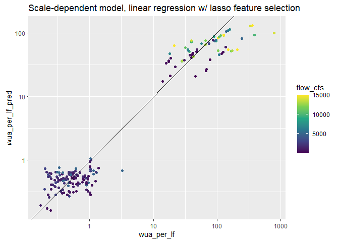<!-- -->

``` r
lasso_sd_res <- 
testing(td_split) |>
  mutate(log_wua_per_lf_pred = predict(lasso_sd, testing(td_split))[[".pred"]]) |>
  transmute(comid, wua_per_lf=exp(log_wua_per_lf), wua_per_lf_pred=exp(log_wua_per_lf_pred), flow_cfs) 

lasso_sd_res |>
  ggplot() + geom_point(aes(x=wua_per_lf, y=wua_per_lf_pred, color=flow_cfs)) + 
  scale_y_log10() + scale_x_log10() +  coord_fixed() + geom_abline() + scale_color_viridis_c()   + 
  ggtitle("Scale-dependent model, linear regression w/ lasso feature selection")
```

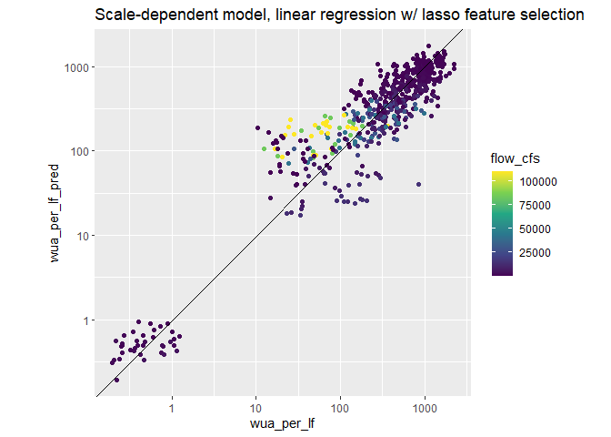<!-- -->

``` r
lasso_sd_res |> filter(comid %in% head(unique(testing(td_split)$comid),12)) |>
  ggplot(aes(x=flow_cfs, group=1)) + facet_wrap(~comid) + 
  geom_line(aes(y=wua_per_lf_pred, color="predicted", group=1)) + geom_line(aes(y=wua_per_lf, color="actual", group=1)) + 
  scale_y_log10() + xlab("Flow (cfs)") + ylab("Suitable Habitat Area per LF Channel (ft)")
```

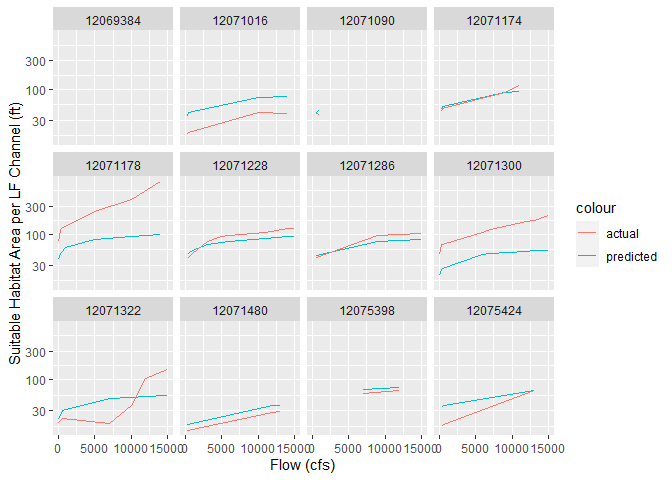<!-- -->

### Random Forest Regrssion

``` r
#install.packages("ranger")
#rfr_spec <- rand_forest(mode = "regression", trees = 2^12)
```

#### Scale-independent (%HSI versus dimensionless flow)

``` r
# set up cross validation
folds <- vfold_cv(training(td_split), v = 10, strata = dataset)
val_metrics <- metric_set(rmse, rsq, ccc)

# tuned random forest: how many trees to use?
rfr_spec <- rand_forest(mode = "regression", trees = tune())
rfr_grid <- tibble(trees = 2^seq(0, 12, 1))

rfr_si_tune <- 
  workflow() |>
  add_recipe(si_rec) |>
  add_model(rfr_spec) |>
  tune_grid(resamples = folds,
            grid = rfr_grid,
            metrics = val_metrics)
```

    ## Warning: package 'ranger' was built under R version 4.3.2

``` r
rfr_si_tune |>
  collect_metrics() |>
  ggplot(aes(x = trees, y = mean, color = .metric)) +
  geom_errorbar(aes(ymin = mean - std_err,
                    ymax = mean + std_err),
                width = 0.05) +
  geom_line() +
  facet_wrap(. ~ .metric, ncol = 1, scales="free") +
  theme(legend.position = "none") + scale_x_log10()
```

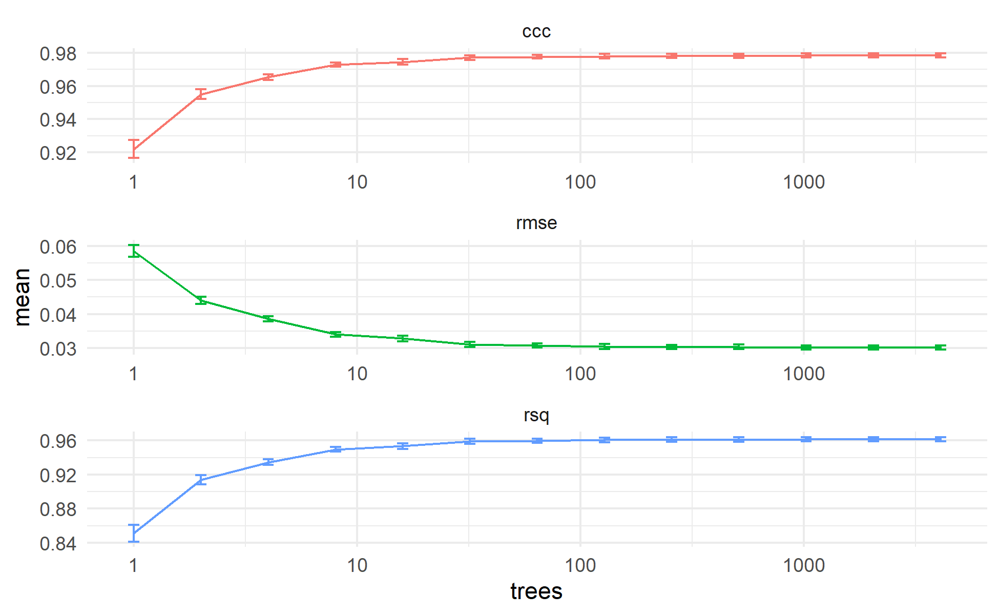<!-- -->

``` r
rfr_spec <- rand_forest(mode = "regression", trees = 2^8)

rfr_si <- workflow() |>
  add_recipe(si_rec) |>
  add_model(rfr_spec) |>
  fit(data=training(td_split))

rfr_si$fit$fit |> print()
```

    ## parsnip model object
    ## 
    ## Ranger result
    ## 
    ## Call:
    ##  ranger::ranger(x = maybe_data_frame(x), y = y, num.trees = ~2^8,      num.threads = 1, verbose = FALSE, seed = sample.int(10^5,          1)) 
    ## 
    ## Type:                             Regression 
    ## Number of trees:                  256 
    ## Sample size:                      1819 
    ## Number of independent variables:  24 
    ## Mtry:                             4 
    ## Target node size:                 5 
    ## Variable importance mode:         none 
    ## Splitrule:                        variance 
    ## OOB prediction error (MSE):       0.003955616 
    ## R squared (OOB):                  0.9177465

``` r
rfr_si_res <- 
testing(td_split) |>
  mutate(hsi_frac_pred = predict(rfr_si, testing(td_split))[[".pred"]]) |>
  select(comid, hsi_frac, hsi_frac_pred, flow_norm_cfs) 

rfr_si_res |> 
  ggplot() + geom_point(aes(x=hsi_frac, y=hsi_frac_pred, color=flow_norm_cfs)) + 
  coord_fixed() + geom_abline() + scale_color_viridis_c() + 
  ggtitle("Scale-independent model, random forest regression")
```

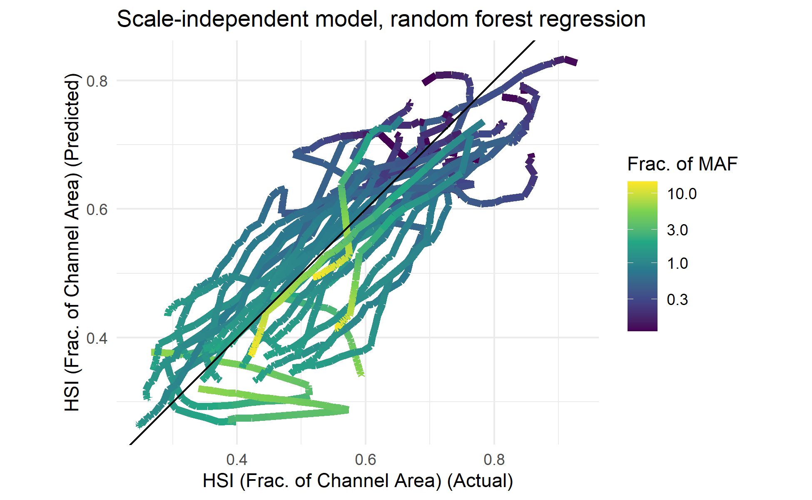<!-- -->

``` r
rfr_si_res |> filter(comid %in% head(unique(testing(td_split)$comid),12)) |>
  left_join(transmute(flowline_attributes, comid, erom_q_ma_cfs)) |> #, chan_width_ft=chan_width_m/0.3048)) |>
  ggplot(aes(x=flow_norm_cfs*erom_q_ma_cfs, group=1)) + facet_wrap(~comid) + 
  geom_line(aes(y=hsi_frac_pred*100, color="predicted", group=1)) + geom_line(aes(y=hsi_frac*100, color="actual", group=1)) + 
  xlab("Flow (cfs)") + ylab("Suitable Habitat Area (% of Total Area)")
```

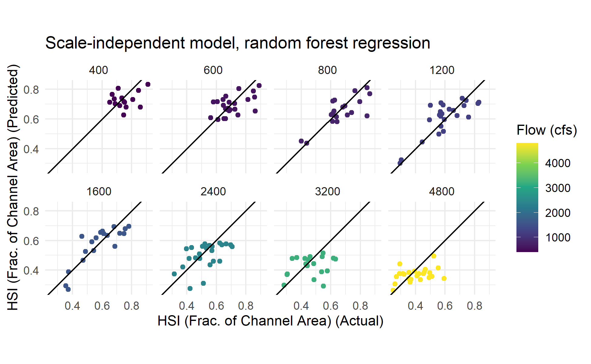<!-- -->

#### Scale-dependent (WUA-per-linear-ft versus flow)

``` r
rfr_spec <- rand_forest(mode = "regression", trees = tune())
rfr_grid <- tibble(trees = 2^seq(0, 12, 1))

rfr_sd_tune <- 
  workflow() |>
  add_recipe(sd_rec) |>
  add_model(rfr_spec) |>
  tune_grid(resamples = folds,
            grid = rfr_grid,
            metrics = val_metrics)
rfr_sd_tune |>
  collect_metrics() |>
  ggplot(aes(x = trees, y = mean, color = .metric)) +
  geom_errorbar(aes(ymin = mean - std_err,
                    ymax = mean + std_err),
                width = 0.05) +
  geom_line() +
  facet_wrap(. ~ .metric, ncol = 1, scales="free") +
  theme(legend.position = "none") + scale_x_log10()
```

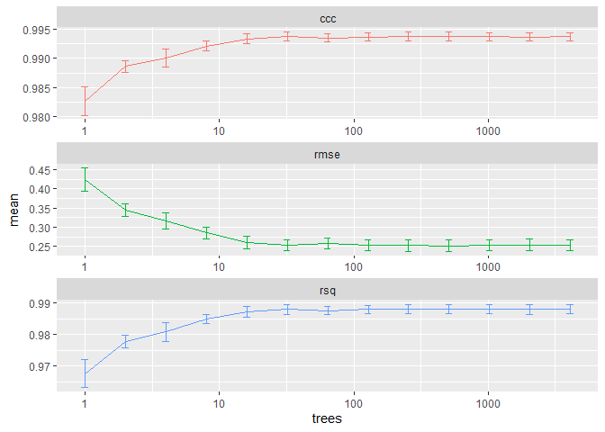<!-- -->

``` r
rfr_spec <- rand_forest(mode = "regression", trees = 2^8)

rfr_sd <- workflow() |>
  add_recipe(sd_rec) |>
  add_model(rfr_spec) |>
  fit(data=training(td_split))

rfr_sd$fit$fit |> print()
```

    ## parsnip model object
    ## 
    ## Ranger result
    ## 
    ## Call:
    ##  ranger::ranger(x = maybe_data_frame(x), y = y, num.trees = ~2^8,      num.threads = 1, verbose = FALSE, seed = sample.int(10^5,          1)) 
    ## 
    ## Type:                             Regression 
    ## Number of trees:                  256 
    ## Sample size:                      1819 
    ## Number of independent variables:  33 
    ## Mtry:                             5 
    ## Target node size:                 5 
    ## Variable importance mode:         none 
    ## Splitrule:                        variance 
    ## OOB prediction error (MSE):       0.05335508 
    ## R squared (OOB):                  0.9866376

``` r
rfr_sd_res <-
testing(td_split) |>
  mutate(log_wua_per_lf_pred = predict(rfr_sd, testing(td_split))[[".pred"]]) |>
  transmute(comid, wua_per_lf=exp(log_wua_per_lf), wua_per_lf_pred=exp(log_wua_per_lf_pred), flow_cfs) 

rfr_sd_res |>
  ggplot() + geom_point(aes(x=wua_per_lf, y=wua_per_lf_pred, color=flow_cfs)) + 
  scale_y_log10() + scale_x_log10() +  coord_fixed() + geom_abline() + scale_color_viridis_c()   + 
  ggtitle("Scale-dependent model, random forest regression")
```

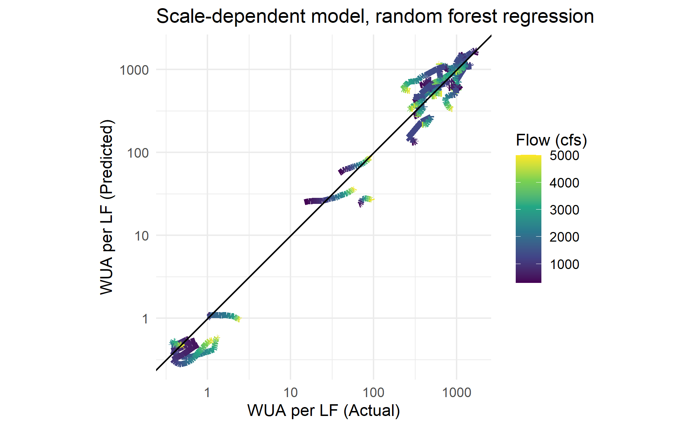<!-- -->

``` r
rfr_sd_res |> filter(comid %in% head(unique(testing(td_split)$comid),12)) |>
  ggplot(aes(x=flow_cfs, group=1)) + facet_wrap(~comid) + 
  geom_line(aes(y=wua_per_lf_pred, color="predicted", group=1)) + geom_line(aes(y=wua_per_lf, color="actual", group=1)) + 
  scale_y_log10() + xlab("Flow (cfs)") + ylab("Suitable Habitat Area per LF Channel (ft)") 
```

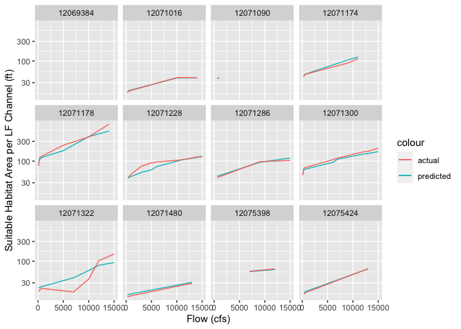<!-- -->

## Random Forest model prediction output

``` r
# assemble prediction dataset
pd <- flowline_attributes |> 
  # filter out Valley Lowland areas
  filter(hqt_gradient_class != "Valley Lowland") |>
  # filter for just the areas that are hydrologically similar to the training data
  filter(hyd_cls %in% c("High-volume snowmelt and rain",
                        "Low-volume snowmelt and rain")) |>
  # select the variables that are used in the model and drop NAs
  mutate(nf_bfl_dry_cfs_norm = coalesce(nf_bfl_dry_cfs/erom_q_ma_cfs,0), # normalized baseflow values
         nf_bfl_wet_cfs_norm = coalesce(nf_bfl_wet_cfs/erom_q_ma_cfs,0)) |>
  select(comid, any_of(c(sd_rec$var_info$variable, si_rec$var_info$variable))) |> drop_na() |>
  # create series of flow prediction points
  expand_grid(flow_cfs = c(0,signif(100*2^seq(-2,7,0.5),2))) |>
  mutate(flow_cfs = if_else(flow_cfs>0, flow_cfs, erom_q_ma_cfs)) |> # also evaluate at mean annual flow
  mutate(flow_norm_cfs = coalesce(flow_cfs/erom_q_ma_cfs,0)) |> # flow as a percent of mean annual flow
  arrange(comid, flow_cfs) |>
  glimpse()
```

    ## Rows: 232,900
    ## Columns: 32
    ## $ comid                    <dbl> 342439, 342439, 342439, 342439, 342439, 34243…
    ## $ slope                    <dbl> 0.00931547, 0.00931547, 0.00931547, 0.0093154…
    ## $ da_area_sq_km            <dbl> 8.3835, 8.3835, 8.3835, 8.3835, 8.3835, 8.383…
    ## $ da_elev_mean             <dbl> 2284.09, 2284.09, 2284.09, 2284.09, 2284.09, …
    ## $ da_ppt_mean_mm           <dbl> 1248.088, 1248.088, 1248.088, 1248.088, 1248.…
    ## $ nf_bfl_dry_cfs           <dbl> 0.864, 0.864, 0.864, 0.864, 0.864, 0.864, 0.8…
    ## $ nf_bfl_wet_cfs           <dbl> 4.33, 4.33, 4.33, 4.33, 4.33, 4.33, 4.33, 4.3…
    ## $ erom_q_ma_cfs            <dbl> 4.109, 4.109, 4.109, 4.109, 4.109, 4.109, 4.1…
    ## $ erom_v_ma_fps            <dbl> 0.88129, 0.88129, 0.88129, 0.88129, 0.88129, …
    ## $ bf_depth_m               <dbl> 0.76, 0.76, 0.76, 0.76, 0.76, 0.76, 0.76, 0.7…
    ## $ bf_w_d_ratio             <dbl> 8.460526, 8.460526, 8.460526, 8.460526, 8.460…
    ## $ da_k_erodibility         <dbl> 0.1827, 0.1827, 0.1827, 0.1827, 0.1827, 0.182…
    ## $ da_avg_slope             <dbl> 19.95, 19.95, 19.95, 19.95, 19.95, 19.95, 19.…
    ## $ mean_ndvi                <dbl> 0.2641405, 0.2641405, 0.2641405, 0.2641405, 0…
    ## $ loc_bfi                  <dbl> 58, 58, 58, 58, 58, 58, 58, 58, 58, 58, 58, 5…
    ## $ loc_pct_clay             <dbl> 13.60, 13.60, 13.60, 13.60, 13.60, 13.60, 13.…
    ## $ loc_pct_sand             <dbl> 57.30, 57.30, 57.30, 57.30, 57.30, 57.30, 57.…
    ## $ loc_permeability         <dbl> 10.16, 10.16, 10.16, 10.16, 10.16, 10.16, 10.…
    ## $ loc_bedrock_depth        <dbl> 123.50, 123.50, 123.50, 123.50, 123.50, 123.5…
    ## $ loc_ppt_mean_mm          <dbl> 1197.80, 1197.80, 1197.80, 1197.80, 1197.80, …
    ## $ mtpi30_min               <dbl> -9, -9, -9, -9, -9, -9, -9, -9, -9, -9, -9, -…
    ## $ vb_bf_w_ratio            <dbl> 1, 1, 1, 1, 1, 1, 1, 1, 1, 1, 1, 1, 1, 1, 1, …
    ## $ frac_leveed_longitudinal <dbl> 0, 0, 0, 0, 0, 0, 0, 0, 0, 0, 0, 0, 0, 0, 0, …
    ## $ vb_width_transect        <dbl> 6.43, 6.43, 6.43, 6.43, 6.43, 6.43, 6.43, 6.4…
    ## $ sinuosity                <dbl> 1.32, 1.32, 1.32, 1.32, 1.32, 1.32, 1.32, 1.3…
    ## $ bio_aq_rank_sw           <int> 3, 3, 3, 3, 3, 3, 3, 3, 3, 3, 3, 3, 3, 3, 3, …
    ## $ species                  <dbl> 61, 61, 61, 61, 61, 61, 61, 61, 61, 61, 61, 6…
    ## $ species_fish             <dbl> 1, 1, 1, 1, 1, 1, 1, 1, 1, 1, 1, 1, 1, 1, 1, …
    ## $ nf_bfl_dry_cfs_norm      <dbl> 0.2102701, 0.2102701, 0.2102701, 0.2102701, 0…
    ## $ nf_bfl_wet_cfs_norm      <dbl> 1.0537844, 1.0537844, 1.0537844, 1.0537844, 1…
    ## $ flow_cfs                 <dbl> 4.109, 25.000, 35.000, 50.000, 71.000, 100.00…
    ## $ flow_norm_cfs            <dbl> 1.000000, 6.084205, 8.517888, 12.168411, 17.2…

``` r
# # get min/max ranges from the training data
# ranges <- td |> select(all_of(names(pd))) |> 
#   reframe(across(everything(), function(x) (range(x)))) 
# # filter the prediction data for just those falling within the training data
# pd_idx <- pd |> 
#   select(comid, all_of(names(ranges))) |>
#   mutate(across(-comid, function(x) x>ranges[[cur_column()]][[1]] & x<=ranges[[cur_column()]][[2]])) |>
#   filter(if_all(-comid)) |>
#   pull(comid)
# # update pd to exclude the out-of-range data
# pd <- pd |> filter(comid %in% pd_idx) |> glimpse()
```

``` r
pd_rf <- pd |> #head(100) |>
  mutate(log_wua_per_lf_pred = predict(rfr_sd, pd)[[".pred"]],
         wua_per_lf_pred=exp(log_wua_per_lf_pred), flow_cfs,
         hsi_frac_pred = predict(rfr_si, pd)[[".pred"]]) 

pd_rf |> select(comid, 
                flow_cfs, wua_per_lf_pred, 
                flow_norm_cfs, hsi_frac_pred) |> glimpse()
```

    ## Rows: 232,900
    ## Columns: 5
    ## $ comid           <dbl> 342439, 342439, 342439, 342439, 342439, 342439, 342439…
    ## $ flow_cfs        <dbl> 4.109, 25.000, 35.000, 50.000, 71.000, 100.000, 140.00…
    ## $ wua_per_lf_pred <dbl> 2.163067, 2.181766, 2.182832, 2.175670, 2.167569, 2.14…
    ## $ flow_norm_cfs   <dbl> 1.000000, 6.084205, 8.517888, 12.168411, 17.279143, 24…
    ## $ hsi_frac_pred   <dbl> 0.5902682, 0.4274736, 0.4218682, 0.4172674, 0.4173225,…

``` r
pd_rf |> saveRDS("../data/rf_predictions.Rds")
```

Example plot of habitat area per linear foot at 800 cfs (scale-dependent
model)

``` r
flowlines |> st_zm() |>
  inner_join(pd_rf |> filter(flow_cfs==800), by=join_by(comid)) |>
  ggplot() + geom_sf(aes(color = wua_per_lf_pred)) + 
  scale_color_viridis_c(trans="log")
```

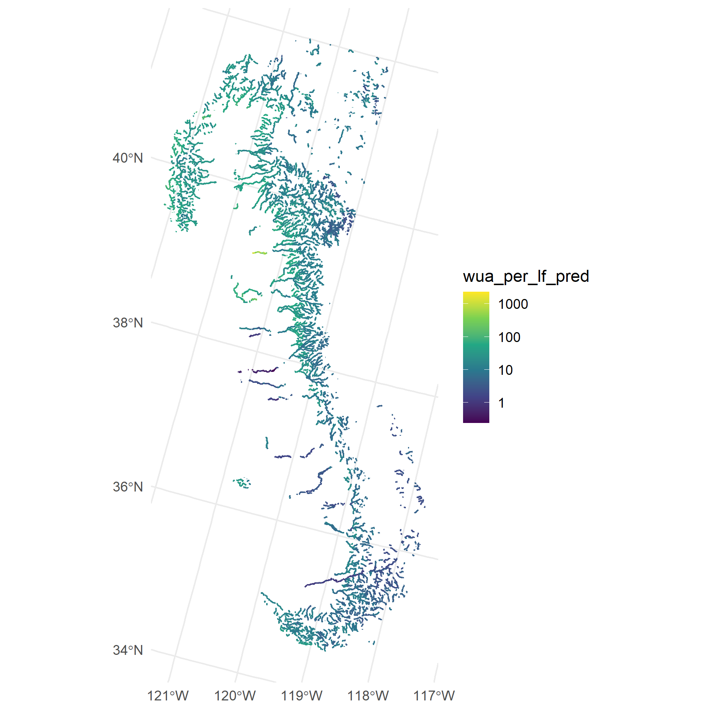<!-- -->

Example plot of percent habitat area at mean annual flow
(scale-independent model)

``` r
flowlines |> st_zm() |>
  inner_join(pd_rf |> filter(flow_norm_cfs==1), by=join_by(comid)) |>
  ggplot() + geom_sf(aes(color = hsi_frac_pred)) + 
  scale_color_viridis_c(trans="log")
```

<!-- -->

## Predictions summarized by DSMHabitat reach

``` r
# this is a rough join method, just taking any COMIDs within 50 ft buffer of flowline
mainstems <- 
  st_read("/vsizip/rearing_spatial_data/habitat_extents_combined_gradients_v3.shp.zip", as_tibble=T) |>
  janitor::clean_names() |>
  group_by(habitat, species, river, hqt_type) |>
  summarize() |>
  st_buffer(dist=50) |>
  st_union(by_feature=T) |>
  st_transform(st_crs(flowlines)) |>
  filter(habitat=="rearing" & species=="Fall Run Chinook") |>
  filter(hqt_type=="Valley Foothill")
```

    ## Reading layer `habitat_extents_combined_gradients_v3' from data source 
    ##   `/vsizip/rearing_spatial_data/habitat_extents_combined_gradients_v3.shp.zip' 
    ##   using driver `ESRI Shapefile'
    ## Simple feature collection with 323 features and 12 fields
    ## Geometry type: MULTILINESTRING
    ## Dimension:     XY
    ## Bounding box:  xmin: -251634.9 ymin: -139292.4 xmax: 61284.41 ymax: 364940.4
    ## Projected CRS: NAD83 / California Albers

    ## `summarise()` has grouped output by 'habitat', 'species', 'river'. You can
    ## override using the `.groups` argument.

``` r
mainstems_comid <- 
  flowlines |> st_zm() |>
  st_join(mainstems, join=st_intersects, left=F) |>
  mutate(length_ft = st_length(geometry) |> units::set_units("ft") |> units::drop_units())

mainstems_comid |> ggplot() + geom_sf(aes(color=river, linetype=hqt_type)) + theme(legend.key.height = unit(12, "point"))
```

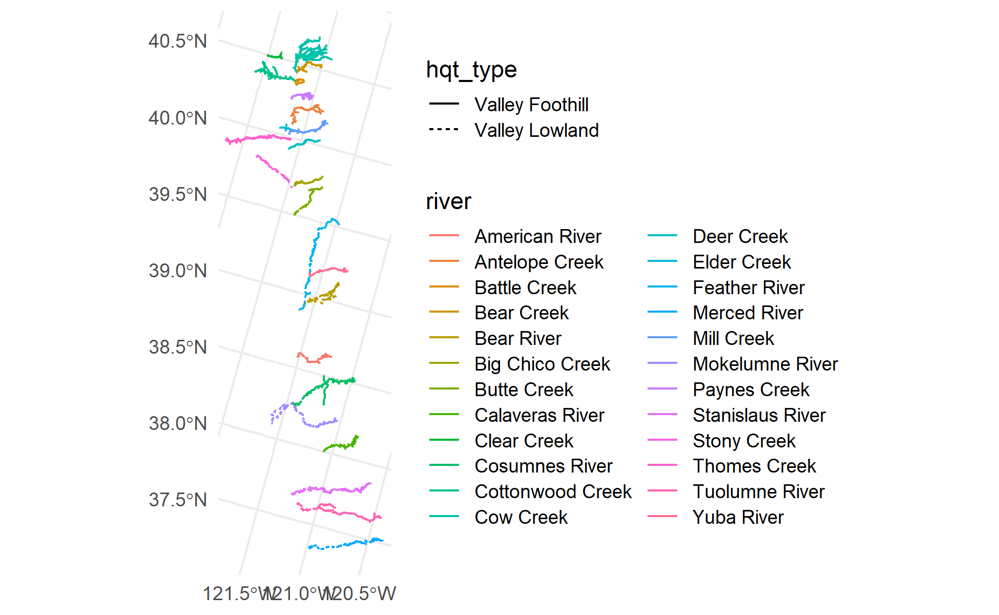<!-- -->

``` r
pd_dsmhabitat <- flowline_attributes |> 
  # select the variables that are used in the model and drop NAs
  select(comid, any_of(sd_rec$var_info$variable)) |> 
  # create series of flow prediction points
  expand_grid(flow_cfs = c(100,250,300,400,500,600,1000,3000,5000,6000,7000,9000,10000,11000,12000,13000,14000,15000)) |>
  arrange(comid, flow_cfs) |>
  filter(comid %in% mainstems_comid$comid) |>
  drop_na() 

pd_dsmhabitat_pred <-
  pd_dsmhabitat|>
  mutate(log_wua_per_lf_pred = predict(rfr_sd, pd_dsmhabitat)[[".pred"]],
         wua_per_lf_pred=exp(log_wua_per_lf_pred), flow_cfs) |>
  select(comid, 
         flow_cfs, wua_per_lf_pred) |> glimpse()
```

    ## Rows: 18,864
    ## Columns: 3
    ## $ comid           <dbl> 348543, 348543, 348543, 348543, 348543, 348543, 348543…
    ## $ flow_cfs        <dbl> 100, 250, 300, 400, 500, 600, 1000, 3000, 5000, 6000, …
    ## $ wua_per_lf_pred <dbl> 9.6969465, 9.6373275, 9.6274466, 9.5680214, 9.5650894,…

``` r
pd_rf_by_mainstem <-
  mainstems_comid |> 
  st_drop_geometry() |>
  inner_join(pd_dsmhabitat_pred, by=join_by(comid), relationship="many-to-many") |>
  group_by(habitat, species, river, flow_cfs) |>
  summarize(tot_wua_per_lf_pred = sum(coalesce(wua_per_lf_pred,0)),
            tot_length_ft = sum(coalesce(length_ft,0))) |>
  mutate(tot_wua_ft2 = tot_wua_per_lf_pred * tot_length_ft,
         tot_wua_ac = tot_wua_ft2 / 43560,
         avg_wua_ft2_per_1000ft = 1000 * tot_wua_ft2 / tot_length_ft) |>
  glimpse()
```

    ## `summarise()` has grouped output by 'habitat', 'species', 'river'. You can
    ## override using the `.groups` argument.

    ## Rows: 432
    ## Columns: 9
    ## Groups: habitat, species, river [24]
    ## $ habitat                <chr> "rearing", "rearing", "rearing", "rearing", "re…
    ## $ species                <chr> "Fall Run Chinook", "Fall Run Chinook", "Fall R…
    ## $ river                  <chr> "American River", "American River", "American R…
    ## $ flow_cfs               <dbl> 100, 250, 300, 400, 500, 600, 1000, 3000, 5000,…
    ## $ tot_wua_per_lf_pred    <dbl> 635.3924, 648.8732, 658.2781, 664.5243, 673.157…
    ## $ tot_length_ft          <dbl> 52129.14, 52129.14, 52129.14, 52129.14, 52129.1…
    ## $ tot_wua_ft2            <dbl> 33122461, 33825207, 34315475, 34641081, 3509114…
    ## $ tot_wua_ac             <dbl> 760.3871, 776.5199, 787.7749, 795.2498, 805.581…
    ## $ avg_wua_ft2_per_1000ft <dbl> 635392.4, 648873.2, 658278.1, 664524.3, 673157.…

``` r
pd_rf_by_mainstem |>
  ggplot() + 
  geom_line(aes(x = flow_cfs, y = tot_wua_ac, color=species, linetype=habitat)) + 
  facet_wrap(~river, scales="free_y") + 
  scale_x_log10(breaks=c(100,300,1000,3000,10000)) + 
  scale_y_log10() + theme(legend.position="top", panel.grid.minor = element_blank()) 
```

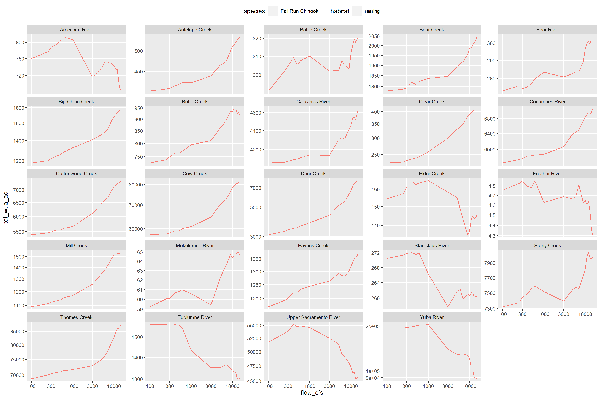<!-- -->

``` r
watersheds <- pd_rf_by_mainstem |> 
  filter(river != "South Delta") |> 
  pull(river) |> unique()

watershed_name <- tolower(gsub(pattern = "-| ", replacement = "_", x = watersheds))
watershed_rda_name <- paste(watershed_name, "floodplain", sep = "_")

dsm_habitat_floodplain <- map_df(watershed_rda_name, function(watershed) {
  df <- as.data.frame(do.call(`::`, list(pkg = "DSMhabitat", name = watershed)))
}) |> 
  rename(river = watershed,
         flow_cfs_dsm = flow_cfs) |>
  mutate(FR_floodplain_m2 = FR_floodplain_acres * 4046.86,
         FR_floodplain_m2_suitable = DSMhabitat::apply_suitability(FR_floodplain_m2),
         FR_floodplain_acres_suitable = FR_floodplain_m2_suitable / 4046.86)

pd_rf_by_mainstem |> 
  left_join(dsm_habitat_floodplain) |> 
  #filter(river == "American River") |> 
  ggplot() +
  geom_line(aes(x = flow_cfs, y = tot_wua_ac, color='modeled')) + 
  geom_line(aes(x = flow_cfs_dsm, y = FR_floodplain_acres_suitable, color = 'DSMhabitat')) + 
  facet_wrap(~river) +#, scales="free_y") + 
  scale_x_log10() + #breaks=c(100,300,1000,3000,10000)) + 
  scale_y_log10() + theme(legend.position="top", panel.grid.minor = element_blank()) 
```

    ## Joining with `by = join_by(river)`

    ## Warning in left_join(pd_rf_by_mainstem, dsm_habitat_floodplain): Detected an unexpected many-to-many relationship between `x` and `y`.
    ## ℹ Row 1 of `x` matches multiple rows in `y`.
    ## ℹ Row 1 of `y` matches multiple rows in `x`.
    ## ℹ If a many-to-many relationship is expected, set `relationship =
    ##   "many-to-many"` to silence this warning.

    ## Warning: Transformation introduced infinite values in continuous y-axis

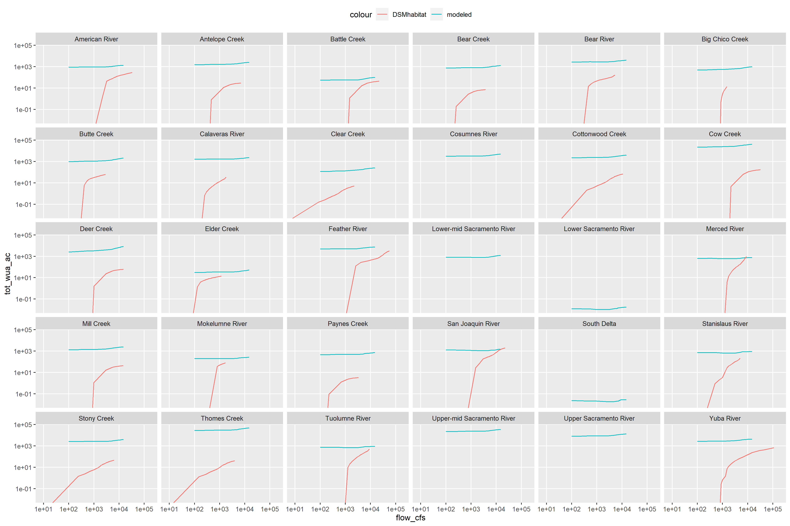<!-- -->

``` r
watersheds <- pd_rf_by_mainstem |> 
  filter(river != "South Delta") |> 
  pull(river) |> unique()

watershed_name <- tolower(gsub(pattern = "-| ", replacement = "_", x = watersheds))
watershed_rda_name <- paste(watershed_name, "instream", sep = "_")

dsm_habitat_instream <- map_df(paste(watershed_name, "instream", sep = "_"), 
                               possibly(function(watershed) {
                                 df <- as.data.frame(do.call(`::`, list(pkg = "DSMhabitat", name = watershed)))
                                 }, otherwise = NULL)) |> rename(river = watershed) 

ggplot() +
  geom_line(data=pd_rf_by_mainstem, aes(x = flow_cfs, y = avg_wua_ft2_per_1000ft, color='modeled')) + 
  geom_line(data=dsm_habitat_instream, aes(x = flow_cfs, y = FR_juv_wua, color = 'DSMhabitat')) + 
  facet_wrap(~river) +#, scales="free_y") + 
  scale_x_log10() + 
  scale_y_log10() + theme(legend.position="top", panel.grid.minor = element_blank()) 
```

    ## Warning: Transformation introduced infinite values in continuous x-axis

    ## Warning: Removed 5 rows containing missing values (`geom_line()`).

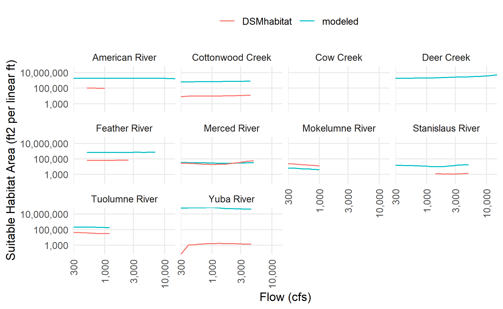<!-- -->

===

``` r
knitr::knit_exit()
```
