Exploratory Modeling
================
[Skyler Lewis](mailto:slewis@flowwest.com)
2024-03-04

- [Exploration and PCA of training
  data](#exploration-and-pca-of-training-data)
- [Set up training data](#set-up-training-data)
- [Split into training and testing
  datasets](#split-into-training-and-testing-datasets)
- [Modeling](#modeling)
  - [Linear regression](#linear-regression)
  - [Linear regression with regularized (lasso) feature
    selection](#linear-regression-with-regularized-lasso-feature-selection)
  - [Random Forest Regrssion](#random-forest-regrssion)
- [Random Forest model prediction
  output](#random-forest-model-prediction-output)
- [Predictions summarized by DSMHabitat
  reach](#predictions-summarized-by-dsmhabitat-reach)

``` r
library(tidyverse)
library(sf)
library(stars)
library(tidymodels)
library(broom.mixed) # tidy output of mixed model results
library(dotwhisker) # visualize regression results

knitr::opts_chunk$set(eval=TRUE, fig.width=6.5, fig.height=4, dpi=300)

theme_set(theme_minimal())
```

``` r
flowlines <- readRDS("../data/flowline_geometries.Rds") |>
  st_transform("ESRI:102039")

flowline_attributes <- readRDS("../data/flowline_attributes.Rds")
```

    ## Warning in readRDS("../data/flowline_attributes.Rds"): input string 'Ca<bf>on
    ## Creek' cannot be translated to UTF-8, is it valid in 'ASCII'?

    ## Warning in readRDS("../data/flowline_attributes.Rds"): input string 'A<bf>o
    ## Nuevo Creek' cannot be translated to UTF-8, is it valid in 'ASCII'?

    ## Warning in readRDS("../data/flowline_attributes.Rds"): input string 'Pe<bf>a
    ## Creek' cannot be translated to UTF-8, is it valid in 'ASCII'?

``` r
flow_to_suitable_area <- readRDS("../data/fsa_combined.Rds")

# Optionally, swap out the original HSI ranges with the version using the HQT depth/velocity cutoffs
if(FALSE){
  flow_to_suitable_area <- 
    flow_to_suitable_area |>
    transmute(dataset, comid, flow_cfs, area_tot_ft2,
              area_wua_ft2 = area_wua_ft2_hqt,
              hsi_frac = hsi_frac_hqt)
}
  
# Limit to flow ranges covered by all training data, and interpolate gaps
interp_flows <- seq(300,5000,100)
if(TRUE){
  flow_to_suitable_area <- 
    flow_to_suitable_area |>
    group_by(dataset, comid) |>
    complete(flow_cfs = interp_flows) |>
    arrange(dataset, comid, flow_cfs) |>
    mutate(across(c(area_tot_ft2, area_wua_ft2, hsi_frac), function(var) zoo::na.approx(var, x = flow_cfs, na.rm=F))) |>
    filter(flow_cfs %in% interp_flows)
}

train_data <- flowlines |> st_drop_geometry() |>
  left_join(flowline_attributes, by=join_by("comid"), relationship="one-to-one") |>
  inner_join(flow_to_suitable_area, by=join_by("comid"), relationship="one-to-many") |> 
  filter(hqt_gradient_class != "Valley Lowland") |>
  # eliminate reaches with near zero mean annual flow
  filter(erom_q_ma_cfs>10) |>
  glimpse()
```

    ## Rows: 4,848
    ## Columns: 124

    ## Warning in grepl(",", levels(x), fixed = TRUE): input string 3 is invalid in
    ## this locale

    ## Warning in grepl(",", levels(x), fixed = TRUE): input string 4 is invalid in
    ## this locale

    ## Warning in grepl(",", levels(x), fixed = TRUE): input string 6 is invalid in
    ## this locale

    ## $ comid                        <dbl> 8061233, 8061233, 8061233, 8061233, 80612…
    ## $ reachcode                    <fct> 18020125000002, 18020125000002, 180201250…
    ## $ gnis_id                      <fct> 238295, 238295, 238295, 238295, 238295, 2…
    ## $ gnis_name                    <fct> "Yuba River", "Yuba River", "Yuba River",…
    ## $ lengthkm                     <dbl> 0.036, 0.036, 0.036, 0.036, 0.036, 0.036,…
    ## $ ftype                        <fct> StreamRiver, StreamRiver, StreamRiver, St…
    ## $ fcode                        <int> 46006, 46006, 46006, 46006, 46006, 46006,…
    ## $ huc_8                        <chr> "18020125", "18020125", "18020125", "1802…
    ## $ huc_10                       <chr> "1802012500", "1802012500", "1802012500",…
    ## $ huc_12                       <chr> "180201250000", "180201250000", "18020125…
    ## $ ftype_desc                   <chr> "Stream/River", "Stream/River", "Stream/R…
    ## $ hydro_seq                    <dbl> 10007863, 10007863, 10007863, 10007863, 1…
    ## $ reach_code                   <fct> 18020125000002, 18020125000002, 180201250…
    ## $ stream_level                 <dbl> 3, 3, 3, 3, 3, 3, 3, 3, 3, 3, 3, 3, 3, 3,…
    ## $ stream_order                 <dbl> 5, 5, 5, 5, 5, 5, 5, 5, 5, 5, 5, 5, 5, 5,…
    ## $ us_length_km                 <dbl> 2680.552, 2680.552, 2680.552, 2680.552, 2…
    ## $ ds_length_km                 <dbl> 202.394, 202.394, 202.394, 202.394, 202.3…
    ## $ da_area_sq_km                <dbl> 3110.287, 3110.287, 3110.287, 3110.287, 3…
    ## $ reach_length_km              <dbl> 0.036, 0.036, 0.036, 0.036, 0.036, 0.036,…
    ## $ slope                        <dbl> NA, NA, NA, NA, NA, NA, NA, NA, NA, NA, N…
    ## $ elev_min                     <dbl> 71.39, 71.39, 71.39, 71.39, 71.39, 71.39,…
    ## $ elev_max                     <dbl> 71.39, 71.39, 71.39, 71.39, 71.39, 71.39,…
    ## $ stream_power                 <dbl> NA, NA, NA, NA, NA, NA, NA, NA, NA, NA, N…
    ## $ da_ppt_mean_mm               <dbl> 1675.915, 1675.915, 1675.915, 1675.915, 1…
    ## $ loc_ppt_mean_mm              <dbl> NA, NA, NA, NA, NA, NA, NA, NA, NA, NA, N…
    ## $ vogel_q_ma_cfs               <dbl> 4225.676, 4225.676, 4225.676, 4225.676, 4…
    ## $ vogel_v_ma_fps               <dbl> 1.85044, 1.85044, 1.85044, 1.85044, 1.850…
    ## $ erom_q_ma_cfs                <dbl> 2649.201, 2649.201, 2649.201, 2649.201, 2…
    ## $ erom_v_ma_fps                <dbl> 1.70733, 1.70733, 1.70733, 1.70733, 1.707…
    ## $ sinuosity                    <dbl> 1, 1, 1, 1, 1, 1, 1, 1, 1, 1, 1, 1, 1, 1,…
    ## $ da_avg_slope                 <dbl> 29.4, 29.4, 29.4, 29.4, 29.4, 29.4, 29.4,…
    ## $ da_elev_mean                 <dbl> 1379.63, 1379.63, 1379.63, 1379.63, 1379.…
    ## $ da_elev_min                  <dbl> 71.19, 71.19, 71.19, 71.19, 71.19, 71.19,…
    ## $ da_elev_max                  <dbl> 2757.74, 2757.74, 2757.74, 2757.74, 2757.…
    ## $ da_elev_rel                  <dbl> 2686.55, 2686.55, 2686.55, 2686.55, 2686.…
    ## $ loc_bfi                      <dbl> NA, NA, NA, NA, NA, NA, NA, NA, NA, NA, N…
    ## $ da_bfi                       <dbl> NA, NA, NA, NA, NA, NA, NA, NA, NA, NA, N…
    ## $ loc_twi                      <dbl> NA, NA, NA, NA, NA, NA, NA, NA, NA, NA, N…
    ## $ da_twi                       <dbl> NA, NA, NA, NA, NA, NA, NA, NA, NA, NA, N…
    ## $ loc_pct_clay                 <dbl> NA, NA, NA, NA, NA, NA, NA, NA, NA, NA, N…
    ## $ da_pct_clay                  <dbl> NA, NA, NA, NA, NA, NA, NA, NA, NA, NA, N…
    ## $ loc_pct_sand                 <dbl> NA, NA, NA, NA, NA, NA, NA, NA, NA, NA, N…
    ## $ da_pct_sand                  <dbl> NA, NA, NA, NA, NA, NA, NA, NA, NA, NA, N…
    ## $ loc_permeability             <dbl> NA, NA, NA, NA, NA, NA, NA, NA, NA, NA, N…
    ## $ loc_bedrock_depth            <dbl> NA, NA, NA, NA, NA, NA, NA, NA, NA, NA, N…
    ## $ da_permeability              <dbl> NA, NA, NA, NA, NA, NA, NA, NA, NA, NA, N…
    ## $ da_bedrock_depth             <dbl> NA, NA, NA, NA, NA, NA, NA, NA, NA, NA, N…
    ## $ loc_k_erodibility            <dbl> NA, NA, NA, NA, NA, NA, NA, NA, NA, NA, N…
    ## $ da_k_erodibility             <dbl> NA, NA, NA, NA, NA, NA, NA, NA, NA, NA, N…
    ## $ loc_precip                   <dbl> NA, NA, NA, NA, NA, NA, NA, NA, NA, NA, N…
    ## $ da_precip                    <dbl> NA, NA, NA, NA, NA, NA, NA, NA, NA, NA, N…
    ## $ loc_runoff                   <dbl> NA, NA, NA, NA, NA, NA, NA, NA, NA, NA, N…
    ## $ da_runoff                    <dbl> NA, NA, NA, NA, NA, NA, NA, NA, NA, NA, N…
    ## $ bf_width_m                   <dbl> 68.3182, 68.3182, 68.3182, 68.3182, 68.31…
    ## $ bf_depth_m                   <dbl> 2.446871, 2.446871, 2.446871, 2.446871, 2…
    ## $ bf_w_d_ratio                 <dbl> 27.92063, 27.92063, 27.92063, 27.92063, 2…
    ## $ mean_ndvi                    <dbl> NA, NA, NA, NA, NA, NA, NA, NA, NA, NA, N…
    ## $ bio_aq_rank_sw               <int> 4, 4, 4, 4, 4, 4, 4, 4, 4, 4, 4, 4, 4, 4,…
    ## $ species                      <dbl> 45, 45, 45, 45, 45, 45, 45, 45, 45, 45, 4…
    ## $ species_fish                 <dbl> 9, 9, 9, 9, 9, 9, 9, 9, 9, 9, 9, 9, 9, 9,…
    ## $ species_crust                <dbl> 0, 0, 0, 0, 0, 0, 0, 0, 0, 0, 0, 0, 0, 0,…
    ## $ species_herps                <dbl> 9, 9, 9, 9, 9, 9, 9, 9, 9, 9, 9, 9, 9, 9,…
    ## $ species_inverts              <dbl> 3, 3, 3, 3, 3, 3, 3, 3, 3, 3, 3, 3, 3, 3,…
    ## $ species_mollusks             <dbl> 1, 1, 1, 1, 1, 1, 1, 1, 1, 1, 1, 1, 1, 1,…
    ## $ species_plants               <dbl> 4, 4, 4, 4, 4, 4, 4, 4, 4, 4, 4, 4, 4, 4,…
    ## $ species_birds                <dbl> 15, 15, 15, 15, 15, 15, 15, 15, 15, 15, 1…
    ## $ species_mammals              <dbl> 4, 4, 4, 4, 4, 4, 4, 4, 4, 4, 4, 4, 4, 4,…
    ## $ species_mollusks_crust       <dbl> 1, 1, 1, 1, 1, 1, 1, 1, 1, 1, 1, 1, 1, 1,…
    ## $ species_endemic              <dbl> 11, 11, 11, 11, 11, 11, 11, 11, 11, 11, 1…
    ## $ species_endemic_fish         <dbl> 7, 7, 7, 7, 7, 7, 7, 7, 7, 7, 7, 7, 7, 7,…
    ## $ species_endemic_crust        <dbl> 0, 0, 0, 0, 0, 0, 0, 0, 0, 0, 0, 0, 0, 0,…
    ## $ species_endemic_herps        <dbl> 3, 3, 3, 3, 3, 3, 3, 3, 3, 3, 3, 3, 3, 3,…
    ## $ species_endemic_inverts      <dbl> 0, 0, 0, 0, 0, 0, 0, 0, 0, 0, 0, 0, 0, 0,…
    ## $ species_endemic_mollusks     <dbl> 0, 0, 0, 0, 0, 0, 0, 0, 0, 0, 0, 0, 0, 0,…
    ## $ species_endemic_plants       <dbl> 1, 1, 1, 1, 1, 1, 1, 1, 1, 1, 1, 1, 1, 1,…
    ## $ species_endemic_birds        <dbl> 0, 0, 0, 0, 0, 0, 0, 0, 0, 0, 0, 0, 0, 0,…
    ## $ species_endemic_mammals      <dbl> 0, 0, 0, 0, 0, 0, 0, 0, 0, 0, 0, 0, 0, 0,…
    ## $ species_vulnerable           <dbl> 18, 18, 18, 18, 18, 18, 18, 18, 18, 18, 1…
    ## $ species_listed               <dbl> 4, 4, 4, 4, 4, 4, 4, 4, 4, 4, 4, 4, 4, 4,…
    ## $ species_endemic_vulnerable   <dbl> 9, 9, 9, 9, 9, 9, 9, 9, 9, 9, 9, 9, 9, 9,…
    ## $ species_endemic_listed       <dbl> 3, 3, 3, 3, 3, 3, 3, 3, 3, 3, 3, 3, 3, 3,…
    ## $ genus                        <dbl> 39, 39, 39, 39, 39, 39, 39, 39, 39, 39, 3…
    ## $ family                       <dbl> 30, 30, 30, 30, 30, 30, 30, 30, 30, 30, 3…
    ## $ tax_order                    <dbl> 23, 23, 23, 23, 23, 23, 23, 23, 23, 23, 2…
    ## $ tax_class                    <dbl> 10, 10, 10, 10, 10, 10, 10, 10, 10, 10, 1…
    ## $ phylum                       <dbl> 4, 4, 4, 4, 4, 4, 4, 4, 4, 4, 4, 4, 4, 4,…
    ## $ species_current              <dbl> 19, 19, 19, 19, 19, 19, 19, 19, 19, 19, 1…
    ## $ species_historical           <dbl> 17, 17, 17, 17, 17, 17, 17, 17, 17, 17, 1…
    ## $ species_other                <dbl> 22, 22, 22, 22, 22, 22, 22, 22, 22, 22, 2…
    ## $ hyd_cat                      <fct> Mixed, Mixed, Mixed, Mixed, Mixed, Mixed,…
    ## $ hyd_cls                      <fct> "High-volume snowmelt and rain", "High-vo…
    ## $ nf_bfl_dry_cfs               <dbl> NA, NA, NA, NA, NA, NA, NA, NA, NA, NA, N…
    ## $ nf_bfl_wet_cfs               <dbl> NA, NA, NA, NA, NA, NA, NA, NA, NA, NA, N…
    ## $ nf_wet_start                 <dbl> NA, NA, NA, NA, NA, NA, NA, NA, NA, NA, N…
    ## $ nf_wet_dur                   <dbl> NA, NA, NA, NA, NA, NA, NA, NA, NA, NA, N…
    ## $ peak_q2_cfs                  <dbl> NA, NA, NA, NA, NA, NA, NA, NA, NA, NA, N…
    ## $ peak_q5_cfs                  <dbl> NA, NA, NA, NA, NA, NA, NA, NA, NA, NA, N…
    ## $ peak_q10_cfs                 <dbl> NA, NA, NA, NA, NA, NA, NA, NA, NA, NA, N…
    ## $ merit_width_m                <dbl> 34.86407, 34.86407, 34.86407, 34.86407, 3…
    ## $ vb_width_transect            <dbl> 34.86407, 34.86407, 34.86407, 34.86407, 3…
    ## $ frac_leveed_longitudinal     <dbl> 0, 0, 0, 0, 0, 0, 0, 0, 0, 0, 0, 0, 0, 0,…
    ## $ lateral_levee_confinement_ft <dbl> NA, NA, NA, NA, NA, NA, NA, NA, NA, NA, N…
    ## $ geomorph_class               <fct> NA, NA, NA, NA, NA, NA, NA, NA, NA, NA, N…
    ## $ hqt_gradient_class           <fct> Bedrock, Bedrock, Bedrock, Bedrock, Bedro…
    ## $ bf_xarea_m                   <dbl> 167.1659, 167.1659, 167.1659, 167.1659, 1…
    ## $ chan_width_m                 <dbl> 34.86407, 34.86407, 34.86407, 34.86407, 3…
    ## $ velocity_m_s                 <dbl> 5.601476, 5.601476, 5.601476, 5.601476, 5…
    ## $ wetted_perimeter_m           <dbl> 73.21195, 73.21195, 73.21195, 73.21195, 7…
    ## $ hydraulic_radius_m           <dbl> 2.283314, 2.283314, 2.283314, 2.283314, 2…
    ## $ critical_shields_number      <dbl> NA, NA, NA, NA, NA, NA, NA, NA, NA, NA, N…
    ## $ grain_size_mobilized_mm      <dbl> NA, NA, NA, NA, NA, NA, NA, NA, NA, NA, N…
    ## $ shear_velocity_cm_s          <dbl> NA, NA, NA, NA, NA, NA, NA, NA, NA, NA, N…
    ## $ settling_velocity_ndim       <dbl> NA, NA, NA, NA, NA, NA, NA, NA, NA, NA, N…
    ## $ grain_size_suspended_ndim    <dbl> NA, NA, NA, NA, NA, NA, NA, NA, NA, NA, N…
    ## $ grain_size_suspended_mm      <dbl> NA, NA, NA, NA, NA, NA, NA, NA, NA, NA, N…
    ## $ mtpi30_min                   <dbl> -33, -33, -33, -33, -33, -33, -33, -33, -…
    ## $ vb_bf_w_ratio                <dbl> 1, 1, 1, 1, 1, 1, 1, 1, 1, 1, 1, 1, 1, 1,…
    ## $ dataset                      <chr> "Lower Yuba River", "Lower Yuba River", "…
    ## $ flow_cfs                     <dbl> 300, 400, 500, 600, 700, 800, 900, 1000, …
    ## $ area_tot_ft2                 <dbl> 85674.83, 88986.52, 91918.76, 94412.89, 9…
    ## $ area_wua_ft2                 <dbl> 61615.77, 61266.25, 60818.44, 60450.49, 6…
    ## $ hsi_frac                     <dbl> 0.7191817, 0.6884891, 0.6617851, 0.640277…
    ## $ area_wua_ft2_hqt             <dbl> 21950.714, 19940.527, NA, 15550.221, 1411…
    ## $ hsi_frac_hqt                 <dbl> 0.25620961, 0.22408480, NA, 0.16470442, 0…

``` r
flowlines |> st_zm() |>
  filter(comid %in% unique(flow_to_suitable_area$comid)) |>
  left_join(flowline_attributes, by=join_by("comid"), relationship="one-to-one") |>
  ggplot() + geom_sf(aes(color = hqt_gradient_class)) + theme(legend.title=element_blank())
```

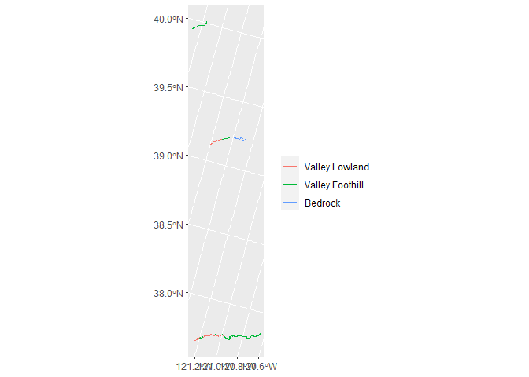<!-- -->

## Exploration and PCA of training data

``` r
df <- flowline_attributes |>
  select(
         # predictors of flow (as would be found in a regional regression)
         slope, da_area_sq_km, da_elev_mean, da_ppt_mean_mm, 
         # baseflow and peakflow statistics
         nf_bfl_dry_cfs, nf_bfl_wet_cfs, erom_q_ma_cfs, peak_q2_cfs, peak_q5_cfs, peak_q10_cfs,
         # flow and channel characteristics, hydrologically predicted
         bf_depth_m, bf_w_d_ratio, erom_v_ma_fps,
         # misc characteristics of the catchment
         da_avg_slope, da_k_erodibility, mean_ndvi,
         # misc characteristics of the locality
         loc_bfi, loc_pct_clay, loc_pct_sand, loc_permeability, loc_bedrock_depth, loc_ppt_mean_mm,
         # channel confinement characteristics
         mtpi30_min, vb_width_transect, vb_bf_w_ratio, 
         # channel sinuosity
         sinuosity,
         # aquatic
         bio_aq_rank_sw, species, species_fish
         ) |> 
  na.omit() |> 
  scale() 

df |> cor() |> corrr::rplot() + theme(axis.text.x = element_text(angle = 90, vjust = 0.5, hjust=1))
```

<!-- -->

``` r
# uniqueness: 
# df |> cor() |> abs() |> rowMeans() |> rank() 
pca <- princomp(df) 
#summary(pca)

factoextra::fviz_eig(pca, addlabels = TRUE)
```

<!-- -->

``` r
factoextra::fviz_cos2(pca, choice = "var", axes = 1:2)
```

<!-- -->

``` r
factoextra::fviz_pca_var(pca, axes=c(1,2), col.var = "cos2", repel = TRUE)
```

<!-- -->

``` r
factoextra::fviz_pca_var(pca, axes=c(1,3), col.var = "cos2", repel = TRUE)
```

<!-- -->

``` r
factoextra::fviz_pca_var(pca, axes=c(2,3), col.var = "cos2", repel = TRUE)
```

<!-- -->

``` r
# flowlines |> GGally::ggpairs()
```

## Set up training data

``` r
td <- train_data |>
  mutate(flow_norm_cfs = flow_cfs / erom_q_ma_cfs) |> # flow as a percent of mean annual flow
  mutate(wua_per_lf = area_wua_ft2 / (reach_length_km*3280.84),
         log_wua_per_lf = log(wua_per_lf)) |> # transect-wise habitat area per linear foot
  transmute(dataset, comid, 
         # suitable habitat area normalized by reach length
         hsi_frac, wua_per_lf, log_wua_per_lf,
         # flow cfs normalized by mean annual flow
         flow_cfs, flow_norm_cfs,
         # predictors of flow (as would be found in a regional regression)
         slope, da_area_sq_km, da_elev_mean, da_ppt_mean_mm, 
         # baseflow and peakflow statistics
         nf_bfl_dry_cfs, nf_bfl_wet_cfs, erom_q_ma_cfs, peak_q2_cfs, peak_q5_cfs, peak_q10_cfs,
         # flow and channel characteristics, hydrologically predicted
         bf_depth_m, bf_w_d_ratio, erom_v_ma_fps,
         # misc characteristics of the catchment
         da_avg_slope, da_k_erodibility, mean_ndvi,
         # misc characteristics of the locality
         loc_bfi, loc_pct_clay, loc_pct_sand, loc_permeability, loc_bedrock_depth, loc_ppt_mean_mm,
         # channel confinement characteristics
         mtpi30_min, vb_width_transect, vb_bf_w_ratio, frac_leveed_longitudinal,
         # channel sinuosity
         sinuosity,
         # aquatic
         bio_aq_rank_sw, species, species_fish,
         # fixed effects
         hqt_gradient_class=droplevels(hqt_gradient_class), hyd_cls=droplevels(hyd_cls)
         ) |> 
  mutate(nf_bfl_dry_cfs_norm = nf_bfl_dry_cfs/erom_q_ma_cfs, 
         nf_bfl_wet_cfs_norm = nf_bfl_wet_cfs/erom_q_ma_cfs) |>
  drop_na() |> glimpse()
```

    ## Rows: 4,660
    ## Columns: 41
    ## $ dataset                  <chr> "Lower Yuba River", "Lower Yuba River", "Lowe…
    ## $ comid                    <dbl> 8062583, 8062583, 8062583, 8062583, 8062583, …
    ## $ hsi_frac                 <dbl> 0.7645903, 0.7142137, 0.6698769, 0.6525566, 0…
    ## $ wua_per_lf               <dbl> 206.2561, 201.2625, 194.4578, 193.9564, 192.1…
    ## $ log_wua_per_lf           <dbl> 5.329119, 5.304610, 5.270215, 5.267633, 5.258…
    ## $ flow_cfs                 <dbl> 300, 400, 500, 600, 700, 800, 900, 1000, 1100…
    ## $ flow_norm_cfs            <dbl> 0.1132416, 0.1509889, 0.1887361, 0.2264833, 0…
    ## $ slope                    <dbl> 0.008, 0.008, 0.008, 0.008, 0.008, 0.008, 0.0…
    ## $ da_area_sq_km            <dbl> 3110.288, 3110.288, 3110.288, 3110.288, 3110.…
    ## $ da_elev_mean             <dbl> 1379.63, 1379.63, 1379.63, 1379.63, 1379.63, …
    ## $ da_ppt_mean_mm           <dbl> 1675.915, 1675.915, 1675.915, 1675.915, 1675.…
    ## $ nf_bfl_dry_cfs           <dbl> 502, 502, 502, 502, 502, 502, 502, 502, 502, …
    ## $ nf_bfl_wet_cfs           <dbl> 924, 924, 924, 924, 924, 924, 924, 924, 924, …
    ## $ erom_q_ma_cfs            <dbl> 2649.202, 2649.202, 2649.202, 2649.202, 2649.…
    ## $ peak_q2_cfs              <dbl> 31500, 31500, 31500, 31500, 31500, 31500, 315…
    ## $ peak_q5_cfs              <dbl> 73200, 73200, 73200, 73200, 73200, 73200, 732…
    ## $ peak_q10_cfs             <dbl> 110000, 110000, 110000, 110000, 110000, 11000…
    ## $ bf_depth_m               <dbl> 2.83, 2.83, 2.83, 2.83, 2.83, 2.83, 2.83, 2.8…
    ## $ bf_w_d_ratio             <dbl> 24.80565, 24.80565, 24.80565, 24.80565, 24.80…
    ## $ erom_v_ma_fps            <dbl> 2.58518, 2.58518, 2.58518, 2.58518, 2.58518, …
    ## $ da_avg_slope             <dbl> 29.4, 29.4, 29.4, 29.4, 29.4, 29.4, 29.4, 29.…
    ## $ da_k_erodibility         <dbl> 0.2423, 0.2423, 0.2423, 0.2423, 0.2423, 0.242…
    ## $ mean_ndvi                <dbl> 0.4897366, 0.4897366, 0.4897366, 0.4897366, 0…
    ## $ loc_bfi                  <dbl> 38, 38, 38, 38, 38, 38, 38, 38, 38, 38, 38, 3…
    ## $ loc_pct_clay             <dbl> 21.08, 21.08, 21.08, 21.08, 21.08, 21.08, 21.…
    ## $ loc_pct_sand             <dbl> 23.42, 23.42, 23.42, 23.42, 23.42, 23.42, 23.…
    ## $ loc_permeability         <dbl> 3.11, 3.11, 3.11, 3.11, 3.11, 3.11, 3.11, 3.1…
    ## $ loc_bedrock_depth        <dbl> 59.89, 59.89, 59.89, 59.89, 59.89, 59.89, 59.…
    ## $ loc_ppt_mean_mm          <dbl> 767.475, 767.475, 767.475, 767.475, 767.475, …
    ## $ mtpi30_min               <dbl> -33, -33, -33, -33, -33, -33, -33, -33, -33, …
    ## $ vb_width_transect        <dbl> 70.2, 70.2, 70.2, 70.2, 70.2, 70.2, 70.2, 70.…
    ## $ vb_bf_w_ratio            <dbl> 1, 1, 1, 1, 1, 1, 1, 1, 1, 1, 1, 1, 1, 1, 1, …
    ## $ frac_leveed_longitudinal <dbl> 0, 0, 0, 0, 0, 0, 0, 0, 0, 0, 0, 0, 0, 0, 0, …
    ## $ sinuosity                <dbl> 1.01, 1.01, 1.01, 1.01, 1.01, 1.01, 1.01, 1.0…
    ## $ bio_aq_rank_sw           <int> 4, 4, 4, 4, 4, 4, 4, 4, 4, 4, 4, 4, 4, 4, 4, …
    ## $ species                  <dbl> 45, 45, 45, 45, 45, 45, 45, 45, 45, 45, 45, 4…
    ## $ species_fish             <dbl> 9, 9, 9, 9, 9, 9, 9, 9, 9, 9, 9, 9, 9, 9, 9, …
    ## $ hqt_gradient_class       <fct> Bedrock, Bedrock, Bedrock, Bedrock, Bedrock, …
    ## $ hyd_cls                  <fct> High-volume snowmelt and rain, High-volume sn…
    ## $ nf_bfl_dry_cfs_norm      <dbl> 0.189491, 0.189491, 0.189491, 0.189491, 0.189…
    ## $ nf_bfl_wet_cfs_norm      <dbl> 0.3487843, 0.3487843, 0.3487843, 0.3487843, 0…

``` r
interp_flows <- seq(700,5000,100)
td |> 
  # interpolate so that we are comparing like flows with like
  group_by(dataset, comid) |>
  complete(flow_cfs = interp_flows) |>
  arrange(dataset, comid, flow_cfs) |>
  mutate(across(hsi_frac:last_col(), function(var) zoo::na.approx(var, x = flow_cfs))) |>
  filter(flow_cfs %in% interp_flows) |>
  ungroup() |>
  # summarize by quantile of each variable
  mutate(across(slope:last_col(), function(x) factor(cut(x, breaks=5, labels=F)))) |>
  pivot_longer(cols=slope:last_col(), names_to="varname", values_to="qtile") |>
  mutate(qtile = factor(qtile, levels=c(1,2,3,4,5))) |>
  group_by(flow_cfs, varname, qtile) |> summarize(wua_per_lf=mean(wua_per_lf)) |> ungroup() |>
  ggplot() + geom_line(aes(x=flow_cfs, y=wua_per_lf, color=qtile)) + facet_wrap(~varname) + scale_color_viridis_d() + scale_y_log10() + scale_x_log10()
```

    ## `summarise()` has grouped output by 'flow_cfs', 'varname'. You can override
    ## using the `.groups` argument.

<!-- -->

## Split into training and testing datasets

``` r
set.seed(47)
td_split <- group_initial_split(td, group=comid, strata=dataset)
```

## Modeling

### Linear regression

``` r
lm_spec <- linear_reg() 
```

First set up recipes (sets of predictor and response variables), then
train and predict

#### Scale-independent (%HSI versus dimensionless flow)

Scale-independent model version predicts the percent suitable habitat
area using normalized flow, and without using any direct correlates of
watershed size.

Technically this should not use linear regression as it is a proportion
between zero and one, it should be using beta regression via the betareg
package.

``` r
si_rec <- recipe(data=training(td_split), 
      formula=hsi_frac ~ 
        # flow as percent of mean annual flow
        flow_norm_cfs + 
        # channel characteristics: gradient and sinuosity
        slope + sinuosity + 
        # flow and channel characteristics, hydrologically predicted
        erom_v_ma_fps + bf_depth_m + bf_w_d_ratio + 
        # misc characteristics of the catchment
        da_k_erodibility + da_avg_slope + mean_ndvi +
        # misc characteristics of the locality
        loc_bfi + loc_pct_clay + loc_pct_sand + loc_permeability + loc_bedrock_depth + loc_ppt_mean_mm +
        # channel confinement
        mtpi30_min + vb_bf_w_ratio + frac_leveed_longitudinal +
        # baseflow as percent of mean annual flow
        nf_bfl_dry_cfs_norm + nf_bfl_wet_cfs_norm + 
        # aquatic
        bio_aq_rank_sw + species + species_fish + 
        # fixed effects
        hqt_gradient_class + hyd_cls
        ) |>
  step_log(all_numeric_predictors(), -mtpi30_min, -mean_ndvi, -bio_aq_rank_sw, -vb_bf_w_ratio, -frac_leveed_longitudinal) |>
  # let effect of flow vary with gradient
  # step_interact(terms = ~ flow_norm_cfs:slope) #|>
  step_dummy(hqt_gradient_class) |>
  step_dummy(hyd_cls) |>
  # PCA before interactions with flow
  # step_pca(all_numeric_predictors(), -flow_norm_cfs, num_comp = 4) |>
  # try interacting with all numeric predictors
  step_interact(terms = ~ flow_norm_cfs:all_predictors()) |>
  # let all effects vary with class
  #step_interact(terms = ~hqt_gradient_class:all_numeric_predictors())
  step_naomit(all_predictors()) |>
  step_zv(all_predictors()) |>
  step_normalize(all_numeric_predictors())#, -flow_cfs)

lm_si <- workflow() |>
  add_recipe(si_rec) |>
  add_model(lm_spec) |>
  fit(data=training(td_split))

lm_si |> glance()
```

    ## # A tibble: 1 × 12
    ##   r.squared adj.r.squared  sigma statistic p.value    df logLik    AIC    BIC
    ##       <dbl>         <dbl>  <dbl>     <dbl>   <dbl> <dbl>  <dbl>  <dbl>  <dbl>
    ## 1     0.749         0.746 0.0760      211.       0    49  4095. -8089. -7774.
    ## # ℹ 3 more variables: deviance <dbl>, df.residual <int>, nobs <int>

``` r
lm_si |> tidy()
```

    ## # A tibble: 50 × 5
    ##    term             estimate std.error statistic  p.value
    ##    <chr>               <dbl>     <dbl>     <dbl>    <dbl>
    ##  1 (Intercept)       0.498     0.00128   389.    0       
    ##  2 flow_norm_cfs    -0.769     1.09       -0.708 4.79e- 1
    ##  3 slope             0.530     0.0864      6.13  9.83e-10
    ##  4 sinuosity        -0.00362   0.00296    -1.22  2.22e- 1
    ##  5 erom_v_ma_fps    -0.503     0.0762     -6.59  4.91e-11
    ##  6 bf_depth_m        0.0167    0.0358      0.467 6.41e- 1
    ##  7 bf_w_d_ratio      0.0107    0.0180      0.593 5.53e- 1
    ##  8 da_k_erodibility -0.140     0.0359     -3.91  9.59e- 5
    ##  9 da_avg_slope     -0.0268    0.0163     -1.64  1.01e- 1
    ## 10 mean_ndvi         0.00701   0.00329     2.13  3.32e- 2
    ## # ℹ 40 more rows

``` r
lm_si$fit$fit |> dotwhisker::dwplot()
```

<!-- -->

``` r
lm_si_res <- testing(td_split) |>
  mutate(hsi_frac_pred = predict(lm_si, testing(td_split))[[".pred"]]) |>
  select(comid, hsi_frac, hsi_frac_pred, flow_norm_cfs) |>
  # crude constraint to between 0 and 1; better to use betareg
  mutate(hsi_frac_pred=pmax(pmin(hsi_frac_pred,1),0))

lm_si_res |>
  arrange(comid, flow_norm_cfs) |>
  ggplot() + geom_path(aes(x=hsi_frac, y=hsi_frac_pred, color=flow_norm_cfs, group=comid), linewidth=2) + 
  coord_fixed() + geom_abline() + scale_color_viridis_c(trans="log10", name="Frac. of MAF") + 
  ggtitle("Scale-independent model, linear regression") +
  xlab("HSI (Frac. of Channel Area) (Actual)") + ylab("HSI (Frac. of Channel Area) (Predicted)")
```

<!-- -->

``` r
lm_si_res |> 
  left_join(select(flowline_attributes, comid, erom_q_ma_cfs)) |>
  mutate(flow_cfs = flow_norm_cfs * erom_q_ma_cfs) |>
  filter(flow_cfs %in% c(400,600,800,1200,1600,2400,3200,4800)) |>
  ggplot() + geom_point(aes(x=hsi_frac, y=hsi_frac_pred, color=flow_cfs)) + 
  facet_wrap(~flow_cfs, ncol = 4) +
  coord_fixed() + geom_abline() + scale_color_viridis_c(name = "Flow (cfs)") + 
  ggtitle("Scale-independent model, linear regression") +
  xlab("HSI (Frac. of Channel Area) (Actual)") + ylab("HSI (Frac. of Channel Area) (Predicted)")
```

<!-- -->

``` r
lm_si_res |> filter(comid %in% head(unique(testing(td_split)$comid),12)) |>
  left_join(transmute(flowline_attributes, comid, erom_q_ma_cfs)) |> #, chan_width_ft=chan_width_m/0.3048)) |>
  ggplot(aes(x=flow_norm_cfs*erom_q_ma_cfs, group=1)) + facet_wrap(~comid) + 
  geom_line(aes(y=hsi_frac_pred*100, color="predicted", group=1)) + geom_line(aes(y=hsi_frac*100, color="actual", group=1)) + 
  xlab("Flow (cfs)") + ylab("Suitable Habitat Area (% of Total Area)")
```

<!-- -->

``` r
lm_si |>
  tidy() |>
  mutate(ixn_class = if_else(str_detect(term, "flow_norm_cfs_x_"), "term_flow_norm_cfs_x_", "term") |> 
                     factor(levels = c("term", "term_flow_norm_cfs_x_"), labels = c("Constant Effect", "Interaction with Flow (cfs)")),
         term_root = str_replace(term, "flow_norm_cfs_x_", ""),
         coeff_dir = if_else(estimate>0, "Positive", "Negative"),
         ci_lower = estimate - qt(0.975, df = glance(lm_si)$df) * std.error,
         ci_upper = estimate + qt(0.975, df = glance(lm_si)$df) * std.error,
         estimate_abs = abs(estimate),
         ci_lower_abs = ci_lower * if_else(coeff_dir=="Negative",-1,1),
         ci_upper_abs = ci_upper * if_else(coeff_dir=="Negative",-1,1),
         is_significant = sign(ci_lower)==sign(ci_upper)
         ) |>
  filter(term!="flow_norm_cfs" & term!="(Intercept)") |>
  ggplot(aes(y = term_root, color = coeff_dir)) +
  facet_wrap(~ixn_class, ncol = 2) + 
  geom_errorbarh(aes(xmin = ci_lower_abs, xmax=ci_upper_abs)) + #pmax(0,ci_lower_abs), xmax = pmax(0,ci_upper_abs))) +
  geom_point(aes(x = estimate_abs, fill = is_significant), shape=21) +
  theme(legend.position="top",
        panel.grid.minor = element_blank(),
        panel.border = element_rect(fill = NA, color = "black"), 
        legend.direction = "vertical") +
  scale_y_discrete(limits=rev) + 
  scale_fill_manual(name = "Significant (95%)", values = c("FALSE" = "white", "TRUE" = "black")) +
  scale_color_manual(name = "Direction of Effect", values = c("Negative" = "goldenrod", "Positive" = "darkcyan")) +
  xlab("Coefficient Magnitude") + ylab("")
```

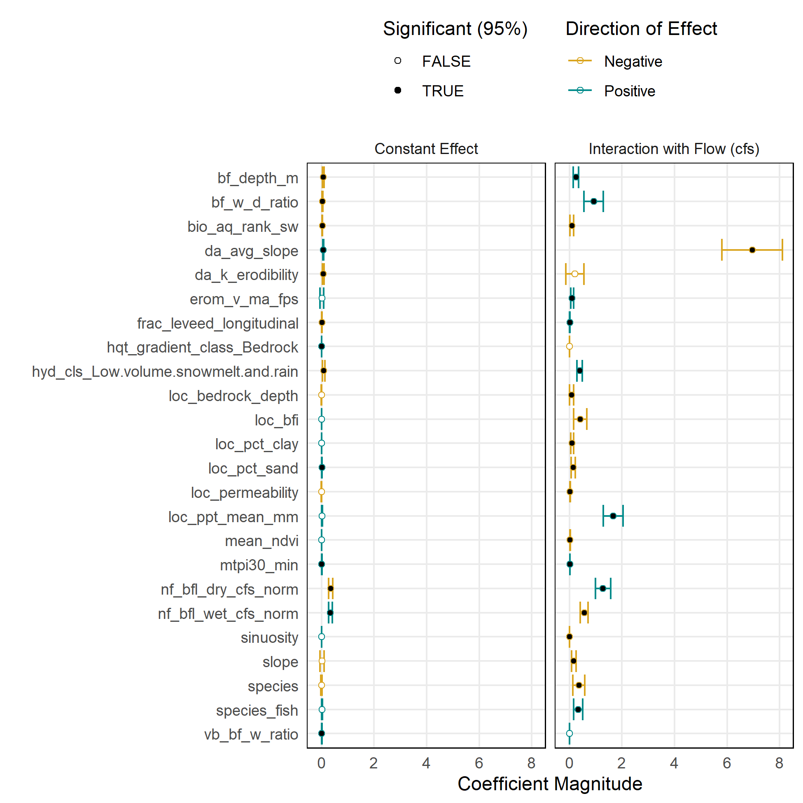<!-- -->

#### Scale-dependent (WUA-per-linear-ft versus flow)

Scale-dependent model version predicts the WUA per linear foot, using
absolute flow values as well as watershed scale parameters.

- interact flow and mean annual flow; flow and area/elev/ppt; to add
  scale dependence to the flow effect

``` r
sd_rec <- recipe(data=training(td_split), 
      formula = log_wua_per_lf ~ 
        # flow (cfs)
        flow_cfs + 
        # predictors of flow (catchment area, elevation, and MAP) -- attributes for gradient and upstream drainage area are interrelated
        slope + da_area_sq_km + da_elev_mean + da_ppt_mean_mm +
        # baseflow/peak flow statistics
        nf_bfl_dry_cfs + nf_bfl_wet_cfs + erom_q_ma_cfs + #log(peak_q2_cfs)  + log(peak_q5_cfs) + log(peak_q10_cfs) +
        # flow and channel characteristics, hydrologically predicted
        erom_v_ma_fps + bf_depth_m + bf_w_d_ratio + 
        # misc characteristics of the catchment
        da_k_erodibility + da_avg_slope + mean_ndvi +
        # misc characteristics of the locality
        loc_bfi + loc_pct_clay + loc_pct_sand + loc_permeability + loc_bedrock_depth + loc_ppt_mean_mm +
        # channel confinement characteristics
        mtpi30_min + vb_bf_w_ratio + frac_leveed_longitudinal + vb_width_transect +
        # channel sinuosity
        sinuosity + 
        # aquatic
        bio_aq_rank_sw + species + species_fish + 
        # fixed effects
        hqt_gradient_class + hyd_cls
        ) |>
  step_log(all_numeric_predictors(), -mtpi30_min, -mean_ndvi, -vb_bf_w_ratio, -frac_leveed_longitudinal) |>
  #step_interact(terms = ~ flow_cfs:erom_q_ma_cfs) |>
  step_interact(terms = ~ slope:da_area_sq_km) |>
  #step_interact(terms = ~ flow_cfs:da_area_sq_km) |>
  #step_interact(terms = ~ flow_cfs:da_elev_mean) |>
  #step_interact(terms = ~ flow_cfs:da_ppt_mean_mm) #|>
  # let all effects vary with class
  #step_interact(terms = ~hqt_gradient_class:all_numeric_predictors())
  step_dummy(hqt_gradient_class) |>
  step_dummy(hyd_cls) |>
  # PCA before interaction with flow 
  # step_pca(all_numeric_predictors(), -flow_cfs, num_comp = 4) |>
  # intract all terms with flow
  step_interact(terms = ~flow_cfs:all_predictors()) |>
  step_naomit(all_predictors()) |>
  step_zv(all_predictors()) |>
  step_normalize(all_numeric_predictors())#, -flow_cfs)

lm_sd <- workflow() |>
  add_recipe(sd_rec) |>
  add_model(lm_spec) |>
  fit(data=training(td_split))

lm_sd |> glance()
```

    ## # A tibble: 1 × 12
    ##   r.squared adj.r.squared sigma statistic p.value    df logLik   AIC   BIC
    ##       <dbl>         <dbl> <dbl>     <dbl>   <dbl> <dbl>  <dbl> <dbl> <dbl>
    ## 1     0.985         0.985 0.341     3755.       0    61 -1179. 2484. 2873.
    ## # ℹ 3 more variables: deviance <dbl>, df.residual <int>, nobs <int>

``` r
lm_sd |> tidy()
```

    ## # A tibble: 62 × 5
    ##    term           estimate std.error statistic  p.value
    ##    <chr>             <dbl>     <dbl>     <dbl>    <dbl>
    ##  1 (Intercept)        4.79   0.00576   831.    0       
    ##  2 flow_cfs        -297.   102.         -2.92  3.49e- 3
    ##  3 slope             -7.83   2.92       -2.68  7.35e- 3
    ##  4 da_area_sq_km    -37.8   22.1        -1.71  8.75e- 2
    ##  5 da_elev_mean     -60.1   13.9        -4.33  1.53e- 5
    ##  6 da_ppt_mean_mm   -15.2    9.46       -1.60  1.09e- 1
    ##  7 nf_bfl_dry_cfs   -84.2   12.9        -6.55  6.74e-11
    ##  8 nf_bfl_wet_cfs    -4.43   8.63       -0.514 6.08e- 1
    ##  9 erom_q_ma_cfs      9.57   1.92        4.99  6.44e- 7
    ## 10 erom_v_ma_fps     -1.24   4.78       -0.260 7.95e- 1
    ## # ℹ 52 more rows

``` r
lm_sd$fit$fit |> dotwhisker::dwplot()
```

<!-- -->

``` r
lm_sd_res <-
testing(td_split) |>
  mutate(log_wua_per_lf_pred = predict(lm_sd, testing(td_split))[[".pred"]]) |>
  transmute(comid, wua_per_lf=exp(log_wua_per_lf), wua_per_lf_pred=exp(log_wua_per_lf_pred), flow_cfs) 

lm_sd_res |>
  arrange(comid, flow_cfs) |>
  ggplot() + geom_path(aes(x=wua_per_lf, y=wua_per_lf_pred, color=flow_cfs, group=comid), linewidth=2) + 
  scale_y_log10() + scale_x_log10() +  coord_fixed() + geom_abline() + scale_color_viridis_c(name="Flow (cfs)") + 
  ggtitle("Scale-dependent model, linear regression") +
  xlab("WUA per LF (Actual)") + ylab("WUA per LF (Predicted)")
```

<!-- -->

``` r
lm_sd_res |>
  filter(flow_cfs %in% c(400,600,800,1200,1600,2400,3200,4800)) |>
  ggplot() + geom_point(aes(x=wua_per_lf, y=wua_per_lf_pred, color=flow_cfs)) + 
  facet_wrap(~flow_cfs, ncol = 4) +
  scale_y_log10() + scale_x_log10() +  coord_fixed() + geom_abline() + scale_color_viridis_c(name="Flow (cfs)") + 
  ggtitle("Scale-dependent model, linear regression") +
  xlab("WUA per LF (Actual)") + ylab("WUA per LF (Predicted)")
```

<!-- -->

``` r
lm_sd_res |> filter(comid %in% head(unique(testing(td_split)$comid),12)) |>
  ggplot(aes(x=flow_cfs, group=1)) + facet_wrap(~comid) + 
  geom_line(aes(y=wua_per_lf_pred, color="predicted", group=1)) + geom_line(aes(y=wua_per_lf, color="actual", group=1)) + 
  scale_y_log10() + xlab("Flow (cfs)") + ylab("Suitable Habitat Area per LF Channel (ft)")
```

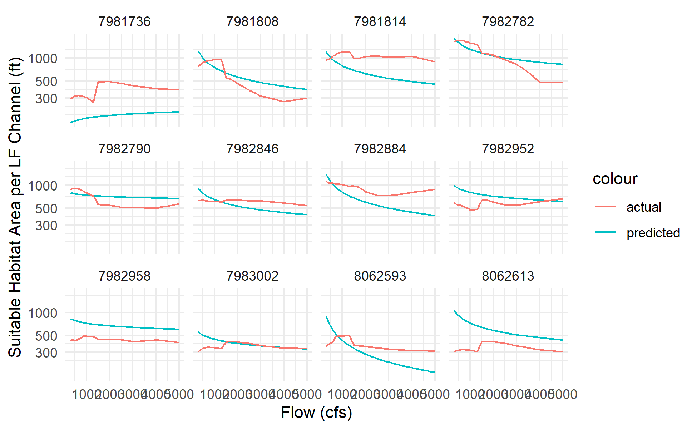<!-- -->

``` r
lm_sd |>
  tidy() |>
  mutate(ixn_class = if_else(str_detect(term, "flow_cfs_x_"), "term_flow_cfs_x_", "term") |> 
                     factor(levels = c("term", "term_flow_cfs_x_"), labels = c("Constant Effect", "Interaction with Flow (cfs)")),
         term_root = str_replace(term, "flow_cfs_x_", ""),
         coeff_dir = if_else(estimate>0, "Positive", "Negative"),
         ci_lower = estimate - qt(0.975, df = glance(lm_sd)$df) * std.error,
         ci_upper = estimate + qt(0.975, df = glance(lm_sd)$df) * std.error,
         estimate_abs = abs(estimate),
         ci_lower_abs = ci_lower * if_else(coeff_dir=="Negative",-1,1),
         ci_upper_abs = ci_upper * if_else(coeff_dir=="Negative",-1,1),
         is_significant = sign(ci_lower)==sign(ci_upper)
         ) |>
  filter(term!="flow_cfs" & term!="(Intercept)") |>
  ggplot(aes(y = term_root, color = coeff_dir)) +
  facet_wrap(~ixn_class, ncol = 2) + 
  geom_errorbarh(aes(xmin = ci_lower_abs, xmax=ci_upper_abs)) + #pmax(0,ci_lower_abs), xmax = pmax(0,ci_upper_abs))) +
  geom_point(aes(x = estimate_abs, fill = is_significant), shape=21) +
  theme(legend.position="top",
        panel.grid.minor = element_blank(),
        panel.border = element_rect(fill = NA, color = "black"), 
        legend.direction = "vertical") +
  scale_y_discrete(limits=rev) + 
  scale_fill_manual(name = "Significant (95%)", values = c("FALSE" = "white", "TRUE" = "black")) +
  scale_color_manual(name = "Direction of Effect", values = c("Negative" = "goldenrod", "Positive" = "darkcyan")) +
  xlab("Coefficient Magnitude") + ylab("")
```

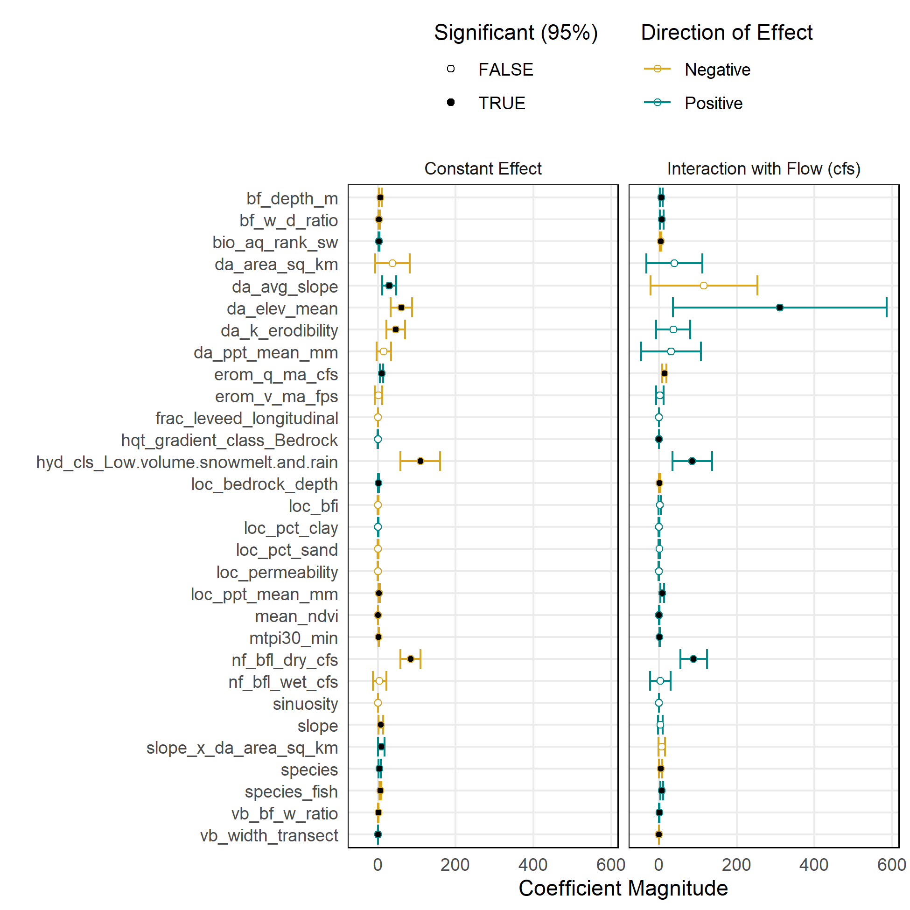<!-- -->

### Linear regression with regularized (lasso) feature selection

#### Scale-independent (%HSI versus dimensionless flow)

``` r
drop_vars <- workflow() |>
  add_recipe(si_rec) |>
  add_model(linear_reg(penalty = 0.005, mixture = 1) |> set_engine("glmnet")) |>
  fit(data=training(td_split)) |>
  tidy() |> 
  filter(estimate==0) |> 
  pull(term)
```

    ## Warning: package 'glmnet' was built under R version 4.3.2

    ## Warning: package 'Matrix' was built under R version 4.3.2

``` r
lasso_si <- workflow() |>
  add_recipe(si_rec |> step_rm(all_of(drop_vars))) |>
  add_model(lm_spec) |>
  fit(data=training(td_split))

lasso_si |> glance()
```

    ## # A tibble: 1 × 12
    ##   r.squared adj.r.squared  sigma statistic p.value    df logLik    AIC    BIC
    ##       <dbl>         <dbl>  <dbl>     <dbl>   <dbl> <dbl>  <dbl>  <dbl>  <dbl>
    ## 1     0.682         0.681 0.0852      682.       0    11  3677. -7328. -7247.
    ## # ℹ 3 more variables: deviance <dbl>, df.residual <int>, nobs <int>

``` r
lasso_si |> tidy()
```

    ## # A tibble: 12 × 5
    ##    term                                    estimate std.error statistic  p.value
    ##    <chr>                                      <dbl>     <dbl>     <dbl>    <dbl>
    ##  1 (Intercept)                              0.498     0.00144   347.    0       
    ##  2 bf_depth_m                              -0.00343   0.00308    -1.11  2.66e- 1
    ##  3 loc_bfi                                  0.00630   0.00310     2.03  4.22e- 2
    ##  4 species_fish                            -0.0127    0.00180    -7.09  1.62e-12
    ##  5 hyd_cls_Low.volume.snowmelt.and.rain     0.0887    0.00548    16.2   5.70e-57
    ##  6 flow_norm_cfs_x_sinuosity               -0.0148    0.00187    -7.91  3.34e-15
    ##  7 flow_norm_cfs_x_erom_v_ma_fps            0.00230   0.00286     0.805 4.21e- 1
    ##  8 flow_norm_cfs_x_bf_depth_m               0.0168    0.0111      1.51  1.31e- 1
    ##  9 flow_norm_cfs_x_loc_pct_sand            -0.0787    0.0124     -6.35  2.38e-10
    ## 10 flow_norm_cfs_x_loc_permeability        -0.00536   0.00260    -2.06  3.96e- 2
    ## 11 flow_norm_cfs_x_frac_leveed_longitudin… -0.0141    0.00225    -6.28  3.80e-10
    ## 12 flow_norm_cfs_x_nf_bfl_wet_cfs_norm      0.0775    0.00521    14.9   1.29e-48

``` r
lasso_si$fit$fit |> dotwhisker::dwplot()
```

<!-- -->

``` r
lasso_si_res <- 
testing(td_split) |>
  mutate(hsi_frac_pred = predict(lasso_si, testing(td_split))[[".pred"]]) |>
  select(comid, hsi_frac, hsi_frac_pred, flow_norm_cfs) |>
  # crude constraint to between 0 and 1; better to use betareg
  mutate(hsi_frac_pred=pmax(pmin(hsi_frac_pred,1),0))

lasso_si_res |>
  arrange(comid, flow_norm_cfs) |>
  ggplot() + geom_path(aes(x=hsi_frac, y=hsi_frac_pred, color=flow_norm_cfs, group=comid), linewidth=2) + 
  coord_fixed() + geom_abline() + scale_color_viridis_c(trans="log10", name="Frac. of MAF") + 
  ggtitle("Scale-independent model, linear regression w/ lasso feature selection") +
  xlab("HSI (Frac. of Channel Area) (Actual)") + ylab("HSI (Frac. of Channel Area) (Predicted)")
```

<!-- -->

``` r
lasso_si_res |> 
  left_join(select(flowline_attributes, comid, erom_q_ma_cfs)) |>
  mutate(flow_cfs = flow_norm_cfs * erom_q_ma_cfs) |>
  filter(flow_cfs %in% c(400,600,800,1200,1600,2400,3200,4800)) |>
  ggplot() + geom_point(aes(x=hsi_frac, y=hsi_frac_pred, color=flow_cfs)) + 
  facet_wrap(~flow_cfs, ncol = 4) +
  coord_fixed() + geom_abline() + scale_color_viridis_c(name = "Flow (cfs)") + 
  ggtitle("Scale-independent model, linear regression w/ lasso feature selection") +
  xlab("HSI (Frac. of Channel Area) (Actual)") + ylab("HSI (Frac. of Channel Area) (Predicted)")
```

<!-- -->

``` r
lasso_si_res |> filter(comid %in% head(unique(testing(td_split)$comid),12)) |>
  left_join(transmute(flowline_attributes, comid, erom_q_ma_cfs)) |> #, chan_width_ft=chan_width_m/0.3048)) |>
  ggplot(aes(x=flow_norm_cfs*erom_q_ma_cfs, group=1)) + facet_wrap(~comid) + 
  geom_line(aes(y=hsi_frac_pred*100, color="predicted", group=1)) + geom_line(aes(y=hsi_frac*100, color="actual", group=1)) + 
  xlab("Flow (cfs)") + ylab("Suitable Habitat Area (% of Total Area)")
```

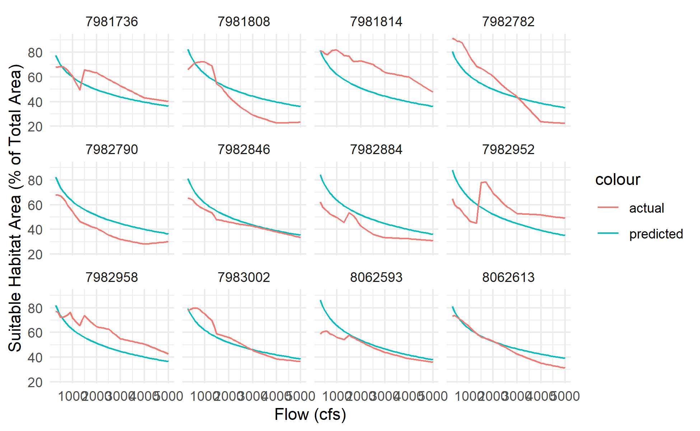<!-- -->

``` r
lasso_si |>
  tidy() |>
  mutate(ixn_class = if_else(str_detect(term, "flow_norm_cfs_x_"), "term_flow_norm_cfs_x_", "term") |> 
                     factor(levels = c("term", "term_flow_norm_cfs_x_"), labels = c("Constant Effect", "Interaction with Flow (cfs)")),
         term_root = str_replace(term, "flow_norm_cfs_x_", ""),
         coeff_dir = if_else(estimate>0, "Positive", "Negative"),
         ci_lower = estimate - qt(0.975, df = glance(lasso_si)$df) * std.error,
         ci_upper = estimate + qt(0.975, df = glance(lasso_si)$df) * std.error,
         estimate_abs = abs(estimate),
         ci_lower_abs = ci_lower * if_else(coeff_dir=="Negative",-1,1),
         ci_upper_abs = ci_upper * if_else(coeff_dir=="Negative",-1,1),
         is_significant = sign(ci_lower)==sign(ci_upper)
         ) |>
  filter(term!="flow_norm_cfs" & term!="(Intercept)") |>
  ggplot(aes(y = term_root, color = coeff_dir)) +
  facet_wrap(~ixn_class, ncol = 2) + 
  geom_errorbarh(aes(xmin = ci_lower_abs, xmax=ci_upper_abs)) + #pmax(0,ci_lower_abs), xmax = pmax(0,ci_upper_abs))) +
  geom_point(aes(x = estimate_abs, fill = is_significant), shape=21) +
  theme(legend.position="top",
        panel.grid.minor = element_blank(),
        panel.border = element_rect(fill = NA, color = "black"), 
        legend.direction = "vertical") +
  scale_y_discrete(limits=rev) + 
  scale_fill_manual(name = "Significant (95%)", values = c("FALSE" = "white", "TRUE" = "black")) +
  scale_color_manual(name = "Direction of Effect", values = c("Negative" = "goldenrod", "Positive" = "darkcyan")) +
  xlab("Coefficient Magnitude") + ylab("")
```

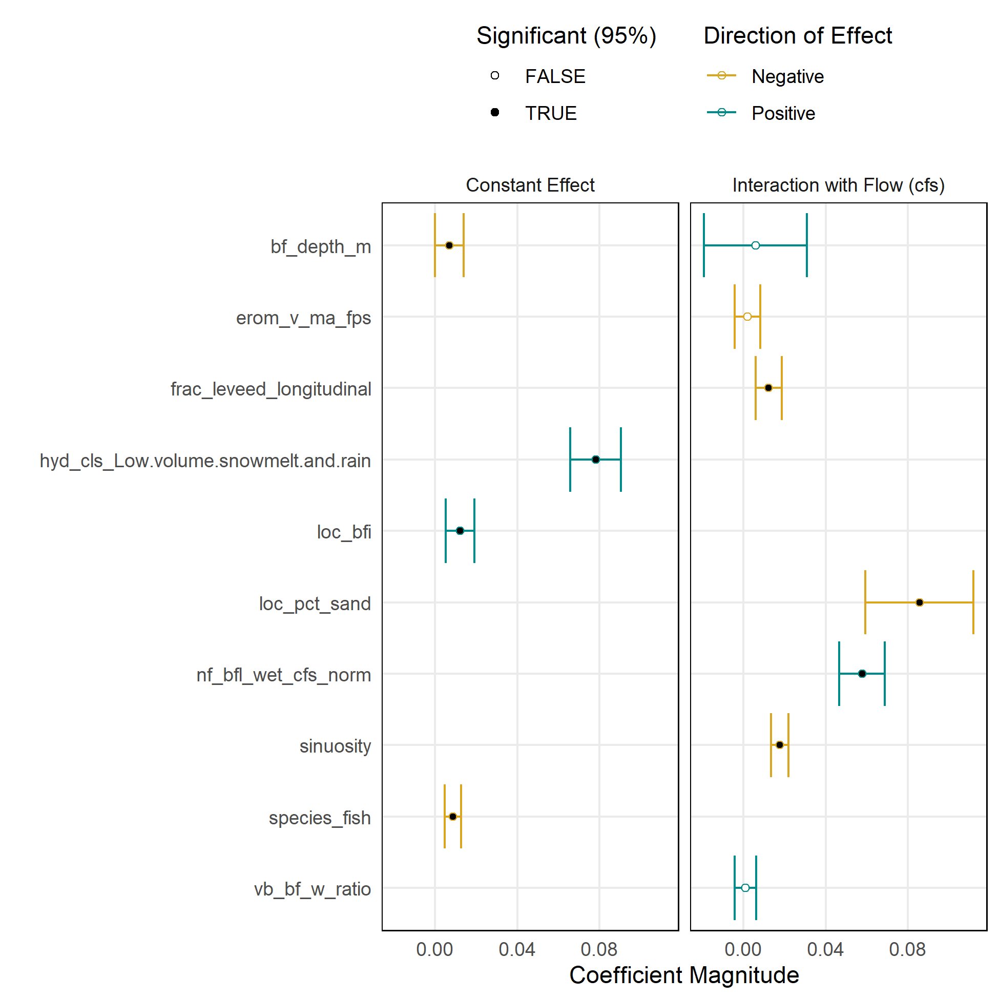<!-- -->

#### Scale-dependent (WUA-per-linear-ft versus flow)

``` r
drop_vars <- workflow() |>
  add_recipe(sd_rec) |>
  add_model(linear_reg(penalty = 0.005, mixture = 1) |> set_engine("glmnet")) |>
  fit(data=training(td_split)) |>
  tidy() |> 
  filter(estimate==0) |> 
  pull(term)

lasso_sd <- workflow() |>
  add_recipe(sd_rec |>
               step_rm(all_of(drop_vars))) |>
  add_model(lm_spec) |>
  fit(data=training(td_split))

lasso_sd |> glance()
```

    ## # A tibble: 1 × 12
    ##   r.squared adj.r.squared sigma statistic p.value    df logLik   AIC   BIC
    ##       <dbl>         <dbl> <dbl>     <dbl>   <dbl> <dbl>  <dbl> <dbl> <dbl>
    ## 1     0.979         0.979 0.401     6347.       0    26 -1763. 3582. 3755.
    ## # ℹ 3 more variables: deviance <dbl>, df.residual <int>, nobs <int>

``` r
lasso_sd |> tidy()
```

    ## # A tibble: 27 × 5
    ##    term           estimate std.error statistic  p.value
    ##    <chr>             <dbl>     <dbl>     <dbl>    <dbl>
    ##  1 (Intercept)      4.79     0.00676   708.    0       
    ##  2 da_area_sq_km   -6.05     0.852      -7.11  1.43e-12
    ##  3 da_elev_mean    -0.753    0.0581    -13.0   1.53e-37
    ##  4 da_ppt_mean_mm   1.66     0.133      12.5   4.50e-35
    ##  5 nf_bfl_dry_cfs   6.18     0.571      10.8   6.90e-27
    ##  6 nf_bfl_wet_cfs   1.29     0.469       2.74  6.10e- 3
    ##  7 bf_w_d_ratio     0.133    0.0245      5.42  6.28e- 8
    ##  8 mean_ndvi        0.0263   0.0168      1.56  1.19e- 1
    ##  9 loc_pct_clay     0.0296   0.0913      0.324 7.46e- 1
    ## 10 loc_pct_sand     0.595    0.0543     11.0   1.67e-27
    ## # ℹ 17 more rows

``` r
lasso_sd$fit$fit |> dotwhisker::dwplot()
```

<!-- -->

``` r
lasso_sd_res <- 
testing(td_split) |>
  mutate(log_wua_per_lf_pred = predict(lasso_sd, testing(td_split))[[".pred"]]) |>
  transmute(comid, wua_per_lf=exp(log_wua_per_lf), wua_per_lf_pred=exp(log_wua_per_lf_pred), flow_cfs) 

lasso_sd_res |>
  arrange(comid, flow_cfs) |>
  ggplot() + geom_path(aes(x=wua_per_lf, y=wua_per_lf_pred, color=flow_cfs, group=comid), linewidth=2) + 
  scale_y_log10() + scale_x_log10() +  coord_fixed() + geom_abline() + scale_color_viridis_c(name="Flow (cfs)")   + 
  ggtitle("Scale-dependent model, linear regression w/ lasso feature selection") +
  xlab("WUA per LF (Actual)") + ylab("WUA per LF (Predicted)")
```

<!-- -->

``` r
lasso_sd_res |>
  filter(flow_cfs %in% c(400,600,800,1200,1600,2400,3200,4800)) |>
  ggplot() + geom_point(aes(x=wua_per_lf, y=wua_per_lf_pred, color=flow_cfs)) + 
  facet_wrap(~flow_cfs, ncol = 4) +
  scale_y_log10() + scale_x_log10() +  coord_fixed() + geom_abline() + scale_color_viridis_c(name="Flow (cfs)") + 
  ggtitle("Scale-dependent model, linear regression w/ lasso feature selection") +
  xlab("WUA per LF (Actual)") + ylab("WUA per LF (Predicted)")
```

<!-- -->

``` r
lasso_sd_res |> filter(comid %in% head(unique(testing(td_split)$comid),12)) |>
  ggplot(aes(x=flow_cfs, group=1)) + facet_wrap(~comid) + 
  geom_line(aes(y=wua_per_lf_pred, color="predicted", group=1)) + geom_line(aes(y=wua_per_lf, color="actual", group=1)) + 
  scale_y_log10() + xlab("Flow (cfs)") + ylab("Suitable Habitat Area per LF Channel (ft)")
```

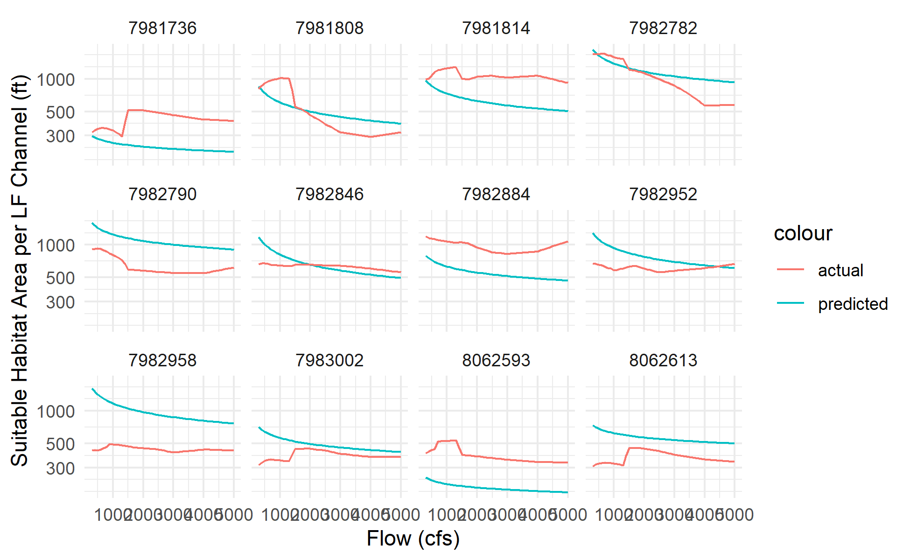<!-- -->

``` r
lasso_sd |>
  tidy() |>
  mutate(ixn_class = if_else(str_detect(term, "flow_cfs_x_"), "term_flow_cfs_x_", "term") |> 
                     factor(levels = c("term", "term_flow_cfs_x_"), labels = c("Constant Effect", "Interaction with Flow (cfs)")),
         term_root = str_replace(term, "flow_cfs_x_", ""),
         coeff_dir = if_else(estimate>0, "Positive", "Negative"),
         ci_lower = estimate - qt(0.975, df = glance(lasso_sd)$df) * std.error,
         ci_upper = estimate + qt(0.975, df = glance(lasso_sd)$df) * std.error,
         estimate_abs = abs(estimate),
         ci_lower_abs = ci_lower * if_else(coeff_dir=="Negative",-1,1),
         ci_upper_abs = ci_upper * if_else(coeff_dir=="Negative",-1,1),
         is_significant = sign(ci_lower)==sign(ci_upper)
         ) |>
  filter(term!="flow_cfs" & term!="(Intercept)") |>
  ggplot(aes(y = term_root, color = coeff_dir)) +
  facet_wrap(~ixn_class, ncol = 2) + 
  geom_errorbarh(aes(xmin = ci_lower_abs, xmax=ci_upper_abs)) + #pmax(0,ci_lower_abs), xmax = pmax(0,ci_upper_abs))) +
  geom_point(aes(x = estimate_abs, fill = is_significant), shape=21) +
  theme(legend.position="top",
        panel.grid.minor = element_blank(),
        panel.border = element_rect(fill = NA, color = "black"), 
        legend.direction = "vertical") +
  scale_y_discrete(limits=rev) + 
  scale_fill_manual(name = "Significant (95%)", values = c("FALSE" = "white", "TRUE" = "black")) +
  scale_color_manual(name = "Direction of Effect", values = c("Negative" = "goldenrod", "Positive" = "darkcyan")) +
  xlab("Coefficient Magnitude") + ylab("")
```

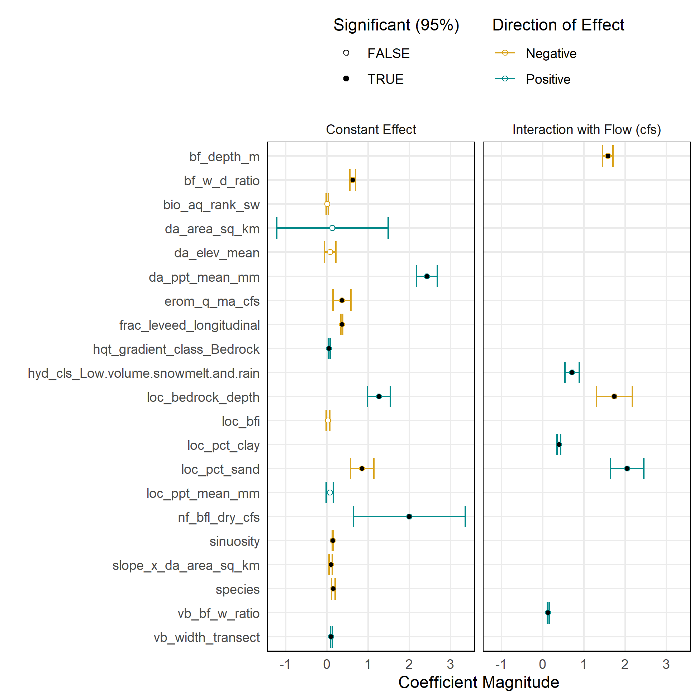<!-- -->

### Random Forest Regrssion

``` r
#install.packages("ranger")
#rfr_spec <- rand_forest(mode = "regression", trees = 2^12)
```

#### Scale-independent (%HSI versus dimensionless flow)

``` r
# set up cross validation
folds <- vfold_cv(training(td_split), v = 10, strata = dataset)
val_metrics <- metric_set(rmse, rsq, ccc)

# tuned random forest: how many trees to use?
rfr_spec <- rand_forest(mode = "regression", trees = tune())
rfr_grid <- tibble(trees = 2^seq(0, 12, 1))

rfr_si_tune <- 
  workflow() |>
  add_recipe(si_rec) |>
  add_model(rfr_spec) |>
  tune_grid(resamples = folds,
            grid = rfr_grid,
            metrics = val_metrics)
```

    ## Warning: package 'ranger' was built under R version 4.3.2

``` r
rfr_si_tune |>
  collect_metrics() |>
  ggplot(aes(x = trees, y = mean, color = .metric)) +
  geom_errorbar(aes(ymin = mean - std_err,
                    ymax = mean + std_err),
                width = 0.05) +
  geom_line() +
  facet_wrap(. ~ .metric, ncol = 1, scales="free") +
  theme(legend.position = "none") + scale_x_log10()
```

<!-- -->

``` r
rfr_spec <- rand_forest(mode = "regression", trees = 2^8)

rfr_si <- workflow() |>
  add_recipe(si_rec) |>
  add_model(rfr_spec) |>
  fit(data=training(td_split))

rfr_si$fit$fit |> print()
```

    ## parsnip model object
    ## 
    ## Ranger result
    ## 
    ## Call:
    ##  ranger::ranger(x = maybe_data_frame(x), y = y, num.trees = ~2^8,      num.threads = 1, verbose = FALSE, seed = sample.int(10^5,          1)) 
    ## 
    ## Type:                             Regression 
    ## Number of trees:                  256 
    ## Sample size:                      3516 
    ## Number of independent variables:  49 
    ## Mtry:                             7 
    ## Target node size:                 5 
    ## Variable importance mode:         none 
    ## Splitrule:                        variance 
    ## OOB prediction error (MSE):       0.0008033711 
    ## R squared (OOB):                  0.9646423

``` r
rfr_si_res <- 
testing(td_split) |>
  mutate(hsi_frac_pred = predict(rfr_si, testing(td_split))[[".pred"]]) |>
  select(comid, hsi_frac, hsi_frac_pred, flow_norm_cfs) |>
  # crude constraint to between 0 and 1; better to use betareg
  mutate(hsi_frac_pred=pmax(pmin(hsi_frac_pred,1),0))

rfr_si_res |>
  arrange(comid, flow_norm_cfs) |>
  ggplot() + geom_path(aes(x=hsi_frac, y=hsi_frac_pred, color=flow_norm_cfs, group=comid), linewidth=2) + 
  coord_fixed() + geom_abline() + scale_color_viridis_c(trans="log10", name="Frac. of MAF") + 
  ggtitle("Scale-independent model, random forest regression") +
  xlab("HSI (Frac. of Channel Area) (Actual)") + ylab("HSI (Frac. of Channel Area) (Predicted)")
```

<!-- -->

``` r
rfr_si_res |> 
  left_join(select(flowline_attributes, comid, erom_q_ma_cfs)) |>
  mutate(flow_cfs = flow_norm_cfs * erom_q_ma_cfs) |>
  filter(flow_cfs %in% c(400,600,800,1200,1600,2400,3200,4800)) |>
  ggplot() + geom_point(aes(x=hsi_frac, y=hsi_frac_pred, color=flow_cfs)) + 
  facet_wrap(~flow_cfs, ncol = 4) +
  coord_fixed() + geom_abline() + scale_color_viridis_c(name = "Flow (cfs)") + 
  ggtitle("Scale-independent model, random forest regression") +
  xlab("HSI (Frac. of Channel Area) (Actual)") + ylab("HSI (Frac. of Channel Area) (Predicted)")
```

<!-- -->

``` r
rfr_si_res |> filter(comid %in% head(unique(testing(td_split)$comid),12)) |>
  left_join(transmute(flowline_attributes, comid, erom_q_ma_cfs)) |> #, chan_width_ft=chan_width_m/0.3048)) |>
  ggplot(aes(x=flow_norm_cfs*erom_q_ma_cfs, group=1)) + facet_wrap(~comid) + 
  geom_line(aes(y=hsi_frac_pred*100, color="predicted", group=1)) + geom_line(aes(y=hsi_frac*100, color="actual", group=1)) + 
  xlab("Flow (cfs)") + ylab("Suitable Habitat Area (% of Total Area)")
```

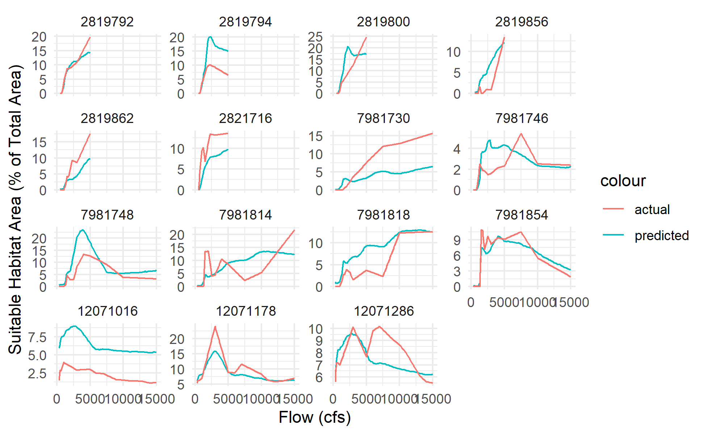<!-- -->

#### Scale-dependent (WUA-per-linear-ft versus flow)

``` r
rfr_spec <- rand_forest(mode = "regression", trees = tune())
rfr_grid <- tibble(trees = 2^seq(0, 12, 1))

rfr_sd_tune <- 
  workflow() |>
  add_recipe(sd_rec) |>
  add_model(rfr_spec) |>
  tune_grid(resamples = folds,
            grid = rfr_grid,
            metrics = val_metrics)
rfr_sd_tune |>
  collect_metrics() |>
  ggplot(aes(x = trees, y = mean, color = .metric)) +
  geom_errorbar(aes(ymin = mean - std_err,
                    ymax = mean + std_err),
                width = 0.05) +
  geom_line() +
  facet_wrap(. ~ .metric, ncol = 1, scales="free") +
  theme(legend.position = "none") + scale_x_log10()
```

<!-- -->

``` r
rfr_spec <- rand_forest(mode = "regression", trees = 2^8)

rfr_sd <- workflow() |>
  add_recipe(sd_rec) |>
  add_model(rfr_spec) |>
  fit(data=training(td_split))

rfr_sd$fit$fit |> print()
```

    ## parsnip model object
    ## 
    ## Ranger result
    ## 
    ## Call:
    ##  ranger::ranger(x = maybe_data_frame(x), y = y, num.trees = ~2^8,      num.threads = 1, verbose = FALSE, seed = sample.int(10^5,          1)) 
    ## 
    ## Type:                             Regression 
    ## Number of trees:                  256 
    ## Sample size:                      3516 
    ## Number of independent variables:  61 
    ## Mtry:                             7 
    ## Target node size:                 5 
    ## Variable importance mode:         none 
    ## Splitrule:                        variance 
    ## OOB prediction error (MSE):       0.001159747 
    ## R squared (OOB):                  0.9998496

``` r
rfr_sd_res <-
testing(td_split) |>
  mutate(log_wua_per_lf_pred = predict(rfr_sd, testing(td_split))[[".pred"]]) |>
  transmute(comid, wua_per_lf=exp(log_wua_per_lf), wua_per_lf_pred=exp(log_wua_per_lf_pred), flow_cfs) 

rfr_sd_res |>
  arrange(comid, flow_cfs) |>
  ggplot() + geom_path(aes(x=wua_per_lf, y=wua_per_lf_pred, color=flow_cfs, group=comid), linewidth=2) + 
  scale_y_log10() + scale_x_log10() +  coord_fixed() + geom_abline() + scale_color_viridis_c(name="Flow (cfs)")   + 
  ggtitle("Scale-dependent model, random forest regression") +
  xlab("WUA per LF (Actual)") + ylab("WUA per LF (Predicted)")
```

<!-- -->

``` r
rfr_sd_res |>
  filter(flow_cfs %in% c(400,600,800,1200,1600,2400,3200,4800)) |>
  ggplot() + geom_point(aes(x=wua_per_lf, y=wua_per_lf_pred, color=flow_cfs)) + 
  facet_wrap(~flow_cfs, ncol = 4) +
  scale_y_log10() + scale_x_log10() +  coord_fixed() + geom_abline() + scale_color_viridis_c(name="Flow (cfs)") + 
  ggtitle("Scale-dependent model, random forest regression") +
  xlab("WUA per LF (Actual)") + ylab("WUA per LF (Predicted)")
```

<!-- -->

``` r
rfr_sd_res |> filter(comid %in% head(unique(testing(td_split)$comid),12)) |>
  ggplot(aes(x=flow_cfs, group=1)) + facet_wrap(~comid) + 
  geom_line(aes(y=wua_per_lf_pred, color="predicted", group=1)) + geom_line(aes(y=wua_per_lf, color="actual", group=1)) + 
  scale_y_log10() + xlab("Flow (cfs)") + ylab("Suitable Habitat Area per LF Channel (ft)") 
```

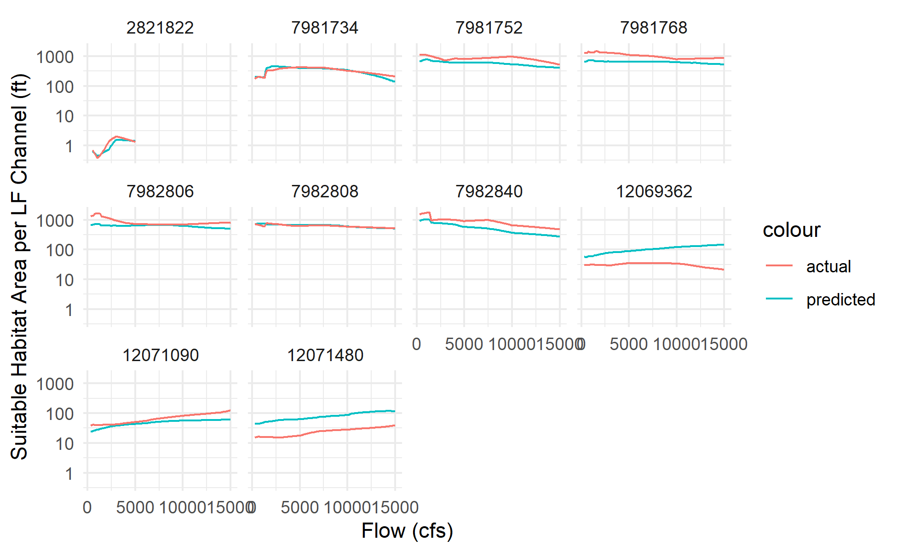<!-- -->

## Random Forest model prediction output

``` r
# assemble prediction dataset
pd <- flowline_attributes |> 
  # filter out Valley Lowland areas
  filter(hqt_gradient_class != "Valley Lowland") |>
  # filter for just the areas that are hydrologically similar to the training data
  filter(hyd_cls %in% c("High-volume snowmelt and rain",
                        "Low-volume snowmelt and rain")) |>
  # select the variables that are used in the model and drop NAs
  mutate(nf_bfl_dry_cfs_norm = coalesce(nf_bfl_dry_cfs/erom_q_ma_cfs,0), # normalized baseflow values
         nf_bfl_wet_cfs_norm = coalesce(nf_bfl_wet_cfs/erom_q_ma_cfs,0)) |>
  select(comid, any_of(c(sd_rec$var_info$variable, si_rec$var_info$variable))) |> drop_na() |>
  # create series of flow prediction points
  expand_grid(flow_cfs = c(0,signif(100*2^seq(-2,7,0.5),2))) |>
  mutate(flow_cfs = if_else(flow_cfs>0, flow_cfs, erom_q_ma_cfs)) |> # also evaluate at mean annual flow
  mutate(flow_norm_cfs = coalesce(flow_cfs/erom_q_ma_cfs,0)) |> # flow as a percent of mean annual flow
  arrange(comid, flow_cfs) |>
  glimpse()
```

    ## Rows: 232,900
    ## Columns: 34
    ## $ comid                    <dbl> 342439, 342439, 342439, 342439, 342439, 34243…
    ## $ slope                    <dbl> 0.00931547, 0.00931547, 0.00931547, 0.0093154…
    ## $ da_area_sq_km            <dbl> 8.3835, 8.3835, 8.3835, 8.3835, 8.3835, 8.383…
    ## $ da_elev_mean             <dbl> 2284.09, 2284.09, 2284.09, 2284.09, 2284.09, …
    ## $ da_ppt_mean_mm           <dbl> 1248.088, 1248.088, 1248.088, 1248.088, 1248.…
    ## $ nf_bfl_dry_cfs           <dbl> 0.864, 0.864, 0.864, 0.864, 0.864, 0.864, 0.8…
    ## $ nf_bfl_wet_cfs           <dbl> 4.33, 4.33, 4.33, 4.33, 4.33, 4.33, 4.33, 4.3…
    ## $ erom_q_ma_cfs            <dbl> 4.109, 4.109, 4.109, 4.109, 4.109, 4.109, 4.1…
    ## $ erom_v_ma_fps            <dbl> 0.88129, 0.88129, 0.88129, 0.88129, 0.88129, …
    ## $ bf_depth_m               <dbl> 0.76, 0.76, 0.76, 0.76, 0.76, 0.76, 0.76, 0.7…
    ## $ bf_w_d_ratio             <dbl> 8.460526, 8.460526, 8.460526, 8.460526, 8.460…
    ## $ da_k_erodibility         <dbl> 0.1827, 0.1827, 0.1827, 0.1827, 0.1827, 0.182…
    ## $ da_avg_slope             <dbl> 19.95, 19.95, 19.95, 19.95, 19.95, 19.95, 19.…
    ## $ mean_ndvi                <dbl> 0.2641405, 0.2641405, 0.2641405, 0.2641405, 0…
    ## $ loc_bfi                  <dbl> 58, 58, 58, 58, 58, 58, 58, 58, 58, 58, 58, 5…
    ## $ loc_pct_clay             <dbl> 13.60, 13.60, 13.60, 13.60, 13.60, 13.60, 13.…
    ## $ loc_pct_sand             <dbl> 57.30, 57.30, 57.30, 57.30, 57.30, 57.30, 57.…
    ## $ loc_permeability         <dbl> 10.16, 10.16, 10.16, 10.16, 10.16, 10.16, 10.…
    ## $ loc_bedrock_depth        <dbl> 123.50, 123.50, 123.50, 123.50, 123.50, 123.5…
    ## $ loc_ppt_mean_mm          <dbl> 1197.80, 1197.80, 1197.80, 1197.80, 1197.80, …
    ## $ mtpi30_min               <dbl> -9, -9, -9, -9, -9, -9, -9, -9, -9, -9, -9, -…
    ## $ vb_bf_w_ratio            <dbl> 1, 1, 1, 1, 1, 1, 1, 1, 1, 1, 1, 1, 1, 1, 1, …
    ## $ frac_leveed_longitudinal <dbl> 0, 0, 0, 0, 0, 0, 0, 0, 0, 0, 0, 0, 0, 0, 0, …
    ## $ vb_width_transect        <dbl> 6.43, 6.43, 6.43, 6.43, 6.43, 6.43, 6.43, 6.4…
    ## $ sinuosity                <dbl> 1.32, 1.32, 1.32, 1.32, 1.32, 1.32, 1.32, 1.3…
    ## $ bio_aq_rank_sw           <int> 3, 3, 3, 3, 3, 3, 3, 3, 3, 3, 3, 3, 3, 3, 3, …
    ## $ species                  <dbl> 61, 61, 61, 61, 61, 61, 61, 61, 61, 61, 61, 6…
    ## $ species_fish             <dbl> 1, 1, 1, 1, 1, 1, 1, 1, 1, 1, 1, 1, 1, 1, 1, …
    ## $ hqt_gradient_class       <fct> Bedrock, Bedrock, Bedrock, Bedrock, Bedrock, …
    ## $ hyd_cls                  <fct> "Low-volume snowmelt and rain", "Low-volume s…
    ## $ nf_bfl_dry_cfs_norm      <dbl> 0.2102701, 0.2102701, 0.2102701, 0.2102701, 0…
    ## $ nf_bfl_wet_cfs_norm      <dbl> 1.0537844, 1.0537844, 1.0537844, 1.0537844, 1…
    ## $ flow_cfs                 <dbl> 4.109, 25.000, 35.000, 50.000, 71.000, 100.00…
    ## $ flow_norm_cfs            <dbl> 1.000000, 6.084205, 8.517888, 12.168411, 17.2…

``` r
# # get min/max ranges from the training data
# ranges <- td |> select(all_of(names(pd))) |> 
#   reframe(across(everything(), function(x) (range(x)))) 
# # filter the prediction data for just those falling within the training data
# pd_idx <- pd |> 
#   select(comid, all_of(names(ranges))) |>
#   mutate(across(-comid, function(x) x>ranges[[cur_column()]][[1]] & x<=ranges[[cur_column()]][[2]])) |>
#   filter(if_all(-comid)) |>
#   pull(comid)
# # update pd to exclude the out-of-range data
# pd <- pd |> filter(comid %in% pd_idx) |> glimpse()
```

``` r
sd_pred <- 
  sd_rec |> 
  prep(td) |> 
  bake(pd) |> 
  bind_cols(pd |> transmute(comid, flow_cfs_orig=flow_cfs)) |>
  drop_na() %>% # need to use magrittr pipe for this purpose
  mutate(log_wua_per_lf_pred = predict(rfr_sd$fit$fit, new_data=.)[[".pred"]]) |>
  transmute(comid, flow_cfs=flow_cfs_orig, log_wua_per_lf_pred) |>
  mutate(wua_per_lf_pred = exp(log_wua_per_lf_pred)) |>
  glimpse()
```

    ## Rows: 232,797
    ## Columns: 4
    ## $ comid               <dbl> 342439, 342439, 342439, 342439, 342439, 342439, 34…
    ## $ flow_cfs            <dbl> 4.109, 25.000, 35.000, 50.000, 71.000, 100.000, 14…
    ## $ log_wua_per_lf_pred <dbl> 1.791700, 1.908058, 1.908147, 1.902353, 1.884718, …
    ## $ wua_per_lf_pred     <dbl> 5.999640, 6.739984, 6.740587, 6.701647, 6.584498, …

``` r
si_pred <- 
  si_rec |> 
  prep(td) |> 
  bake(pd) |> 
  bind_cols(pd |> transmute(comid, flow_norm_cfs_orig=flow_norm_cfs)) |>
  drop_na() %>% # need to use magrittr pipe for this purpose
  mutate(hsi_frac_pred = predict(rfr_si$fit$fit, new_data=.)[[".pred"]]) |>
  transmute(comid, flow_norm_cfs=flow_norm_cfs_orig, hsi_frac_pred) |>
  left_join(flowline_attributes |> transmute(comid, bf_width_ft = bf_width_m/0.3048), by=join_by(comid)) |>
  mutate(wua_per_lf_pred = hsi_frac_pred * bf_width_ft) |>
  glimpse()
```

    ## Rows: 229,572
    ## Columns: 5
    ## $ comid           <dbl> 342439, 342439, 342439, 342439, 342439, 342439, 342439…
    ## $ flow_norm_cfs   <dbl> 1.000000, 6.084205, 8.517888, 12.168411, 17.279143, 24…
    ## $ hsi_frac_pred   <dbl> 0.6497609, 0.5270429, 0.5098045, 0.4933380, 0.4818982,…
    ## $ bf_width_ft     <dbl> 21.09580, 21.09580, 21.09580, 21.09580, 21.09580, 21.0…
    ## $ wua_per_lf_pred <dbl> 13.707225, 11.118392, 10.754735, 10.407361, 10.166028,…

Example plot of habitat area per linear foot at 800 cfs (scale-dependent
model)

``` r
flowlines |> st_zm() |>
  inner_join(sd_pred |> filter(round(flow_cfs)==800), by=join_by(comid)) |>
  ggplot() + geom_sf(aes(color = wua_per_lf_pred)) + 
  scale_color_viridis_c(trans="log", breaks = scales::breaks_log(6))
```

<!-- -->

Example plot of percent habitat area at mean annual flow
(scale-independent model)

``` r
flowlines |> st_zm() |>
  inner_join(si_pred |> filter(flow_norm_cfs==1), by=join_by(comid)) |>
  ggplot() + geom_sf(aes(color = hsi_frac_pred)) + 
  scale_color_viridis_c(breaks = scales::breaks_pretty(5))
```

<!-- -->

## Predictions summarized by DSMHabitat reach

``` r
mainstems_comid <- 
  st_read("/vsizip/rearing_spatial_data/nhdplusv2_comid_habitat_xw.shp.zip", as_tibble=T) |>
  janitor::clean_names() |>
  st_zm() |>
  st_transform(st_crs(flowlines)) |>
  mutate(length_ft = st_length(geometry) |> units::set_units("ft") |> units::drop_units()) |>
  filter(habitat=="rearing") |>
  left_join(flowline_attributes |> select(comid, hqt_gradient_class), by=join_by(comid)) |>
  filter(!(river %in% c("Sacramento River", "San Joaquin River")))
```

    ## Reading layer `nhdplusv2_comid_habitat_xw' from data source 
    ##   `/vsizip/rearing_spatial_data/nhdplusv2_comid_habitat_xw.shp.zip' 
    ##   using driver `ESRI Shapefile'
    ## Simple feature collection with 2657 features and 16 fields
    ## Geometry type: LINESTRING
    ## Dimension:     XYZM
    ## Bounding box:  xmin: -123.0351 ymin: 36.76305 xmax: -119.1836 ymax: 41.32689
    ## z_range:       zmin: 0 zmax: 0
    ## m_range:       mmin: 0 mmax: 100
    ## Geodetic CRS:  NAD83

``` r
mainstems <-
  mainstems_comid |>
  group_by(river, hqt_gradient_class) |>
  summarize() 
```

    ## `summarise()` has grouped output by 'river'. You can override using the
    ## `.groups` argument.

``` r
mainstems_comid |> 
  ggplot() + 
  geom_sf(aes(color=river, linetype=hqt_gradient_class)) + 
  theme(legend.key.height = unit(12, "point"))
```

<!-- -->

``` r
watersheds <- mainstems |> pull(river) |> unique()
watershed_name <- tolower(gsub(pattern = "-| ", replacement = "_", x = watersheds))
watershed_rda_name <- paste(watershed_name, "floodplain", sep = "_")

dsm_habitat_floodplain <- map_df(watershed_rda_name, function(watershed) {
  df <- as.data.frame(do.call(`::`, list(pkg = "DSMhabitat", name = watershed)))
}) |> 
  rename(river = watershed) |>
  mutate(FR_floodplain_m2 = FR_floodplain_acres * 4046.86,
         FR_floodplain_m2_suitable = DSMhabitat::apply_suitability(FR_floodplain_m2),
         FR_floodplain_acres_suitable = FR_floodplain_m2_suitable / 4046.86)

dsm_habitat_instream <- map_df(paste(watershed_name, "instream", sep = "_"), 
                               possibly(function(watershed) {
                                 df <- as.data.frame(do.call(`::`, list(pkg = "DSMhabitat", name = watershed)))
                                 }, otherwise = NULL)) |> 
  rename(river = watershed) 

dsm_flows <- bind_rows(dsm_habitat_floodplain, dsm_habitat_instream) |>
  group_by(river, flow_cfs) |>
  summarize() |>
  ungroup() |>
  arrange(river, flow_cfs)
```

    ## `summarise()` has grouped output by 'river'. You can override using the
    ## `.groups` argument.

``` r
pd_dsmhabitat <- flowline_attributes |> 
  # select the variables that are used in the model and drop NAs
  select(comid, any_of(sd_rec$var_info$variable)) |> 
  inner_join(select(mainstems_comid, comid, river)) |>
  # left join dsm_flows to bring in the exact flows used in DSMhabitat:
  # left_join(dsm_flows, by=join_by(river), relationship="many-to-many") |>
  # or use expand_grid to bring in the modeled flows instead:
  expand_grid(flow_cfs = interp_flows) |>
  arrange(comid, flow_cfs) |>
  filter(comid %in% mainstems_comid$comid) |>
  drop_na() #
```

    ## Joining with `by = join_by(comid)`

``` r
mainstems_comid |> 
  st_zm() |> 
  filter(comid %in% pd_dsmhabitat$comid) |>
  ggplot() + 
  geom_sf(aes(color=river)) + 
  theme(legend.key.height = unit(12, "point"))
```

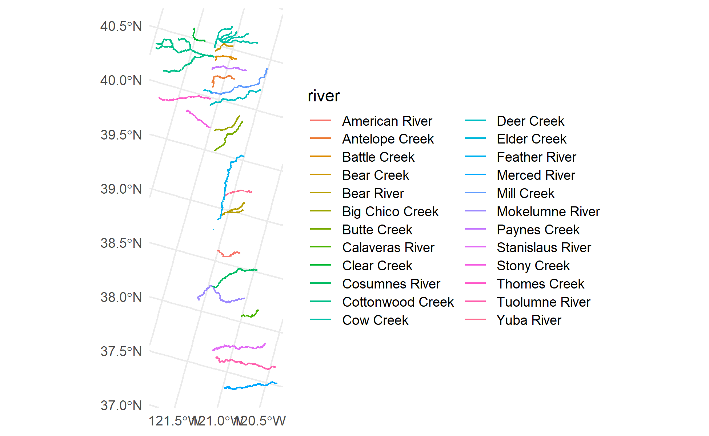<!-- -->

``` r
pd_dsmhabitat_pred <- 
  sd_rec |> 
  prep(td) |> 
  bake(pd_dsmhabitat) |> 
  bind_cols(pd_dsmhabitat |> transmute(comid, flow_cfs_orig=flow_cfs)) |>
  drop_na() %>% # need to use magrittr pipe for this purpose
  mutate(log_wua_per_lf_pred = predict(rfr_sd$fit$fit, new_data=.)[[".pred"]]) |>
  transmute(comid, flow_cfs=flow_cfs_orig, log_wua_per_lf_pred) |>
  mutate(wua_per_lf_pred = exp(log_wua_per_lf_pred)) |>
  select(comid, 
         flow_cfs, wua_per_lf_pred)
```

    ## Warning: ! There are new levels in a factor: Valley Lowland

    ## Warning: ! There are new levels in a factor: Rain and seasonal groundwater, Perennial
    ##   groundwater and rain, Flashy, ephemeral rain, and Winter storms

``` r
pd_rf_by_mainstem <-
  mainstems_comid |> 
  st_drop_geometry() |>
  inner_join(pd_dsmhabitat_pred, by=join_by(comid), relationship="many-to-many") |>
  group_by(river, flow_cfs) |>
  summarize(tot_wua_per_lf_pred = sum(coalesce(wua_per_lf_pred,0)),
            tot_length_ft = sum(coalesce(length_ft,0))) |>
  mutate(tot_wua_ft2 = tot_wua_per_lf_pred * tot_length_ft,
         tot_wua_ac = tot_wua_ft2 / 43560,
         avg_wua_ft2_per_lf = tot_wua_ft2 / tot_length_ft,
         avg_wua_ft2_per_1000ft = 1000 * avg_wua_ft2_per_lf) 
```

    ## `summarise()` has grouped output by 'river'. You can override using the
    ## `.groups` argument.

``` r
pd_rf_by_mainstem |>
  ggplot() + 
  geom_line(aes(x = flow_cfs, y = tot_wua_ac, color = river)) + #, color=species, linetype=habitat)) + 
  facet_wrap(~river, scales="free_y") + 
  scale_x_log10(labels=scales::comma_format(), expand=c(0,0)) + 
  scale_y_continuous() + 
  theme(legend.position="none", 
        panel.grid.minor = element_blank(),
        axis.text.x = element_text(angle = 90, vjust = 0.5, hjust=1)) +
  xlab("Flow (cfs)") + ylab("Total WUA (ac)")
```

<!-- -->

``` r
pd_rf_by_mainstem |>
  ggplot() + 
  geom_line(aes(x = flow_cfs, y = avg_wua_ft2_per_lf, color = river)) + #, color=species, linetype=habitat)) + 
  facet_wrap(~river, scales="free_y") + 
  scale_x_log10(labels=scales::comma_format(), expand=c(0,0)) + 
  scale_y_continuous() + 
  theme(legend.position="none", 
        panel.grid.minor = element_blank(),
        axis.text.x = element_text(angle = 90, vjust = 0.5, hjust=1)) +
  xlab("Flow (cfs)") + ylab("Suitable Habitat Area (ft2 per linear ft)")
```

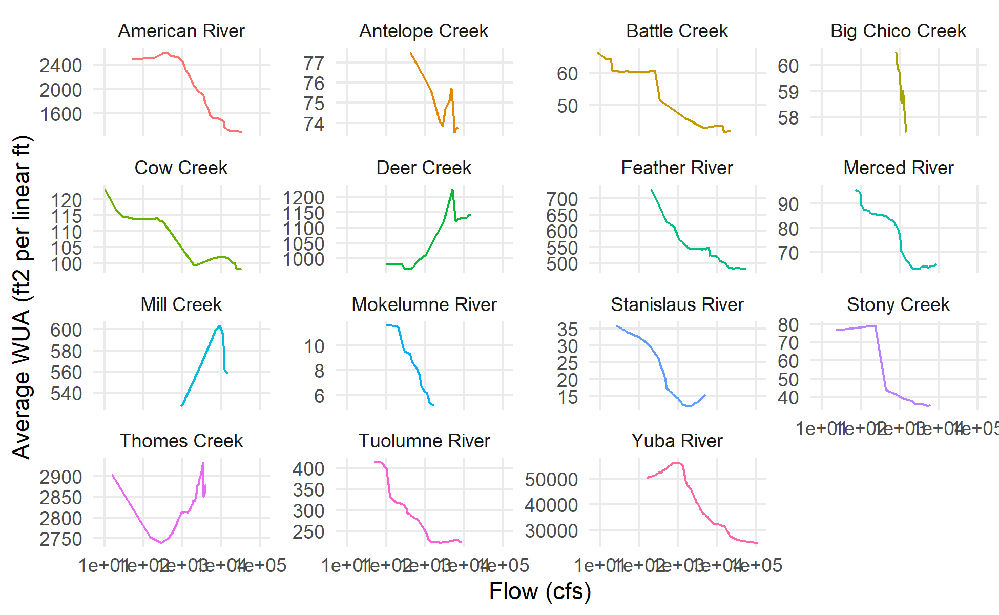<!-- -->

``` r
pd_rf_by_mainstem |> 
  inner_join(dsm_habitat_floodplain, by=join_by(river==river, flow_cfs==flow_cfs)) |> 
  #filter(river == "American River") |> 
  ggplot() +
  geom_line(aes(x = flow_cfs, y = tot_wua_ac, color='modeled')) + 
  geom_line(aes(x = flow_cfs, y = FR_floodplain_acres_suitable, color = 'DSMhabitat')) +  
  facet_wrap(~river) + #, scales="free_y") + 
  scale_x_log10(labels=scales::comma_format(), expand=c(0,0)) + 
  scale_y_log10(labels=scales::comma_format(), expand=c(0,0)) + 
  theme(legend.position="top", legend.title=element_blank(),
        panel.grid.minor = element_blank(),
        axis.text.x = element_text(angle = 90, vjust = 0.5, hjust=1)) +
  xlab("Flow (cfs)") + ylab("Total WUA (ac)")
```

    ## Warning: Transformation introduced infinite values in continuous y-axis

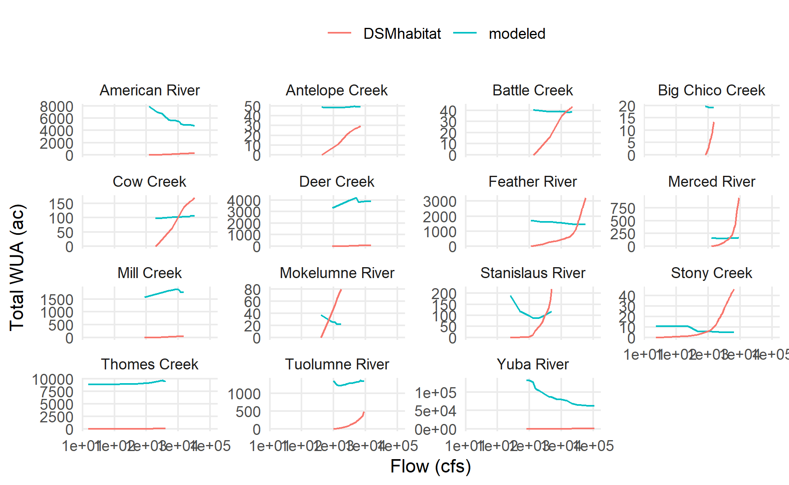<!-- -->

``` r
pd_rf_by_mainstem |> 
  inner_join(dsm_habitat_instream, by=join_by(river==river, flow_cfs==flow_cfs)) |> 
  ggplot() +
  geom_line(aes(x = flow_cfs, y = avg_wua_ft2_per_1000ft, color='modeled')) + 
  geom_line(aes(x = flow_cfs, y = FR_juv_wua, color = 'DSMhabitat')) +  
  facet_wrap(~river) + #, scales="free_y") + 
  scale_x_log10(labels=scales::comma_format(), expand=c(0,0)) + 
  scale_y_log10(labels=scales::comma_format(), expand=c(0,0)) + 
  theme(legend.position="top", legend.title=element_blank(),
        panel.grid.minor = element_blank(),
        axis.text.x = element_text(angle = 90, vjust = 0.5, hjust=1)) +
  xlab("Flow (cfs)") + ylab("Suitable Habitat Area (ft2 per linear ft)")
```

<!-- -->

===

``` r
knitr::knit_exit()
```
