Statistical Modeling to Predict Flow-to-Suitable-Area Curves
================
[Skyler Lewis](mailto:slewis@flowwest.com)
2024-04-17

- [Import and Preprocess Training
  Data](#import-and-preprocess-training-data)
  - [Exploration and PCA](#exploration-and-pca)
- [Training Data Setup](#training-data-setup)
- [Model Training](#model-training)
  - [Scale Dependent Model: WUA-per-linear-ft versus
    flow](#scale-dependent-model-wua-per-linear-ft-versus-flow)
  - [Scale Dependent Model 2: TOTAL Inundated Area per linear ft versus
    flow:](#scale-dependent-model-2-total-inundated-area-per-linear-ft-versus-flow)
  - [Scale Independent Model: %HSI versus flow (normalized by
    MAF)](#scale-independent-model-hsi-versus-flow-normalized-by-maf)
  - [Scale Independent Model 2: WUA-per-linear-ft (normalized by
    da_scalar) versus flow (normalized by
    da_scalar)](#scale-independent-model-2-wua-per-linear-ft-normalized-by-da_scalar-versus-flow-normalized-by-da_scalar)
- [Prediction and Validation](#prediction-and-validation)
  - [One-step model, scale-dependent: WUA/LF vs
    flow](#one-step-model-scale-dependent-wualf-vs-flow)
  - [Two-step model: (%HSI vs normalized flow) \* (Total Area/LF vs
    flow)](#two-step-model-hsi-vs-normalized-flow--total-arealf-vs-flow)
  - [One-step model, scale-independent: normalized WUA/LF vs normalized
    flow](#one-step-model-scale-independent-normalized-wualf-vs-normalized-flow)
- [Predictions summarized by DSMHabitat
  reach](#predictions-summarized-by-dsmhabitat-reach)
  - [One-step model, scale-dependent: WUA/LF vs
    flow](#one-step-model-scale-dependent-wualf-vs-flow-1)
  - [Two-step model: (%HSI vs normalized flow) \* (Total Area/LF vs
    flow)](#two-step-model-hsi-vs-normalized-flow--total-arealf-vs-flow-1)
  - [One-step model, scale-independent: WUA/LF vs normalized
    flow](#one-step-model-scale-independent-wualf-vs-normalized-flow)

``` r
library(tidyverse)
library(sf)
library(stars)
library(tidymodels)
library(broom.mixed) # tidy output of mixed model results
library(dotwhisker) # visualize regression results

knitr::opts_chunk$set(eval=TRUE, fig.width=6.5, fig.height=4, dpi=300)

theme_set(theme_minimal())

ihs <- trans_new("ihs", 
                 transform = function(x) asinh(x), 
                 inverse = function(y) sinh(y), 
                 breaks = function(i) scales::breaks_log(n=5, base=10)(pmax(i,0.01)), 
                 #minor_breaks = scales::minor_breaks_n(n = 0),
                 domain=c(0, Inf),
                 format = scales::label_comma())
```

## Import and Preprocess Training Data

``` r
# flowline geometries
flowlines <- readRDS("../data/flowline_geometries.Rds") |>
  st_transform("ESRI:102039")

# predictor variables by ComID
flowline_attributes <- readRDS("../data/flowline_attributes.Rds") |>
  mutate(da_scalar = (da_area_sq_km*247.1053815) * (da_ppt_mean_mm*0.0393701) / 1E6) # 1 million acre-inches

# response variables by ComID and Flow 
flow_to_suitable_area <- readRDS("../data/fsa_combined.Rds")

# Optionally, swap out the original HSI ranges with the version using the HQT depth/velocity cutoffs
# (TRUE) to use HQT depth/velocity ranges
if(TRUE){
  flow_to_suitable_area <- 
    flow_to_suitable_area |>
    transmute(dataset, comid, flow_cfs, area_tot_ft2,
              area_wua_ft2 = area_wua_ft2_hqt,
              hsi_frac = hsi_frac_hqt)
}
```

``` r
# Limit to a specified flow range and interpolate gaps
interp_flows <- seq(300,15000,100)
flow_to_suitable_area <- 
  flow_to_suitable_area |>
  group_by(dataset, comid) |>
  complete(flow_cfs = interp_flows) |>
  arrange(dataset, comid, flow_cfs) |>
  mutate(across(c(area_tot_ft2, area_wua_ft2, hsi_frac), function(var) zoo::na.approx(var, x = flow_cfs, na.rm=F))) |>
  filter(flow_cfs %in% interp_flows) |>
  filter(!is.na(hsi_frac))

train_data <- flowlines |> st_drop_geometry() |>
  left_join(flowline_attributes, by=join_by("comid"), relationship="one-to-one") |>
  inner_join(flow_to_suitable_area, by=join_by("comid"), relationship="one-to-many") |> 
  #filter(hqt_gradient_class != "Valley Lowland") |>
  # # eliminate reaches with near zero mean annual flow
  # filter(erom_q_ma_cfs>10) |>
  glimpse()
```

    ## Rows: 20,236
    ## Columns: 123

    ## Warning in grepl(",", levels(x), fixed = TRUE): input string 3 is invalid in
    ## this locale

    ## Warning in grepl(",", levels(x), fixed = TRUE): input string 4 is invalid in
    ## this locale

    ## Warning in grepl(",", levels(x), fixed = TRUE): input string 6 is invalid in
    ## this locale

    ## $ comid                        <dbl> 8061233, 8061233, 8061233, 8061233, 80612…
    ## $ reachcode                    <fct> 18020125000002, 18020125000002, 180201250…
    ## $ gnis_id                      <fct> 238295, 238295, 238295, 238295, 238295, 2…
    ## $ gnis_name                    <fct> "Yuba River", "Yuba River", "Yuba River",…
    ## $ lengthkm                     <dbl> 0.036, 0.036, 0.036, 0.036, 0.036, 0.036,…
    ## $ ftype                        <fct> StreamRiver, StreamRiver, StreamRiver, St…
    ## $ fcode                        <int> 46006, 46006, 46006, 46006, 46006, 46006,…
    ## $ huc_8                        <chr> "18020125", "18020125", "18020125", "1802…
    ## $ huc_10                       <chr> "1802012500", "1802012500", "1802012500",…
    ## $ huc_12                       <chr> "180201250000", "180201250000", "18020125…
    ## $ ftype_desc                   <chr> "Stream/River", "Stream/River", "Stream/R…
    ## $ hydro_seq                    <dbl> 10007863, 10007863, 10007863, 10007863, 1…
    ## $ reach_code                   <fct> 18020125000002, 18020125000002, 180201250…
    ## $ stream_level                 <dbl> 3, 3, 3, 3, 3, 3, 3, 3, 3, 3, 3, 3, 3, 3,…
    ## $ stream_order                 <dbl> 5, 5, 5, 5, 5, 5, 5, 5, 5, 5, 5, 5, 5, 5,…
    ## $ us_length_km                 <dbl> 2680.552, 2680.552, 2680.552, 2680.552, 2…
    ## $ ds_length_km                 <dbl> 202.394, 202.394, 202.394, 202.394, 202.3…
    ## $ da_area_sq_km                <dbl> 3110.287, 3110.287, 3110.287, 3110.287, 3…
    ## $ reach_length_km              <dbl> 0.036, 0.036, 0.036, 0.036, 0.036, 0.036,…
    ## $ slope                        <dbl> NA, NA, NA, NA, NA, NA, NA, NA, NA, NA, N…
    ## $ elev_min                     <dbl> 71.39, 71.39, 71.39, 71.39, 71.39, 71.39,…
    ## $ elev_max                     <dbl> 71.39, 71.39, 71.39, 71.39, 71.39, 71.39,…
    ## $ stream_power                 <dbl> NA, NA, NA, NA, NA, NA, NA, NA, NA, NA, N…
    ## $ da_ppt_mean_mm               <dbl> 1675.915, 1675.915, 1675.915, 1675.915, 1…
    ## $ loc_ppt_mean_mm              <dbl> NA, NA, NA, NA, NA, NA, NA, NA, NA, NA, N…
    ## $ vogel_q_ma_cfs               <dbl> 4225.676, 4225.676, 4225.676, 4225.676, 4…
    ## $ vogel_v_ma_fps               <dbl> 1.85044, 1.85044, 1.85044, 1.85044, 1.850…
    ## $ erom_q_ma_cfs                <dbl> 2649.201, 2649.201, 2649.201, 2649.201, 2…
    ## $ erom_v_ma_fps                <dbl> 1.70733, 1.70733, 1.70733, 1.70733, 1.707…
    ## $ sinuosity                    <dbl> 1, 1, 1, 1, 1, 1, 1, 1, 1, 1, 1, 1, 1, 1,…
    ## $ da_avg_slope                 <dbl> 29.4, 29.4, 29.4, 29.4, 29.4, 29.4, 29.4,…
    ## $ da_elev_mean                 <dbl> 1379.63, 1379.63, 1379.63, 1379.63, 1379.…
    ## $ da_elev_min                  <dbl> 71.19, 71.19, 71.19, 71.19, 71.19, 71.19,…
    ## $ da_elev_max                  <dbl> 2757.74, 2757.74, 2757.74, 2757.74, 2757.…
    ## $ da_elev_rel                  <dbl> 2686.55, 2686.55, 2686.55, 2686.55, 2686.…
    ## $ loc_bfi                      <dbl> NA, NA, NA, NA, NA, NA, NA, NA, NA, NA, N…
    ## $ da_bfi                       <dbl> NA, NA, NA, NA, NA, NA, NA, NA, NA, NA, N…
    ## $ loc_twi                      <dbl> NA, NA, NA, NA, NA, NA, NA, NA, NA, NA, N…
    ## $ da_twi                       <dbl> NA, NA, NA, NA, NA, NA, NA, NA, NA, NA, N…
    ## $ loc_pct_clay                 <dbl> NA, NA, NA, NA, NA, NA, NA, NA, NA, NA, N…
    ## $ da_pct_clay                  <dbl> NA, NA, NA, NA, NA, NA, NA, NA, NA, NA, N…
    ## $ loc_pct_sand                 <dbl> NA, NA, NA, NA, NA, NA, NA, NA, NA, NA, N…
    ## $ da_pct_sand                  <dbl> NA, NA, NA, NA, NA, NA, NA, NA, NA, NA, N…
    ## $ loc_permeability             <dbl> NA, NA, NA, NA, NA, NA, NA, NA, NA, NA, N…
    ## $ loc_bedrock_depth            <dbl> NA, NA, NA, NA, NA, NA, NA, NA, NA, NA, N…
    ## $ da_permeability              <dbl> NA, NA, NA, NA, NA, NA, NA, NA, NA, NA, N…
    ## $ da_bedrock_depth             <dbl> NA, NA, NA, NA, NA, NA, NA, NA, NA, NA, N…
    ## $ loc_k_erodibility            <dbl> NA, NA, NA, NA, NA, NA, NA, NA, NA, NA, N…
    ## $ da_k_erodibility             <dbl> NA, NA, NA, NA, NA, NA, NA, NA, NA, NA, N…
    ## $ loc_precip                   <dbl> NA, NA, NA, NA, NA, NA, NA, NA, NA, NA, N…
    ## $ da_precip                    <dbl> NA, NA, NA, NA, NA, NA, NA, NA, NA, NA, N…
    ## $ loc_runoff                   <dbl> NA, NA, NA, NA, NA, NA, NA, NA, NA, NA, N…
    ## $ da_runoff                    <dbl> NA, NA, NA, NA, NA, NA, NA, NA, NA, NA, N…
    ## $ bf_width_m                   <dbl> 68.3182, 68.3182, 68.3182, 68.3182, 68.31…
    ## $ bf_depth_m                   <dbl> 2.446871, 2.446871, 2.446871, 2.446871, 2…
    ## $ bf_w_d_ratio                 <dbl> 27.92063, 27.92063, 27.92063, 27.92063, 2…
    ## $ mean_ndvi                    <dbl> NA, NA, NA, NA, NA, NA, NA, NA, NA, NA, N…
    ## $ bio_aq_rank_sw               <int> 4, 4, 4, 4, 4, 4, 4, 4, 4, 4, 4, 4, 4, 4,…
    ## $ species                      <dbl> 45, 45, 45, 45, 45, 45, 45, 45, 45, 45, 4…
    ## $ species_fish                 <dbl> 9, 9, 9, 9, 9, 9, 9, 9, 9, 9, 9, 9, 9, 9,…
    ## $ species_crust                <dbl> 0, 0, 0, 0, 0, 0, 0, 0, 0, 0, 0, 0, 0, 0,…
    ## $ species_herps                <dbl> 9, 9, 9, 9, 9, 9, 9, 9, 9, 9, 9, 9, 9, 9,…
    ## $ species_inverts              <dbl> 3, 3, 3, 3, 3, 3, 3, 3, 3, 3, 3, 3, 3, 3,…
    ## $ species_mollusks             <dbl> 1, 1, 1, 1, 1, 1, 1, 1, 1, 1, 1, 1, 1, 1,…
    ## $ species_plants               <dbl> 4, 4, 4, 4, 4, 4, 4, 4, 4, 4, 4, 4, 4, 4,…
    ## $ species_birds                <dbl> 15, 15, 15, 15, 15, 15, 15, 15, 15, 15, 1…
    ## $ species_mammals              <dbl> 4, 4, 4, 4, 4, 4, 4, 4, 4, 4, 4, 4, 4, 4,…
    ## $ species_mollusks_crust       <dbl> 1, 1, 1, 1, 1, 1, 1, 1, 1, 1, 1, 1, 1, 1,…
    ## $ species_endemic              <dbl> 11, 11, 11, 11, 11, 11, 11, 11, 11, 11, 1…
    ## $ species_endemic_fish         <dbl> 7, 7, 7, 7, 7, 7, 7, 7, 7, 7, 7, 7, 7, 7,…
    ## $ species_endemic_crust        <dbl> 0, 0, 0, 0, 0, 0, 0, 0, 0, 0, 0, 0, 0, 0,…
    ## $ species_endemic_herps        <dbl> 3, 3, 3, 3, 3, 3, 3, 3, 3, 3, 3, 3, 3, 3,…
    ## $ species_endemic_inverts      <dbl> 0, 0, 0, 0, 0, 0, 0, 0, 0, 0, 0, 0, 0, 0,…
    ## $ species_endemic_mollusks     <dbl> 0, 0, 0, 0, 0, 0, 0, 0, 0, 0, 0, 0, 0, 0,…
    ## $ species_endemic_plants       <dbl> 1, 1, 1, 1, 1, 1, 1, 1, 1, 1, 1, 1, 1, 1,…
    ## $ species_endemic_birds        <dbl> 0, 0, 0, 0, 0, 0, 0, 0, 0, 0, 0, 0, 0, 0,…
    ## $ species_endemic_mammals      <dbl> 0, 0, 0, 0, 0, 0, 0, 0, 0, 0, 0, 0, 0, 0,…
    ## $ species_vulnerable           <dbl> 18, 18, 18, 18, 18, 18, 18, 18, 18, 18, 1…
    ## $ species_listed               <dbl> 4, 4, 4, 4, 4, 4, 4, 4, 4, 4, 4, 4, 4, 4,…
    ## $ species_endemic_vulnerable   <dbl> 9, 9, 9, 9, 9, 9, 9, 9, 9, 9, 9, 9, 9, 9,…
    ## $ species_endemic_listed       <dbl> 3, 3, 3, 3, 3, 3, 3, 3, 3, 3, 3, 3, 3, 3,…
    ## $ genus                        <dbl> 39, 39, 39, 39, 39, 39, 39, 39, 39, 39, 3…
    ## $ family                       <dbl> 30, 30, 30, 30, 30, 30, 30, 30, 30, 30, 3…
    ## $ tax_order                    <dbl> 23, 23, 23, 23, 23, 23, 23, 23, 23, 23, 2…
    ## $ tax_class                    <dbl> 10, 10, 10, 10, 10, 10, 10, 10, 10, 10, 1…
    ## $ phylum                       <dbl> 4, 4, 4, 4, 4, 4, 4, 4, 4, 4, 4, 4, 4, 4,…
    ## $ species_current              <dbl> 19, 19, 19, 19, 19, 19, 19, 19, 19, 19, 1…
    ## $ species_historical           <dbl> 17, 17, 17, 17, 17, 17, 17, 17, 17, 17, 1…
    ## $ species_other                <dbl> 22, 22, 22, 22, 22, 22, 22, 22, 22, 22, 2…
    ## $ hyd_cat                      <fct> Mixed, Mixed, Mixed, Mixed, Mixed, Mixed,…
    ## $ hyd_cls                      <fct> "High-volume snowmelt and rain", "High-vo…
    ## $ nf_bfl_dry_cfs               <dbl> NA, NA, NA, NA, NA, NA, NA, NA, NA, NA, N…
    ## $ nf_bfl_wet_cfs               <dbl> NA, NA, NA, NA, NA, NA, NA, NA, NA, NA, N…
    ## $ nf_wet_start                 <dbl> NA, NA, NA, NA, NA, NA, NA, NA, NA, NA, N…
    ## $ nf_wet_dur                   <dbl> NA, NA, NA, NA, NA, NA, NA, NA, NA, NA, N…
    ## $ peak_q2_cfs                  <dbl> NA, NA, NA, NA, NA, NA, NA, NA, NA, NA, N…
    ## $ peak_q5_cfs                  <dbl> NA, NA, NA, NA, NA, NA, NA, NA, NA, NA, N…
    ## $ peak_q10_cfs                 <dbl> NA, NA, NA, NA, NA, NA, NA, NA, NA, NA, N…
    ## $ merit_width_m                <dbl> 34.86407, 34.86407, 34.86407, 34.86407, 3…
    ## $ vb_width_transect            <dbl> 34.86407, 34.86407, 34.86407, 34.86407, 3…
    ## $ frac_leveed_longitudinal     <dbl> 0, 0, 0, 0, 0, 0, 0, 0, 0, 0, 0, 0, 0, 0,…
    ## $ lateral_levee_confinement_ft <dbl> NA, NA, NA, NA, NA, NA, NA, NA, NA, NA, N…
    ## $ geomorph_class               <fct> NA, NA, NA, NA, NA, NA, NA, NA, NA, NA, N…
    ## $ hqt_gradient_class           <fct> Bedrock, Bedrock, Bedrock, Bedrock, Bedro…
    ## $ bf_xarea_m                   <dbl> 167.1659, 167.1659, 167.1659, 167.1659, 1…
    ## $ chan_width_m                 <dbl> 34.86407, 34.86407, 34.86407, 34.86407, 3…
    ## $ velocity_m_s                 <dbl> 5.601476, 5.601476, 5.601476, 5.601476, 5…
    ## $ wetted_perimeter_m           <dbl> 73.21195, 73.21195, 73.21195, 73.21195, 7…
    ## $ hydraulic_radius_m           <dbl> 2.283314, 2.283314, 2.283314, 2.283314, 2…
    ## $ critical_shields_number      <dbl> NA, NA, NA, NA, NA, NA, NA, NA, NA, NA, N…
    ## $ grain_size_mobilized_mm      <dbl> NA, NA, NA, NA, NA, NA, NA, NA, NA, NA, N…
    ## $ shear_velocity_cm_s          <dbl> NA, NA, NA, NA, NA, NA, NA, NA, NA, NA, N…
    ## $ settling_velocity_ndim       <dbl> NA, NA, NA, NA, NA, NA, NA, NA, NA, NA, N…
    ## $ grain_size_suspended_ndim    <dbl> NA, NA, NA, NA, NA, NA, NA, NA, NA, NA, N…
    ## $ grain_size_suspended_mm      <dbl> NA, NA, NA, NA, NA, NA, NA, NA, NA, NA, N…
    ## $ mtpi30_min                   <dbl> -33, -33, -33, -33, -33, -33, -33, -33, -…
    ## $ vb_bf_w_ratio                <dbl> 1, 1, 1, 1, 1, 1, 1, 1, 1, 1, 1, 1, 1, 1,…
    ## $ da_scalar                    <dbl> 50.71088, 50.71088, 50.71088, 50.71088, 5…
    ## $ dataset                      <chr> "Lower Yuba River", "Lower Yuba River", "…
    ## $ flow_cfs                     <dbl> 300, 400, 500, 600, 700, 800, 900, 1000, …
    ## $ area_tot_ft2                 <dbl> 19593.81, 20488.41, 21314.99, 22077.41, 2…
    ## $ area_wua_ft2                 <dbl> 0.0000, 0.0000, 0.0000, 0.0000, 0.0000, 0…
    ## $ hsi_frac                     <dbl> 0.000000000, 0.000000000, 0.000000000, 0.…

``` r
flowlines |> st_zm() |>
  filter(comid %in% unique(flow_to_suitable_area$comid)) |>
  left_join(flowline_attributes, by=join_by("comid"), relationship="one-to-one") |>
  ggplot() + geom_sf(aes(color = hqt_gradient_class)) + theme(legend.title=element_blank())
```

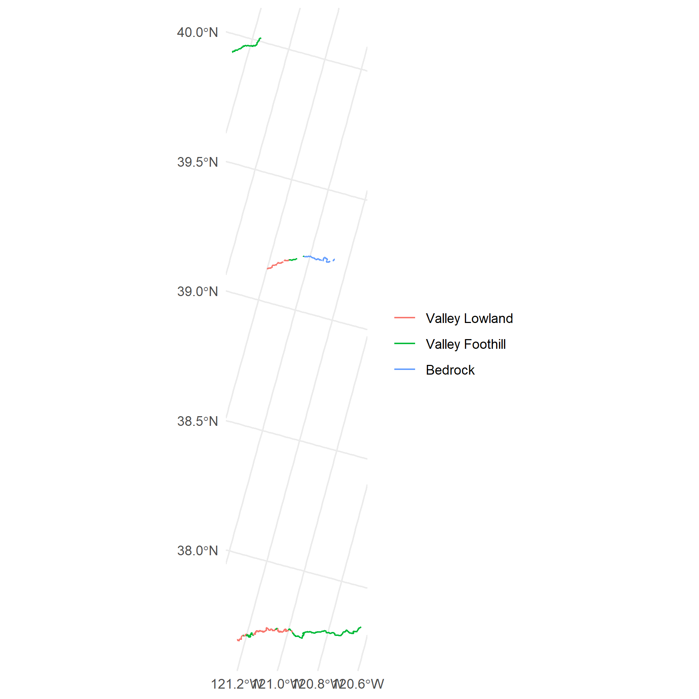<!-- -->

### Exploration and PCA

``` r
df <- flowline_attributes |>
  select(
         # predictors of flow (as would be found in a regional regression)
         slope, da_area_sq_km, da_elev_mean, da_ppt_mean_mm, 
         # baseflow and peakflow statistics
         nf_bfl_dry_cfs, nf_bfl_wet_cfs, erom_q_ma_cfs, peak_q2_cfs, peak_q5_cfs, peak_q10_cfs,
         # flow and channel characteristics, hydrologically predicted
         bf_depth_m, bf_w_d_ratio, erom_v_ma_fps,
         # misc characteristics of the catchment
         da_avg_slope, da_k_erodibility, mean_ndvi,
         # misc characteristics of the locality
         loc_bfi, loc_pct_clay, loc_pct_sand, loc_permeability, loc_bedrock_depth, loc_ppt_mean_mm,
         # channel confinement characteristics
         mtpi30_min, vb_width_transect, vb_bf_w_ratio, 
         # channel sinuosity
         sinuosity,
         # aquatic
         # bio_aq_rank_sw, species, species_fish
         ) |> 
  na.omit() |> 
  scale() 

df |> cor() |> corrr::rplot() + theme(axis.text.x = element_text(angle = 90, vjust = 0.5, hjust=1))
```

<!-- -->

``` r
# uniqueness: 
# df |> cor() |> abs() |> rowMeans() |> rank() 
pca <- princomp(df) 
#summary(pca)

factoextra::fviz_eig(pca, addlabels = TRUE)
```

<!-- -->

``` r
factoextra::fviz_cos2(pca, choice = "var", axes = 1:2)
```

<!-- -->

``` r
factoextra::fviz_pca_var(pca, axes=c(1,2), col.var = "cos2", repel = TRUE)
```

<!-- -->

``` r
factoextra::fviz_pca_var(pca, axes=c(1,3), col.var = "cos2", repel = TRUE)
```

<!-- -->

``` r
factoextra::fviz_pca_var(pca, axes=c(2,3), col.var = "cos2", repel = TRUE)
```

<!-- -->

``` r
# flowlines |> GGally::ggpairs()
```

## Training Data Setup

``` r
# pick variable to use for normalization
# norm_var <- sym("erom_q_ma_cfs")
#norm_var <- sym("da_area_sq_km")
norm_var <- sym("da_scalar")

td <- train_data |>
  mutate(flow_norm_cfs = flow_cfs / !!norm_var) |> # flow as a percent of mean annual flow
  mutate(wua_per_lf = area_wua_ft2 / (reach_length_km*3280.84),
         #log_wua_per_lf = log(wua_per_lf), # transect-wise habitat area per linear foot
         ihs_wua_per_lf = asinh(wua_per_lf), # inverse hyperbolic sine as alternative to log that can handle zeros
         wua_per_lf_norm = wua_per_lf / !!norm_var,
         #log_wua_per_lf_norm = log(wua_per_lf_norm), # transect-wise habitat area per linear foot
         ihs_wua_per_lf_norm = asinh(wua_per_lf_norm), # transect-wise habitat area per linear foot
         tot_area_per_lf = area_tot_ft2 / (reach_length_km*3280.84),
         #log_tot_area_per_lf = log(tot_area_per_lf),
         ihs_tot_area_per_lf = asinh(tot_area_per_lf)
         ) |> 
  transmute(dataset, comid, 
         # suitable habitat area normalized by reach length
         hsi_frac, wua_per_lf, ihs_wua_per_lf, wua_per_lf_norm, ihs_wua_per_lf_norm, tot_area_per_lf, ihs_tot_area_per_lf,
         # flow cfs normalized by mean annual flow
         flow_cfs, flow_norm_cfs,
         # predictors of flow (as would be found in a regional regression)
         slope, da_area_sq_km, da_elev_mean, da_ppt_mean_mm, 
         # baseflow and peakflow statistics
         nf_bfl_dry_cfs, nf_bfl_wet_cfs, erom_q_ma_cfs, peak_q2_cfs, peak_q5_cfs, peak_q10_cfs,
         # flow and channel characteristics, hydrologically predicted
         bf_depth_m, bf_w_d_ratio, erom_v_ma_fps,
         # misc characteristics of the catchment
         da_avg_slope, da_k_erodibility, mean_ndvi,
         # misc characteristics of the locality
         loc_bfi, loc_pct_clay, loc_pct_sand, loc_permeability, loc_bedrock_depth, loc_ppt_mean_mm,
         # channel confinement characteristics
         mtpi30_min, vb_width_transect, vb_bf_w_ratio, frac_leveed_longitudinal,
         # channel sinuosity
         sinuosity,
         # aquatic
         # bio_aq_rank_sw, species, species_fish,
         # fixed effects
         hqt_gradient_class=droplevels(hqt_gradient_class), hyd_cls=droplevels(hyd_cls),
         # scalar for normalizing
         da_scalar
         ) |> 
  mutate(nf_bfl_dry_cfs_norm = nf_bfl_dry_cfs/!!norm_var, 
         nf_bfl_wet_cfs_norm = nf_bfl_wet_cfs/!!norm_var) |>
  drop_na() |> glimpse()
```

    ## Rows: 19,496
    ## Columns: 43
    ## $ dataset                  <chr> "Lower Yuba River", "Lower Yuba River", "Lowe…
    ## $ comid                    <dbl> 8062583, 8062583, 8062583, 8062583, 8062583, …
    ## $ hsi_frac                 <dbl> 0.000000000, 0.000000000, 0.000000000, 0.0000…
    ## $ wua_per_lf               <dbl> 0.0000000, 0.0000000, 0.0000000, 0.0000000, 0…
    ## $ ihs_wua_per_lf           <dbl> 0.0000000, 0.0000000, 0.0000000, 0.0000000, 0…
    ## $ wua_per_lf_norm          <dbl> 0.000000000, 0.000000000, 0.000000000, 0.0000…
    ## $ ihs_wua_per_lf_norm      <dbl> 0.000000000, 0.000000000, 0.000000000, 0.0000…
    ## $ tot_area_per_lf          <dbl> 57.92315, 60.38506, 62.98109, 65.20195, 67.15…
    ## $ ihs_tot_area_per_lf      <dbl> 4.752339, 4.793957, 4.836045, 4.870695, 4.900…
    ## $ flow_cfs                 <dbl> 300, 400, 500, 600, 700, 800, 900, 1000, 1100…
    ## $ flow_norm_cfs            <dbl> 5.915888, 7.887851, 9.859814, 11.831776, 13.8…
    ## $ slope                    <dbl> 0.008, 0.008, 0.008, 0.008, 0.008, 0.008, 0.0…
    ## $ da_area_sq_km            <dbl> 3110.288, 3110.288, 3110.288, 3110.288, 3110.…
    ## $ da_elev_mean             <dbl> 1379.63, 1379.63, 1379.63, 1379.63, 1379.63, …
    ## $ da_ppt_mean_mm           <dbl> 1675.915, 1675.915, 1675.915, 1675.915, 1675.…
    ## $ nf_bfl_dry_cfs           <dbl> 502, 502, 502, 502, 502, 502, 502, 502, 502, …
    ## $ nf_bfl_wet_cfs           <dbl> 924, 924, 924, 924, 924, 924, 924, 924, 924, …
    ## $ erom_q_ma_cfs            <dbl> 2649.202, 2649.202, 2649.202, 2649.202, 2649.…
    ## $ peak_q2_cfs              <dbl> 31500, 31500, 31500, 31500, 31500, 31500, 315…
    ## $ peak_q5_cfs              <dbl> 73200, 73200, 73200, 73200, 73200, 73200, 732…
    ## $ peak_q10_cfs             <dbl> 110000, 110000, 110000, 110000, 110000, 11000…
    ## $ bf_depth_m               <dbl> 2.83, 2.83, 2.83, 2.83, 2.83, 2.83, 2.83, 2.8…
    ## $ bf_w_d_ratio             <dbl> 24.80565, 24.80565, 24.80565, 24.80565, 24.80…
    ## $ erom_v_ma_fps            <dbl> 2.58518, 2.58518, 2.58518, 2.58518, 2.58518, …
    ## $ da_avg_slope             <dbl> 29.4, 29.4, 29.4, 29.4, 29.4, 29.4, 29.4, 29.…
    ## $ da_k_erodibility         <dbl> 0.2423, 0.2423, 0.2423, 0.2423, 0.2423, 0.242…
    ## $ mean_ndvi                <dbl> 0.4897366, 0.4897366, 0.4897366, 0.4897366, 0…
    ## $ loc_bfi                  <dbl> 38, 38, 38, 38, 38, 38, 38, 38, 38, 38, 38, 3…
    ## $ loc_pct_clay             <dbl> 21.08, 21.08, 21.08, 21.08, 21.08, 21.08, 21.…
    ## $ loc_pct_sand             <dbl> 23.42, 23.42, 23.42, 23.42, 23.42, 23.42, 23.…
    ## $ loc_permeability         <dbl> 3.11, 3.11, 3.11, 3.11, 3.11, 3.11, 3.11, 3.1…
    ## $ loc_bedrock_depth        <dbl> 59.89, 59.89, 59.89, 59.89, 59.89, 59.89, 59.…
    ## $ loc_ppt_mean_mm          <dbl> 767.475, 767.475, 767.475, 767.475, 767.475, …
    ## $ mtpi30_min               <dbl> -33, -33, -33, -33, -33, -33, -33, -33, -33, …
    ## $ vb_width_transect        <dbl> 70.2, 70.2, 70.2, 70.2, 70.2, 70.2, 70.2, 70.…
    ## $ vb_bf_w_ratio            <dbl> 1, 1, 1, 1, 1, 1, 1, 1, 1, 1, 1, 1, 1, 1, 1, …
    ## $ frac_leveed_longitudinal <dbl> 0, 0, 0, 0, 0, 0, 0, 0, 0, 0, 0, 0, 0, 0, 0, …
    ## $ sinuosity                <dbl> 1.01, 1.01, 1.01, 1.01, 1.01, 1.01, 1.01, 1.0…
    ## $ hqt_gradient_class       <fct> Bedrock, Bedrock, Bedrock, Bedrock, Bedrock, …
    ## $ hyd_cls                  <fct> High-volume snowmelt and rain, High-volume sn…
    ## $ da_scalar                <dbl> 50.7109, 50.7109, 50.7109, 50.7109, 50.7109, …
    ## $ nf_bfl_dry_cfs_norm      <dbl> 9.899253, 9.899253, 9.899253, 9.899253, 9.899…
    ## $ nf_bfl_wet_cfs_norm      <dbl> 18.22094, 18.22094, 18.22094, 18.22094, 18.22…

``` r
td |> ggplot() +
  geom_line(aes(x = flow_cfs, y = wua_per_lf, group=comid), color="lightgray") + 
  geom_smooth(aes(x = flow_cfs, y = wua_per_lf, color=hqt_gradient_class), se=F, method="gam") + 
  scale_x_log10(labels=scales::label_comma()) + scale_y_log10(labels=scales::label_comma()) +
  ggtitle("Summary of Training Data") + ylab("WUA (ft per linear ft)") + xlab("Flow (cfs)") + 
  facet_wrap(~dataset, ncol=1) + theme(legend.position = "top")
```

    ## Warning: Transformation introduced infinite values in continuous y-axis
    ## Transformation introduced infinite values in continuous y-axis

    ## `geom_smooth()` using formula = 'y ~ s(x, bs = "cs")'

    ## Warning: Removed 875 rows containing non-finite values (`stat_smooth()`).

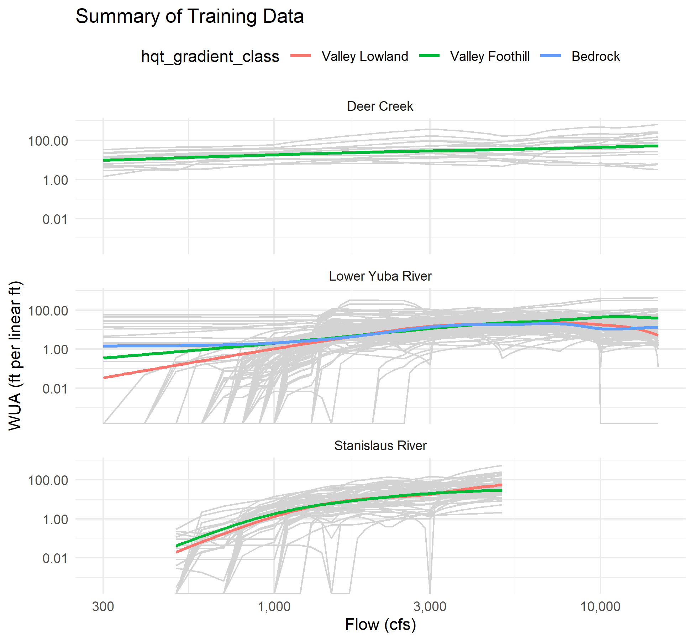<!-- -->

Calculate the ranges of the predictor variables

``` r
# td |> 
#   group_by(dataset) |>
#   select_if(is.numeric) |>
#   pivot_longer(cols = hsi_frac:last_col()) |>
#   group_by(dataset, name) |>
#   summarize(min = min(value), max=max(value))

domain <- td |> 
  select_if(is.numeric) |>
  pivot_longer(cols = hsi_frac:last_col()) |>
  group_by(name) |>
  summarize(min=min(value), max=max(value)) |>
  mutate(value = map2(min, max, function(x, y) list(min=x, max=y))) |>
  select(name, value) |> deframe()

within_domain <- function(x, name) {
  if (name %in% names(domain)) {
    res <- x >= domain[[name]][["min"]] & x <= domain[[name]][["max"]]
    message(paste(name, "matches", sum(res), "of", length(x), "rows"))
    return(res)
  }
  else {
    return(TRUE)
  }
}

filter_within_domain <- function(data, .cols = everything()) {
  out <- data |>
    filter((if_all({{.cols}}, function(x) within_domain(x, cur_column()))))
  message(paste("all conditions matched by", nrow(out), "of", nrow(data), "rows"))
  return(out)
}

# example usage
# pd |> nrow()
# pd |> filter_within_domain(c(flow_cfs, da_area_sq_km, da_elev_mean)) |> nrow()
```

Split into training and testing datasets

``` r
set.seed(47)
td_split <- group_initial_split(td |> mutate(strata=paste(hyd_cls, dataset)), strata=strata, group=comid)

# select some example reaches to use for validation
test_comids <- testing(td_split) |> group_by(dataset, hyd_cls, comid) |> summarize() |> group_by(dataset, hyd_cls) |> filter(row_number()<=6) |> pull(comid)
```

    ## `summarise()` has grouped output by 'dataset', 'hyd_cls'. You can override
    ## using the `.groups` argument.

## Model Training

### Scale Dependent Model: WUA-per-linear-ft versus flow

Scale-dependent model version predicts the WUA per linear foot, using
absolute flow values as well as watershed scale parameters.

Straightforward but highly sensitive to the ranges of flow data
available in training datasets.

``` r
sd_rec <- recipe(data=training(td_split), 
      formula = ihs_wua_per_lf ~ 
        # flow (cfs)
        flow_cfs + 
        # predictors of flow (catchment area, elevation, and MAP) -- attributes for gradient and upstream drainage area are interrelated
        slope + da_area_sq_km + da_elev_mean + da_ppt_mean_mm +
        # baseflow/peak flow statistics
        # nf_bfl_dry_cfs + nf_bfl_wet_cfs + erom_q_ma_cfs + #log(peak_q2_cfs)  + log(peak_q5_cfs) + log(peak_q10_cfs) +
        # flow and channel characteristics, hydrologically predicted
        #erom_v_ma_fps + 
        bf_depth_m + bf_w_d_ratio + 
        # misc characteristics of the catchment
        da_k_erodibility + da_avg_slope + mean_ndvi +
        # misc characteristics of the locality
        loc_bfi + loc_pct_clay + loc_pct_sand + loc_permeability + loc_bedrock_depth + loc_ppt_mean_mm +
        # channel confinement characteristics
        mtpi30_min + vb_bf_w_ratio + frac_leveed_longitudinal + vb_width_transect +
        # channel sinuosity
        sinuosity #+ 
        # aquatic
        # bio_aq_rank_sw + species + species_fish + 
        # fixed effects
        # hqt_gradient_class + hyd_cls
        ) |>
 #step_log(all_numeric_predictors(), -mtpi30_min, -mean_ndvi, -vb_bf_w_ratio, -frac_leveed_longitudinal) |>
  step_mutate_at(all_numeric_predictors(), fn = asinh) |>
  step_interact(terms = ~ slope:da_area_sq_km) |>
  #step_dummy(hqt_gradient_class) |>
  #step_dummy(hyd_cls) |>
  step_interact(terms = ~flow_cfs:all_predictors()) |>
  step_naomit(all_predictors()) |>
  step_zv(all_predictors()) |>
  step_normalize(all_numeric_predictors())
```

``` r
lm_spec <- linear_reg() 

lm_sd <- workflow() |>
  add_recipe(sd_rec) |>
  add_model(lm_spec) |>
  fit(data=training(td_split))

lm_sd |> glance()
```

    ## # A tibble: 1 × 12
    ##   r.squared adj.r.squared sigma statistic p.value    df  logLik    AIC    BIC
    ##       <dbl>         <dbl> <dbl>     <dbl>   <dbl> <dbl>   <dbl>  <dbl>  <dbl>
    ## 1     0.425         0.423  1.04      271.       0    43 -23165. 46419. 46764.
    ## # ℹ 3 more variables: deviance <dbl>, df.residual <int>, nobs <int>

``` r
lm_sd |> tidy()
```

    ## # A tibble: 44 × 5
    ##    term             estimate std.error statistic  p.value
    ##    <chr>               <dbl>     <dbl>     <dbl>    <dbl>
    ##  1 (Intercept)        3.31     0.00830   398.    0       
    ##  2 flow_cfs          35.3      3.40       10.4   3.96e-25
    ##  3 slope              4.95     2.50        1.98  4.73e- 2
    ##  4 da_area_sq_km     -7.29     2.84       -2.56  1.03e- 2
    ##  5 da_elev_mean      -4.47     1.87       -2.39  1.70e- 2
    ##  6 da_ppt_mean_mm     2.20     0.728       3.02  2.52e- 3
    ##  7 bf_depth_m         8.50     2.14        3.98  7.04e- 5
    ##  8 bf_w_d_ratio       0.600    0.921       0.651 5.15e- 1
    ##  9 da_k_erodibility   0.0655   0.337       0.194 8.46e- 1
    ## 10 da_avg_slope       2.55     1.64        1.55  1.21e- 1
    ## # ℹ 34 more rows

``` r
lm_sd_res <- testing(td_split) |>
  transmute(comid, flow_cfs,
            # actuals
            ihs_wua_per_lf, 
            wua_per_lf = sinh(ihs_wua_per_lf),
            # predicted
            ihs_wua_per_lf_pred = predict(lm_sd, testing(td_split))[[".pred"]],
            wua_per_lf_pred=sinh(ihs_wua_per_lf_pred))

lm_sd_res |>
  arrange(comid, flow_cfs) |>
  ggplot() + geom_path(aes(x=wua_per_lf, y=wua_per_lf_pred, color=flow_cfs, group=comid), linewidth=2) + 
  scale_y_log10() + scale_x_log10() +  coord_fixed() + geom_abline() + scale_color_viridis_c(name="Flow (cfs)") + 
  ggtitle("Scale-dependent model, linear regression") +
  xlab("WUA per LF (Actual)") + ylab("WUA per LF (Predicted)")
```

    ## Warning in self$trans$transform(x): NaNs produced

    ## Warning: Transformation introduced infinite values in continuous y-axis

    ## Warning: Transformation introduced infinite values in continuous x-axis

    ## Warning: Removed 14 rows containing missing values (`geom_path()`).

<!-- -->

``` r
lm_sd_res |>
  filter(flow_cfs %in% c(300,500,1000,1500,3000,5000,10000,15000)) |>
  ggplot() + geom_point(aes(x=wua_per_lf, y=wua_per_lf_pred, color=flow_cfs)) + 
  facet_wrap(~flow_cfs, ncol = 4) +
  scale_y_log10() + scale_x_log10() +  coord_fixed() + geom_abline() + scale_color_viridis_c(name="Flow (cfs)") + 
  ggtitle("Scale-dependent model, linear regression") +
  xlab("WUA per LF (Actual)") + ylab("WUA per LF (Predicted)")
```

    ## Warning in self$trans$transform(x): NaNs produced

    ## Warning: Transformation introduced infinite values in continuous y-axis

    ## Warning: Transformation introduced infinite values in continuous x-axis

    ## Warning: Removed 10 rows containing missing values (`geom_point()`).

<!-- -->

``` r
lm_sd_res |> filter(comid %in% test_comids) |>
  ggplot(aes(x=flow_cfs, group=1)) + facet_wrap(~comid, scale="free_y") + 
  geom_line(aes(y=wua_per_lf_pred, color="predicted", group=1)) + geom_line(aes(y=wua_per_lf, color="actual", group=1)) + 
  scale_y_continuous(trans = ihs, limits = c(0, NA)) + theme(panel.grid.minor = element_blank()) +
  xlab("Flow (cfs)") + ylab("Suitable Habitat Area per LF Channel (ft)") 
```

<!-- -->

``` r
lm_sd |>
  tidy() |>
  mutate(ixn_class = if_else(str_detect(term, "flow_cfs_x_"), "term_flow_cfs_x_", "term") |> 
                     factor(levels = c("term", "term_flow_cfs_x_"), labels = c("Constant Effect", "Interaction with Flow (cfs)")),
         term_root = str_replace(term, "flow_cfs_x_", ""),
         coeff_dir = if_else(estimate>0, "Positive", "Negative"),
         ci_lower = estimate - qt(0.975, df = glance(lm_sd)$df) * std.error,
         ci_upper = estimate + qt(0.975, df = glance(lm_sd)$df) * std.error,
         estimate_abs = abs(estimate),
         ci_lower_abs = ci_lower * if_else(coeff_dir=="Negative",-1,1),
         ci_upper_abs = ci_upper * if_else(coeff_dir=="Negative",-1,1),
         is_significant = sign(ci_lower)==sign(ci_upper)
         ) |>
  filter(term!="flow_cfs" & term!="(Intercept)") |>
  ggplot(aes(y = term_root, color = coeff_dir)) +
  facet_wrap(~ixn_class, ncol = 2, scales = "free_x") + 
  geom_errorbarh(aes(xmin = ci_lower_abs, xmax=ci_upper_abs)) + #pmax(0,ci_lower_abs), xmax = pmax(0,ci_upper_abs))) +
  geom_point(aes(x = estimate_abs, fill = is_significant), shape=21) +
  theme(legend.position="top",
        panel.grid.minor = element_blank(),
        panel.border = element_rect(fill = NA, color = "black"), 
        legend.direction = "vertical") +
  scale_y_discrete(limits=rev) + 
  scale_fill_manual(name = "Significant (95%)", values = c("FALSE" = "white", "TRUE" = "black")) +
  scale_color_manual(name = "Direction of Effect", values = c("Negative" = "goldenrod", "Positive" = "darkcyan")) +
  xlab("Coefficient Magnitude") + ylab("")
```

<!-- -->

``` r
rfr_spec <- rand_forest(mode = "regression", trees = 2^8)

rfr_sd <- workflow() |>
  add_recipe(sd_rec) |>
  add_model(rfr_spec) |>
  fit(data=training(td_split))

rfr_sd$fit$fit |> print()
```

    ## parsnip model object
    ## 
    ## Ranger result
    ## 
    ## Call:
    ##  ranger::ranger(x = maybe_data_frame(x), y = y, num.trees = ~2^8,      num.threads = 1, verbose = FALSE, seed = sample.int(10^5,          1)) 
    ## 
    ## Type:                             Regression 
    ## Number of trees:                  256 
    ## Sample size:                      15850 
    ## Number of independent variables:  43 
    ## Mtry:                             6 
    ## Target node size:                 5 
    ## Variable importance mode:         none 
    ## Splitrule:                        variance 
    ## OOB prediction error (MSE):       0.01158338 
    ## R squared (OOB):                  0.9938813

``` r
rfr_sd_res <- testing(td_split) |>
  transmute(comid, flow_cfs,
            # actuals
            ihs_wua_per_lf, 
            wua_per_lf = sinh(ihs_wua_per_lf),
            # predicted
            ihs_wua_per_lf_pred = predict(rfr_sd, testing(td_split))[[".pred"]],
            wua_per_lf_pred=sinh(ihs_wua_per_lf_pred))

rfr_sd_res |>
  arrange(comid, flow_cfs) |>
  ggplot() + geom_path(aes(x=wua_per_lf, y=wua_per_lf_pred, color=flow_cfs, group=comid), linewidth=2) + 
  scale_y_log10() + scale_x_log10() +  coord_fixed() + geom_abline() + scale_color_viridis_c(name="Flow (cfs)")   + 
  ggtitle("Scale-dependent model, random forest regression") +
  xlab("WUA per LF (Actual)") + ylab("WUA per LF (Predicted)")
```

    ## Warning: Transformation introduced infinite values in continuous y-axis

    ## Warning: Transformation introduced infinite values in continuous x-axis

<!-- -->

``` r
rfr_sd_res |>
  filter(flow_cfs %in% c(300,500,1000,1500,3000,5000,10000,15000)) |>
  ggplot() + geom_point(aes(x=wua_per_lf, y=wua_per_lf_pred, color=flow_cfs)) + 
  facet_wrap(~flow_cfs, ncol = 4) +
  scale_y_log10() + scale_x_log10() +  coord_fixed() + geom_abline() + scale_color_viridis_c(name="Flow (cfs)") + 
  ggtitle("Scale-dependent model, random forest regression") +
  xlab("WUA per LF (Actual)") + ylab("WUA per LF (Predicted)")
```

    ## Warning: Transformation introduced infinite values in continuous y-axis
    ## Transformation introduced infinite values in continuous x-axis

<!-- -->

``` r
rfr_sd_res |> filter(comid %in% test_comids) |>
  ggplot(aes(x=flow_cfs, group=1)) + facet_wrap(~comid, scale="free_y") + 
  geom_line(aes(y=wua_per_lf_pred, color="predicted", group=1)) + geom_line(aes(y=wua_per_lf, color="actual", group=1)) + 
  scale_y_continuous(trans = ihs, limits = c(0, NA)) + theme(panel.grid.minor = element_blank()) +
  xlab("Flow (cfs)") + ylab("Suitable Habitat Area per LF Channel (ft)") 
```

<!-- -->

### Scale Dependent Model 2: TOTAL Inundated Area per linear ft versus flow:

To generate the inundation area estimates that are needed to interpret
the scale-independent %HSI model outputs

``` r
sd2_rec <- recipe(data=training(td_split), 
      formula = ihs_tot_area_per_lf ~ 
        # flow (cfs)
        flow_cfs + 
        # predictors of flow (catchment area, elevation, and MAP) -- attributes for gradient and upstream drainage area are interrelated
        slope + da_area_sq_km + da_elev_mean + da_ppt_mean_mm +
        # baseflow/peak flow statistics
        #nf_bfl_dry_cfs + nf_bfl_wet_cfs + erom_q_ma_cfs + #log(peak_q2_cfs)  + log(peak_q5_cfs) + log(peak_q10_cfs) +
        # flow and channel characteristics, hydrologically predicted
        #erom_v_ma_fps + 
        bf_depth_m + bf_w_d_ratio + 
        # misc characteristics of the catchment
        da_k_erodibility + da_avg_slope + 
        # misc characteristics of the locality
        loc_bfi + loc_pct_clay + loc_pct_sand + loc_permeability + loc_bedrock_depth + loc_ppt_mean_mm +
        # channel confinement characteristics
        mtpi30_min + vb_bf_w_ratio + frac_leveed_longitudinal + vb_width_transect +
        # channel sinuosity
        sinuosity #+ 
        # fixed effects
        # hqt_gradient_class + hyd_cls
        ) |>
  #step_log(all_numeric_predictors(), -mtpi30_min, -vb_bf_w_ratio, -frac_leveed_longitudinal) |>
  step_mutate_at(all_numeric_predictors(), fn = asinh) |>
  step_interact(terms = ~ slope:da_area_sq_km) |>
  # step_dummy(hqt_gradient_class) |>
  # step_dummy(hyd_cls) |>
  #step_spline_nonnegative(flow_cfs) |>
  step_interact(terms = ~flow_cfs:all_predictors()) |>
  step_naomit(all_predictors()) |>
  step_zv(all_predictors()) |>
  step_normalize(all_numeric_predictors())
```

``` r
lm_spec <- linear_reg() 

lm_sd2 <- workflow() |>
  add_recipe(sd2_rec) |>
  add_model(lm_spec) |>
  fit(data=training(td_split))

lm_sd2 |> glance()
```

    ## # A tibble: 1 × 12
    ##   r.squared adj.r.squared sigma statistic p.value    df logLik    AIC    BIC
    ##       <dbl>         <dbl> <dbl>     <dbl>   <dbl> <dbl>  <dbl>  <dbl>  <dbl>
    ## 1     0.563         0.562 0.427      497.       0    41 -8963. 18012. 18342.
    ## # ℹ 3 more variables: deviance <dbl>, df.residual <int>, nobs <int>

``` r
lm_sd2 |> tidy()
```

    ## # A tibble: 42 × 5
    ##    term             estimate std.error statistic  p.value
    ##    <chr>               <dbl>     <dbl>     <dbl>    <dbl>
    ##  1 (Intercept)         6.23    0.00339   1839.   0       
    ##  2 flow_cfs            8.75    1.38         6.32 2.71e-10
    ##  3 slope              -7.94    1.01        -7.83 5.31e-15
    ##  4 da_area_sq_km     -12.6     1.14       -11.0  3.45e-28
    ##  5 da_elev_mean        7.46    0.764        9.76 1.99e-22
    ##  6 da_ppt_mean_mm     -0.517   0.296       -1.74 8.11e- 2
    ##  7 bf_depth_m         10.3     0.846       12.2  5.13e-34
    ##  8 bf_w_d_ratio        2.87    0.369        7.78 7.50e-15
    ##  9 da_k_erodibility   -0.220   0.137       -1.61 1.07e- 1
    ## 10 da_avg_slope       -8.74    0.669      -13.1  8.00e-39
    ## # ℹ 32 more rows

``` r
lm_sd2_res <- testing(td_split) |>
  transmute(comid, flow_cfs,
            # actuals
            ihs_tot_area_per_lf, 
            tot_area_per_lf = sinh(ihs_tot_area_per_lf),
            # predicted
            ihs_tot_area_per_lf_pred = predict(lm_sd2, testing(td_split))[[".pred"]],
            tot_area_per_lf_pred=sinh(ihs_tot_area_per_lf_pred))

lm_sd2_res |>
  arrange(comid, flow_cfs) |>
  ggplot() + geom_path(aes(x=tot_area_per_lf, y=tot_area_per_lf_pred, color=flow_cfs, group=comid), linewidth=2) + 
  scale_y_log10() + scale_x_log10() +  coord_fixed() + geom_abline() + scale_color_viridis_c(name="Flow (cfs)") + 
  ggtitle("Scale-dependent model, linear regression") +
  xlab("Total Inundated Area per LF (Actual)") + ylab("Total Inundated Area per LF (Predicted)")
```

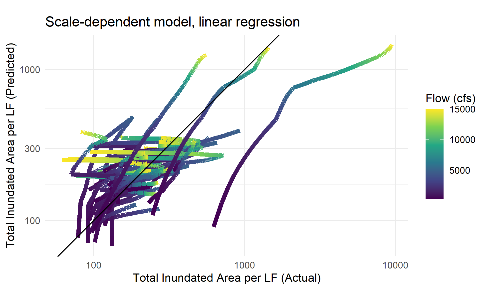<!-- -->

``` r
lm_sd2_res |>
  filter(flow_cfs %in% c(300,500,1000,1500,3000,5000,10000,15000)) |>
  ggplot() + geom_point(aes(x=tot_area_per_lf, y=tot_area_per_lf_pred, color=flow_cfs)) + 
  facet_wrap(~flow_cfs, ncol = 4) +
  scale_y_log10() + scale_x_log10() +  coord_fixed() + geom_abline() + scale_color_viridis_c(name="Flow (cfs)") + 
  ggtitle("Scale-dependent model, linear regression") +
  xlab("Total Inundated Area per LF (Actual)") + ylab("Total Inundated Area per LF (Predicted)")
```

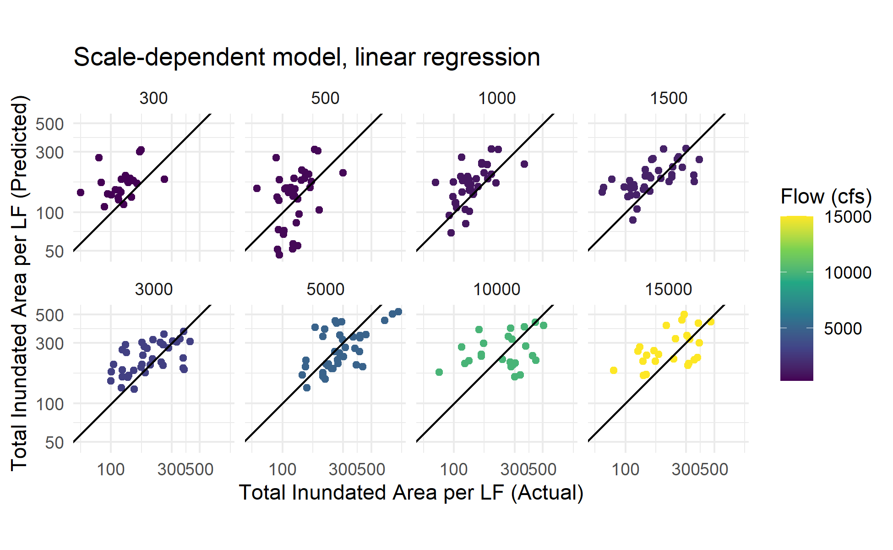<!-- -->

``` r
lm_sd2_res |> filter(comid %in% test_comids) |>
  ggplot(aes(x=flow_cfs, group=1)) + facet_wrap(~comid, scale="free_y") + 
  geom_line(aes(y=tot_area_per_lf_pred, color="predicted", group=1)) + geom_line(aes(y=tot_area_per_lf, color="actual", group=1)) + 
  scale_y_continuous(trans = ihs) + theme(panel.grid.minor = element_blank()) +
  xlab("Flow (cfs)") + ylab("Total Inundated Area per LF Channel (ft)")
```

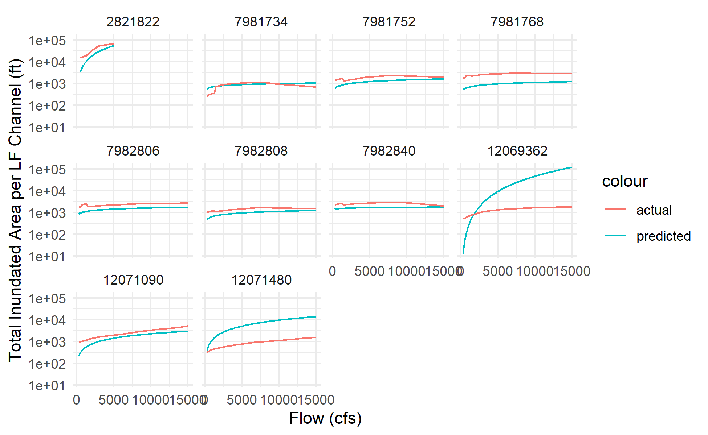<!-- -->

``` r
lm_sd2 |>
  tidy() |>
  mutate(ixn_class = if_else(str_detect(term, "flow_cfs_x_"), "term_flow_cfs_x_", "term") |> 
                     factor(levels = c("term", "term_flow_cfs_x_"), labels = c("Constant Effect", "Interaction with Flow (cfs)")),
         term_root = str_replace(term, "flow_cfs_x_", ""),
         coeff_dir = if_else(estimate>0, "Positive", "Negative"),
         ci_lower = estimate - qt(0.975, df = glance(lm_sd)$df) * std.error,
         ci_upper = estimate + qt(0.975, df = glance(lm_sd)$df) * std.error,
         estimate_abs = abs(estimate),
         ci_lower_abs = ci_lower * if_else(coeff_dir=="Negative",-1,1),
         ci_upper_abs = ci_upper * if_else(coeff_dir=="Negative",-1,1),
         is_significant = sign(ci_lower)==sign(ci_upper)
         ) |>
  filter(term!="flow_cfs" & term!="(Intercept)") |>
  ggplot(aes(y = term_root, color = coeff_dir)) +
  facet_wrap(~ixn_class, ncol = 2, scales = "free_x") + 
  geom_errorbarh(aes(xmin = ci_lower_abs, xmax=ci_upper_abs)) + #pmax(0,ci_lower_abs), xmax = pmax(0,ci_upper_abs))) +
  geom_point(aes(x = estimate_abs, fill = is_significant), shape=21) +
  theme(legend.position="top",
        panel.grid.minor = element_blank(),
        panel.border = element_rect(fill = NA, color = "black"), 
        legend.direction = "vertical") +
  scale_y_discrete(limits=rev) + 
  scale_fill_manual(name = "Significant (95%)", values = c("FALSE" = "white", "TRUE" = "black")) +
  scale_color_manual(name = "Direction of Effect", values = c("Negative" = "goldenrod", "Positive" = "darkcyan")) +
  xlab("Coefficient Magnitude") + ylab("")
```

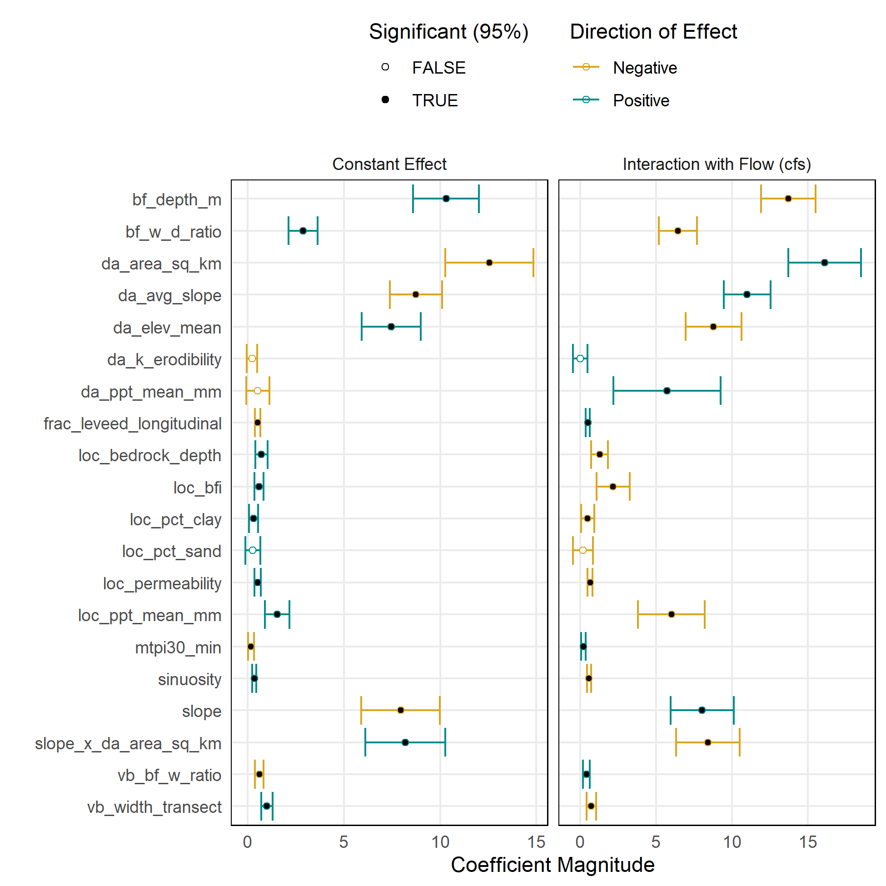<!-- -->

``` r
rfr_spec <- rand_forest(mode = "regression", trees = 2^8)

rfr_sd2 <- workflow() |>
  add_recipe(sd2_rec) |>
  add_model(rfr_spec) |>
  fit(data=training(td_split))

rfr_sd2$fit$fit |> print()
```

    ## parsnip model object
    ## 
    ## Ranger result
    ## 
    ## Call:
    ##  ranger::ranger(x = maybe_data_frame(x), y = y, num.trees = ~2^8,      num.threads = 1, verbose = FALSE, seed = sample.int(10^5,          1)) 
    ## 
    ## Type:                             Regression 
    ## Number of trees:                  256 
    ## Sample size:                      15850 
    ## Number of independent variables:  41 
    ## Mtry:                             6 
    ## Target node size:                 5 
    ## Variable importance mode:         none 
    ## Splitrule:                        variance 
    ## OOB prediction error (MSE):       0.0005959296 
    ## R squared (OOB):                  0.9985655

``` r
rfr_sd2_res <- testing(td_split) |>
  transmute(comid, flow_cfs,
            # actuals
            ihs_tot_area_per_lf, 
            tot_area_per_lf = sinh(ihs_tot_area_per_lf),
            # predicted
            ihs_tot_area_per_lf_pred = predict(rfr_sd2, testing(td_split))[[".pred"]],
            tot_area_per_lf_pred=sinh(ihs_tot_area_per_lf_pred))

rfr_sd2_res |>
  arrange(comid, flow_cfs) |>
  ggplot() + geom_path(aes(x=tot_area_per_lf, y=tot_area_per_lf_pred, color=flow_cfs, group=comid), linewidth=2) + 
  scale_y_log10() + scale_x_log10() +  coord_fixed() + geom_abline() + scale_color_viridis_c(name="Flow (cfs)")   + 
  ggtitle("Scale-dependent model, random forest regression") +
  xlab("Total Inundated Area per LF (Actual)") + ylab("Total Inundated Area per LF (Predicted)")
```

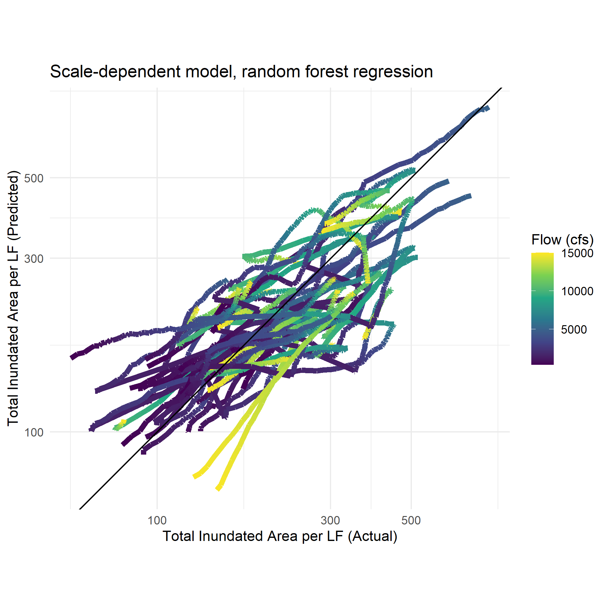<!-- -->

``` r
rfr_sd2_res |>
  filter(flow_cfs %in% c(300,500,1000,1500,3000,5000,10000,15000)) |>
  ggplot() + geom_point(aes(x=tot_area_per_lf, y=tot_area_per_lf_pred, color=flow_cfs)) + 
  facet_wrap(~flow_cfs, ncol = 4) +
  scale_y_log10() + scale_x_log10() +  coord_fixed() + geom_abline() + scale_color_viridis_c(name="Flow (cfs)") + 
  ggtitle("Scale-dependent model, random forest regression") +
  xlab("Total Inundated Area per LF (Actual)") + ylab("Total Inundated Area per LF (Predicted)")
```

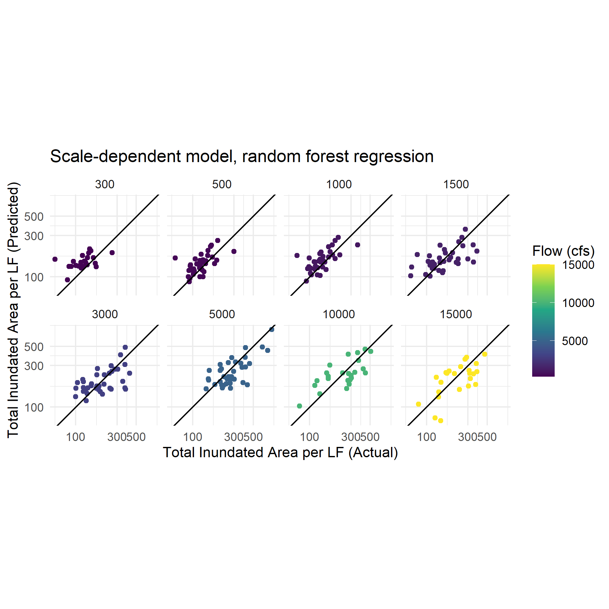<!-- -->

``` r
rfr_sd2_res |> filter(comid %in% test_comids) |>
  ggplot(aes(x=flow_cfs, group=1)) + facet_wrap(~comid, scale="free_y") + 
  geom_line(aes(y=tot_area_per_lf_pred, color="predicted", group=1)) + geom_line(aes(y=tot_area_per_lf, color="actual", group=1)) + 
  scale_y_continuous(trans = ihs) + theme(panel.grid.minor = element_blank()) +
  xlab("Flow (cfs)") + ylab("Total Inundated Area per LF Channel (ft)") 
```

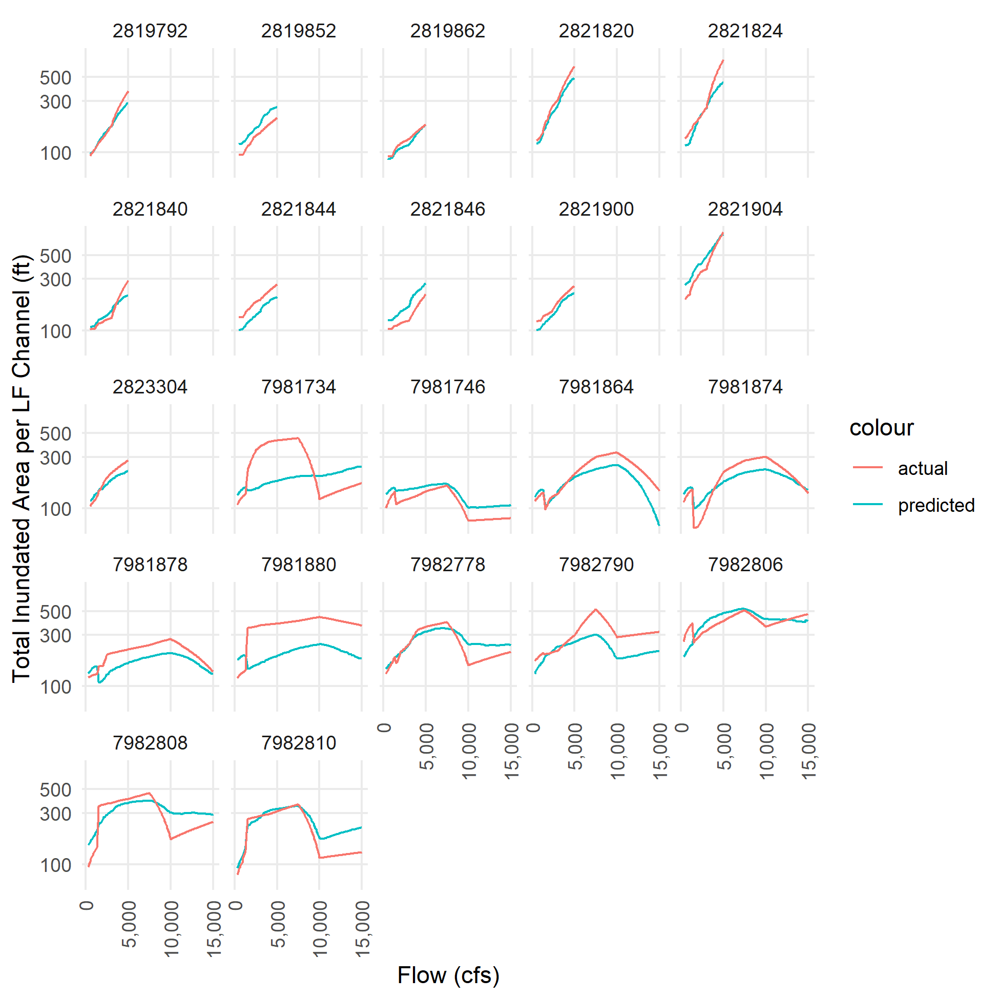<!-- -->

### Scale Independent Model: %HSI versus flow (normalized by MAF)

Scale-independent model version predicts the percent suitable habitat
area using normalized flow, and without using any direct correlates of
watershed size.

To actually apply these results requires an estimate of total inundated
area, which can be then multiplied with the predicted %HSI.

Technically this should not use linear regression as it is a proportion
between zero and one, it should more properly be using beta regression
via the betareg package.

``` r
si_rec <- recipe(data=training(td_split), 
      formula=hsi_frac ~ 
        # flow as percent of mean annual flow
        flow_norm_cfs + 
        # channel characteristics: gradient and sinuosity
        slope + sinuosity + 
        # flow and channel characteristics, hydrologically predicted
        # erom_v_ma_fps + 
        bf_depth_m + bf_w_d_ratio + 
        # misc characteristics of the catchment
        da_k_erodibility + da_avg_slope + mean_ndvi +
        # misc characteristics of the locality
        loc_bfi + loc_pct_clay + loc_pct_sand + loc_permeability + loc_bedrock_depth + loc_ppt_mean_mm +
        # channel confinement
        mtpi30_min + vb_bf_w_ratio + frac_leveed_longitudinal #+
        # baseflow as percent of mean annual flow
        # nf_bfl_dry_cfs_norm + nf_bfl_wet_cfs_norm #+ 
        # aquatic
        # bio_aq_rank_sw + species + species_fish + 
        # fixed effects
        #hqt_gradient_class + hyd_cls
        ) |>
  #step_log(all_numeric_predictors(), -mtpi30_min, -mean_ndvi, -bio_aq_rank_sw, -vb_bf_w_ratio, -frac_leveed_longitudinal) |>
  step_mutate_at(all_numeric_predictors(), fn = asinh) |>
  #step_dummy(hqt_gradient_class) |>
  #step_dummy(hyd_cls) |>
  step_interact(terms = ~ flow_norm_cfs:all_predictors()) |>
  step_naomit(all_predictors()) |>
  step_zv(all_predictors()) |>
  step_normalize(all_numeric_predictors()) 
```

``` r
lm_spec <- linear_reg() 

lm_si <- workflow() |>
  add_recipe(si_rec) |>
  add_model(lm_spec) |>
  fit(data=training(td_split))

lm_si |> glance()
```

    ## # A tibble: 1 × 12
    ##   r.squared adj.r.squared  sigma statistic p.value    df logLik     AIC     BIC
    ##       <dbl>         <dbl>  <dbl>     <dbl>   <dbl> <dbl>  <dbl>   <dbl>   <dbl>
    ## 1     0.216         0.215 0.0637      132.       0    33 21159. -42247. -41979.
    ## # ℹ 3 more variables: deviance <dbl>, df.residual <int>, nobs <int>

``` r
lm_si |> tidy()
```

    ## # A tibble: 34 × 5
    ##    term             estimate std.error statistic  p.value
    ##    <chr>               <dbl>     <dbl>     <dbl>    <dbl>
    ##  1 (Intercept)       0.0803   0.000506   158.    0       
    ##  2 flow_norm_cfs     3.27     0.230       14.2   1.38e-45
    ##  3 slope             0.00369  0.00326      1.13  2.58e- 1
    ##  4 sinuosity        -0.0262   0.00284     -9.21  3.58e-20
    ##  5 bf_depth_m        0.0147   0.0119       1.24  2.15e- 1
    ##  6 bf_w_d_ratio     -0.0158   0.00582     -2.72  6.49e- 3
    ##  7 da_k_erodibility  0.0394   0.00739      5.32  1.02e- 7
    ##  8 da_avg_slope      0.0691   0.0155       4.46  8.11e- 6
    ##  9 mean_ndvi         0.0350   0.00504      6.93  4.39e-12
    ## 10 loc_bfi           0.00452  0.00516      0.876 3.81e- 1
    ## # ℹ 24 more rows

``` r
lm_si_res <- testing(td_split) |>
  transmute(comid, flow_cfs, flow_norm_cfs, erom_q_ma_cfs, hsi_frac,
            hsi_frac_pred = predict(lm_si, testing(td_split))[[".pred"]]) |>
  # crude constraint to between 0 and 1; better to use betareg
  mutate(hsi_frac_pred=pmax(pmin(hsi_frac_pred,1),0))

lm_si_res |>
  arrange(comid, flow_norm_cfs) |>
  ggplot() + geom_path(aes(x=hsi_frac, y=hsi_frac_pred, color=flow_norm_cfs, group=comid), linewidth=2) + 
  coord_fixed() + geom_abline() + scale_color_viridis_c(trans="log10", name="Frac. of MAF") + 
  ggtitle("Scale-independent model, linear regression") +
  xlab("HSI (Frac. of Channel Area) (Actual)") + ylab("HSI (Frac. of Channel Area) (Predicted)")
```

<!-- -->

``` r
lm_si_res |> 
  filter(flow_cfs %in% c(300,500,1000,1500,3000,5000,10000,15000)) |>
  ggplot() + geom_point(aes(x=hsi_frac, y=hsi_frac_pred, color=flow_cfs)) + 
  facet_wrap(~flow_cfs, ncol = 4) +
  coord_fixed() + geom_abline() + scale_color_viridis_c(name = "Flow (cfs)") + 
  ggtitle("Scale-independent model, linear regression") +
  xlab("HSI (Frac. of Channel Area) (Actual)") + ylab("HSI (Frac. of Channel Area) (Predicted)")
```

<!-- -->

``` r
lm_si_res |> filter(comid %in% test_comids) |>
  ggplot(aes(x=flow_cfs, group=1)) + facet_wrap(~comid, scale="free_y") + 
  geom_line(aes(y=hsi_frac_pred*100, color="predicted", group=1)) + geom_line(aes(y=hsi_frac*100, color="actual", group=1)) + 
  xlab("Flow (cfs)") + ylab("Suitable Habitat Area (% of Total Area)")
```

<!-- -->

``` r
lm_si |>
  tidy() |>
  mutate(ixn_class = if_else(str_detect(term, "flow_norm_cfs_x_"), "term_flow_norm_cfs_x_", "term") |> 
                     factor(levels = c("term", "term_flow_norm_cfs_x_"), labels = c("Constant Effect", "Interaction with Normalized Flow")),
         term_root = str_replace(term, "flow_norm_cfs_x_", ""),
         coeff_dir = if_else(estimate>0, "Positive", "Negative"),
         ci_lower = estimate - qt(0.975, df = glance(lm_si)$df) * std.error,
         ci_upper = estimate + qt(0.975, df = glance(lm_si)$df) * std.error,
         estimate_abs = abs(estimate),
         ci_lower_abs = ci_lower * if_else(coeff_dir=="Negative",-1,1),
         ci_upper_abs = ci_upper * if_else(coeff_dir=="Negative",-1,1),
         is_significant = sign(ci_lower)==sign(ci_upper)
         ) |>
  filter(term!="flow_norm_cfs" & term!="(Intercept)") |>
  ggplot(aes(y = term_root, color = coeff_dir)) +
  facet_wrap(~ixn_class, ncol = 2, scales = "free_x") + 
  geom_errorbarh(aes(xmin = ci_lower_abs, xmax=ci_upper_abs)) + #pmax(0,ci_lower_abs), xmax = pmax(0,ci_upper_abs))) +
  geom_point(aes(x = estimate_abs, fill = is_significant), shape=21) +
  theme(legend.position="top",
        panel.grid.minor = element_blank(),
        panel.border = element_rect(fill = NA, color = "black"), 
        legend.direction = "vertical") +
  scale_y_discrete(limits=rev) + 
  scale_fill_manual(name = "Significant (95%)", values = c("FALSE" = "white", "TRUE" = "black")) +
  scale_color_manual(name = "Direction of Effect", values = c("Negative" = "goldenrod", "Positive" = "darkcyan")) +
  xlab("Coefficient Magnitude") + ylab("")
```

<!-- -->

``` r
# set up cross validation
folds <- vfold_cv(training(td_split), v = 10, strata = dataset)
val_metrics <- metric_set(rmse, rsq, ccc)

# tuned random forest: how many trees to use?
rfr_spec <- rand_forest(mode = "regression", trees = tune())
rfr_grid <- tibble(trees = 2^seq(0, 12, 1))

rfr_si_tune <- 
  workflow() |>
  add_recipe(si_rec) |>
  add_model(rfr_spec) |>
  tune_grid(resamples = folds,
            grid = rfr_grid,
            metrics = val_metrics)
rfr_si_tune |>
  collect_metrics() |>
  ggplot(aes(x = trees, y = mean, color = .metric)) +
  geom_errorbar(aes(ymin = mean - std_err,
                    ymax = mean + std_err),
                width = 0.05) +
  geom_line() +
  facet_wrap(. ~ .metric, ncol = 1, scales="free") +
  theme(legend.position = "none") + scale_x_log10()
```

``` r
rfr_spec <- rand_forest(mode = "regression", trees = 2^8)

rfr_si <- workflow() |>
  add_recipe(si_rec) |>
  add_model(rfr_spec) |>
  fit(data=training(td_split))

rfr_si$fit$fit |> print()
```

    ## parsnip model object
    ## 
    ## Ranger result
    ## 
    ## Call:
    ##  ranger::ranger(x = maybe_data_frame(x), y = y, num.trees = ~2^8,      num.threads = 1, verbose = FALSE, seed = sample.int(10^5,          1)) 
    ## 
    ## Type:                             Regression 
    ## Number of trees:                  256 
    ## Sample size:                      15850 
    ## Number of independent variables:  33 
    ## Mtry:                             5 
    ## Target node size:                 5 
    ## Variable importance mode:         none 
    ## Splitrule:                        variance 
    ## OOB prediction error (MSE):       3.767658e-05 
    ## R squared (OOB):                  0.9927187

``` r
rfr_si_res <- testing(td_split) |>
  transmute(comid, flow_cfs, flow_norm_cfs, erom_q_ma_cfs, hsi_frac,
            hsi_frac_pred = predict(rfr_si, testing(td_split))[[".pred"]]) |>
  # crude constraint to between 0 and 1; better to use betareg
  mutate(hsi_frac_pred=pmax(pmin(hsi_frac_pred,1),0))

rfr_si_res |>
  arrange(comid, flow_norm_cfs) |>
  ggplot() + geom_path(aes(x=hsi_frac, y=hsi_frac_pred, color=flow_norm_cfs, group=comid), linewidth=2) + 
  coord_fixed() + geom_abline() + scale_color_viridis_c(trans="log10", name="Frac. of MAF") + 
  ggtitle("Scale-independent model, random forest regression") +
  xlab("HSI (Frac. of Channel Area) (Actual)") + ylab("HSI (Frac. of Channel Area) (Predicted)")
```

<!-- -->

``` r
rfr_si_res |> 
  filter(flow_cfs %in% c(300,500,1000,1500,3000,5000,10000,15000)) |>
  ggplot() + geom_point(aes(x=hsi_frac, y=hsi_frac_pred, color=flow_cfs)) + 
  facet_wrap(~flow_cfs, ncol = 4) +
  coord_fixed() + geom_abline() + scale_color_viridis_c(name = "Flow (cfs)") + 
  ggtitle("Scale-independent model, random forest regression") +
  xlab("HSI (Frac. of Channel Area) (Actual)") + ylab("HSI (Frac. of Channel Area) (Predicted)")
```

<!-- -->

``` r
rfr_si_res |> filter(comid %in% test_comids) |>
  ggplot(aes(x=flow_cfs, group=1)) + facet_wrap(~comid, scale="free_y") + 
  geom_line(aes(y=hsi_frac_pred*100, color="predicted", group=1)) + geom_line(aes(y=hsi_frac*100, color="actual", group=1)) + 
  xlab("Flow (cfs)") + ylab("Suitable Habitat Area (% of Total Area)")
```

<!-- -->

### Scale Independent Model 2: WUA-per-linear-ft (normalized by da_scalar) versus flow (normalized by da_scalar)

A potential compromise between the previous two models that scales the
results by da_scalar, then unscales them after prediction.

``` r
si2_rec <- recipe(data=training(td_split), 
      formula=ihs_wua_per_lf_norm ~ 
        # flow as percent of mean annual flow
        flow_norm_cfs + 
        # channel characteristics: gradient and sinuosity
        slope + sinuosity + 
        # flow and channel characteristics, hydrologically predicted
        #erom_v_ma_fps + 
        bf_depth_m + bf_w_d_ratio + 
        # misc characteristics of the catchment
        da_k_erodibility + da_avg_slope + mean_ndvi +
        # misc characteristics of the locality
        loc_bfi + loc_pct_clay + loc_pct_sand + loc_permeability + loc_bedrock_depth + loc_ppt_mean_mm +
        # channel confinement
        mtpi30_min + vb_bf_w_ratio + frac_leveed_longitudinal #+
        # baseflow as percent of mean annual flow
        # nf_bfl_dry_cfs_norm + nf_bfl_wet_cfs_norm #+ 
        # aquatic
        # bio_aq_rank_sw + species + species_fish + 
        # fixed effects
        # hqt_gradient_class + hyd_cls
        ) |>
  #step_log(all_numeric_predictors(), -mtpi30_min, -mean_ndvi, -bio_aq_rank_sw, -vb_bf_w_ratio, -frac_leveed_longitudinal) |>
  step_mutate_at(all_numeric_predictors(), fn = asinh) |>
  # step_dummy(hqt_gradient_class) |>
  # step_dummy(hyd_cls) |>
  step_interact(terms = ~ flow_norm_cfs:all_predictors()) |>
  step_naomit(all_predictors()) |>
  step_zv(all_predictors()) |>
  step_normalize(all_numeric_predictors())
```

``` r
lm_spec <- linear_reg() 

lm_si2 <- workflow() |>
  add_recipe(si2_rec) |>
  add_model(lm_spec) |>
  fit(data=training(td_split))

lm_si2 |> glance()
```

    ## # A tibble: 1 × 12
    ##   r.squared adj.r.squared sigma statistic p.value    df  logLik    AIC    BIC
    ##       <dbl>         <dbl> <dbl>     <dbl>   <dbl> <dbl>   <dbl>  <dbl>  <dbl>
    ## 1     0.923         0.923 0.777     5765.       0    33 -18479. 37027. 37296.
    ## # ℹ 3 more variables: deviance <dbl>, df.residual <int>, nobs <int>

``` r
lm_si2 |> tidy()
```

    ## # A tibble: 34 × 5
    ##    term             estimate std.error statistic   p.value
    ##    <chr>               <dbl>     <dbl>     <dbl>     <dbl>
    ##  1 (Intercept)         1.67    0.00617   271.    0        
    ##  2 flow_norm_cfs      71.4     2.81       25.4   6.26e-140
    ##  3 slope              -0.128   0.0397     -3.23  1.25e-  3
    ##  4 sinuosity           0.233   0.0347      6.71  1.97e- 11
    ##  5 bf_depth_m          0.113   0.144       0.783 4.33e-  1
    ##  6 bf_w_d_ratio       -0.934   0.0709    -13.2   2.08e- 39
    ##  7 da_k_erodibility   -0.632   0.0901     -7.02  2.33e- 12
    ##  8 da_avg_slope        4.41    0.189      23.3   1.80e-118
    ##  9 mean_ndvi          -0.300   0.0615     -4.88  1.08e-  6
    ## 10 loc_bfi             0.798   0.0629     12.7   1.01e- 36
    ## # ℹ 24 more rows

``` r
lm_si2_res <- testing(td_split) |>
  transmute(comid, flow_norm_cfs, flow_cfs, !!norm_var,
            # actuals
            ihs_wua_per_lf_norm,
            wua_per_lf_norm = sinh(ihs_wua_per_lf_norm), 
            wua_per_lf = wua_per_lf_norm * !!norm_var,
            # predicted
            ihs_wua_per_lf_norm_pred = predict(lm_si2, testing(td_split))[[".pred"]],
            wua_per_lf_norm_pred = sinh(ihs_wua_per_lf_norm_pred),
            wua_per_lf_pred = wua_per_lf_norm_pred * !!norm_var)

lm_si2_res |>
  arrange(comid, flow_norm_cfs) |>
  ggplot() + geom_path(aes(x=wua_per_lf, y=wua_per_lf_pred, color=flow_cfs, group=comid), linewidth=2) + 
  coord_fixed() + geom_abline() + scale_color_viridis_c(trans="log10", name="Frac. of MAF") + 
  ggtitle("Scale-independent model, linear regression") +
  xlab("Suitable Habitat Area (ft2) per LF (Actual)") + ylab("Suitable Habitat Area (ft2) per LF (Predicted)")
```

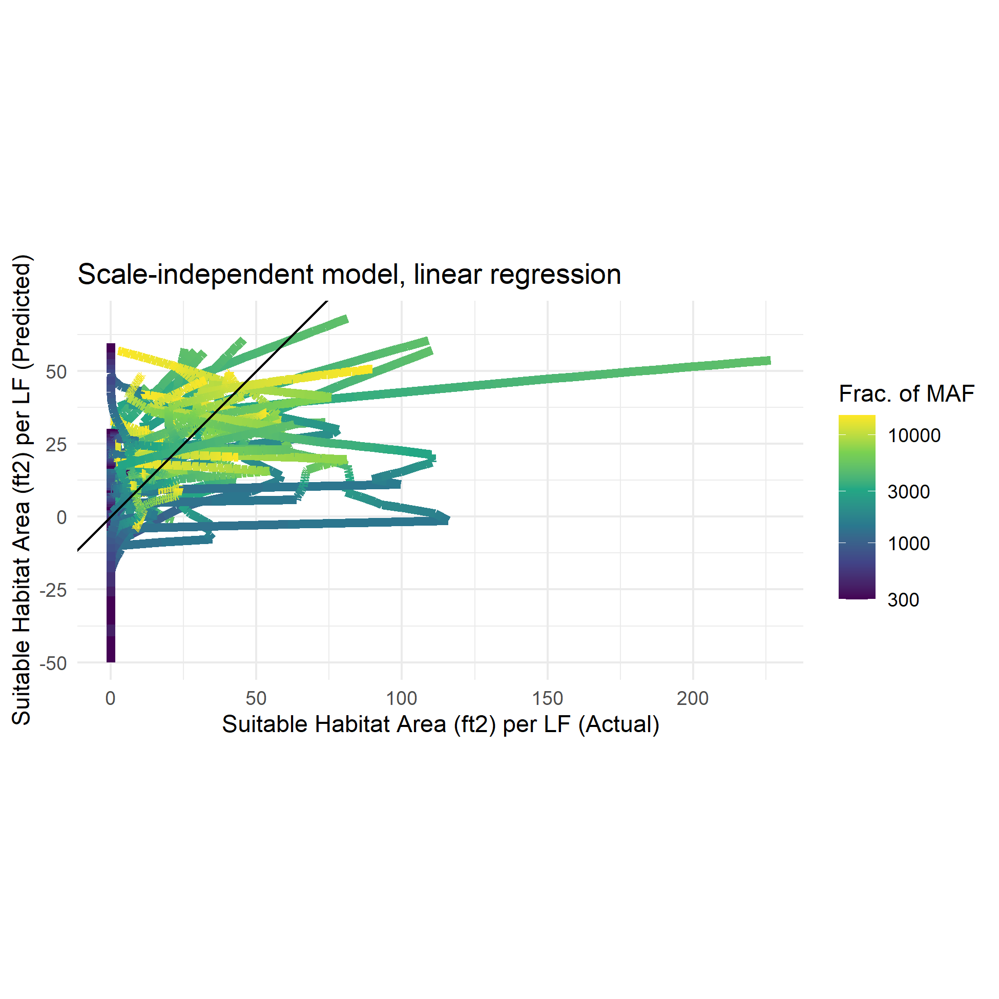<!-- -->

``` r
lm_si2_res |> 
  filter(flow_cfs %in% c(300,500,1000,1500,3000,5000,10000,15000)) |>
  ggplot() + geom_point(aes(x=wua_per_lf, y=wua_per_lf_pred, color=flow_cfs)) + 
  facet_wrap(~flow_cfs, ncol = 4) +
  coord_fixed() + geom_abline() + scale_color_viridis_c(name = "Flow (cfs)") + 
  ggtitle("Scale-independent model, linear regression") +
  xlab("Suitable Habitat Area (ft2) per LF (Actual)") + ylab("Suitable Habitat Area (ft2) per LF (Predicted)")
```

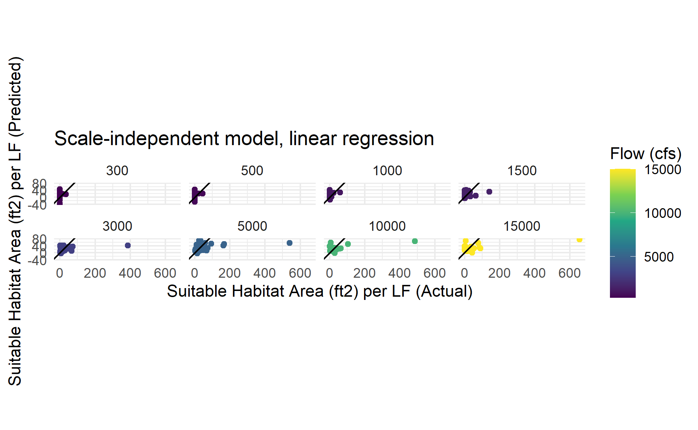<!-- -->

``` r
lm_si2_res |> filter(comid %in% test_comids) |>
  ggplot(aes(x=flow_cfs, group=1)) + facet_wrap(~comid, scale="free_y") + 
  geom_line(aes(y=wua_per_lf_pred, color="predicted", group=1)) + 
  geom_line(aes(y=wua_per_lf, color="actual", group=1)) + 
  xlab("Flow (cfs)") + ylab("Suitable Habitat Area (ft2) per LF")
```

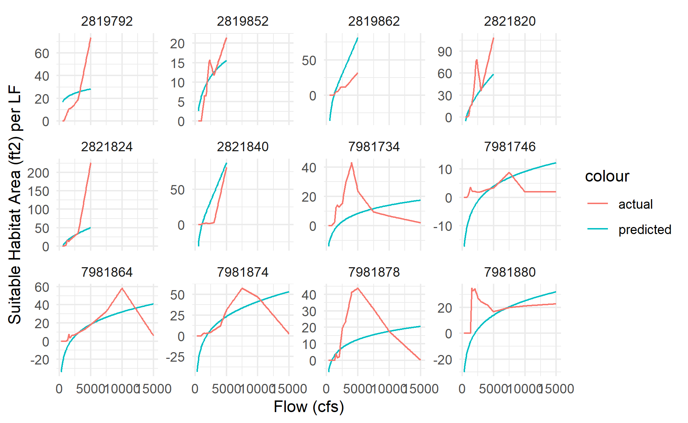<!-- -->

``` r
lm_si2 |>
  tidy() |>
  mutate(ixn_class = if_else(str_detect(term, "flow_norm_cfs_x_"), "term_flow_norm_cfs_x_", "term") |> 
                     factor(levels = c("term", "term_flow_norm_cfs_x_"), labels = c("Constant Effect", "Interaction with Normalized Flow")),
         term_root = str_replace(term, "flow_norm_cfs_x_", ""),
         coeff_dir = if_else(estimate>0, "Positive", "Negative"),
         ci_lower = estimate - qt(0.975, df = glance(lm_si)$df) * std.error,
         ci_upper = estimate + qt(0.975, df = glance(lm_si)$df) * std.error,
         estimate_abs = abs(estimate),
         ci_lower_abs = ci_lower * if_else(coeff_dir=="Negative",-1,1),
         ci_upper_abs = ci_upper * if_else(coeff_dir=="Negative",-1,1),
         is_significant = sign(ci_lower)==sign(ci_upper)
         ) |>
  filter(term!="flow_norm_cfs" & term!="(Intercept)") |>
  ggplot(aes(y = term_root, color = coeff_dir)) +
  facet_wrap(~ixn_class, ncol = 2, scales = "free_x") + 
  geom_errorbarh(aes(xmin = ci_lower_abs, xmax=ci_upper_abs)) + #pmax(0,ci_lower_abs), xmax = pmax(0,ci_upper_abs))) +
  geom_point(aes(x = estimate_abs, fill = is_significant), shape=21) +
  theme(legend.position="top",
        panel.grid.minor = element_blank(),
        panel.border = element_rect(fill = NA, color = "black"), 
        legend.direction = "vertical") +
  scale_y_discrete(limits=rev) + 
  scale_fill_manual(name = "Significant (95%)", values = c("FALSE" = "white", "TRUE" = "black")) +
  scale_color_manual(name = "Direction of Effect", values = c("Negative" = "goldenrod", "Positive" = "darkcyan")) +
  xlab("Coefficient Magnitude") + ylab("")
```

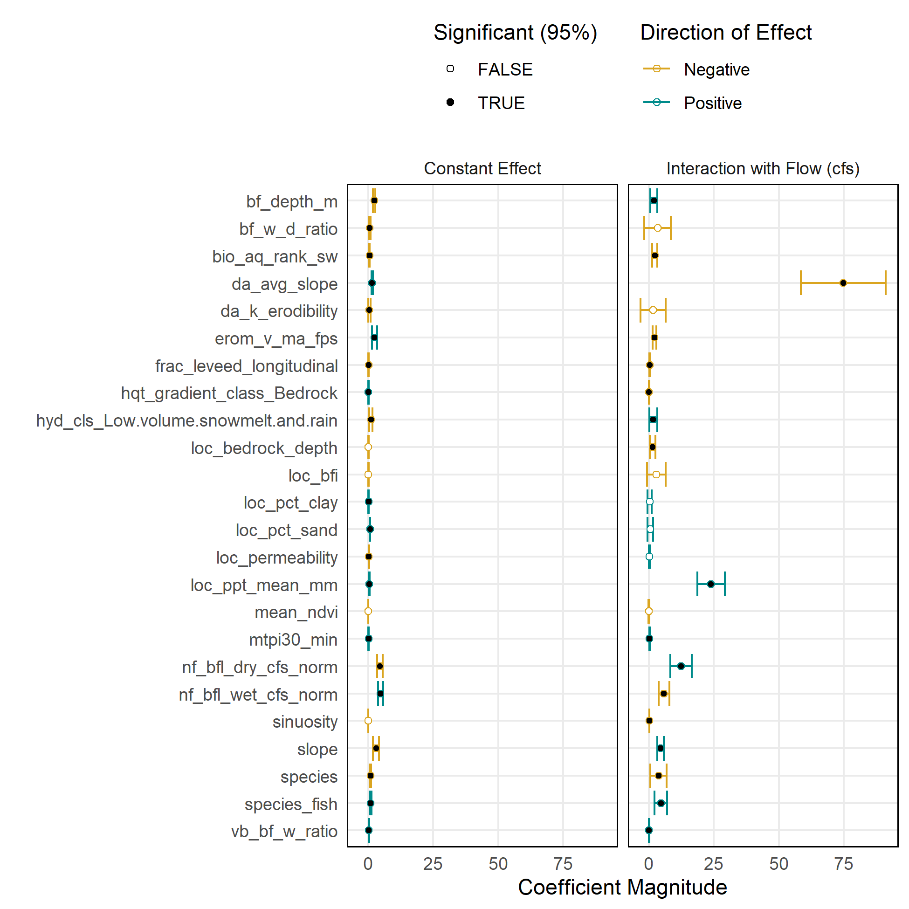<!-- -->

``` r
rfr_spec <- rand_forest(mode = "regression", trees = 2^8)

rfr_si2 <- workflow() |>
  add_recipe(si2_rec) |>
  add_model(rfr_spec) |>
  fit(data=training(td_split))

rfr_si2$fit$fit |> print()
```

    ## parsnip model object
    ## 
    ## Ranger result
    ## 
    ## Call:
    ##  ranger::ranger(x = maybe_data_frame(x), y = y, num.trees = ~2^8,      num.threads = 1, verbose = FALSE, seed = sample.int(10^5,          1)) 
    ## 
    ## Type:                             Regression 
    ## Number of trees:                  256 
    ## Sample size:                      15850 
    ## Number of independent variables:  33 
    ## Mtry:                             5 
    ## Target node size:                 5 
    ## Variable importance mode:         none 
    ## Splitrule:                        variance 
    ## OOB prediction error (MSE):       0.002601757 
    ## R squared (OOB):                  0.9996687

``` r
rfr_si2_res <- testing(td_split) |>
  transmute(comid, flow_norm_cfs, flow_cfs, !!norm_var,
            # actuals
            ihs_wua_per_lf_norm,
            wua_per_lf_norm = sinh(ihs_wua_per_lf_norm), 
            wua_per_lf = wua_per_lf_norm * !!norm_var,
            # predicted
            ihs_wua_per_lf_norm_pred = predict(rfr_si2, testing(td_split))[[".pred"]],
            wua_per_lf_norm_pred = sinh(ihs_wua_per_lf_norm_pred),
            wua_per_lf_pred = wua_per_lf_norm_pred * !!norm_var)

rfr_si2_res |>
  arrange(comid, flow_norm_cfs) |>
  ggplot() + geom_path(aes(x=wua_per_lf, y=wua_per_lf_pred, color=flow_cfs, group=comid), linewidth=2) + 
  coord_fixed() + geom_abline() + scale_color_viridis_c(trans="log10", name="Frac. of MAF") + 
  ggtitle("Scale-independent model 2, random forest regression") +
  xlab("Suitable Habitat Area (ft2) per LF (Actual)") + ylab("Suitable Habitat Area (ft2) per LF (Predicted)")
```

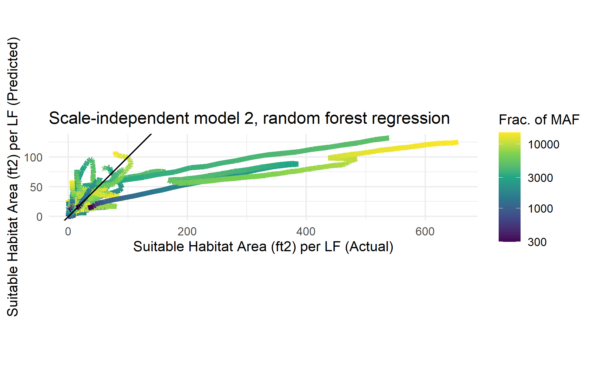<!-- -->

``` r
rfr_si2_res |> 
  filter(flow_cfs %in% c(300,500,1000,1500,3000,5000,10000,15000)) |>
  ggplot() + geom_point(aes(x=wua_per_lf, y=wua_per_lf_pred, color=flow_cfs)) + 
  facet_wrap(~flow_cfs, ncol = 4) +
  coord_fixed() + geom_abline() + scale_color_viridis_c(name = "Flow (cfs)") + 
  ggtitle("Scale-independent model 2, random forest regression") +
  xlab("Suitable Habitat Area ft2) per LF (Actual)") + ylab("Suitable Habitat Area ft2) per LF (Predicted)")
```

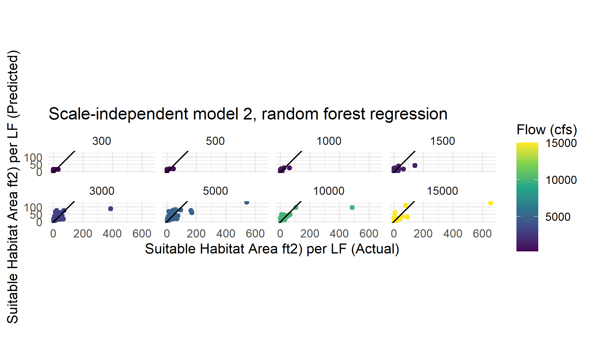<!-- -->

``` r
rfr_si2_res |> filter(comid %in% test_comids) |>
  ggplot(aes(x=flow_cfs, group=1)) + facet_wrap(~comid, scale="free_y") + 
  geom_line(aes(y=wua_per_lf_pred, color="predicted", group=1)) + 
  geom_line(aes(y=wua_per_lf, color="actual", group=1)) + 
  xlab("Flow (cfs)") + ylab("Suitable Habitat Area (ft2) per LF")
```

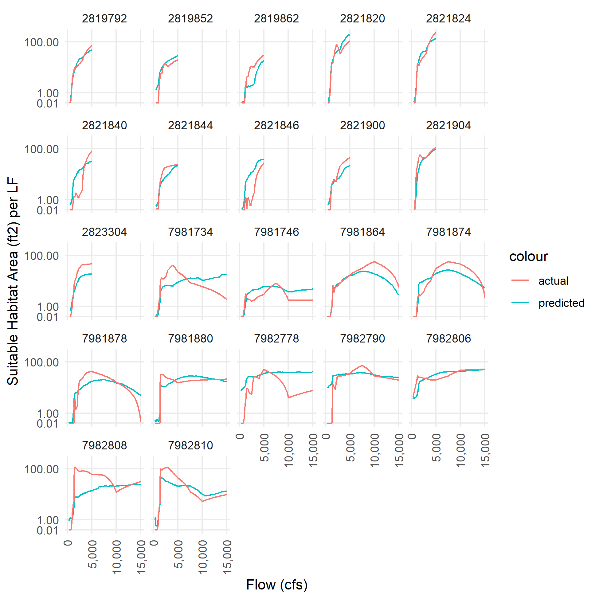<!-- -->

#### TEST

other models to try \* svm_rbf \* arima_reg

## Prediction and Validation

``` r
# assemble prediction dataset
pd_attr <- flowline_attributes |> 
  # select just major streams
  filter(da_area_sq_km>=100) |> #stream_level<=4 & !is.na(gnis_name) 
  # # filter out Valley Lowland areas
  # filter(hqt_gradient_class != "Valley Lowland") |>
  # # filter for just the areas that are hydrologically similar to the training data
  # filter(hyd_cls %in% c("High-volume snowmelt and rain",
  #                       "Low-volume snowmelt and rain")) |>
  # select the variables that are used in the model and drop NAs
  mutate(nf_bfl_dry_cfs_norm = coalesce(nf_bfl_dry_cfs / !!norm_var, 0), # normalized baseflow values
         nf_bfl_wet_cfs_norm = coalesce(nf_bfl_wet_cfs / !!norm_var, 0)) |>
  select(comid, any_of(c(sd_rec$var_info$variable, si_rec$var_info$variable)), !!norm_var) |> 
  drop_na()
  
pd <- pd_attr |>
  # create series of flow prediction points
  expand_grid(flow_cfs = c(0,signif(100*2^seq(-2,7,0.5),2))) |>
  #mutate(flow_cfs = if_else(flow_cfs>0, flow_cfs, erom_q_ma_cfs)) |> # also evaluate at mean annual flow
  mutate(flow_norm_cfs = coalesce(flow_cfs / !!norm_var, 0)) |> # flow as a percent of mean annual flow
  arrange(comid, flow_cfs) |>
  glimpse()
```

    ## Rows: 251,960
    ## Columns: 24
    ## $ comid                    <dbl> 342517, 342517, 342517, 342517, 342517, 34251…
    ## $ slope                    <dbl> 0.05283632, 0.05283632, 0.05283632, 0.0528363…
    ## $ da_area_sq_km            <dbl> 113.4549, 113.4549, 113.4549, 113.4549, 113.4…
    ## $ da_elev_mean             <dbl> 2259.68, 2259.68, 2259.68, 2259.68, 2259.68, …
    ## $ da_ppt_mean_mm           <dbl> 1236.076, 1236.076, 1236.076, 1236.076, 1236.…
    ## $ bf_depth_m               <dbl> 1.55, 1.55, 1.55, 1.55, 1.55, 1.55, 1.55, 1.5…
    ## $ bf_w_d_ratio             <dbl> 11.17419, 11.17419, 11.17419, 11.17419, 11.17…
    ## $ da_k_erodibility         <dbl> 0.1079, 0.1079, 0.1079, 0.1079, 0.1079, 0.107…
    ## $ da_avg_slope             <dbl> 19.27, 19.27, 19.27, 19.27, 19.27, 19.27, 19.…
    ## $ mean_ndvi                <dbl> 0.4093465, 0.4093465, 0.4093465, 0.4093465, 0…
    ## $ loc_bfi                  <dbl> 60.692, 60.692, 60.692, 60.692, 60.692, 60.69…
    ## $ loc_pct_clay             <dbl> 4.3704, 4.3704, 4.3704, 4.3704, 4.3704, 4.370…
    ## $ loc_pct_sand             <dbl> 75.2812, 75.2812, 75.2812, 75.2812, 75.2812, …
    ## $ loc_permeability         <dbl> 30.4353, 30.4353, 30.4353, 30.4353, 30.4353, …
    ## $ loc_bedrock_depth        <dbl> 56.5676, 56.5676, 56.5676, 56.5676, 56.5676, …
    ## $ loc_ppt_mean_mm          <dbl> 1177.02, 1177.02, 1177.02, 1177.02, 1177.02, …
    ## $ mtpi30_min               <dbl> -48, -48, -48, -48, -48, -48, -48, -48, -48, …
    ## $ vb_bf_w_ratio            <dbl> 1, 1, 1, 1, 1, 1, 1, 1, 1, 1, 1, 1, 1, 1, 1, …
    ## $ frac_leveed_longitudinal <dbl> 0, 0, 0, 0, 0, 0, 0, 0, 0, 0, 0, 0, 0, 0, 0, …
    ## $ vb_width_transect        <dbl> 17.32, 17.32, 17.32, 17.32, 17.32, 17.32, 17.…
    ## $ sinuosity                <dbl> 1.31, 1.31, 1.31, 1.31, 1.31, 1.31, 1.31, 1.3…
    ## $ da_scalar                <dbl> 1.364322, 1.364322, 1.364322, 1.364322, 1.364…
    ## $ flow_cfs                 <dbl> 0, 25, 35, 50, 71, 100, 140, 200, 280, 400, 5…
    ## $ flow_norm_cfs            <dbl> 0.00000, 18.32411, 25.65376, 36.64823, 52.040…

``` r
flowlines |> st_zm() |>
  inner_join(pd_attr, by=join_by(comid)) |>
  ggplot() + geom_sf(aes(color = da_area_sq_km)) + 
  scale_color_viridis_c(trans="sqrt", breaks = scales::breaks_log(6), direction = -1)
```

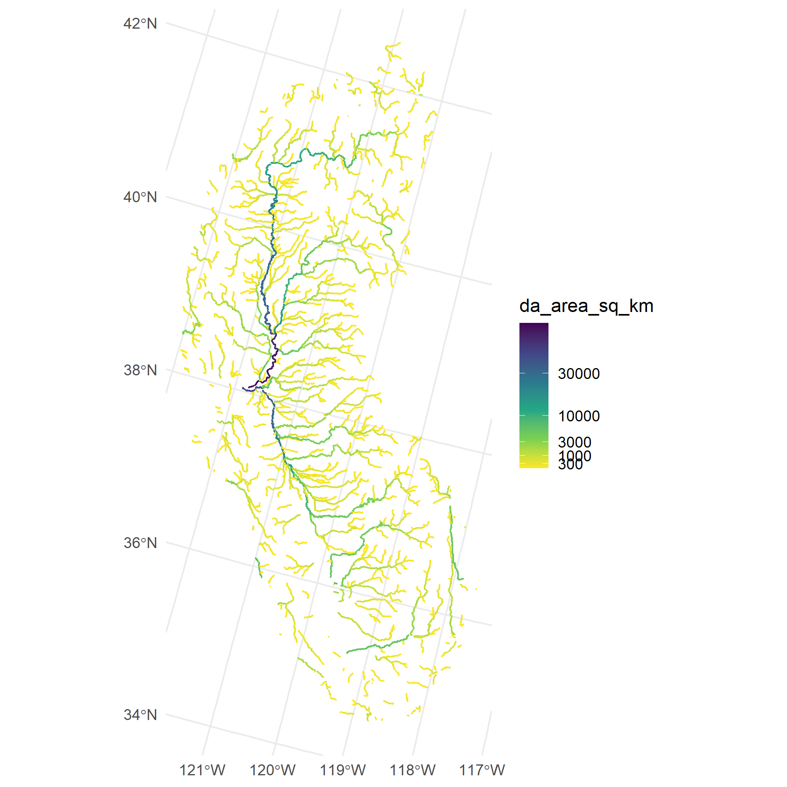<!-- -->

### One-step model, scale-dependent: WUA/LF vs flow

``` r
sd_pred <- 
  sd_rec |> 
  prep(training(td_split)) |> 
  bake(pd) |># |> filter_within_domain(flow_cfs)) |> 
  bind_cols(pd |> #filter_within_domain(flow_cfs) |>
              transmute(comid, flow_cfs_orig = flow_cfs)) |>
  drop_na() %>% # need to use magrittr pipe for this purpose
  mutate(ihs_wua_per_lf_pred = predict(rfr_sd$fit$fit, new_data=.)[[".pred"]]) |>
  transmute(comid, 
            flow_cfs = flow_cfs_orig, 
            ihs_wua_per_lf_pred,
            wua_per_lf_pred = sinh(ihs_wua_per_lf_pred)) |>
  glimpse()
```

    ## Rows: 251,960
    ## Columns: 4
    ## $ comid               <dbl> 342517, 342517, 342517, 342517, 342517, 342517, 34…
    ## $ flow_cfs            <dbl> 0, 25, 35, 50, 71, 100, 140, 200, 280, 400, 570, 8…
    ## $ ihs_wua_per_lf_pred <dbl> 1.280663, 1.362000, 1.367452, 1.417900, 1.431844, …
    ## $ wua_per_lf_pred     <dbl> 1.660586, 1.823923, 1.835291, 1.943110, 1.973773, …

``` r
flowlines |> st_zm() |>
  inner_join(sd_pred |> filter(round(flow_cfs)==800), by=join_by(comid)) |>
  mutate(wua_per_lf_pred = if_else(wua_per_lf_pred <1, 1, wua_per_lf_pred)) |> # for visualization only
  ggplot() + geom_sf(aes(color = wua_per_lf_pred)) + 
  scale_color_viridis_c(trans="log", breaks = scales::breaks_log(6), direction=-1)
```

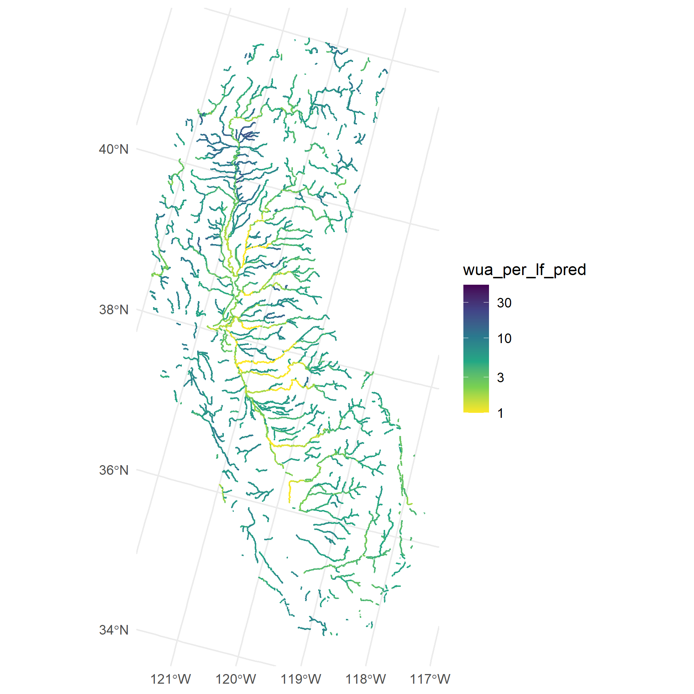<!-- -->

### Two-step model: (%HSI vs normalized flow) \* (Total Area/LF vs flow)

``` r
sd2_pred <- 
  sd2_rec |> 
  prep(training(td_split)) |> 
  bake(pd) |> 
  bind_cols(pd |> transmute(comid, 
                            flow_cfs_orig = flow_cfs)) |>
  drop_na() %>% # need to use magrittr pipe for this purpose
  mutate(ihs_tot_area_per_lf_pred = predict(rfr_sd2$fit$fit, new_data=.)[[".pred"]]) |>
  transmute(comid, 
            flow_cfs = flow_cfs_orig, 
            ihs_tot_area_per_lf_pred,
            tot_area_per_lf_pred = sinh(ihs_tot_area_per_lf_pred)) |>
  glimpse()
```

    ## Rows: 251,960
    ## Columns: 4
    ## $ comid                    <dbl> 342517, 342517, 342517, 342517, 342517, 34251…
    ## $ flow_cfs                 <dbl> 0, 25, 35, 50, 71, 100, 140, 200, 280, 400, 5…
    ## $ ihs_tot_area_per_lf_pred <dbl> 5.393529, 5.328164, 5.323067, 5.323247, 5.321…
    ## $ tot_area_per_lf_pred     <dbl> 109.9869, 103.0272, 102.5034, 102.5219, 102.3…

``` r
si_pred <- 
  si_rec |> 
  prep(training(td_split)) |> 
  bake(pd) |> 
  bind_cols(pd |> transmute(comid, 
                            flow_cfs_orig = flow_cfs,
                            flow_norm_cfs_orig = flow_norm_cfs,
                            "{norm_var}_orig" := !!norm_var)) |>
  drop_na() %>% # need to use magrittr pipe for this purpose
  mutate(hsi_frac_pred = predict(rfr_si$fit$fit, new_data=.)[[".pred"]]) |>
  transmute(comid, 
            flow_cfs = flow_cfs_orig, 
            flow_norm_cfs = flow_norm_cfs_orig, 
            hsi_frac_pred) |>
  #left_join(flowline_attributes |> transmute(comid, bf_width_ft = bf_width_m/0.3048), by=join_by(comid)) |>
  #mutate(wua_per_lf_pred = hsi_frac_pred * bf_width_ft) |>
  left_join(sd2_pred, by=join_by(comid, flow_cfs)) |>
  mutate(wua_per_lf_pred = hsi_frac_pred * tot_area_per_lf_pred) |>
  glimpse()
```

    ## Rows: 251,960
    ## Columns: 7
    ## $ comid                    <dbl> 342517, 342517, 342517, 342517, 342517, 34251…
    ## $ flow_cfs                 <dbl> 0, 25, 35, 50, 71, 100, 140, 200, 280, 400, 5…
    ## $ flow_norm_cfs            <dbl> 0.00000, 18.32411, 25.65376, 36.64823, 52.040…
    ## $ hsi_frac_pred            <dbl> 0.02442172, 0.03677191, 0.06231560, 0.0714937…
    ## $ ihs_tot_area_per_lf_pred <dbl> 5.393529, 5.328164, 5.323067, 5.323247, 5.321…
    ## $ tot_area_per_lf_pred     <dbl> 109.9869, 103.0272, 102.5034, 102.5219, 102.3…
    ## $ wua_per_lf_pred          <dbl> 2.686069, 3.788508, 6.387559, 7.329672, 9.082…

``` r
flowlines |> st_zm() |>
  inner_join(si_pred |> filter(round(flow_cfs)==800), by=join_by(comid)) |>
  mutate(wua_per_lf_pred = if_else(wua_per_lf_pred <1, 1, wua_per_lf_pred)) |> # for visualization only
  ggplot() + geom_sf(aes(color = wua_per_lf_pred)) + 
  scale_color_viridis_c(trans="log", breaks = scales::breaks_log(6), direction=-1)
```

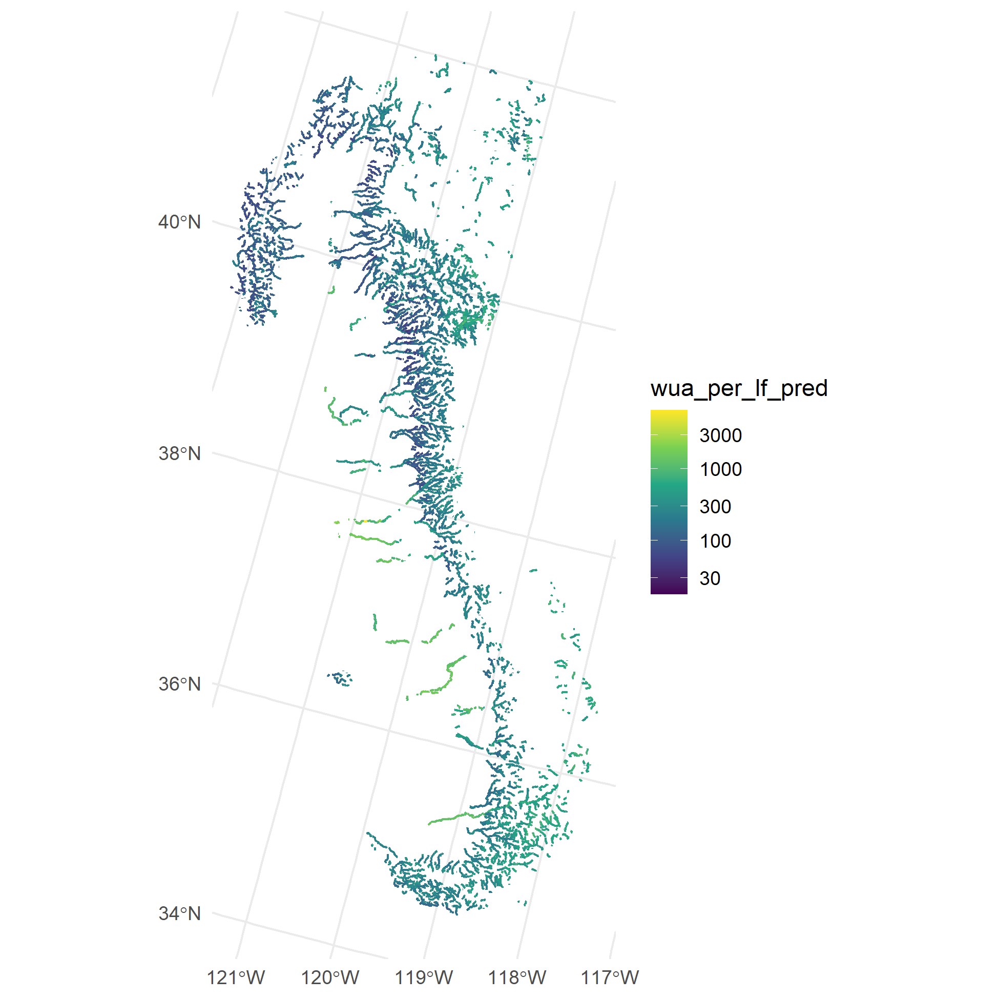<!-- -->

### One-step model, scale-independent: normalized WUA/LF vs normalized flow

``` r
si2_pred <- 
  si2_rec |> 
  prep(training(td_split)) |> 
  bake(pd) |> 
  # bring in unbaked variables
  bind_cols(pd |> transmute(comid, 
                            flow_cfs_orig = flow_cfs,
                            flow_norm_cfs_orig = flow_norm_cfs, 
                            "{norm_var}_orig" := !!norm_var)) |>
  drop_na() %>% # need to use magrittr pipe for this purpose
  mutate(ihs_wua_per_lf_norm_pred = predict(rfr_si2$fit$fit, new_data=.)[[".pred"]]) |>
  transmute(comid, 
            flow_cfs = flow_cfs_orig, 
            flow_norm_cfs = flow_norm_cfs_orig, 
            "{norm_var}" := !!sym(glue::glue("{norm_var}_orig")),
            ihs_wua_per_lf_norm_pred) |>
  mutate(wua_per_lf_norm_pred = sinh(ihs_wua_per_lf_norm_pred),
         wua_per_lf_pred = wua_per_lf_norm_pred * !!norm_var) |>
  glimpse()
```

    ## Rows: 251,960
    ## Columns: 7
    ## $ comid                    <dbl> 342517, 342517, 342517, 342517, 342517, 34251…
    ## $ flow_cfs                 <dbl> 0, 25, 35, 50, 71, 100, 140, 200, 280, 400, 5…
    ## $ flow_norm_cfs            <dbl> 0.00000, 18.32411, 25.65376, 36.64823, 52.040…
    ## $ da_scalar                <dbl> 1.364322, 1.364322, 1.364322, 1.364322, 1.364…
    ## $ ihs_wua_per_lf_norm_pred <dbl> 0.3791786, 0.5611533, 0.6918665, 0.8318517, 0…
    ## $ wua_per_lf_norm_pred     <dbl> 0.3883303, 0.5910710, 0.7483997, 0.9311633, 1…
    ## $ wua_per_lf_pred          <dbl> 0.5298077, 0.8064114, 1.0210586, 1.2704070, 1…

``` r
flowlines |> st_zm() |>
  inner_join(si2_pred |> filter(round(flow_cfs)==800), by=join_by(comid)) |>
  mutate(wua_per_lf_pred = if_else(wua_per_lf_pred <1, 1, wua_per_lf_pred)) |> # for visualization only
  ggplot() + geom_sf(aes(color = wua_per_lf_pred)) + 
  scale_color_viridis_c(trans="log", breaks = scales::breaks_log(6), direction=-1)
```

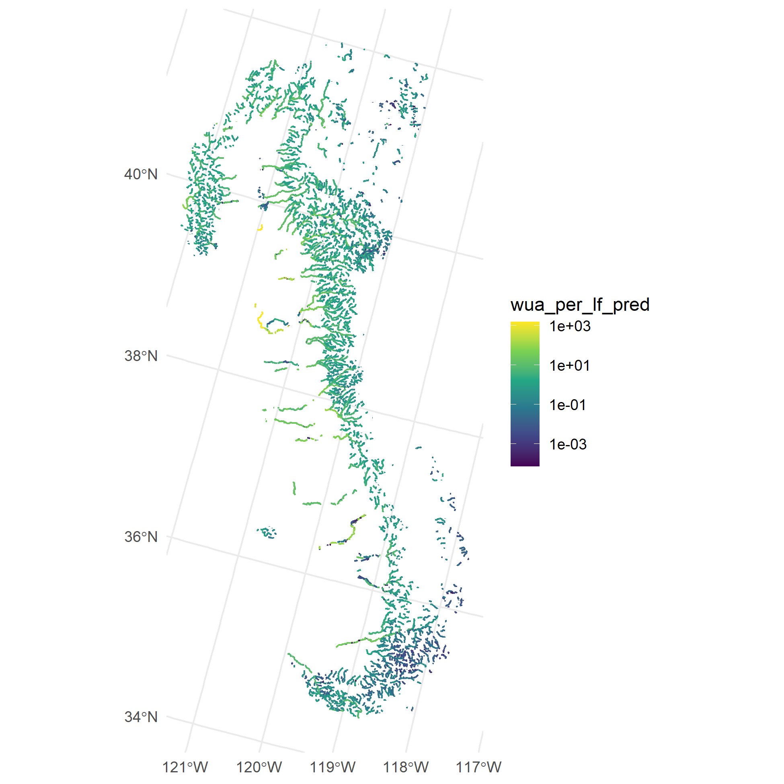<!-- -->

## Predictions summarized by DSMHabitat reach

``` r
mainstems_comid <- 
  st_read("/vsizip/rearing_spatial_data/nhdplusv2_comid_habitat_xw.shp.zip", as_tibble=T) |>
  janitor::clean_names() |>
  st_zm() |>
  st_transform(st_crs(flowlines)) |>
  mutate(length_ft = st_length(geometry) |> units::set_units("ft") |> units::drop_units()) |>
  filter(habitat=="rearing") |>
  left_join(flowline_attributes |> select(comid, hqt_gradient_class), by=join_by(comid)) |>
  filter(!(river %in% c("Sacramento River", "San Joaquin River")))
```

    ## Reading layer `nhdplusv2_comid_habitat_xw' from data source 
    ##   `/vsizip/rearing_spatial_data/nhdplusv2_comid_habitat_xw.shp.zip' 
    ##   using driver `ESRI Shapefile'
    ## Simple feature collection with 2657 features and 16 fields
    ## Geometry type: LINESTRING
    ## Dimension:     XYZM
    ## Bounding box:  xmin: -123.0351 ymin: 36.76305 xmax: -119.1836 ymax: 41.32689
    ## z_range:       zmin: 0 zmax: 0
    ## m_range:       mmin: 0 mmax: 100
    ## Geodetic CRS:  NAD83

``` r
mainstems <-
  mainstems_comid |>
  group_by(river, hqt_gradient_class) |>
  summarize() 
```

    ## `summarise()` has grouped output by 'river'. You can override using the
    ## `.groups` argument.

``` r
mainstems_comid |> 
  ggplot() + 
  geom_sf(aes(group=river, color=hqt_gradient_class)) + 
  theme(legend.key.height = unit(12, "point"))
```

<!-- -->

``` r
watersheds <- mainstems |> pull(river) |> unique()
watershed_name <- tolower(gsub(pattern = "-| ", replacement = "_", x = watersheds))
watershed_rda_name <- paste(watershed_name, "floodplain", sep = "_")

dsm_habitat_floodplain <- map_df(watershed_rda_name, function(watershed) {
  df <- as.data.frame(do.call(`::`, list(pkg = "DSMhabitat", name = watershed)))
}) |> 
  transmute(river = watershed,
            flow_cfs,
            FR_floodplain_m2 = FR_floodplain_acres * 4046.86,
            FR_floodplain_m2_suitable = DSMhabitat::apply_suitability(FR_floodplain_m2),
            FR_floodplain_acres_suitable = FR_floodplain_m2_suitable / 4046.86)

dsm_habitat_instream <- map_df(paste(watershed_name, "instream", sep = "_"), 
                               possibly(function(watershed) {
                                 df <- as.data.frame(do.call(`::`, list(pkg = "DSMhabitat", name = watershed)))
                                 }, otherwise = NULL)) |> 
  transmute(river = watershed,
            flow_cfs,
            FR_juv_wua) 

dsm_flows <- bind_rows(dsm_habitat_floodplain, dsm_habitat_instream) |>
  group_by(river, flow_cfs) |>
  summarize() |>
  ungroup() |>
  arrange(river, flow_cfs)
```

    ## `summarise()` has grouped output by 'river'. You can override using the
    ## `.groups` argument.

``` r
dsm_flow_ranges <- 
  dsm_flows |> 
  group_by(river) |> 
  summarize(min_flow_cfs = min(flow_cfs), max_flow_cfs = max(flow_cfs))

mainstems_comid |> 
  st_zm() |> 
  filter(comid %in% mainstems_comid$comid) |>
  ggplot() + 
  geom_sf(aes(color=river)) + 
  theme(legend.key.height = unit(12, "point"))
```

<!-- -->

``` r
# combining both floodplain and instream rearing acreages/WUAs for comparison
dsm_habitat_combined <- mainstems |> 
  mutate(length_ft = st_length(geometry) |> units::set_units("ft") |> units::drop_units()) |>
  group_by(river) |> 
  summarize(length_ft = sum(length_ft)) |>
  st_drop_geometry() |>
  inner_join(full_join(dsm_habitat_instream, dsm_habitat_floodplain, by=join_by(river, flow_cfs)), by=join_by(river)) |>
  group_by(river) |>
  arrange(river, flow_cfs) |>
  mutate(FR_juv_wua = zoo::na.approx(FR_juv_wua, flow_cfs, na.rm=F),
         FR_floodplain_acres_suitable = zoo::na.approx(FR_floodplain_acres_suitable, flow_cfs, na.rm=F)) |>
  transmute(river, flow_cfs, 
            instream_wua_per_lf = coalesce(FR_juv_wua/1000,0),
            instream_suitable_ac = coalesce(FR_juv_wua/1000,0)*length_ft/43560,
            floodplain_wua_per_lf = coalesce(FR_floodplain_acres_suitable,0)*43560/length_ft,
            floodplain_suitable_ac = coalesce(FR_floodplain_acres_suitable,0),
            combined_wua_per_lf = instream_wua_per_lf + floodplain_wua_per_lf,
            combined_suitable_ac =  instream_suitable_ac + floodplain_suitable_ac) |>
  ungroup()
```

    ## Warning: There was 1 warning in `mutate()`.
    ## ℹ In argument: `FR_floodplain_acres_suitable =
    ##   zoo::na.approx(FR_floodplain_acres_suitable, flow_cfs, na.rm = F)`.
    ## ℹ In group 20: `river = "Stanislaus River"`.
    ## Caused by warning in `regularize.values()`:
    ## ! collapsing to unique 'x' values

``` r
dsm_habitat_wua_per_lf <- dsm_habitat_combined |>
  select(river, flow_cfs, instream_wua_per_lf, floodplain_wua_per_lf) |>
  pivot_longer(cols=c(instream_wua_per_lf, floodplain_wua_per_lf)) |>
  mutate(name = str_replace(name, "_wua_per_lf", " DSMhabitat"),
         value = if_else(value>0, value, NA))

dsm_habitat_suitable_ac <- dsm_habitat_combined |>
  select(river, flow_cfs, instream_suitable_ac, floodplain_suitable_ac) |>
  pivot_longer(cols=c(instream_suitable_ac, floodplain_suitable_ac))  |>
  mutate(value = if_else(value>0, value, NA)) |>
  mutate(name = str_replace(name, "_suitable_ac", " DSMhabitat"),
         value = if_else(value>0, value, NA))
```

### One-step model, scale-dependent: WUA/LF vs flow

``` r
pd_sd <- flowline_attributes |> 
  select(comid, any_of(sd_rec$var_info$variable)) |> 
  inner_join(select(mainstems_comid, comid, river), by=join_by(comid)) |>
  #expand_grid(flow_cfs = interp_flows) |>
  inner_join(dsm_flows, by=join_by(river), relationship="many-to-many") |>
  arrange(comid, flow_cfs) |>
  filter(comid %in% mainstems_comid$comid) |>
  drop_na() #

pd_sd_dsmhabitat_pred <- 
  sd_rec |> 
  prep(training(td_split)) |> 
  bake(pd_sd) |> 
  bind_cols(pd_sd |> transmute(comid, flow_cfs_orig=flow_cfs)) |>
  drop_na() %>% # need to use magrittr pipe for this purpose
  mutate(ihs_wua_per_lf_pred = predict(rfr_sd$fit$fit, new_data=.)[[".pred"]]) |>
  transmute(comid, flow_cfs=flow_cfs_orig, ihs_wua_per_lf_pred) |>
  mutate(wua_per_lf_pred = sinh(ihs_wua_per_lf_pred)) |>
  select(comid, 
         flow_cfs, wua_per_lf_pred)

pd_rf_by_mainstem <-
  mainstems_comid |> 
  st_drop_geometry() |>
  inner_join(pd_sd_dsmhabitat_pred, by=join_by(comid), relationship="one-to-many") |>
  mutate(length_ft = coalesce(length_ft,0),
         wua_per_lf_pred = coalesce(wua_per_lf_pred,0),
         wua_ft2_pred = wua_per_lf_pred * length_ft) 

pd_rf_by_mainstem |>
  ggplot(aes(x = flow_cfs, y = wua_per_lf_pred, color = hqt_gradient_class)) + 
  geom_line(aes(group = comid), alpha=0.5) + geom_smooth(method="loess", se=F) +
  facet_wrap(~river, scales="free_y") + 
  scale_x_log10(labels=scales::comma_format(), expand=c(0,0)) + 
  scale_y_continuous() + 
  theme(legend.position="top", 
        panel.grid.minor = element_blank(),
        axis.text.x = element_text(angle = 90, vjust = 0.5, hjust=1)) +
  xlab("Flow (cfs)") + ylab("Suitable Habitat Area (ft2 per linear ft)")
```

    ## Warning: Transformation introduced infinite values in continuous x-axis
    ## Transformation introduced infinite values in continuous x-axis

    ## `geom_smooth()` using formula = 'y ~ x'

    ## Warning: Removed 24 rows containing non-finite values (`stat_smooth()`).

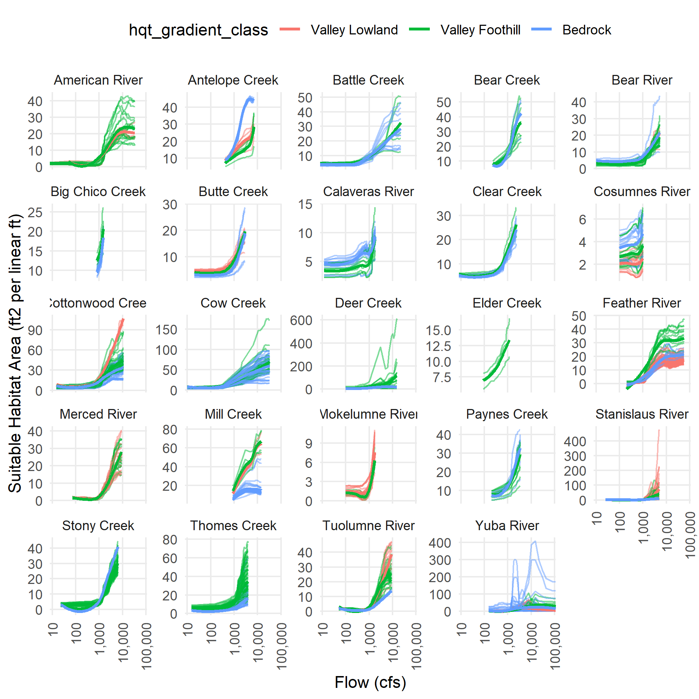<!-- -->

``` r
pd_rf_by_mainstem_summary <- pd_rf_by_mainstem |>
  group_by(river, flow_cfs) |>
  summarize(tot_length_ft = sum(length_ft),
            tot_wua_ft2 = sum(wua_ft2_pred),
            tot_wua_ac = tot_wua_ft2 / 43560,
            avg_wua_ft2_per_lf = tot_wua_ft2 / tot_length_ft,
            avg_wua_ft2_per_1000ft = 1000 * avg_wua_ft2_per_lf)
```

    ## `summarise()` has grouped output by 'river'. You can override using the
    ## `.groups` argument.

``` r
pd_rf_by_mainstem_summary |>
  ggplot() + 
  geom_line(aes(x = flow_cfs, y = tot_wua_ac, color = river)) + #, color=species, linetype=habitat)) + 
  facet_wrap(~river, scales="free_y") + 
  scale_x_log10(labels=scales::comma_format(), expand=c(0,0)) + 
  scale_y_continuous() + 
  theme(legend.position="none", 
        panel.grid.minor = element_blank(),
        axis.text.x = element_text(angle = 90, vjust = 0.5, hjust=1)) +
  xlab("Flow (cfs)") + ylab("Total WUA (ac)")
```

    ## Warning: Transformation introduced infinite values in continuous x-axis

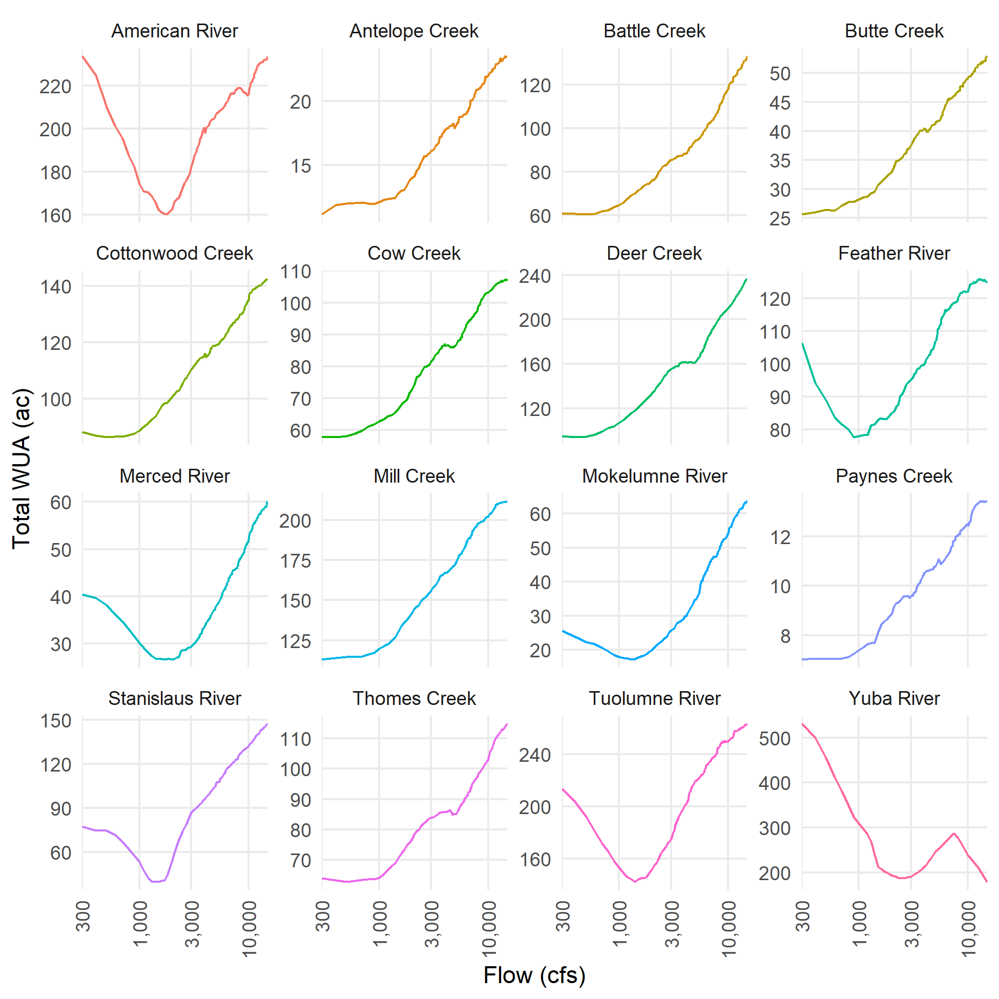<!-- -->

``` r
pd_rf_by_mainstem_summary |>
  ggplot() + 
  geom_line(aes(x = flow_cfs, y = avg_wua_ft2_per_lf, color = river)) + #, color=species, linetype=habitat)) + 
  facet_wrap(~river, scales="free_y") + 
  scale_x_log10(labels=scales::comma_format(), expand=c(0,0)) + 
  scale_y_continuous() + 
  theme(legend.position="none", 
        panel.grid.minor = element_blank(),
        axis.text.x = element_text(angle = 90, vjust = 0.5, hjust=1)) +
  xlab("Flow (cfs)") + ylab("Suitable Habitat Area (ft2 per linear ft)")
```

    ## Warning: Transformation introduced infinite values in continuous x-axis

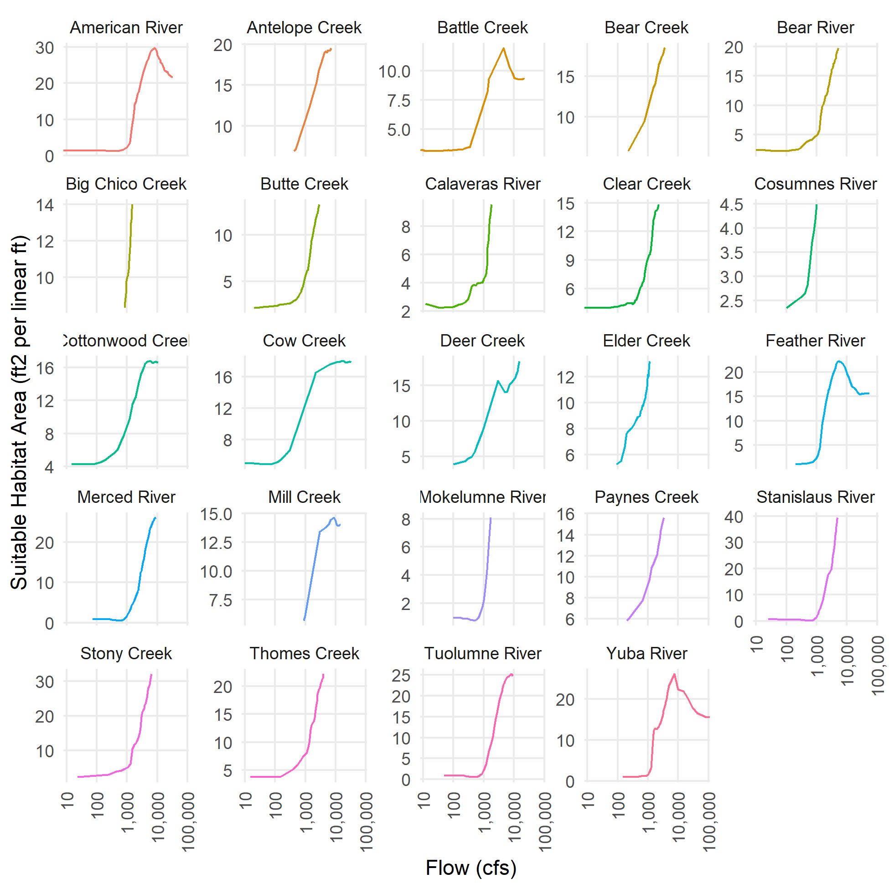<!-- -->

``` r
pd_rf_by_mainstem_summary |> 
  #inner_join(dsm_habitat_floodplain, by=join_by(river==river, flow_cfs==flow_cfs)) |> 
  #filter(river == "American River") |> 
  ggplot() +
  geom_line(aes(x = flow_cfs, y = tot_wua_ac, color='modeled')) + 
  geom_line(data=dsm_habitat_suitable_ac, aes(x = flow_cfs, y = value, color = name)) +  
  facet_wrap(~river) + #, scales="free_y") + 
  scale_x_log10(labels=scales::comma_format(), expand=c(0,0)) + 
  scale_y_log10(labels=scales::comma_format(), expand=c(0,0)) + 
  theme(legend.position="top", legend.title=element_blank(),
        panel.grid.minor = element_blank(),
        axis.text.x = element_text(angle = 90, vjust = 0.5, hjust=1)) +
  xlab("Flow (cfs)") + ylab("Total WUA (ac)")
```

    ## Warning: Transformation introduced infinite values in continuous x-axis
    ## Transformation introduced infinite values in continuous x-axis

    ## Warning: Removed 25 rows containing missing values (`geom_line()`).

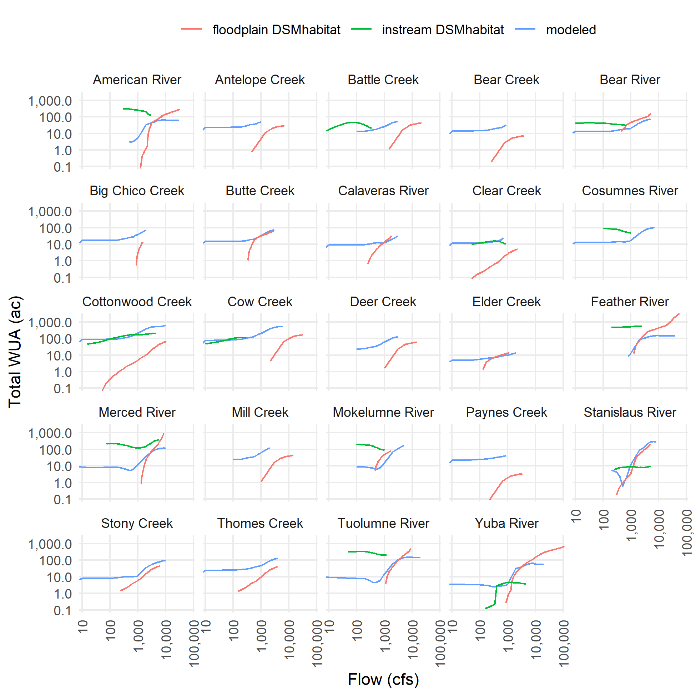<!-- -->

``` r
pd_rf_by_mainstem_summary |> 
  #inner_join(dsm_habitat_instream, by=join_by(river==river, flow_cfs==flow_cfs)) |> 
  ggplot() +
  geom_line(aes(x = flow_cfs, y = avg_wua_ft2_per_lf, color='modeled')) + 
  geom_line(data=dsm_habitat_wua_per_lf, aes(x = flow_cfs, y = value, color = name)) +  
  facet_wrap(~river) + #, scales="free_y") + 
  scale_x_log10(labels=scales::comma_format(), expand=c(0,0)) + 
  scale_y_log10(labels=scales::comma_format(), expand=c(0,0)) + 
  theme(legend.position="top", legend.title=element_blank(),
        panel.grid.minor = element_blank(),
        axis.text.x = element_text(angle = 90, vjust = 0.5, hjust=1)) +
  xlab("Flow (cfs)") + ylab("Suitable Habitat Area (ft2 per linear ft)")
```

    ## Warning: Transformation introduced infinite values in continuous x-axis

    ## Warning: Transformation introduced infinite values in continuous x-axis

    ## Warning: Removed 25 rows containing missing values (`geom_line()`).

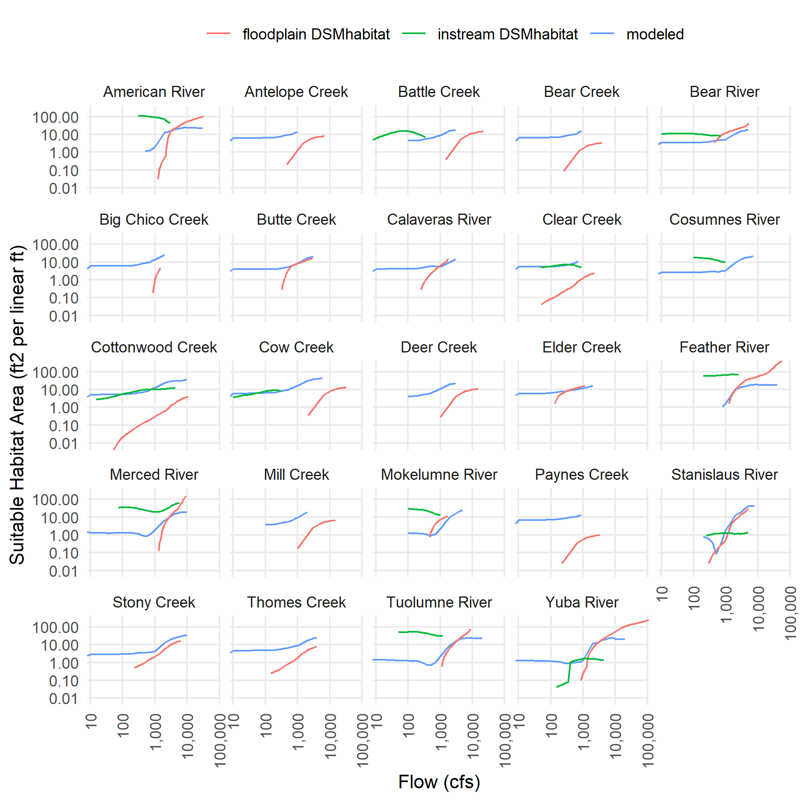<!-- -->

### Two-step model: (%HSI vs normalized flow) \* (Total Area/LF vs flow)

``` r
pd_sd2 <- flowline_attributes |> 
  select(comid, any_of(sd2_rec$var_info$variable)) |> 
  inner_join(select(mainstems_comid, comid, river), by=join_by(comid)) |>
  #expand_grid(flow_cfs = interp_flows) |>
  inner_join(dsm_flows, by=join_by(river), relationship="many-to-many") |>
  arrange(comid, flow_cfs) |>
  filter(comid %in% mainstems_comid$comid) |>
  drop_na()

pd_sd2_dsmhabitat_pred <- 
  sd2_rec |> 
  prep(training(td_split)) |> 
  bake(pd_sd2) |> 
  bind_cols(select(pd_sd2, comid, flow_cfs_orig=flow_cfs)) |>
  drop_na() %>% # need to use magrittr pipe for this purpose
  mutate(ihs_tot_area_per_lf_pred = predict(rfr_sd2$fit$fit, new_data=.)[[".pred"]]) |>
  mutate(tot_area_per_lf_pred = sinh(ihs_tot_area_per_lf_pred) ) |> 
  select(comid, flow_cfs=flow_cfs_orig, tot_area_per_lf_pred)

pd_si <- flowline_attributes |> 
  select(comid, any_of(si_rec$var_info$variable), !!norm_var) |> #, erom_q_ma_cfs, nf_bfl_dry_cfs, nf_bfl_wet_cfs) |> 
  inner_join(select(mainstems_comid, comid, river), by=join_by(comid)) |>
  #expand_grid(flow_cfs = interp_flows) |>
  inner_join(dsm_flows, by=join_by(river), relationship="many-to-many") |>
  arrange(comid, flow_cfs) |>
  filter(comid %in% mainstems_comid$comid) |>
  mutate(flow_norm_cfs = flow_cfs / !!norm_var) |>#,
       #nf_bfl_dry_cfs_norm = nf_bfl_dry_cfs/erom_q_ma_cfs, 
       #nf_bfl_wet_cfs_norm = nf_bfl_wet_cfs/erom_q_ma_cfs) |>
  drop_na()

pd_si_dsmhabitat_pred <- 
  si_rec |> 
  prep(training(td_split)) |> 
  bake(pd_si) |> 
  bind_cols(select(pd_si, comid, flow_cfs)) |>
  drop_na() %>% # need to use magrittr pipe for this purpose
  mutate(hsi_pred = predict(rfr_si$fit$fit, new_data=.)[[".pred"]]) |>
  #inner_join(flowline_attributes |> transmute(comid, length_ft = reach_length_km * 3280.84, width_ft = bf_width_m/3.2808), by=join_by(comid)) |>   
  #mutate(wua_per_lf_pred = hsi_pred * width_ft * length_ft / length_ft ) |> 
  left_join(pd_sd2_dsmhabitat_pred, by=join_by(comid, flow_cfs)) |>
  mutate(wua_per_lf_pred = hsi_pred * tot_area_per_lf_pred) |>
  select(comid, flow_norm_cfs, flow_cfs, hsi_pred, tot_area_per_lf_pred, wua_per_lf_pred)

pd_rf_by_mainstem <-
  mainstems_comid |> 
  st_drop_geometry() |>
  inner_join(pd_si_dsmhabitat_pred, by=join_by(comid), relationship="one-to-many") |>
  mutate(length_ft = coalesce(length_ft,0),
         wua_per_lf_pred = coalesce(wua_per_lf_pred,0),
         wua_ft2_pred = wua_per_lf_pred * length_ft) 

pd_rf_by_mainstem |>
  ggplot(aes(x = flow_cfs, y = wua_per_lf_pred, color = hqt_gradient_class)) + 
  geom_line(aes(group = comid), alpha=0.5) + geom_smooth(method="loess", se=F) +
  facet_wrap(~river, scales="free_y") + 
  scale_x_log10(labels=scales::comma_format(), expand=c(0,0)) + 
  scale_y_continuous() + 
  theme(legend.position="top", 
        panel.grid.minor = element_blank(),
        axis.text.x = element_text(angle = 90, vjust = 0.5, hjust=1)) +
  xlab("Flow (cfs)") + ylab("Suitable Habitat Area (ft2 per linear ft)")
```

    ## Warning: Transformation introduced infinite values in continuous x-axis
    ## Transformation introduced infinite values in continuous x-axis

    ## `geom_smooth()` using formula = 'y ~ x'

    ## Warning: Removed 24 rows containing non-finite values (`stat_smooth()`).

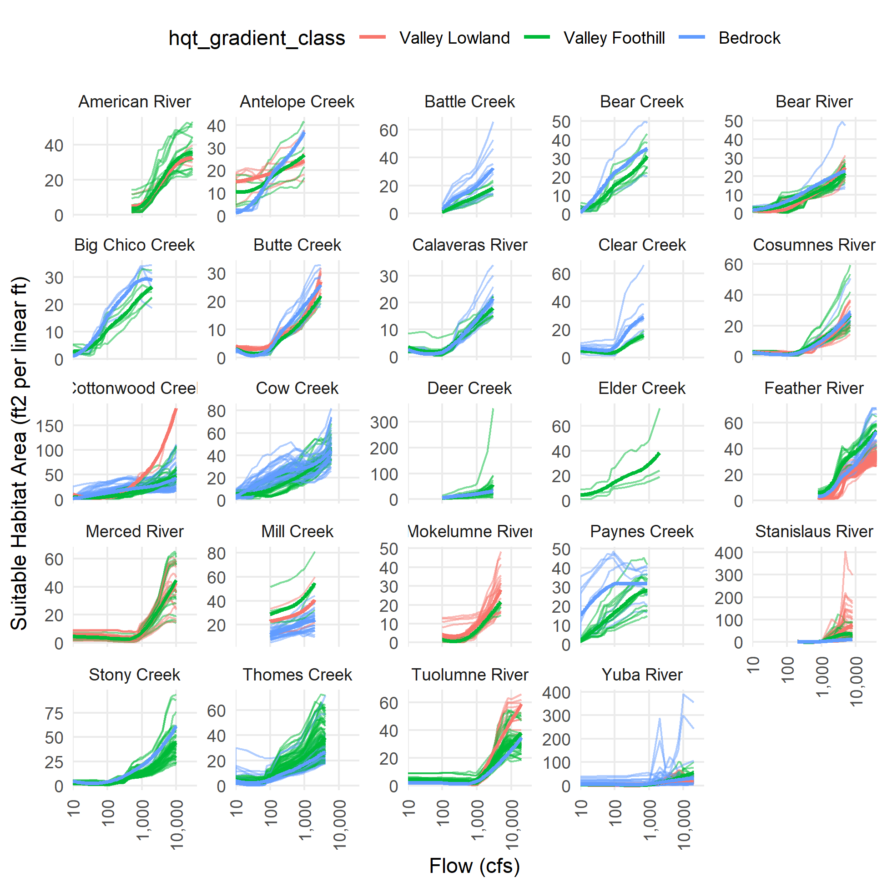<!-- -->

``` r
pd_rf_by_mainstem_summary <- pd_rf_by_mainstem |>
  group_by(river, flow_cfs) |>
  summarize(tot_length_ft = sum(length_ft),
            tot_wua_ft2 = sum(wua_ft2_pred),
            tot_wua_ac = tot_wua_ft2 / 43560,
            avg_wua_ft2_per_lf = tot_wua_ft2 / tot_length_ft,
            avg_wua_ft2_per_1000ft = 1000 * avg_wua_ft2_per_lf)
```

    ## `summarise()` has grouped output by 'river'. You can override using the
    ## `.groups` argument.

``` r
pd_rf_by_mainstem_summary |>
  ggplot() + 
  geom_line(aes(x = flow_cfs, y = tot_wua_ac, color = river)) + #, color=species, linetype=habitat)) + 
  facet_wrap(~river, scales="free_y") + 
  scale_x_log10(labels=scales::comma_format(), expand=c(0,0)) + 
  scale_y_continuous() + 
  theme(legend.position="none", 
        panel.grid.minor = element_blank(),
        axis.text.x = element_text(angle = 90, vjust = 0.5, hjust=1)) +
  xlab("Flow (cfs)") + ylab("Total WUA (ac)")
```

    ## Warning: Transformation introduced infinite values in continuous x-axis

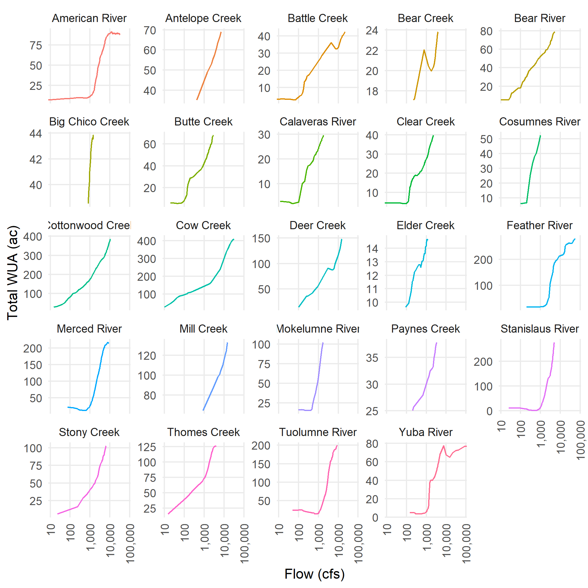<!-- -->

``` r
pd_rf_by_mainstem_summary |>
  ggplot() + 
  geom_line(aes(x = flow_cfs, y = avg_wua_ft2_per_lf, color = river)) + #, color=species, linetype=habitat)) + 
  facet_wrap(~river, scales="free_y") + 
  scale_x_log10(labels=scales::comma_format(), expand=c(0,0)) + 
  scale_y_continuous() + 
  theme(legend.position="none", 
        panel.grid.minor = element_blank(),
        axis.text.x = element_text(angle = 90, vjust = 0.5, hjust=1)) +
  xlab("Flow (cfs)") + ylab("Suitable Habitat Area (ft2 per linear ft)")
```

    ## Warning: Transformation introduced infinite values in continuous x-axis

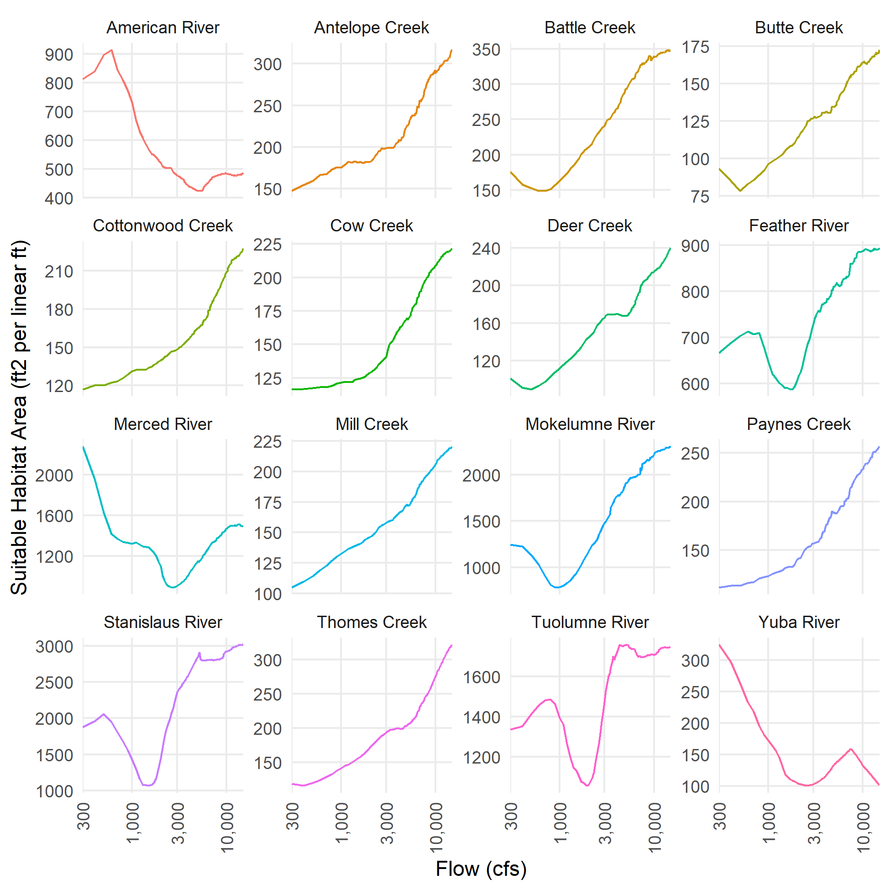<!-- -->

``` r
pd_rf_by_mainstem_summary |> 
  #inner_join(dsm_habitat_floodplain, by=join_by(river==river, flow_cfs==flow_cfs)) |> 
  #filter(river == "American River") |> 
  ggplot() +
  geom_line(aes(x = flow_cfs, y = tot_wua_ac, color='modeled')) + 
  geom_line(data=dsm_habitat_suitable_ac, aes(x = flow_cfs, y = value, color = name)) +  
  facet_wrap(~river) + #, scales="free_y") + 
  scale_x_log10(labels=scales::comma_format(), expand=c(0,0)) + 
  scale_y_log10(labels=scales::comma_format(), expand=c(0,0)) + 
  theme(legend.position="top", legend.title=element_blank(),
        panel.grid.minor = element_blank(),
        axis.text.x = element_text(angle = 90, vjust = 0.5, hjust=1)) +
  xlab("Flow (cfs)") + ylab("Total WUA (ac)")
```

    ## Warning: Transformation introduced infinite values in continuous x-axis
    ## Transformation introduced infinite values in continuous x-axis

    ## Warning: Removed 25 rows containing missing values (`geom_line()`).

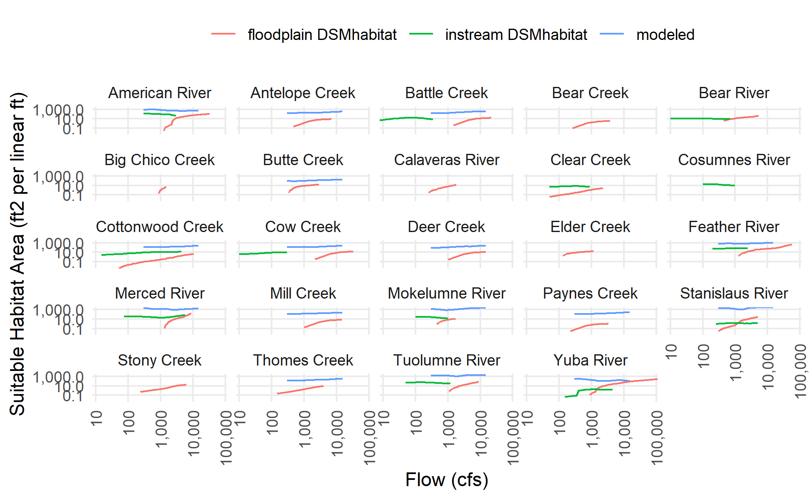<!-- -->

``` r
pd_rf_by_mainstem_summary |> 
  #inner_join(dsm_habitat_instream, by=join_by(river==river, flow_cfs==flow_cfs)) |> 
  ggplot() +
  geom_line(aes(x = flow_cfs, y = avg_wua_ft2_per_lf, color='modeled')) + 
  geom_line(data=dsm_habitat_wua_per_lf, aes(x = flow_cfs, y = value, color = name)) +  
  facet_wrap(~river) + #, scales="free_y") + 
  scale_x_log10(labels=scales::comma_format(), expand=c(0,0)) + 
  scale_y_log10(labels=scales::comma_format(), expand=c(0,0)) + 
  theme(legend.position="top", legend.title=element_blank(),
        panel.grid.minor = element_blank(),
        axis.text.x = element_text(angle = 90, vjust = 0.5, hjust=1)) +
  xlab("Flow (cfs)") + ylab("Suitable Habitat Area (ft2 per linear ft)")
```

    ## Warning: Transformation introduced infinite values in continuous x-axis

    ## Warning: Transformation introduced infinite values in continuous x-axis

    ## Warning: Removed 25 rows containing missing values (`geom_line()`).

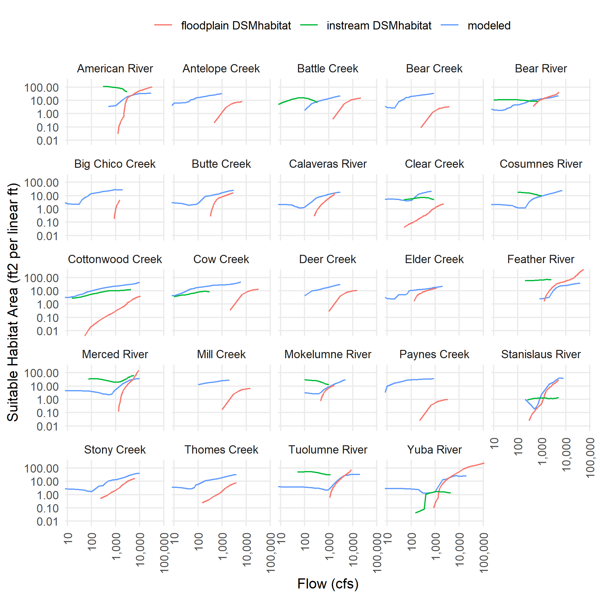<!-- -->

### One-step model, scale-independent: WUA/LF vs normalized flow

``` r
pd_si2 <- flowline_attributes |> 
  select(comid, any_of(si2_rec$var_info$variable), !!norm_var) |> #erom_q_ma_cfs, nf_bfl_dry_cfs, nf_bfl_wet_cfs) |> 
  inner_join(select(mainstems_comid, comid, river), by=join_by(comid)) |>
  #expand_grid(flow_cfs = interp_flows) |>
  inner_join(dsm_flows, by=join_by(river), relationship="many-to-many") |>
  arrange(comid, flow_cfs) |>
  filter(comid %in% mainstems_comid$comid) |>
  mutate(flow_norm_cfs = flow_cfs / !!norm_var) |> #,
       #nf_bfl_dry_cfs_norm = nf_bfl_dry_cfs/erom_q_ma_cfs, 
       #nf_bfl_wet_cfs_norm = nf_bfl_wet_cfs/erom_q_ma_cfs) |>
  drop_na()

pd_si2_dsmhabitat_pred <- 
  si2_rec |> 
  prep(training(td_split)) |> 
  bake(pd_si2) |> 
  bind_cols(select(pd_si2, comid, flow_cfs_actual=flow_cfs, !!norm_var)) |>
  drop_na() %>% # need to use magrittr pipe for this purpose
  mutate(ihs_wua_per_lf_norm_pred = predict(rfr_si2$fit$fit, new_data=.)[[".pred"]]) |>
  mutate(wua_per_lf_pred = sinh(ihs_wua_per_lf_norm_pred) * !!norm_var) |> 
  select(comid, flow_norm_cfs, wua_per_lf_pred, flow_cfs=flow_cfs_actual, wua_per_lf_pred)

pd_rf_by_mainstem <-
  mainstems_comid |> 
  st_drop_geometry() |>
  inner_join(pd_si2_dsmhabitat_pred, by=join_by(comid), relationship="one-to-many") |>
  mutate(length_ft = coalesce(length_ft,0),
         wua_per_lf_pred = coalesce(wua_per_lf_pred,0),
         wua_ft2_pred = wua_per_lf_pred * length_ft) 

pd_rf_by_mainstem |>
  ggplot(aes(x = flow_cfs, y = wua_per_lf_pred, color = hqt_gradient_class)) + 
  geom_line(aes(group = comid), alpha=0.5) + geom_smooth(method="loess", se=F) +
  facet_wrap(~river, scales="free_y") + 
  scale_x_log10(labels=scales::comma_format(), expand=c(0,0)) + 
  scale_y_continuous() + 
  theme(legend.position="top", 
        panel.grid.minor = element_blank(),
        axis.text.x = element_text(angle = 90, vjust = 0.5, hjust=1)) +
  xlab("Flow (cfs)") + ylab("Suitable Habitat Area (ft2 per linear ft)")
```

    ## Warning: Transformation introduced infinite values in continuous x-axis
    ## Transformation introduced infinite values in continuous x-axis

    ## `geom_smooth()` using formula = 'y ~ x'

    ## Warning: Removed 24 rows containing non-finite values (`stat_smooth()`).

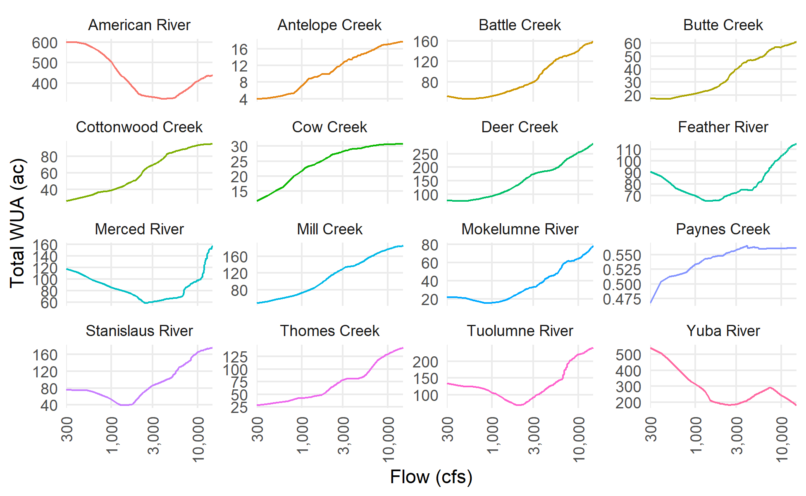<!-- -->

``` r
pd_rf_by_mainstem_summary <- pd_rf_by_mainstem |>
  group_by(river, flow_cfs) |>
  summarize(tot_length_ft = sum(length_ft),
            tot_wua_ft2 = sum(wua_ft2_pred),
            tot_wua_ac = tot_wua_ft2 / 43560,
            avg_wua_ft2_per_lf = tot_wua_ft2 / tot_length_ft,
            avg_wua_ft2_per_1000ft = 1000 * avg_wua_ft2_per_lf)
```

    ## `summarise()` has grouped output by 'river'. You can override using the
    ## `.groups` argument.

``` r
pd_rf_by_mainstem_summary |>
  ggplot() + 
  geom_line(aes(x = flow_cfs, y = tot_wua_ac, color = river)) + #, color=species, linetype=habitat)) + 
  facet_wrap(~river, scales="free_y") + 
  scale_x_log10(labels=scales::comma_format(), expand=c(0,0)) + 
  scale_y_continuous() + 
  theme(legend.position="none", 
        panel.grid.minor = element_blank(),
        axis.text.x = element_text(angle = 90, vjust = 0.5, hjust=1)) +
  xlab("Flow (cfs)") + ylab("Total WUA (ac)")
```

    ## Warning: Transformation introduced infinite values in continuous x-axis

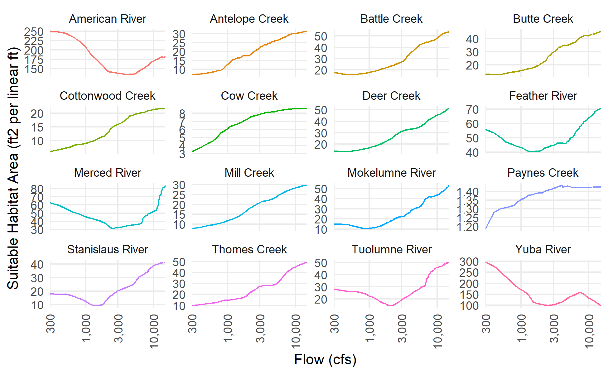<!-- -->

``` r
pd_rf_by_mainstem_summary |>
  ggplot() + 
  geom_line(aes(x = flow_cfs, y = avg_wua_ft2_per_lf, color = river)) + #, color=species, linetype=habitat)) + 
  facet_wrap(~river, scales="free_y") + 
  scale_x_log10(labels=scales::comma_format(), expand=c(0,0)) + 
  scale_y_continuous() + 
  theme(legend.position="none", 
        panel.grid.minor = element_blank(),
        axis.text.x = element_text(angle = 90, vjust = 0.5, hjust=1)) +
  xlab("Flow (cfs)") + ylab("Suitable Habitat Area (ft2 per linear ft)")
```

    ## Warning: Transformation introduced infinite values in continuous x-axis

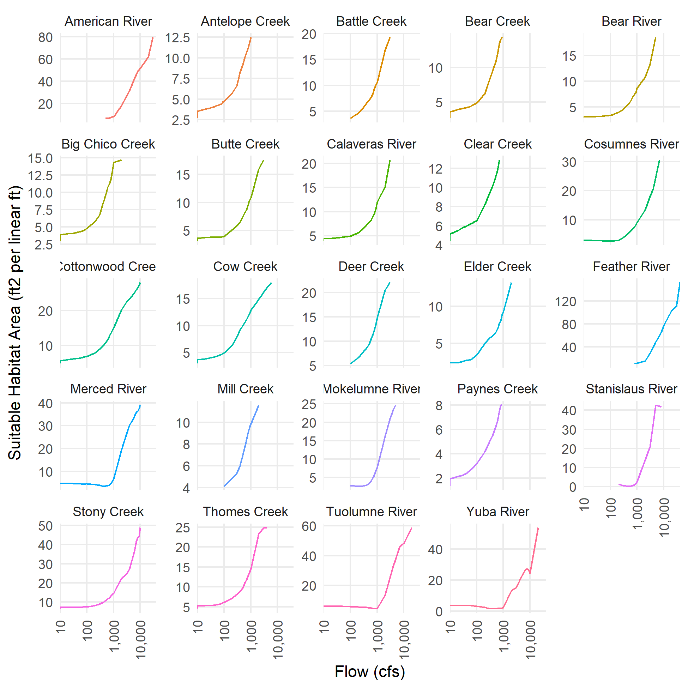<!-- -->

``` r
pd_rf_by_mainstem_summary |> 
  #inner_join(dsm_habitat_floodplain, by=join_by(river==river, flow_cfs==flow_cfs)) |> 
  #filter(river == "American River") |> 
  ggplot() +
  geom_line(aes(x = flow_cfs, y = tot_wua_ac, color='modeled')) + 
  geom_line(data=dsm_habitat_suitable_ac, aes(x = flow_cfs, y = value, color = name)) +  
  facet_wrap(~river) + #, scales="free_y") + 
  scale_x_log10(labels=scales::comma_format(), expand=c(0,0)) + 
  scale_y_log10(labels=scales::comma_format(), expand=c(0,0)) + 
  theme(legend.position="top", legend.title=element_blank(),
        panel.grid.minor = element_blank(),
        axis.text.x = element_text(angle = 90, vjust = 0.5, hjust=1)) +
  xlab("Flow (cfs)") + ylab("Total WUA (ac)")
```

    ## Warning: Transformation introduced infinite values in continuous x-axis
    ## Transformation introduced infinite values in continuous x-axis

    ## Warning: Removed 25 rows containing missing values (`geom_line()`).

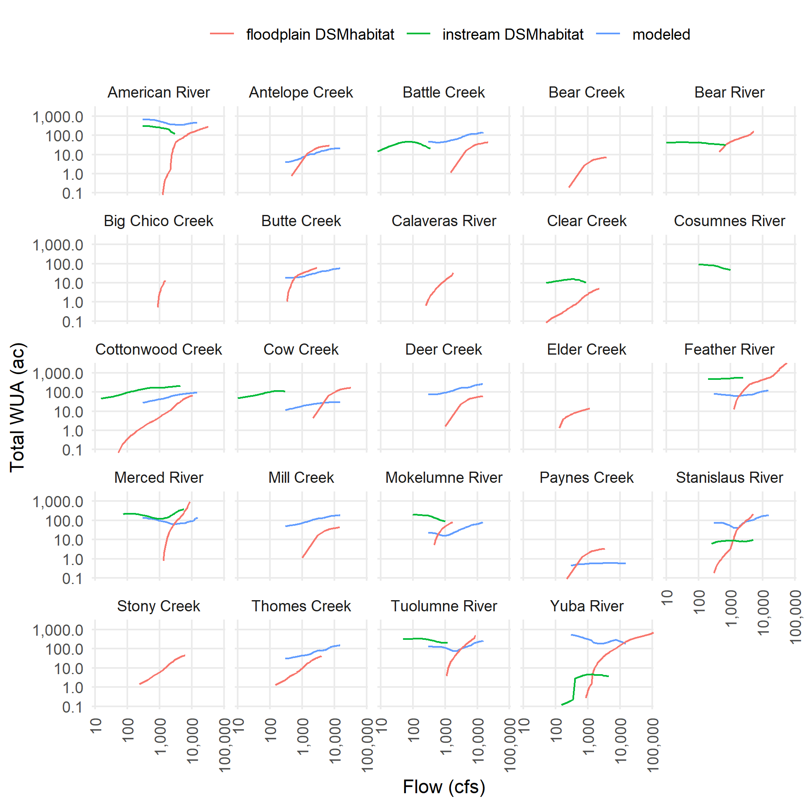<!-- -->

``` r
pd_rf_by_mainstem_summary |> 
  #inner_join(dsm_habitat_instream, by=join_by(river==river, flow_cfs==flow_cfs)) |> 
  ggplot() +
  geom_line(aes(x = flow_cfs, y = avg_wua_ft2_per_lf, color='modeled')) + 
  geom_line(data=dsm_habitat_wua_per_lf, aes(x = flow_cfs, y = value, color = name)) +  
  facet_wrap(~river) + #, scales="free_y") + 
  scale_x_log10(labels=scales::comma_format(), expand=c(0,0)) + 
  scale_y_log10(labels=scales::comma_format(), expand=c(0,0)) + 
  theme(legend.position="top", legend.title=element_blank(),
        panel.grid.minor = element_blank(),
        axis.text.x = element_text(angle = 90, vjust = 0.5, hjust=1)) +
  xlab("Flow (cfs)") + ylab("Suitable Habitat Area (ft2 per linear ft)")
```

    ## Warning: Transformation introduced infinite values in continuous x-axis

    ## Warning: Transformation introduced infinite values in continuous x-axis

    ## Warning: Removed 25 rows containing missing values (`geom_line()`).

<!-- -->
