Predictor Data Preparation and Consolidation
================
[Skyler Lewis](mailto:slewis@flowwest.com)
2024-09-04

- [Case study geographic scope](#case-study-geographic-scope)
  - [Import Flowline Geometry](#import-flowline-geometry)
- [Data Import](#data-import)
  - [Consolidating NHDPlusV2 Flowline
    Attributes](#consolidating-nhdplusv2-flowline-attributes)
  - [Range and watershed summary](#range-and-watershed-summary)
  - [Combine all attributes](#combine-all-attributes)
- [Join to Flowline Geometry](#join-to-flowline-geometry)
- [Maps of attribute data
  (exploratory)](#maps-of-attribute-data-exploratory)
- [Import catchments](#import-catchments)
- [Export GCS versions of spatial
  data](#export-gcs-versions-of-spatial-data)

## Case study geographic scope

*Selected HUCs*

- Lower Yuba 18020107
- Upper Yuba 18020125

``` r
selected_huc_8 <- c("18020107", "18020125")

# HUC-12 watersheds and higher level hierarchies
watersheds <-
  drive_file_by_id("1ncwKAUNoJUNkPLEy6NzrUKCYqVG681p-", vsizip=T) |>
  read_sf() |> 
  janitor::clean_names() |>
  filter(huc_8 %in% selected_huc_8) |>
  st_transform(habistat::const_proj_crs())
```

    ## ! Using an auto-discovered, cached token.

    ##   To suppress this message, modify your code or options to clearly consent to
    ##   the use of a cached token.

    ##   See gargle's "Non-interactive auth" vignette for more details:

    ##   <https://gargle.r-lib.org/articles/non-interactive-auth.html>

    ## ℹ The googledrive package is using a cached token for 'slewis@flowwest.com'.

    ## C:/Users/skylerlewis/Github/swc-habitat-suitability/data-raw/temp/WBD_Subwatershed.shp.zip already exists and will be used...

``` r
watersheds |> ggplot() + geom_sf()
```

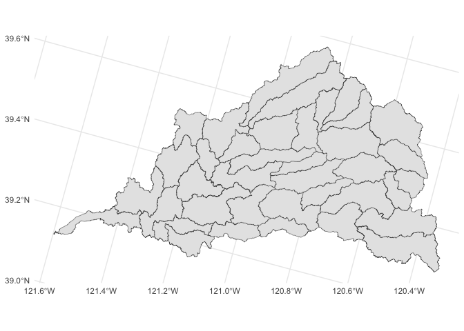<!-- -->

### Import Flowline Geometry

``` r
flowline_geom <- 
  drive_file_by_id("1UiG8AeMr6mFOw7Jx--LyNRzez7GsDhzK", vsizip=T) |>
  read_sf() |>
  janitor::clean_names() |>
  select(comid) |>
  st_zm()
```

    ## C:/Users/skylerlewis/Github/swc-habitat-suitability/data-raw/temp/NHDFlowline.zip already exists and will be used...

``` r
# note that these are in NAD83, not the project CRS
flowline_geom |> saveRDS(here::here("data-raw", "results", "flowline_geometries.Rds"))

flowline_geom |> usethis::use_data(overwrite = T)
```

    ## ✔ Setting active project to
    ##   "C:/Users/skylerlewis/Github/swc-habitat-suitability".

    ## ✔ Saving "flowline_geom" to "data/flowline_geom.rda".

    ## ☐ Document your data (see <https://r-pkgs.org/data.html>).

``` r
# projected version
flowline_geom_proj <- flowline_geom |> 
  st_transform(habistat::const_proj_crs())

flowline_geom_proj |> saveRDS(here::here("data-raw", "results", "flowline_geometries_proj.Rds"))

flowline_geom_proj |> usethis::use_data(overwrite = T)
```

    ## ✔ Saving "flowline_geom_proj" to "data/flowline_geom_proj.rda".
    ## ☐ Document your data (see <https://r-pkgs.org/data.html>).

``` r
#hs_flowlines <- flowline_geom
#usethis::use_data(hs_flowlines, overwrite = TRUE)
```

## Data Import

### Consolidating NHDPlusV2 Flowline Attributes

#### Flowlines

[NHDPlusV2 dataset](https://nhdplus.com/nhdplusv2/NHDPlusV2_home.php) as
retrieved from [US
EPA](https://www.epa.gov/waterdata/nhdplus-california-data-vector-processing-unit-18)

- [User
  Guide](https://www.epa.gov/system/files/documents/2023-04/NHDPlusV2_User_Guide.pdf)
- This is distinct from
  [NHDPlusHR](https://pubs.usgs.gov/of/2019/1096/ofr20191096.pdf) which
  is generated at a higher resolution; more computationally intensive
  and probably a greater level of detail than we need for this analysis.
- If routing is needed, [improved
  versions](https://www.sciencebase.gov/catalog/item/5b92790be4b0702d0e809fe5)
  exist for this purpose. R package
  [`nhdplusTools`](https://doi-usgs.github.io/nhdplusTools/) also
  provides routing functionality.

``` r
fcodes <- 
  drive_file_by_id("1DwrieA-jrEsY8hnuEMFAqeAjsu7sB1D7") |>
  foreign::read.dbf() |> 
  as_tibble() |> 
  janitor::clean_names() |>
  rename(fcode = f_code, fcode_desc = descriptio) |>
  mutate(ftype_desc = map(fcode_desc, function(x) str_split(x, ":", simplify=TRUE)[1])) |>
  unnest(ftype_desc) |>
  select(fcode, ftype_desc)

# flowline shapefile attribute table
drive_file_by_id("1UiG8AeMr6mFOw7Jx--LyNRzez7GsDhzK") |>
  archive::archive_extract(dir = here::here("data-raw", "temp"), file = "NHDFlowline.dbf")

flowline_table <- 
  foreign::read.dbf(here::here("data-raw", "temp", "NHDFlowline.dbf")) |>
  as_tibble() |>
  janitor::clean_names() |>
  select(comid, reachcode, gnis_id, gnis_name, lengthkm, ftype, fcode) |>
  mutate(rc_huc_8 = substr(reachcode, 1, 8),
         rc_huc_10 = substr(reachcode, 1, 10),
         rc_huc_12 = substr(reachcode, 1, 12)) |>
  inner_join(fcodes |> select(fcode, ftype_desc))
```

#### WBD (HUC-12) Watersheds

``` r
wbd_watersheds <- 
  drive_file_by_id("1ncwKAUNoJUNkPLEy6NzrUKCYqVG681p-", vsizip=T) |>
  read_sf() |> 
  st_transform(habistat::const_proj_crs()) |>
  janitor::clean_names() |>
  select(huc_8, huc_10, hu_10_name, huc_12, hu_12_type, hu_12_name, hu_12_ds)
```

    ## C:/Users/skylerlewis/Github/swc-habitat-suitability/data-raw/temp/WBD_Subwatershed.shp.zip already exists and will be used...

``` r
comid_huc_12 <- 
  flowline_geom_proj |> 
  st_join(wbd_watersheds, left=F, largest=T) |>
  st_drop_geometry()
```

    ## Warning: attribute variables are assumed to be spatially constant throughout
    ## all geometries

#### NHDPlusV2 tables

``` r
# # cumulative upstream area
# flowline_cumarea <- 
#   foreign::read.dbf("nhdplusv2/NHDPlusAttributes/CumulativeArea.dbf") |> 
#   as_tibble() |> 
#   janitor::clean_names() |>
#   rename(comid = com_id)

# flow routing attributes as described in https://www.usgs.gov/national-hydrography/value-added-attributes-vaas
drive_file_by_id("1sf3hKUmo6ZvJwnfyR9m4PoeY9V2n4hou") |>
  archive::archive_extract(dir = here::here("data-raw", "temp"))

flowline_vaattr <- 
  foreign::read.dbf(here::here("data-raw", "temp", "PlusFlowlineVAA.dbf")) |> 
  as_tibble() |> 
  transmute(comid = ComID, 
         hydro_seq = Hydroseq,
         reach_code = ReachCode,
         stream_level = StreamLeve, 
         stream_order = StreamOrde, 
         us_length_km = ArbolateSu,
         ds_length_km = Pathlength,
         da_area_sq_km = TotDASqKM, # using non-divergence-routed version as "default" 
         da_area_sq_km_div = DivDASqKM, # include both for clarity
         da_area_sq_km_tot = TotDASqKM, # include both for clarity
         divergence_ratio = DivDASqKM / TotDASqKM,
         reach_length_km = LengthKM,
         reach_length_ft = LengthKM * 1000 / 0.3048)

# slopes and endpoint elevations
flowline_slopes <- 
  foreign::read.dbf(here::here("data-raw", "temp", "elevslope.dbf")) |> 
  as_tibble() |> 
  mutate(slope = if_else(SLOPE==-9998, NA, SLOPE),
         elev_min = MINELEVSMO/100, # convert from cm to m
         elev_max = MAXELEVSMO/100) |>
  select(comid = COMID, slope, elev_min, elev_max)
```

#### NHDPlusV2 extension tables

``` r
# vogel method mean annual flow and mean annual velocity
drive_file_by_id("1SiiIXQmr4mFD4Q-EVp1-7K-wAAnMoJ94") |> 
  archive::archive_extract(dir = here::here("data-raw", "temp"))

vogel_flow <- 
  foreign::read.dbf(here::here("data-raw", "temp", "vogelflow.dbf")) |> 
  as_tibble() |>
  janitor::clean_names() |>
  mutate(across(maflowv:mavelv, function(x) if_else(x>=0, x, NA))) |>
  select(comid, vogel_q_ma_cfs = maflowv, vogel_v_ma_fps = mavelv)
```

``` r
# VPU attribute extension
drive_file_by_id("1loos7RIjkQR8RHQjvcKOL9M-TmyE1SFV") |> 
  archive::archive_extract(dir = here::here("data-raw", "temp"))

  # incremental precipitation at reach
loc_precip_annual <- 
  read_delim(here::here("data-raw", "temp", "IncrPrecipMA.txt")) |>
  mutate(comid = as.numeric(FeatureID), loc_ppt_mean_mm = PrecipV/100) |>
  select(comid, loc_ppt_mean_mm)
import_loc_precip <- function(m) {
  mm <- str_pad(m, width=2, pad="0")
  read_delim(here::here("data-raw", "temp", paste0("IncrPrecipMM", mm, ".txt"))) |>
    mutate(month = m) |>
    mutate(comid = as.numeric(FeatureID), loc_ppt_mean_mm = PrecipV/100) |>
    select(month, comid, loc_ppt_mean_mm)
}
loc_precip_monthly <- 
  seq(1,12,1) |> 
  map(import_loc_precip) |> 
  reduce(bind_rows) |>
  pivot_wider(names_from = month, names_prefix = "loc_ppt_mean_mm_", values_from = loc_ppt_mean_mm)

# cumulative precipitation in upstream drainage area
precip_annual <- 
  read_delim(here::here("data-raw", "temp", "CumTotPrecipMA.txt")) |>
  mutate(comid = as.numeric(ComID), da_ppt_mean_mm = PrecipVC/100) |>
  select(comid, da_ppt_mean_mm)
import_precip <- function(m) {
  mm <- str_pad(m, width=2, pad="0")
  read_delim(here::here("data-raw", "temp", paste0("CumTotPrecipMM", mm, ".txt"))) |>
    mutate(month = m) |>
    mutate(comid = as.numeric(ComID), da_ppt_mean_mm = PrecipVC/100) |>
    select(month, comid, da_ppt_mean_mm)
}
precip_monthly <- 
  seq(1,12,1) |> 
  map(import_precip) |> 
  reduce(bind_rows) |>
  pivot_wider(names_from = month, names_prefix = "da_ppt_mean_mm_", values_from = da_ppt_mean_mm)
```

``` r
# EROM method mean annual and monthly flows
drive_file_by_id("1VUYyewjm-0nxUxyBWA7-Ch8H1fni55N0") |> 
  archive::archive_extract(dir = here::here("data-raw", "temp"))

erom_annual <- 
  foreign::read.dbf(here::here("data-raw", "temp", "EROM_MA0001.DBF")) |>
  as_tibble() |>
  select(comid = ComID, erom_q_ma_cfs = Q0001E, erom_v_ma_fps = V0001E, 
         #temp = Temp0001, ppt = PPT0001, pet = PET0001, qetloss = QLoss0001,
         #catchment_lat = Lat, catchment_sqkm = AreaSqKm,
         ) |>
  mutate(across(erom_q_ma_cfs:erom_v_ma_fps, function(x) if_else(x>=0, x, NA)))
import_erom <- function(m) {
  mm <- str_pad(m, width=2, pad="0")
  foreign::read.dbf(here::here("data-raw", "temp", paste0("EROM_", mm, "0001.dbf"))) |>
    as_tibble() |>
    mutate(month = m) |>
    select(month, comid = ComID, erom_q_ma_cfs = Q0001E, erom_v_ma_fps = V0001E, 
           #temp = Temp0001, ppt = PPT0001, pet = PET0001, qetloss = QLoss0001,
           #catchment_lat = Lat, catchment_sqkm = AreaSqKm,
           ) |> 
    mutate(across(erom_q_ma_cfs:erom_v_ma_fps, function(x) if_else(x>=0, x, NA)))
}
erom_monthly <- 
  seq(1,12,1) |> 
  map(import_erom) |> 
  reduce(bind_rows)
erom_monthly_flows <- erom_monthly |> pivot_wider(names_from = month, names_prefix = "erom_q_ma_cfs_", values_from = erom_q_ma_cfs)
erom_monthly_velocities <- erom_monthly |> pivot_wider(names_from = month, names_prefix = "erom_v_ma_fps_", values_from = erom_v_ma_fps)
```

#### Third party NHDPlusV2 extension tables from USGS MD-DE-DC Water Science Center

<https://www.sciencebase.gov/catalog/item/5669a79ee4b08895842a1d47>

Wieczorek, M.E., Jackson, S.E., and Schwarz, G.E., 2018, Select
Attributes for NHDPlus Version 2.1 Reach Catchments and Modified Network
Routed Upstream Watersheds for the Conterminous United States (ver. 4.0,
August 2023): U.S. Geological Survey data release,
<https://doi.org/10.5066/F7765D7V>

<https://www.sciencebase.gov/catalog/item/57976a0ce4b021cadec97890>

``` r
# sinuosity from https://www.sciencebase.gov/catalog/item/57976a0ce4b021cadec97890
flowline_sinuosity <- 
  drive_file_by_id("1efPQ3C9I6UtJdgQUMSS-dbauEO5a6ykP") |>
  archive::archive_read(file = "Sinuousity_CONUS.TXT") |>
  read_delim() |>
  janitor::clean_names() |>
  filter(comid %in% flowline_table$comid)

# catchment characteristics from https://www.sciencebase.gov/catalog/item/57976a0ce4b021cadec97890
da_suppl_attrs <- # using divergence routed version
  drive_file_by_id("1yKSz9tznTYMei9axkmFJXo2McwcePErG") |>
  archive::archive_read(file = "BASIN_CHAR_ACC_CONUS.TXT") |>
  read_delim() |>
  filter(COMID %in% flowline_table$comid) |>
  select(comid = COMID, 
         da_avg_slope = ACC_BASIN_SLOPE, 
         da_elev_mean = ACC_ELEV_MEAN,
         da_elev_min = ACC_ELEV_MIN,
         da_elev_max = ACC_ELEV_MAX) |>
  mutate(da_elev_rel = da_elev_max - da_elev_min)
```

#### StreamCat extension tables

<https://gaftp.epa.gov/epadatacommons/ORD/NHDPlusLandscapeAttributes/StreamCat/HydroRegions/>

<https://www.epa.gov/national-aquatic-resource-surveys/streamcat-web-tool-table-view>

``` r
# supplemental data from Streamcat
streamcat_zip <- drive_file_by_id("1da-_LuHsKlNnkeAeG1uiJjzs8gZEcbiU")

bfi <- 
  archive::archive_read(streamcat_zip, file = "BFI_Region18.csv") |>
  read_csv() |>
  select(comid = COMID,
         loc_bfi = BFICat,
         da_bfi = BFIWs
         )
twi <- 
  archive::archive_read(streamcat_zip, file = "WetIndx_Region18.csv") |>
  read_csv() |>
  select(comid = COMID,
         loc_twi = WetIndexCat,
         da_twi = WetIndexWs
         )
soiltext <- 
  archive::archive_read(streamcat_zip, file = "STATSGO_Set1_Region18.csv") |>
  read_csv() |>
  select(comid = COMID,
         loc_pct_clay = ClayCat,
         da_pct_clay = ClayWs,
         loc_pct_sand = SandCat,
         da_pct_sand = SandWs,
         )
soilprop <- 
  archive::archive_read(streamcat_zip, file = "STATSGO_Set2_Region18.csv") |>
  read_csv() |>
  select(comid = COMID,
         loc_permeability = PermCat,
         loc_bedrock_depth = RckDepCat,
         da_permeability = PermWs,
         da_bedrock_depth = RckDepWs,
         )
kffact <- 
  archive::archive_read(streamcat_zip, file = "Kffact_Region18.csv") |>
  read_csv() |>
  select(comid = COMID,
         loc_k_erodibility = KffactCat,
         da_k_erodibility = KffactWs,
         )
precip <- 
  archive::archive_read(streamcat_zip, file = "PRISM_1981_2010_Region18.csv") |>
  read_csv() |>
  select(comid = COMID,
         loc_precip = Precip8110Cat,
         da_precip = Precip8110Ws,
         )
runoff <- 
  archive::archive_read(streamcat_zip, file = "Runoff_Region18.csv") |>
  read_csv() |>
  select(comid = COMID,
         loc_runoff = RunoffCat,
         da_runoff = RunoffWs,
         )
bankfull <- 
  archive::archive_read(streamcat_zip, file = "Bankfull_Region18.csv") |>
  read_csv() |>
  select(comid = COMID,
         bf_width_m = BANKFULL_WIDTH_M,
         bf_depth_m = BANKFULL_DEPTH_M,
         ) |>
  mutate(bf_w_d_ratio = bf_width_m/bf_depth_m)
# this bankfull dataset is incomplete so best to supplement with the coarser calculation

streamcat_data <- 
  reduce(list(bfi, twi, soiltext, soilprop, kffact, precip, runoff, bankfull),
         function(x, y) left_join(x, y, by=join_by(comid)))
```

#### coarse catchment NDVI data

Very coarse vegetation dataset from MODIS

documentation:
<https://gaftp.epa.gov/Exposure/CurveNumberNDVI/READNow.pdf>

download: <https://gaftp.epa.gov/Exposure/CurveNumberNDVI/>

``` r
catchment_ndvi_ts <- 
  drive_file_by_id("1WZqTooktkCIPfpA2rzxNTlqvO2YP6cef") |>
  archive::archive_read(file = "18-California-NDVI.csv") |>
  read_csv() |>
  filter(ComID %in% flowline_table$comid) |>
  pivot_longer(cols=-ComID, names_to="modis_date", names_transform = lubridate::ymd, values_to="ndvi") |>
  rename(comid = ComID)

catchment_ndvi <- 
  catchment_ndvi_ts |> 
  group_by(comid) |>
  summarize(mean_ndvi = mean(ndvi)/10000)

catchment_ndvi
```

    ## # A tibble: 140,618 × 2
    ##     comid mean_ndvi
    ##     <dbl>     <dbl>
    ##  1 341095     0.287
    ##  2 341097     0.275
    ##  3 341099     0.322
    ##  4 341101     0.253
    ##  5 341103     0.186
    ##  6 341105     0.258
    ##  7 341107     0.287
    ##  8 341745     0.272
    ##  9 342395     0.225
    ## 10 342397     0.310
    ## # ℹ 140,608 more rows

#### Aquatic Species

CDFW data:
<https://data-cdfw.opendata.arcgis.com/datasets/CDFW>::aquatic-species-list-ace-ds2740-2/explore
TNC data:
<https://www.scienceforconservation.org/products/california-freshwater-species-database>

``` r
aquatic_species_cdfw <- 
  readRDS(here::here("data-raw", "results", "attr_cdfw_aquatic_species_rank.Rds")) |> 
  glimpse()
```

    ## Rows: 178,868
    ## Columns: 2
    ## $ comid          <int> 20245062, 24085230, 22226684, 22226720, 22226732, 22226…
    ## $ bio_aq_rank_sw <int> NA, NA, 5, 5, 5, 5, 5, 5, 5, 5, 5, 5, 5, 5, 5, 5, 5, 5,…

``` r
aquatic_species_tnc <- 
  readRDS(here::here("data-raw", "results", "attr_tnc_aquatic_species_rank.Rds")) |> 
  glimpse()
```

    ## Rows: 178,868
    ## Columns: 32
    ## $ comid                      <int> 20245062, 24085230, 22226684, 22226720, 222…
    ## $ species                    <dbl> NA, NA, 281, 281, 281, 281, 281, 281, 139, …
    ## $ species_fish               <dbl> NA, NA, 16, 16, 16, 16, 16, 16, 11, 11, 11,…
    ## $ species_crust              <dbl> NA, NA, 3, 3, 3, 3, 3, 3, 0, 0, 0, 0, 0, 0,…
    ## $ species_herps              <dbl> NA, NA, 16, 16, 16, 16, 16, 16, 14, 14, 14,…
    ## $ species_inverts            <dbl> NA, NA, 136, 136, 136, 136, 136, 136, 70, 7…
    ## $ species_mollusks           <dbl> NA, NA, 6, 6, 6, 6, 6, 6, 2, 2, 2, 2, 2, 2,…
    ## $ species_plants             <dbl> NA, NA, 37, 37, 37, 37, 37, 37, 24, 24, 24,…
    ## $ species_birds              <dbl> NA, NA, 62, 62, 62, 62, 62, 62, 13, 13, 13,…
    ## $ species_mammals            <dbl> NA, NA, 5, 5, 5, 5, 5, 5, 5, 5, 5, 5, 5, 5,…
    ## $ species_mollusks_crust     <dbl> NA, NA, 9, 9, 9, 9, 9, 9, 2, 2, 2, 2, 2, 2,…
    ## $ species_endemic            <dbl> NA, NA, 32, 32, 32, 32, 32, 32, 16, 16, 16,…
    ## $ species_endemic_fish       <dbl> NA, NA, 3, 3, 3, 3, 3, 3, 1, 1, 1, 1, 1, 1,…
    ## $ species_endemic_crust      <dbl> NA, NA, 1, 1, 1, 1, 1, 1, 0, 0, 0, 0, 0, 0,…
    ## $ species_endemic_herps      <dbl> NA, NA, 2, 2, 2, 2, 2, 2, 2, 2, 2, 2, 2, 2,…
    ## $ species_endemic_inverts    <dbl> NA, NA, 26, 26, 26, 26, 26, 26, 13, 13, 13,…
    ## $ species_endemic_mollusks   <dbl> NA, NA, 0, 0, 0, 0, 0, 0, 0, 0, 0, 0, 0, 0,…
    ## $ species_endemic_plants     <dbl> NA, NA, 0, 0, 0, 0, 0, 0, 0, 0, 0, 0, 0, 0,…
    ## $ species_endemic_birds      <dbl> NA, NA, 0, 0, 0, 0, 0, 0, 0, 0, 0, 0, 0, 0,…
    ## $ species_endemic_mammals    <dbl> NA, NA, 0, 0, 0, 0, 0, 0, 0, 0, 0, 0, 0, 0,…
    ## $ species_vulnerable         <dbl> NA, NA, 66, 66, 66, 66, 66, 66, 36, 36, 36,…
    ## $ species_listed             <dbl> NA, NA, 6, 6, 6, 6, 6, 6, 2, 2, 2, 2, 2, 2,…
    ## $ species_endemic_vulnerable <dbl> NA, NA, 11, 11, 11, 11, 11, 11, 4, 4, 4, 4,…
    ## $ species_endemic_listed     <dbl> NA, NA, 1, 1, 1, 1, 1, 1, 0, 0, 0, 0, 0, 0,…
    ## $ genus                      <dbl> NA, NA, 224, 224, 224, 224, 224, 224, 120, …
    ## $ family                     <dbl> NA, NA, 111, 111, 111, 111, 111, 111, 76, 7…
    ## $ tax_order                  <dbl> NA, NA, 56, 56, 56, 56, 56, 56, 39, 39, 39,…
    ## $ tax_class                  <dbl> NA, NA, 15, 15, 15, 15, 15, 15, 13, 13, 13,…
    ## $ phylum                     <dbl> NA, NA, 5, 5, 5, 5, 5, 5, 5, 5, 5, 5, 5, 5,…
    ## $ species_current            <dbl> NA, NA, 227, 227, 227, 227, 227, 227, 110, …
    ## $ species_historical         <dbl> NA, NA, 64, 64, 64, 64, 64, 64, 30, 30, 30,…
    ## $ species_other              <dbl> NA, NA, 36, 36, 36, 36, 36, 36, 29, 29, 29,…

#### Width Data

Data source: <https://hydro.iis.u-tokyo.ac.jp/~yamadai/MERIT_Hydro/>

``` r
width_data <- readRDS(here::here("data-raw", "source", "width_data", "merit_width_dataset_comid_join.Rds")) 
width_data <- width_data |> group_by(comid) |> summarize(merit_width_m = mean(merit_width_m)) |> ungroup()
```

#### Stream Classifications

Hydrologic stream classifications from
<https://doi.org/10.1111/1752-1688.12504>

These classifications were developed using a [series of catchment
characteristics](https://californiawaterblog.com/2017/07/16/a-simplified-method-to-classify-streams-and-improve-californias-water-management/):

\-[Classification
scheme](https://californiawaterblog.com/wp-content/uploads/2017/07/lane_1.png)
-[Final
result](https://github.com/ceff-tech/eflow-readme/raw/master/FinalCAClassification.jpg)

``` r
hyd_cls_tbl <- tribble(~class, ~hyd_cls, ~hyd_cat, ~hyd_cls_descrip,
                       1, "SM", 1, "Snowmelt",
                       2, "HSR", 2, "High-volume snowmelt and rain",
                       3, "LSR", 2, "Low-volume snowmelt and rain",
                       8, "RGW", 3, "Rain and seasonal groundwater",
                       4, "WS", 3, "Winter storms",
                       5, "GW", 2, "Groundwater", 
                       6, "PGR", 3, "Perennial groundwater and rain",
                       7, "FER", 3, "Flashy, ephemeral rain",
                       9, "HLP", 1, "High elevation, low precipitation"
                       )
hyd_cls <- drive_file_by_id("1qABq_Y-ZzuH_Am6pkqpno4K5nGYhYd1R", vsizip=T) |>
  read_sf() |>
  janitor::clean_names() |>
  st_drop_geometry() |>
  left_join(hyd_cls_tbl, by=join_by(class)) |>
  group_by(comid) |> mutate(idx=row_number()) |> filter(idx==1) |> ungroup() |>
  mutate(hyd_cls = factor(hyd_cls, levels=hyd_cls_tbl$hyd_cls, labels=hyd_cls_tbl$hyd_cls_descrip),
         hyd_cat = factor(hyd_cat, levels=c(1,2,3), labels=c("Snowmelt", "Mixed", "Rain"))) |>
  select(comid, hyd_cat, hyd_cls) |>
  glimpse()
```

    ## C:/Users/skylerlewis/Github/swc-habitat-suitability/data-raw/temp/Final_Classification_9CLASS.zip already exists and will be used...

    ## Rows: 67,163
    ## Columns: 3
    ## $ comid   <dbl> 8200535, 8200545, 8200931, 8201087, 8201891, 8202565, 8202567,…
    ## $ hyd_cat <fct> Rain, Rain, Rain, Rain, Rain, Rain, Rain, Rain, Rain, Rain, Ra…
    ## $ hyd_cls <fct> "Flashy, ephemeral rain", "Flashy, ephemeral rain", "Flashy, e…

#### Natural Flows Data and Peak Flow Magnitudes

``` r
nf <- 
  drive_file_by_id("1P9vH9VXbPV9jYuFq35yF3elBRatYKQmU", vsizip=F) |>
  archive::archive_read() |>
  read_csv() |>
  filter(comid %in% flowline_table$comid)
```

    ## C:/Users/skylerlewis/Github/swc-habitat-suitability/data-raw/temp/ffm-final-v1.2.1.zip already exists and will be used...

    ## Rows: 8151537 Columns: 15
    ## ── Column specification ────────────────────────────────────────────────────────
    ## Delimiter: ","
    ## chr  (5): ffm, wyt, unit, source, alteration
    ## dbl (10): comid, p10, p25, p50, p75, p90, gage_id, observed_years, observed_...
    ## 
    ## ℹ Use `spec()` to retrieve the full column specification for this data.
    ## ℹ Specify the column types or set `show_col_types = FALSE` to quiet this message.

``` r
# A selection of potentially useful flow frequency metrics. There are many other potential options
nf_ffm <- reduce(list(
  # dry season baseflow in a dry water year
  nf |> 
    filter(ffm=="ds_mag_50" & source=="model" & wyt=="dry") |> 
    select(comid, nf_bfl_dry_cfs_dry = p50),
  # dry season baseflow in moderate water year
  nf |> 
    filter(ffm=="ds_mag_50" & source=="model" & wyt=="moderate") |> 
    select(comid, nf_bfl_dry_cfs = p50),
  # wet season baseflow in moderate water year
  nf |> 
    filter(ffm=="wet_bfl_mag_10" & source=="model" & wyt=="moderate") |> 
    select(comid, nf_bfl_wet_cfs = p50),
  # start date of wet season in moderate water year
  nf |> 
    filter(ffm=="wet_tim" & source=="model" & wyt=="moderate") |> 
    select(comid, nf_wet_start = p50),
  # start date of wet season in moderate water year
  nf |> 
    filter(ffm=="wet_bfl_dur" & source=="model" & wyt=="moderate") |> 
    select(comid, nf_wet_dur = p50)
  ), left_join, by=join_by(comid))

# Peak flows Q2, Q5, Q10 (cfs) 
peak_flows <- reduce(list(
  # start date of wet season in moderate water year
  nf |> 
    filter(ffm=="peak_2" & source=="model") |> 
    select(comid, peak_q2_cfs = p50),
  # start date of wet season in moderate water year
  nf |> 
    filter(ffm=="peak_5" & source=="model") |> 
    select(comid, peak_q5_cfs = p50),
  # start date of wet season in moderate water year
  nf |> 
    filter(ffm=="peak_10" & source=="model") |> 
    select(comid, peak_q10_cfs = p50)
  ), left_join, by=join_by(comid))
```

#### Terrain-derived attributes

Import attributes calculated in `terrain-attributes.Rmd`

mTPI (multi-scale topographic position index)

``` r
attr_mtpi <- 
  readRDS(here::here("data-raw", "results", "attr_mtpi.Rds")) |> 
  glimpse()
```

    ## Rows: 115,179
    ## Columns: 2
    ## $ comid      <dbl> 8320105, 8320111, 8321245, 8320119, 8320125, 8320133, 83201…
    ## $ mtpi30_min <dbl> -27, -24, -27, -25, -26, -30, -25, -21, -21, -47, -34, -51,…

#### Valley Bottom Calculations via Slope Cutoff

``` r
valley_bottoms <- 
  readRDS(here::here("data-raw", "results", "attr_vb1.Rds")) |> 
  select(comid, vb_width_transect) |> 
  filter(vb_width_transect>0) |> 
  glimpse()
```

    ## Rows: 1,907
    ## Columns: 2
    ## $ comid             <dbl> 8062581, 8061239, 8061235, 8062351, 8061205, 8061189…
    ## $ vb_width_transect <dbl> 47.45505, 27.55365, 555.54340, 99.94706, 68.64580, 1…

#### Levee Confinement Calculations

``` r
levee_confinement <- 
  readRDS(here::here("data-raw", "results", "attr_frac_leveed.Rds")) |> 
  glimpse()
```

    ## Rows: 178,868
    ## Columns: 3
    ## $ comid                        <int> 20245062, 24085230, 22226684, 22226720, 2…
    ## $ frac_leveed_longitudinal     <dbl> 0, 0, 0, 0, 0, 0, 0, 0, 0, 0, 0, 0, 0, 0,…
    ## $ lateral_levee_confinement_ft <dbl> NA, NA, NA, NA, NA, NA, NA, NA, NA, NA, N…

#### Geomorph class (experimental!)

``` r
geomorph_class <- 
  readRDS(here::here("data-raw", "results", "attr_geomorph_class.Rds")) |> 
  glimpse()
```

    ## Rows: 31,073
    ## Columns: 8
    ## $ comid             <dbl> 7918025, 7918031, 7918595, 7918019, 7918027, 7918039…
    ## $ geomorph_class    <fct> "Unconfined, gravel-cobble, riffle-pool", "Confined,…
    ## $ geomorph_confined <fct> Unconfined, Confined, Confined, Confined, Confined, …
    ## $ geomorph_uniform  <lgl> FALSE, TRUE, TRUE, TRUE, TRUE, TRUE, FALSE, FALSE, T…
    ## $ geomorph_steppool <lgl> FALSE, FALSE, FALSE, FALSE, FALSE, FALSE, FALSE, FAL…
    ## $ geomorph_riffles  <lgl> TRUE, FALSE, FALSE, FALSE, FALSE, FALSE, TRUE, FALSE…
    ## $ geomorph_gravel   <lgl> TRUE, TRUE, TRUE, TRUE, TRUE, TRUE, TRUE, TRUE, TRUE…
    ## $ geomorph_spawning <lgl> TRUE, FALSE, FALSE, FALSE, FALSE, FALSE, TRUE, FALSE…

#### HQT boundaries

``` r
cv_alluvial <- read_sf(file.path("/vsizip", here::here("data-raw", "source", "hqt", "Alluvial_Bnd.shp.zip"))) |> 
  st_transform("ESRI:102039") |> 
  select(geometry)
# valley_lowland <- read_sf("hqt/hqt_valley_lowland.kml") |> 
#   st_transform("ESRI:102039") |>
#   mutate(hqt_gradient_class = "Valley Foothill")
valley_lowland <- readRDS(here::here("data-raw", "source", "hqt", "hqt_valley_lowland.Rds")) |> 
  st_transform("ESRI:102039") |> 
  st_sf() |>
  st_set_geometry("geometry") |>
  mutate(hqt_gradient_class = "Valley Lowland")
valley_foothill <- st_difference(cv_alluvial, valley_lowland) |> 
  mutate(hqt_gradient_class = "Valley Foothill")
```

    ## Warning: attribute variables are assumed to be spatially constant throughout
    ## all geometries

``` r
hqt_gradient_class <- bind_rows(valley_lowland, valley_foothill) 
hqt_gradient_class |> saveRDS(here::here("data-raw", "results", "hqt_gradient_class.Rds"))
hqt_gradient_class |> ggplot() + geom_sf(aes(fill = hqt_gradient_class))
```

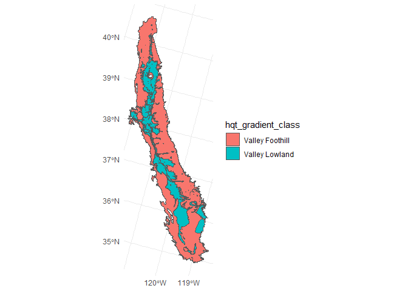<!-- -->

``` r
hqt_cls <- flowline_geom |>
  st_zm() |>
  st_transform("ESRI:102039") |> 
  st_point_on_surface() |>
  st_join(hqt_gradient_class) |>
  st_drop_geometry() |> 
  select(comid, hqt_gradient_class) |>
  mutate(hqt_gradient_class = coalesce(hqt_gradient_class, "Bedrock"),
         hqt_gradient_class = factor(hqt_gradient_class, levels=c("Valley Lowland", "Valley Foothill", "Bedrock"))) |>
  glimpse()
```

    ## Warning: st_point_on_surface assumes attributes are constant over geometries

    ## Rows: 178,868
    ## Columns: 2
    ## $ comid              <int> 20245062, 24085230, 22226684, 22226720, 22226732, 2…
    ## $ hqt_gradient_class <fct> Bedrock, Bedrock, Bedrock, Bedrock, Bedrock, Bedroc…

#### UCD PISCES Ranges

``` r
# Shapefiles downloaded from PISCES 2.0.4
pisces_ranges <- tribble(~sp_id, ~species, ~dataset, ~filename,
        "WR",  "Central Valley Winter Run Chinook Salmon",    "Historical", "Oncorhynchus_tshawytscha_SOT05_historical_expert_16.shp.zip",
        "WR",  "Central Valley Winter Run Chinook Salmon",    "Extant",     "Oncorhynchus_tshawytscha_SOT05_extant_1.shp.zip",
        "WR",  "Central Valley Winter Run Chinook Salmon",    "Observed",   "Oncorhynchus_tshawytscha_SOT05_observed_2.shp.zip",
        "SR",  "Central Valley Spring Run Chinook Salmon",    "Historical", "Oncorhynchus_tshawytscha_SOT06_historical_expert_16.shp.zip",
        "SR",  "Central Valley Spring Run Chinook Salmon",    "Extant",     "Oncorhynchus_tshawytscha_SOT06_extant_1.shp.zip",
        "SR",  "Central Valley Spring Run Chinook Salmon",    "Observed",   "Oncorhynchus_tshawytscha_SOT06_observed_2.shp.zip",
        "LFR", "Central Valley Late Fall Run Chinook Salmon", "Historical", "Oncorhynchus_tshawytscha_SOT07_historical_expert_16.shp.zip",
        "LFR", "Central Valley Late Fall Run Chinook Salmon", "Extant",     "Oncorhynchus_tshawytscha_SOT07_extant_1.shp.zip",
        "FR",  "Central Valley Fall Run Chinook Salmon",      "Historical", "Oncorhynchus_tshawytscha_SOT08_historical_expert_16.shp.zip",
        "FR",  "Central Valley Fall Run Chinook Salmon",      "Extant",     "Oncorhynchus_tshawytscha_SOT08_extant_1.shp.zip") |>
  mutate(filepath = file.path("/vsizip", here::here("data-raw/source/ucd_pisces_ranges", filename))) |>
  mutate(result = map(filepath, read_sf)) |>
  unnest(result) |>
  janitor::clean_names() |>
  st_sf() |> 
  st_transform(habistat::const_proj_crs())

# Summarize Ranges
range_historical <- 
  pisces_ranges |> 
  filter(dataset=="Historical") |> 
  summarize() |> 
  st_union()

range_extant <- 
  pisces_ranges |> 
  filter(dataset=="Extant") |> 
  summarize() |> 
  st_union()

ggplot() +
  geom_sf(data=range_historical, aes(fill = "Historical")) +
  geom_sf(data=range_extant, aes(fill = "Extant"))
```

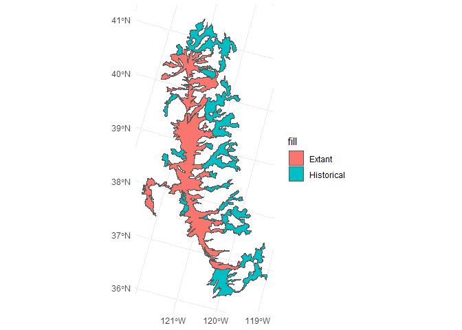<!-- -->

``` r
# Ranges by COMID
pisces_range_search <- function(s, d) {
  rng <- 
    pisces_ranges |>
    filter(sp_id==s & dataset==d) 
  res <- flowline_geom_proj |>
    st_drop_geometry() |>
    mutate(range = comid %in% st_filter(flowline_geom_proj, rng)$comid) 
  return(res)
  #return(flowlines$comid %in% st_filter(flowlines, rng)$comid)
}

pisces_ranges_comid <- 
  pisces_ranges |>
  st_drop_geometry() |>
  group_by(sp_id, dataset) |>
  summarize() |>
  ungroup() |>
  mutate(result = map2(sp_id, dataset, pisces_range_search)) |>
  unnest(result) |>
  pivot_wider(names_from = c(sp_id, dataset), 
              values_from = range,
              names_glue = "range_{sp_id}_{dataset}") |>
  mutate(range_cvchinook_historical = (range_FR_Historical | range_LFR_Historical | range_SR_Historical | range_WR_Historical),
         range_cvchinook_extant = (range_FR_Extant | range_LFR_Extant | range_SR_Extant | range_WR_Extant)) |>
  glimpse()
```

    ## `summarise()` has grouped output by 'sp_id'. You can override using the
    ## `.groups` argument.

    ## Rows: 178,868
    ## Columns: 13
    ## $ comid                      <int> 20245062, 24085230, 22226684, 22226720, 222…
    ## $ range_FR_Extant            <lgl> FALSE, FALSE, FALSE, FALSE, FALSE, FALSE, F…
    ## $ range_FR_Historical        <lgl> FALSE, FALSE, FALSE, FALSE, FALSE, FALSE, F…
    ## $ range_LFR_Extant           <lgl> FALSE, FALSE, FALSE, FALSE, FALSE, FALSE, F…
    ## $ range_LFR_Historical       <lgl> FALSE, FALSE, FALSE, FALSE, FALSE, FALSE, F…
    ## $ range_SR_Extant            <lgl> FALSE, FALSE, FALSE, FALSE, FALSE, FALSE, F…
    ## $ range_SR_Historical        <lgl> FALSE, FALSE, FALSE, FALSE, FALSE, FALSE, F…
    ## $ range_SR_Observed          <lgl> FALSE, FALSE, FALSE, FALSE, FALSE, FALSE, F…
    ## $ range_WR_Extant            <lgl> FALSE, FALSE, FALSE, FALSE, FALSE, FALSE, F…
    ## $ range_WR_Historical        <lgl> FALSE, FALSE, FALSE, FALSE, FALSE, FALSE, F…
    ## $ range_WR_Observed          <lgl> FALSE, FALSE, FALSE, FALSE, FALSE, FALSE, F…
    ## $ range_cvchinook_historical <lgl> FALSE, FALSE, FALSE, FALSE, FALSE, FALSE, F…
    ## $ range_cvchinook_extant     <lgl> FALSE, FALSE, FALSE, FALSE, FALSE, FALSE, F…

### Range and watershed summary

From watershed_delineation.R

``` r
cv_mainstems <- readRDS(here::here("data-raw", "results", "cv_mainstems.Rds"))

cv_mainstems_comid <- cv_mainstems |>
  st_drop_geometry()

cv_watersheds <- readRDS(here::here("data-raw", "results", "cv_watersheds.Rds"))

cv_watersheds_comid <- 
  habistat::flowline_geom_proj |>
  st_zm() |>
  #st_point_on_surface() |>
  st_join(cv_watersheds, largest=T) |>
  st_drop_geometry() 
```

    ## Warning: attribute variables are assumed to be spatially constant throughout
    ## all geometries

### Combine all attributes

``` r
# gravitational constant, cm/s2
g_cgs <- 981
# grain density and water density, g/cm3
rho_s_cgs <- 2.65
rho_cgs <- 1.00
# kinematic viscosity of water, cm2/s
nu_cgs <- 0.01

flowline_attributes <-
  flowline_table |>
  left_join(comid_huc_12, by=join_by(comid), relationship="one-to-one") |>
  left_join(flowline_vaattr, by=join_by(comid), relationship="one-to-one") |> 
  left_join(flowline_slopes, by=join_by(comid), relationship="one-to-one") |>
  mutate(stream_power = slope * da_area_sq_km) |>
  left_join(precip_annual, by=join_by(comid), relationship="one-to-one") |>
  left_join(loc_precip_annual, by=join_by(comid), relationship="one-to-one") |>
  left_join(vogel_flow, by=join_by(comid), relationship="one-to-one") |>
  left_join(erom_annual, by=join_by(comid), relationship="one-to-one") |>
  left_join(flowline_sinuosity, by=join_by(comid), relationship="one-to-one") |>
  left_join(da_suppl_attrs, by=join_by(comid), relationship="one-to-one") |> 
  left_join(streamcat_data, by=join_by(comid), relationship="one-to-one") |>
  left_join(catchment_ndvi, by=join_by(comid), relationship="one-to-one") |> 
  left_join(aquatic_species_cdfw, by=join_by(comid), relationship="one-to-one") |> 
  left_join(aquatic_species_tnc, by=join_by(comid), relationship="one-to-one") |>  
  left_join(hyd_cls, by=join_by(comid), relationship="one-to-one") |>
  left_join(nf_ffm, by=join_by(comid), relationship="one-to-one") |>
  left_join(peak_flows, by=join_by(comid), relationship="one-to-one") |>
  left_join(width_data, by=join_by(comid), relationship="one-to-one") |>
  left_join(valley_bottoms, by=join_by(comid), relationship="one-to-one") |>
  left_join(levee_confinement, by=join_by(comid), relationship="one-to-one") |>
  left_join(geomorph_class, by=join_by(comid), relationship="one-to-one") |>
  left_join(hqt_cls, by=join_by(comid), relationship="one-to-one") |>
  left_join(pisces_ranges_comid, by=join_by(comid), relationship="one-to-one") |>
  left_join(cv_mainstems_comid, by=join_by(comid), relationship="one-to-one") |>
  left_join(cv_watersheds_comid, by=join_by(comid), relationship="one-to-one") |>
  # fill in gaps in the RF bankfull estimates with the simple Bieger model
  mutate(bf_width_m = coalesce(bf_width_m, 2.76*da_area_sq_km^0.399),
         bf_depth_m = coalesce(bf_depth_m, 0.23*da_area_sq_km^0.294),
         bf_xarea_m = coalesce(bf_width_m*bf_depth_m, 0.87*da_area_sq_km^0.652),
         bf_w_d_ratio = bf_width_m / bf_depth_m) |>
  # fill in gaps in merit_width_m using bankfull estimates. Prefer merit where available
  mutate(chan_width_m = coalesce(merit_width_m, bf_width_m)) |>
  # add some back of the envelope sediment transport calculations
  mutate(velocity_m_s = erom_v_ma_fps / 0.3048,
         wetted_perimeter_m = 2*bf_depth_m + bf_width_m,
         hydraulic_radius_m = bf_xarea_m / wetted_perimeter_m,
         critical_shields_number = 0.15 * slope^(1/4),
         grain_size_mobilized_mm = 10 * rho_cgs * hydraulic_radius_m * slope / 
                         (critical_shields_number * (rho_s_cgs - rho_cgs)),
         shear_velocity_cm_s = sqrt(g_cgs * (hydraulic_radius_m*100) * slope),
         settling_velocity_ndim = rho_cgs * shear_velocity_cm_s^3 / 
                         ((rho_s_cgs - rho_cgs) * g_cgs * nu_cgs),
         grain_size_suspended_ndim = sqrt(5832 * settling_velocity_ndim),
         grain_size_suspended_mm = 10 * grain_size_suspended_ndim * rho_cgs * nu_cgs^2 /
                         ((rho_s_cgs - rho_cgs) * g_cgs)^(1/3)) |>
  left_join(attr_mtpi, by=join_by(comid), relationship="one-to-one") |>
  mutate(#confined_topo = if_else(is.na(vb_width_transect),1,0),
         #confined_levee = if_else(frac_leveed_longitudinal>=0.5,1,0),
         vb_width_transect = pmax(coalesce(vb_width_transect, chan_width_m), chan_width_m),
         # for majority-leveed reaches, replace the valley bottom width with the leveed width
         vb_width_transect = if_else(frac_leveed_longitudinal>=0.5,
                                     coalesce(lateral_levee_confinement_ft*0.3048, vb_width_transect),
                                     vb_width_transect),
         vb_bf_w_ratio = vb_width_transect / chan_width_m,) |>
  mutate(da_scalar_maf = (da_area_sq_km_tot * 247.1053815) * (da_ppt_mean_mm / 304.8) / 1E6)

flowline_attributes |> saveRDS(here::here("data-raw", "results", "flowline_attributes.Rds"))

flowline_attr <- flowline_attributes
flowline_attr |> usethis::use_data(overwrite = TRUE)
#}
```

## Join to Flowline Geometry

``` r
flowlines <- 
  flowline_geom |>
  inner_join(flowline_attributes) |>
  filter(huc_8 %in% selected_huc_8) |>
  arrange(hydro_seq) |>
  st_transform(habistat::const_proj_crs())
```

    ## Joining with `by = join_by(comid)`

``` r
# for visualizing
waterbodies <- 
  drive_file_by_id("1ZGS3M97xTPb87k-78sGPJx_c1QkSq3AZ", vsizip=T) |>
  read_sf() |>
  janitor::clean_names() |>
  mutate(rc_huc_8 = substr(reachcode, 1, 8),
         rc_huc_10 = substr(reachcode, 1, 10),
         rc_huc_12 = substr(reachcode, 1, 12)) |>
  filter(rc_huc_8 %in% selected_huc_8) |>
  arrange(comid) |>
  st_transform(habistat::const_proj_crs())
```

    ## C:/Users/skylerlewis/Github/swc-habitat-suitability/data-raw/temp/NHDWaterbody.zip already exists and will be used...

## Maps of attribute data (exploratory)

``` r
# plot showing slopes
flowlines |> 
  st_zm() |>
  filter(gnis_name %in% c("Yuba River", "South Yuba River", "Middle Yuba River", "North Yuba River")) |>
  ggplot() + 
  geom_sf(data=st_zm(flowlines), aes(color = slope)) +
  geom_sf(aes(color = slope), linewidth=1) + 
  geom_sf(data=waterbodies, fill="gray", color="gray") +
  scale_color_viridis_c(trans = "log")
```

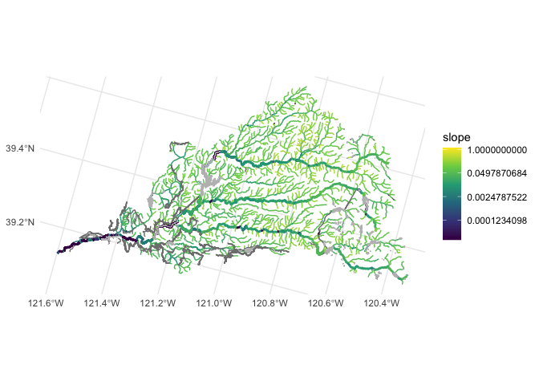<!-- -->

``` r
# plot showing drainage area
flowlines |> 
  st_zm() |>
  filter(gnis_name %in% c("Yuba River", "South Yuba River", "Middle Yuba River", "North Yuba River")) |>
  ggplot() + 
  geom_sf(data=st_zm(flowlines), aes(color = da_area_sq_km)) +
  geom_sf(aes(color = da_area_sq_km), linewidth=1) + 
  geom_sf(data=waterbodies, fill="gray", color="gray") +
  scale_color_viridis_c(direction=-1)
```

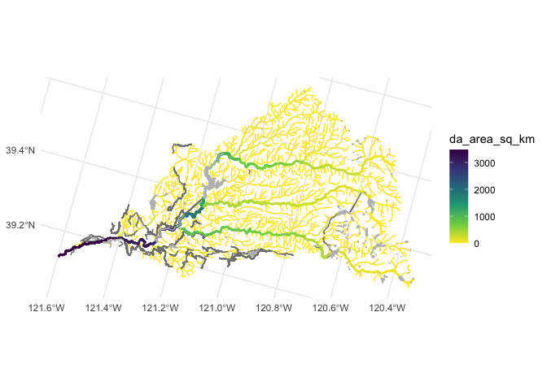<!-- -->

``` r
# plot showing stream order
flowlines |> 
  st_zm() |>
  filter(gnis_name %in% c("Yuba River", "South Yuba River", "Middle Yuba River", "North Yuba River")) |>
  ggplot() + 
  geom_sf(data=st_zm(flowlines), aes(color = stream_order)) +
  geom_sf(aes(color = stream_order), linewidth=1) + 
  geom_sf(data=waterbodies, fill="gray", color="gray") +
  scale_color_viridis_c(direction=-1)
```

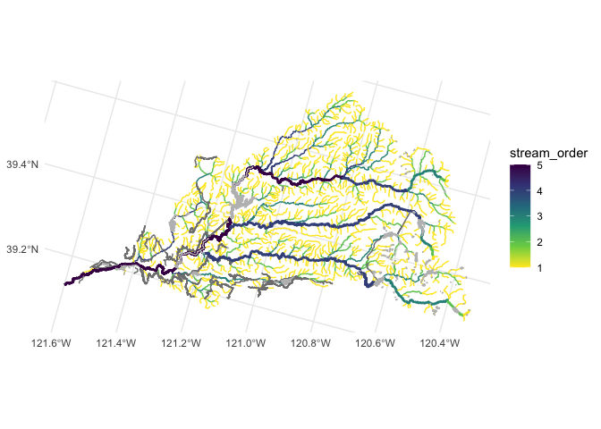<!-- -->

``` r
# plot showing mean annual precip at local reach location
flowlines |> 
  st_zm() |>
  filter(gnis_name %in% c("Yuba River", "South Yuba River", "Middle Yuba River", "North Yuba River")) |>
  ggplot() + 
  geom_sf(data=st_zm(flowlines), aes(color = loc_ppt_mean_mm)) +
  geom_sf(aes(color = loc_ppt_mean_mm), linewidth=1) + 
  geom_sf(data=waterbodies, fill="gray", color="gray") +
  scale_color_viridis_c(direction=-1)
```

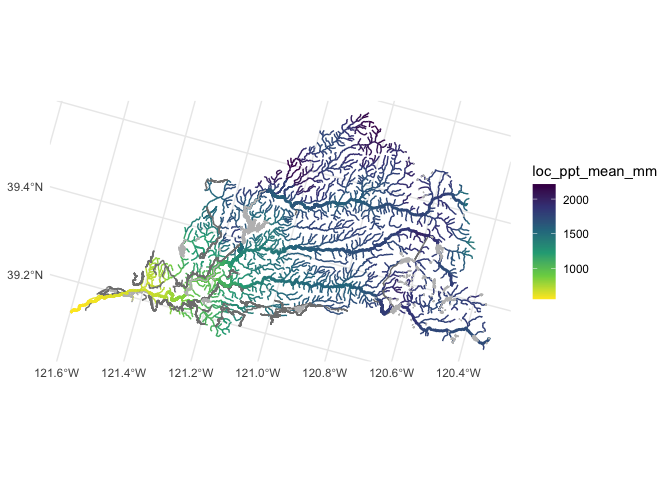<!-- -->

``` r
# plot showing mean annual precip in upstream drainage area
flowlines |> 
  st_zm() |>
  filter(gnis_name %in% c("Yuba River", "South Yuba River", "Middle Yuba River", "North Yuba River")) |>
  ggplot() + 
  geom_sf(data=st_zm(flowlines), aes(color = da_ppt_mean_mm)) +
  geom_sf(aes(color = da_ppt_mean_mm), linewidth=1) + 
  geom_sf(data=waterbodies, fill="gray", color="gray") +
  scale_color_viridis_c(direction=-1)
```

<!-- -->

``` r
# plot showing mean elevation of upstream drainage area
flowlines |> 
  st_zm() |>
  filter(gnis_name %in% c("Yuba River", "South Yuba River", "Middle Yuba River", "North Yuba River")) |>
  ggplot() + 
  geom_sf(data=st_zm(flowlines), aes(color = da_elev_mean)) +
  geom_sf(aes(color = da_elev_mean), linewidth=1) + 
  geom_sf(data=waterbodies, fill="gray", color="gray") +
  scale_color_viridis_c(direction=-1)
```

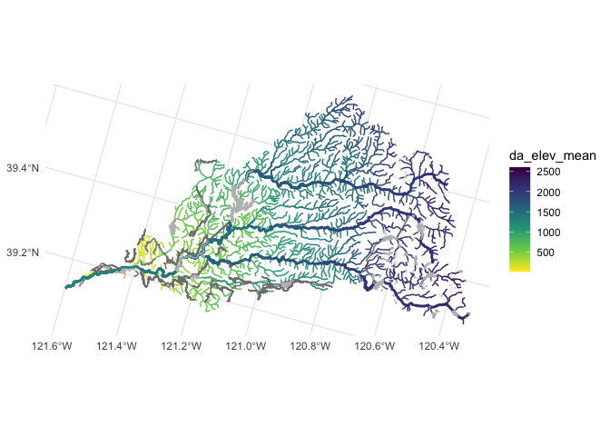<!-- -->

``` r
# plot showing EROM flow estimates
flowlines |> 
  st_zm() |>
  filter(gnis_name %in% c("Yuba River", "South Yuba River", "Middle Yuba River", "North Yuba River")) |>
  ggplot() + 
  geom_sf(data=st_zm(flowlines), aes(color = erom_q_ma_cfs)) +
  geom_sf(aes(color = erom_q_ma_cfs), linewidth=1) + 
  geom_sf(data=waterbodies, fill="gray", color="gray") +
  scale_color_viridis_c(direction=-1)
```

<!-- -->

``` r
# plot showing EROM velocity estimates
flowlines |> 
  st_zm() |>
  filter(gnis_name %in% c("Yuba River", "South Yuba River", "Middle Yuba River", "North Yuba River")) |>
  ggplot() + 
  geom_sf(data=st_zm(flowlines), aes(color = erom_v_ma_fps)) +
  geom_sf(aes(color = erom_v_ma_fps), linewidth=1) + 
  geom_sf(data=waterbodies, fill="gray", color="gray") +
  scale_color_viridis_c(direction=-1)
```

<!-- -->

``` r
# plot showing sinuousity estimates
flowlines |> 
  st_zm() |>
  filter(gnis_name %in% c("Yuba River", "South Yuba River", "Middle Yuba River", "North Yuba River")) |>
  ggplot() + 
  geom_sf(data=st_zm(flowlines), aes(color = sinuosity)) +
  geom_sf(aes(color = sinuosity), linewidth=1) + 
  geom_sf(data=waterbodies, fill="gray", color="gray") +
  scale_color_viridis_c(direction=-1)
```

<!-- -->

``` r
# plot showing bankfull width
flowlines |> 
  st_zm() |>
  filter(gnis_name %in% c("Yuba River", "South Yuba River", "Middle Yuba River", "North Yuba River")) |>
  ggplot() + 
  geom_sf(data=st_zm(flowlines), aes(color = bf_width_m)) +
  geom_sf(aes(color = bf_width_m), linewidth=1) + 
  geom_sf(data=waterbodies, fill="gray", color="gray") +
  scale_color_viridis_c(direction=-1)
```

<!-- -->

``` r
# plot showing bankfull width/depth ratio
flowlines |> 
  st_zm() |>
  filter(gnis_name %in% c("Yuba River", "South Yuba River", "Middle Yuba River", "North Yuba River")) |>
  ggplot() + 
  geom_sf(data=st_zm(flowlines), aes(color = bf_w_d_ratio)) +
  geom_sf(aes(color = bf_w_d_ratio), linewidth=1) + 
  geom_sf(data=waterbodies, fill="gray", color="gray") +
  scale_color_viridis_c(direction=-1)
```

<!-- -->

``` r
# plot showing local soil erodibility
flowlines |> 
  st_zm() |>
  filter(gnis_name %in% c("Yuba River", "South Yuba River", "Middle Yuba River", "North Yuba River")) |>
  ggplot() + 
  geom_sf(data=st_zm(flowlines), aes(color = loc_k_erodibility)) +
  geom_sf(aes(color = loc_k_erodibility), linewidth=1) + 
  geom_sf(data=waterbodies, fill="gray", color="gray") +
  scale_color_viridis_c(direction=-1)
```

<!-- -->

``` r
# plot showing local soil depth to bedrock
flowlines |> 
  st_zm() |>
  filter(gnis_name %in% c("Yuba River", "South Yuba River", "Middle Yuba River", "North Yuba River")) |>
  ggplot() + 
  geom_sf(data=st_zm(flowlines), aes(color = loc_bedrock_depth)) +
  geom_sf(aes(color = loc_bedrock_depth), linewidth=1) + 
  geom_sf(data=waterbodies, fill="gray", color="gray") +
  scale_color_viridis_c(direction=-1)
```

<!-- -->

``` r
# plot showing local topographic wetness index
flowlines |> 
  st_zm() |>
  filter(gnis_name %in% c("Yuba River", "South Yuba River", "Middle Yuba River", "North Yuba River")) |>
  ggplot() + 
  geom_sf(data=st_zm(flowlines), aes(color = loc_twi)) +
  geom_sf(aes(color = loc_twi), linewidth=1) + 
  geom_sf(data=waterbodies, fill="gray", color="gray") +
  scale_color_viridis_c(direction=-1)
```

<!-- -->

``` r
# plot showing local baseflow 
flowlines |> 
  st_zm() |>
  filter(gnis_name %in% c("Yuba River", "South Yuba River", "Middle Yuba River", "North Yuba River")) |>
  ggplot() + 
  geom_sf(data=st_zm(flowlines), aes(color = loc_bfi)) +
  geom_sf(aes(color = loc_bfi), linewidth=1) + 
  geom_sf(data=waterbodies, fill="gray", color="gray") +
  scale_color_viridis_c(direction=-1)
```

<!-- -->

``` r
# plot showing NDVI
flowlines |> 
  st_zm() |>
  filter(gnis_name %in% c("Yuba River", "South Yuba River", "Middle Yuba River", "North Yuba River")) |>
  ggplot() + 
  geom_sf(data=st_zm(flowlines), aes(color = mean_ndvi)) +
  geom_sf(aes(color = mean_ndvi), linewidth=1) + 
  geom_sf(data=waterbodies, fill="gray", color="gray") +
  scale_color_viridis_c(direction=-1)
```

<!-- -->

``` r
# plot showing theoretical grain size mobilized
flowlines |> 
  st_zm() |>
  filter(gnis_name %in% c("Yuba River", "South Yuba River", "Middle Yuba River", "North Yuba River")) |>
  ggplot() + 
  geom_sf(data=st_zm(flowlines), aes(color = grain_size_mobilized_mm)) +
  geom_sf(aes(color = grain_size_mobilized_mm), linewidth=1) + 
  geom_sf(data=waterbodies, fill="gray", color="gray") +
  scale_color_viridis_c(direction=-1, trans="log2")
```

<!-- -->

``` r
# plot showing mTPI (meters) (negative = more confined)
flowlines |> 
  st_zm() |>
  filter(gnis_name %in% c("Yuba River", "South Yuba River", "Middle Yuba River", "North Yuba River")) |>
  ggplot() + 
  geom_sf(data=st_zm(flowlines), aes(color = mtpi30_min)) +
  geom_sf(aes(color = mtpi30_min), linewidth=1) + 
  geom_sf(data=waterbodies, fill="gray", color="gray") +
  scale_color_viridis_c(direction=1)
```

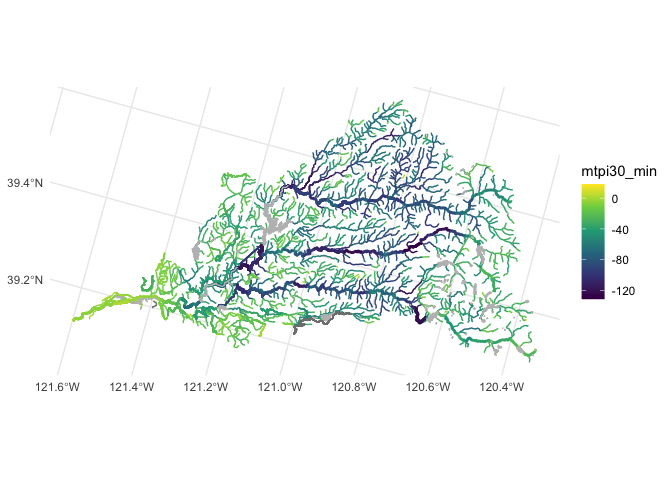<!-- -->

``` r
# plot showing hydrologic classification
flowlines |> 
  st_zm() |>
  filter(gnis_name %in% c("Yuba River", "South Yuba River", "Middle Yuba River", "North Yuba River")) |>
  ggplot() + 
  geom_sf(data=st_zm(flowlines), aes(color = hyd_cls)) +
  geom_sf(aes(color = hyd_cls), linewidth=1) + 
  geom_sf(data=waterbodies, fill="gray", color="gray") 
```

<!-- -->

``` r
# plot showing merit width data
flowlines |> 
  st_zm() |>
  filter(gnis_name %in% c("Yuba River", "South Yuba River", "Middle Yuba River", "North Yuba River")) |>
  ggplot() + 
  geom_sf(data=st_zm(flowlines), aes(color = merit_width_m)) +
  geom_sf(aes(color = merit_width_m), linewidth=1) + 
  geom_sf(data=waterbodies, fill="gray", color="gray") +
  scale_color_viridis_c(trans = "log")
```

<!-- -->

``` r
# plot showing merit width data combined with bankfull where merit is not available
flowlines |> 
  st_zm() |>
  filter(gnis_name %in% c("Yuba River", "South Yuba River", "Middle Yuba River", "North Yuba River")) |>
  ggplot() + 
  geom_sf(data=st_zm(flowlines), aes(color = chan_width_m)) +
  geom_sf(aes(color = chan_width_m), linewidth=1) + 
  geom_sf(data=waterbodies, fill="gray", color="gray") +
  scale_color_viridis_c(trans = "log")
```

    ## Warning in scale_color_viridis_c(trans = "log"): log-2.718282 transformation
    ## introduced infinite values.

<!-- -->

``` r
# plot showing levee confinement data, where available
flowlines |> 
  st_zm() |>
  filter(gnis_name %in% c("Yuba River", "South Yuba River", "Middle Yuba River", "North Yuba River")) |>
  ggplot() + 
  geom_sf(data=st_zm(flowlines), aes(color = lateral_levee_confinement_ft*0.3048)) +
  geom_sf(aes(color = lateral_levee_confinement_ft*0.3048), linewidth=1) + 
  geom_sf(data=waterbodies, fill="gray", color="gray") +
  scale_color_viridis_c(trans = "log")
```

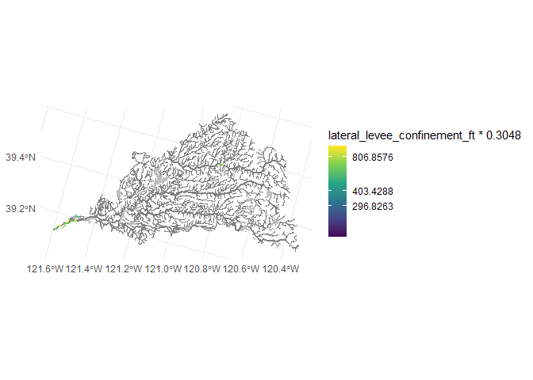<!-- -->

``` r
# plot showing valley bottom width calculated from terrain (or leveed width in the case of leveed reaches)
flowlines |> 
  st_zm() |>
  filter(gnis_name %in% c("Yuba River", "South Yuba River", "Middle Yuba River", "North Yuba River")) |>
  ggplot() + 
  geom_sf(data=st_zm(flowlines), aes(color = vb_width_transect)) +
  geom_sf(aes(color = vb_width_transect), linewidth=1) + 
  geom_sf(data=waterbodies, fill="gray", color="gray") +
  scale_color_viridis_c(direction=1, trans="log10")
```

    ## Warning in scale_color_viridis_c(direction = 1, trans = "log10"): log-10
    ## transformation introduced infinite values.

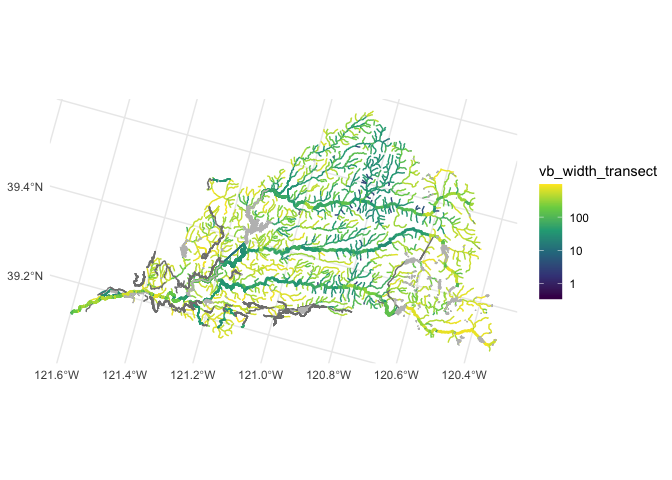<!-- -->

``` r
# plot showing valley bottom width - channel width ratio
flowlines |> 
  st_zm() |>
  filter(gnis_name %in% c("Yuba River", "South Yuba River", "Middle Yuba River", "North Yuba River")) |>
  ggplot() + 
  geom_sf(data=st_zm(flowlines), aes(color = vb_bf_w_ratio)) +
  geom_sf(aes(color = vb_bf_w_ratio), linewidth=1) + 
  geom_sf(data=waterbodies, fill="gray", color="gray") +
  scale_color_viridis_c(direction=-1, trans="log10")
```

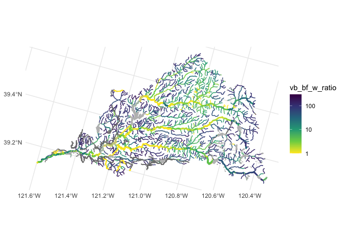<!-- -->

``` r
# plot showing number of species - TNC data
flowlines |> 
  st_zm() |>
  filter(gnis_name %in% c("Yuba River", "South Yuba River", "Middle Yuba River", "North Yuba River")) |>
  ggplot() + 
  geom_sf(data=st_zm(flowlines), aes(color = species)) +
  geom_sf(aes(color = species), linewidth=1) + 
  geom_sf(data=waterbodies, fill="gray", color="gray") +
  scale_color_viridis_c(trans = "log")
```

<!-- -->

``` r
# plot showing number of CDFW aquatic biodiversity rank
flowlines |> 
  st_zm() |>
  filter(gnis_name %in% c("Yuba River", "South Yuba River", "Middle Yuba River", "North Yuba River")) |>
  ggplot() + 
  geom_sf(data=st_zm(flowlines), aes(color = bio_aq_rank_sw)) +
  geom_sf(aes(color = bio_aq_rank_sw), linewidth=1) + 
  geom_sf(data=waterbodies, fill="gray", color="gray") +
  scale_color_viridis_c(trans = "log")
```

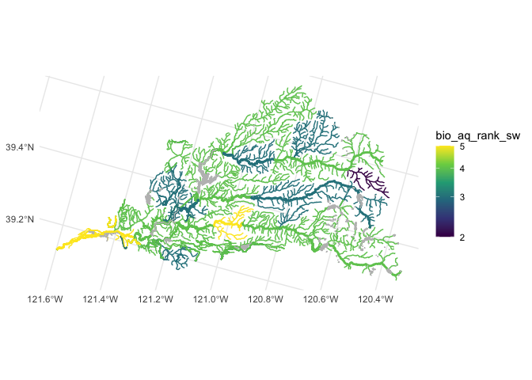<!-- -->

``` r
flowlines |> 
  st_zm() |>
  filter(gnis_name %in% c("Yuba River", "South Yuba River", "Middle Yuba River", "North Yuba River")) |>
  ggplot() + 
  geom_sf(data=st_zm(flowlines), aes(color = geomorph_class)) +
  geom_sf(aes(color = geomorph_class), linewidth=1) + 
  geom_sf(data=waterbodies, fill="gray", color="gray") 
```

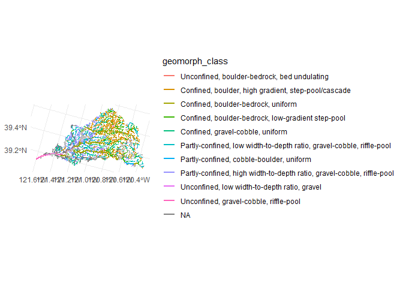<!-- -->

``` r
flowlines |> 
  st_zm() |>
  filter(gnis_name %in% c("Yuba River", "South Yuba River", "Middle Yuba River", "North Yuba River")) |>
  ggplot() + 
  geom_sf(data=st_zm(flowlines), aes(color = factor(hqt_gradient_class))) +
  geom_sf(aes(color = factor(hqt_gradient_class)), linewidth=1) + 
  geom_sf(data=waterbodies, fill="gray", color="gray") 
```

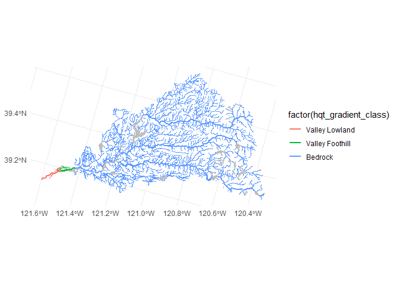<!-- -->

## Import catchments

``` r
# local catchment associated with each flowline reach (COMID)
catchments <- 
  drive_file_by_id("16RXk1BplBr8v-IO0QodGEnjBlvOGhbM3", vsizip=T) |>
  read_sf() |> 
  janitor::clean_names() |>
  mutate(comid = as.numeric(featureid)) |>
  inner_join(flowlines |> st_drop_geometry() |> select(comid)) |>
  arrange(comid) |>
  st_transform(habistat::const_proj_crs()) 
```

    ## C:/Users/skylerlewis/Github/swc-habitat-suitability/data-raw/temp/Catchment.shp.zip already exists and will be used...

    ## Joining with `by = join_by(comid)`

``` r
# examples
ggplot() + geom_sf(data = catchments, color="orange") + 
  geom_sf(data = watersheds, color="red", fill=NA) + 
  geom_sf(data = st_zm(flowlines), color="blue") 
```

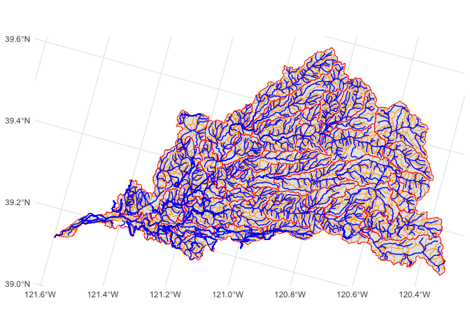<!-- -->

``` r
catchments |> saveRDS(here::here("data-raw", "results", "catchments.Rds"))
```

## Export GCS versions of spatial data

``` r
flowlines_gcs <- flowlines |>
  st_transform("+proj=longlat +datum=NAD83") |> 
  st_zm()

# just redefine NAD83 to WGS84 for leaflet, this is ok because just for rough visualization not analysis
st_crs(flowlines_gcs) <- "+proj=longlat +datum=WGS84"
```

    ## Warning: st_crs<- : replacing crs does not reproject data; use st_transform for
    ## that

``` r
flowlines_gcs |> saveRDS(here::here("data-raw", "results", "flowline_geometries_leaflet.Rds"))
```
