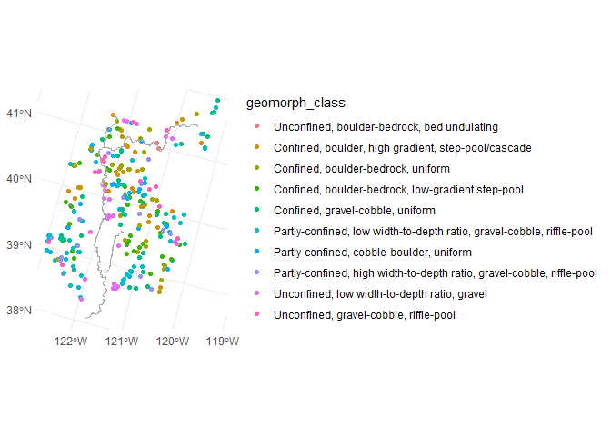
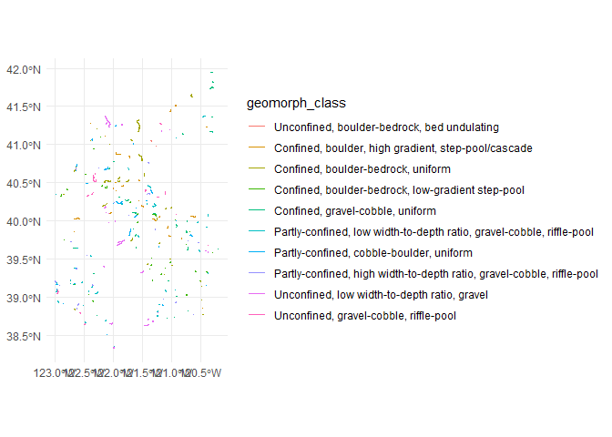
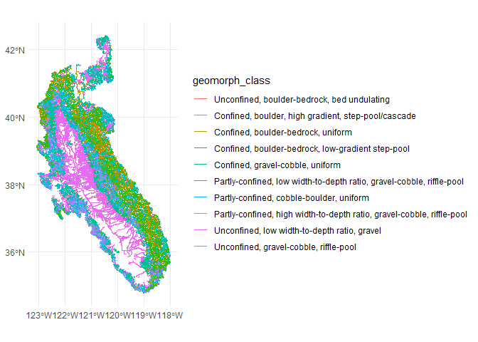
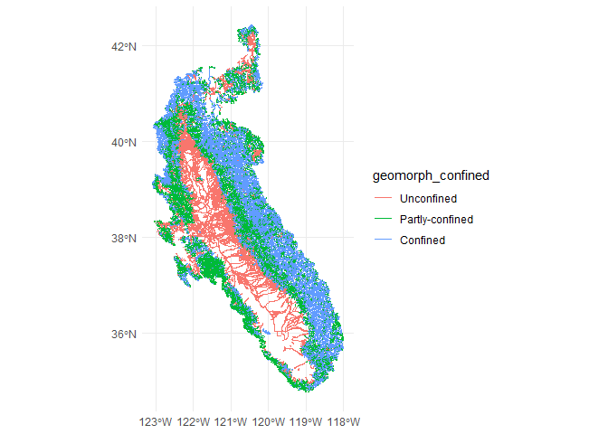
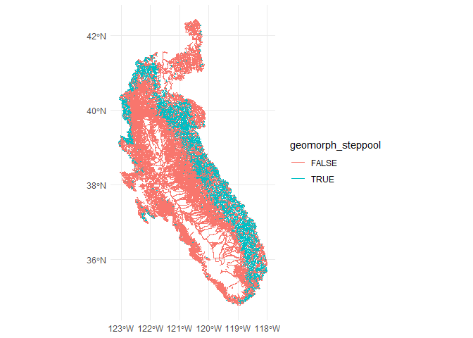
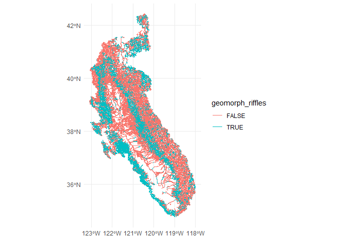

Predictor Data Prep: Geomorphology and Soils
================
[Skyler Lewis](mailto:slewis@flowwest.com)
2024-04-26

- [Soils](#soils)
- [UCD Geomorphology classes
  (experimental)](#ucd-geomorphology-classes-experimental)

## Soils

``` r
soils <- 
  st_read(file.path("/vsizip", here::here("data-raw", "source", "soils", "Cal_STATSGO2.shp.zip")), as_tibble=T) |>
  st_transform(project_crs) |>
  janitor::clean_names() |> 
  transmute(soil_drainage = factor(drainage, levels=c("Very poorly drained",
                                                      "Poorly drained",
                                                      "Somewhat poorly drained",
                                                      "Well drained",
                                                      "Somewhat excessively drained",
                                                      "Excessively drained")),
            soil_hsg = factor(hydro_g, levels=c("A","B","C","D")),
            soil_salt_accum = factor(salt, levels=c("acid","nonacid","euic","calcareous")),
            soil_climate = factor(climate, levels=c("frigid","mesic","thermic","hyperthermic","isofrigid","isomesic","isothermic","isohyperthermic")),
            soil_minerology = factor(minerology, levels=c("superactive","active","semiactive","subactive")),
            soil_volcanic = if_else(str_detect(texture,"ashy") | str_detect(texture,"cindery") | str_detect(texture,"medial"), 1, 0),
            soil_texture_simple = case_when(str_detect(word(texture,1), "ashy") ~ "ashy",
                                            str_detect(word(texture,1), "medial") ~ "medial",
                                            str_detect(word(texture,1), "clayey") ~ "clayey",
                                            str_detect(word(texture,1), "clayey") ~ "silty",
                                            str_detect(word(texture,1), "clayey") ~ "sandy",
                                            str_detect(word(texture,1), "clayey") ~ "loamy",
                                            str_detect(word(texture,1), "clayey") ~ "fine"
                                            ) |> factor())
```

    ## Reading layer `Cal_STATSGO2' from data source 
    ##   `/vsizip/C:/Users/skylerlewis/Github/swc-habitat-suitability/data-raw/source/soils/Cal_STATSGO2.shp.zip' 
    ##   using driver `ESRI Shapefile'
    ## Simple feature collection with 4235 features and 19 fields
    ## Geometry type: MULTIPOLYGON
    ## Dimension:     XY
    ## Bounding box:  xmin: -13849240 ymin: 3833661 xmax: -12705030 ymax: 5162405
    ## Projected CRS: WGS 84 / Pseudo-Mercator

``` r
soils_comid <-
  flowlines_gcs |>
  select(comid) |>
  st_point_on_surface() |>
  st_transform(st_crs(soils)) |>
  st_join(soils) |>
  st_drop_geometry() |>
  glimpse()
```

    ## Warning: st_point_on_surface assumes attributes are constant over geometries

    ## Warning in st_point_on_surface.sfc(st_geometry(x)): st_point_on_surface may not
    ## give correct results for longitude/latitude data

    ## Rows: 178,868
    ## Columns: 8
    ## $ comid               <int> 20245062, 24085230, 22226684, 22226720, 22226732, …
    ## $ soil_drainage       <fct> NA, NA, Well drained, Well drained, Well drained, …
    ## $ soil_hsg            <fct> NA, NA, B, B, B, B, B, D, D, D, D, D, D, D, D, D, …
    ## $ soil_salt_accum     <fct> NA, NA, nonacid, nonacid, NA, nonacid, nonacid, NA…
    ## $ soil_climate        <fct> NA, NA, mesic, mesic, isomesic, mesic, mesic, isom…
    ## $ soil_minerology     <fct> NA, NA, superactive, superactive, NA, superactive,…
    ## $ soil_volcanic       <dbl> NA, NA, 0, 0, 0, 0, 0, 0, 0, 0, 0, 0, 0, 0, 0, 0, …
    ## $ soil_texture_simple <fct> NA, NA, NA, NA, NA, NA, NA, NA, NA, NA, NA, NA, NA…

``` r
soils_comid |> saveRDS(here::here("data-raw", "results", "attr_soils.Rds"))
```

## UCD Geomorphology classes (experimental)

This is a very rough generalization of spot classifications to the
entire basin. Use with caution!

``` r
geomorph_site_data <- 
  tibble(result=rjson::fromJSON(file=here::here("data-raw", "source", "ucd_geomorph", "geoSites.json"))) |> 
  unnest_wider(result) |> 
  mutate(geomorph_region = map_chr(geoClass, function(x) x$geoRegion$abbreviation),
         geomorph_class = map_chr(geoClass, function(x) x$name),
         geomorph_class_median_attributes = map(geoClass, function(x) x$medianAttributes),
         geometry = map(geometry, function(x) c(x$coordinates[[2]], x$coordinates[[1]]) |> st_point()) |> st_sfc(crs="EPSG:4326")) |>
  janitor::clean_names() |> 
  st_as_sf() |>
  filter(geomorph_region=="SAC") |>
  select(identity, geometry, geomorph_class) |>
  mutate(identity = str_replace(identity, "SAC_", ""),
         geomorph_class_num=str_replace(geomorph_class, "SAC-","") |> as.numeric(),
         geomorph_class = factor(geomorph_class, 
                                 levels = paste0("SAC-",seq(1,10,1)),
                                 labels = c("SAC-1"  = "Unconfined, boulder-bedrock, bed undulating",
                                            "SAC-2"  = "Confined, boulder, high gradient, step-pool/cascade",
                                            "SAC-3"  = "Confined, boulder-bedrock, uniform",
                                            "SAC-4"  = "Confined, boulder-bedrock, low-gradient step-pool",
                                            "SAC-5"  = "Confined, gravel-cobble, uniform",
                                            "SAC-6"  = "Partly-confined, low width-to-depth ratio, gravel-cobble, riffle-pool",
                                            "SAC-7"  = "Partly-confined, cobble-boulder, uniform",
                                            "SAC-8"  = "Partly-confined, high width-to-depth ratio, gravel-cobble, riffle-pool",
                                            "SAC-9"  = "Unconfined, low width-to-depth ratio, gravel",
                                            "SAC-10" = "Unconfined, gravel-cobble, riffle-pool"))) |>
  inner_join(read_csv(here::here("data-raw", "source", "ucd_geomorph", "geomorph_site_attributes.csv")), by=join_by(identity)) |>
  st_transform(project_crs) |> 
  st_join(flowlines |> select(comid), join=st_nearest_feature)
```

    ## Rows: 288 Columns: 14
    ## ── Column specification ────────────────────────────────────────────────────────
    ## Delimiter: ","
    ## chr  (1): identity
    ## dbl (13): Ac, s, d, w, w/d, d/D50, CVd, CVw, k, D50, D84, Cv, Ls
    ## 
    ## ℹ Use `spec()` to retrieve the full column specification for this data.
    ## ℹ Specify the column types or set `show_col_types = FALSE` to quiet this message.

``` r
geomorph_site_data |> ggplot() + geom_sf(aes(color=geomorph_class))
```

<!-- -->

``` r
flowlines_gcs |> 
  inner_join(geomorph_site_data |> st_drop_geometry()) |> 
  ggplot() + geom_sf(aes(color=geomorph_class))
```

    ## Joining with `by = join_by(comid)`

<!-- -->

``` r
geomorph_training_data <- 
  geomorph_site_data |>
  left_join(flowline_attributes |> select(-starts_with("geomorph_")), by=join_by(comid)) |>
  select(comid, geomorph_class, geomorph_class_num,
         da_area_sq_km, slope, bf_depth_m, bf_width_m, bf_w_d_ratio,  
         mtpi30_min, loc_k_erodibility, sinuosity, da_elev_mean, da_ppt_mean_mm, 
         ) |>
  drop_na() |>
  st_drop_geometry()

geomorph_rec <- 
  recipe(geomorph_class ~ da_area_sq_km + slope + bf_depth_m + bf_width_m + bf_w_d_ratio + 
         mtpi30_min + loc_k_erodibility + sinuosity + da_elev_mean + da_ppt_mean_mm,
         data=geomorph_training_data)

geomorph_spec <- rand_forest(mode = "classification", trees = 256)

geomorph_fit <- 
  workflow() |>
  add_recipe(geomorph_rec) |>
  add_model(geomorph_spec) |>
  fit(data=geomorph_training_data)

geomorph_prediction_data <- flowlines_gcs |>
  left_join(flowline_attributes, by=join_by(comid)) |>
  filter(substr(reachcode,1, 4) %in% c("1802", "1803", "1804", "1805")) |>
  select(comid, 
         da_area_sq_km, slope, bf_depth_m, bf_width_m, bf_w_d_ratio,  
         mtpi30_min, loc_k_erodibility, sinuosity, da_elev_mean, da_ppt_mean_mm
         ) |>
  drop_na() |>
  st_drop_geometry()
  
geomorph_pred <- 
  geomorph_prediction_data |>
  mutate(geomorph_class = predict(geomorph_fit, geomorph_prediction_data)[[".pred_class"]]) |>
  mutate(geomorph_confined = str_split_i(geomorph_class, ", ", 1) |> as_factor(),
         geomorph_uniform = str_detect(geomorph_class, "uniform"),
         geomorph_steppool = str_detect(geomorph_class, "step-pool"), 
         geomorph_riffles = str_detect(geomorph_class, "riffle"),
         geomorph_gravel = str_detect(geomorph_class, "gravel"))

geomorph_pred |> select(comid, geomorph_class) |> 
  saveRDS(here::here("data-raw", "results", "attr_geomorph_class.Rds"))
  
flowlines_gcs |> 
  inner_join(geomorph_pred, by=join_by(comid)) |> 
  ggplot() + geom_sf(aes(color=geomorph_class))
```

<!-- -->

``` r
flowlines_gcs |> 
  inner_join(geomorph_pred, by=join_by(comid)) |> 
  ggplot() + geom_sf(aes(color=geomorph_confined))
```

<!-- -->

``` r
flowlines_gcs |> 
  inner_join(geomorph_pred, by=join_by(comid)) |> 
  ggplot() + geom_sf(aes(color=geomorph_steppool))
```

<!-- -->

``` r
flowlines_gcs |> 
  inner_join(geomorph_pred, by=join_by(comid)) |> 
  ggplot() + geom_sf(aes(color=geomorph_riffles))
```

<!-- -->

``` r
# # validation matrix
# geomorph_training_data |>
#   select(comid, geomorph_class_actual=geomorph_class) |>
#   inner_join(geomorph_pred |> select(comid, geomorph_class_pred=geomorph_class)) |>
#   group_by(geomorph_class_actual, geomorph_class_pred) |>
#   tally() |> 
#   mutate(n=coalesce(n,0)) |>
#   spread(geomorph_class_actual, n)
```
