Statistical Modeling to Predict Flow-to-Suitable-Area Curves
================
[Skyler Lewis](mailto:slewis@flowwest.com)
2024-05-14

- [Import and Preprocess Training
  Data](#import-and-preprocess-training-data)
  - [Exploration and PCA](#exploration-and-pca)
- [Training Data Setup](#training-data-setup)
- [Model Training](#model-training)
  - [Scale Dependent Model: WUA-per-linear-ft versus
    flow](#scale-dependent-model-wua-per-linear-ft-versus-flow)
  - [Scale Dependent Model 2: TOTAL Inundated Area per linear ft versus
    flow:](#scale-dependent-model-2-total-inundated-area-per-linear-ft-versus-flow)
  - [Scale Independent Model: %HSI versus flow (normalized by
    MAF)](#scale-independent-model-hsi-versus-flow-normalized-by-maf)
  - [Scale Independent Model 2: WUA-per-linear-ft (normalized by
    da_scalar) versus flow (normalized by
    da_scalar)](#scale-independent-model-2-wua-per-linear-ft-normalized-by-da_scalar-versus-flow-normalized-by-da_scalar)
- [Prediction and Validation](#prediction-and-validation)
  - [One-step model, scale-dependent: WUA/LF vs
    flow](#one-step-model-scale-dependent-wualf-vs-flow)
  - [One-step model, scale-independent: normalized WUA/LF vs normalized
    flow](#one-step-model-scale-independent-normalized-wualf-vs-normalized-flow)
  - [Two-step model: (%HSI vs normalized flow) \* (Total Area/LF vs
    flow)](#two-step-model-hsi-vs-normalized-flow--total-arealf-vs-flow)
- [Predictions summarized by DSMHabitat
  reach](#predictions-summarized-by-dsmhabitat-reach)
  - [One-step model, scale-dependent: WUA/LF vs
    flow](#one-step-model-scale-dependent-wualf-vs-flow-1)
  - [One-step model, scale-independent: WUA/LF vs normalized
    flow](#one-step-model-scale-independent-wualf-vs-normalized-flow)
  - [Two-step model: (%HSI vs normalized flow) \* (Total Area/LF vs
    flow)](#two-step-model-hsi-vs-normalized-flow--total-arealf-vs-flow-1)
- [Results Export](#results-export)
- [Yuba Comparison](#yuba-comparison)

``` r
library(tidyverse)
library(sf)
library(stars)
library(tidymodels)
library(broom.mixed) # tidy output of mixed model results
library(dotwhisker) # visualize regression results

knitr::opts_chunk$set(eval=TRUE, fig.width=6.5, fig.height=6.5, dpi=300)

theme_set(theme_minimal())

ihs <- trans_new("ihs", 
                 transform = function(x) asinh(x), 
                 inverse = function(y) sinh(y), 
                 breaks = function(i) scales::breaks_log(n=5, base=10)(pmax(i,0.01)), 
                 #minor_breaks = scales::minor_breaks_n(n = 0),
                 domain=c(0, Inf),
                 format = scales::label_comma())

oom_range <- function(from, to) {
  from_mag <- floor(log10(if (from > 0) from else 1))
  to_mag <- ceiling(log10(to))
  magnitudes <- seq(from_mag, to_mag + 1, 1)
  expanded <- as.vector(t(10^seq(magnitudes) %o% seq(1,9,1)))
  result <- expanded[which(expanded>=signif(from,1) & expanded<=signif(to,1))]
  return(if (from == 0) c(0, result) else result)
}

hex_color_blend <- function(x, y){
  hex_r <- as.character.hexmode((strtoi(substr(x,2,3), base=16L) + strtoi(substr(y,2,3), base=16L)) / 2)
  hex_g <- as.character.hexmode((strtoi(substr(x,4,5), base=16L) + strtoi(substr(y,4,5), base=16L)) / 2)
  hex_b <- as.character.hexmode((strtoi(substr(x,6,7), base=16L) + strtoi(substr(y,6,7), base=16L)) / 2)
  return(paste0("#", hex_r, hex_g, hex_b))
}

palette_dsmhabitat_comparison <- 
  c("habistat prediction" = "#ffae34", 
    "DSMhabitat instream" = "#6388b4",
    "DSMhabitat floodplain" = "#8cc2ca")

palette_hqt_gradient_class <- 
  c("Valley Lowland"  = "#6388b4", #hex_color_blend("#6388b4","#55ad89"),
    "Valley Foothill" = "#55ad89", #hex_color_blend("#55ad89","#c3bc3f"),
    "Bedrock"         = "#bb7693") #hex_color_blend("#c3bc3f","#ffae34"))
```

## Import and Preprocess Training Data

``` r
# flowline geometries
flowlines <- readRDS(here::here("data-raw", "results", "flowline_geometries_proj.Rds"))
flowlines_gcs <- readRDS(here::here("data-raw", "results", "flowline_geometries.Rds"))

# predictor variables by ComID
flowline_attributes <- readRDS(here::here("data-raw", "results", "flowline_attributes.Rds")) |>
  mutate(da_scalar = (da_area_sq_km*247.1053815) * (da_ppt_mean_mm*0.0393701) / 1E6) |># 1 million acre-inches
  mutate(length_ft_nhd = reach_length_km * 1000 / 0.3048) 
# TODO: Clean up import of these attributes; ensure UTF-8 encoding
```

``` r
# response variables by ComID and Flow 
#flow_to_suitable_area <- readRDS(here::here("data-raw", "results", "fsa_combined.Rds"))
fsa_combined <- 
  bind_rows(.id = "dataset",
    # VECTOR SRH-2D MODELS
    "Lower Yuba River" = 
      readRDS(here::here("data-raw", "results", "fsa_yuba.Rds")) |> 
      select(-reach),
    "Stanislaus River" = 
      readRDS(here::here("data-raw", "results", "fsa_stan.Rds")),
    # RASTER HEC-RAS 2D MODELS
    "Deer Creek" = 
      readRDS(here::here("data-raw", "results", "fsa_deer.Rds")),
    "Tuolumne River (Basso-La Grange)" = 
      readRDS(here::here("data-raw", "results", "fsa_basso.Rds")),
    ) |>
  rename(area_tot_ft2 = area_tot, area_wua_ft2 = area_wua, hsi_frac = area_pct)

fsa_combined |> saveRDS(here::here("data-raw", "results", "fsa_combined.Rds"))
```

``` r
# Limit to a specified flow range and interpolate gaps
interp_flows <- seq(300,15000,100)

#interp_flows <- seq(300,40000,100)

# Use this alternative to bring in flows alll the way up to 85000 cfs
#interp_flows <- c(seq(300,950,50), seq(1000,9500,500), seq(10000,85000,5000))

flow_to_suitable_area <- 
  fsa_combined |>
  group_by(dataset, comid, length_ft) |>
  complete(flow_cfs = interp_flows) |>
  arrange(dataset, comid, flow_cfs) |>
  mutate(across(c(area_tot_ft2, area_wua_ft2, hsi_frac, ind_per_lf, wua_per_lf), 
                function(var) zoo::na.approx(var, x = flow_cfs, na.rm=F))) |>
  filter(flow_cfs %in% interp_flows) |>
  filter(!is.na(hsi_frac)) |>
  ungroup()

train_data <- flowlines |> st_drop_geometry() |>
  left_join(flowline_attributes, by=join_by("comid"), relationship="one-to-one") |>
  inner_join(flow_to_suitable_area, by=join_by("comid"), relationship="one-to-many") |>
  mutate(case_wt = hardhat::importance_weights(length_ft)) |>
  #filter(hqt_gradient_class != "Valley Lowland") |>
  # # eliminate reaches with near zero mean annual flow
  # filter(erom_q_ma_cfs>10) |>
  glimpse()
```

    ## Rows: 21,298
    ## Columns: 128

    ## Warning in grepl(",", levels(x), fixed = TRUE): input string 3 is invalid in
    ## this locale

    ## Warning in grepl(",", levels(x), fixed = TRUE): input string 4 is invalid in
    ## this locale

    ## Warning in grepl(",", levels(x), fixed = TRUE): input string 6 is invalid in
    ## this locale

    ## $ comid                        <dbl> 8061233, 8061233, 8061233, 8061233, 80612…
    ## $ reachcode                    <fct> 18020125000002, 18020125000002, 180201250…
    ## $ gnis_id                      <fct> 238295, 238295, 238295, 238295, 238295, 2…
    ## $ gnis_name                    <fct> "Yuba River", "Yuba River", "Yuba River",…
    ## $ lengthkm                     <dbl> 0.036, 0.036, 0.036, 0.036, 0.036, 0.036,…
    ## $ ftype                        <fct> StreamRiver, StreamRiver, StreamRiver, St…
    ## $ fcode                        <int> 46006, 46006, 46006, 46006, 46006, 46006,…
    ## $ huc_8                        <chr> "18020125", "18020125", "18020125", "1802…
    ## $ huc_10                       <chr> "1802012500", "1802012500", "1802012500",…
    ## $ huc_12                       <chr> "180201250000", "180201250000", "18020125…
    ## $ ftype_desc                   <chr> "Stream/River", "Stream/River", "Stream/R…
    ## $ hydro_seq                    <dbl> 10007863, 10007863, 10007863, 10007863, 1…
    ## $ reach_code                   <fct> 18020125000002, 18020125000002, 180201250…
    ## $ stream_level                 <dbl> 3, 3, 3, 3, 3, 3, 3, 3, 3, 3, 3, 3, 3, 3,…
    ## $ stream_order                 <dbl> 5, 5, 5, 5, 5, 5, 5, 5, 5, 5, 5, 5, 5, 5,…
    ## $ us_length_km                 <dbl> 2680.552, 2680.552, 2680.552, 2680.552, 2…
    ## $ ds_length_km                 <dbl> 202.394, 202.394, 202.394, 202.394, 202.3…
    ## $ da_area_sq_km                <dbl> 3110.287, 3110.287, 3110.287, 3110.287, 3…
    ## $ reach_length_km              <dbl> 0.036, 0.036, 0.036, 0.036, 0.036, 0.036,…
    ## $ slope                        <dbl> NA, NA, NA, NA, NA, NA, NA, NA, NA, NA, N…
    ## $ elev_min                     <dbl> 71.39, 71.39, 71.39, 71.39, 71.39, 71.39,…
    ## $ elev_max                     <dbl> 71.39, 71.39, 71.39, 71.39, 71.39, 71.39,…
    ## $ stream_power                 <dbl> NA, NA, NA, NA, NA, NA, NA, NA, NA, NA, N…
    ## $ da_ppt_mean_mm               <dbl> 1675.915, 1675.915, 1675.915, 1675.915, 1…
    ## $ loc_ppt_mean_mm              <dbl> NA, NA, NA, NA, NA, NA, NA, NA, NA, NA, N…
    ## $ vogel_q_ma_cfs               <dbl> 4225.676, 4225.676, 4225.676, 4225.676, 4…
    ## $ vogel_v_ma_fps               <dbl> 1.85044, 1.85044, 1.85044, 1.85044, 1.850…
    ## $ erom_q_ma_cfs                <dbl> 2649.201, 2649.201, 2649.201, 2649.201, 2…
    ## $ erom_v_ma_fps                <dbl> 1.70733, 1.70733, 1.70733, 1.70733, 1.707…
    ## $ sinuosity                    <dbl> 1, 1, 1, 1, 1, 1, 1, 1, 1, 1, 1, 1, 1, 1,…
    ## $ da_avg_slope                 <dbl> 29.4, 29.4, 29.4, 29.4, 29.4, 29.4, 29.4,…
    ## $ da_elev_mean                 <dbl> 1379.63, 1379.63, 1379.63, 1379.63, 1379.…
    ## $ da_elev_min                  <dbl> 71.19, 71.19, 71.19, 71.19, 71.19, 71.19,…
    ## $ da_elev_max                  <dbl> 2757.74, 2757.74, 2757.74, 2757.74, 2757.…
    ## $ da_elev_rel                  <dbl> 2686.55, 2686.55, 2686.55, 2686.55, 2686.…
    ## $ loc_bfi                      <dbl> NA, NA, NA, NA, NA, NA, NA, NA, NA, NA, N…
    ## $ da_bfi                       <dbl> NA, NA, NA, NA, NA, NA, NA, NA, NA, NA, N…
    ## $ loc_twi                      <dbl> NA, NA, NA, NA, NA, NA, NA, NA, NA, NA, N…
    ## $ da_twi                       <dbl> NA, NA, NA, NA, NA, NA, NA, NA, NA, NA, N…
    ## $ loc_pct_clay                 <dbl> NA, NA, NA, NA, NA, NA, NA, NA, NA, NA, N…
    ## $ da_pct_clay                  <dbl> NA, NA, NA, NA, NA, NA, NA, NA, NA, NA, N…
    ## $ loc_pct_sand                 <dbl> NA, NA, NA, NA, NA, NA, NA, NA, NA, NA, N…
    ## $ da_pct_sand                  <dbl> NA, NA, NA, NA, NA, NA, NA, NA, NA, NA, N…
    ## $ loc_permeability             <dbl> NA, NA, NA, NA, NA, NA, NA, NA, NA, NA, N…
    ## $ loc_bedrock_depth            <dbl> NA, NA, NA, NA, NA, NA, NA, NA, NA, NA, N…
    ## $ da_permeability              <dbl> NA, NA, NA, NA, NA, NA, NA, NA, NA, NA, N…
    ## $ da_bedrock_depth             <dbl> NA, NA, NA, NA, NA, NA, NA, NA, NA, NA, N…
    ## $ loc_k_erodibility            <dbl> NA, NA, NA, NA, NA, NA, NA, NA, NA, NA, N…
    ## $ da_k_erodibility             <dbl> NA, NA, NA, NA, NA, NA, NA, NA, NA, NA, N…
    ## $ loc_precip                   <dbl> NA, NA, NA, NA, NA, NA, NA, NA, NA, NA, N…
    ## $ da_precip                    <dbl> NA, NA, NA, NA, NA, NA, NA, NA, NA, NA, N…
    ## $ loc_runoff                   <dbl> NA, NA, NA, NA, NA, NA, NA, NA, NA, NA, N…
    ## $ da_runoff                    <dbl> NA, NA, NA, NA, NA, NA, NA, NA, NA, NA, N…
    ## $ bf_width_m                   <dbl> 68.3182, 68.3182, 68.3182, 68.3182, 68.31…
    ## $ bf_depth_m                   <dbl> 2.446871, 2.446871, 2.446871, 2.446871, 2…
    ## $ bf_w_d_ratio                 <dbl> 27.92063, 27.92063, 27.92063, 27.92063, 2…
    ## $ mean_ndvi                    <dbl> NA, NA, NA, NA, NA, NA, NA, NA, NA, NA, N…
    ## $ bio_aq_rank_sw               <int> 4, 4, 4, 4, 4, 4, 4, 4, 4, 4, 4, 4, 4, 4,…
    ## $ species                      <dbl> 45, 45, 45, 45, 45, 45, 45, 45, 45, 45, 4…
    ## $ species_fish                 <dbl> 9, 9, 9, 9, 9, 9, 9, 9, 9, 9, 9, 9, 9, 9,…
    ## $ species_crust                <dbl> 0, 0, 0, 0, 0, 0, 0, 0, 0, 0, 0, 0, 0, 0,…
    ## $ species_herps                <dbl> 9, 9, 9, 9, 9, 9, 9, 9, 9, 9, 9, 9, 9, 9,…
    ## $ species_inverts              <dbl> 3, 3, 3, 3, 3, 3, 3, 3, 3, 3, 3, 3, 3, 3,…
    ## $ species_mollusks             <dbl> 1, 1, 1, 1, 1, 1, 1, 1, 1, 1, 1, 1, 1, 1,…
    ## $ species_plants               <dbl> 4, 4, 4, 4, 4, 4, 4, 4, 4, 4, 4, 4, 4, 4,…
    ## $ species_birds                <dbl> 15, 15, 15, 15, 15, 15, 15, 15, 15, 15, 1…
    ## $ species_mammals              <dbl> 4, 4, 4, 4, 4, 4, 4, 4, 4, 4, 4, 4, 4, 4,…
    ## $ species_mollusks_crust       <dbl> 1, 1, 1, 1, 1, 1, 1, 1, 1, 1, 1, 1, 1, 1,…
    ## $ species_endemic              <dbl> 11, 11, 11, 11, 11, 11, 11, 11, 11, 11, 1…
    ## $ species_endemic_fish         <dbl> 7, 7, 7, 7, 7, 7, 7, 7, 7, 7, 7, 7, 7, 7,…
    ## $ species_endemic_crust        <dbl> 0, 0, 0, 0, 0, 0, 0, 0, 0, 0, 0, 0, 0, 0,…
    ## $ species_endemic_herps        <dbl> 3, 3, 3, 3, 3, 3, 3, 3, 3, 3, 3, 3, 3, 3,…
    ## $ species_endemic_inverts      <dbl> 0, 0, 0, 0, 0, 0, 0, 0, 0, 0, 0, 0, 0, 0,…
    ## $ species_endemic_mollusks     <dbl> 0, 0, 0, 0, 0, 0, 0, 0, 0, 0, 0, 0, 0, 0,…
    ## $ species_endemic_plants       <dbl> 1, 1, 1, 1, 1, 1, 1, 1, 1, 1, 1, 1, 1, 1,…
    ## $ species_endemic_birds        <dbl> 0, 0, 0, 0, 0, 0, 0, 0, 0, 0, 0, 0, 0, 0,…
    ## $ species_endemic_mammals      <dbl> 0, 0, 0, 0, 0, 0, 0, 0, 0, 0, 0, 0, 0, 0,…
    ## $ species_vulnerable           <dbl> 18, 18, 18, 18, 18, 18, 18, 18, 18, 18, 1…
    ## $ species_listed               <dbl> 4, 4, 4, 4, 4, 4, 4, 4, 4, 4, 4, 4, 4, 4,…
    ## $ species_endemic_vulnerable   <dbl> 9, 9, 9, 9, 9, 9, 9, 9, 9, 9, 9, 9, 9, 9,…
    ## $ species_endemic_listed       <dbl> 3, 3, 3, 3, 3, 3, 3, 3, 3, 3, 3, 3, 3, 3,…
    ## $ genus                        <dbl> 39, 39, 39, 39, 39, 39, 39, 39, 39, 39, 3…
    ## $ family                       <dbl> 30, 30, 30, 30, 30, 30, 30, 30, 30, 30, 3…
    ## $ tax_order                    <dbl> 23, 23, 23, 23, 23, 23, 23, 23, 23, 23, 2…
    ## $ tax_class                    <dbl> 10, 10, 10, 10, 10, 10, 10, 10, 10, 10, 1…
    ## $ phylum                       <dbl> 4, 4, 4, 4, 4, 4, 4, 4, 4, 4, 4, 4, 4, 4,…
    ## $ species_current              <dbl> 19, 19, 19, 19, 19, 19, 19, 19, 19, 19, 1…
    ## $ species_historical           <dbl> 17, 17, 17, 17, 17, 17, 17, 17, 17, 17, 1…
    ## $ species_other                <dbl> 22, 22, 22, 22, 22, 22, 22, 22, 22, 22, 2…
    ## $ hyd_cat                      <fct> Mixed, Mixed, Mixed, Mixed, Mixed, Mixed,…
    ## $ hyd_cls                      <fct> "High-volume snowmelt and rain", "High-vo…
    ## $ nf_bfl_dry_cfs               <dbl> NA, NA, NA, NA, NA, NA, NA, NA, NA, NA, N…
    ## $ nf_bfl_wet_cfs               <dbl> NA, NA, NA, NA, NA, NA, NA, NA, NA, NA, N…
    ## $ nf_wet_start                 <dbl> NA, NA, NA, NA, NA, NA, NA, NA, NA, NA, N…
    ## $ nf_wet_dur                   <dbl> NA, NA, NA, NA, NA, NA, NA, NA, NA, NA, N…
    ## $ peak_q2_cfs                  <dbl> NA, NA, NA, NA, NA, NA, NA, NA, NA, NA, N…
    ## $ peak_q5_cfs                  <dbl> NA, NA, NA, NA, NA, NA, NA, NA, NA, NA, N…
    ## $ peak_q10_cfs                 <dbl> NA, NA, NA, NA, NA, NA, NA, NA, NA, NA, N…
    ## $ merit_width_m                <dbl> 34.86407, 34.86407, 34.86407, 34.86407, 3…
    ## $ vb_width_transect            <dbl> 34.86407, 34.86407, 34.86407, 34.86407, 3…
    ## $ frac_leveed_longitudinal     <dbl> 0, 0, 0, 0, 0, 0, 0, 0, 0, 0, 0, 0, 0, 0,…
    ## $ lateral_levee_confinement_ft <dbl> NA, NA, NA, NA, NA, NA, NA, NA, NA, NA, N…
    ## $ geomorph_class               <fct> NA, NA, NA, NA, NA, NA, NA, NA, NA, NA, N…
    ## $ hqt_gradient_class           <fct> Bedrock, Bedrock, Bedrock, Bedrock, Bedro…
    ## $ bf_xarea_m                   <dbl> 167.1659, 167.1659, 167.1659, 167.1659, 1…
    ## $ chan_width_m                 <dbl> 34.86407, 34.86407, 34.86407, 34.86407, 3…
    ## $ velocity_m_s                 <dbl> 5.601476, 5.601476, 5.601476, 5.601476, 5…
    ## $ wetted_perimeter_m           <dbl> 73.21195, 73.21195, 73.21195, 73.21195, 7…
    ## $ hydraulic_radius_m           <dbl> 2.283314, 2.283314, 2.283314, 2.283314, 2…
    ## $ critical_shields_number      <dbl> NA, NA, NA, NA, NA, NA, NA, NA, NA, NA, N…
    ## $ grain_size_mobilized_mm      <dbl> NA, NA, NA, NA, NA, NA, NA, NA, NA, NA, N…
    ## $ shear_velocity_cm_s          <dbl> NA, NA, NA, NA, NA, NA, NA, NA, NA, NA, N…
    ## $ settling_velocity_ndim       <dbl> NA, NA, NA, NA, NA, NA, NA, NA, NA, NA, N…
    ## $ grain_size_suspended_ndim    <dbl> NA, NA, NA, NA, NA, NA, NA, NA, NA, NA, N…
    ## $ grain_size_suspended_mm      <dbl> NA, NA, NA, NA, NA, NA, NA, NA, NA, NA, N…
    ## $ mtpi30_min                   <dbl> -33, -33, -33, -33, -33, -33, -33, -33, -…
    ## $ vb_bf_w_ratio                <dbl> 1, 1, 1, 1, 1, 1, 1, 1, 1, 1, 1, 1, 1, 1,…
    ## $ da_scalar                    <dbl> 50.71088, 50.71088, 50.71088, 50.71088, 5…
    ## $ length_ft_nhd                <dbl> 118.1102, 118.1102, 118.1102, 118.1102, 1…
    ## $ dataset                      <chr> "Lower Yuba River", "Lower Yuba River", "…
    ## $ length_ft                    <dbl> 116.047, 116.047, 116.047, 116.047, 116.0…
    ## $ flow_cfs                     <dbl> 300, 400, 500, 600, 700, 800, 900, 1000, …
    ## $ area_tot_ft2                 <dbl> 19584.29, 20464.75, 21281.66, 22043.93, 2…
    ## $ area_wua_ft2                 <dbl> 2584.542, 2614.989, 2679.709, 2736.891, 2…
    ## $ hsi_frac                     <dbl> 0.13197016, 0.12778015, 0.12594477, 0.124…
    ## $ ind_per_lf                   <dbl> 168.7618, 176.3489, 183.3883, 189.9570, 1…
    ## $ wua_per_lf                   <dbl> 22.27152, 22.53388, 23.09159, 23.58434, 2…
    ## $ case_wt                      <imp_wts> 116.047, 116.047, 116.047, 116.047, 1…

``` r
train_flowlines <- flowlines_gcs |>
  filter(comid %in% unique(flow_to_suitable_area$comid)) |>
  left_join(flowline_attributes |> select(comid, gnis_name, hqt_gradient_class), 
            by=join_by("comid"), 
            relationship="one-to-one") 

training_reach_labels <- train_flowlines |>
  group_by(gnis_name) |>
  summarize() |>
  st_centroid() |>
  filter(!is.na(gnis_name)) %>%
  mutate(coord_x = st_coordinates(geometry)[,1],
         coord_y = st_coordinates(geometry)[,2])
```

    ## Warning: st_centroid assumes attributes are constant over geometries

``` r
hqt_poly <- readRDS(here::here("data-raw", "source", "hqt", "hqt_valley_lowland.Rds"))
central_valley <- st_read(file.path("/vsizip",here::here("data-raw", "source", "hqt", "Alluvial_Bnd.shp.zip"))) |> st_transform("+proj=longlat +datum=NAD83")
```

    ## Reading layer `Alluvial_Bnd' from data source 
    ##   `/vsizip/C:/Users/skylerlewis/Github/swc-habitat-suitability/data-raw/source/hqt/Alluvial_Bnd.shp.zip' 
    ##   using driver `ESRI Shapefile'
    ## Simple feature collection with 1 feature and 2 fields
    ## Geometry type: MULTIPOLYGON
    ## Dimension:     XY
    ## Bounding box:  xmin: -221390.2 ymin: 1317285 xmax: 127998 ymax: 1965683
    ## Projected CRS: NAD_1983_Albers

``` r
ggplot() + 
  geom_sf(data=central_valley, aes(fill="Valley Foothill"), color=NA) +
  geom_sf(data=hqt_poly, aes(fill="Valley Lowland"), color=NA) +
  geom_sf(data = flowlines_gcs |> 
            inner_join(flowline_attributes |> 
                         filter(da_area_sq_km>100) |>
                         filter(substr(reachcode,1, 4) %in% c("1802", "1803", "1804"))), color="black", alpha=0.1, linewidth=0.5) +
  geom_sf(data = train_flowlines, aes(color = hqt_gradient_class), linewidth=1) + 
  geom_text(data = training_reach_labels, aes(x=coord_x, y=coord_y, label=gnis_name), vjust=-1, size=9/.pt) + 
  theme(legend.title=element_blank(), legend.position = "top", axis.title = element_blank(), legend.box="vertical") +
  scale_color_manual(name="Gradient Class", 
                     values = palette_hqt_gradient_class) +
  scale_fill_manual(name="Gradient Class",
                    values = c("Valley Foothill" = hex_color_blend("#55ad89","#ffffff"), 
                               "Valley Lowland" = hex_color_blend("#6388b4", "#ffffff"))) 
```

    ## Joining with `by = join_by(comid)`

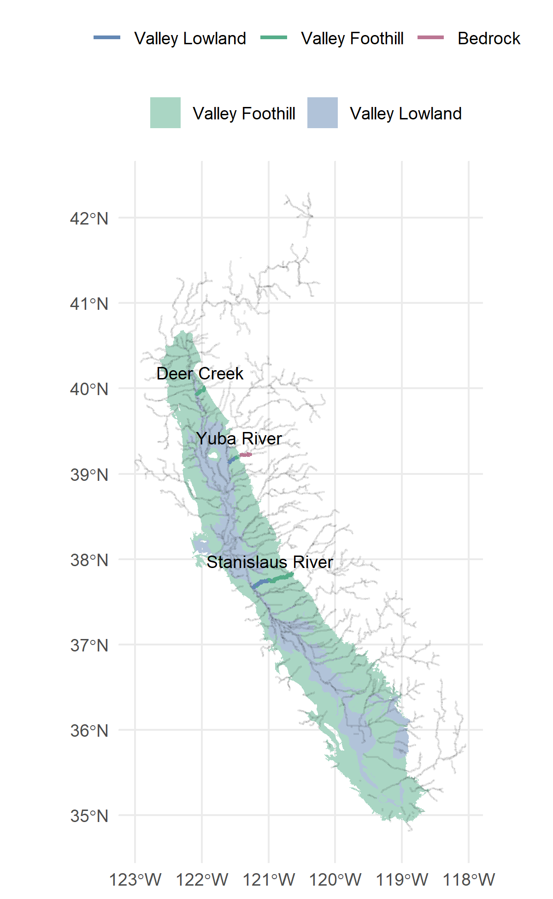<!-- -->

### Exploration and PCA

``` r
df <- flowline_attributes |>
  select(
         # predictors of flow (as would be found in a regional regression)
         slope, da_area_sq_km, da_elev_mean, da_ppt_mean_mm, 
         # baseflow and peakflow statistics
         nf_bfl_dry_cfs, nf_bfl_wet_cfs, erom_q_ma_cfs, peak_q2_cfs, peak_q5_cfs, peak_q10_cfs,
         # flow and channel characteristics, hydrologically predicted
         bf_depth_m, bf_w_d_ratio, erom_v_ma_fps,
         # misc characteristics of the catchment
         da_avg_slope, da_k_erodibility, mean_ndvi,
         # misc characteristics of the locality
         loc_bfi, loc_pct_clay, loc_pct_sand, loc_permeability, loc_bedrock_depth, loc_ppt_mean_mm,
         # channel confinement characteristics
         mtpi30_min, vb_width_transect, vb_bf_w_ratio, 
         # channel sinuosity
         sinuosity,
         # aquatic
         # bio_aq_rank_sw, species, species_fish
         ) |> 
  na.omit() |> 
  scale() 

df |> cor() |> corrr::rplot() + theme(axis.text.x = element_text(angle = 90, vjust = 0.5, hjust=1))
```

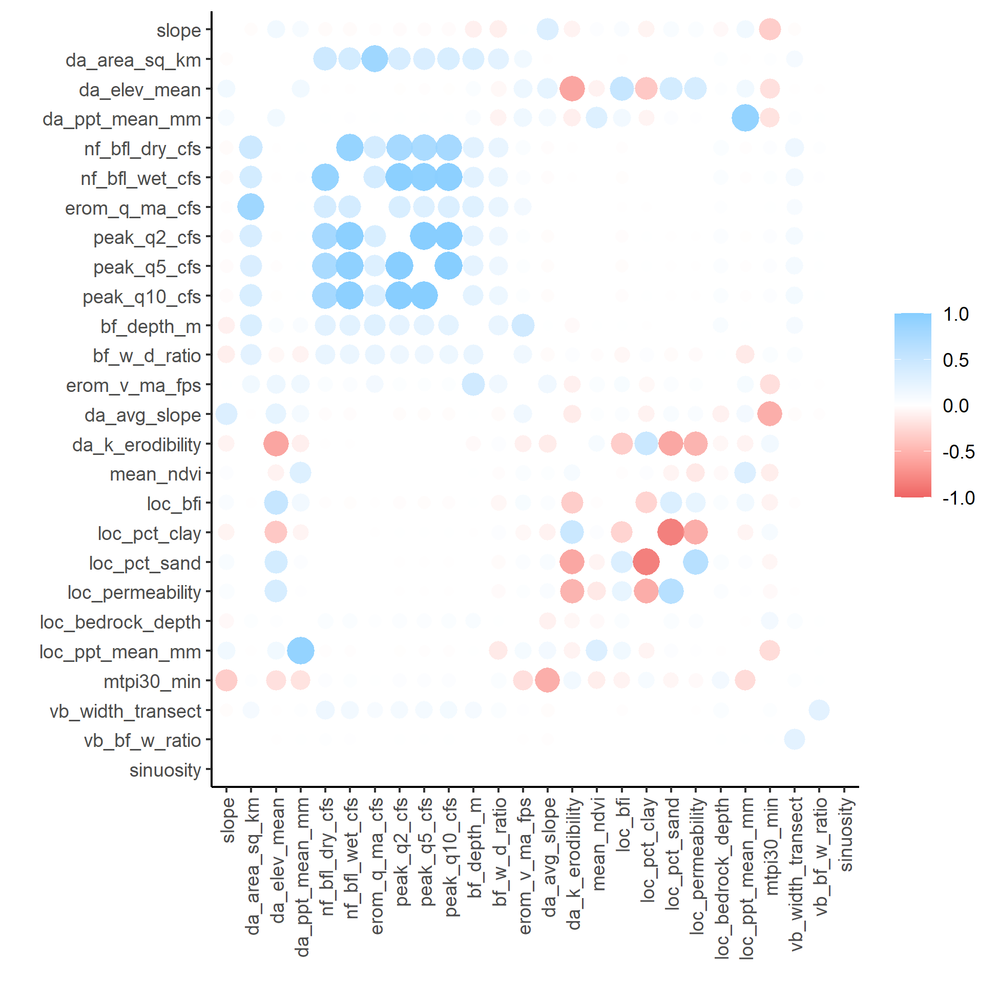<!-- -->

``` r
# uniqueness: 
# df |> cor() |> abs() |> rowMeans() |> rank() 
pca <- princomp(df) 
#summary(pca)

factoextra::fviz_eig(pca, addlabels = TRUE)
```

<!-- -->

``` r
factoextra::fviz_cos2(pca, choice = "var", axes = 1:2)
```

<!-- -->

``` r
factoextra::fviz_pca_var(pca, axes=c(1,2), col.var = "cos2", repel = TRUE)
```

<!-- -->

``` r
factoextra::fviz_pca_var(pca, axes=c(1,3), col.var = "cos2", repel = TRUE)
```

<!-- -->

``` r
factoextra::fviz_pca_var(pca, axes=c(2,3), col.var = "cos2", repel = TRUE)
```

<!-- -->

``` r
# flowlines |> GGally::ggpairs()
```

## Training Data Setup

``` r
# pick variable to use for normalization
# norm_var <- sym("erom_q_ma_cfs")
#norm_var <- sym("da_area_sq_km")
norm_var <- sym("da_scalar")

filter_variable_ranges <- function(data) {
  data |>
    filter(da_area_sq_km > 100) # 1000 may have better model performance, 100 encompasses all streams we want to predict
}

td <- train_data |>
  mutate(flow_norm_cfs = flow_cfs / !!norm_var) |> # flow as a percent of mean annual flow
  mutate(wua_per_lf = area_wua_ft2 / length_ft,
         #log_wua_per_lf = log(wua_per_lf), # transect-wise habitat area per linear foot
         ihs_wua_per_lf = asinh(wua_per_lf), # inverse hyperbolic sine as alternative to log that can handle zeros
         wua_per_lf_norm = wua_per_lf / !!norm_var,
         #log_wua_per_lf_norm = log(wua_per_lf_norm), # transect-wise habitat area per linear foot
         ihs_wua_per_lf_norm = asinh(wua_per_lf_norm), # transect-wise habitat area per linear foot
         tot_area_per_lf = area_tot_ft2 / length_ft,
         #log_tot_area_per_lf = log(tot_area_per_lf),
         ihs_tot_area_per_lf = asinh(tot_area_per_lf)
         ) |> 
  transmute(dataset, comid, length_ft, case_wt,
         # suitable habitat area normalized by reach length
         hsi_frac, wua_per_lf, ihs_wua_per_lf, wua_per_lf_norm, ihs_wua_per_lf_norm, tot_area_per_lf, ihs_tot_area_per_lf,
         # flow cfs normalized by mean annual flow
         flow_cfs, flow_norm_cfs,
         # predictors of flow (as would be found in a regional regression)
         slope, da_area_sq_km, da_elev_mean, da_ppt_mean_mm, 
         # baseflow and peakflow statistics
         # nf_bfl_dry_cfs, nf_bfl_wet_cfs, erom_q_ma_cfs, peak_q2_cfs, peak_q5_cfs, peak_q10_cfs,
         # flow and channel characteristics, hydrologically predicted
         bf_depth_m, bf_w_d_ratio, # erom_v_ma_fps,
         # misc characteristics of the catchment
         da_avg_slope, da_k_erodibility, mean_ndvi,
         # misc characteristics of the locality
         loc_bfi, loc_pct_clay, loc_pct_sand, loc_permeability, loc_bedrock_depth, loc_ppt_mean_mm,
         # channel confinement characteristics
         mtpi30_min, vb_width_transect, vb_bf_w_ratio, frac_leveed_longitudinal,
         # channel sinuosity
         sinuosity,
         # aquatic
         # bio_aq_rank_sw, species, species_fish,
         # fixed effects
         hqt_gradient_class=droplevels(hqt_gradient_class), hyd_cls=droplevels(hyd_cls),
         # scalar for normalizing
         da_scalar
         ) |> 
  #mutate(nf_bfl_dry_cfs_norm = nf_bfl_dry_cfs/!!norm_var, 
  #       nf_bfl_wet_cfs_norm = nf_bfl_wet_cfs/!!norm_var) |>
  drop_na() |> 
  filter_variable_ranges() |>
  glimpse()
```

    ## Rows: 19,226
    ## Columns: 36
    ## $ dataset                  <chr> "Lower Yuba River", "Lower Yuba River", "Lowe…
    ## $ comid                    <dbl> 8062583, 8062583, 8062583, 8062583, 8062583, …
    ## $ length_ft                <dbl> 83.03531, 83.03531, 83.03531, 83.03531, 83.03…
    ## $ case_wt                  <imp_wts> 83.03531, 83.03531, 83.03531, 83.03531, 8…
    ## $ hsi_frac                 <dbl> 0.2373422, 0.2050521, 0.1807279, 0.1705799, 0…
    ## $ wua_per_lf               <dbl> 13.48619, 12.17890, 11.19774, 10.96250, 10.63…
    ## $ ihs_wua_per_lf           <dbl> 3.296185, 3.194534, 3.110847, 3.089701, 3.059…
    ## $ wua_per_lf_norm          <dbl> 0.2659426, 0.2401634, 0.2208152, 0.2161764, 0…
    ## $ ihs_wua_per_lf_norm      <dbl> 0.2629035, 0.2379127, 0.2190590, 0.2145271, 0…
    ## $ tot_area_per_lf          <dbl> 56.82170, 59.39419, 62.00580, 64.26606, 66.22…
    ## $ ihs_tot_area_per_lf      <dbl> 4.733143, 4.777414, 4.820440, 4.856239, 4.886…
    ## $ flow_cfs                 <dbl> 300, 400, 500, 600, 700, 800, 900, 1000, 1100…
    ## $ flow_norm_cfs            <dbl> 5.915888, 7.887851, 9.859814, 11.831776, 13.8…
    ## $ slope                    <dbl> 0.008, 0.008, 0.008, 0.008, 0.008, 0.008, 0.0…
    ## $ da_area_sq_km            <dbl> 3110.288, 3110.288, 3110.288, 3110.288, 3110.…
    ## $ da_elev_mean             <dbl> 1379.63, 1379.63, 1379.63, 1379.63, 1379.63, …
    ## $ da_ppt_mean_mm           <dbl> 1675.915, 1675.915, 1675.915, 1675.915, 1675.…
    ## $ bf_depth_m               <dbl> 2.83, 2.83, 2.83, 2.83, 2.83, 2.83, 2.83, 2.8…
    ## $ bf_w_d_ratio             <dbl> 24.80565, 24.80565, 24.80565, 24.80565, 24.80…
    ## $ da_avg_slope             <dbl> 29.4, 29.4, 29.4, 29.4, 29.4, 29.4, 29.4, 29.…
    ## $ da_k_erodibility         <dbl> 0.2423, 0.2423, 0.2423, 0.2423, 0.2423, 0.242…
    ## $ mean_ndvi                <dbl> 0.4897366, 0.4897366, 0.4897366, 0.4897366, 0…
    ## $ loc_bfi                  <dbl> 38, 38, 38, 38, 38, 38, 38, 38, 38, 38, 38, 3…
    ## $ loc_pct_clay             <dbl> 21.08, 21.08, 21.08, 21.08, 21.08, 21.08, 21.…
    ## $ loc_pct_sand             <dbl> 23.42, 23.42, 23.42, 23.42, 23.42, 23.42, 23.…
    ## $ loc_permeability         <dbl> 3.11, 3.11, 3.11, 3.11, 3.11, 3.11, 3.11, 3.1…
    ## $ loc_bedrock_depth        <dbl> 59.89, 59.89, 59.89, 59.89, 59.89, 59.89, 59.…
    ## $ loc_ppt_mean_mm          <dbl> 767.475, 767.475, 767.475, 767.475, 767.475, …
    ## $ mtpi30_min               <dbl> -33, -33, -33, -33, -33, -33, -33, -33, -33, …
    ## $ vb_width_transect        <dbl> 70.2, 70.2, 70.2, 70.2, 70.2, 70.2, 70.2, 70.…
    ## $ vb_bf_w_ratio            <dbl> 1, 1, 1, 1, 1, 1, 1, 1, 1, 1, 1, 1, 1, 1, 1, …
    ## $ frac_leveed_longitudinal <dbl> 0, 0, 0, 0, 0, 0, 0, 0, 0, 0, 0, 0, 0, 0, 0, …
    ## $ sinuosity                <dbl> 1.01, 1.01, 1.01, 1.01, 1.01, 1.01, 1.01, 1.0…
    ## $ hqt_gradient_class       <fct> Bedrock, Bedrock, Bedrock, Bedrock, Bedrock, …
    ## $ hyd_cls                  <fct> High-volume snowmelt and rain, High-volume sn…
    ## $ da_scalar                <dbl> 50.7109, 50.7109, 50.7109, 50.7109, 50.7109, …

``` r
td |> ggplot() +
  geom_line(aes(x = flow_cfs, y = wua_per_lf, group=comid), color="lightgray") + 
  geom_smooth(aes(x = flow_cfs, y = wua_per_lf, color=hqt_gradient_class), se=F, method="gam") + 
  scale_x_log10(labels=scales::label_comma()) + scale_y_log10(labels=scales::label_comma()) +
  ggtitle("Summary of Training Data") + ylab("WUA (ft per linear ft)") + xlab("Flow (cfs)") + 
  facet_wrap(~dataset, ncol=1) + theme(legend.position = "top")
```

    ## Warning: Transformation introduced infinite values in continuous y-axis
    ## Transformation introduced infinite values in continuous y-axis

    ## `geom_smooth()` using formula = 'y ~ s(x, bs = "cs")'

    ## Warning: Removed 111 rows containing non-finite values (`stat_smooth()`).

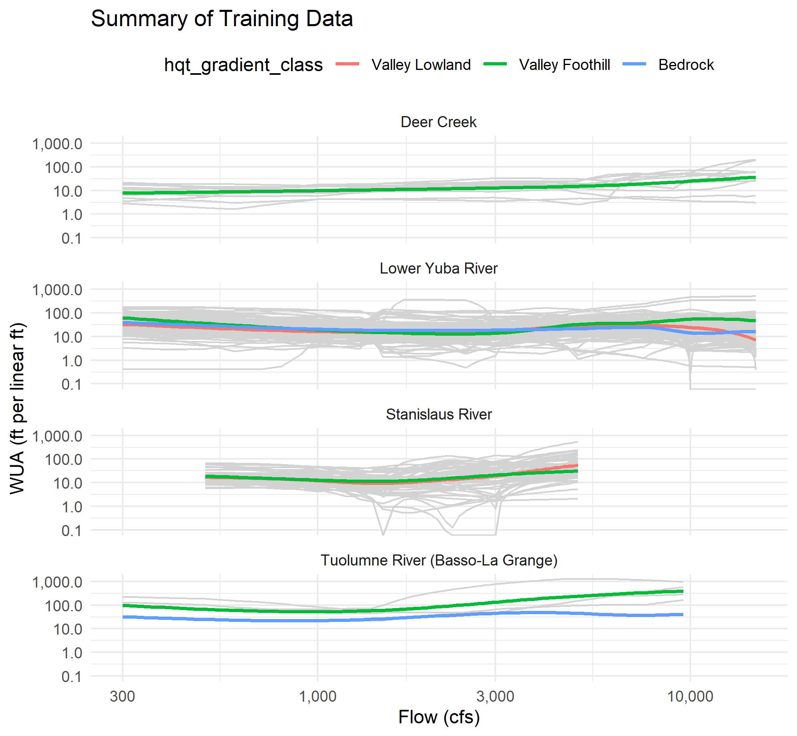<!-- -->

Calculate the ranges of the predictor variables

``` r
# td |> 
#   group_by(dataset) |>
#   select_if(is.numeric) |>
#   pivot_longer(cols = hsi_frac:last_col()) |>
#   group_by(dataset, name) |>
#   summarize(min = min(value), max=max(value))

domain <- td |> 
  select_if(is.numeric) |>
  pivot_longer(cols = hsi_frac:last_col()) |>
  group_by(name) |>
  summarize(min=min(value), max=max(value)) |>
  mutate(value = map2(min, max, function(x, y) list(min=x, max=y))) |>
  select(name, value) |> deframe()

within_domain <- function(x, name) {
  if (name %in% names(domain)) {
    res <- x >= domain[[name]][["min"]] & x <= domain[[name]][["max"]]
    message(paste(name, "matches", sum(res), "of", length(x), "rows"))
    return(res)
  }
  else {
    return(TRUE)
  }
}

filter_within_domain <- function(data, .cols = everything()) {
  out <- data |>
    filter((if_all({{.cols}}, function(x) within_domain(x, cur_column()))))
  message(paste("all conditions matched by", nrow(out), "of", nrow(data), "rows"))
  return(out)
}

# example usage
# pd |> nrow()
# pd |> filter_within_domain(c(flow_cfs, da_area_sq_km, da_elev_mean)) |> nrow()
```

``` r
td |> 
  select(wua_per_lf, slope:sinuosity) |>
  pivot_longer(cols = everything()) |>
  ggplot(aes(x = value)) + 
  geom_histogram(aes(y = after_stat(count / sum(count)))) +
  facet_wrap(~name, scales = "free_x") +
  scale_x_continuous(trans = ihs) + theme(panel.grid.minor = element_blank())
```

    ## `stat_bin()` using `bins = 30`. Pick better value with `binwidth`.

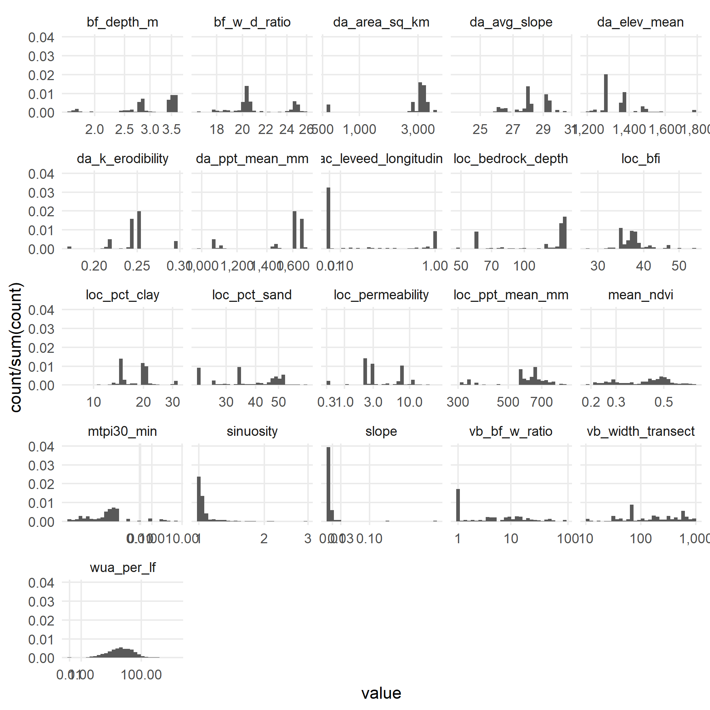<!-- -->

``` r
identify_outliers <- function(x, qlo = 0.1, qhi = 0.9) {
  lo <- quantile(x, qlo)
  hi <- quantile(x, qhi)
  return(x < lo | x > hi)
}
# td |> filter((if_all(slope:sinuosity, function(x) !identify_outliers(x, qlo=0.1, qhi=0.9)))) 
  
clip_outliers <- function(x, qlo = 0.1, qhi = 0.9) {
  lo <- quantile(x, qlo)
  hi <- quantile(x, qhi)
  clip_lo <- if_else(x > lo, x, lo)
  clip_hi <- if_else(clip_lo < hi, clip_lo, hi)
  return(clip_hi)
}
# td |> mutate(across(slope:sinuosity, function(x) clip_outliers(x, qlo=0.1, qhi=0.9)))
  
n_breaks <- 10
td |>
  select(comid, wua_per_lf, flow_cfs, slope:sinuosity) |>
  mutate(across(slope:sinuosity, function(x) cut(x, breaks=n_breaks, labels=seq(1,n_breaks)/n_breaks))) |>
  pivot_longer(cols = slope:sinuosity) |>
  ggplot(aes(x = flow_cfs, y = wua_per_lf)) +
  facet_wrap(~name) + geom_smooth(aes(color = value), se=F) +
  scale_color_viridis_d(name = "Percentile of predictor variable", option = "cividis", direction=-1) +
  theme(legend.position = "top") + guides(color=guide_legend(nrow=2, byrow=TRUE)) +
  scale_x_log10() + scale_y_log10() + theme(panel.grid.minor = element_blank())
```

    ## Warning: Transformation introduced infinite values in continuous y-axis

    ## `geom_smooth()` using method = 'gam' and formula = 'y ~ s(x, bs = "cs")'

    ## Warning: Removed 2220 rows containing non-finite values (`stat_smooth()`).

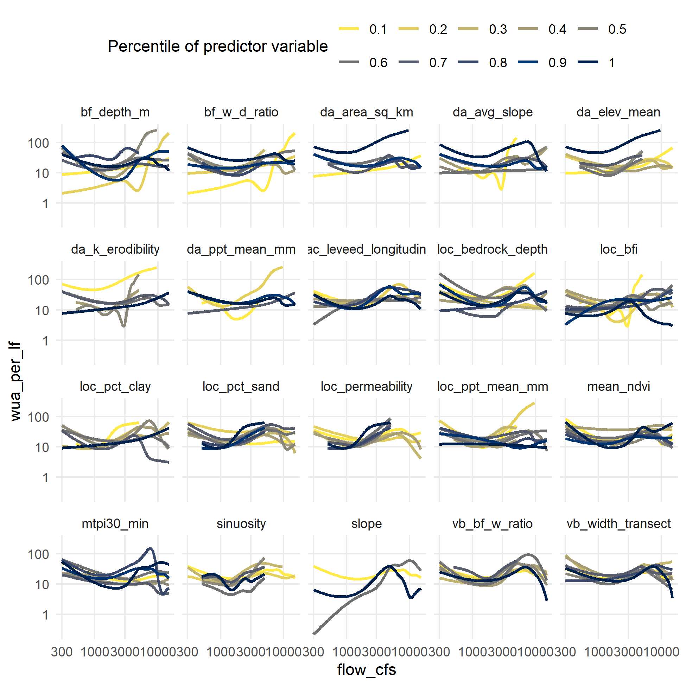<!-- -->

Split into training and testing datasets

``` r
set.seed(47)
td_split <- group_initial_split(td |> mutate(strata=paste(hyd_cls, dataset)), strata=strata, group=comid)

# select some example reaches to use for validation
test_comids <- testing(td_split) |> group_by(dataset, hyd_cls, comid) |> summarize() |> group_by(dataset, hyd_cls) |> filter(row_number()<=11) |> pull(comid) 
```

    ## `summarise()` has grouped output by 'dataset', 'hyd_cls'. You can override
    ## using the `.groups` argument.

## Model Training

### Scale Dependent Model: WUA-per-linear-ft versus flow

Scale-dependent model version predicts the WUA per linear foot, using
absolute flow values as well as watershed scale parameters.

Straightforward but highly sensitive to the ranges of flow data
available in training datasets.

``` r
sd_rec <- recipe(data=training(td_split), 
      formula = ihs_wua_per_lf + case_wt ~ 
        # flow (cfs)
        flow_cfs + 
        # predictors of flow (catchment area, elevation, and MAP) -- attributes for gradient and upstream drainage area are interrelated
        slope + da_area_sq_km + da_elev_mean + da_ppt_mean_mm +
        # baseflow/peak flow statistics
        # nf_bfl_dry_cfs + nf_bfl_wet_cfs + erom_q_ma_cfs + #log(peak_q2_cfs)  + log(peak_q5_cfs) + log(peak_q10_cfs) +
        # flow and channel characteristics, hydrologically predicted
        #erom_v_ma_fps + 
        bf_depth_m + bf_w_d_ratio + 
        # misc characteristics of the catchment
        da_k_erodibility + da_avg_slope + mean_ndvi +
        # misc characteristics of the locality
        loc_bfi + loc_pct_clay + loc_pct_sand + loc_permeability + loc_bedrock_depth + loc_ppt_mean_mm +
        # channel confinement characteristics
        mtpi30_min + vb_bf_w_ratio + frac_leveed_longitudinal + vb_width_transect +
        # channel sinuosity
        sinuosity #+ 
        # aquatic
        # bio_aq_rank_sw + species + species_fish + 
        # fixed effects
        # hqt_gradient_class + hyd_cls
        ) |>
 #step_log(all_numeric_predictors(), -mtpi30_min, -mean_ndvi, -vb_bf_w_ratio, -frac_leveed_longitudinal) |>
  step_mutate_at(all_numeric_predictors(), fn = asinh) |>
  step_interact(terms = ~ slope:da_area_sq_km) |>
  #step_dummy(hqt_gradient_class) |>
  #step_dummy(hyd_cls) |>
  step_interact(terms = ~flow_cfs:all_predictors()) |>
  step_naomit(all_predictors()) |>
  step_zv(all_predictors()) |>
  step_normalize(all_numeric_predictors()) 
```

#### Linear Regression

``` r
lm_spec <- linear_reg() 

lm_sd <- workflow() |>
  add_recipe(sd_rec) |>
  add_model(lm_spec) |>
  add_case_weights(case_wt) |>
  fit(data=training(td_split))

lm_sd |> glance()
```

    ## # A tibble: 1 × 12
    ##   r.squared adj.r.squared sigma statistic p.value    df  logLik    AIC    BIC
    ##       <dbl>         <dbl> <dbl>     <dbl>   <dbl> <dbl>   <dbl>  <dbl>  <dbl>
    ## 1     0.412         0.410  30.4      259.       0    43 -22439. 44968. 45313.
    ## # ℹ 3 more variables: deviance <dbl>, df.residual <int>, nobs <int>

``` r
lm_sd |> tidy()
```

    ## # A tibble: 44 × 5
    ##    term             estimate std.error statistic  p.value
    ##    <chr>               <dbl>     <dbl>     <dbl>    <dbl>
    ##  1 (Intercept)          3.83   0.00787   486.    0       
    ##  2 flow_cfs            29.2   20.3         1.43  1.51e- 1
    ##  3 slope              109.    15.5         7.05  1.82e-12
    ##  4 da_area_sq_km       -7.32   1.29       -5.66  1.56e- 8
    ##  5 da_elev_mean         3.47   2.63        1.32  1.88e- 1
    ##  6 da_ppt_mean_mm       3.03   2.40        1.26  2.06e- 1
    ##  7 bf_depth_m           7.73   0.695      11.1   1.09e-28
    ##  8 bf_w_d_ratio         2.61   0.353       7.39  1.57e-13
    ##  9 da_k_erodibility    -1.11   1.84       -0.604 5.46e- 1
    ## 10 da_avg_slope        -2.71   1.73       -1.57  1.17e- 1
    ## # ℹ 34 more rows

``` r
lm_sd_res <- testing(td_split) |>
  transmute(comid, flow_cfs,
            # actuals
            ihs_wua_per_lf, 
            wua_per_lf = sinh(ihs_wua_per_lf),
            # predicted
            ihs_wua_per_lf_pred = predict(lm_sd, testing(td_split))[[".pred"]],
            wua_per_lf_pred=sinh(ihs_wua_per_lf_pred))

lm_sd_res |>
  arrange(comid, flow_cfs) |>
  ggplot() + geom_path(aes(x=wua_per_lf, y=wua_per_lf_pred, color=flow_cfs, group=comid), linewidth=2) + 
  #scale_y_log10(limits=c(1,NA)) + scale_x_log10(limits=c(1,NA)) + 
  scale_y_continuous(trans=ihs, limits=c(1,NA), labels=scales::label_comma()) + 
  scale_x_continuous(trans=ihs, limits=c(1,NA), labels=scales::label_comma()) +
  coord_fixed() + geom_abline() + scale_color_viridis_c(name="Flow (cfs)") + 
  ggtitle("Scale-dependent model, linear regression") +
  xlab("Suitable Habitat Area (ft2) per LF (Actual)") + ylab("Suitable Habitat Area (ft2) per LF (Predicted)")
```

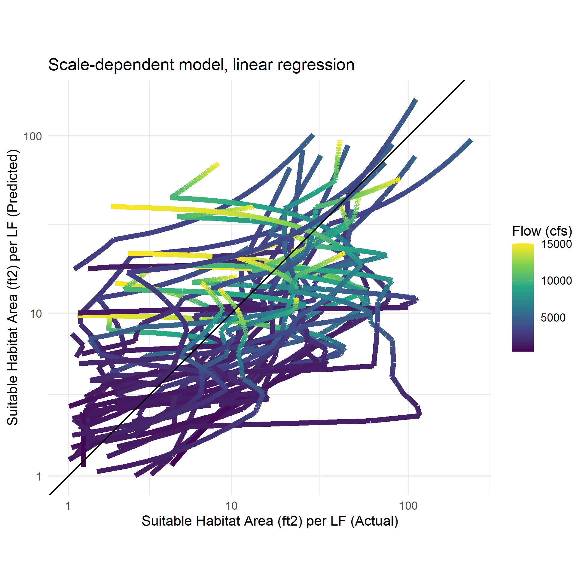<!-- -->

``` r
lm_sd_res |>
  filter(flow_cfs %in% c(300,500,1000,1500,3000,5000,10000,15000)) |>
  ggplot() + geom_point(aes(x=wua_per_lf, y=wua_per_lf_pred, color=flow_cfs)) + 
  facet_wrap(~flow_cfs, ncol = 4) +
  #scale_y_log10(limits=c(1,NA)) + scale_x_log10(limits=c(1,NA)) + 
  scale_y_continuous(trans=ihs, limits=c(1,NA), labels=scales::label_comma()) + 
  scale_x_continuous(trans=ihs, limits=c(1,NA), labels=scales::label_comma()) +
  coord_fixed() + geom_abline() + scale_color_viridis_c(name="Flow (cfs)") + 
  ggtitle("Scale-dependent model, linear regression") +
  xlab("Suitable Habitat Area (ft2) per LF (Actual)") + ylab("Suitable Habitat Area (ft2) per LF (Predicted)")
```

    ## Warning: Removed 1 rows containing missing values (`geom_point()`).

<!-- -->

``` r
lm_sd_res |> filter(comid %in% test_comids) |>
  ggplot(aes(x=flow_cfs, group=1)) + facet_wrap(~comid) + 
  geom_line(aes(y=wua_per_lf_pred, color="predicted", group=1)) + geom_line(aes(y=wua_per_lf, color="actual", group=1)) + 
  scale_y_continuous(trans = ihs, limits = c(0, NA)) +
  xlab("Flow (cfs)") + ylab("Suitable Habitat Area per LF Channel (ft)")  +
  theme(axis.text.x = element_text(angle = 90, vjust = 0.5, hjust=1), panel.grid.minor=element_blank()) +
  scale_x_continuous(labels = scales::label_comma())
```

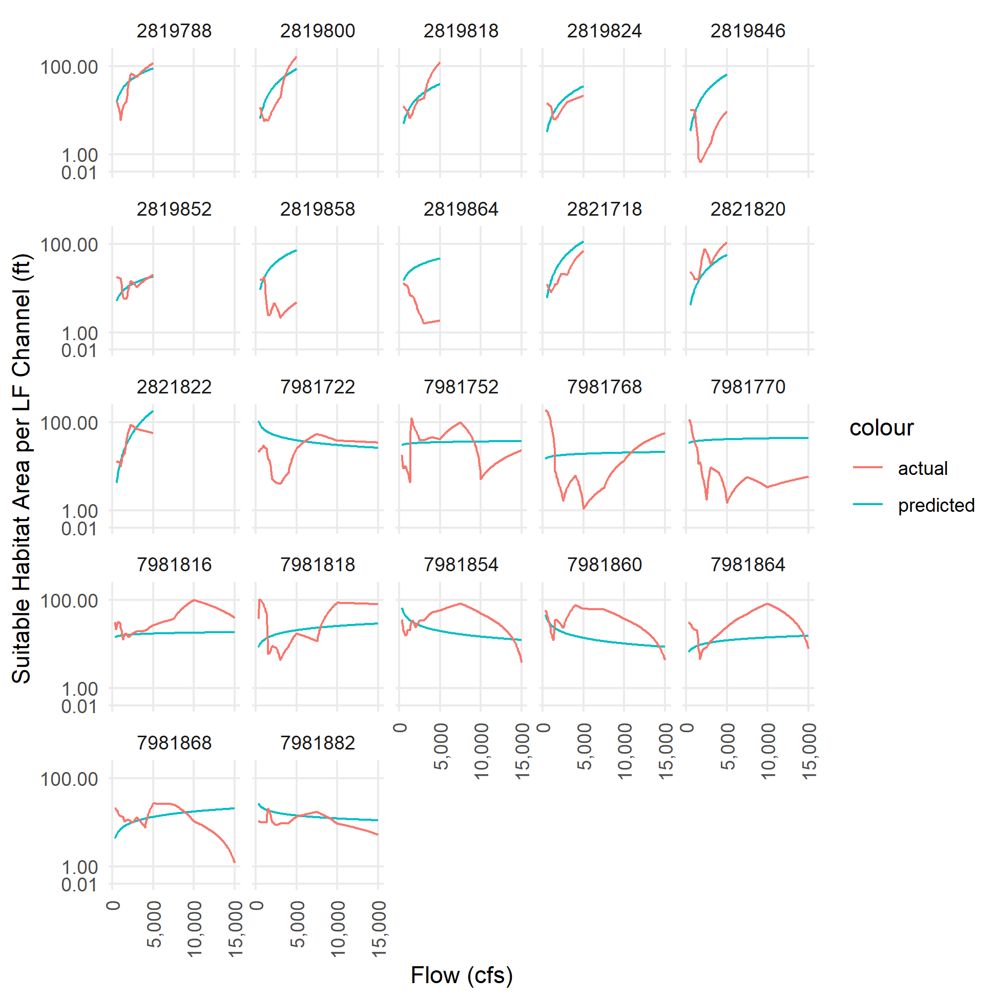<!-- -->

``` r
lm_sd |>
  tidy() |>
  mutate(ixn_class = if_else(str_detect(term, "flow_cfs_x_"), "term_flow_cfs_x_", "term") |> 
                     factor(levels = c("term", "term_flow_cfs_x_"), labels = c("Constant Effect", "Interaction with Flow (cfs)")),
         term_root = str_replace(term, "flow_cfs_x_", ""),
         coeff_dir = if_else(estimate>0, "Positive", "Negative"),
         ci_lower = estimate - qt(0.975, df = glance(lm_sd)$df) * std.error,
         ci_upper = estimate + qt(0.975, df = glance(lm_sd)$df) * std.error,
         estimate_abs = abs(estimate),
         ci_lower_abs = ci_lower * if_else(coeff_dir=="Negative",-1,1),
         ci_upper_abs = ci_upper * if_else(coeff_dir=="Negative",-1,1),
         is_significant = sign(ci_lower)==sign(ci_upper)
         ) |>
  filter(term!="flow_cfs" & term!="(Intercept)") |>
  ggplot(aes(y = term_root, color = coeff_dir)) +
  facet_wrap(~ixn_class, ncol = 2, scales = "free_x") + 
  geom_errorbarh(aes(xmin = ci_lower_abs, xmax=ci_upper_abs)) + #pmax(0,ci_lower_abs), xmax = pmax(0,ci_upper_abs))) +
  geom_point(aes(x = estimate_abs, fill = is_significant), shape=21) +
  theme(legend.position="top",
        panel.grid.minor = element_blank(),
        panel.border = element_rect(fill = NA, color = "black"), 
        legend.direction = "vertical") +
  scale_y_discrete(limits=rev) + 
  scale_fill_manual(name = "Significant (95%)", values = c("FALSE" = "white", "TRUE" = "black")) +
  scale_color_manual(name = "Direction of Effect", values = c("Negative" = "goldenrod", "Positive" = "darkcyan")) +
  xlab("Coefficient Magnitude") + ylab("")
```

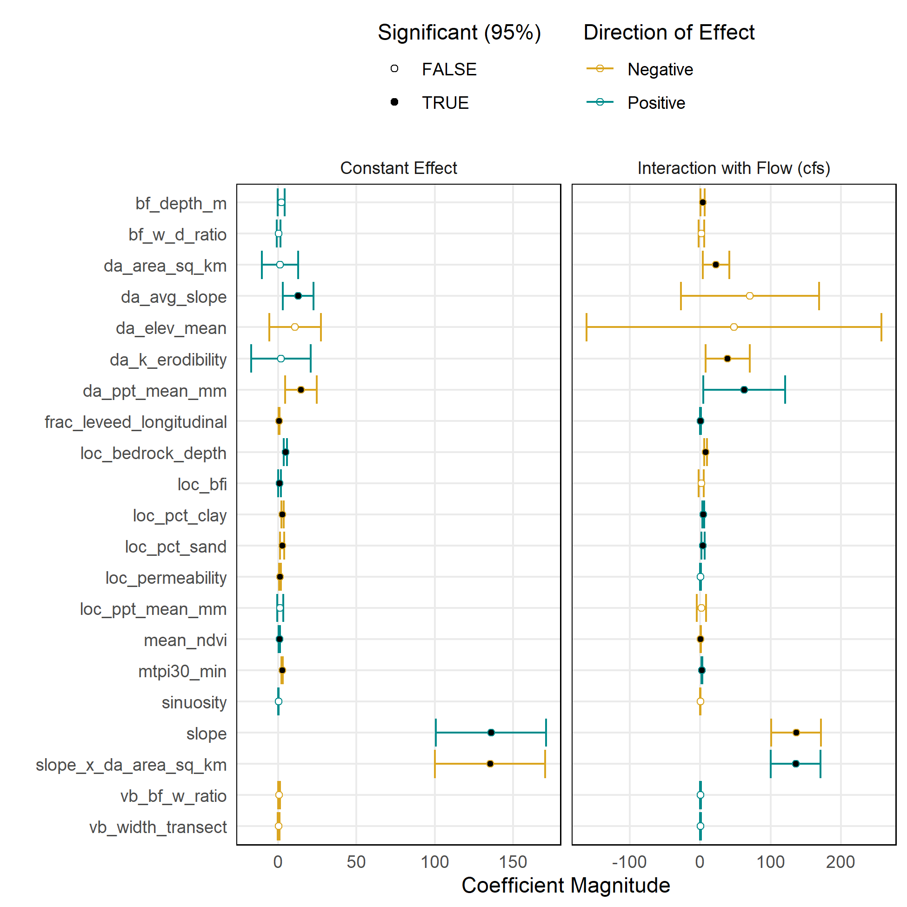<!-- -->

#### Random Forest Regression

``` r
mtry <- floor(length(sd_rec$var_info$variable[which(sd_rec$var_info$role=="predictor")])/3)
rfr_spec <- rand_forest(mode = "regression", trees = 2^8, mtry = mtry, min_n = 10) |> #, min_n = 10) |>
  #set_engine("ranger", num.threads = 4)#, sample.fraction = .8, importance = "impurity")
  set_engine("ranger", num.threads = 4)#, sample.fraction = .8, importance = "impurity")

rfr_sd <- workflow() |>
  add_recipe(sd_rec) |>
  add_model(rfr_spec) |>
  add_case_weights(case_wt) |>
  fit(data=training(td_split))

rfr_sd$fit$fit |> print()
```

    ## parsnip model object
    ## 
    ## Ranger result
    ## 
    ## Call:
    ##  ranger::ranger(x = maybe_data_frame(x), y = y, mtry = min_cols(~mtry,      x), num.trees = ~2^8, min.node.size = min_rows(~10, x), num.threads = ~4,      verbose = FALSE, seed = sample.int(10^5, 1), case.weights = weights) 
    ## 
    ## Type:                             Regression 
    ## Number of trees:                  256 
    ## Sample size:                      15952 
    ## Number of independent variables:  43 
    ## Mtry:                             7 
    ## Target node size:                 10 
    ## Variable importance mode:         none 
    ## Splitrule:                        variance 
    ## OOB prediction error (MSE):       0.05386471 
    ## R squared (OOB):                  0.9586958

``` r
rfr_sd_res <- testing(td_split) |>
  transmute(comid, flow_cfs,
            # actuals
            ihs_wua_per_lf, 
            wua_per_lf = sinh(ihs_wua_per_lf),
            # predicted
            ihs_wua_per_lf_pred = predict(rfr_sd, testing(td_split))[[".pred"]],
            wua_per_lf_pred=sinh(ihs_wua_per_lf_pred))

rfr_sd_res |>
  arrange(comid, flow_cfs) |>
  ggplot() + geom_path(aes(x=wua_per_lf, y=wua_per_lf_pred, color=flow_cfs, group=comid), linewidth=2) + 
  #scale_y_log10(limits=c(1,NA)) + scale_x_log10(limits=c(1,NA)) + 
  scale_y_continuous(trans=ihs, limits=c(1,NA), labels=scales::label_comma()) + 
  scale_x_continuous(trans=ihs, limits=c(1,NA), labels=scales::label_comma()) +
  coord_fixed() + geom_abline() + scale_color_viridis_c(name="Flow (cfs)")   + 
  ggtitle("Scale-dependent model, random forest regression") +
  xlab("Suitable Habitat Area (ft2) per LF (Actual)") + ylab("Suitable Habitat Area (ft2) per LF (Predicted)")
```

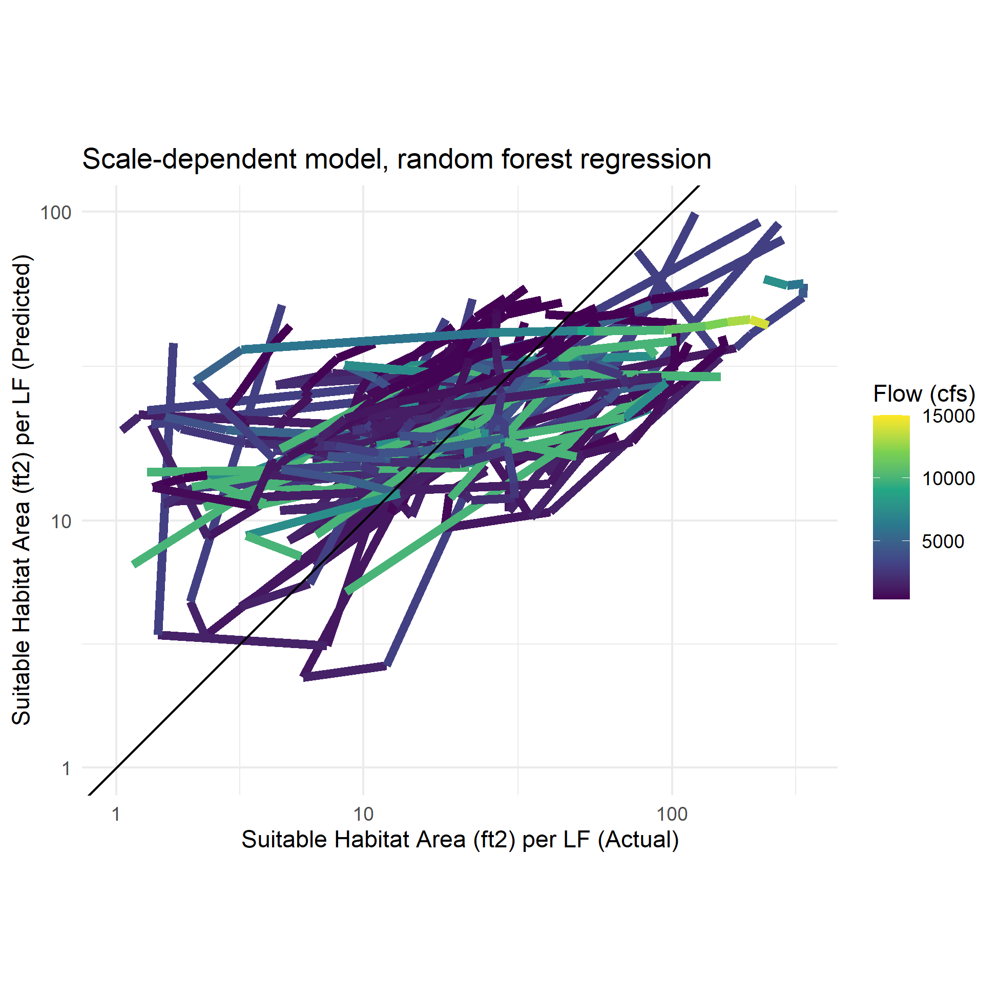<!-- -->

``` r
rfr_sd_res |>
  filter(flow_cfs %in% c(300,500,1000,1500,3000,5000,10000,15000)) |>
  ggplot() + geom_point(aes(x=wua_per_lf, y=wua_per_lf_pred, color=flow_cfs)) + 
  facet_wrap(~flow_cfs, ncol = 4) +
  #scale_y_log10(limits=c(1,NA)) + scale_x_log10(limits=c(1,NA)) + 
  scale_y_continuous(trans=ihs, limits=c(1,NA), labels=scales::label_comma()) + 
  scale_x_continuous(trans=ihs, limits=c(1,NA), labels=scales::label_comma()) +
  coord_fixed() + geom_abline() + scale_color_viridis_c(name="Flow (cfs)") + 
  ggtitle("Scale-dependent model, random forest regression") +
  xlab("Suitable Habitat Area (ft2) per LF (Actual)") + ylab("Suitable Habitat Area (ft2) per LF (Predicted)")
```

    ## Warning: Removed 1 rows containing missing values (`geom_point()`).

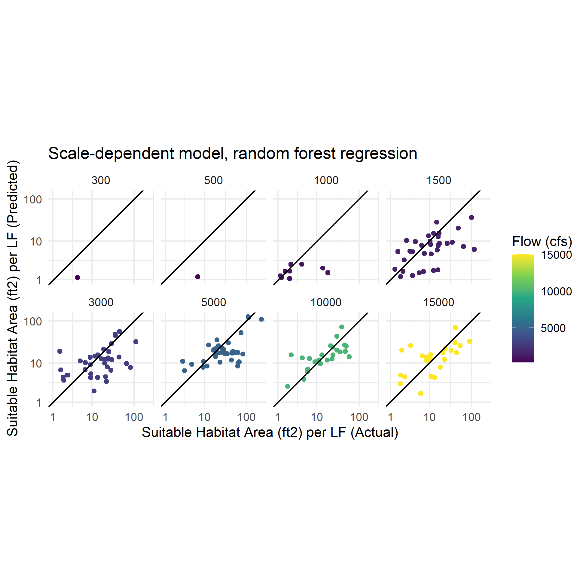<!-- -->

``` r
rfr_sd_res |> filter(comid %in% test_comids) |>
  ggplot(aes(x=flow_cfs, group=1)) + facet_wrap(~comid) + 
  geom_line(aes(y=wua_per_lf_pred, color="predicted", group=1)) + geom_line(aes(y=wua_per_lf, color="actual", group=1)) + 
  scale_y_continuous(trans = ihs, limits = c(0, NA)) + 
  xlab("Flow (cfs)") + ylab("Suitable Habitat Area per LF Channel (ft)")  +
  theme(axis.text.x = element_text(angle = 90, vjust = 0.5, hjust=1), panel.grid.minor=element_blank()) +
  scale_x_continuous(labels = scales::label_comma())
```

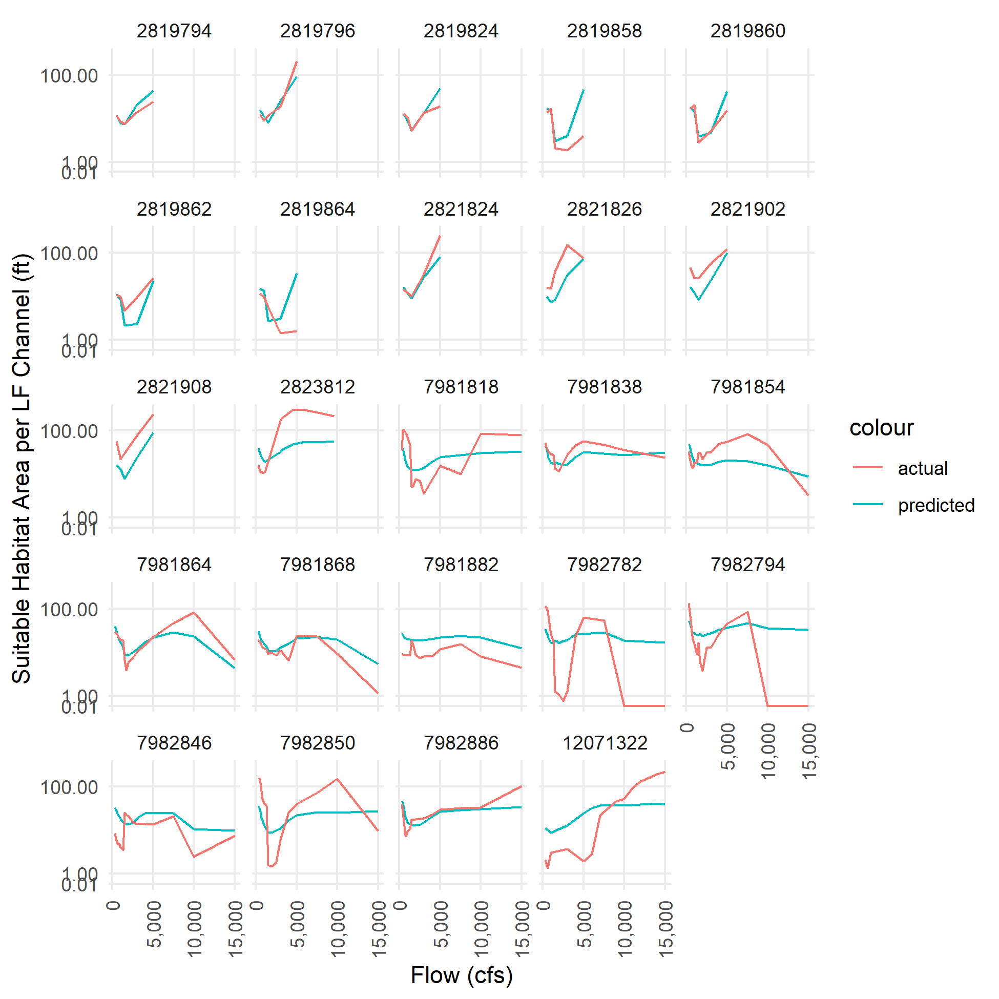<!-- -->

``` r
residuals <- sd_rec |> 
  prep(training(td_split)) |> 
  bake(td) |>
  bind_cols(td |> transmute(comid, 
                            wua_per_lf,
                            flow_cfs_orig = flow_cfs,
                            train_test = if_else(comid %in% training(td_split)$comid, "Train", "Test"))) |>
  drop_na() %>% # need to use magrittr pipe for this purpose
  mutate(ihs_wua_per_lf_pred = predict(rfr_sd$fit$fit, new_data=.)[[".pred"]]) |>
  transmute(comid, 
            wua_per_lf,
            train_test,
            flow_cfs = flow_cfs_orig, 
            ihs_wua_per_lf_pred,
            wua_per_lf_pred = sinh(ihs_wua_per_lf_pred),
            resid = wua_per_lf_pred - wua_per_lf)
residuals |> 
  group_by(train_test) |>
  summarize(mean(resid)) |> 
  deframe()
```

    ##      Test     Train 
    ## -7.462133 -2.106091

``` r
residuals |>
  ggplot(aes(x = flow_cfs)) + 
  geom_line(aes(y = wua_per_lf_pred - wua_per_lf, group = comid, color = train_test)) +
  scale_x_log10()
```

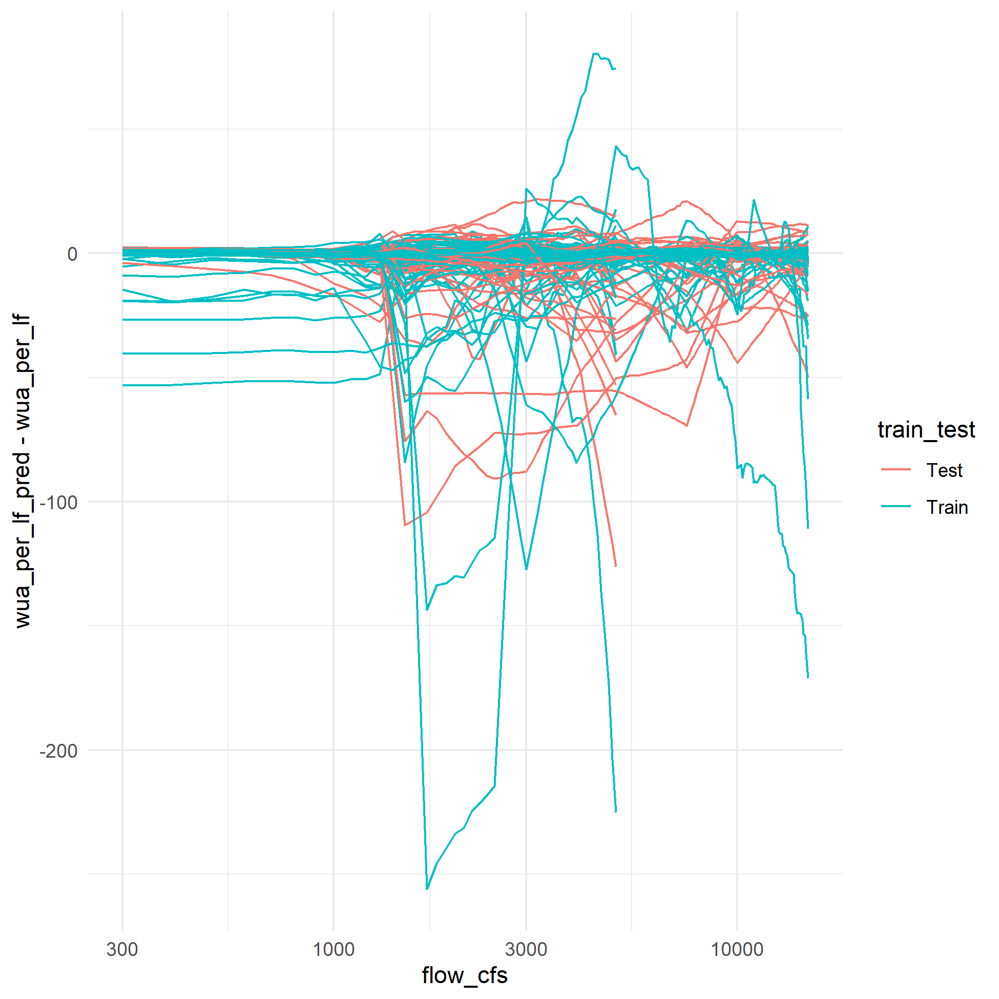<!-- -->

### Scale Dependent Model 2: TOTAL Inundated Area per linear ft versus flow:

To generate the inundation area estimates that are needed to interpret
the scale-independent %HSI model outputs

``` r
sd2_rec <- recipe(data=training(td_split), 
      formula = ihs_tot_area_per_lf + case_wt ~ 
        # flow (cfs)
        flow_cfs + 
        # predictors of flow (catchment area, elevation, and MAP) -- attributes for gradient and upstream drainage area are interrelated
        slope + da_area_sq_km + da_elev_mean + da_ppt_mean_mm +
        # baseflow/peak flow statistics
        #nf_bfl_dry_cfs + nf_bfl_wet_cfs + erom_q_ma_cfs + #log(peak_q2_cfs)  + log(peak_q5_cfs) + log(peak_q10_cfs) +
        # flow and channel characteristics, hydrologically predicted
        #erom_v_ma_fps + 
        bf_depth_m + bf_w_d_ratio + 
        # misc characteristics of the catchment
        da_k_erodibility + da_avg_slope + 
        # misc characteristics of the locality
        loc_bfi + loc_pct_clay + loc_pct_sand + loc_permeability + loc_bedrock_depth + loc_ppt_mean_mm +
        # channel confinement characteristics
        mtpi30_min + vb_bf_w_ratio + frac_leveed_longitudinal + vb_width_transect +
        # channel sinuosity
        sinuosity #+ 
        # fixed effects
        # hqt_gradient_class + hyd_cls
        ) |>
  #step_log(all_numeric_predictors(), -mtpi30_min, -vb_bf_w_ratio, -frac_leveed_longitudinal) |>
  step_mutate_at(all_numeric_predictors(), fn = asinh) |>
  step_interact(terms = ~ slope:da_area_sq_km) |>
  # step_dummy(hqt_gradient_class) |>
  # step_dummy(hyd_cls) |>
  #step_spline_nonnegative(flow_cfs) |>
  step_interact(terms = ~flow_cfs:all_predictors()) |>
  step_naomit(all_predictors()) |>
  step_zv(all_predictors()) |>
  step_normalize(all_numeric_predictors())
```

#### Linear Regression

``` r
lm_spec <- linear_reg() 

lm_sd2 <- workflow() |>
  add_recipe(sd2_rec) |>
  add_model(lm_spec) |>
  add_case_weights(case_wt) |>
  fit(data=training(td_split))

lm_sd2 |> glance()
```

    ## # A tibble: 1 × 12
    ##   r.squared adj.r.squared sigma statistic p.value    df  logLik    AIC    BIC
    ##       <dbl>         <dbl> <dbl>     <dbl>   <dbl> <dbl>   <dbl>  <dbl>  <dbl>
    ## 1     0.654         0.653  14.5      734.       0    41 -10623. 21332. 21663.
    ## # ℹ 3 more variables: deviance <dbl>, df.residual <int>, nobs <int>

``` r
lm_sd2 |> tidy()
```

    ## # A tibble: 42 × 5
    ##    term             estimate std.error statistic  p.value
    ##    <chr>               <dbl>     <dbl>     <dbl>    <dbl>
    ##  1 (Intercept)          6.27   0.00375   1674.   0       
    ##  2 flow_cfs            40.1    9.13         4.40 1.11e- 5
    ##  3 slope               34.1    7.09         4.81 1.52e- 6
    ##  4 da_area_sq_km       -4.22   0.584       -7.21 5.70e-13
    ##  5 da_elev_mean         5.00   1.19         4.20 2.65e- 5
    ##  6 da_ppt_mean_mm       2.89   1.14         2.54 1.10e- 2
    ##  7 bf_depth_m           5.39   0.325       16.6  4.47e-61
    ##  8 bf_w_d_ratio         1.96   0.166       11.7  9.87e-32
    ##  9 da_k_erodibility     3.74   0.763        4.90 9.92e- 7
    ## 10 da_avg_slope        -1.85   0.820       -2.25 2.42e- 2
    ## # ℹ 32 more rows

``` r
lm_sd2_res <- testing(td_split) |>
  transmute(comid, flow_cfs,
            # actuals
            ihs_tot_area_per_lf, 
            tot_area_per_lf = sinh(ihs_tot_area_per_lf),
            # predicted
            ihs_tot_area_per_lf_pred = predict(lm_sd2, testing(td_split))[[".pred"]],
            tot_area_per_lf_pred=sinh(ihs_tot_area_per_lf_pred))

lm_sd2_res |>
  arrange(comid, flow_cfs) |>
  ggplot() + geom_path(aes(x=tot_area_per_lf, y=tot_area_per_lf_pred, color=flow_cfs, group=comid), linewidth=2) + 
  scale_y_log10() + scale_x_log10() +  
  coord_fixed() + geom_abline() + scale_color_viridis_c(name="Flow (cfs)") + 
  ggtitle("Scale-dependent model, linear regression") +
  xlab("Total Inundated Area per LF (Actual)") + ylab("Total Inundated Area per LF (Predicted)")
```

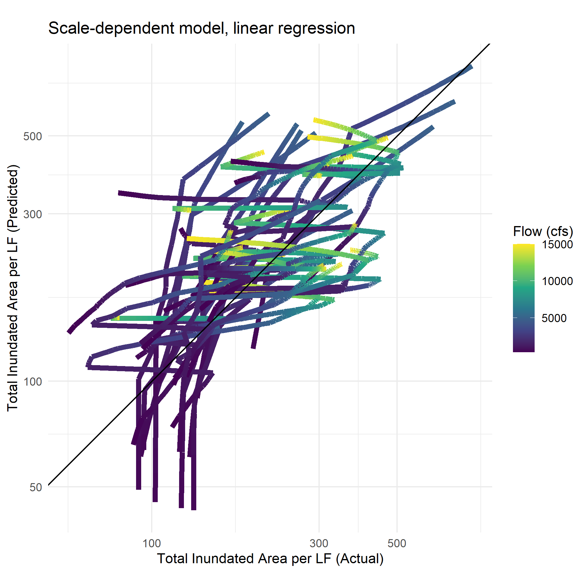<!-- -->

``` r
lm_sd2_res |>
  filter(flow_cfs %in% c(300,500,1000,1500,3000,5000,10000,15000)) |>
  ggplot() + geom_point(aes(x=tot_area_per_lf, y=tot_area_per_lf_pred, color=flow_cfs)) + 
  facet_wrap(~flow_cfs, ncol = 4) +
  scale_y_log10() + scale_x_log10() +  coord_fixed() + geom_abline() + scale_color_viridis_c(name="Flow (cfs)") + 
  ggtitle("Scale-dependent model, linear regression") +
  xlab("Total Inundated Area per LF (Actual)") + ylab("Total Inundated Area per LF (Predicted)")
```

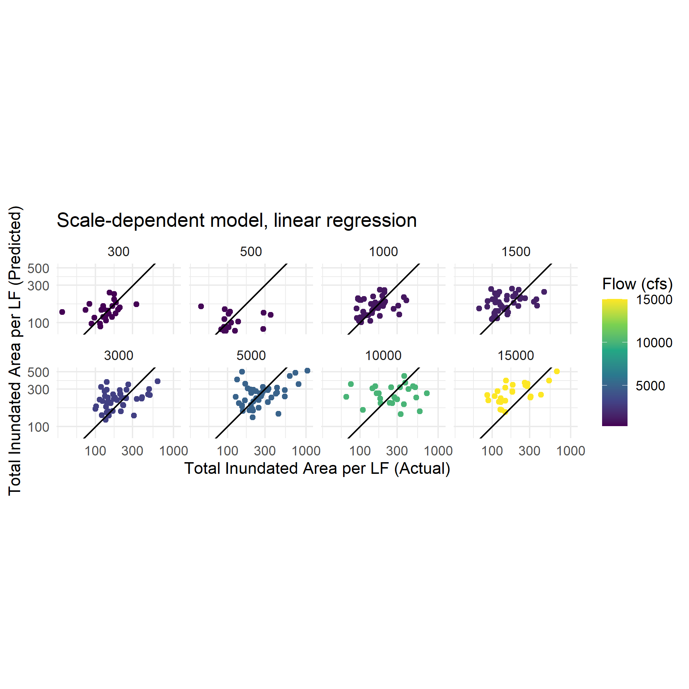<!-- -->

``` r
lm_sd2_res |> filter(comid %in% test_comids) |>
  ggplot(aes(x=flow_cfs, group=1)) + facet_wrap(~comid) + 
  geom_line(aes(y=tot_area_per_lf_pred, color="predicted", group=1)) + geom_line(aes(y=tot_area_per_lf, color="actual", group=1)) + 
  scale_y_continuous(trans = ihs) + 
  xlab("Flow (cfs)") + ylab("Total Inundated Area per LF Channel (ft)")  +
  theme(axis.text.x = element_text(angle = 90, vjust = 0.5, hjust=1), panel.grid.minor=element_blank()) +
  scale_x_continuous(labels = scales::label_comma())
```

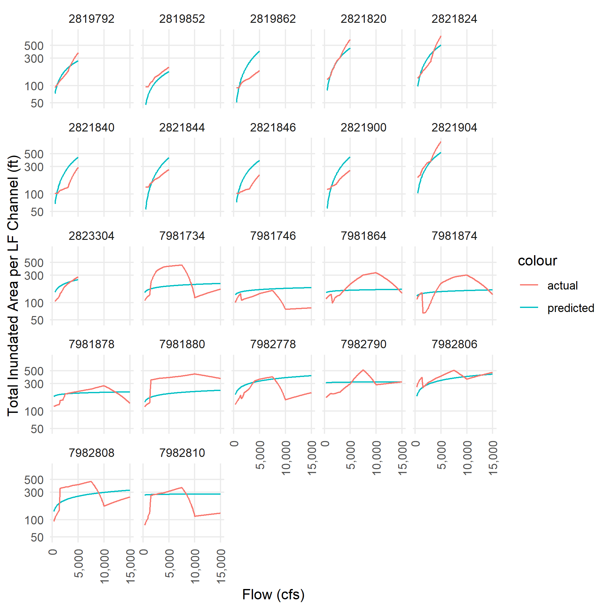<!-- -->

``` r
lm_sd2 |>
  tidy() |>
  mutate(ixn_class = if_else(str_detect(term, "flow_cfs_x_"), "term_flow_cfs_x_", "term") |> 
                     factor(levels = c("term", "term_flow_cfs_x_"), labels = c("Constant Effect", "Interaction with Flow (cfs)")),
         term_root = str_replace(term, "flow_cfs_x_", ""),
         coeff_dir = if_else(estimate>0, "Positive", "Negative"),
         ci_lower = estimate - qt(0.975, df = glance(lm_sd)$df) * std.error,
         ci_upper = estimate + qt(0.975, df = glance(lm_sd)$df) * std.error,
         estimate_abs = abs(estimate),
         ci_lower_abs = ci_lower * if_else(coeff_dir=="Negative",-1,1),
         ci_upper_abs = ci_upper * if_else(coeff_dir=="Negative",-1,1),
         is_significant = sign(ci_lower)==sign(ci_upper)
         ) |>
  filter(term!="flow_cfs" & term!="(Intercept)") |>
  ggplot(aes(y = term_root, color = coeff_dir)) +
  facet_wrap(~ixn_class, ncol = 2, scales = "free_x") + 
  geom_errorbarh(aes(xmin = ci_lower_abs, xmax=ci_upper_abs)) + #pmax(0,ci_lower_abs), xmax = pmax(0,ci_upper_abs))) +
  geom_point(aes(x = estimate_abs, fill = is_significant), shape=21) +
  theme(legend.position="top",
        panel.grid.minor = element_blank(),
        panel.border = element_rect(fill = NA, color = "black"), 
        legend.direction = "vertical") +
  scale_y_discrete(limits=rev) + 
  scale_fill_manual(name = "Significant (95%)", values = c("FALSE" = "white", "TRUE" = "black")) +
  scale_color_manual(name = "Direction of Effect", values = c("Negative" = "goldenrod", "Positive" = "darkcyan")) +
  xlab("Coefficient Magnitude") + ylab("")
```

<!-- -->

#### Random Forest Regression

``` r
mtry <- floor(length(sd2_rec$var_info$variable[which(sd2_rec$var_info$role=="predictor")])/3)
rfr_spec <- rand_forest(mode = "regression", trees = 2^8, mtry = mtry, min_n = 10) |> #, min_n = 10) |>
    set_engine("ranger", num.threads = 4)

rfr_sd2 <- workflow() |>
  add_recipe(sd2_rec) |>
  add_model(rfr_spec) |>
  add_case_weights(case_wt) |>
  fit(data=training(td_split))

rfr_sd2$fit$fit |> print()
```

    ## parsnip model object
    ## 
    ## Ranger result
    ## 
    ## Call:
    ##  ranger::ranger(x = maybe_data_frame(x), y = y, mtry = min_cols(~mtry,      x), num.trees = ~2^8, min.node.size = min_rows(~10, x), num.threads = ~4,      verbose = FALSE, seed = sample.int(10^5, 1), case.weights = weights) 
    ## 
    ## Type:                             Regression 
    ## Number of trees:                  256 
    ## Sample size:                      15952 
    ## Number of independent variables:  41 
    ## Mtry:                             6 
    ## Target node size:                 10 
    ## Variable importance mode:         none 
    ## Splitrule:                        variance 
    ## OOB prediction error (MSE):       0.009667315 
    ## R squared (OOB):                  0.9752743

``` r
rfr_sd2_res <- testing(td_split) |>
  transmute(comid, flow_cfs,
            # actuals
            ihs_tot_area_per_lf, 
            tot_area_per_lf = sinh(ihs_tot_area_per_lf),
            # predicted
            ihs_tot_area_per_lf_pred = predict(rfr_sd2, testing(td_split))[[".pred"]],
            tot_area_per_lf_pred=sinh(ihs_tot_area_per_lf_pred))

rfr_sd2_res |>
  arrange(comid, flow_cfs) |>
  ggplot() + geom_path(aes(x=tot_area_per_lf, y=tot_area_per_lf_pred, color=flow_cfs, group=comid), linewidth=2) + 
  scale_y_log10() + scale_x_log10() +  coord_fixed() + geom_abline() + scale_color_viridis_c(name="Flow (cfs)")   + 
  ggtitle("Scale-dependent model, random forest regression") +
  xlab("Total Inundated Area per LF (Actual)") + ylab("Total Inundated Area per LF (Predicted)")
```

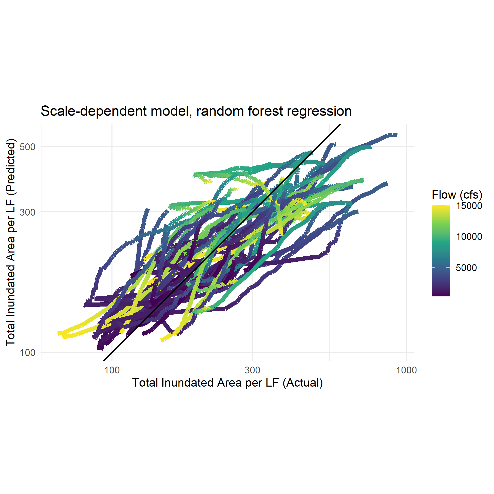<!-- -->

``` r
rfr_sd2_res |>
  filter(flow_cfs %in% c(300,500,1000,1500,3000,5000,10000,15000)) |>
  ggplot() + geom_point(aes(x=tot_area_per_lf, y=tot_area_per_lf_pred, color=flow_cfs)) + 
  facet_wrap(~flow_cfs, ncol = 4) +
  scale_y_log10() + scale_x_log10() +  coord_fixed() + geom_abline() + scale_color_viridis_c(name="Flow (cfs)") + 
  ggtitle("Scale-dependent model, random forest regression") +
  xlab("Total Inundated Area per LF (Actual)") + ylab("Total Inundated Area per LF (Predicted)")
```

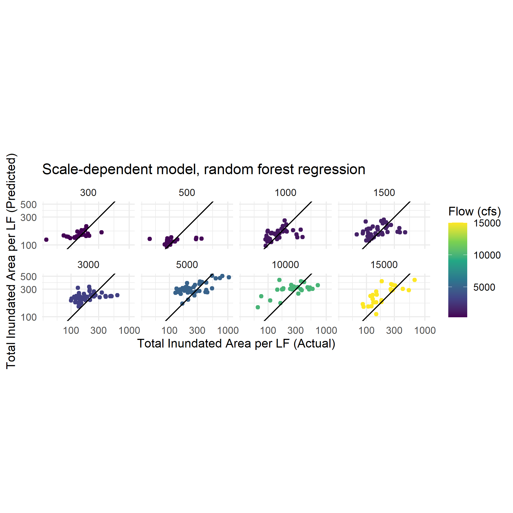<!-- -->

``` r
rfr_sd2_res |> filter(comid %in% test_comids) |>
  ggplot(aes(x=flow_cfs, group=1)) + facet_wrap(~comid) + 
  geom_line(aes(y=tot_area_per_lf_pred, color="predicted", group=1)) + geom_line(aes(y=tot_area_per_lf, color="actual", group=1)) + 
  scale_y_continuous(trans = ihs) +
  xlab("Flow (cfs)") + ylab("Total Inundated Area per LF Channel (ft)")  +
  theme(axis.text.x = element_text(angle = 90, vjust = 0.5, hjust=1), panel.grid.minor=element_blank()) +
  scale_x_continuous(labels = scales::label_comma())
```

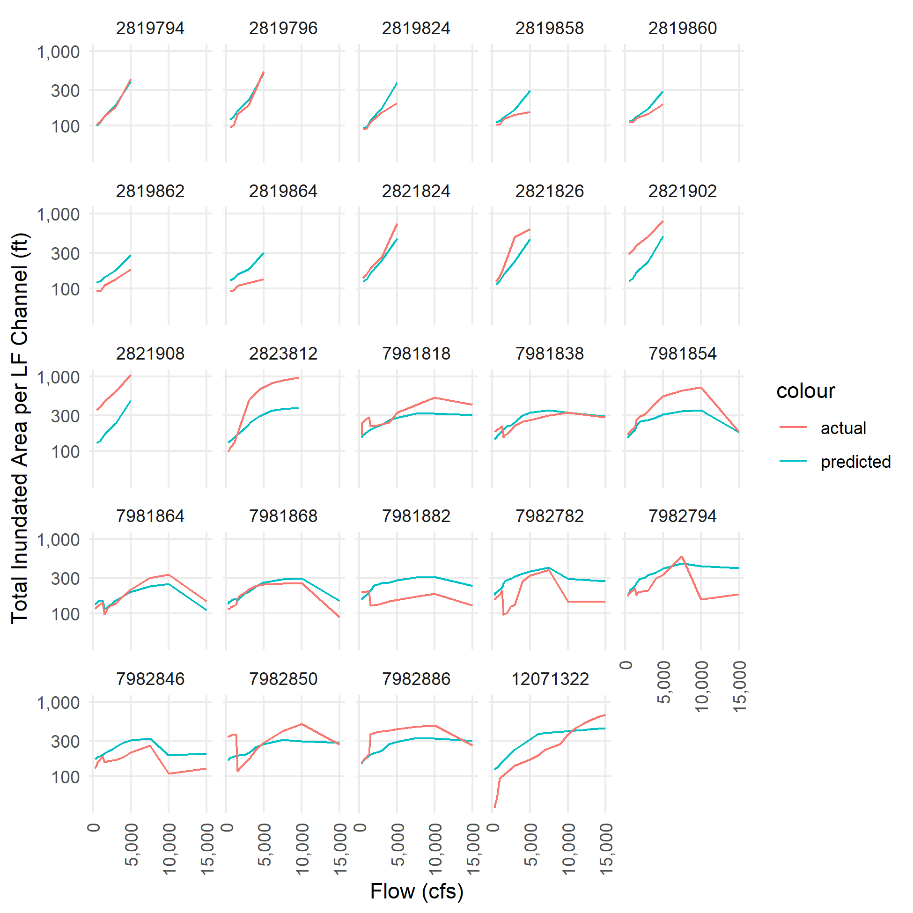<!-- -->

### Scale Independent Model: %HSI versus flow (normalized by MAF)

Scale-independent model version predicts the percent suitable habitat
area using normalized flow, and without using any direct correlates of
watershed size.

To actually apply these results requires an estimate of total inundated
area, which can be then multiplied with the predicted %HSI.

Technically this should not use linear regression as it is a proportion
between zero and one, it should more properly be using beta regression
via the betareg package.

``` r
si_rec <- recipe(data=training(td_split), 
      formula=hsi_frac + case_wt ~ 
        # flow as percent of mean annual flow
        flow_norm_cfs + 
        # channel characteristics: gradient and sinuosity
        slope + sinuosity + 
        # flow and channel characteristics, hydrologically predicted
        # erom_v_ma_fps + 
        bf_depth_m + bf_w_d_ratio + 
        # misc characteristics of the catchment
        da_k_erodibility + da_avg_slope + mean_ndvi +
        # misc characteristics of the locality
        loc_bfi + loc_pct_clay + loc_pct_sand + loc_permeability + loc_bedrock_depth + loc_ppt_mean_mm +
        # channel confinement
        mtpi30_min + vb_bf_w_ratio + frac_leveed_longitudinal #+
        # baseflow as percent of mean annual flow
        # nf_bfl_dry_cfs_norm + nf_bfl_wet_cfs_norm #+ 
        # aquatic
        # bio_aq_rank_sw + species + species_fish + 
        # fixed effects
        #hqt_gradient_class + hyd_cls
        ) |>
  #step_log(all_numeric_predictors(), -mtpi30_min, -mean_ndvi, -bio_aq_rank_sw, -vb_bf_w_ratio, -frac_leveed_longitudinal) |>
  step_mutate_at(all_numeric_predictors(), fn = asinh) |>
  #step_dummy(hqt_gradient_class) |>
  #step_dummy(hyd_cls) |>
  step_interact(terms = ~ flow_norm_cfs:all_predictors()) |>
  step_naomit(all_predictors()) |>
  step_zv(all_predictors()) |>
  step_normalize(all_numeric_predictors()) 
```

#### Linear Regression

``` r
lm_spec <- linear_reg() 

lm_si <- workflow() |>
  add_recipe(si_rec) |>
  add_model(lm_spec) |>
  add_case_weights(case_wt) |>
  fit(data=training(td_split))

lm_si |> glance()
```

    ## # A tibble: 1 × 12
    ##   r.squared adj.r.squared sigma statistic p.value    df logLik     AIC     BIC
    ##       <dbl>         <dbl> <dbl>     <dbl>   <dbl> <dbl>  <dbl>   <dbl>   <dbl>
    ## 1     0.345         0.343  2.35      254.       0    33 18378. -36686. -36418.
    ## # ℹ 3 more variables: deviance <dbl>, df.residual <int>, nobs <int>

``` r
lm_si |> tidy()
```

    ## # A tibble: 34 × 5
    ##    term             estimate std.error statistic  p.value
    ##    <chr>               <dbl>     <dbl>     <dbl>    <dbl>
    ##  1 (Intercept)       0.107    0.000599   178.    0       
    ##  2 flow_norm_cfs     1.90     0.244        7.78  7.41e-15
    ##  3 slope             0.0577   0.0115       5.04  4.69e- 7
    ##  4 sinuosity         0.0180   0.00255      7.03  2.14e-12
    ##  5 bf_depth_m        0.0735   0.0123       5.96  2.61e- 9
    ##  6 bf_w_d_ratio      0.0180   0.00754      2.39  1.68e- 2
    ##  7 da_k_erodibility  0.121    0.0256       4.75  2.07e- 6
    ##  8 da_avg_slope      0.0892   0.0142       6.27  3.63e-10
    ##  9 mean_ndvi        -0.0354   0.00517     -6.84  7.96e-12
    ## 10 loc_bfi          -0.00588  0.00671     -0.876 3.81e- 1
    ## # ℹ 24 more rows

``` r
lm_si_res <- testing(td_split) |>
  transmute(comid, flow_cfs, flow_norm_cfs, !!norm_var, hsi_frac,
            hsi_frac_pred = predict(lm_si, testing(td_split))[[".pred"]]) |>
  # crude constraint to between 0 and 1; better to use betareg
  mutate(hsi_frac_pred=pmax(pmin(hsi_frac_pred,1),0))

lm_si_res |>
  arrange(comid, flow_norm_cfs) |>
  ggplot() + geom_path(aes(x=hsi_frac, y=hsi_frac_pred, color=flow_norm_cfs, group=comid), linewidth=2) + 
  coord_fixed() + geom_abline() + scale_color_viridis_c(trans="log10", name="Frac. of MAF") + 
  ggtitle("Scale-independent model, linear regression") +
  xlab("HSI (Frac. of Channel Area) (Actual)") + ylab("HSI (Frac. of Channel Area) (Predicted)")
```

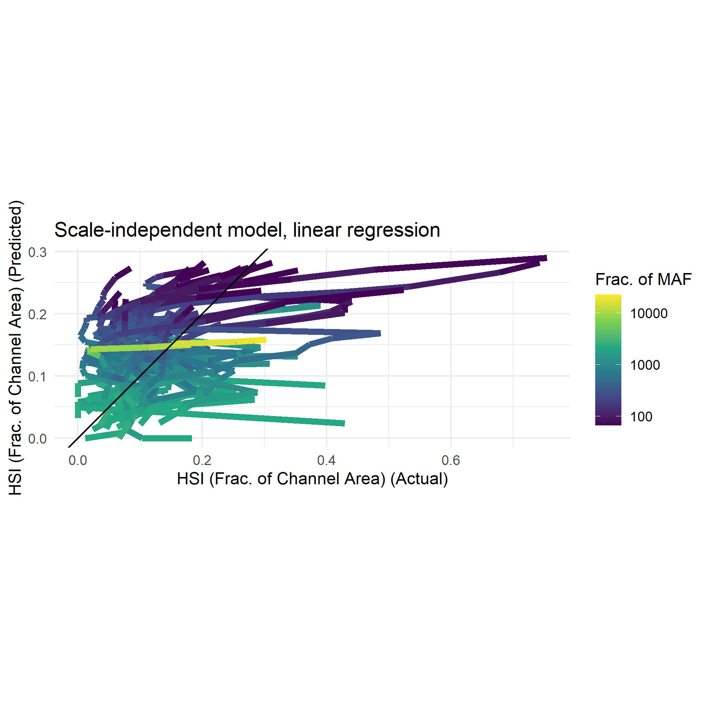<!-- -->

``` r
lm_si_res |> 
  filter(flow_cfs %in% c(300,500,1000,1500,3000,5000,10000,15000)) |>
  ggplot() + geom_point(aes(x=hsi_frac, y=hsi_frac_pred, color=flow_cfs)) + 
  facet_wrap(~flow_cfs, ncol = 4) +
  coord_fixed() + geom_abline() + scale_color_viridis_c(name = "Flow (cfs)") + 
  ggtitle("Scale-independent model, linear regression") +
  xlab("HSI (Frac. of Channel Area) (Actual)") + ylab("HSI (Frac. of Channel Area) (Predicted)")
```

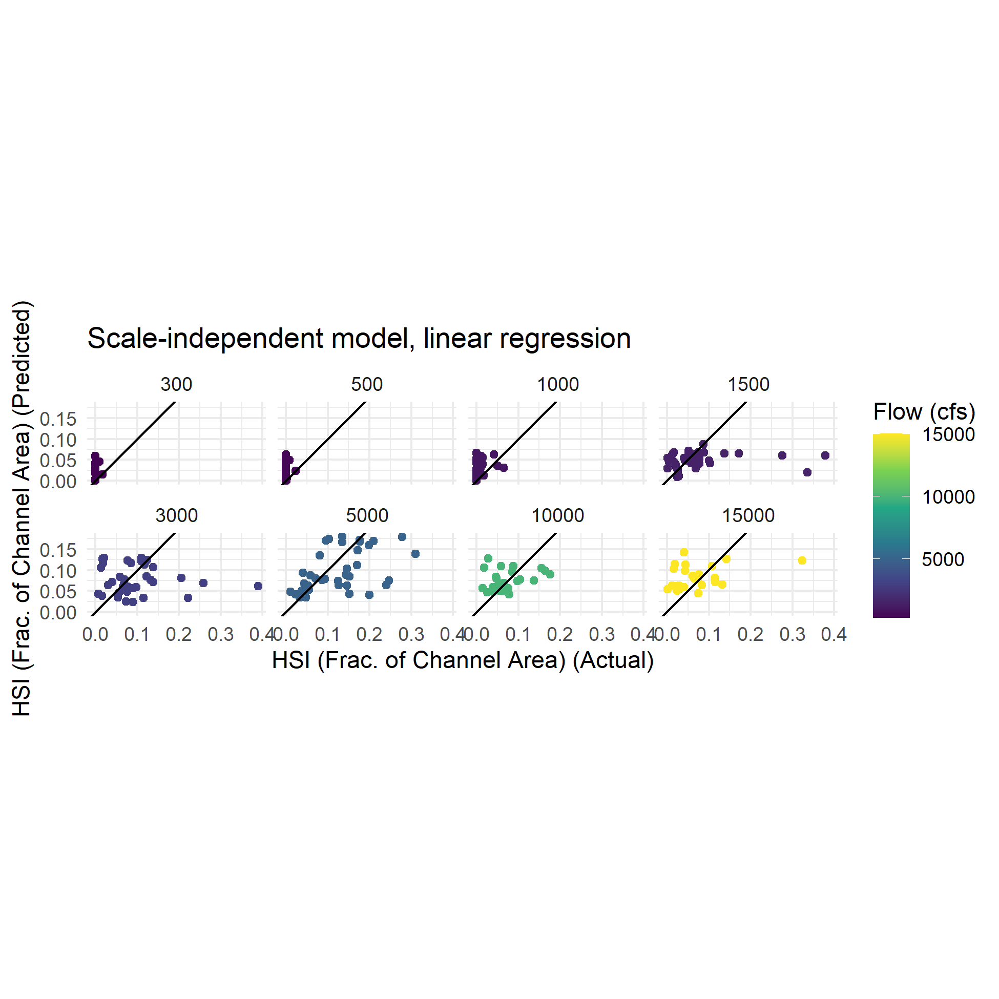<!-- -->

``` r
lm_si_res |> filter(comid %in% test_comids) |>
  ggplot(aes(x=flow_cfs, group=1)) + facet_wrap(~comid) + 
  geom_line(aes(y=hsi_frac_pred*100, color="predicted", group=1)) + geom_line(aes(y=hsi_frac*100, color="actual", group=1)) + 
  xlab("Flow (cfs)") + ylab("Suitable Habitat Area (% of Total Area)") +
  theme(axis.text.x = element_text(angle = 90, vjust = 0.5, hjust=1), panel.grid.minor=element_blank()) +
  scale_x_continuous(labels = scales::label_comma())
```

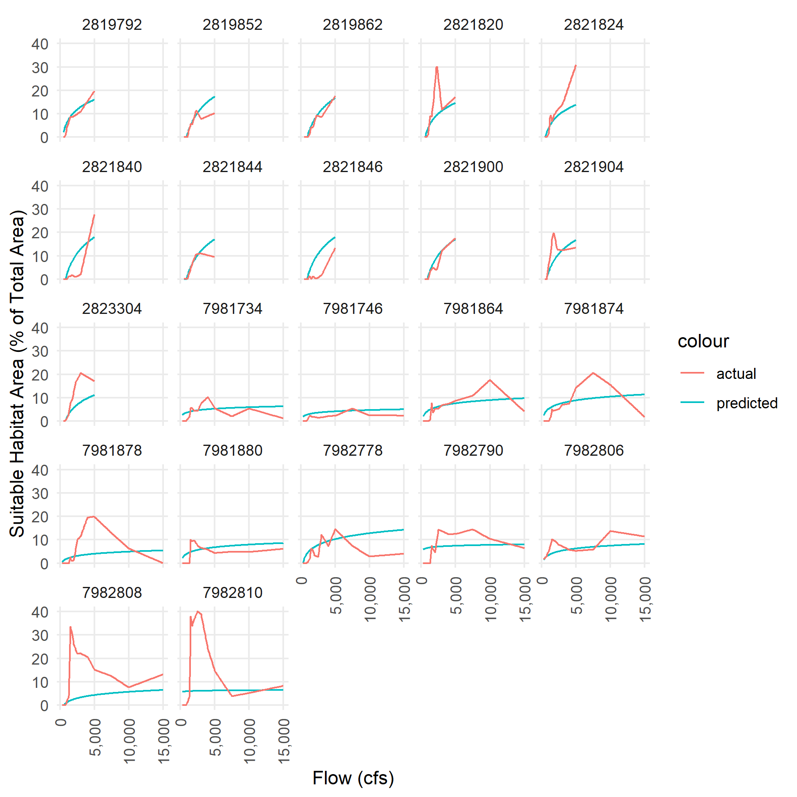<!-- -->

``` r
lm_si |>
  tidy() |>
  mutate(ixn_class = if_else(str_detect(term, "flow_norm_cfs_x_"), "term_flow_norm_cfs_x_", "term") |> 
                     factor(levels = c("term", "term_flow_norm_cfs_x_"), labels = c("Constant Effect", "Interaction with Normalized Flow")),
         term_root = str_replace(term, "flow_norm_cfs_x_", ""),
         coeff_dir = if_else(estimate>0, "Positive", "Negative"),
         ci_lower = estimate - qt(0.975, df = glance(lm_si)$df) * std.error,
         ci_upper = estimate + qt(0.975, df = glance(lm_si)$df) * std.error,
         estimate_abs = abs(estimate),
         ci_lower_abs = ci_lower * if_else(coeff_dir=="Negative",-1,1),
         ci_upper_abs = ci_upper * if_else(coeff_dir=="Negative",-1,1),
         is_significant = sign(ci_lower)==sign(ci_upper)
         ) |>
  filter(term!="flow_norm_cfs" & term!="(Intercept)") |>
  ggplot(aes(y = term_root, color = coeff_dir)) +
  facet_wrap(~ixn_class, ncol = 2, scales = "free_x") + 
  geom_errorbarh(aes(xmin = ci_lower_abs, xmax=ci_upper_abs)) + #pmax(0,ci_lower_abs), xmax = pmax(0,ci_upper_abs))) +
  geom_point(aes(x = estimate_abs, fill = is_significant), shape=21) +
  theme(legend.position="top",
        panel.grid.minor = element_blank(),
        panel.border = element_rect(fill = NA, color = "black"), 
        legend.direction = "vertical") +
  scale_y_discrete(limits=rev) + 
  scale_fill_manual(name = "Significant (95%)", values = c("FALSE" = "white", "TRUE" = "black")) +
  scale_color_manual(name = "Direction of Effect", values = c("Negative" = "goldenrod", "Positive" = "darkcyan")) +
  xlab("Coefficient Magnitude") + ylab("")
```

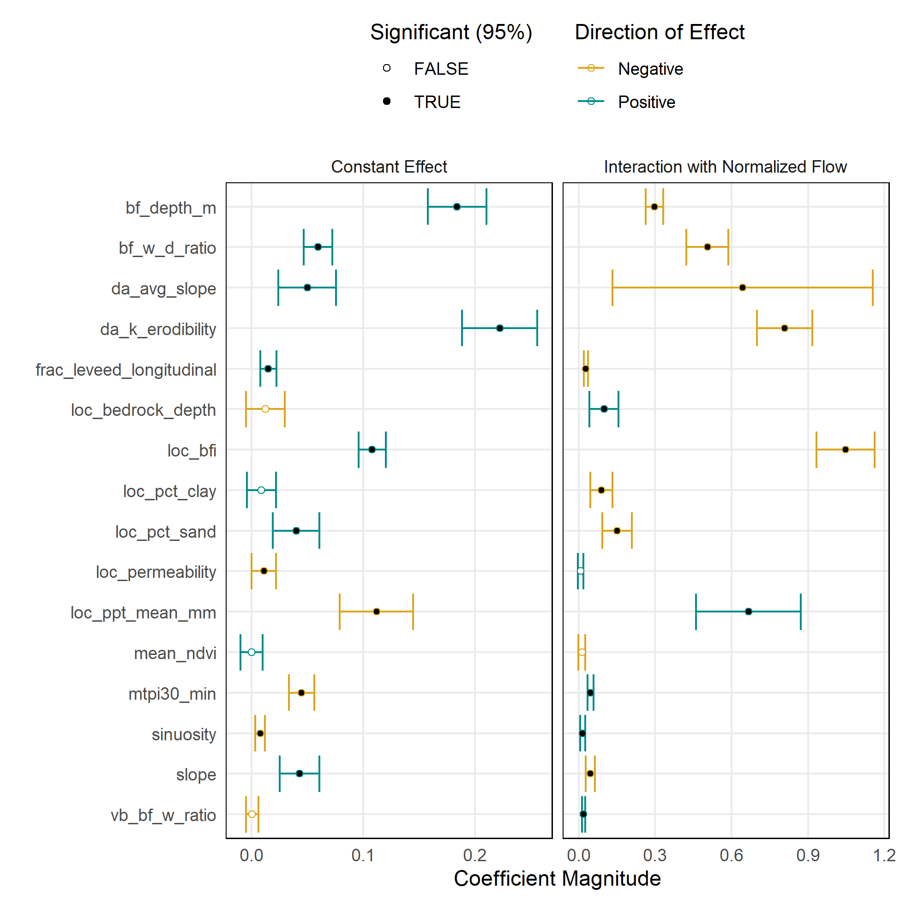<!-- -->

#### Random Forest Regression

``` r
# set up cross validation
folds <- vfold_cv(training(td_split), v = 10, strata = dataset)
val_metrics <- metric_set(rmse, rsq, ccc)

# tuned random forest: how many trees to use?
rfr_spec <- rand_forest(mode = "regression", trees = tune())
rfr_grid <- tibble(trees = 2^seq(0, 12, 1))

rfr_si_tune <- 
  workflow() |>
  add_recipe(si_rec) |>
  add_model(rfr_spec) |>
  tune_grid(resamples = folds,
            grid = rfr_grid,
            metrics = val_metrics)
rfr_si_tune |>
  collect_metrics() |>
  ggplot(aes(x = trees, y = mean, color = .metric)) +
  geom_errorbar(aes(ymin = mean - std_err,
                    ymax = mean + std_err),
                width = 0.05) +
  geom_line() +
  facet_wrap(. ~ .metric, ncol = 1, scales="free") +
  theme(legend.position = "none") + scale_x_log10()
```

``` r
mtry <- floor(length(si_rec$var_info$variable[which(si_rec$var_info$role=="predictor")])/3)
rfr_spec <- rand_forest(mode = "regression", trees = 2^8, mtry = mtry, min_n = 10) |> #, min_n = 10) |>
    set_engine("ranger", num.threads = 4)

rfr_si <- workflow() |>
  add_recipe(si_rec) |>
  add_model(rfr_spec) |>
  add_case_weights(case_wt) |>
  fit(data=training(td_split))

rfr_si$fit$fit |> print()
```

    ## parsnip model object
    ## 
    ## Ranger result
    ## 
    ## Call:
    ##  ranger::ranger(x = maybe_data_frame(x), y = y, mtry = min_cols(~mtry,      x), num.trees = ~2^8, min.node.size = min_rows(~10, x), num.threads = ~4,      verbose = FALSE, seed = sample.int(10^5, 1), case.weights = weights) 
    ## 
    ## Type:                             Regression 
    ## Number of trees:                  256 
    ## Sample size:                      15952 
    ## Number of independent variables:  33 
    ## Mtry:                             5 
    ## Target node size:                 10 
    ## Variable importance mode:         none 
    ## Splitrule:                        variance 
    ## OOB prediction error (MSE):       0.000891972 
    ## R squared (OOB):                  0.8716413

``` r
rfr_si_res <- testing(td_split) |>
  transmute(comid, flow_cfs, flow_norm_cfs, !!norm_var, hsi_frac,
            hsi_frac_pred = predict(rfr_si, testing(td_split))[[".pred"]]) |>
  # crude constraint to between 0 and 1; better to use betareg
  mutate(hsi_frac_pred=pmax(pmin(hsi_frac_pred,1),0))

rfr_si_res |>
  arrange(comid, flow_norm_cfs) |>
  ggplot() + geom_path(aes(x=hsi_frac, y=hsi_frac_pred, color=flow_norm_cfs, group=comid), linewidth=2) + 
  coord_fixed() + geom_abline() + scale_color_viridis_c(trans="log10", name="Frac. of MAF") + 
  ggtitle("Scale-independent model, random forest regression") +
  xlab("HSI (Frac. of Channel Area) (Actual)") + ylab("HSI (Frac. of Channel Area) (Predicted)")
```

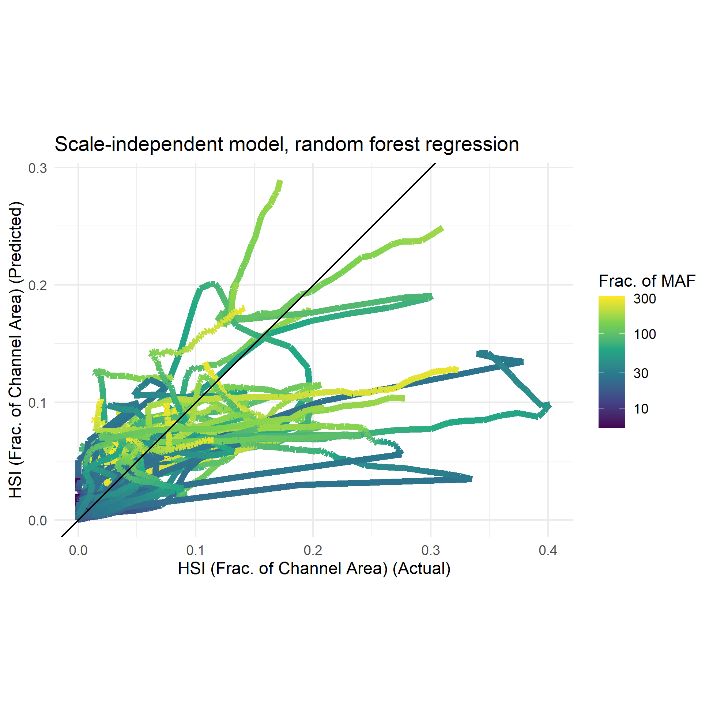<!-- -->

``` r
rfr_si_res |> 
  filter(flow_cfs %in% c(300,500,1000,1500,3000,5000,10000,15000)) |>
  ggplot() + geom_point(aes(x=hsi_frac, y=hsi_frac_pred, color=flow_cfs)) + 
  facet_wrap(~flow_cfs, ncol = 4) +
  coord_fixed() + geom_abline() + scale_color_viridis_c(name = "Flow (cfs)") + 
  ggtitle("Scale-independent model, random forest regression") +
  xlab("HSI (Frac. of Channel Area) (Actual)") + ylab("HSI (Frac. of Channel Area) (Predicted)")
```

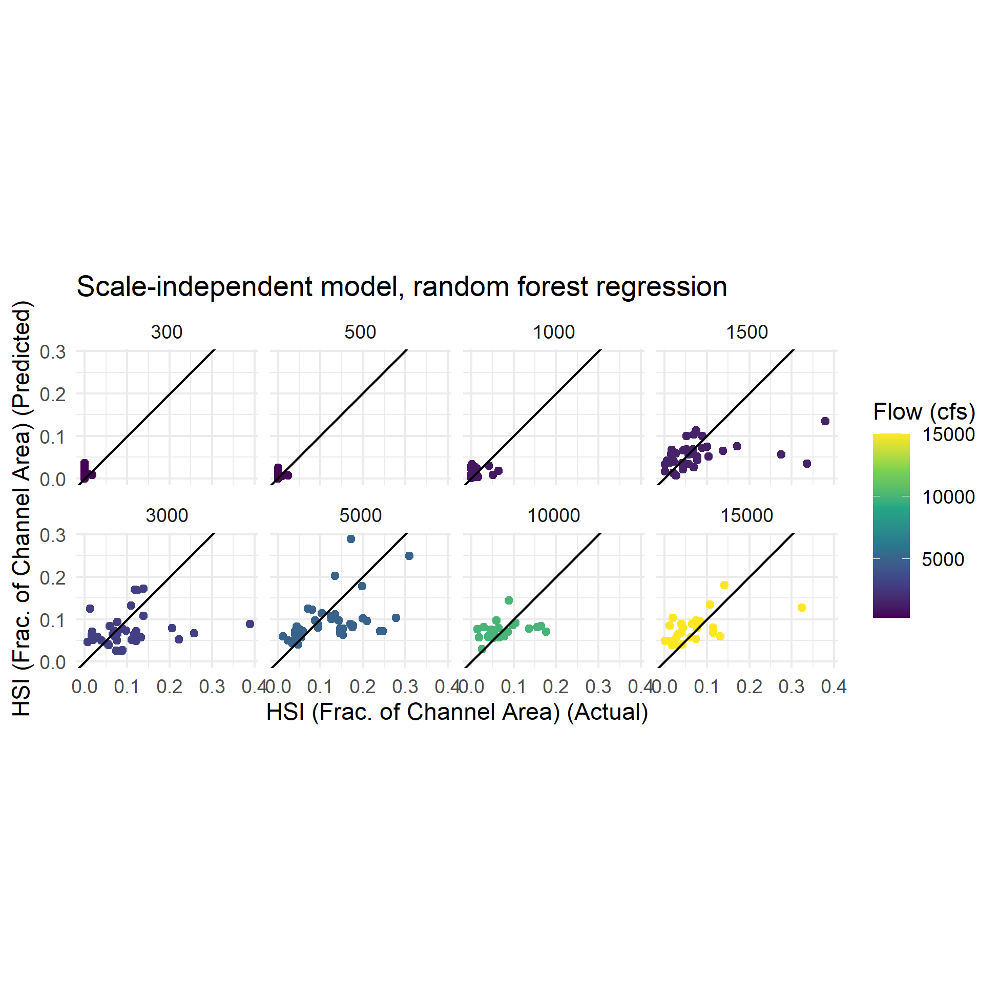<!-- -->

``` r
rfr_si_res |> filter(comid %in% test_comids) |>
  ggplot(aes(x=flow_cfs, group=1)) + facet_wrap(~comid) + 
  geom_line(aes(y=hsi_frac_pred*100, color="predicted", group=1)) + geom_line(aes(y=hsi_frac*100, color="actual", group=1)) + 
  xlab("Flow (cfs)") + ylab("Suitable Habitat Area (% of Total Area)") +
  theme(axis.text.x = element_text(angle = 90, vjust = 0.5, hjust=1), panel.grid.minor=element_blank()) +
  scale_x_continuous(labels = scales::label_comma())
```

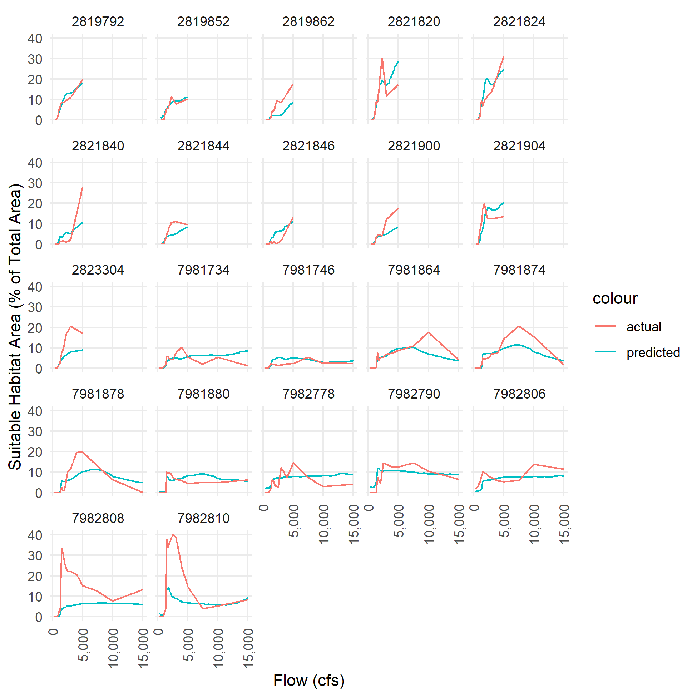<!-- -->

### Scale Independent Model 2: WUA-per-linear-ft (normalized by da_scalar) versus flow (normalized by da_scalar)

A potential compromise between the previous two models that scales the
results by da_scalar, then unscales them after prediction.

``` r
si2_rec <- recipe(data=training(td_split), 
      formula=ihs_wua_per_lf_norm + case_wt ~ 
        # flow as percent of mean annual flow
        flow_norm_cfs + 
        # channel characteristics: gradient and sinuosity
        slope + sinuosity + 
        # flow and channel characteristics, hydrologically predicted
        #erom_v_ma_fps + bf_depth_m + 
        bf_w_d_ratio + 
        # misc characteristics of the catchment
        da_k_erodibility + da_avg_slope + mean_ndvi +
        # misc characteristics of the locality
        loc_bfi + loc_pct_clay + loc_pct_sand + loc_permeability + loc_bedrock_depth + loc_ppt_mean_mm +
        # channel confinement
        mtpi30_min + vb_bf_w_ratio + frac_leveed_longitudinal #+
        # baseflow as percent of mean annual flow
        # nf_bfl_dry_cfs_norm + nf_bfl_wet_cfs_norm #+ 
        # aquatic
        # bio_aq_rank_sw + species + species_fish + 
        # fixed effects
        # hqt_gradient_class + hyd_cls
        ) |>
  #step_log(all_numeric_predictors(), -mtpi30_min, -mean_ndvi, -bio_aq_rank_sw, -vb_bf_w_ratio, -frac_leveed_longitudinal) |>
  step_mutate_at(all_numeric_predictors(), fn = asinh) |>
  # step_dummy(hqt_gradient_class) |>
  # step_dummy(hyd_cls) |>
  step_interact(terms = ~ flow_norm_cfs:all_predictors()) |>
  step_naomit(all_predictors()) |>
  step_zv(all_predictors()) |>
  step_normalize(all_numeric_predictors())
```

#### Linear Regression

``` r
lm_spec <- linear_reg() 

lm_si2 <- workflow() |>
  add_recipe(si2_rec) |>
  add_model(lm_spec) |>
  add_case_weights(case_wt) |>
  fit(data=training(td_split))

lm_si2 |> glance()
```

    ## # A tibble: 1 × 12
    ##   r.squared adj.r.squared sigma statistic p.value    df  logLik    AIC    BIC
    ##       <dbl>         <dbl> <dbl>     <dbl>   <dbl> <dbl>   <dbl>  <dbl>  <dbl>
    ## 1     0.632         0.632  19.1      883.       0    31 -15021. 30109. 30362.
    ## # ℹ 3 more variables: deviance <dbl>, df.residual <int>, nobs <int>

``` r
lm_si2 |> tidy()
```

    ## # A tibble: 32 × 5
    ##    term             estimate std.error statistic  p.value
    ##    <chr>               <dbl>     <dbl>     <dbl>    <dbl>
    ##  1 (Intercept)        0.782    0.00486   161.    0       
    ##  2 flow_norm_cfs     18.2      1.93        9.45  3.99e-21
    ##  3 slope              0.335    0.0917      3.65  2.61e- 4
    ##  4 sinuosity          0.386    0.0203     19.1   3.98e-80
    ##  5 bf_w_d_ratio      -0.0128   0.0390     -0.328 7.43e- 1
    ##  6 da_k_erodibility  -1.39     0.154      -9.00  2.40e-19
    ##  7 da_avg_slope       0.356    0.114       3.11  1.89e- 3
    ##  8 mean_ndvi         -0.0772   0.0414     -1.87  6.22e- 2
    ##  9 loc_bfi           -0.118    0.0454     -2.61  9.13e- 3
    ## 10 loc_pct_clay       0.662    0.0636     10.4   2.74e-25
    ## # ℹ 22 more rows

``` r
lm_si2_res <- testing(td_split) |>
  transmute(comid, flow_norm_cfs, flow_cfs, !!norm_var,
            # actuals
            ihs_wua_per_lf_norm,
            wua_per_lf_norm = sinh(ihs_wua_per_lf_norm), 
            wua_per_lf = wua_per_lf_norm * !!norm_var,
            # predicted
            ihs_wua_per_lf_norm_pred = predict(lm_si2, testing(td_split))[[".pred"]],
            wua_per_lf_norm_pred = sinh(ihs_wua_per_lf_norm_pred),
            wua_per_lf_pred = wua_per_lf_norm_pred * !!norm_var)

lm_si2_res |>
  arrange(comid, flow_norm_cfs) |>
  ggplot() + geom_path(aes(x=wua_per_lf, y=wua_per_lf_pred, color=flow_cfs, group=comid), linewidth=2) + 
  coord_fixed() + geom_abline() + scale_color_viridis_c(trans="log10", name="Frac. of MAF") + 
  ggtitle("Scale-independent model, linear regression") +
  xlab("Suitable Habitat Area (ft2) per LF (Actual)") + ylab("Suitable Habitat Area (ft2) per LF (Predicted)")
```

<!-- -->

``` r
lm_si2_res |> 
  filter(flow_cfs %in% c(300,500,1000,1500,3000,5000,10000,15000)) |>
  ggplot() + geom_point(aes(x=wua_per_lf, y=wua_per_lf_pred, color=flow_cfs)) + 
  facet_wrap(~flow_cfs, ncol = 4) +
  coord_fixed() + geom_abline() + scale_color_viridis_c(name = "Flow (cfs)") + 
  ggtitle("Scale-independent model, linear regression") +
  xlab("Suitable Habitat Area (ft2) per LF (Actual)") + ylab("Suitable Habitat Area (ft2) per LF (Predicted)")
```

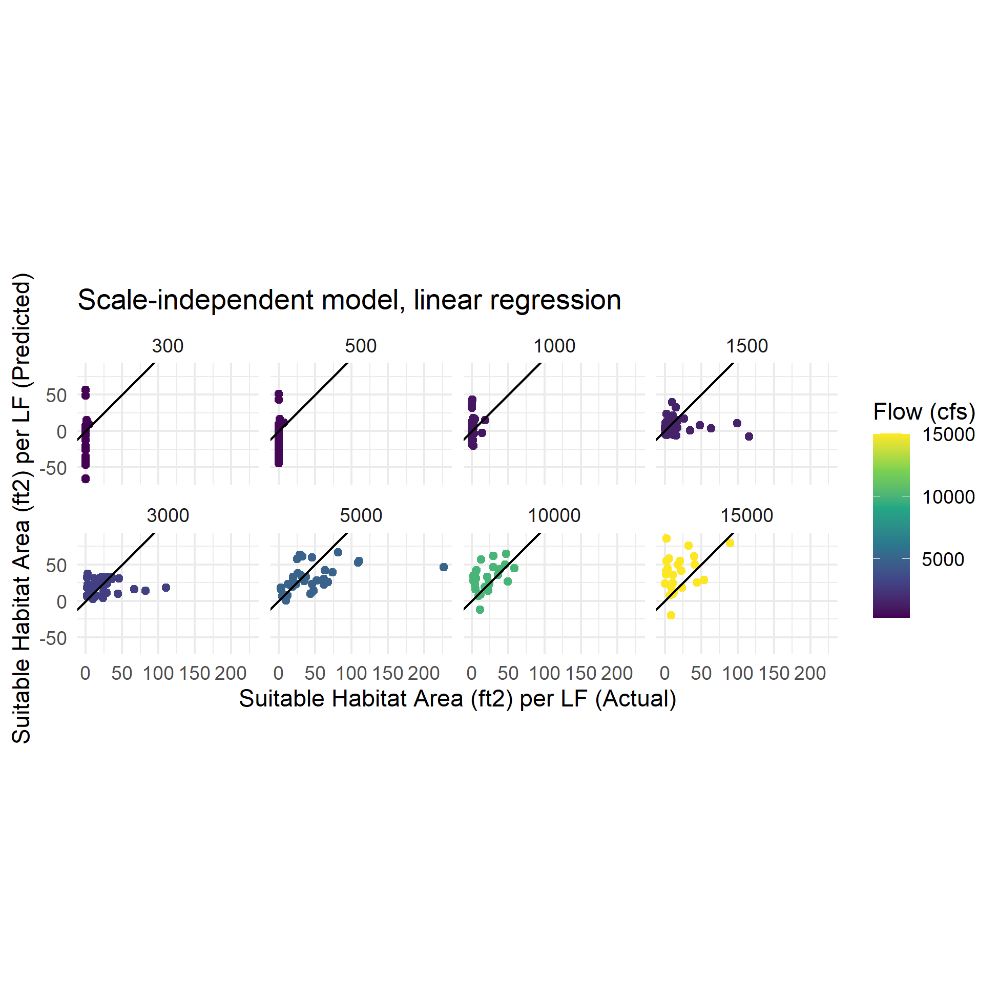<!-- -->

``` r
lm_si2_res |> filter(comid %in% test_comids) |>
  ggplot(aes(x=flow_cfs, group=1)) + facet_wrap(~comid) + 
  geom_line(aes(y=wua_per_lf_pred, color="predicted", group=1)) + 
  geom_line(aes(y=wua_per_lf, color="actual", group=1)) + 
  scale_y_continuous(trans = ihs, limits = c(0, NA)) + 
  xlab("Flow (cfs)") + ylab("Suitable Habitat Area (ft2) per LF") +
  theme(axis.text.x = element_text(angle = 90, vjust = 0.5, hjust=1), panel.grid.minor=element_blank()) +
  scale_x_continuous(labels = scales::label_comma())
```

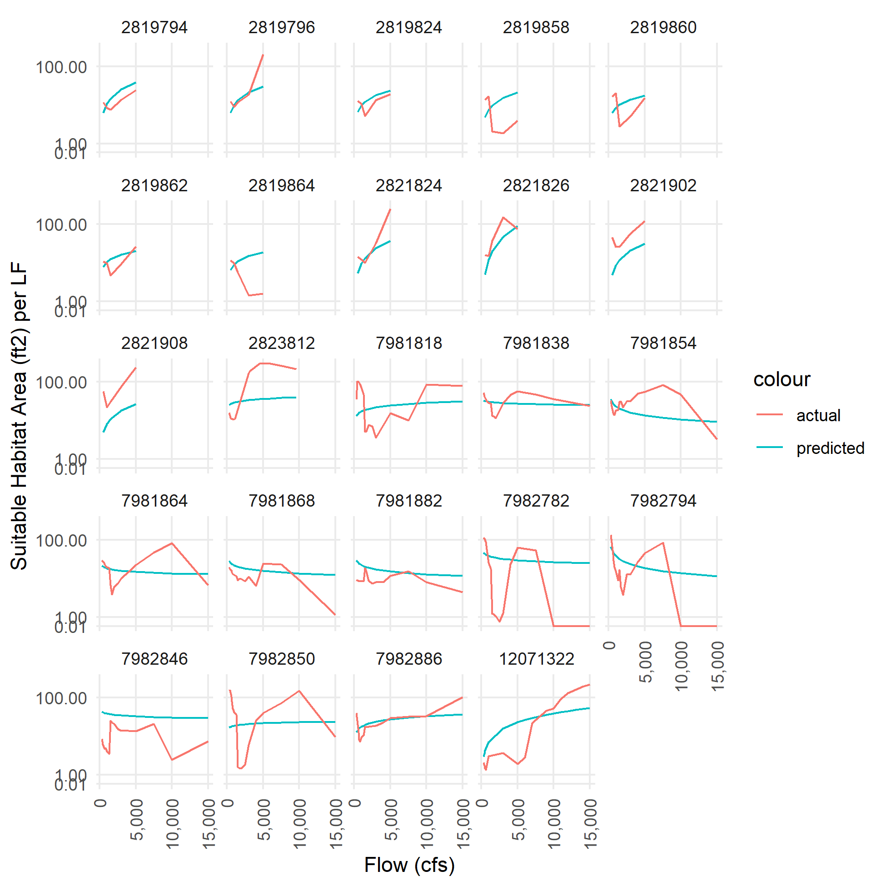<!-- -->

``` r
lm_si2 |>
  tidy() |>
  mutate(ixn_class = if_else(str_detect(term, "flow_norm_cfs_x_"), "term_flow_norm_cfs_x_", "term") |> 
                     factor(levels = c("term", "term_flow_norm_cfs_x_"), labels = c("Constant Effect", "Interaction with Normalized Flow")),
         term_root = str_replace(term, "flow_norm_cfs_x_", ""),
         coeff_dir = if_else(estimate>0, "Positive", "Negative"),
         ci_lower = estimate - qt(0.975, df = glance(lm_si)$df) * std.error,
         ci_upper = estimate + qt(0.975, df = glance(lm_si)$df) * std.error,
         estimate_abs = abs(estimate),
         ci_lower_abs = ci_lower * if_else(coeff_dir=="Negative",-1,1),
         ci_upper_abs = ci_upper * if_else(coeff_dir=="Negative",-1,1),
         is_significant = sign(ci_lower)==sign(ci_upper)
         ) |>
  filter(term!="flow_norm_cfs" & term!="(Intercept)") |>
  ggplot(aes(y = term_root, color = coeff_dir)) +
  facet_wrap(~ixn_class, ncol = 2, scales = "free_x") + 
  geom_errorbarh(aes(xmin = ci_lower_abs, xmax=ci_upper_abs)) + #pmax(0,ci_lower_abs), xmax = pmax(0,ci_upper_abs))) +
  geom_point(aes(x = estimate_abs, fill = is_significant), shape=21) +
  theme(legend.position="top",
        panel.grid.minor = element_blank(),
        panel.border = element_rect(fill = NA, color = "black"), 
        legend.direction = "vertical") +
  scale_y_discrete(limits=rev) + 
  scale_fill_manual(name = "Significant (95%)", values = c("FALSE" = "white", "TRUE" = "black")) +
  scale_color_manual(name = "Direction of Effect", values = c("Negative" = "goldenrod", "Positive" = "darkcyan")) +
  xlab("Coefficient Magnitude") + ylab("")
```

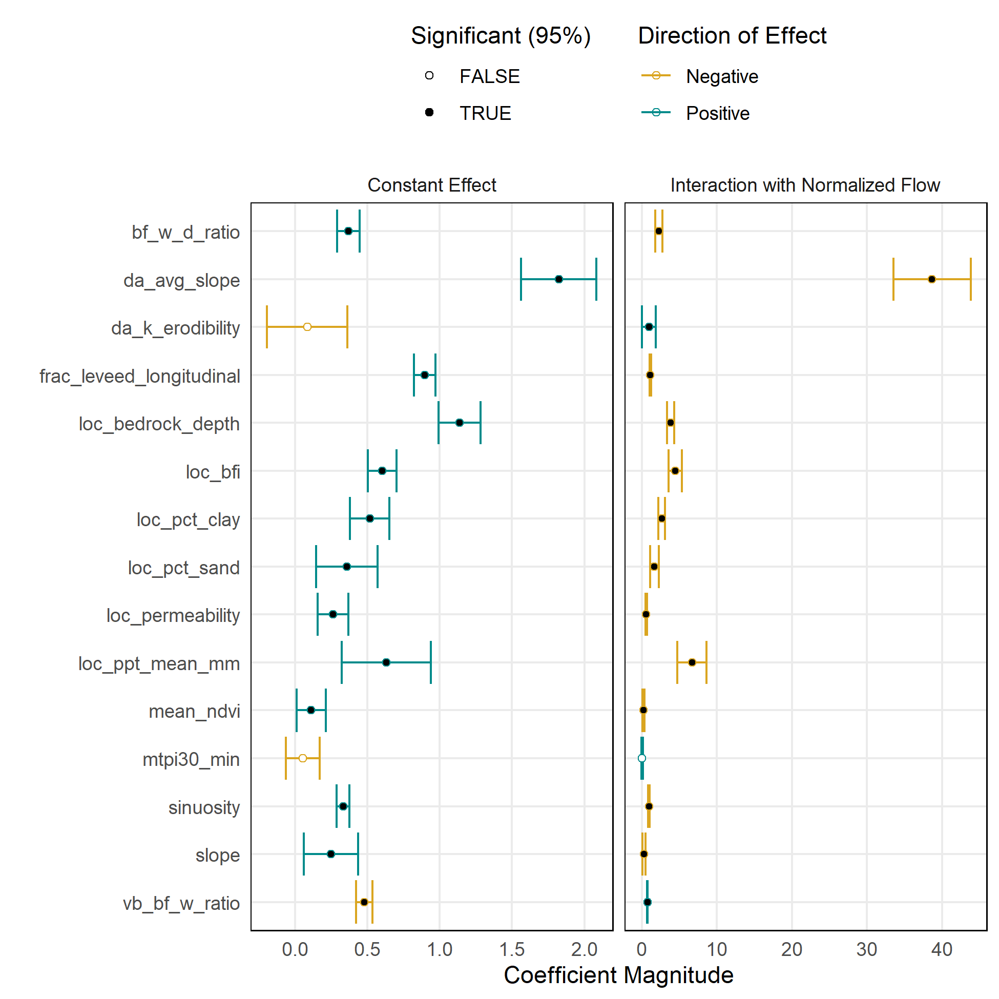<!-- -->

#### Random Forest Regression

``` r
mtry <- floor(length(si2_rec$var_info$variable[which(si2_rec$var_info$role=="predictor")])/3)
rfr_spec <- rand_forest(mode = "regression", trees = 2^8, mtry = mtry, min_n = 10) |> #, min_n = 10) |>
    set_engine("ranger", num.threads = 4)

rfr_si2 <- workflow() |>
  add_recipe(si2_rec) |>
  add_model(rfr_spec) |>
  add_case_weights(case_wt) |>
  fit(data=training(td_split))

rfr_si2$fit$fit |> print()
```

    ## parsnip model object
    ## 
    ## Ranger result
    ## 
    ## Call:
    ##  ranger::ranger(x = maybe_data_frame(x), y = y, mtry = min_cols(~mtry,      x), num.trees = ~2^8, min.node.size = min_rows(~10, x), num.threads = ~4,      verbose = FALSE, seed = sample.int(10^5, 1), case.weights = weights) 
    ## 
    ## Type:                             Regression 
    ## Number of trees:                  256 
    ## Sample size:                      15952 
    ## Number of independent variables:  31 
    ## Mtry:                             5 
    ## Target node size:                 10 
    ## Variable importance mode:         none 
    ## Splitrule:                        variance 
    ## OOB prediction error (MSE):       0.01068109 
    ## R squared (OOB):                  0.9831827

``` r
rfr_si2_res <- testing(td_split) |>
  transmute(comid, flow_norm_cfs, flow_cfs, !!norm_var,
            # actuals
            ihs_wua_per_lf_norm,
            wua_per_lf_norm = sinh(ihs_wua_per_lf_norm), 
            wua_per_lf = wua_per_lf_norm * !!norm_var,
            # predicted
            ihs_wua_per_lf_norm_pred = predict(rfr_si2, testing(td_split))[[".pred"]],
            wua_per_lf_norm_pred = sinh(ihs_wua_per_lf_norm_pred),
            wua_per_lf_pred = wua_per_lf_norm_pred * !!norm_var)

rfr_si2_res |>
  arrange(comid, flow_norm_cfs) |>
  ggplot() + geom_path(aes(x=wua_per_lf, y=wua_per_lf_pred, color=flow_cfs, group=comid), linewidth=2) + 
  coord_fixed() + geom_abline() + scale_color_viridis_c(trans="log10", name="Frac. of MAF") + 
  ggtitle("Scale-independent model 2, random forest regression") +
  xlab("Suitable Habitat Area (ft2) per LF (Actual)") + ylab("Suitable Habitat Area (ft2) per LF (Predicted)")
```

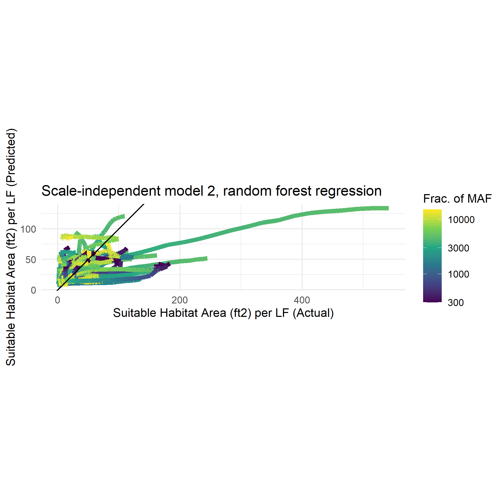<!-- -->

``` r
rfr_si2_res |> 
  filter(flow_cfs %in% c(300,500,1000,1500,3000,5000,10000,15000)) |>
  ggplot() + geom_point(aes(x=wua_per_lf, y=wua_per_lf_pred, color=flow_cfs)) + 
  facet_wrap(~flow_cfs, ncol = 4) +
  coord_fixed() + geom_abline() + scale_color_viridis_c(name = "Flow (cfs)") + 
  ggtitle("Scale-independent model 2, random forest regression") +
  xlab("Suitable Habitat Area ft2) per LF (Actual)") + ylab("Suitable Habitat Area ft2) per LF (Predicted)")
```

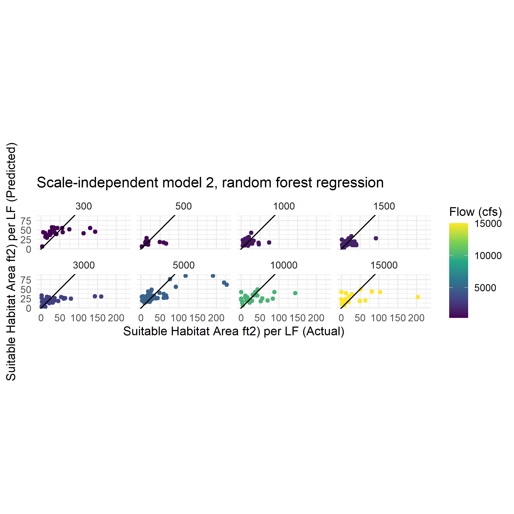<!-- -->

``` r
rfr_si2_res |> filter(comid %in% test_comids) |>
  ggplot(aes(x=flow_cfs, group=1)) + facet_wrap(~comid) + 
  geom_line(aes(y=wua_per_lf_pred, color="predicted", group=1)) + 
  geom_line(aes(y=wua_per_lf, color="actual", group=1)) + 
  scale_y_continuous(trans = ihs, limits = c(0, NA)) + 
  xlab("Flow (cfs)") + ylab("Suitable Habitat Area (ft2) per LF")  +
  theme(axis.text.x = element_text(angle = 90, vjust = 0.5, hjust=1), panel.grid.minor=element_blank()) +
  scale_x_continuous(labels = scales::label_comma())
```

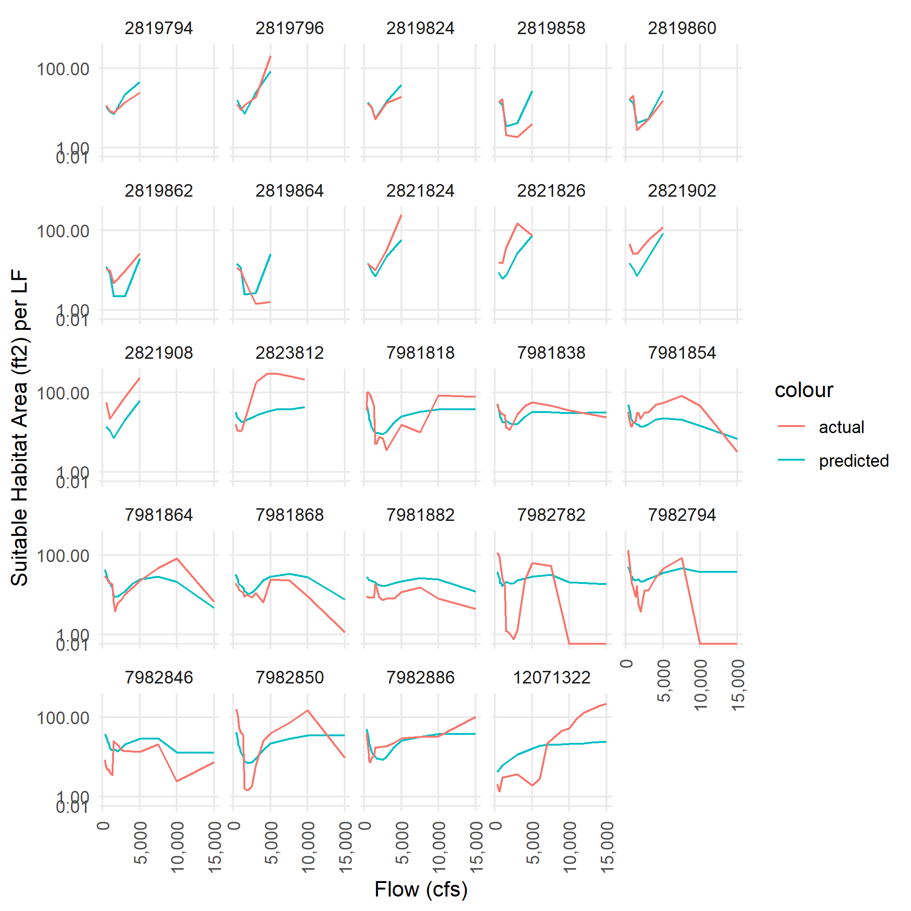<!-- -->

## Prediction and Validation

``` r
# assemble prediction dataset
pd_attr <- flowline_attributes |> 
  # select just major streams
  filter_variable_ranges() |> #stream_level<=4 & !is.na(gnis_name) 
      filter(substr(reachcode,1, 4) %in% c("1802", "1803", "1804")) |> # Central Valley basin only
  # # filter out Valley Lowland areas
  # filter(hqt_gradient_class != "Valley Lowland") |>
  # # filter for just the areas that are hydrologically similar to the training data
  # filter(hyd_cls %in% c("High-volume snowmelt and rain",
  #                       "Low-volume snowmelt and rain")) |>
  # select the variables that are used in the model and drop NAs
  mutate(nf_bfl_dry_cfs_norm = coalesce(nf_bfl_dry_cfs / !!norm_var, 0), # normalized baseflow values
         nf_bfl_wet_cfs_norm = coalesce(nf_bfl_wet_cfs / !!norm_var, 0)) |>
  select(comid, any_of(c(sd_rec$var_info$variable, si_rec$var_info$variable)), !!norm_var, hyd_cls, hqt_gradient_class) |> 
  drop_na() 
  
pd <- pd_attr |>
  # create series of flow prediction points
  #expand_grid(flow_cfs = interp_flows) |>
  expand_grid(flow_cfs = c(oom_range(100, 10000), 15000)) |>
  # expand_grid(flow_cfs = c(0,signif(100*2^seq(-2,7,0.5),2))) |>
  #expand_grid(flow_cfs = c(0,100,250,500,1000,2500,5000,10000)) |>
  #mutate(flow_cfs = if_else(flow_cfs>0, flow_cfs, erom_q_ma_cfs)) |> # also evaluate at mean annual flow
  mutate(flow_norm_cfs = coalesce(flow_cfs / !!norm_var, 0)) |> # flow as a percent of mean annual flow
  arrange(comid, flow_cfs) |>
  glimpse()
```

    ## Rows: 186,300
    ## Columns: 26
    ## $ comid                    <dbl> 342517, 342517, 342517, 342517, 342517, 34251…
    ## $ slope                    <dbl> 0.05283632, 0.05283632, 0.05283632, 0.0528363…
    ## $ da_area_sq_km            <dbl> 113.4549, 113.4549, 113.4549, 113.4549, 113.4…
    ## $ da_elev_mean             <dbl> 2259.68, 2259.68, 2259.68, 2259.68, 2259.68, …
    ## $ da_ppt_mean_mm           <dbl> 1236.076, 1236.076, 1236.076, 1236.076, 1236.…
    ## $ bf_depth_m               <dbl> 1.55, 1.55, 1.55, 1.55, 1.55, 1.55, 1.55, 1.5…
    ## $ bf_w_d_ratio             <dbl> 11.17419, 11.17419, 11.17419, 11.17419, 11.17…
    ## $ da_k_erodibility         <dbl> 0.1079, 0.1079, 0.1079, 0.1079, 0.1079, 0.107…
    ## $ da_avg_slope             <dbl> 19.27, 19.27, 19.27, 19.27, 19.27, 19.27, 19.…
    ## $ mean_ndvi                <dbl> 0.4093465, 0.4093465, 0.4093465, 0.4093465, 0…
    ## $ loc_bfi                  <dbl> 60.692, 60.692, 60.692, 60.692, 60.692, 60.69…
    ## $ loc_pct_clay             <dbl> 4.3704, 4.3704, 4.3704, 4.3704, 4.3704, 4.370…
    ## $ loc_pct_sand             <dbl> 75.2812, 75.2812, 75.2812, 75.2812, 75.2812, …
    ## $ loc_permeability         <dbl> 30.4353, 30.4353, 30.4353, 30.4353, 30.4353, …
    ## $ loc_bedrock_depth        <dbl> 56.5676, 56.5676, 56.5676, 56.5676, 56.5676, …
    ## $ loc_ppt_mean_mm          <dbl> 1177.02, 1177.02, 1177.02, 1177.02, 1177.02, …
    ## $ mtpi30_min               <dbl> -48, -48, -48, -48, -48, -48, -48, -48, -48, …
    ## $ vb_bf_w_ratio            <dbl> 1, 1, 1, 1, 1, 1, 1, 1, 1, 1, 1, 1, 1, 1, 1, …
    ## $ frac_leveed_longitudinal <dbl> 0, 0, 0, 0, 0, 0, 0, 0, 0, 0, 0, 0, 0, 0, 0, …
    ## $ vb_width_transect        <dbl> 17.32, 17.32, 17.32, 17.32, 17.32, 17.32, 17.…
    ## $ sinuosity                <dbl> 1.31, 1.31, 1.31, 1.31, 1.31, 1.31, 1.31, 1.3…
    ## $ da_scalar                <dbl> 1.364322, 1.364322, 1.364322, 1.364322, 1.364…
    ## $ hyd_cls                  <fct> "Low-volume snowmelt and rain", "Low-volume s…
    ## $ hqt_gradient_class       <fct> Bedrock, Bedrock, Bedrock, Bedrock, Bedrock, …
    ## $ flow_cfs                 <dbl> 100, 200, 300, 400, 500, 600, 700, 800, 900, …
    ## $ flow_norm_cfs            <dbl> 73.29645, 146.59291, 219.88936, 293.18582, 36…

``` r
flowlines_gcs |>
  inner_join(pd_attr, by=join_by(comid)) |>
  ggplot() + geom_sf(aes(color = da_area_sq_km)) + 
  scale_color_viridis_c(name = "Drainage area (km2)", trans="sqrt", breaks = scales::breaks_log(6), direction = -1)
```

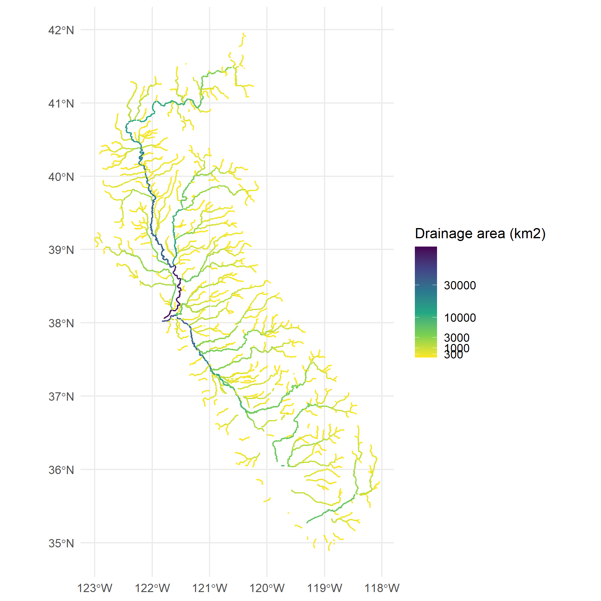<!-- -->

``` r
flowlines_gcs |>
  inner_join(pd_attr, by=join_by(comid)) |>
  ggplot() + geom_sf(aes(color = hyd_cls)) +
  scale_color_manual(name = "eFlows hydrologic class",
                     values = c(
                       "Snowmelt" = "#F9F863",
                       "High-volume snowmelt and rain" = "#55BA36",
                       "Low-volume snowmelt and rain" = "#B4E749",
                       "Winter storms" = "#0011A6",
                       "Groundwater" = "#183F11",
                       "Perennial groundwater and rain" = "#2C6CD9",
                       "Flashy, ephemeral rain" = "#A2ACF9",
                       "Rain and seasonal groundwater" = "#89E0F8",
                       "High elevation, low precipitation" = "#D9D245"))
```

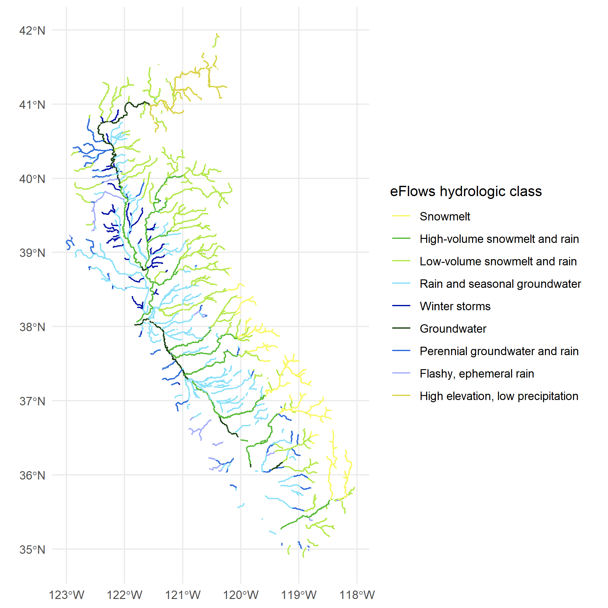<!-- -->

### One-step model, scale-dependent: WUA/LF vs flow

``` r
sd_pred <- 
  sd_rec |> 
  prep(training(td_split)) |> 
  bake(pd) |># |> filter_within_domain(flow_cfs)) |> 
  bind_cols(pd |> #filter_within_domain(flow_cfs) |>
              transmute(comid, flow_cfs_orig = flow_cfs)) |>
  drop_na() %>% # need to use magrittr pipe for this purpose
  mutate(ihs_wua_per_lf_pred = predict(rfr_sd$fit$fit, new_data=.)[[".pred"]]) |>
  transmute(comid, 
            flow_cfs = flow_cfs_orig, 
            ihs_wua_per_lf_pred,
            wua_per_lf_pred = sinh(ihs_wua_per_lf_pred)) |>
  glimpse()
```

    ## Rows: 186,300
    ## Columns: 4
    ## $ comid               <dbl> 342517, 342517, 342517, 342517, 342517, 342517, 34…
    ## $ flow_cfs            <dbl> 100, 200, 300, 400, 500, 600, 700, 800, 900, 1000,…
    ## $ ihs_wua_per_lf_pred <dbl> 3.696754, 3.710941, 3.679540, 3.655673, 3.648186, …
    ## $ wua_per_lf_pred     <dbl> 20.14572, 20.43391, 19.80146, 19.33385, 19.18945, …

``` r
flowlines_gcs |>
  inner_join(sd_pred |> filter(round(flow_cfs)==800), by=join_by(comid)) |>
  mutate(wua_per_lf_pred = if_else(wua_per_lf_pred <1, 1, wua_per_lf_pred)) |> # for visualization only
  ggplot() + geom_sf(aes(color = wua_per_lf_pred)) + 
  scale_color_viridis_c(trans="log", breaks = scales::breaks_log(6), direction=-1)
```

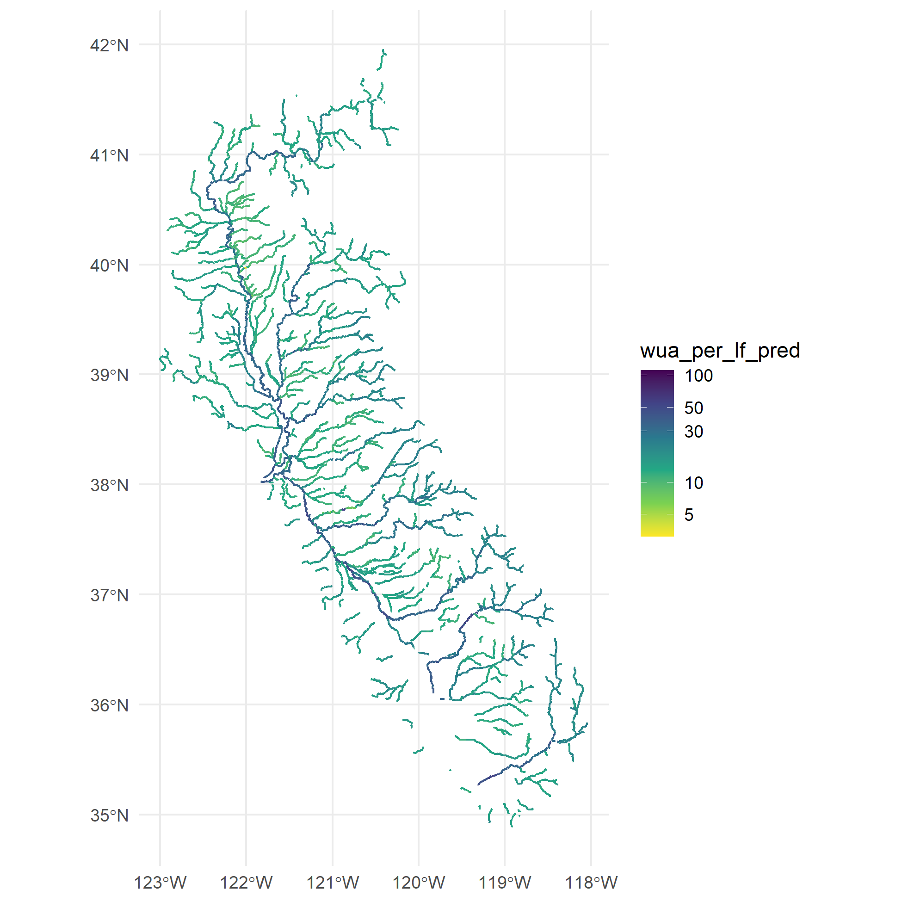<!-- -->

``` r
n_breaks <- 10
sd_pred |>
  inner_join(flowline_attributes, by=join_by(comid), relationship="many-to-one") |>
  select(comid, wua_per_lf_pred, any_of(sd_rec$var_info$variable[which(sd_rec$var_info$role=="predictor")])) |>
  mutate(across(-(1:3), function(x) cut(x, breaks=n_breaks, labels=seq(1,n_breaks)/n_breaks))) |>
  pivot_longer(cols = -(1:3)) |>
  ggplot(aes(x = flow_cfs, y = wua_per_lf_pred)) +
  facet_wrap(~name) + geom_smooth(aes(color = value), se=F) +
  scale_color_viridis_d(name = "Percentile of predictor variable", option = "cividis", direction=-1) +
  theme(legend.position = "top") + guides(color=guide_legend(nrow=2, byrow=TRUE)) +
  scale_x_log10() + scale_y_log10() + theme(panel.grid.minor = element_blank())
```

    ## `geom_smooth()` using method = 'gam' and formula = 'y ~ s(x, bs = "cs")'

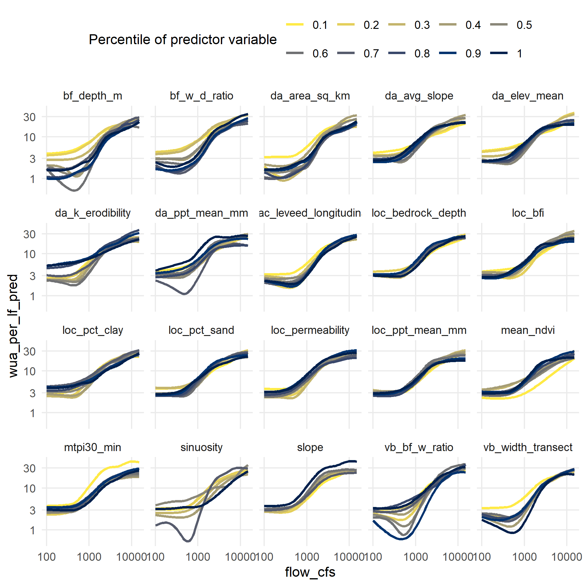<!-- -->

### One-step model, scale-independent: normalized WUA/LF vs normalized flow

``` r
si2_pred <- 
  si2_rec |> 
  prep(training(td_split)) |> 
  bake(pd) |> 
  # bring in unbaked variables
  bind_cols(pd |> transmute(comid, 
                            flow_cfs_orig = flow_cfs,
                            flow_norm_cfs_orig = flow_norm_cfs, 
                            "{norm_var}_orig" := !!norm_var)) |>
  drop_na() %>% # need to use magrittr pipe for this purpose
  mutate(ihs_wua_per_lf_norm_pred = predict(rfr_si2$fit$fit, new_data=.)[[".pred"]]) |>
  transmute(comid, 
            flow_cfs = flow_cfs_orig, 
            flow_norm_cfs = flow_norm_cfs_orig, 
            "{norm_var}" := !!sym(glue::glue("{norm_var}_orig")),
            ihs_wua_per_lf_norm_pred) |>
  mutate(wua_per_lf_norm_pred = sinh(ihs_wua_per_lf_norm_pred),
         wua_per_lf_pred = wua_per_lf_norm_pred * !!norm_var) |>
  glimpse()
```

    ## Rows: 186,300
    ## Columns: 7
    ## $ comid                    <dbl> 342517, 342517, 342517, 342517, 342517, 34251…
    ## $ flow_cfs                 <dbl> 100, 200, 300, 400, 500, 600, 700, 800, 900, …
    ## $ flow_norm_cfs            <dbl> 73.29645, 146.59291, 219.88936, 293.18582, 36…
    ## $ da_scalar                <dbl> 1.364322, 1.364322, 1.364322, 1.364322, 1.364…
    ## $ ihs_wua_per_lf_norm_pred <dbl> 0.9958327, 1.1162876, 1.1669153, 1.2029954, 1…
    ## $ wua_per_lf_norm_pred     <dbl> 1.168781, 1.363002, 1.450372, 1.514892, 1.534…
    ## $ wua_per_lf_pred          <dbl> 1.594594, 1.859574, 1.978775, 2.066801, 2.093…

``` r
flowlines_gcs |>
  inner_join(si2_pred |> filter(round(flow_cfs)==800), by=join_by(comid)) |>
  mutate(wua_per_lf_pred = if_else(wua_per_lf_pred <1, 1, wua_per_lf_pred)) |> # for visualization only
  ggplot() + geom_sf(aes(color = wua_per_lf_pred)) + 
  scale_color_viridis_c(trans="log", breaks = scales::breaks_log(6), direction=-1)
```

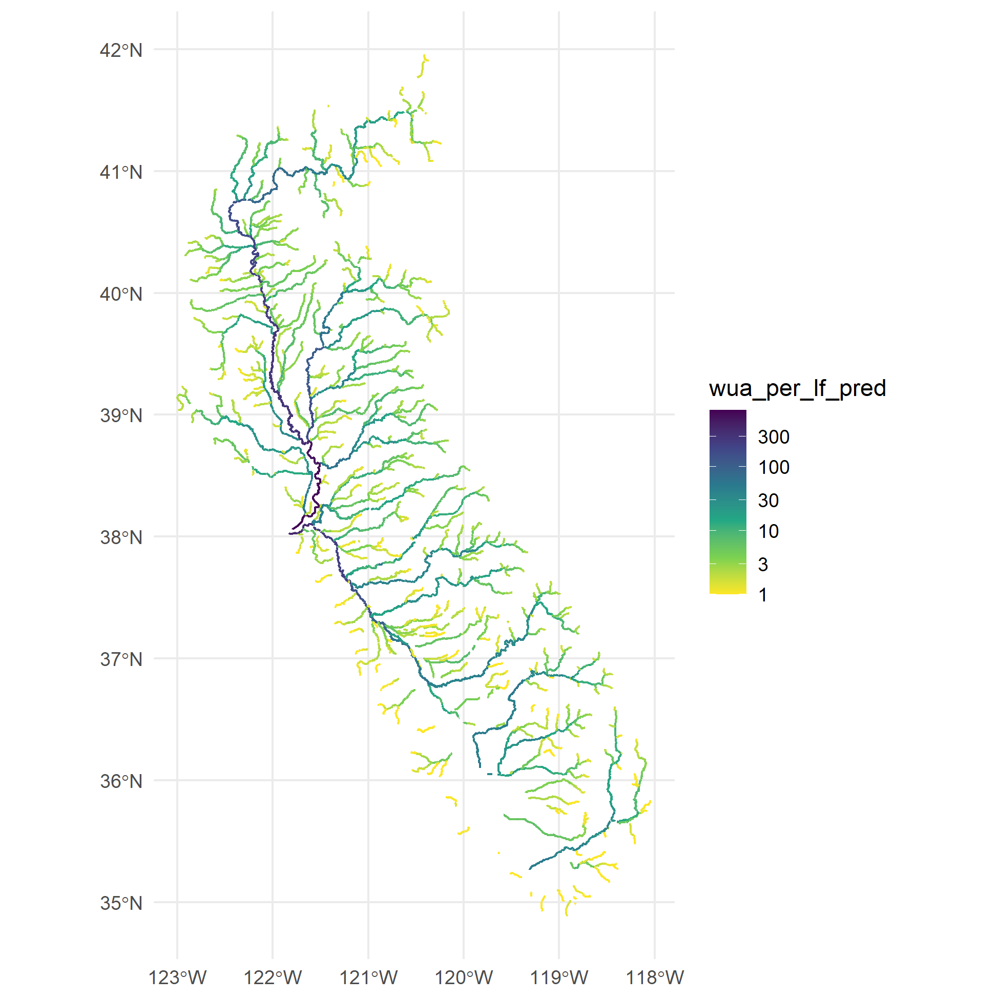<!-- -->

``` r
n_breaks <- 10
si2_pred |>
  inner_join(flowline_attributes, by=join_by(comid), relationship="many-to-one") |>
  select(comid, wua_per_lf_pred, flow_cfs, any_of(si2_rec$var_info$variable[which(si2_rec$var_info$role=="predictor")]), -flow_norm_cfs) |>
  mutate(across(-(1:3), function(x) cut(x, breaks=n_breaks, labels=seq(1,n_breaks)/n_breaks))) |>
  pivot_longer(cols = -(1:3)) |>
  ggplot(aes(x = flow_cfs, y = wua_per_lf_pred)) +
  facet_wrap(~name) + geom_smooth(aes(color = value), se=F) +
  scale_color_viridis_d(name = "Percentile of predictor variable", option = "cividis", direction=-1) +
  theme(legend.position = "top") + guides(color=guide_legend(nrow=2, byrow=TRUE)) +
  scale_x_log10() + scale_y_log10() + theme(panel.grid.minor = element_blank())
```

    ## `geom_smooth()` using method = 'gam' and formula = 'y ~ s(x, bs = "cs")'

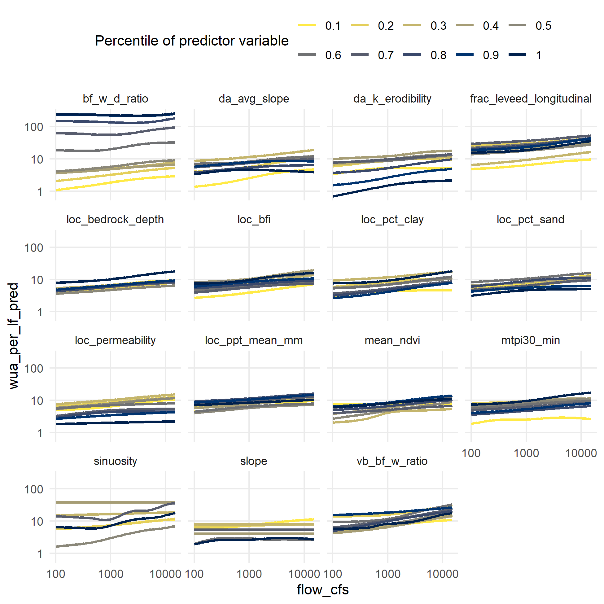<!-- -->

### Two-step model: (%HSI vs normalized flow) \* (Total Area/LF vs flow)

``` r
sd2_pred <- 
  sd2_rec |> 
  prep(training(td_split)) |> 
  bake(pd) |> 
  bind_cols(pd |> transmute(comid, 
                            flow_cfs_orig = flow_cfs)) |>
  drop_na() %>% # need to use magrittr pipe for this purpose
  mutate(ihs_tot_area_per_lf_pred = predict(rfr_sd2$fit$fit, new_data=.)[[".pred"]]) |>
  transmute(comid, 
            flow_cfs = flow_cfs_orig, 
            ihs_tot_area_per_lf_pred,
            tot_area_per_lf_pred = sinh(ihs_tot_area_per_lf_pred)) |>
  glimpse()
```

    ## Rows: 186,300
    ## Columns: 4
    ## $ comid                    <dbl> 342517, 342517, 342517, 342517, 342517, 34251…
    ## $ flow_cfs                 <dbl> 100, 200, 300, 400, 500, 600, 700, 800, 900, …
    ## $ ihs_tot_area_per_lf_pred <dbl> 5.390080, 5.400989, 5.416252, 5.440766, 5.471…
    ## $ tot_area_per_lf_pred     <dbl> 109.6082, 110.8105, 112.5148, 115.3073, 118.9…

``` r
sd2si_pred <- 
  si_rec |> 
  prep(training(td_split)) |> 
  bake(pd) |> 
  bind_cols(pd |> transmute(comid, 
                            flow_cfs_orig = flow_cfs,
                            flow_norm_cfs_orig = flow_norm_cfs,
                            "{norm_var}_orig" := !!norm_var)) |>
  drop_na() %>% # need to use magrittr pipe for this purpose
  mutate(hsi_frac_pred = predict(rfr_si$fit$fit, new_data=.)[[".pred"]]) |>
  transmute(comid, 
            flow_cfs = flow_cfs_orig, 
            flow_norm_cfs = flow_norm_cfs_orig, 
            hsi_frac_pred) |>
  #left_join(flowline_attributes |> transmute(comid, bf_width_ft = bf_width_m/0.3048), by=join_by(comid)) |>
  #mutate(wua_per_lf_pred = hsi_frac_pred * bf_width_ft) |>
  left_join(sd2_pred, by=join_by(comid, flow_cfs)) |>
  mutate(wua_per_lf_pred = hsi_frac_pred * tot_area_per_lf_pred) |>
  glimpse()
```

    ## Rows: 186,300
    ## Columns: 7
    ## $ comid                    <dbl> 342517, 342517, 342517, 342517, 342517, 34251…
    ## $ flow_cfs                 <dbl> 100, 200, 300, 400, 500, 600, 700, 800, 900, …
    ## $ flow_norm_cfs            <dbl> 73.29645, 146.59291, 219.88936, 293.18582, 36…
    ## $ hsi_frac_pred            <dbl> 0.13659811, 0.14226384, 0.14481004, 0.1462714…
    ## $ ihs_tot_area_per_lf_pred <dbl> 5.390080, 5.400989, 5.416252, 5.440766, 5.471…
    ## $ tot_area_per_lf_pred     <dbl> 109.6082, 110.8105, 112.5148, 115.3073, 118.9…
    ## $ wua_per_lf_pred          <dbl> 14.97228, 15.76433, 16.29327, 16.86616, 17.33…

``` r
flowlines_gcs |>
  inner_join(sd2si_pred |> filter(round(flow_cfs)==800), by=join_by(comid)) |>
  mutate(wua_per_lf_pred = if_else(wua_per_lf_pred <1, 1, wua_per_lf_pred)) |> # for visualization only
  ggplot() + geom_sf(aes(color = wua_per_lf_pred)) + 
  scale_color_viridis_c(trans="log", breaks = scales::breaks_log(6), direction=-1)
```

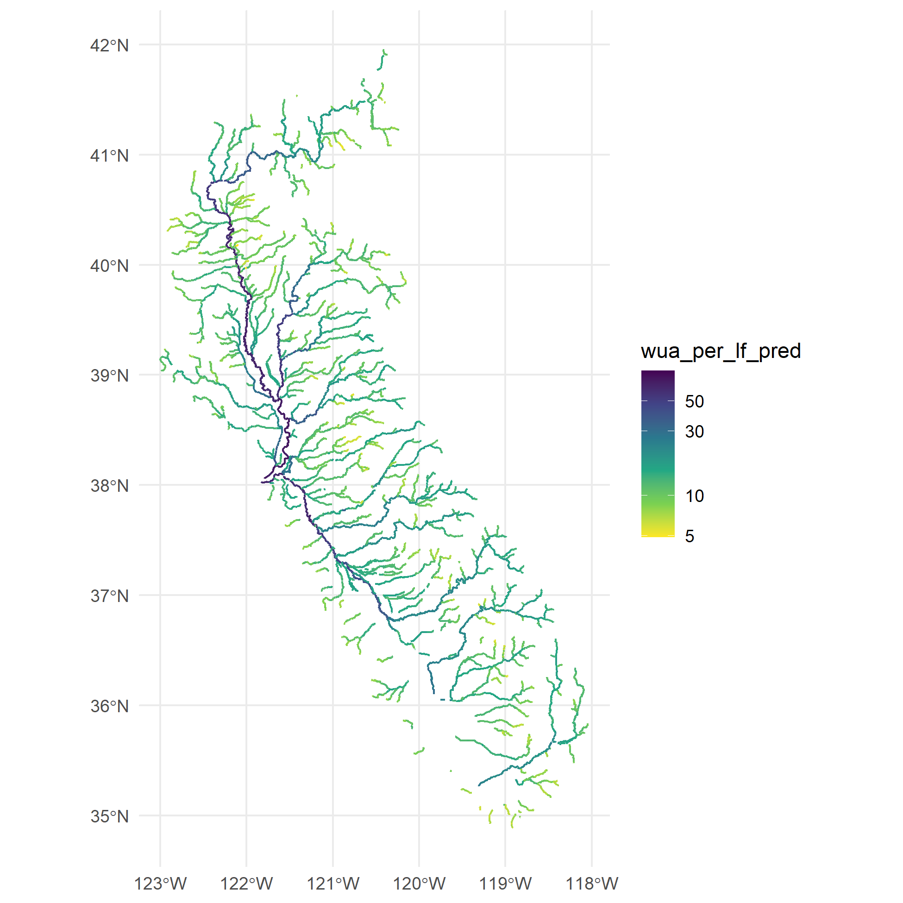<!-- -->

## Predictions summarized by DSMHabitat reach

``` r
# summary of typical flow ranges by DSMhabitat stream
prediction_flows <- readRDS(here::here("data-raw", "results", "watershed_flow_summary.Rds")) |>
  # make the numbers cleaner by rounding to nearest 100 cfs or 2 sig figs max
  mutate(across(-watershed, function(x) signif(round(x, -2), 2))) |>
  # establish ranges
  mutate(flow_cfs = map2(min_cfs, max_cfs, function(x, y) oom_range(x, y))) |>
  select(watershed, flow_cfs) |>
  unnest(flow_cfs) |>
  #instead of filtering here, filter later
  #filter(flow_cfs >= min(interp_flows) & flow_cfs <= max(interp_flows)) |>
  glimpse()
```

    ## Rows: 587
    ## Columns: 2
    ## $ watershed <chr> "American River", "American River", "American River", "Ameri…
    ## $ flow_cfs  <dbl> 500, 600, 700, 800, 900, 1000, 2000, 3000, 4000, 5000, 6000,…

``` r
#prediction_flows |> group_by(watershed) |> summarize(max_flow = max(flow_cfs)) |> arrange(-max_flow) 
```

``` r
mainstems_comid <- 
  st_read(file.path("/vsizip", here::here("data-raw", "source", "rearing_spatial_data", "nhdplusv2_comid_habitat_xw.shp.zip")), as_tibble=T) |>
  janitor::clean_names() |>
  st_zm() |>
  st_transform(st_crs(flowlines)) |>
  mutate(length_ft = st_length(geometry) |> units::set_units("ft") |> units::drop_units()) |>
  filter(habitat=="rearing") |>
  left_join(flowline_attributes |> select(comid, hqt_gradient_class), by=join_by(comid)) |>
  filter(!(river %in% c("Sacramento River", "San Joaquin River")))
```

    ## Reading layer `nhdplusv2_comid_habitat_xw' from data source 
    ##   `/vsizip/C:/Users/skylerlewis/Github/swc-habitat-suitability/data-raw/source/rearing_spatial_data/nhdplusv2_comid_habitat_xw.shp.zip' 
    ##   using driver `ESRI Shapefile'
    ## Simple feature collection with 2657 features and 16 fields
    ## Geometry type: LINESTRING
    ## Dimension:     XYZM
    ## Bounding box:  xmin: -123.0351 ymin: 36.76305 xmax: -119.1836 ymax: 41.32689
    ## z_range:       zmin: 0 zmax: 0
    ## m_range:       mmin: 0 mmax: 100
    ## Geodetic CRS:  NAD83

``` r
mainstems <-
  mainstems_comid |>
  group_by(river, hqt_gradient_class) |>
  summarize() 
```

    ## `summarise()` has grouped output by 'river'. You can override using the
    ## `.groups` argument.

``` r
mainstems_comid |> 
  ggplot() + 
  geom_sf(aes(group=river, color=hqt_gradient_class)) + 
  theme(legend.key.height = unit(12, "point"))
```

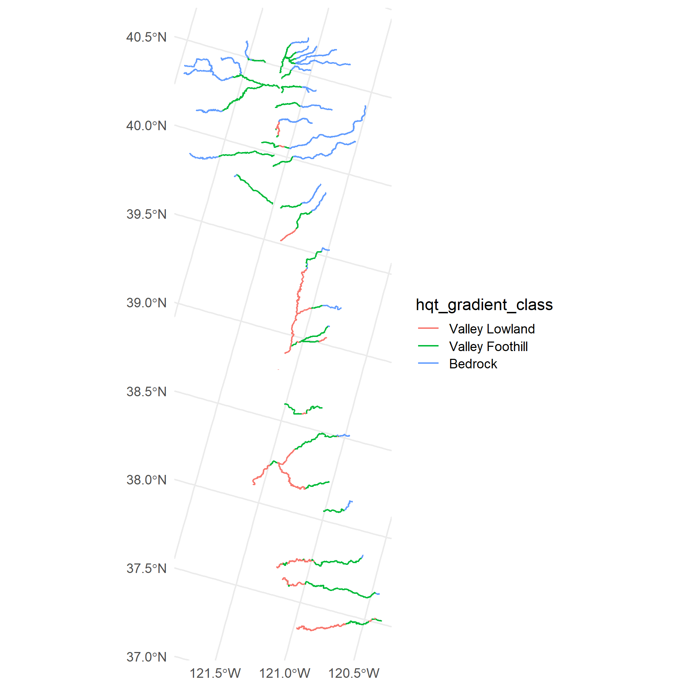<!-- -->

``` r
watersheds <- mainstems |> pull(river) |> unique()
watershed_name <- tolower(gsub(pattern = "-| ", replacement = "_", x = watersheds))
watershed_rda_name <- paste(watershed_name, "floodplain", sep = "_")

dsm_habitat_floodplain <- map_df(watershed_rda_name, function(watershed) {
  df <- as.data.frame(do.call(`::`, list(pkg = "DSMhabitat", name = watershed)))
}) |> 
  transmute(river = watershed,
            flow_cfs,
            FR_floodplain_m2 = FR_floodplain_acres * 4046.86,
            FR_floodplain_m2_suitable = DSMhabitat::apply_suitability(FR_floodplain_m2),
            FR_floodplain_acres_suitable = FR_floodplain_m2_suitable / 4046.86)

dsm_habitat_instream <- map_df(paste(watershed_name, "instream", sep = "_"), 
                               possibly(function(watershed) {
                                 df <- as.data.frame(do.call(`::`, list(pkg = "DSMhabitat", name = watershed)))
                                 }, otherwise = NULL)) |> 
  transmute(river = watershed,
            flow_cfs,
            FR_juv_wua) 

dsm_flows <- bind_rows(dsm_habitat_floodplain, dsm_habitat_instream) |>
  group_by(river, flow_cfs) |>
  summarize() |>
  ungroup() |>
  arrange(river, flow_cfs)
```

    ## `summarise()` has grouped output by 'river'. You can override using the
    ## `.groups` argument.

``` r
dsm_flow_ranges <- 
  dsm_flows |> 
  group_by(river) |> 
  summarize(min_flow_cfs = min(flow_cfs), max_flow_cfs = max(flow_cfs))

mainstems_comid |> 
  st_zm() |> 
  filter(comid %in% mainstems_comid$comid) |>
  ggplot() + 
  geom_sf(aes(color=river)) + 
  theme(legend.key.height = unit(12, "point"))
```

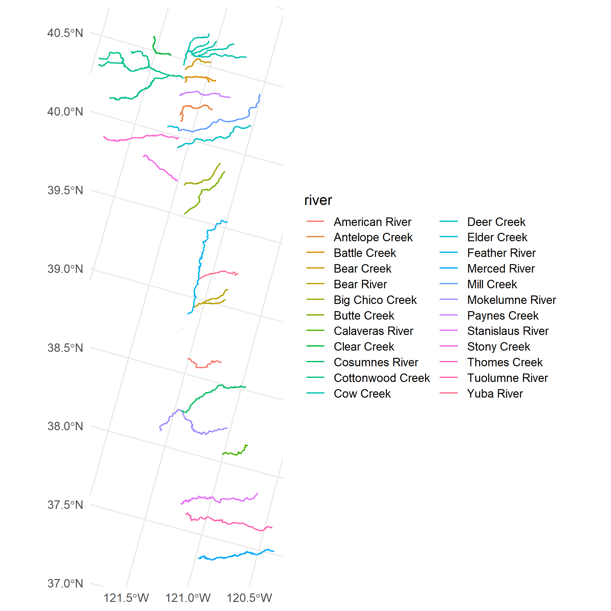<!-- -->

``` r
# combining both floodplain and instream rearing acreages/WUAs for comparison
dsm_habitat_combined <- mainstems |> 
  mutate(length_ft = st_length(geometry) |> units::set_units("ft") |> units::drop_units()) |>
  group_by(river) |> 
  summarize(length_ft = sum(length_ft)) |>
  st_drop_geometry() |>
  inner_join(full_join(dsm_habitat_instream, dsm_habitat_floodplain, by=join_by(river, flow_cfs)), by=join_by(river)) |>
  group_by(river) |>
  arrange(river, flow_cfs) |>
  mutate(FR_juv_wua = zoo::na.approx(FR_juv_wua, flow_cfs, na.rm=F),
         FR_floodplain_acres_suitable = zoo::na.approx(FR_floodplain_acres_suitable, flow_cfs, na.rm=F)) |>
  transmute(river, flow_cfs, 
            instream_wua_per_lf = coalesce(FR_juv_wua/1000,0),
            instream_suitable_ac = coalesce(FR_juv_wua/1000,0)*length_ft/43560,
            floodplain_wua_per_lf = coalesce(FR_floodplain_acres_suitable,0)*43560/length_ft,
            floodplain_suitable_ac = coalesce(FR_floodplain_acres_suitable,0),
            combined_wua_per_lf = instream_wua_per_lf + floodplain_wua_per_lf,
            combined_suitable_ac =  instream_suitable_ac + floodplain_suitable_ac) |>
  ungroup()
```

    ## Warning: There was 1 warning in `mutate()`.
    ## ℹ In argument: `FR_floodplain_acres_suitable =
    ##   zoo::na.approx(FR_floodplain_acres_suitable, flow_cfs, na.rm = F)`.
    ## ℹ In group 20: `river = "Stanislaus River"`.
    ## Caused by warning in `regularize.values()`:
    ## ! collapsing to unique 'x' values

``` r
dsm_habitat_wua_per_lf <- dsm_habitat_combined |>
  select(river, flow_cfs, instream_wua_per_lf, floodplain_wua_per_lf) |>
#  mutate(combined_wua_per_lf = pmax(instream_wua_per_lf, floodplain_wua_per_lf)) |>
  pivot_longer(cols=c(instream_wua_per_lf, floodplain_wua_per_lf)) |>
  mutate(name = paste("DSMhabitat", str_replace(name, "_wua_per_lf", "")),
         value = if_else(value>0, value, NA))

dsm_habitat_suitable_ac <- dsm_habitat_combined |>
  select(river, flow_cfs, instream_suitable_ac, floodplain_suitable_ac) |>
#  mutate(combined_suitable_ac = pmax(instream_suitable_ac, floodplain_suitable_ac)) |>
  pivot_longer(cols=c(instream_suitable_ac, floodplain_suitable_ac)) |>
  mutate(value = if_else(value>0, value, NA)) |>
  mutate(name = paste("DSMhabitat", str_replace(name, "_suitable_ac", "")),
         value = if_else(value>0, value, NA))
```

### One-step model, scale-dependent: WUA/LF vs flow

``` r
pd_sd <- flowline_attributes |> 
  select(comid, any_of(sd_rec$var_info$variable)) |> 
  inner_join(select(mainstems_comid, comid, river), by=join_by(comid)) |>
  #expand_grid(flow_cfs = interp_flows) |>
  inner_join(prediction_flows, by=join_by(river==watershed), relationship="many-to-many") |>
  arrange(comid, flow_cfs) |>
  filter(comid %in% mainstems_comid$comid) |>
  drop_na() #

pd_sd_dsmhabitat_pred <- 
  sd_rec |> 
  prep(training(td_split)) |> 
  bake(pd_sd) |> 
  bind_cols(pd_sd |> transmute(comid, flow_cfs_orig=flow_cfs)) |>
  drop_na() %>% # need to use magrittr pipe for this purpose
  mutate(ihs_wua_per_lf_pred = predict(rfr_sd$fit$fit, new_data=.)[[".pred"]]) |>
  transmute(comid, flow_cfs=flow_cfs_orig, ihs_wua_per_lf_pred) |>
  mutate(wua_per_lf_pred = sinh(ihs_wua_per_lf_pred)) |>
  select(comid, 
         flow_cfs, wua_per_lf_pred)

pd_rf_by_mainstem <-
  mainstems_comid |> 
  st_drop_geometry() |>
  inner_join(pd_sd_dsmhabitat_pred, by=join_by(comid), relationship="one-to-many") |>
  mutate(length_ft = coalesce(length_ft,0),
         wua_per_lf_pred = coalesce(wua_per_lf_pred,0),
         wua_ft2_pred = wua_per_lf_pred * length_ft) 

pd_rf_by_mainstem_summary <- pd_rf_by_mainstem |>
  group_by(river, flow_cfs) |>
  summarize(tot_length_ft = sum(length_ft),
            tot_wua_ft2 = sum(wua_ft2_pred),
            tot_wua_ac = tot_wua_ft2 / 43560,
            avg_wua_ft2_per_lf = tot_wua_ft2 / tot_length_ft,
            avg_wua_ft2_per_1000ft = 1000 * avg_wua_ft2_per_lf)
```

    ## `summarise()` has grouped output by 'river'. You can override using the
    ## `.groups` argument.

``` r
pd_rf_by_mainstem |>
  ggplot(aes(x = flow_cfs)) + 
  geom_line(aes(y = wua_per_lf_pred, group = comid, color = hqt_gradient_class), alpha=0.5) + 
  geom_line(data=pd_rf_by_mainstem_summary, aes(y = avg_wua_ft2_per_lf), linewidth=1.0) + #geom_smooth(method="loess", se=F, color="black") +
  facet_wrap(~river, scales="free_y") + 
  scale_x_log10(labels=scales::comma_format(), expand=c(0,0), 
                limits=c(min(interp_flows),max(interp_flows))) + 
  scale_y_continuous() + 
  theme(legend.position="top", 
        panel.grid.minor = element_blank(),
        axis.text.x = element_text(angle = 90, vjust = 0.5, hjust=1)) +
  xlab("Flow (cfs)") + ylab("Suitable Habitat Area (ft2 per linear ft)") +
  scale_color_manual(values = palette_hqt_gradient_class)
```

    ## Warning: Transformation introduced infinite values in continuous x-axis
    ## Transformation introduced infinite values in continuous x-axis

    ## Warning: Removed 9296 rows containing missing values (`geom_line()`).

    ## Warning: Removed 12 rows containing missing values (`geom_line()`).

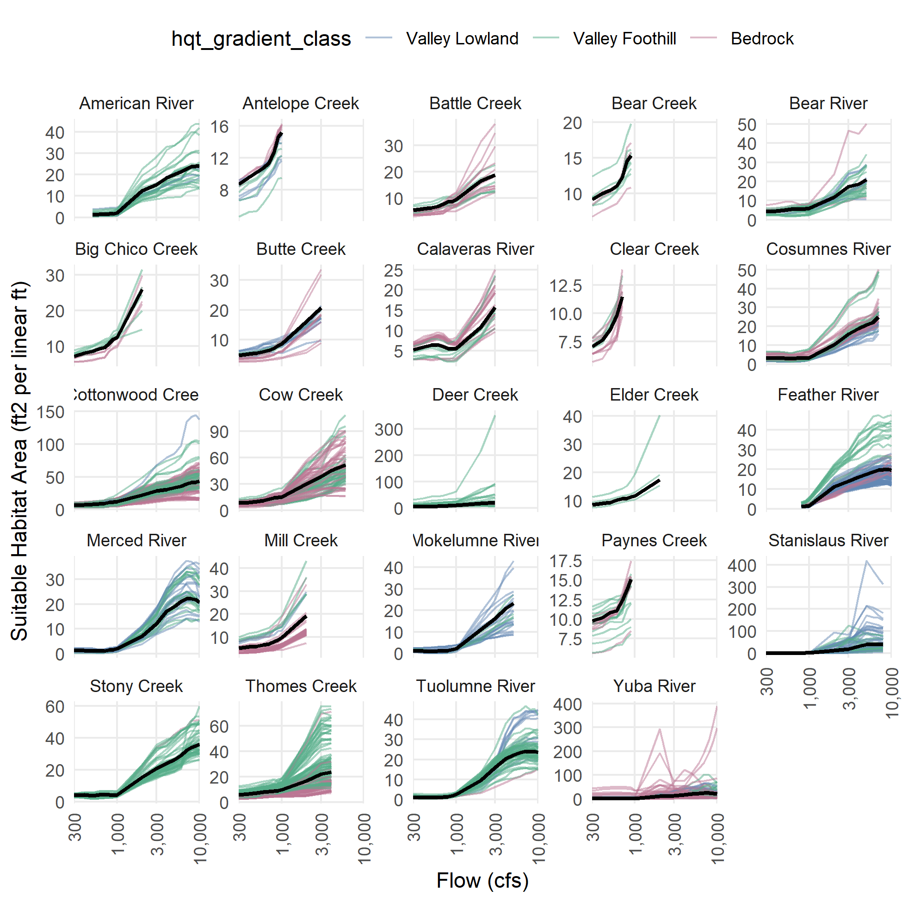<!-- -->

``` r
pd_rf_by_mainstem_summary |>
  ggplot() + 
  geom_line(aes(x = flow_cfs, y = tot_wua_ac, color = river)) + #, color=species, linetype=habitat)) + 
  facet_wrap(~river, scales="free_y") + 
  scale_x_log10(labels=scales::comma_format(), expand=c(0,0), 
                limits=c(min(interp_flows),max(interp_flows))) + 
  scale_y_continuous() + 
  theme(legend.position="none", 
        panel.grid.minor = element_blank(),
        axis.text.x = element_text(angle = 90, vjust = 0.5, hjust=1)) +
  xlab("Flow (cfs)") + ylab("Total WUA (ac)")
```

    ## Warning: Transformation introduced infinite values in continuous x-axis

    ## Warning: Removed 203 rows containing missing values (`geom_line()`).

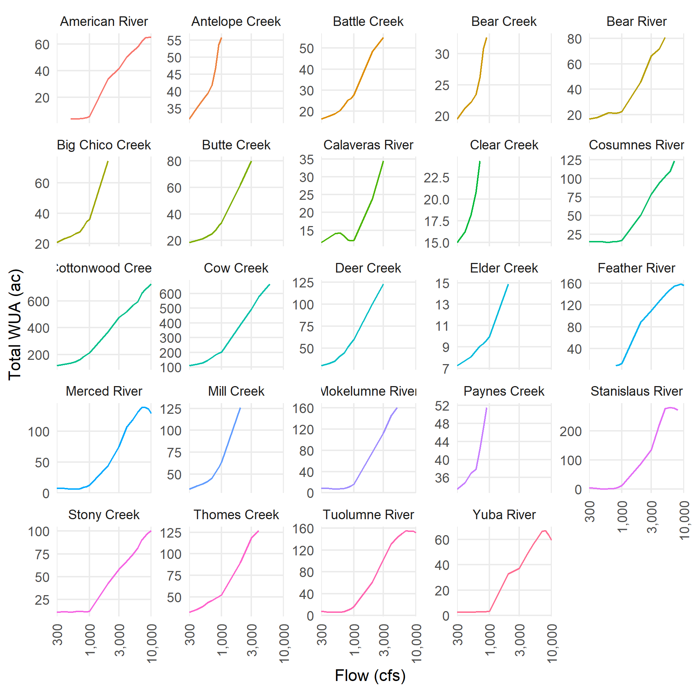<!-- -->

``` r
pd_rf_by_mainstem_summary |>
  ggplot() + 
  geom_line(aes(x = flow_cfs, y = avg_wua_ft2_per_lf, color = river)) + #, color=species, linetype=habitat)) + 
  facet_wrap(~river, scales="free_y") + 
  scale_x_log10(labels=scales::comma_format(), expand=c(0,0), 
                limits=c(min(interp_flows),max(interp_flows))) + 
  scale_y_continuous() + 
  theme(legend.position="none", 
        panel.grid.minor = element_blank(),
        axis.text.x = element_text(angle = 90, vjust = 0.5, hjust=1)) +
  xlab("Flow (cfs)") + ylab("Suitable Habitat Area (ft2 per linear ft)")
```

    ## Warning: Transformation introduced infinite values in continuous x-axis
    ## Removed 203 rows containing missing values (`geom_line()`).

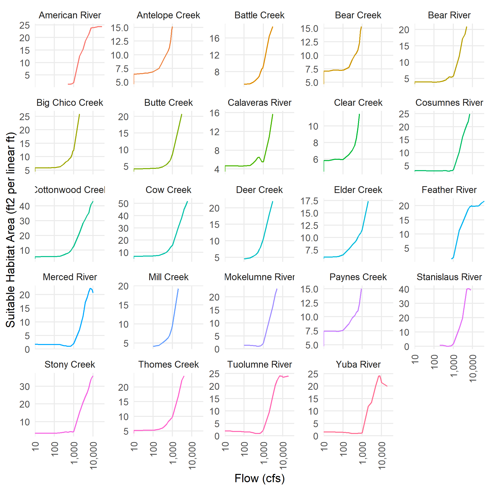<!-- -->

``` r
pd_rf_by_mainstem_summary |> 
  #inner_join(dsm_habitat_floodplain, by=join_by(river==river, flow_cfs==flow_cfs)) |> 
  #filter(river == "American River") |> 
  ggplot() +
  geom_line(aes(x = flow_cfs, y = tot_wua_ac, color="habistat prediction")) + 
  geom_line(data=dsm_habitat_suitable_ac, aes(x = flow_cfs, y = value, color = name)) +  
  facet_wrap(~river) + #, scales="free_y") + 
  scale_x_log10(labels=scales::comma_format(), expand=c(0,0), 
                limits=c(min(interp_flows),max(interp_flows))) + 
  scale_y_log10(labels=scales::comma_format(), expand=c(0,0)) + 
  theme(legend.position="top", legend.title=element_blank(),
        panel.grid.minor = element_blank(),
        axis.text.x = element_text(angle = 90, vjust = 0.5, hjust=1)) +
  xlab("Flow (cfs)") + ylab("Total WUA (ac)") +
  scale_color_manual(values = palette_dsmhabitat_comparison)
```

    ## Warning: Transformation introduced infinite values in continuous x-axis

    ## Warning: Transformation introduced infinite values in continuous x-axis

    ## Warning: Removed 12 rows containing missing values (`geom_line()`).

    ## Warning: Removed 26 rows containing missing values (`geom_line()`).

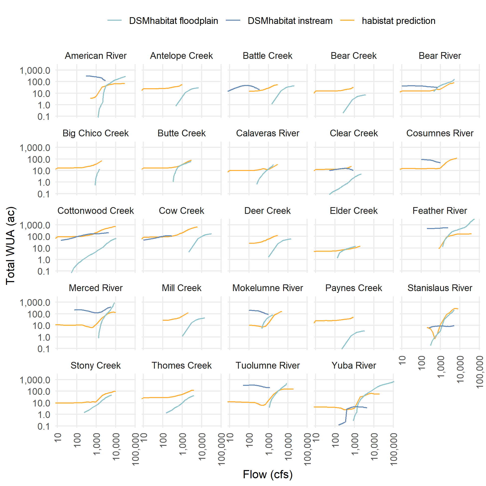<!-- -->

``` r
pd_rf_by_mainstem_summary |> 
  #inner_join(dsm_habitat_instream, by=join_by(river==river, flow_cfs==flow_cfs)) |> 
  ggplot() +
  geom_line(aes(x = flow_cfs, y = avg_wua_ft2_per_lf, color="habistat prediction")) + 
  geom_line(data=dsm_habitat_wua_per_lf, aes(x = flow_cfs, y = value, color = name)) +  
  facet_wrap(~river) + #, scales="free_y") + 
  scale_x_log10(labels=scales::comma_format(), expand=c(0,0), 
                limits=c(min(interp_flows),max(interp_flows))) + 
  scale_y_log10(labels=scales::comma_format(), expand=c(0,0)) + 
  theme(legend.position="top", legend.title=element_blank(),
        panel.grid.minor = element_blank(),
        axis.text.x = element_text(angle = 90, vjust = 0.5, hjust=1)) +
  xlab("Flow (cfs)") + ylab("Suitable Habitat Area (ft2 per linear ft)") +
  scale_color_manual(values = palette_dsmhabitat_comparison)
```

    ## Warning: Transformation introduced infinite values in continuous x-axis

    ## Warning: Transformation introduced infinite values in continuous x-axis

    ## Warning: Removed 12 rows containing missing values (`geom_line()`).

    ## Warning: Removed 26 rows containing missing values (`geom_line()`).

<!-- -->

``` r
pd_rf_by_mainstem_summary |> filter(flow_cfs>=min(interp_flows)) |>
  ggplot() +
  geom_line(aes(x = flow_cfs, y = tot_wua_ac, color="habistat prediction")) + 
  geom_line(data=dsm_habitat_suitable_ac, aes(x = flow_cfs, y = value, color = name)) +  
  facet_wrap(~river, scales="free_y") + 
  scale_x_log10(labels=scales::comma_format(), expand=c(0,0), 
                limits=c(min(interp_flows),max(interp_flows))) + 
  scale_y_continuous(labels=scales::comma_format(), expand=c(0,0), limits=c(0,NA)) + 
  theme(legend.position="top", legend.title=element_blank(),
        panel.grid.minor = element_blank(),
        axis.text.x = element_text(angle = 90, vjust = 0.5, hjust=1)) +
  xlab("Flow (cfs)") + ylab("Total WUA (ac)") +
  scale_color_manual(values = palette_dsmhabitat_comparison)
```

    ## Warning: Transformation introduced infinite values in continuous x-axis

    ## Warning: Removed 1 row containing missing values (`geom_line()`).

    ## Warning: Removed 26 rows containing missing values (`geom_line()`).

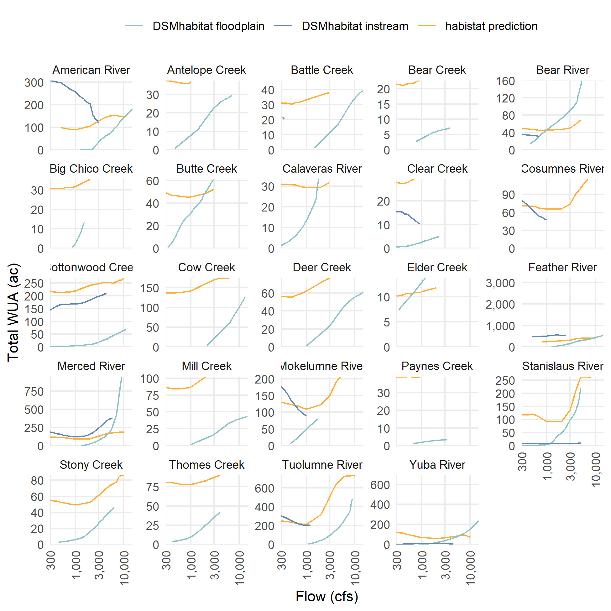<!-- -->

### One-step model, scale-independent: WUA/LF vs normalized flow

``` r
pd_si2 <- flowline_attributes |> 
  select(comid, any_of(si2_rec$var_info$variable), !!norm_var) |> #erom_q_ma_cfs, nf_bfl_dry_cfs, nf_bfl_wet_cfs) |> 
  inner_join(select(mainstems_comid, comid, river), by=join_by(comid)) |>
  #expand_grid(flow_cfs = interp_flows) |>
  inner_join(prediction_flows, by=join_by(river==watershed), relationship="many-to-many") |>
  arrange(comid, flow_cfs) |>
  filter(comid %in% mainstems_comid$comid) |>
  mutate(flow_norm_cfs = flow_cfs / !!norm_var) |> #,
       #nf_bfl_dry_cfs_norm = nf_bfl_dry_cfs/erom_q_ma_cfs, 
       #nf_bfl_wet_cfs_norm = nf_bfl_wet_cfs/erom_q_ma_cfs) |>
  drop_na()

pd_si2_dsmhabitat_pred <- 
  si2_rec |> 
  prep(training(td_split)) |> 
  bake(pd_si2) |> 
  bind_cols(select(pd_si2, comid, flow_cfs_actual=flow_cfs, !!norm_var)) |>
  drop_na() %>% # need to use magrittr pipe for this purpose
  mutate(ihs_wua_per_lf_norm_pred = predict(rfr_si2$fit$fit, new_data=.)[[".pred"]]) |>
  mutate(wua_per_lf_pred = sinh(ihs_wua_per_lf_norm_pred) * !!norm_var) |> 
  select(comid, flow_norm_cfs, wua_per_lf_pred, flow_cfs=flow_cfs_actual, wua_per_lf_pred)

pd_rf_by_mainstem <-
  mainstems_comid |> 
  st_drop_geometry() |>
  inner_join(pd_si2_dsmhabitat_pred, by=join_by(comid), relationship="one-to-many") |>
  mutate(length_ft = coalesce(length_ft,0),
         wua_per_lf_pred = coalesce(wua_per_lf_pred,0),
         wua_ft2_pred = wua_per_lf_pred * length_ft) 

pd_rf_by_mainstem_summary <- pd_rf_by_mainstem |>
  group_by(river, flow_cfs) |>
  summarize(tot_length_ft = sum(length_ft),
            tot_wua_ft2 = sum(wua_ft2_pred),
            tot_wua_ac = tot_wua_ft2 / 43560,
            avg_wua_ft2_per_lf = tot_wua_ft2 / tot_length_ft,
            avg_wua_ft2_per_1000ft = 1000 * avg_wua_ft2_per_lf)
```

    ## `summarise()` has grouped output by 'river'. You can override using the
    ## `.groups` argument.

``` r
pd_rf_by_mainstem |>
  ggplot(aes(x = flow_cfs)) + 
  geom_line(aes(y = wua_per_lf_pred, group = comid, color = hqt_gradient_class), alpha=0.5) + 
  geom_line(data=pd_rf_by_mainstem_summary, aes(y = avg_wua_ft2_per_lf), linewidth=1.0) + #geom_smooth(method="loess", se=F, color="black") +
  facet_wrap(~river, scales="free_y") + 
  scale_x_log10(labels=scales::comma_format(), expand=c(0,0), 
                limits=c(min(interp_flows),max(interp_flows))) + 
  scale_y_continuous() + 
  theme(legend.position="top", 
        panel.grid.minor = element_blank(),
        axis.text.x = element_text(angle = 90, vjust = 0.5, hjust=1)) +
  xlab("Flow (cfs)") + ylab("Suitable Habitat Area (ft2 per linear ft)") +
  scale_color_manual(values = palette_hqt_gradient_class)
```

    ## Warning: Transformation introduced infinite values in continuous x-axis
    ## Transformation introduced infinite values in continuous x-axis

    ## Warning: Removed 9296 rows containing missing values (`geom_line()`).

    ## Warning: Removed 12 rows containing missing values (`geom_line()`).

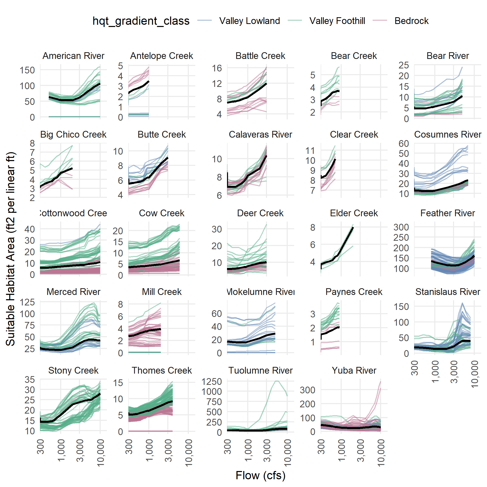<!-- -->

``` r
pd_rf_by_mainstem_summary |>
  ggplot() + 
  geom_line(aes(x = flow_cfs, y = tot_wua_ac, color = river)) + #, color=species, linetype=habitat)) + 
  facet_wrap(~river, scales="free_y") + 
  scale_x_log10(labels=scales::comma_format(), expand=c(0,0), 
                limits=c(min(interp_flows),max(interp_flows))) + 
  scale_y_continuous() + 
  theme(legend.position="none", 
        panel.grid.minor = element_blank(),
        axis.text.x = element_text(angle = 90, vjust = 0.5, hjust=1)) +
  xlab("Flow (cfs)") + ylab("Total WUA (ac)")
```

    ## Warning: Transformation introduced infinite values in continuous x-axis

    ## Warning: Removed 203 rows containing missing values (`geom_line()`).

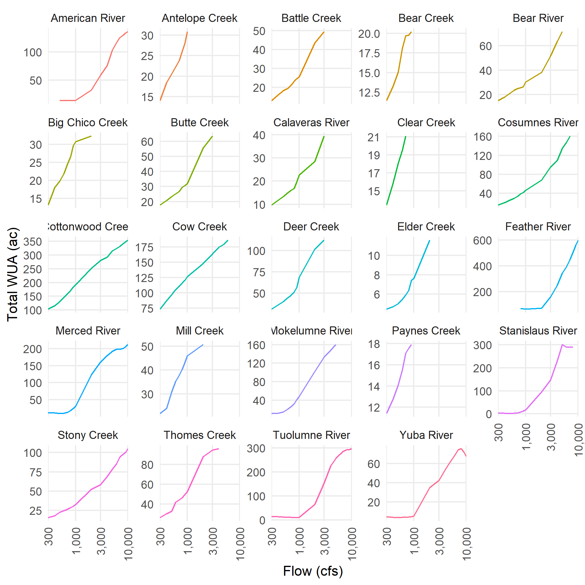<!-- -->

``` r
pd_rf_by_mainstem_summary |>
  ggplot() + 
  geom_line(aes(x = flow_cfs, y = avg_wua_ft2_per_lf, color = river)) + #, color=species, linetype=habitat)) + 
  facet_wrap(~river, scales="free_y") + 
  scale_x_log10(labels=scales::comma_format(), expand=c(0,0), 
                limits=c(min(interp_flows),max(interp_flows))) + 
  scale_y_continuous() + 
  theme(legend.position="none", 
        panel.grid.minor = element_blank(),
        axis.text.x = element_text(angle = 90, vjust = 0.5, hjust=1)) +
  xlab("Flow (cfs)") + ylab("Suitable Habitat Area (ft2 per linear ft)")
```

    ## Warning: Transformation introduced infinite values in continuous x-axis
    ## Removed 203 rows containing missing values (`geom_line()`).

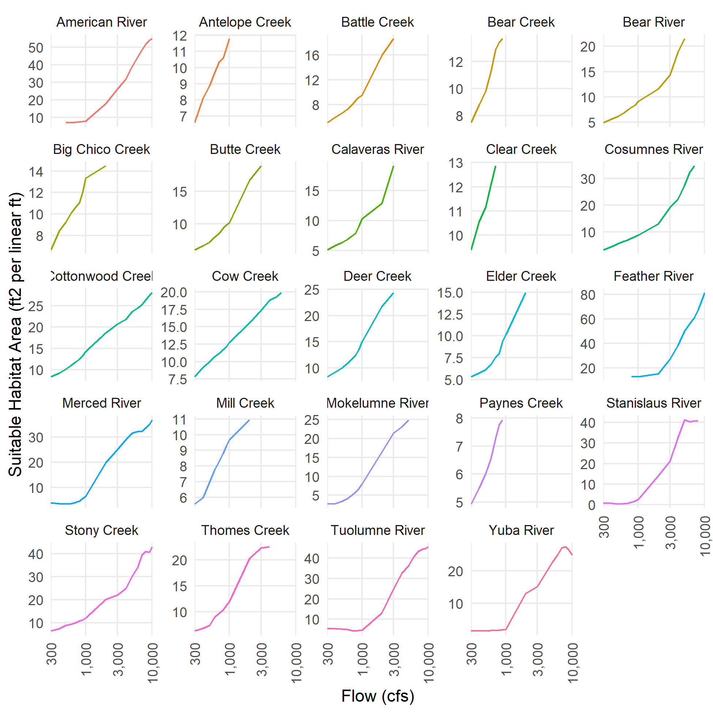<!-- -->

``` r
pd_rf_by_mainstem_summary |> 
  #inner_join(dsm_habitat_floodplain, by=join_by(river==river, flow_cfs==flow_cfs)) |> 
  #filter(river == "American River") |> 
  ggplot() +
  geom_line(aes(x = flow_cfs, y = tot_wua_ac, color="habistat prediction")) + 
  geom_line(data=dsm_habitat_suitable_ac, aes(x = flow_cfs, y = value, color = name)) +  
  facet_wrap(~river) + #, scales="free_y") + 
  scale_x_log10(labels=scales::comma_format(), expand=c(0,0), 
                limits=c(min(interp_flows),max(interp_flows))) + 
  scale_y_log10(labels=scales::comma_format(), expand=c(0,0)) + 
  theme(legend.position="top", legend.title=element_blank(),
        panel.grid.minor = element_blank(),
        axis.text.x = element_text(angle = 90, vjust = 0.5, hjust=1)) +
  xlab("Flow (cfs)") + ylab("Total WUA (ac)") +
  scale_color_manual(values = palette_dsmhabitat_comparison)
```

    ## Warning: Transformation introduced infinite values in continuous x-axis

    ## Warning: Transformation introduced infinite values in continuous x-axis

    ## Warning: Removed 12 rows containing missing values (`geom_line()`).

    ## Warning: Removed 26 rows containing missing values (`geom_line()`).

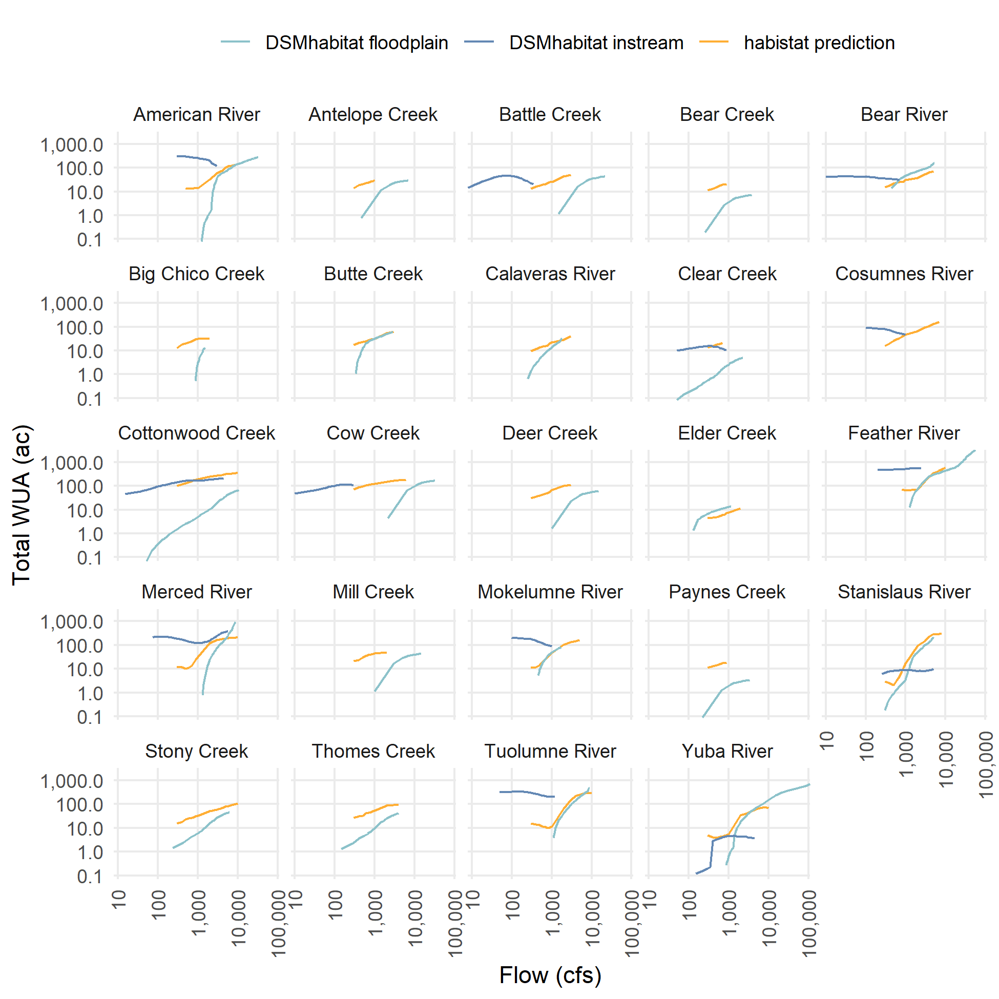<!-- -->

``` r
pd_rf_by_mainstem_summary |> 
  #inner_join(dsm_habitat_instream, by=join_by(river==river, flow_cfs==flow_cfs)) |> 
  ggplot() +
  geom_line(aes(x = flow_cfs, y = avg_wua_ft2_per_lf, color="habistat prediction")) + 
  geom_line(data=dsm_habitat_wua_per_lf, aes(x = flow_cfs, y = value, color = name)) +  
  facet_wrap(~river) + #, scales="free_y") + 
  scale_x_log10(labels=scales::comma_format(), expand=c(0,0), 
                limits=c(min(interp_flows),max(interp_flows))) + 
  scale_y_log10(labels=scales::comma_format(), expand=c(0,0)) + 
  theme(legend.position="top", legend.title=element_blank(),
        panel.grid.minor = element_blank(),
        axis.text.x = element_text(angle = 90, vjust = 0.5, hjust=1)) +
  xlab("Flow (cfs)") + ylab("Suitable Habitat Area (ft2 per linear ft)") +
  scale_color_manual(values = palette_dsmhabitat_comparison)
```

    ## Warning: Transformation introduced infinite values in continuous x-axis

    ## Warning: Transformation introduced infinite values in continuous x-axis

    ## Warning: Removed 12 rows containing missing values (`geom_line()`).

    ## Warning: Removed 26 rows containing missing values (`geom_line()`).

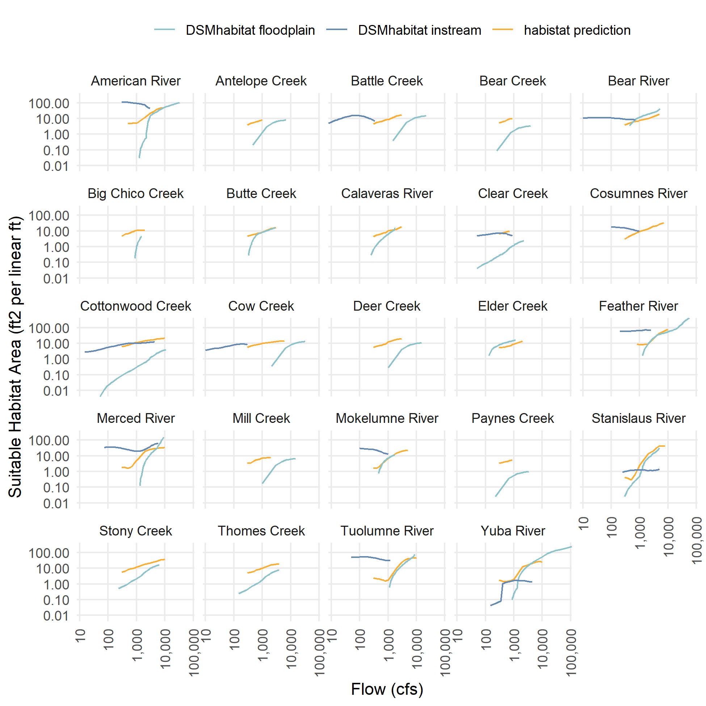<!-- -->

``` r
pd_rf_by_mainstem_summary |> filter(flow_cfs>=min(interp_flows)) |>
  ggplot() +
  geom_line(aes(x = flow_cfs, y = tot_wua_ac, color="habistat prediction")) + 
  geom_line(data=dsm_habitat_suitable_ac, aes(x = flow_cfs, y = value, color = name)) +  
  facet_wrap(~river, scales="free_y") + 
  scale_x_log10(labels=scales::comma_format(), expand=c(0,0), 
                limits=c(min(interp_flows),max(interp_flows))) + 
  scale_y_continuous(labels=scales::comma_format(), expand=c(0,0), limits=c(0,NA)) + 
  theme(legend.position="top", legend.title=element_blank(),
        panel.grid.minor = element_blank(),
        axis.text.x = element_text(angle = 90, vjust = 0.5, hjust=1)) +
  xlab("Flow (cfs)") + ylab("Total WUA (ac)") +
  scale_color_manual(values = palette_dsmhabitat_comparison)
```

    ## Warning: Transformation introduced infinite values in continuous x-axis

    ## Warning: Removed 1 row containing missing values (`geom_line()`).

    ## Warning: Removed 26 rows containing missing values (`geom_line()`).

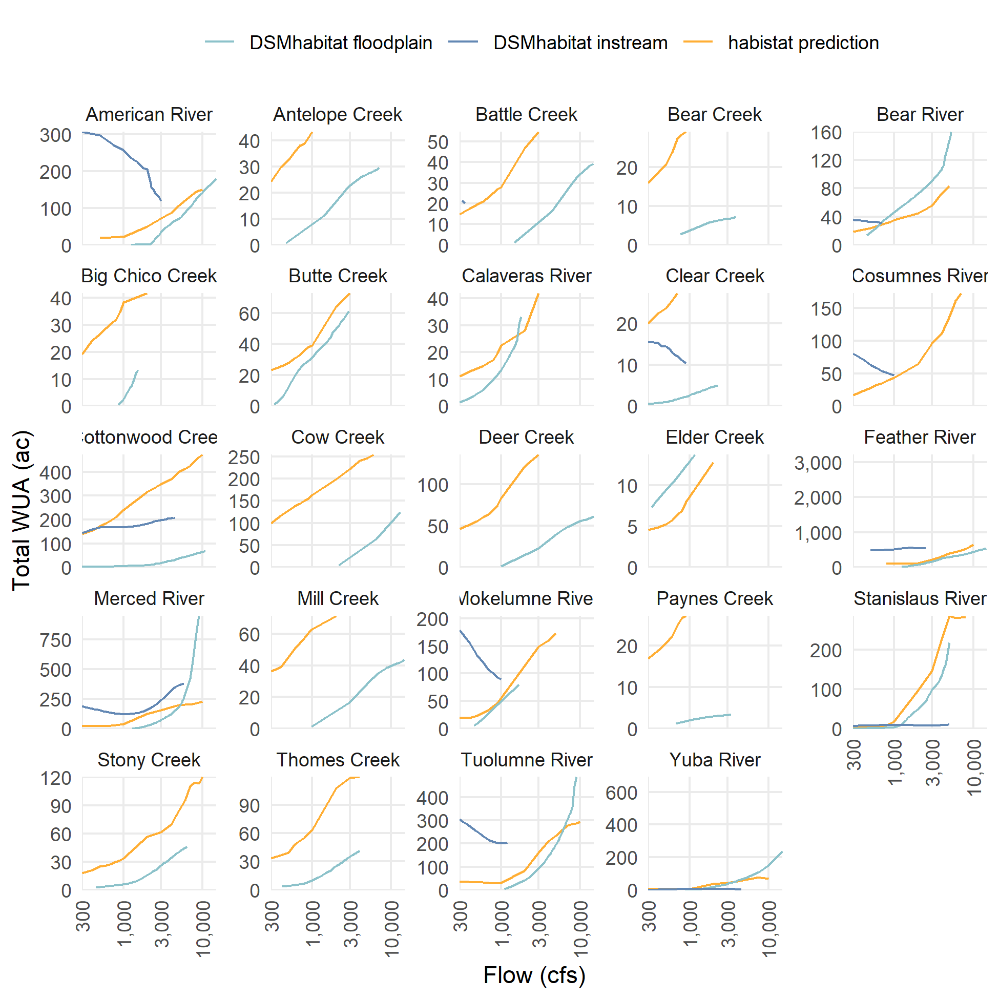<!-- -->

### Two-step model: (%HSI vs normalized flow) \* (Total Area/LF vs flow)

``` r
pd_sd2 <- flowline_attributes |> 
  select(comid, any_of(sd2_rec$var_info$variable)) |> 
  inner_join(select(mainstems_comid, comid, river), by=join_by(comid)) |>
  #expand_grid(flow_cfs = interp_flows) |>
  inner_join(prediction_flows, by=join_by(river==watershed), relationship="many-to-many") |>
  arrange(comid, flow_cfs) |>
  filter(comid %in% mainstems_comid$comid) |>
  drop_na()

pd_sd2_dsmhabitat_pred <- 
  sd2_rec |> 
  prep(training(td_split)) |> 
  bake(pd_sd2) |> 
  bind_cols(select(pd_sd2, comid, flow_cfs_orig=flow_cfs)) |>
  drop_na() %>% # need to use magrittr pipe for this purpose
  mutate(ihs_tot_area_per_lf_pred = predict(rfr_sd2$fit$fit, new_data=.)[[".pred"]]) |>
  mutate(tot_area_per_lf_pred = sinh(ihs_tot_area_per_lf_pred) ) |> 
  select(comid, flow_cfs=flow_cfs_orig, tot_area_per_lf_pred)

pd_si <- flowline_attributes |> 
  select(comid, any_of(si_rec$var_info$variable), !!norm_var) |> #, erom_q_ma_cfs, nf_bfl_dry_cfs, nf_bfl_wet_cfs) |> 
  inner_join(select(mainstems_comid, comid, river), by=join_by(comid)) |>
  #expand_grid(flow_cfs = interp_flows) |>
  inner_join(prediction_flows, by=join_by(river==watershed), relationship="many-to-many") |>
  arrange(comid, flow_cfs) |>
  filter(comid %in% mainstems_comid$comid) |>
  mutate(flow_norm_cfs = flow_cfs / !!norm_var) |>#,
       #nf_bfl_dry_cfs_norm = nf_bfl_dry_cfs/erom_q_ma_cfs, 
       #nf_bfl_wet_cfs_norm = nf_bfl_wet_cfs/erom_q_ma_cfs) |>
  drop_na()

pd_si_dsmhabitat_pred <- 
  si_rec |> 
  prep(training(td_split)) |> 
  bake(pd_si) |> 
  bind_cols(select(pd_si, comid, flow_cfs)) |>
  drop_na() %>% # need to use magrittr pipe for this purpose
  mutate(hsi_pred = predict(rfr_si$fit$fit, new_data=.)[[".pred"]]) |>
  #inner_join(flowline_attributes |> transmute(comid, length_ft = reach_length_km * 3280.84, width_ft = bf_width_m/3.2808), by=join_by(comid)) |>   
  #mutate(wua_per_lf_pred = hsi_pred * width_ft * length_ft / length_ft ) |> 
  left_join(pd_sd2_dsmhabitat_pred, by=join_by(comid, flow_cfs)) |>
  mutate(wua_per_lf_pred = hsi_pred * tot_area_per_lf_pred) |>
  select(comid, flow_norm_cfs, flow_cfs, hsi_pred, tot_area_per_lf_pred, wua_per_lf_pred)

pd_rf_by_mainstem <-
  mainstems_comid |> 
  st_drop_geometry() |>
  inner_join(pd_si_dsmhabitat_pred, by=join_by(comid), relationship="one-to-many") |>
  mutate(length_ft = coalesce(length_ft,0),
         wua_per_lf_pred = coalesce(wua_per_lf_pred,0),
         wua_ft2_pred = wua_per_lf_pred * length_ft) 

pd_rf_by_mainstem_summary <- pd_rf_by_mainstem |>
  group_by(river, flow_cfs) |>
  summarize(tot_length_ft = sum(length_ft),
            tot_wua_ft2 = sum(wua_ft2_pred),
            tot_wua_ac = tot_wua_ft2 / 43560,
            avg_wua_ft2_per_lf = tot_wua_ft2 / tot_length_ft,
            avg_wua_ft2_per_1000ft = 1000 * avg_wua_ft2_per_lf)
```

    ## `summarise()` has grouped output by 'river'. You can override using the
    ## `.groups` argument.

``` r
pd_rf_by_mainstem |>
  ggplot(aes(x = flow_cfs)) + 
  geom_line(aes(y = wua_per_lf_pred, group = comid, color = hqt_gradient_class), alpha=0.5) + 
  geom_line(data=pd_rf_by_mainstem_summary, aes(y = avg_wua_ft2_per_lf), linewidth=1.0) + #geom_smooth(method="loess", se=F, color="black") +
  facet_wrap(~river, scales="free_y") + 
  scale_x_log10(labels=scales::comma_format(), expand=c(0,0), 
                limits=c(min(interp_flows),max(interp_flows))) + 
  scale_y_continuous() + 
  theme(legend.position="top", 
        panel.grid.minor = element_blank(),
        axis.text.x = element_text(angle = 90, vjust = 0.5, hjust=1)) +
  xlab("Flow (cfs)") + ylab("Suitable Habitat Area (ft2 per linear ft)") +
  scale_color_manual(values = palette_hqt_gradient_class)
```

    ## Warning: Transformation introduced infinite values in continuous x-axis
    ## Transformation introduced infinite values in continuous x-axis

    ## Warning: Removed 9296 rows containing missing values (`geom_line()`).

    ## Warning: Removed 12 rows containing missing values (`geom_line()`).

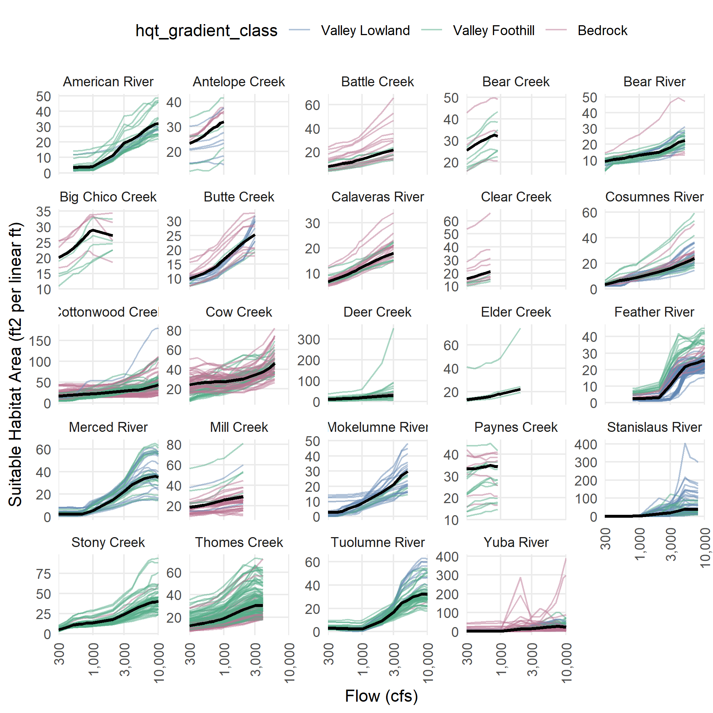<!-- -->

``` r
pd_rf_by_mainstem_summary |>
  ggplot() + 
  geom_line(aes(x = flow_cfs, y = tot_wua_ac, color = river)) + #, color=species, linetype=habitat)) + 
  facet_wrap(~river, scales="free_y") + 
  scale_x_log10(labels=scales::comma_format(), expand=c(0,0), 
                limits=c(min(interp_flows),max(interp_flows))) + 
  scale_y_continuous() + 
  theme(legend.position="none", 
        panel.grid.minor = element_blank(),
        axis.text.x = element_text(angle = 90, vjust = 0.5, hjust=1)) +
  xlab("Flow (cfs)") + ylab("Total WUA (ac)")
```

    ## Warning: Transformation introduced infinite values in continuous x-axis

    ## Warning: Removed 203 rows containing missing values (`geom_line()`).

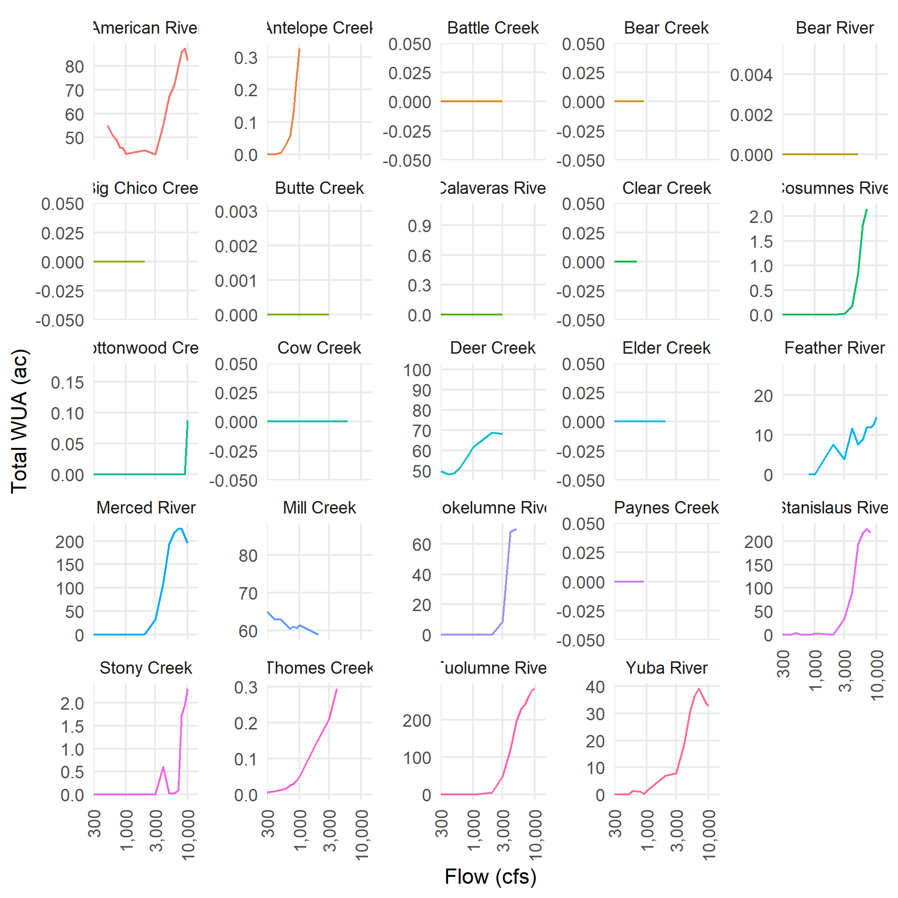<!-- -->

``` r
pd_rf_by_mainstem_summary |>
  ggplot() + 
  geom_line(aes(x = flow_cfs, y = avg_wua_ft2_per_lf, color = river)) + #, color=species, linetype=habitat)) + 
  facet_wrap(~river, scales="free_y") + 
  scale_x_log10(labels=scales::comma_format(), expand=c(0,0), 
                limits=c(min(interp_flows),max(interp_flows))) + 
  scale_y_continuous() + 
  theme(legend.position="none", 
        panel.grid.minor = element_blank(),
        axis.text.x = element_text(angle = 90, vjust = 0.5, hjust=1)) +
  xlab("Flow (cfs)") + ylab("Suitable Habitat Area (ft2 per linear ft)")
```

    ## Warning: Transformation introduced infinite values in continuous x-axis
    ## Removed 203 rows containing missing values (`geom_line()`).

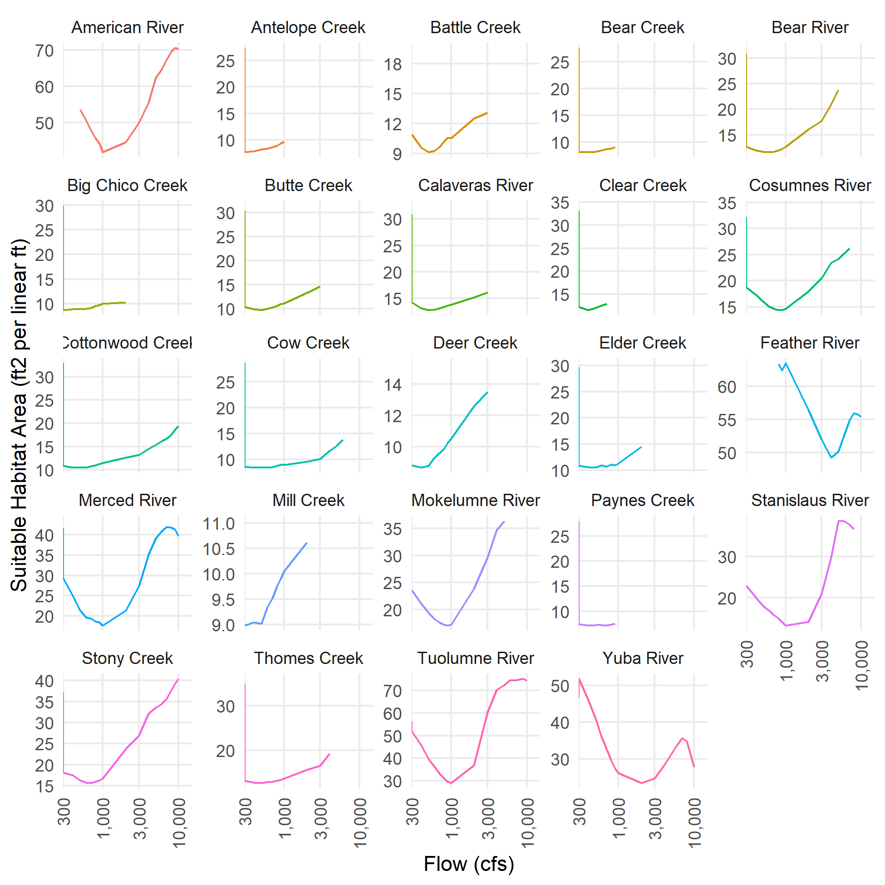<!-- -->

``` r
pd_rf_by_mainstem_summary |> 
  #inner_join(dsm_habitat_floodplain, by=join_by(river==river, flow_cfs==flow_cfs)) |> 
  #filter(river == "American River") |> 
  ggplot() +
  geom_line(aes(x = flow_cfs, y = tot_wua_ac, color="habistat prediction")) + 
  geom_line(data=dsm_habitat_suitable_ac, aes(x = flow_cfs, y = value, color = name)) +  
  facet_wrap(~river) + #, scales="free_y") + 
  scale_x_log10(labels=scales::comma_format(), expand=c(0,0), 
                limits=c(min(interp_flows),max(interp_flows))) + 
  scale_y_log10(labels=scales::comma_format(), expand=c(0,0)) + 
  theme(legend.position="top", legend.title=element_blank(),
        panel.grid.minor = element_blank(),
        axis.text.x = element_text(angle = 90, vjust = 0.5, hjust=1)) +
  xlab("Flow (cfs)") + ylab("Total WUA (ac)") +
  scale_color_manual(values = palette_dsmhabitat_comparison)
```

    ## Warning: Transformation introduced infinite values in continuous x-axis

    ## Warning: Transformation introduced infinite values in continuous x-axis

    ## Warning: Removed 12 rows containing missing values (`geom_line()`).

    ## Warning: Removed 26 rows containing missing values (`geom_line()`).

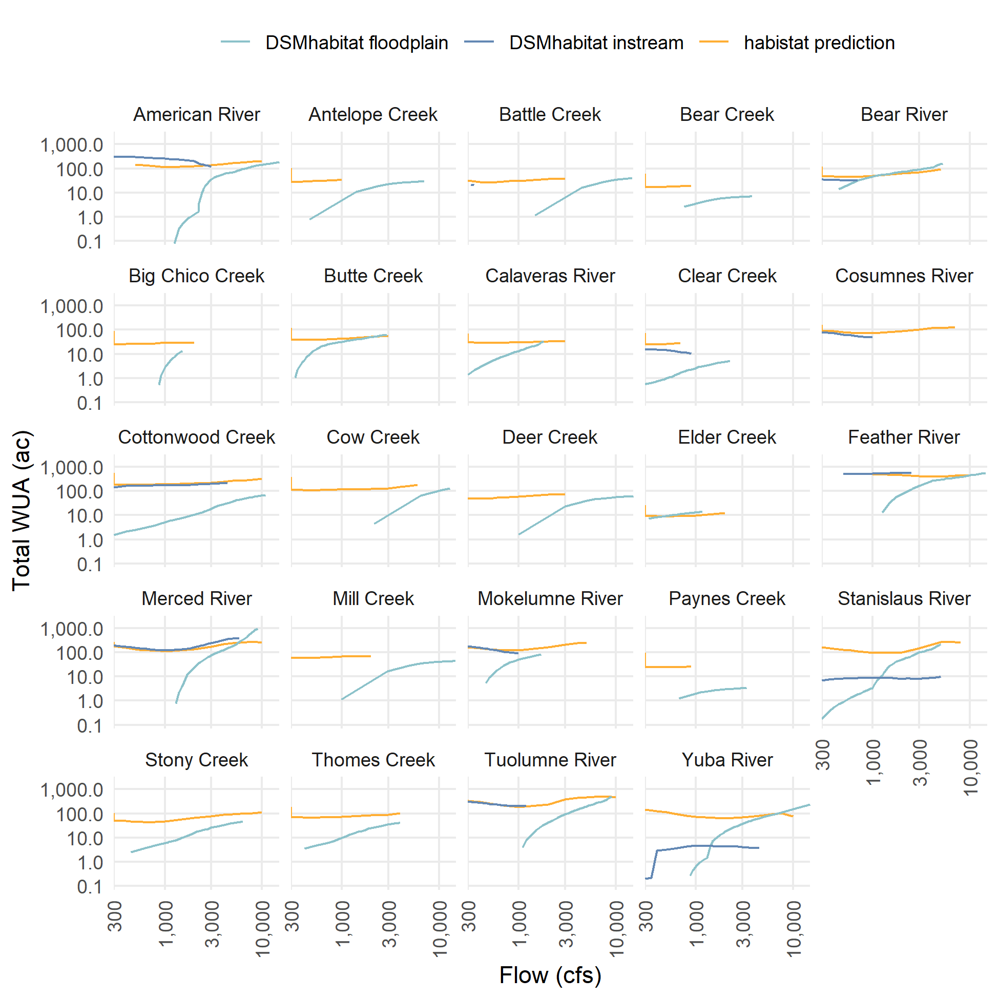<!-- -->

``` r
pd_rf_by_mainstem_summary |> 
  #inner_join(dsm_habitat_instream, by=join_by(river==river, flow_cfs==flow_cfs)) |> 
  ggplot() +
  geom_line(aes(x = flow_cfs, y = avg_wua_ft2_per_lf, color="habistat prediction")) + 
  geom_line(data=dsm_habitat_wua_per_lf, aes(x = flow_cfs, y = value, color = name)) +  
  facet_wrap(~river) + #, scales="free_y") + 
  scale_x_log10(labels=scales::comma_format(), expand=c(0,0), 
                limits=c(min(interp_flows),max(interp_flows))) + 
  scale_y_log10(labels=scales::comma_format(), expand=c(0,0)) + 
  theme(legend.position="top", legend.title=element_blank(),
        panel.grid.minor = element_blank(),
        axis.text.x = element_text(angle = 90, vjust = 0.5, hjust=1)) +
  xlab("Flow (cfs)") + ylab("Suitable Habitat Area (ft2 per linear ft)") +
  scale_color_manual(values = palette_dsmhabitat_comparison)
```

    ## Warning: Transformation introduced infinite values in continuous x-axis

    ## Warning: Transformation introduced infinite values in continuous x-axis

    ## Warning: Removed 12 rows containing missing values (`geom_line()`).

    ## Warning: Removed 26 rows containing missing values (`geom_line()`).

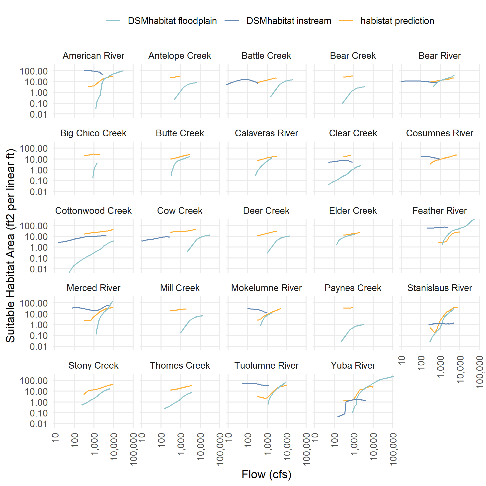<!-- -->

``` r
pd_rf_by_mainstem_summary |> filter(flow_cfs>=min(interp_flows)) |>
  ggplot() +
  geom_line(aes(x = flow_cfs, y = tot_wua_ac, color="habistat prediction")) + 
  geom_line(data=dsm_habitat_suitable_ac, aes(x = flow_cfs, y = value, color = name)) +  
  facet_wrap(~river, scales="free_y") + 
  scale_x_log10(labels=scales::comma_format(), expand=c(0,0), 
                limits=c(min(interp_flows),max(interp_flows))) + 
  scale_y_continuous(labels=scales::comma_format(), expand=c(0,0), limits=c(0,NA)) + 
  theme(legend.position="top", legend.title=element_blank(),
        panel.grid.minor = element_blank(),
        axis.text.x = element_text(angle = 90, vjust = 0.5, hjust=1)) +
  xlab("Flow (cfs)") + ylab("Total WUA (ac)") +
  scale_color_manual(values = palette_dsmhabitat_comparison)
```

    ## Warning: Transformation introduced infinite values in continuous x-axis

    ## Warning: Removed 1 row containing missing values (`geom_line()`).

    ## Warning: Removed 26 rows containing missing values (`geom_line()`).

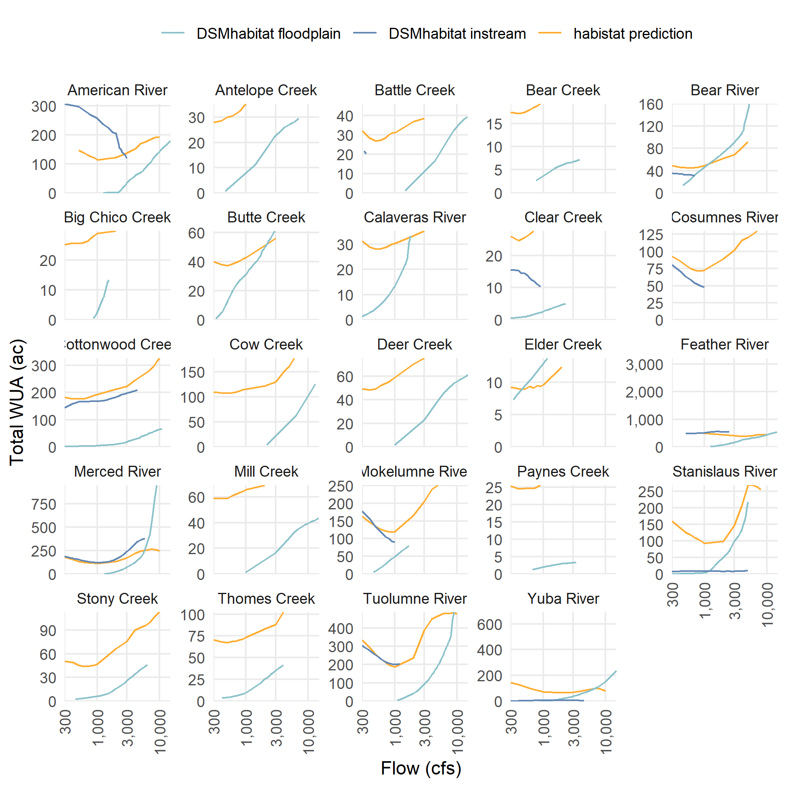<!-- -->

## Results Export

``` r
wua_predicted <- 
  pd |>
  inner_join(sd_pred |> select(comid, flow_cfs, wua_per_lf_pred_sd = wua_per_lf_pred),
             by=join_by(comid, flow_cfs), relationship="one-to-one") |>
  inner_join(si2_pred |> select(comid, flow_cfs, wua_per_lf_pred_si2 = wua_per_lf_pred),
             by=join_by(comid, flow_cfs), relationship="one-to-one") |>
  inner_join(sd2si_pred |> select(comid, flow_cfs, wua_per_lf_pred_sd2si = wua_per_lf_pred),
             by=join_by(comid, flow_cfs), relationship="one-to-one") |>
  #filter(row_number() == 26143) |>
  left_join(td |> select(comid, flow_cfs, wua_per_lf_actual = wua_per_lf),
            by=join_by(comid, flow_cfs), relationship="one-to-one")
  
 # td |> filter(comid==2823726)

wua_predicted |> saveRDS(here::here("data-raw", "results", "predictions_table.Rds"))
wua_predicted |> usethis::use_data(overwrite = TRUE)
```

    ## ✔ Setting active project to 'C:/Users/skylerlewis/Github/swc-habitat-suitability'
    ## ✔ Saving 'wua_predicted' to 'data/wua_predicted.rda'
    ## • Document your data (see 'https://r-pkgs.org/data.html')

``` r
# to run the leaflet map: shiny::runApp(here::here("inst", "app"))

# hs_predictions <- predictions_export
# usethis::use_data(hs_predictions, overwrite = T)

td |> filter(str_detect(dataset,"Tuolumne River")) |>
  select(comid, flow_cfs) |> arrange(comid, flow_cfs)
```

    ##       comid flow_cfs
    ## 1   2823718      300
    ## 2   2823718      400
    ## 3   2823718      500
    ## 4   2823718      600
    ## 5   2823718      700
    ## 6   2823718      800
    ## 7   2823718      900
    ## 8   2823718     1000
    ## 9   2823718     1100
    ## 10  2823718     1200
    ## 11  2823718     1300
    ## 12  2823718     1400
    ## 13  2823718     1500
    ## 14  2823718     1600
    ## 15  2823718     1700
    ## 16  2823718     1800
    ## 17  2823718     1900
    ## 18  2823718     2000
    ## 19  2823718     2100
    ## 20  2823718     2200
    ## 21  2823718     2300
    ## 22  2823718     2400
    ## 23  2823718     2500
    ## 24  2823718     2600
    ## 25  2823718     2700
    ## 26  2823718     2800
    ## 27  2823718     2900
    ## 28  2823718     3000
    ## 29  2823718     3100
    ## 30  2823718     3200
    ## 31  2823718     3300
    ## 32  2823718     3400
    ## 33  2823718     3500
    ## 34  2823718     3600
    ## 35  2823718     3700
    ## 36  2823718     3800
    ## 37  2823718     3900
    ## 38  2823718     4000
    ## 39  2823718     4100
    ## 40  2823718     4200
    ## 41  2823718     4300
    ## 42  2823718     4400
    ## 43  2823718     4500
    ## 44  2823718     4600
    ## 45  2823718     4700
    ## 46  2823718     4800
    ## 47  2823718     4900
    ## 48  2823718     5000
    ## 49  2823718     5100
    ## 50  2823718     5200
    ## 51  2823718     5300
    ## 52  2823718     5400
    ## 53  2823718     5500
    ## 54  2823718     5600
    ## 55  2823718     5700
    ## 56  2823718     5800
    ## 57  2823718     5900
    ## 58  2823718     6000
    ## 59  2823718     6100
    ## 60  2823718     6200
    ## 61  2823718     6300
    ## 62  2823718     6400
    ## 63  2823718     6500
    ## 64  2823718     6600
    ## 65  2823718     6700
    ## 66  2823718     6800
    ## 67  2823718     6900
    ## 68  2823718     7000
    ## 69  2823718     7100
    ## 70  2823718     7200
    ## 71  2823718     7300
    ## 72  2823718     7400
    ## 73  2823718     7500
    ## 74  2823718     7600
    ## 75  2823718     7700
    ## 76  2823718     7800
    ## 77  2823718     7900
    ## 78  2823718     8000
    ## 79  2823718     8100
    ## 80  2823718     8200
    ## 81  2823718     8300
    ## 82  2823718     8400
    ## 83  2823718     8500
    ## 84  2823718     8600
    ## 85  2823718     8700
    ## 86  2823718     8800
    ## 87  2823718     8900
    ## 88  2823718     9000
    ## 89  2823718     9100
    ## 90  2823718     9200
    ## 91  2823718     9300
    ## 92  2823718     9400
    ## 93  2823718     9500
    ## 94  2823718     9600
    ## 95  2823720      300
    ## 96  2823720      400
    ## 97  2823720      500
    ## 98  2823720      600
    ## 99  2823720      700
    ## 100 2823720      800
    ## 101 2823720      900
    ## 102 2823720     1000
    ## 103 2823720     1100
    ## 104 2823720     1200
    ## 105 2823720     1300
    ## 106 2823720     1400
    ## 107 2823720     1500
    ## 108 2823720     1600
    ## 109 2823720     1700
    ## 110 2823720     1800
    ## 111 2823720     1900
    ## 112 2823720     2000
    ## 113 2823720     2100
    ## 114 2823720     2200
    ## 115 2823720     2300
    ## 116 2823720     2400
    ## 117 2823720     2500
    ## 118 2823720     2600
    ## 119 2823720     2700
    ## 120 2823720     2800
    ## 121 2823720     2900
    ## 122 2823720     3000
    ## 123 2823720     3100
    ## 124 2823720     3200
    ## 125 2823720     3300
    ## 126 2823720     3400
    ## 127 2823720     3500
    ## 128 2823720     3600
    ## 129 2823720     3700
    ## 130 2823720     3800
    ## 131 2823720     3900
    ## 132 2823720     4000
    ## 133 2823720     4100
    ## 134 2823720     4200
    ## 135 2823720     4300
    ## 136 2823720     4400
    ## 137 2823720     4500
    ## 138 2823720     4600
    ## 139 2823720     4700
    ## 140 2823720     4800
    ## 141 2823720     4900
    ## 142 2823720     5000
    ## 143 2823720     5100
    ## 144 2823720     5200
    ## 145 2823720     5300
    ## 146 2823720     5400
    ## 147 2823720     5500
    ## 148 2823720     5600
    ## 149 2823720     5700
    ## 150 2823720     5800
    ## 151 2823720     5900
    ## 152 2823720     6000
    ## 153 2823720     6100
    ## 154 2823720     6200
    ## 155 2823720     6300
    ## 156 2823720     6400
    ## 157 2823720     6500
    ## 158 2823720     6600
    ## 159 2823720     6700
    ## 160 2823720     6800
    ## 161 2823720     6900
    ## 162 2823720     7000
    ## 163 2823720     7100
    ## 164 2823720     7200
    ## 165 2823720     7300
    ## 166 2823720     7400
    ## 167 2823720     7500
    ## 168 2823720     7600
    ## 169 2823720     7700
    ## 170 2823720     7800
    ## 171 2823720     7900
    ## 172 2823720     8000
    ## 173 2823720     8100
    ## 174 2823720     8200
    ## 175 2823720     8300
    ## 176 2823720     8400
    ## 177 2823720     8500
    ## 178 2823720     8600
    ## 179 2823720     8700
    ## 180 2823720     8800
    ## 181 2823720     8900
    ## 182 2823720     9000
    ## 183 2823720     9100
    ## 184 2823720     9200
    ## 185 2823720     9300
    ## 186 2823720     9400
    ## 187 2823720     9500
    ## 188 2823720     9600
    ## 189 2823726      300
    ## 190 2823726      400
    ## 191 2823726      500
    ## 192 2823726      600
    ## 193 2823726      700
    ## 194 2823726      800
    ## 195 2823726      900
    ## 196 2823726     1000
    ## 197 2823726     1100
    ## 198 2823726     1200
    ## 199 2823726     1300
    ## 200 2823726     1400
    ## 201 2823726     1500
    ## 202 2823726     1600
    ## 203 2823726     1700
    ## 204 2823726     1800
    ## 205 2823726     1900
    ## 206 2823726     2000
    ## 207 2823726     2100
    ## 208 2823726     2200
    ## 209 2823726     2300
    ## 210 2823726     2400
    ## 211 2823726     2500
    ## 212 2823726     2600
    ## 213 2823726     2700
    ## 214 2823726     2800
    ## 215 2823726     2900
    ## 216 2823726     3000
    ## 217 2823726     3100
    ## 218 2823726     3200
    ## 219 2823726     3300
    ## 220 2823726     3400
    ## 221 2823726     3500
    ## 222 2823726     3600
    ## 223 2823726     3700
    ## 224 2823726     3800
    ## 225 2823726     3900
    ## 226 2823726     4000
    ## 227 2823726     4100
    ## 228 2823726     4200
    ## 229 2823726     4300
    ## 230 2823726     4400
    ## 231 2823726     4500
    ## 232 2823726     4600
    ## 233 2823726     4700
    ## 234 2823726     4800
    ## 235 2823726     4900
    ## 236 2823726     5000
    ## 237 2823726     5100
    ## 238 2823726     5200
    ## 239 2823726     5300
    ## 240 2823726     5400
    ## 241 2823726     5500
    ## 242 2823726     5600
    ## 243 2823726     5700
    ## 244 2823726     5800
    ## 245 2823726     5900
    ## 246 2823726     6000
    ## 247 2823726     6100
    ## 248 2823726     6200
    ## 249 2823726     6300
    ## 250 2823726     6400
    ## 251 2823726     6500
    ## 252 2823726     6600
    ## 253 2823726     6700
    ## 254 2823726     6800
    ## 255 2823726     6900
    ## 256 2823726     7000
    ## 257 2823726     7100
    ## 258 2823726     7200
    ## 259 2823726     7300
    ## 260 2823726     7400
    ## 261 2823726     7500
    ## 262 2823726     7600
    ## 263 2823726     7700
    ## 264 2823726     7800
    ## 265 2823726     7900
    ## 266 2823726     8000
    ## 267 2823726     8100
    ## 268 2823726     8200
    ## 269 2823726     8300
    ## 270 2823726     8400
    ## 271 2823726     8500
    ## 272 2823726     8600
    ## 273 2823726     8700
    ## 274 2823726     8800
    ## 275 2823726     8900
    ## 276 2823726     9000
    ## 277 2823726     9100
    ## 278 2823726     9200
    ## 279 2823726     9300
    ## 280 2823726     9400
    ## 281 2823726     9500
    ## 282 2823726     9600
    ## 283 2823744      300
    ## 284 2823744      400
    ## 285 2823744      500
    ## 286 2823744      600
    ## 287 2823744      700
    ## 288 2823744      800
    ## 289 2823744      900
    ## 290 2823744     1000
    ## 291 2823744     1100
    ## 292 2823744     1200
    ## 293 2823744     1300
    ## 294 2823744     1400
    ## 295 2823744     1500
    ## 296 2823744     1600
    ## 297 2823744     1700
    ## 298 2823744     1800
    ## 299 2823744     1900
    ## 300 2823744     2000
    ## 301 2823744     2100
    ## 302 2823744     2200
    ## 303 2823744     2300
    ## 304 2823744     2400
    ## 305 2823744     2500
    ## 306 2823744     2600
    ## 307 2823744     2700
    ## 308 2823744     2800
    ## 309 2823744     2900
    ## 310 2823744     3000
    ## 311 2823744     3100
    ## 312 2823744     3200
    ## 313 2823744     3300
    ## 314 2823744     3400
    ## 315 2823744     3500
    ## 316 2823744     3600
    ## 317 2823744     3700
    ## 318 2823744     3800
    ## 319 2823744     3900
    ## 320 2823744     4000
    ## 321 2823744     4100
    ## 322 2823744     4200
    ## 323 2823744     4300
    ## 324 2823744     4400
    ## 325 2823744     4500
    ## 326 2823744     4600
    ## 327 2823744     4700
    ## 328 2823744     4800
    ## 329 2823744     4900
    ## 330 2823744     5000
    ## 331 2823744     5100
    ## 332 2823744     5200
    ## 333 2823744     5300
    ## 334 2823744     5400
    ## 335 2823744     5500
    ## 336 2823744     5600
    ## 337 2823744     5700
    ## 338 2823744     5800
    ## 339 2823744     5900
    ## 340 2823744     6000
    ## 341 2823744     6100
    ## 342 2823744     6200
    ## 343 2823744     6300
    ## 344 2823744     6400
    ## 345 2823744     6500
    ## 346 2823744     6600
    ## 347 2823744     6700
    ## 348 2823744     6800
    ## 349 2823744     6900
    ## 350 2823744     7000
    ## 351 2823744     7100
    ## 352 2823744     7200
    ## 353 2823744     7300
    ## 354 2823744     7400
    ## 355 2823744     7500
    ## 356 2823744     7600
    ## 357 2823744     7700
    ## 358 2823744     7800
    ## 359 2823744     7900
    ## 360 2823744     8000
    ## 361 2823744     8100
    ## 362 2823744     8200
    ## 363 2823744     8300
    ## 364 2823744     8400
    ## 365 2823744     8500
    ## 366 2823744     8600
    ## 367 2823744     8700
    ## 368 2823744     8800
    ## 369 2823744     8900
    ## 370 2823744     9000
    ## 371 2823744     9100
    ## 372 2823744     9200
    ## 373 2823744     9300
    ## 374 2823744     9400
    ## 375 2823744     9500
    ## 376 2823744     9600
    ## 377 2823750      300
    ## 378 2823750      400
    ## 379 2823750      500
    ## 380 2823750      600
    ## 381 2823750      700
    ## 382 2823750      800
    ## 383 2823750      900
    ## 384 2823750     1000
    ## 385 2823750     1100
    ## 386 2823750     1200
    ## 387 2823750     1300
    ## 388 2823750     1400
    ## 389 2823750     1500
    ## 390 2823750     1600
    ## 391 2823750     1700
    ## 392 2823750     1800
    ## 393 2823750     1900
    ## 394 2823750     2000
    ## 395 2823750     2100
    ## 396 2823750     2200
    ## 397 2823750     2300
    ## 398 2823750     2400
    ## 399 2823750     2500
    ## 400 2823750     2600
    ## 401 2823750     2700
    ## 402 2823750     2800
    ## 403 2823750     2900
    ## 404 2823750     3000
    ## 405 2823750     3100
    ## 406 2823750     3200
    ## 407 2823750     3300
    ## 408 2823750     3400
    ## 409 2823750     3500
    ## 410 2823750     3600
    ## 411 2823750     3700
    ## 412 2823750     3800
    ## 413 2823750     3900
    ## 414 2823750     4000
    ## 415 2823750     4100
    ## 416 2823750     4200
    ## 417 2823750     4300
    ## 418 2823750     4400
    ## 419 2823750     4500
    ## 420 2823750     4600
    ## 421 2823750     4700
    ## 422 2823750     4800
    ## 423 2823750     4900
    ## 424 2823750     5000
    ## 425 2823750     5100
    ## 426 2823750     5200
    ## 427 2823750     5300
    ## 428 2823750     5400
    ## 429 2823750     5500
    ## 430 2823750     5600
    ## 431 2823750     5700
    ## 432 2823750     5800
    ## 433 2823750     5900
    ## 434 2823750     6000
    ## 435 2823750     6100
    ## 436 2823750     6200
    ## 437 2823750     6300
    ## 438 2823750     6400
    ## 439 2823750     6500
    ## 440 2823750     6600
    ## 441 2823750     6700
    ## 442 2823750     6800
    ## 443 2823750     6900
    ## 444 2823750     7000
    ## 445 2823750     7100
    ## 446 2823750     7200
    ## 447 2823750     7300
    ## 448 2823750     7400
    ## 449 2823750     7500
    ## 450 2823750     7600
    ## 451 2823750     7700
    ## 452 2823750     7800
    ## 453 2823750     7900
    ## 454 2823750     8000
    ## 455 2823750     8100
    ## 456 2823750     8200
    ## 457 2823750     8300
    ## 458 2823750     8400
    ## 459 2823750     8500
    ## 460 2823750     8600
    ## 461 2823750     8700
    ## 462 2823750     8800
    ## 463 2823750     8900
    ## 464 2823750     9000
    ## 465 2823750     9100
    ## 466 2823750     9200
    ## 467 2823750     9300
    ## 468 2823750     9400
    ## 469 2823750     9500
    ## 470 2823750     9600

## Yuba Comparison

Non-temporal comparison

``` r
lyr_cbec_reaches <- tribble(
  ~reach_id, ~reach_name, ~length_lf, ~rm_ds, ~rm_us,
  "FR", "Feather River", 31680, 0.2, 6.2,
  "DGR", "Daguerre Point Dam", 28512, 6.2, 11.6,
  "HR", "Hammon", 36960, 11.6, 18.6,
  "TBR", "Timbuctoo Bend", 19536, 18.6, 22.3,
  "NR", "Narrows", 5808, 22.3, 23.4,
  "EDR", "Englebright Dam", 3696, 23.4, 24.1) |>
  mutate(reach_name = as_factor(reach_name),
         reach_id = as_factor(reach_id))
  
lyr_cbec_nontemporal <- 
  read_csv(here::here("data-raw", "source", "hydraulic_model_data", "yuba_srh2d_2020", "LYR_WUA_Discharge_2020_06_30_Nontemporal_WUA_by_Domain.csv")) |>
  select(-"Total WUA") |>
  rename(flow_cfs = Discharge) |>
  pivot_longer(cols = ends_with("WUA"),
               names_to = "lyr_reach",
               values_to = "wua_ac",
               names_transform = function(x) str_replace_all(x, " WUA", "")) |>
  inner_join(lyr_cbec_reaches, by=join_by(lyr_reach == reach_id)) |>
  mutate(wua_ft2 = wua_ac * 43560,
         wua_ft2_per_lf = wua_ft2 / length_lf)
```

    ## Rows: 27 Columns: 7
    ## ── Column specification ────────────────────────────────────────────────────────
    ## Delimiter: ","
    ## dbl (7): Discharge, DGR WUA, EDR WUA, FR WUA, HR WUA, TBR WUA, Total WUA
    ## 
    ## ℹ Use `spec()` to retrieve the full column specification for this data.
    ## ℹ Specify the column types or set `show_col_types = FALSE` to quiet this message.

``` r
lyr_cbec_nontemporal_summary <-
  lyr_cbec_nontemporal |> 
  group_by(flow_cfs) |> 
  summarize(across(c(wua_ac, wua_ft2, length_lf), sum)) |>
  mutate(wua_ft2_per_lf = wua_ft2 / length_lf)

yuba_wua_predicted <-
  wua_predicted |> 
  select(comid, flow_cfs, starts_with("wua_per_lf")) |>
  filter(comid %in% filter(mainstems_comid, river=="Yuba River")$comid) |>
  filter(!is.na(wua_per_lf_actual)) |>
  inner_join(flowline_attributes |> transmute(comid, length_ft = reach_length_km*3280.84), by=join_by(comid))

yuba_wua_predicted_summary <- 
  yuba_wua_predicted |> 
  group_by(flow_cfs) |>
  mutate(across(starts_with("wua_per_lf"), function(x) x * length_ft)) |>
  summarize(across(c(length_ft, starts_with("wua_per_lf")), sum)) |>
  mutate(across(starts_with("wua_per_lf"), function(x) x / length_ft))

yuba_dsmhabitat_summary <-
  dsm_habitat_wua_per_lf |> 
  filter(river=="Yuba River") |>
  mutate(name = str_replace(name, " ", "_")) |>
  pivot_wider() |>
  mutate(DSMhabitat_total = coalesce(DSMhabitat_instream,0) + coalesce(DSMhabitat_floodplain,0))

ggplot() + 
  geom_line(data = yuba_wua_predicted_summary,
            aes(x = flow_cfs, y = wua_per_lf_actual, color = "Habistat Training (LYR SRH2D)", linetype = "instream + floodplain"), linewidth=1) +
  geom_line(data = yuba_wua_predicted_summary,
            aes(x = flow_cfs, y = wua_per_lf_pred_sd, color = "Habistat Model 1", linetype = "instream + floodplain"), linewidth=1) +
  geom_line(data = yuba_wua_predicted_summary,
            aes(x = flow_cfs, y = wua_per_lf_pred_si2, color = "Habistat Model 2", linetype = "instream + floodplain"), linewidth=1) +
  geom_line(data = lyr_cbec_nontemporal_summary,
            aes(x = flow_cfs, y = wua_ft2_per_lf, color = "CBEC Study (LYR SRH2D)", linetype = "instream + floodplain"), linewidth=1) +
  geom_line(data = yuba_dsmhabitat_summary,
            aes(x = flow_cfs, y = DSMhabitat_total, color = "DSMhabitat", linetype = "instream + floodplain"), linewidth=1) +
  geom_line(data = yuba_dsmhabitat_summary,
            aes(x = flow_cfs, y = DSMhabitat_instream, color = "DSMhabitat", linetype = "instream"), linewidth=1) +
  geom_line(data = yuba_dsmhabitat_summary,
            aes(x = flow_cfs, y = DSMhabitat_floodplain, color = "DSMhabitat", linetype = "floodplain"), linewidth=1) + 
  scale_x_log10(labels = scales::label_comma(), limits = c(NA, 15000)) + 
  scale_y_continuous(limits = c(0, 60), expand = c(0, 0)) +
  scale_linetype_manual(name = "domain", 
                        values = c("instream + floodplain" = "solid", 
                                   "instream" = "dashed", 
                                   "floodplain" = "dotted")) +
  xlab("Flow (cfs)") + ylab("Suitable habitat area (ft2) per linear ft") +
  theme(panel.grid.minor = element_blank()) + annotation_logticks(sides = "b") +
  ggtitle("WUA Estimates: HabiStat vs CBEC vs DSMhabitat") +
  scale_color_manual(name = "dataset", 
                     values = c("DSMhabitat" = "#8cc2ca",
                                "CBEC Study (LYR SRH2D)" = "#6388b4",
                                "Habistat Training (LYR SRH2D)" = "#55ad79",
                                "Habistat Model 1" = "#ffae34",
                                "Habistat Model 2" = "#c3bc3f"))
```

    ## Warning: Removed 4 rows containing missing values (`geom_line()`).

    ## Warning: Removed 6 rows containing missing values (`geom_line()`).

    ## Warning: Removed 9 rows containing missing values (`geom_line()`).

    ## Warning: Removed 15 rows containing missing values (`geom_line()`).

<!-- -->

``` r
lyr_cbec_temporal <- 
  read_csv(here::here("data-raw", "source", "hydraulic_model_data", "yuba_srh2d_2020", "LYR_WUA_Discharge_2020_06_30_Temporal_WUA_by_Domain_by_WY.csv")) |>
  mutate(Date_Time = mdy(Date_Time)) |>
  select(-"Total WUA") |>
  rename(flow_cfs = Flow_cfs, date_time = Date_Time, wy_day = Day) |>
  mutate(water_year = if_else(month(date_time)>=10, year(date_time)+1, year(date_time))) |>
  pivot_longer(cols = ends_with("WUA"),
               names_to = "lyr_reach",
               values_to = "wua_ac",
               names_transform = function(x) str_replace_all(x, " WUA", "")) |>
  inner_join(lyr_cbec_reaches, by=join_by(lyr_reach == reach_id)) |>
  mutate(wua_ft2 = wua_ac * 43560,
         wua_ft2_per_lf = wua_ft2 / length_lf)
```

    ## Rows: 1453 Columns: 9
    ## ── Column specification ────────────────────────────────────────────────────────
    ## Delimiter: ","
    ## chr (1): Date_Time
    ## dbl (8): Day, Flow_cfs, DGR WUA, EDR WUA, FR WUA, HR WUA, TBR WUA, Total WUA
    ## 
    ## ℹ Use `spec()` to retrieve the full column specification for this data.
    ## ℹ Specify the column types or set `show_col_types = FALSE` to quiet this message.

``` r
lyr_cbec_temporal_summary <-
  lyr_cbec_temporal |> 
  group_by(water_year, date_time, flow_cfs) |> 
  summarize(across(c(wua_ac, wua_ft2, length_lf), sum)) |>
  mutate(wua_ft2_per_lf = wua_ft2 / length_lf)
```

    ## `summarise()` has grouped output by 'water_year', 'date_time'. You can override
    ## using the `.groups` argument.

``` r
yuba_wua_predicted_temporal <- 
  readRDS(here::here("data-raw", "results", "durhsi_applied_to_comid.Rds")) |>
  filter(dataset == "Lower Yuba River") |>
  filter(water_year %in% unique(lyr_cbec_temporal$water_year)) |>
  select(comid, water_year, flow_cfs = q, wua, durwua) |>
  inner_join(flowline_attributes |> transmute(comid, length_ft = reach_length_km*3280.84), by=join_by(comid))

yuba_wua_predicted_temporal_summary <- 
  yuba_wua_predicted_temporal |> 
  group_by(flow_cfs, water_year) |>
  summarize(wua = sum(wua * length_ft) / sum(length_ft), 
            durwua = sum(durwua * length_ft) / sum(length_ft))
```

    ## `summarise()` has grouped output by 'flow_cfs'. You can override using the
    ## `.groups` argument.

``` r
yuba_wua_predicted_temporal_ts <-
  readRDS(here::here("data-raw", "results", "durhsi_applied_to_comid_ts.Rds")) |>
  ungroup() |>
    filter(river == "Lower Yuba River") |>
  filter(water_year %in% unique(lyr_cbec_temporal$water_year)) |>
  select(comid, water_year, flow_cfs = q, durwua, date) |>
  inner_join(flowline_attributes |> transmute(comid, length_ft = reach_length_km*3280.84), by=join_by(comid))

yuba_wua_predicted_temporal_ts_summary <- 
  yuba_wua_predicted_temporal_ts |> 
  group_by(flow_cfs, water_year, date) |>
  summarize(durwua = sum(durwua * length_ft) / sum(length_ft))
```

    ## `summarise()` has grouped output by 'flow_cfs', 'water_year'. You can override
    ## using the `.groups` argument.

``` r
ggplot() + 
  geom_point(data = lyr_cbec_temporal_summary,
            aes(x = flow_cfs, y = wua_ft2_per_lf, color = "CBEC Study (LYR SRH2D)"), size = 0.7, stroke = 0) +
#    geom_point(data = yuba_wua_predicted_temporal_ts_summary,
#            aes(x = flow_cfs, y = durwua, color = "Habistat Model 1"), size = 0.7, stroke = 0) +
  geom_line(data = lyr_cbec_nontemporal_summary,
            aes(x = flow_cfs, y = wua_ft2_per_lf, color = "CBEC Study (LYR SRH2D)", linetype = "Non-temporal", linewidth = "Non-temporal")) +
  geom_line(data = yuba_wua_predicted_temporal_summary,
            aes(x = flow_cfs, y = durwua, group = water_year, color = "Habistat Model 1", linetype = "Temporal", linewidth = "Temporal")) +
  geom_line(data = yuba_wua_predicted_temporal_summary,
            aes(x = flow_cfs, y = wua, color = "Habistat Model 1", linetype = "Non-temporal", linewidth = "Non-temporal")) +
  scale_x_log10(labels = scales::label_comma(), limits = c(NA, 15000)) + 
  scale_y_continuous(limits = c(0, 60), expand = c(0, 0)) +
  xlab("Flow (cfs)") + ylab("Suitable habitat area (ft2) per linear ft") +
  theme(panel.grid.minor = element_blank()) + annotation_logticks(sides = "b") +
  scale_linewidth_manual(name = "model type", values = c("Non-temporal" = 1, "Temporal" = 0.7)) +
  scale_linetype_manual(name = "model type", values = c("Non-temporal" = "solid", "Temporal" = "dashed")) + 
  ggtitle("Temporal WUA Estimates: HabiStat vs CBEC")  +
  scale_color_manual(name = "dataset", 
                     values = c("CBEC Study (LYR SRH2D)" = "#6388b4",
                                "Habistat Model 1" = "#ffae34"))
```

    ## Warning: Removed 75 rows containing missing values (`geom_point()`).

    ## Warning: Removed 4 rows containing missing values (`geom_line()`).

    ## Warning: Removed 30 rows containing missing values (`geom_line()`).
    ## Removed 30 rows containing missing values (`geom_line()`).

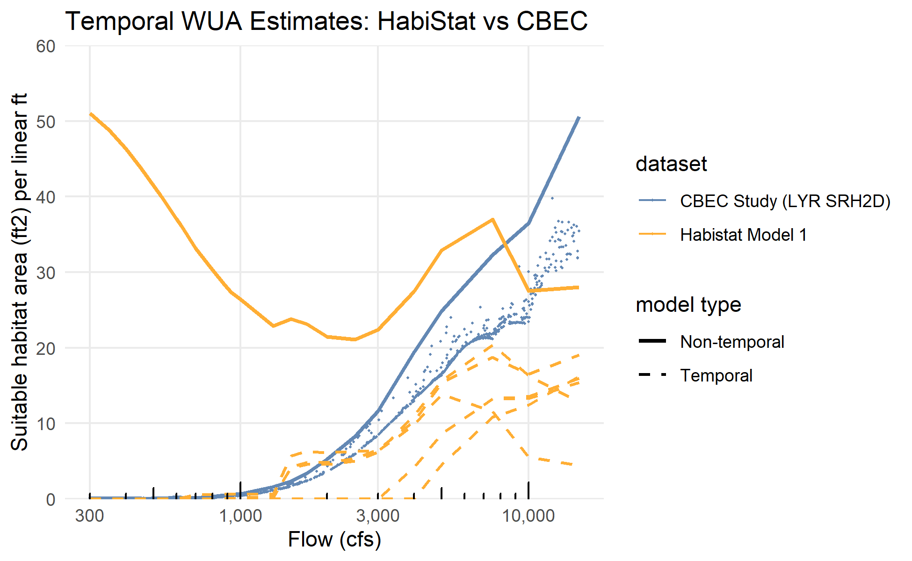<!-- -->
