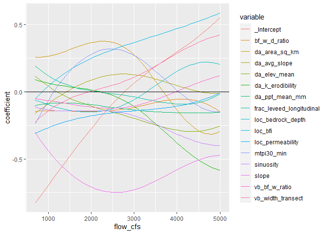
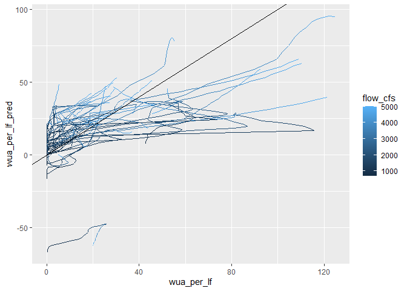
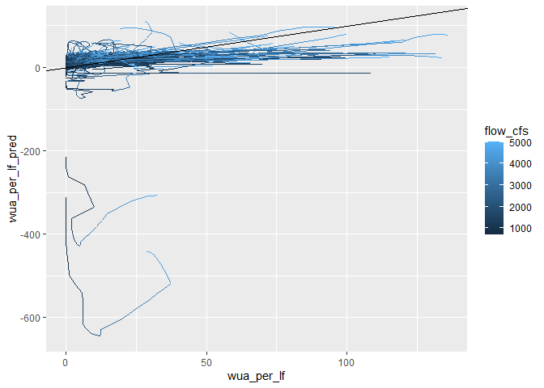

Statistical Modeling to Predict Flow-to-Suitable-Area Curves: Functional
Regression
================
[Skyler Lewis](mailto:slewis@flowwest.com)
2024-05-07

- [Functions for setting up
  matrices](#functions-for-setting-up-matrices)
  - [Setting up the training data](#setting-up-the-training-data)
  - [Fitting the model](#fitting-the-model)
  - [Validation and Prediction](#validation-and-prediction)

Refer to doi.org/10.1111/2041-210X.12290

``` r
library(tidyverse)
library(sf)
library(recipes)
```

Set up FREE package

``` r
#devtools::install_github("jdyen/FREE")

# use forked version fixing compile error
# replaced PI with (2.0 * asin(1.0)) in spline_model_sampler.cpp and spline_update_betas.cpp
# devtools::install(r"(C:\Users\skylerlewis\Github\FREE)")
```

``` r
# import comid attribute training data

flowline_attributes <- 
  readRDS(here::here("data-raw", "results", "flowline_attributes.Rds"))
```

    ## Warning in readRDS(here::here("data-raw", "results",
    ## "flowline_attributes.Rds")): input string 'Ca<bf>on Creek' cannot be translated
    ## to UTF-8, is it valid in 'ASCII'?

    ## Warning in readRDS(here::here("data-raw", "results",
    ## "flowline_attributes.Rds")): input string 'A<bf>o Nuevo Creek' cannot be
    ## translated to UTF-8, is it valid in 'ASCII'?

    ## Warning in readRDS(here::here("data-raw", "results",
    ## "flowline_attributes.Rds")): input string 'Pe<bf>a Creek' cannot be translated
    ## to UTF-8, is it valid in 'ASCII'?

``` r
# import flow-to-suitable-area training data

interp_flows <- seq(700,5000,100)

flow_to_suitable_area <- 
  readRDS(here::here("data-raw", "results", "fsa_combined.Rds")) |>
  group_by(dataset, comid) |>
  complete(flow_cfs = interp_flows) |>
  arrange(dataset, comid, flow_cfs) |>
  mutate(across(c(area_tot_ft2, area_wua_ft2, hsi_frac), function(var) zoo::na.approx(var, x = flow_cfs, na.rm=F))) |>
  filter(flow_cfs %in% interp_flows) |>
  filter(!is.na(hsi_frac)) |>
  inner_join(flowline_attributes |> transmute(comid, length_ft = reach_length_km*3280.84), by=join_by(comid)) |>
  mutate(wua_per_lf = area_wua_ft2 / length_ft) |>
  # filter out comids with outlier WUA/LF
  ungroup() |>
  mutate(outlier_filter = wua_per_lf > (mean(wua_per_lf) + 3 * sd(wua_per_lf))) |>
  group_by(comid) |>
  filter(!any(outlier_filter)) |>
  ungroup()

# Train/test split

comids <- unique(flow_to_suitable_area$comid)
set.seed(47)
idx_train <- runif(length(comids)) > 0.75 # 75% train, 25% test
train_comids <- comids[which(idx_train)]
test_comids <- comids[which(!idx_train)]

flowline_attributes_train = flowline_attributes |> filter(comid %in% train_comids)
flowline_attributes_test = flowline_attributes |> filter(comid %in% test_comids)
flow_to_suitable_area_train = flow_to_suitable_area |> filter(comid %in% train_comids)
flow_to_suitable_area_test = flow_to_suitable_area |> filter(comid %in% test_comids)
```

## Functions for setting up matrices

- Response (y) matrix has rows = comid (“replications”), columns = flow
  (“argvals”)
- Predictor (x) matrix has rows = comid (“replications”), columns =
  predictor variables (“features”)
- Output coefficient matrix will have rows = predictor variables
  (“features”), columns = flow (“argvals”)

``` r
prep_func_reg <- function(df_x, df_y = NULL, ..., # pass predictor variables as tidy eval list
                          .y_var = "wua_per_lf",
                          .arg_var = "flow_cfs",
                          .rep_var = "comid") {
  
  if(!is.null(df_y)) {
    predictor_df <- 
      df_x |>
      filter(!!sym(.rep_var) %in% (df_y |> pull(!!sym(.rep_var))))
  } else {
    predictor_df <- df_x
  }
  
  if(!missing(...)){
    predictor_df <- predictor_df |> select(!!sym(.rep_var), ...) 
  } 
  
  predictor_mat <-
    predictor_df |>
      pivot_longer(cols = -!!sym(.rep_var)) |>
      xtabs(formula = value ~ .) |>
      as("array")
  
  if(!is.null(df_y)) {
    
    response_df <-
      predictor_df |>
      select(!!sym(.rep_var)) |>
      inner_join(df_y |> 
                   select(!!sym(.rep_var), !!sym(.arg_var), !!sym(.y_var)), 
                 by=join_by(!!sym(.rep_var)), relationship="one-to-many") 
    
    response_mat <- 
      response_df |>
      xtabs(formula = as.formula(paste(.y_var, "~ ."))) |>
      as("array")
    
    return(list(y = response_mat, 
                x = predictor_mat,
                arg_vals = as.numeric(colnames(response_mat)),
                x_names = colnames(predictor_mat),
                rep_names = rownames(response_mat)))
    
  } else {
    
        return(list(x = predictor_mat,
                    x_names = colnames(predictor_mat),
                    rep_names = rownames(predictor_mat)))
  }
}

# tidy wrapper
fit_func_reg <- function(data, ...) {
  FREE::FREEfit.default(y = data$y, x = data$x, ...)
}
# usage: 
# prep_func_reg(slope, da_elev_mean) |>
#   fit_func_reg(n.iters = 15)
```

### Setting up the training data

``` r
# Specify variables using recipes for left and right side separately
# We can save muliple of these recipe objects to test different model specifications

lhs <- flow_to_suitable_area |> 
  recipe(vars = c("wua_per_lf", "flow_cfs", "comid")) |>
  #step_mutate_at(wua_per_lf, fn = function(x) asinh(x*10)) |> 
  step_normalize(wua_per_lf, id="normalize_y") |> 
  prep(flow_to_suitable_area_train) 

normalize_parameters <- tidy(lhs, id = "normalize_y") |> select(statistic, value) |> deframe()

rhs <- flowline_attributes |> 
  recipe(comid ~ slope + sinuosity +
                 da_area_sq_km + da_elev_mean + da_ppt_mean_mm +
                 da_k_erodibility + da_avg_slope + 
                 loc_bfi + loc_permeability + loc_bedrock_depth +
                 mtpi30_min + bf_w_d_ratio + vb_bf_w_ratio + vb_width_transect + frac_leveed_longitudinal) |>
  step_mutate_at(all_numeric_predictors(), fn = function(x) asinh(x*10)) |> 
  step_normalize(all_numeric_predictors()) |>
  prep(flowline_attributes_train) 

# Once specified, we "prep" and "bake" the predictor data

train_data <- 
  prep_func_reg(df_x = rhs |> bake(flowline_attributes_train),
                df_y = lhs |> bake(flow_to_suitable_area_train)) |>
  glimpse()
```

    ## List of 5
    ##  $ y        : num [1:44, 1:44] -0.876 -0.876 -0.876 -0.687 -0.874 ...
    ##   ..- attr(*, "dimnames")=List of 2
    ##   .. ..$ comid   : chr [1:44] "2819818" "2819852" "2819858" "2821716" ...
    ##   .. ..$ flow_cfs: chr [1:44] "700" "800" "900" "1000" ...
    ##  $ x        : num [1:44, 1:15] 0.155 0.027 0.151 0.569 -0.455 ...
    ##   ..- attr(*, "dimnames")=List of 2
    ##   .. ..$ comid: chr [1:44] "2819818" "2819852" "2819858" "2821716" ...
    ##   .. ..$ name : chr [1:15] "bf_w_d_ratio" "da_area_sq_km" "da_avg_slope" "da_elev_mean" ...
    ##  $ arg_vals : num [1:44] 700 800 900 1000 1100 1200 1300 1400 1500 1600 ...
    ##  $ x_names  : chr [1:15] "bf_w_d_ratio" "da_area_sq_km" "da_avg_slope" "da_elev_mean" ...
    ##  $ rep_names: chr [1:44] "2819818" "2819852" "2819858" "2821716" ...

Training data is now compiled for 44 flows and 15 predictors across 44
comids.

- Response (y) matrix dimensions: 44 x 44
- Predictor (x) matrix dimensions: 44 x 15

### Fitting the model

``` r
fit <- train_data |>
  fit_func_reg(n.iters=15, degree=3) |>
  glimpse()
```

    ## List of 22
    ##  $ fitted           : num [1:44, 1:44] -1.205 -1.591 -1.07 -1.259 -0.773 ...
    ##  $ fitted.sd        : num [1:44, 1:44] 0.641 1 0.812 1 0.394 ...
    ##  $ observed         : num [1:44, 1:44] -0.876 -0.876 -0.876 -0.687 -0.874 ...
    ##   ..- attr(*, "dimnames")=List of 2
    ##   .. ..$ comid   : chr [1:44] "2819818" "2819852" "2819858" "2821716" ...
    ##   .. ..$ flow_cfs: chr [1:44] "700" "800" "900" "1000" ...
    ##  $ coefs.mean       : num [1:16, 1:44] -0.827 -0.145 0.257 -0.161 0.114 ...
    ##  $ coefs.sd         : num [1:16, 1:44] 0.241 0.265 0.32 0.129 0.217 ...
    ##  $ rand.coefs.mean  :List of 1
    ##   ..$ : num [1, 1:44] 0 0 0 0 0 0 0 0 0 0 ...
    ##  $ rand.coefs.sd    :List of 1
    ##   ..$ : num [1, 1:44] 0 0 0 0 0 0 0 0 0 0 ...
    ##  $ r2               : num 0.502
    ##  $ family           : chr "gaussian"
    ##  $ DIC              : num -34.3
    ##  $ rhats            :List of 7
    ##   ..$ coefs       : num [1:16, 1:44] 1.268 0.979 2.595 1.378 1.012 ...
    ##   ..$ rand.coefs  :List of 1
    ##   .. ..$ : num [1, 1:44] NaN NaN NaN NaN NaN NaN NaN NaN NaN NaN ...
    ##   ..$ gamma       :List of 1
    ##   .. ..$ :List of 1
    ##   ..$ sigma2      : num 1.04
    ##   ..$ beta        :List of 16
    ##   .. ..$ : num [1:8] 1 1.01 1.2 1.16 1.26 ...
    ##   .. ..$ : num [1:8] 1 1.2 1.59 1.13 3.17 ...
    ##   .. ..$ : num [1:8] 1.07 1.14 2.63 2.31 3.16 ...
    ##   .. ..$ : num [1:8] 1.06 1.16 1.73 1.15 3.28 ...
    ##   .. ..$ : num [1:8] 0.977 1.371 1.485 3.135 2.087 ...
    ##   .. ..$ : num [1:8] 1.05 2.5 1.21 4.34 3.51 ...
    ##   .. ..$ : num [1:8] 0.997 1.709 1.064 3.237 2.879 ...
    ##   .. ..$ : num [1:8] 1 1.49 1.58 2.28 3.29 ...
    ##   .. ..$ : num [1:8] 1.03 1.07 1.17 1.46 1.98 ...
    ##   .. ..$ : num [1:8] 1.02 1.69 1.76 3.07 1.82 ...
    ##   .. ..$ : num [1:8] 0.99 1.6 1.03 1.09 1.46 ...
    ##   .. ..$ : num [1:8] 0.98 1.05 1.51 1.8 2.21 ...
    ##   .. ..$ : num [1:8] 0.979 1.062 1.1 1.211 1.151 ...
    ##   .. ..$ : num [1:8] 0.974 1.025 1.645 1.315 2.339 ...
    ##   .. ..$ : num [1:8] 0.986 1.161 1.432 1.571 1.412 ...
    ##   .. ..$ : num [1:8] 1 1.6 1.05 1.9 1.01 ...
    ##   ..$ rho         : num 1.01
    ##   ..$ sigma2_gamma: num 1.03
    ##  $ sigma2.mean      : num 0.0135
    ##  $ sigma2.sd        : num 0.000696
    ##  $ sigma2_gamma.mean: num 3.14
    ##  $ sigma2_gamma.sd  : num 1.84
    ##  $ beta.mean        :List of 16
    ##   ..$ : num [1:8] 0.0695 -1.6963 -0.8517 0.1438 0.4101 ...
    ##   ..$ : num [1:8] -0.2702 -0.2787 -0.0987 -0.199 0.138 ...
    ##   ..$ : num [1:8] 0.325936 0.81196 0.000198 0.726859 -1.016268 ...
    ##   ..$ : num [1:8] -0.4399 -0.8311 -0.0997 0.2616 -0.1603 ...
    ##   ..$ : num [1:8] 0.504 1.0401 -0.0513 -0.1483 -0.4555 ...
    ##   ..$ : num [1:8] -0.3032 0.5791 -0.0332 0.0969 -0.8347 ...
    ##   ..$ : num [1:8] -0.0297 -0.4302 -0.0084 -0.1529 -0.1668 ...
    ##   ..$ : num [1:8] 0.3069 1.2102 -0.0218 0.0225 -0.2477 ...
    ##   ..$ : num [1:8] -0.0535 0.3002 -0.1078 -0.2423 0.568 ...
    ##   ..$ : num [1:8] -0.507 -1.08 0.104 0.361 0.556 ...
    ##   ..$ : num [1:8] 0.111 -0.81 -0.231 -0.133 -0.113 ...
    ##   ..$ : num [1:8] 0.1309 -2.1515 0.0394 0.5633 -0.5276 ...
    ##   ..$ : num [1:8] 0.2535 0.3464 -0.2496 -0.0387 -0.5855 ...
    ##   ..$ : num [1:8] -0.187 1.217 -0.531 -0.911 -0.267 ...
    ##   ..$ : num [1:8] -0.00472 -0.08562 -0.00378 -0.22058 0.20258 ...
    ##   ..$ : num [1:8] 0.83349 -1.36476 0.00771 -0.01262 0.5659 ...
    ##  $ gamma.mean       :List of 1
    ##   ..$ :List of 1
    ##   .. ..$ : num [1:8] 0 0 0 0 0 0 0 0
    ##  $ rho.mean         : num 0.997
    ##  $ rho.sd           : num 0.00652
    ##  $ llik_all         :List of 3
    ##   ..$ : num [1:15] -782 18 892 1394 1492 ...
    ##   ..$ : num [1:15] -559 472 1362 1526 1518 ...
    ##   ..$ : num [1:15] -250 1351 1463 1528 1570 ...
    ##  $ bins             : int [1:44] 1 2 3 4 5 6 7 8 9 10 ...
    ##  $ method           : chr "FREEfixed"
    ##  - attr(*, "class")= chr "FREEfit"

``` r
coefs <- fit$coefs.mean
rownames(coefs) <- c("_Intercept", train_data$x_names)
colnames(coefs) <- train_data$arg_vals

coefs |>
  as_tibble(rownames = "variable") |>
  setNames(c("variable", train_data$arg_vals)) |>
  pivot_longer(-variable, names_to = "flow_cfs", values_to = "coefficient") |>
  mutate(flow_cfs = as.numeric(flow_cfs)) |>
  ggplot() + geom_line(aes(x = flow_cfs, y = coefficient, group = variable, color = variable)) + 
  geom_hline(aes(yintercept = 0)) 
```

<!-- -->

``` r
y_obs <- fit$observed
colnames(y_obs) <- train_data$arg_vals
rownames(y_obs) <- train_data$rep_names
y_obs_tbl <- y_obs |>
  as_tibble(rownames = "comid") |>
  #setNames(c("comid", train_data$arg_vals)) |>
  pivot_longer(-comid, names_to = "flow_cfs", values_to = "wua_per_lf") |>
  mutate(across(c(comid, flow_cfs),as.numeric)) 

y_fit <- fit$fitted
colnames(y_fit) <- train_data$arg_vals
rownames(y_fit) <- train_data$rep_names
y_fit_tbl <- y_fit |>
  as_tibble(rownames = "comid") |>
  #setNames(c("comid", train_data$arg_vals)) |>
  pivot_longer(-comid, names_to = "flow_cfs", values_to = "wua_per_lf_pred") |>
  mutate(across(c(comid, flow_cfs),as.numeric)) 

inner_join(y_obs_tbl, y_fit_tbl, by=join_by(comid, flow_cfs)) |>
  mutate(across(starts_with("wua_per_lf"), function(x) (x*normalize_parameters[["sd"]]) + normalize_parameters[["mean"]])) |>
  mutate(residual = wua_per_lf_pred - wua_per_lf) |>
  arrange(comid, flow_cfs) |>
  ggplot() + geom_path(aes(x = wua_per_lf, y = wua_per_lf_pred, color = flow_cfs, group = comid)) + 
  geom_abline(slope=1, intercept = 0)
```

<!-- -->

Now we have a 16 x 44 coefficient matrix (rows are predictors and the
intercept, columns are flows)

### Validation and Prediction

``` r
predict_func_reg <- function(data, fit) {
  
  coefs <- fit$coefs.mean
  rownames(coefs) <- c("_Intercept", data$x_names)
  colnames(coefs) <- as.numeric(colnames(fit$observed)) #data$arg_vals
  
  result_mat <- cbind(1, data$x) %*% coefs
  return(list("arg_vals" = as.numeric(colnames(fit$observed)),#data$arg_vals,
              x_names = data$x_names,
              rep_names = data$rep_names,
              "predictors" = data$x,
              "coefs" = coefs,
              "predicted" = result_mat))

}

tidy_func_reg <- function(lst,
                          .y_var = "wua_per_lf",
                          .arg_var = "flow_cfs",
                          .rep_var = "comid") {
  cbind(as.numeric(lst$rep_names), lst$predicted) |>
    as_tibble() |>
    setNames(c(.rep_var, lst$arg_vals)) |>
    pivot_longer(-!!sym(.rep_var), names_to = .arg_var, values_to = .y_var) |>
    mutate(across(c(.rep_var, .arg_var), as.numeric)) |>
    rename("{.y_var}_pred" := .y_var)
}
```

``` r
# Set up validation dataset
test_data <- 
  prep_func_reg(df_x = rhs |> bake(flowline_attributes_test),
                df_y = lhs |> bake(flow_to_suitable_area_test)) |>
  glimpse()
```

    ## List of 5
    ##  $ y        : num [1:119, 1:44] -0.865 -0.876 -0.867 -0.876 -0.876 ...
    ##   ..- attr(*, "dimnames")=List of 2
    ##   .. ..$ comid   : chr [1:119] "2819786" "2819788" "2819792" "2819794" ...
    ##   .. ..$ flow_cfs: chr [1:44] "700" "800" "900" "1000" ...
    ##  $ x        : num [1:119, 1:15] 0.37 0.141 0.332 -0.211 0.198 ...
    ##   ..- attr(*, "dimnames")=List of 2
    ##   .. ..$ comid: chr [1:119] "2819786" "2819788" "2819792" "2819794" ...
    ##   .. ..$ name : chr [1:15] "bf_w_d_ratio" "da_area_sq_km" "da_avg_slope" "da_elev_mean" ...
    ##  $ arg_vals : num [1:44] 700 800 900 1000 1100 1200 1300 1400 1500 1600 ...
    ##  $ x_names  : chr [1:15] "bf_w_d_ratio" "da_area_sq_km" "da_avg_slope" "da_elev_mean" ...
    ##  $ rep_names: chr [1:119] "2819786" "2819788" "2819792" "2819794" ...

``` r
# Run the prediction
validation <- test_data |> 
  predict_func_reg(fit) |>
  glimpse()
```

    ## List of 6
    ##  $ arg_vals  : num [1:44] 700 800 900 1000 1100 1200 1300 1400 1500 1600 ...
    ##  $ x_names   : chr [1:15] "bf_w_d_ratio" "da_area_sq_km" "da_avg_slope" "da_elev_mean" ...
    ##  $ rep_names : chr [1:119] "2819786" "2819788" "2819792" "2819794" ...
    ##  $ predictors: num [1:119, 1:15] 0.37 0.141 0.332 -0.211 0.198 ...
    ##   ..- attr(*, "dimnames")=List of 2
    ##   .. ..$ comid: chr [1:119] "2819786" "2819788" "2819792" "2819794" ...
    ##   .. ..$ name : chr [1:15] "bf_w_d_ratio" "da_area_sq_km" "da_avg_slope" "da_elev_mean" ...
    ##  $ coefs     : num [1:16, 1:44] -0.827 -0.145 0.257 -0.161 0.114 ...
    ##   ..- attr(*, "dimnames")=List of 2
    ##   .. ..$ : chr [1:16] "_Intercept" "bf_w_d_ratio" "da_area_sq_km" "da_avg_slope" ...
    ##   .. ..$ : chr [1:44] "700" "800" "900" "1000" ...
    ##  $ predicted : num [1:119, 1:44] -0.984 -0.863 -1.431 -0.67 -1.318 ...
    ##   ..- attr(*, "dimnames")=List of 2
    ##   .. ..$ : chr [1:119] "2819786" "2819788" "2819792" "2819794" ...
    ##   .. ..$ : chr [1:44] "700" "800" "900" "1000" ...

``` r
validation_tbl <- validation |> 
  tidy_func_reg() |>
  mutate(across(starts_with("wua_per_lf"), function(x) (x*normalize_parameters[["sd"]]) + normalize_parameters[["mean"]])) |>
  left_join(flow_to_suitable_area |> 
              select(dataset, comid, flow_cfs, wua_per_lf), 
            by=join_by(comid, flow_cfs)) |>
  glimpse()
```

    ## Warning: The `x` argument of `as_tibble.matrix()` must have unique column names if
    ## `.name_repair` is omitted as of tibble 2.0.0.
    ## ℹ Using compatibility `.name_repair`.
    ## This warning is displayed once every 8 hours.
    ## Call `lifecycle::last_lifecycle_warnings()` to see where this warning was
    ## generated.

    ## Warning: There were 2 warnings in `mutate()`.
    ## The first warning was:
    ## ℹ In argument: `across(c(.rep_var, .arg_var), as.numeric)`.
    ## Caused by warning:
    ## ! Using an external vector in selections was deprecated in tidyselect 1.1.0.
    ## ℹ Please use `all_of()` or `any_of()` instead.
    ##   # Was:
    ##   data %>% select(.rep_var)
    ## 
    ##   # Now:
    ##   data %>% select(all_of(.rep_var))
    ## 
    ## See <https://tidyselect.r-lib.org/reference/faq-external-vector.html>.
    ## ℹ Run `dplyr::last_dplyr_warnings()` to see the 1 remaining warning.

    ## Warning: Using an external vector in selections was deprecated in tidyselect 1.1.0.
    ## ℹ Please use `all_of()` or `any_of()` instead.
    ##   # Was:
    ##   data %>% select(.y_var)
    ## 
    ##   # Now:
    ##   data %>% select(all_of(.y_var))
    ## 
    ## See <https://tidyselect.r-lib.org/reference/faq-external-vector.html>.
    ## This warning is displayed once every 8 hours.
    ## Call `lifecycle::last_lifecycle_warnings()` to see where this warning was
    ## generated.

    ## Rows: 5,236
    ## Columns: 5
    ## $ comid           <dbl> 2819786, 2819786, 2819786, 2819786, 2819786, 2819786, …
    ## $ flow_cfs        <dbl> 700, 800, 900, 1000, 1100, 1200, 1300, 1400, 1500, 160…
    ## $ wua_per_lf_pred <dbl> -2.5178778, -0.9246554, 0.6951638, 2.3363483, 3.993666…
    ## $ dataset         <chr> "Stanislaus River", "Stanislaus River", "Stanislaus Ri…
    ## $ wua_per_lf      <dbl> 0.2549367, 0.8049403, 1.7774791, 2.7500180, 4.4105343,…

``` r
validation_tbl |>
  arrange(comid, flow_cfs) |>
  ggplot() + geom_path(aes(x = wua_per_lf, y = wua_per_lf_pred, color = flow_cfs, group = comid)) + 
  geom_abline(slope=1, intercept = 0)
```

<!-- -->

``` r
# Set up validation dataset
pred_data <- 
  prep_func_reg(df_x = rhs |> bake(flowline_attributes)) |>
  glimpse()
```

    ## List of 3
    ##  $ x        : num [1:178868, 1:15] -2.18 -6.76 -7.21 -3.08 -3.05 ...
    ##   ..- attr(*, "dimnames")=List of 2
    ##   .. ..$ comid: chr [1:178868] "341095" "341097" "341099" "341101" ...
    ##   .. ..$ name : chr [1:15] "bf_w_d_ratio" "da_area_sq_km" "da_avg_slope" "da_elev_mean" ...
    ##  $ x_names  : chr [1:15] "bf_w_d_ratio" "da_area_sq_km" "da_avg_slope" "da_elev_mean" ...
    ##  $ rep_names: chr [1:178868] "341095" "341097" "341099" "341101" ...

``` r
# Run the prediction
prediction <- pred_data |> 
  predict_func_reg(fit) |>
  glimpse()
```

    ## List of 6
    ##  $ arg_vals  : num [1:44] 700 800 900 1000 1100 1200 1300 1400 1500 1600 ...
    ##  $ x_names   : chr [1:15] "bf_w_d_ratio" "da_area_sq_km" "da_avg_slope" "da_elev_mean" ...
    ##  $ rep_names : chr [1:178868] "341095" "341097" "341099" "341101" ...
    ##  $ predictors: num [1:178868, 1:15] -2.18 -6.76 -7.21 -3.08 -3.05 ...
    ##   ..- attr(*, "dimnames")=List of 2
    ##   .. ..$ comid: chr [1:178868] "341095" "341097" "341099" "341101" ...
    ##   .. ..$ name : chr [1:15] "bf_w_d_ratio" "da_area_sq_km" "da_avg_slope" "da_elev_mean" ...
    ##  $ coefs     : num [1:16, 1:44] -0.827 -0.145 0.257 -0.161 0.114 ...
    ##   ..- attr(*, "dimnames")=List of 2
    ##   .. ..$ : chr [1:16] "_Intercept" "bf_w_d_ratio" "da_area_sq_km" "da_avg_slope" ...
    ##   .. ..$ : chr [1:44] "700" "800" "900" "1000" ...
    ##  $ predicted : num [1:178868, 1:44] -5.28 -1.44 -1.75 -10.24 -9.71 ...
    ##   ..- attr(*, "dimnames")=List of 2
    ##   .. ..$ : chr [1:178868] "341095" "341097" "341099" "341101" ...
    ##   .. ..$ : chr [1:44] "700" "800" "900" "1000" ...

``` r
predicted_tbl <- prediction |> 
  tidy_func_reg() |>
  mutate(across(starts_with("wua_per_lf"), function(x) (x*normalize_parameters[["sd"]]) + normalize_parameters[["mean"]])) |>
  glimpse()
```

    ## Rows: 7,870,192
    ## Columns: 3
    ## $ comid           <dbl> 341095, 341095, 341095, 341095, 341095, 341095, 341095…
    ## $ flow_cfs        <dbl> 700, 800, 900, 1000, 1100, 1200, 1300, 1400, 1500, 160…
    ## $ wua_per_lf_pred <dbl> -102.50188, -108.43649, -114.30443, -120.03980, -125.5…
