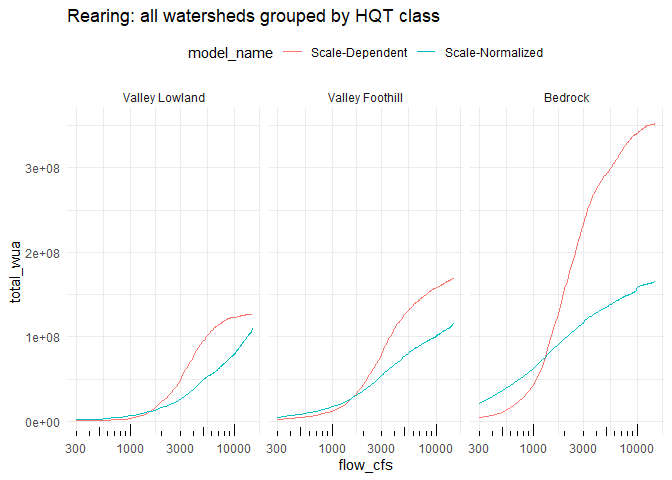
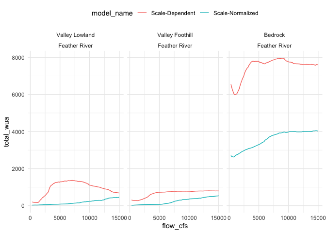
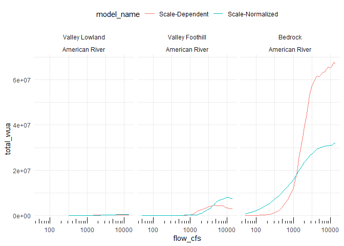
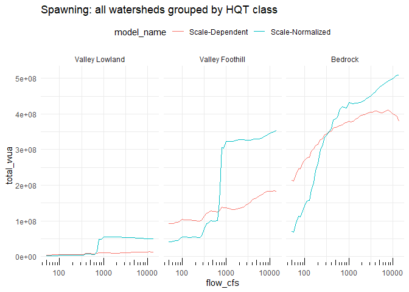
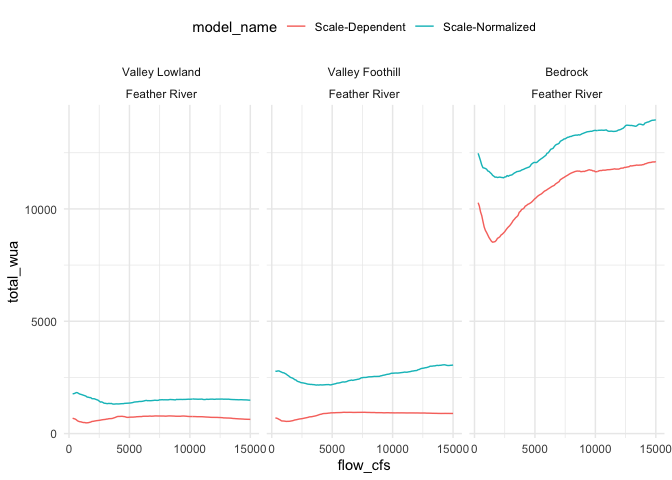
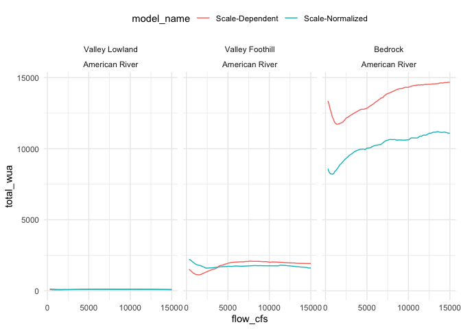

Model Comparison
================
Maddee Rubenson (FlowWest)
2024-08-27

The purpose of this markdown is to explore the different model methods
and how they impact reaches differently through exploring model outputs
at different geographic scales.

**Model types:**

- Scale Dependent: non-normalized - this is the WUA (sq feet/linear
  foot) vs. flow

- Scale Normalized: normalized - this is WUA (sq feet/linear foot)
  (normalized) vs. flow (normalized)

``` r
# load the data

wuas <- habistat::wua_predicted

hqt_gradient_class <- readRDS(here::here("data-raw", "results", "hqt_gradient_class.Rds"))

hqt_cls <- habistat::flowline_geom |>
  st_zm() |>
  st_transform("ESRI:102039") |> 
  st_point_on_surface() |>
  st_join(hqt_gradient_class) |>
  st_drop_geometry() |> 
  select(comid, hqt_gradient_class) |> 
  mutate(hqt_gradient_class = coalesce(hqt_gradient_class, "Bedrock"),
         hqt_gradient_class = factor(hqt_gradient_class, levels=c("Valley Lowland", "Valley Foothill", "Bedrock"))) 

wuas_merge <- wuas |> left_join(hqt_cls) |> glimpse()
```

    ## Rows: 4,987,896
    ## Columns: 10
    ## $ comid              <dbl> 342517, 342517, 342517, 342517, 342517, 342517, 342…
    ## $ model_bfc          <lgl> FALSE, FALSE, FALSE, FALSE, FALSE, FALSE, FALSE, FA…
    ## $ model_name         <fct> SD, SD, SD, SD, SD, SD, SD, SD, SD, SD, SD, SD, SD,…
    ## $ flow_cfs           <dbl> 300, 400, 500, 600, 700, 800, 900, 1000, 1100, 1200…
    ## $ wua_per_lf_pred    <dbl> 0.1509557, 0.3060996, 0.4994948, 0.9621796, 1.32640…
    ## $ river_cvpia        <fct> NA, NA, NA, NA, NA, NA, NA, NA, NA, NA, NA, NA, NA,…
    ## $ watershed_level_3  <fct> Stanislaus River, Stanislaus River, Stanislaus Rive…
    ## $ reach_length_ft    <dbl> 2926.509, 2926.509, 2926.509, 2926.509, 2926.509, 2…
    ## $ habitat            <chr> "rearing", "rearing", "rearing", "rearing", "rearin…
    ## $ hqt_gradient_class <fct> Bedrock, Bedrock, Bedrock, Bedrock, Bedrock, Bedroc…

Explore the WUAs but different groups

## Rearing:

``` r
# SD = scale dependent
# SN = scale normalized
# TODO: i want no post-hoc baseflow removal, is this logic correct?
rearing_wua_grouped <- wuas_merge |> 
  filter(model_bfc == TRUE,
         habitat == "rearing") |> 
  mutate(model_name = case_when(model_name == "SD" ~ "Scale-Dependent",
                                model_name == "SN" ~ "Scale-Normalized")) |> 
  group_by(model_name, flow_cfs, watershed_level_3, habitat, hqt_gradient_class) |> 
  summarise(total_wua = sum(wua_per_lf_pred))
```

    ## `summarise()` has grouped output by 'model_name', 'flow_cfs',
    ## 'watershed_level_3', 'habitat'. You can override using the `.groups` argument.

``` r
rearing_wua_grouped |> 
  filter(watershed_level_3 %in% c("Feather River")) |> 
  ggplot() + 
  geom_line(aes(x = flow_cfs, y = total_wua, color = model_name)) +
  theme(legend.position = "top")+
  facet_wrap(~hqt_gradient_class + watershed_level_3)
```

<!-- -->

``` r
rearing_wua_grouped |> 
  filter(watershed_level_3 %in% c("American River")) |> 
  ggplot() + 
  geom_line(aes(x = flow_cfs, y = total_wua, color = model_name)) +
  theme(legend.position = "top")+
  facet_wrap(~hqt_gradient_class + watershed_level_3)
```

<!-- -->

``` r
rearing_wua_grouped |> 
  filter(watershed_level_3 %in% c("Battle Creek")) |> 
  ggplot() + 
  geom_line(aes(x = flow_cfs, y = total_wua, color = model_name)) +
  theme(legend.position = "top")+
  facet_wrap(~hqt_gradient_class + watershed_level_3)
```

<!-- -->

## Spawning:

``` r
# SD = scale dependent
# SN = scale normalized
# TODO: i want no post-hoc baseflow removal, is this logic correct?
spawning_wua_grouped <- wuas_merge |> 
  filter(model_bfc == TRUE,
         habitat == "spawning") |> 
  mutate(model_name = case_when(model_name == "SD" ~ "Scale-Dependent",
                                model_name == "SN" ~ "Scale-Normalized")) |> 
  group_by(model_name, flow_cfs, watershed_level_3, habitat, hqt_gradient_class) |> 
  summarise(total_wua = sum(wua_per_lf_pred))
```

    ## `summarise()` has grouped output by 'model_name', 'flow_cfs',
    ## 'watershed_level_3', 'habitat'. You can override using the `.groups` argument.

``` r
spawning_wua_grouped |> 
  filter(watershed_level_3 %in% c("Feather River")) |> 
  ggplot() + 
  geom_line(aes(x = flow_cfs, y = total_wua, color = model_name)) +
  theme(legend.position = "top")+
  facet_wrap(~hqt_gradient_class + watershed_level_3)
```

<!-- -->

``` r
spawning_wua_grouped |> 
  filter(watershed_level_3 %in% c("American River")) |> 
  ggplot() + 
  geom_line(aes(x = flow_cfs, y = total_wua, color = model_name)) +
  theme(legend.position = "top")+
  facet_wrap(~hqt_gradient_class + watershed_level_3)
```

<!-- -->

``` r
spawning_wua_grouped |> 
  filter(watershed_level_3 %in% c("Battle Creek")) |> 
  ggplot() + 
  geom_line(aes(x = flow_cfs, y = total_wua, color = model_name)) +
  theme(legend.position = "top")+
  facet_wrap(~hqt_gradient_class + watershed_level_3)
```

<!-- -->
