Statistical Modeling to Predict Flow-to-Suitable-Area Curves
================
[Skyler Lewis](mailto:slewis@flowwest.com)
2024-09-20

- [Import Training Data](#import-training-data)
- [Preprocess Training Data](#preprocess-training-data)
  - [Join predictor variables to habitat training
    data](#join-predictor-variables-to-habitat-training-data)
  - [Create nested training dataset](#create-nested-training-dataset)
- [Feature Selection](#feature-selection)
  - [Look at training data](#look-at-training-data)
  - [Create combinations of
    variables](#create-combinations-of-variables)
  - [Leave-One-Out to optimize feature
    selection](#leave-one-out-to-optimize-feature-selection)
  - [RMSE](#rmse)
- [Model Fit with Cross-Validation
  (old)](#model-fit-with-cross-validation-old)
  - [RMSE](#rmse-1)
- [Predictions](#predictions)
  - [Prediction dataset](#prediction-dataset)
  - [Run prediction routine](#run-prediction-routine)
  - [Flow range filter](#flow-range-filter)
  - [Rearing](#rearing)
  - [Spawning](#spawning)
  - [DSMHabitat comparison](#dsmhabitat-comparison)
  - [Combine the outputs](#combine-the-outputs)

``` r
library(tidyverse)
library(sf)
library(stars)
library(tidymodels)
library(patchwork)

library(habistat) 

knitr::opts_chunk$set(eval=TRUE, fig.width=6.5, fig.height=4, dpi=300)
theme_set(theme_minimal())

palette_dsmhabitat_comparison <- 
  c("habistat prediction" = "#ffae34", 
    "DSMhabitat instream" = "#6388b4",
    "DSMhabitat floodplain" = "#8cc2ca")

palette_hqt_gradient_class <- 
  c("Valley Lowland"  = "#6388b4", #hex_color_blend("#6388b4","#55ad89"),
    "Valley Foothill" = "#55ad89", #hex_color_blend("#55ad89","#c3bc3f"),
    "Bedrock"         = "#bb7693") #hex_color_blend("#c3bc3f","#ffae34"))
```

## Import Training Data

``` r
wua_hydraulic_rearing_bfc_removed <- 
  bind_rows(.id = "dataset",
    # VECTOR SRH-2D MODELS
    "Lower Yuba River" = 
      readRDS(here::here("data-raw", "results", "fsa_yuba_nbfc.Rds")) |> select(-reach),
    "Stanislaus River" = 
      readRDS(here::here("data-raw", "results", "fsa_stan_nbfc.Rds")),
    # RASTER HEC-RAS 2D MODELS
    "Deer Creek" = 
      readRDS(here::here("data-raw", "results", "fsa_deer_nbfc.Rds")),
    "Tuolumne River (Basso-La Grange)" = 
      readRDS(here::here("data-raw", "results", "fsa_basso_nbfc.Rds")),
    "Mokelumne River" = 
      readRDS(here::here("data-raw", "results", "fsa_moke_nbfc.Rds")),
    )

wua_hydraulic_rearing_bfc_removed |> saveRDS(here::here("data-raw", "results", "fsa_combined_nbfc.Rds"))

wua_hydraulic_spawning <- 
  bind_rows(.id = "dataset",
    # VECTOR SRH-2D MODELS
    "Lower Yuba River" = 
      readRDS(here::here("data-raw", "results", "fsa_yuba_spawning.Rds")) |> select(-reach),
    "Stanislaus River" = 
      readRDS(here::here("data-raw", "results", "fsa_stan_spawning.Rds")),
    # RASTER HEC-RAS 2D MODELS
    "Deer Creek" = 
      readRDS(here::here("data-raw", "results", "fsa_deer_spawning.Rds")),
    "Tuolumne River (Basso-La Grange)" = 
      readRDS(here::here("data-raw", "results", "fsa_basso_spawning.Rds")),
    "Mokelumne River" = 
      readRDS(here::here("data-raw", "results", "fsa_moke_spawning.Rds")),
    )

wua_hydraulic_spawning |> saveRDS(here::here("data-raw", "results", "fsa_combined_spawning.Rds"))

# bfc attribute indicates whether the data *has* the baseflow channel
wua_hydraulic <- 
  bind_rows(wua_hydraulic_rearing_bfc_removed |> mutate(bfc = FALSE, habitat = "rearing"),
            wua_hydraulic_spawning |> mutate(bfc = TRUE, habitat = "spawning")) |>
  mutate(habitat = as_factor(habitat))

# ensure no duplicates
wua_hydraulic <- 
  wua_hydraulic |> 
  group_by(comid, flow_cfs, bfc, habitat) |> 
    filter(row_number() == 1) |>
    ungroup()

wua_hydraulic |> usethis::use_data(overwrite = TRUE)
```

## Preprocess Training Data

Limit to a specified flow range and interpolate gaps

``` r
#interp_flows <- seq(300,15000,100)
#interp_flows <- c(oom_range(100, 10000), 15000)
interp_flows <- seq_log10(50, 15000, 0.05, snap=100)
print(interp_flows |> round(-1) |> signif(2))
```

    ##  [1]    50    60    60    70    80    90   100   110   130   140   160   180
    ## [13]   200   220   250   280   320   350   400   450   500   560   630   710
    ## [25]   790   890  1000  1100  1300  1400  1600  1800  2000  2200  2500  2800
    ## [37]  3200  3600  4000  4500  5000  5600  6300  7100  7900  8900 10000 11000
    ## [49] 13000 14000

``` r
flow_to_suitable_area <- 
  wua_hydraulic |>
  group_by(habitat, bfc, dataset, comid, length_ft) |>
  complete(flow_cfs = interp_flows) |>
  arrange(habitat, bfc, dataset, comid, flow_cfs, length_ft) |>
  mutate(across(c(area_tot, area_wua, area_pct, wua_per_lf, ind_per_lf), 
                function(var) zoo::na.approx(var, x = flow_cfs, na.rm=F))) |>
  filter(flow_cfs %in% interp_flows) |>
  filter(!is.na(area_pct)) |>
  ungroup()

wua_hydraulic_interp <- flow_to_suitable_area
usethis::use_data(wua_hydraulic_interp, overwrite=T)
```

    ## ✔ Saving "wua_hydraulic_interp" to "data/wua_hydraulic_interp.rda".

    ## ☐ Document your data (see <https://r-pkgs.org/data.html>).

### Join predictor variables to habitat training data

Reassign Deer Creek COMIDs to account for incorrect divergence routing

- actual main flowline 12069384 becomes official mainstem 12069382
- actual main flowline 12075398 becomes official mainstem 12075396
- Reach characteristics including length should come from actual main
  flowline
- Drainage area characteristics incl. the drainage area scalar should
  come from official mainstem

``` r
flowline_attr_mod <- habistat::flowline_attr |>
  mutate(across(c(starts_with("da_"), stream_level, starts_with("vogel"), starts_with("erom"), starts_with("chan_width"), velocity_m_s, wetted_perimeter_m, hydraulic_radius_m, critical_shields_number, shear_velocity_cm_s, settling_velocity_ndim, starts_with("grain_size")), function(x) {
                case_when(comid == 12069384 ~ with(habistat::flowline_attr, x[[which(comid == 12069382)]]),
                          comid == 12075398 ~ with(habistat::flowline_attr, x[[which(comid == 12075396)]]),
                          TRUE ~ x)})) 
```

Combine training dataset, selecting the variables we will be using

``` r
model_data_flat <- flowline_attr_mod |>
  filter(comid %in% habistat::flowline_geom$comid) |>
  inner_join(flow_to_suitable_area, by=join_by("comid"), relationship="one-to-many") |>
  mutate(case_wt = hardhat::importance_weights(length_ft)) |>
  transmute(dataset, comid, 
            flow_idx = as.integer(flow_cfs),
            length_ft, case_wt, flow_cfs, wua_per_lf,
            flow_norm_cfs = flow_cfs / da_scalar_maf, # flow as a percent of mean annual flow
            ihs_wua_per_lf = semiIHS00(wua_per_lf), # inverse hyperbolic sine as alternative to log that can handle zeros
            wua_per_lf_norm = wua_per_lf / da_scalar_maf,
            ihs_wua_per_lf_norm = semiIHS00(wua_per_lf_norm), # transect-wise habitat area per linear foot
            tot_area_per_lf = area_tot / length_ft,
            ihs_tot_area_per_lf = semiIHS00(tot_area_per_lf),
            strata = paste(hyd_cls, dataset),
            # predictors of flow (as would be found in a regional regression)
            slope, da_area_sq_km, da_elev_mean, da_ppt_mean_mm, 
            slope_x_da_area_sq_km = slope * da_area_sq_km,
            # flow and channel characteristics, hydrologically predicted
            bf_depth_m, bf_w_d_ratio, # erom_v_ma_fps,
            # misc characteristics of the catchment
            da_avg_slope, da_k_erodibility, mean_ndvi,
            # misc characteristics of the locality
            loc_bfi, loc_pct_clay, loc_pct_sand, loc_permeability, loc_bedrock_depth, loc_ppt_mean_mm,
            # channel confinement characteristics
            mtpi30_min, vb_width_transect, vb_bf_w_ratio, frac_leveed_longitudinal,
            # channel sinuosity
            sinuosity,
            # divergence ratio
            divergence_ratio,
            # fixed effects
            hqt_gradient_class=droplevels(hqt_gradient_class), hyd_cls=droplevels(hyd_cls),
            # auxiliary
            da_scalar_maf, model_bfc = bfc, model_hab = habitat) |> 
  drop_na()
```

### Create nested training dataset

``` r
model_data <- 
  model_data_flat |>
  # CREATE NESTED TRAINING DATASET DATA FRAMES ---------------------------------
  nest(.by = c(model_bfc, model_hab), .key = "td") |> # NOW NEED TO ADD HABITAT EVERY TIME WE GROUP BY 
  # SPLIT TRAINING AND TESTING DATA --------------------------------------------
  mutate(tts = map(td, function(x) {
         set.seed(47)
         tts <- group_initial_split(x, strata=strata, group=comid)
         return(list(in_ids = tts$in_id, training = training(tts), testing = testing(tts)))
         }),
         td = pmap(list(td, tts), function(x, y) x |> mutate(training_sample = row_number() %in% y$in_ids))) |>
  unnest_wider(tts) |>
  # EXPAND TO COVER EACH COMBINATION OF SPECS AND MODEL TYPES ------------------
  expand_grid(#"model_variant" = c("SD0", "SD1", "SD2", "SN0", "SN1", "SN2"),
              "model_name" = c("SD", "SN"),
              "model_type" = c("LM", "RF")) |>
              #"model_type" = c("LM", "RF", "ML")) |>
  #mutate(model_name = substr(model_variant, 1, 2)) |> # SD or SN
  # mutate(across(c(model_variant, model_type, model_name), as_factor)) |> # for storage efficiency
  mutate(across(c(model_type, model_name), as_factor)) |> # for storage efficiency
  glimpse()
```

    ## Rows: 8
    ## Columns: 8
    ## $ model_bfc  <lgl> FALSE, FALSE, FALSE, FALSE, TRUE, TRUE, TRUE, TRUE
    ## $ model_hab  <fct> rearing, rearing, rearing, rearing, spawning, spawning, spa…
    ## $ td         <list> [<tbl_df[5937 x 40]>], [<tbl_df[5937 x 40]>], [<tbl_df[5937…
    ## $ in_ids     <list> <1, 2, 3, 4, 5, 6, 7, 8, 9, 10, 11, 12, 13, 14, 15, 16, 17…
    ## $ training   <list> [<tbl_df[5590 x 39]>], [<tbl_df[5590 x 39]>], [<tbl_df[559…
    ## $ testing    <list> [<tbl_df[1229 x 39]>], [<tbl_df[1229 x 39]>], [<tbl_df[122…
    ## $ model_name <fct> SD, SD, SN, SN, SD, SD, SN, SN
    ## $ model_type <fct> LM, RF, LM, RF, LM, RF, LM, RF

## Feature Selection

### Look at training data

``` r
plots <- names(model_data_flat) |> lapply(function(x) {
  if (inherits(model_data_flat[[x]], "character") | inherits(model_data_flat[[x]], "factor")) {
    g <- ggplot() + 
      geom_histogram(aes(y = after_stat(count / sum(count)),
                         x = model_data_flat[[x]]), stat = "count") +
      xlab(x) + 
      ggtitle(x) +
      scale_y_continuous(name = "", labels = scales::percent)
  }
  else if (inherits(model_data_flat[[x]], "numeric")) {
    g <- ggplot() + 
      geom_histogram(aes(y = after_stat(count / sum(count)),
                         x = model_data_flat[[x]]), bins = 30) +
      xlab(x) + 
      ggtitle(x) +
      scale_y_continuous(name = "", labels = scales::percent)
    
    if (!(str_detect(x, "_pct_") | str_detect(x, "_ratio") | str_detect(x, "frac_") | str_detect(x, "ihs_"))) {
      g <- g + scale_x_continuous(transform = habistat::trans_semiIHS)
    }
  } else {
    g <- ggplot() + ggtitle(x)
  }
  return(g + theme(panel.grid.minor = element_blank()))
})
```

    ## Warning in geom_histogram(aes(y = after_stat(count/sum(count)), x = model_data_flat[[x]]), : Ignoring unknown parameters: `binwidth`, `bins`, and `pad`
    ## Ignoring unknown parameters: `binwidth`, `bins`, and `pad`
    ## Ignoring unknown parameters: `binwidth`, `bins`, and `pad`
    ## Ignoring unknown parameters: `binwidth`, `bins`, and `pad`
    ## Ignoring unknown parameters: `binwidth`, `bins`, and `pad`

``` r
wrap_plots(plots, ncol=4)
```

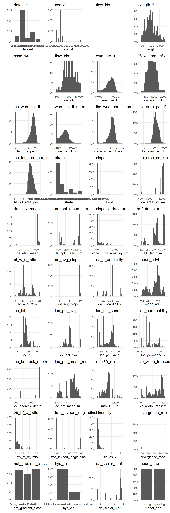<!-- -->

### Create combinations of variables

``` r
model_vars_base_SD <- c("flow_idx" = "identifier",
                        "comid" = "identifier",
                        "ihs_wua_per_lf" = "outcome",
                        "case_wt" = "case_weights",
                        "flow_cfs" = "predictor") |> enframe(name = "var", value = "role")

model_vars_base_SN <- c("flow_idx" = "identifier",
                        "comid" = "identifier",
                        "ihs_wua_per_lf_norm" = "outcome",
                        "case_wt" = "case_weights",
                        "da_scalar_maf" = "scalar",
                        "flow_norm_cfs" = "predictor") |> enframe(name = "var", value = "role")

model_vars_predictors_all <- tibble(var = c("slope", "sinuosity",
                                        "bf_w_d_ratio",
                                        "da_k_erodibility", "da_avg_slope", "mean_ndvi",
                                        "loc_bfi" , "loc_pct_clay" , "loc_pct_sand" , "loc_permeability" , "loc_bedrock_depth" , "loc_ppt_mean_mm",
                                        "mtpi30_min" , "vb_bf_w_ratio" , "frac_leveed_longitudinal", "divergence_ratio"), role = "predictor")

model_vars_predictors_SD <- tibble(var = c("da_area_sq_km", "da_elev_mean", "da_ppt_mean_mm", 
                                           "bf_depth_m", "vb_width_transect", "slope_x_da_area_sq_km"), role = "predictor")

basevars <- list(SD = model_vars_base_SD |> deframe(),
                 SN = model_vars_base_SN |> deframe())

predvars <- list(SD = bind_rows(model_vars_predictors_all, model_vars_predictors_SD) |> deframe(),
                 SN = bind_rows(model_vars_predictors_all) |> deframe())

all_combinations <- function(x) flatten(lapply(seq(length(x)), function(m) combn(x, m, simplify = F)))
combn <- all_combinations(model_vars_predictors_all$var)
length(combn) # too many combinations to test...
```

    ## [1] 65535

``` r
leave_one_out <- function(x) {
  idx <- seq(length(x))
  names(idx) <- x
  result <- lapply(idx, function(i) x[-i])
  return(c(result, list("all"=x)))
}

model_vars_roles <- 
  bind_rows(SD = bind_rows(model_vars_predictors_all, model_vars_predictors_SD)$var |> 
            leave_one_out() |> 
            enframe(name = "model_loo", value = "predictors"),
          SN = bind_rows(model_vars_predictors_all)$var |> 
            leave_one_out() |> 
            enframe(name = "model_loo", value = "predictors"),
          .id = "model_name") |>
  mutate(model_vars_roles = map2(model_name, predictors, function(x, y) c(basevars[[x]], predvars[[x]][which(names(predvars[[x]]) %in% y)]))) |>
  select(-predictors) 
```

### Leave-One-Out to optimize feature selection

``` r
model_data_loo <-
  model_data |> 
  inner_join(model_vars_roles, by=join_by(model_name), relationship="many-to-many")

if(!file.exists(here::here("data-raw", "temp", "model_result_loo.Rds"))) {

model_result_loo <- 
  model_data_loo |>
  # DEFINE MODEL TRANSFORMATIONS AND INTERACTIONS ------------------------------
  mutate(model_recipe = pmap(list(training, model_name, model_vars_roles), 
                             function(d, n, v) {
                               vars <- names(v)
                               roles <- v
    if(n == "SD") {
      recipe(x = d, vars = vars, roles = roles) |>
      step_mutate_at(all_numeric_predictors(), -contains("_pct_"), -contains("_ratio"), -contains("frac_"), fn = semiIHS00) |>
      step_mutate_at(contains("_pct"), fn = function(x) x / 100) |>
      step_interact(terms = ~ flow_cfs:all_predictors()) |>
      step_naomit(all_predictors()) |>
      step_zv(all_predictors()) |>
      step_normalize(all_numeric_predictors(), -contains("_pct_"), -contains("_ratio"), -contains("frac_")) 
    } else if(n == "SN") {
      recipe(x = d, vars = vars, roles = roles) |>
      step_mutate_at(all_numeric_predictors(), -contains("_pct_"), -contains("_ratio"), -contains("frac_"), fn = semiIHS00) |>
      step_mutate_at(contains("_pct"), fn = function(x) x / 100) |>
      step_interact(terms = ~ flow_norm_cfs:all_predictors()) |>
      step_naomit(all_predictors()) |>
      step_zv(all_predictors()) |>
      step_normalize(all_numeric_predictors(), -contains("_pct_"), -contains("_ratio"), -contains("frac_")) 
    }
  })) |>
      # FIT MODEL: LINEAR OR RANDOM FOREST -----------------------
  mutate(model_wkfl = pmap(list(training, model_recipe, model_type), 
                               function(d, rec, typ) {
                               message(paste("model parameterization", typ))
    if (typ == "LM") {
      
      spec <- linear_reg()
      
      return(workflow() |>
        add_recipe(rec) |>
        add_model(spec) |>
        add_case_weights(case_wt))
    
    } else if(typ == "RF") {
      
      spec <- rand_forest(mode = "regression", 
                  trees = 2^8, 
                  mtry = floor((length(rec$var_info$variable) - 2) / 3), 
                  min_n = 2^3) |> 
        set_engine("ranger", num.threads = 8, keep.inbag = T)
      
      wkfl <- workflow() |>
        add_recipe(rec) |>
        add_model(spec) |>
        add_case_weights(case_wt) 
      
      return(wkfl)      
     }
  })) |>
  mutate(model_fit = pmap(list(training, model_wkfl, model_type), 
                               function(d, wkfl, typ) {
                               message(paste("model fit", typ))
                                 wkfl |> fit(data = d)
                               })) |>
  # PREDICT FOR TRAINING AND TESTING DATASET -----------------------------------
  mutate(model_res = pmap(list(td, model_name, model_fit),
                             function(d, n, m) {
                               message(paste("prediction", n))
      if(n == "SD") { 
        d |>
        transmute(comid, flow_idx, flow_cfs, training_sample,
                  # actuals
                  ihs_wua_per_lf,
                  wua_per_lf,
                  # predicted
                  ihs_wua_per_lf_pred = predict(m, d)[[".pred"]],
                  wua_per_lf_pred = semiIHS00_inv(ihs_wua_per_lf_pred))
      } else if(n == "SN") {
        d |>
        transmute(comid, flow_idx, flow_cfs, flow_norm_cfs, da_scalar_maf, training_sample,
                  # actuals
                  ihs_wua_per_lf_norm,
                  wua_per_lf_norm = semiIHS00_inv(ihs_wua_per_lf_norm), 
                  wua_per_lf = wua_per_lf_norm * da_scalar_maf,
                  # predicted
                  ihs_wua_per_lf_norm_pred = predict(m, d)[[".pred"]],
                  wua_per_lf_norm_pred = semiIHS00_inv(ihs_wua_per_lf_norm_pred),
                  wua_per_lf_pred = wua_per_lf_norm_pred * da_scalar_maf)
      }}))

model_result_loo |> saveRDS(here::here("data-raw", "temp", "model_result_loo.Rds"))

} else {
  
model_result_loo <- readRDS(here::here("data-raw", "temp", "model_result_loo.Rds"))
  
}
```

### RMSE

``` r
model_rmse_loo <- 
  model_result_loo |>
  select(model_hab, model_name, model_loo, model_type, model_res) |>
  unnest(model_res) |>
  select(model_hab, model_name, model_loo, model_type, training_sample, comid, flow_cfs, wua_per_lf, wua_per_lf_pred) |>
  mutate(delta = wua_per_lf_pred - wua_per_lf,
         train_test = if_else(training_sample, "train", "test")) |>
  # calculate RMSE
  group_by(train_test, model_hab, model_name, model_loo, model_type) |>
  summarize(rmse = sqrt(mean((wua_per_lf_pred - wua_per_lf)^2))) |>
  ungroup() |>
  pivot_wider(names_from = train_test, values_from = rmse, names_glue = "{.value}_{train_test}") |>
  mutate(rmse_infl = (rmse_test / rmse_train))
```

    ## `summarise()` has grouped output by 'train_test', 'model_hab', 'model_name',
    ## 'model_loo'. You can override using the `.groups` argument.

``` r
model_rmse_loo_summary <- filter(model_rmse_loo, model_loo == "all") |>
  rename_with(~str_c("included_", .), starts_with("rmse_")) |>
  select(-model_loo) |>
  inner_join(filter(model_rmse_loo, model_loo != "all"), relationship = "one-to-many") |>
  mutate(delta_rmse_train = rmse_train - included_rmse_train,
         delta_rmse_test = rmse_test - included_rmse_test) 
```

    ## Joining with `by = join_by(model_hab, model_name, model_type)`

``` r
# delta_rmse_test is [error WITHOUT variable] minus [error WITH variable]
# positive value indicates that error WITHOUT variable is higher (i.e. variable helps model)
# negative value indicates that error WITH variable is higher (i.e. variable hurts model)
 
model_rmse_loo_summary |>
  mutate(label = paste(model_hab, model_type, model_name)) |>
  filter(model_type == "RF") |>
  group_by(model_hab, model_type, model_name) |>
  mutate(rank = rank(-delta_rmse_test, ties.method = "first")) |>
  ggplot(aes(x = rank, y = delta_rmse_test, color = delta_rmse_test>0)) + 
  geom_point() +
  #ggrepel::geom_text_repel(aes(label = model_loo), size = 8/.pt) +
  geom_hline(aes(yintercept = 0)) + 
  facet_wrap(~label)
```

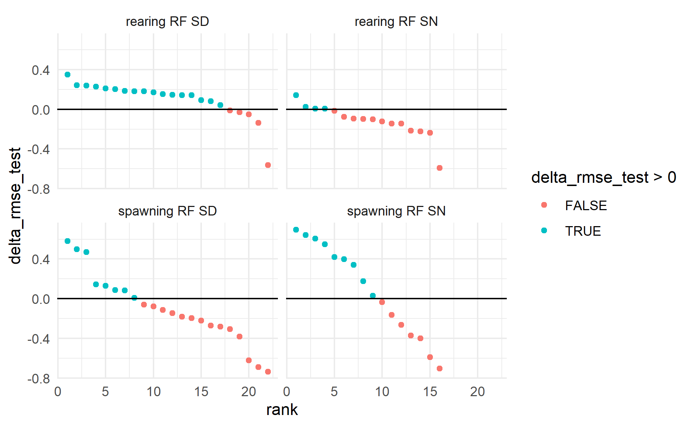<!-- -->

``` r
selected_pred_vars <- 
  model_rmse_loo_summary |> 
  filter(delta_rmse_test > 0) |> # select only those vars that improve the model
  group_by(model_hab, model_type, model_name) |>
  summarize(selected_predictors = list(unique(model_loo))) |>
  glimpse()
```

    ## `summarise()` has grouped output by 'model_hab', 'model_type'. You can override
    ## using the `.groups` argument.

    ## Rows: 8
    ## Columns: 4
    ## Groups: model_hab, model_type [4]
    ## $ model_hab           <fct> rearing, rearing, rearing, rearing, spawning, spaw…
    ## $ model_type          <fct> LM, LM, RF, RF, LM, LM, RF, RF
    ## $ model_name          <chr> "SD", "SN", "SD", "SN", "SD", "SN", "SD", "SN"
    ## $ selected_predictors <list> <"bf_depth_m", "bf_w_d_ratio", "da_avg_slope", "da…

``` r
model_rmse_loo_summary |>
  filter(delta_rmse_test > 0) |>
  select(model_hab, model_type, model_name, predictor = model_loo, delta_rmse_test) |>
  arrange(model_hab, model_type, model_name, -delta_rmse_test) |>
  knitr::kable()
```

| model_hab | model_type | model_name | predictor                | delta_rmse_test |
|:----------|:-----------|:-----------|:-------------------------|----------------:|
| rearing   | LM         | SD         | da_k_erodibility         |       4.6537640 |
| rearing   | LM         | SD         | vb_width_transect        |       2.1600269 |
| rearing   | LM         | SD         | loc_bfi                  |       2.1432339 |
| rearing   | LM         | SD         | da_avg_slope             |       2.0248599 |
| rearing   | LM         | SD         | da_elev_mean             |       1.9341717 |
| rearing   | LM         | SD         | da_ppt_mean_mm           |       1.6236430 |
| rearing   | LM         | SD         | sinuosity                |       1.4632545 |
| rearing   | LM         | SD         | vb_bf_w_ratio            |       1.2629988 |
| rearing   | LM         | SD         | bf_w_d_ratio             |       0.9471129 |
| rearing   | LM         | SD         | loc_permeability         |       0.8276365 |
| rearing   | LM         | SD         | frac_leveed_longitudinal |       0.6604713 |
| rearing   | LM         | SD         | bf_depth_m               |       0.5398008 |
| rearing   | LM         | SD         | mean_ndvi                |       0.2822588 |
| rearing   | LM         | SD         | loc_ppt_mean_mm          |       0.2065531 |
| rearing   | LM         | SD         | loc_pct_clay             |       0.0927878 |
| rearing   | LM         | SD         | slope_x_da_area_sq_km    |       0.0419569 |
| rearing   | LM         | SD         | slope                    |       0.0418958 |
| rearing   | LM         | SN         | loc_bedrock_depth        |      16.9358893 |
| rearing   | LM         | SN         | da_k_erodibility         |      16.7508721 |
| rearing   | LM         | SN         | bf_w_d_ratio             |      16.5923099 |
| rearing   | LM         | SN         | da_avg_slope             |       5.5540003 |
| rearing   | LM         | SN         | loc_bfi                  |       5.5008998 |
| rearing   | LM         | SN         | divergence_ratio         |       3.2562095 |
| rearing   | LM         | SN         | loc_permeability         |       1.4671699 |
| rearing   | LM         | SN         | loc_pct_sand             |       1.1022735 |
| rearing   | LM         | SN         | sinuosity                |       0.2721850 |
| rearing   | LM         | SN         | vb_bf_w_ratio            |       0.1786087 |
| rearing   | LM         | SN         | mean_ndvi                |       0.0699276 |
| rearing   | RF         | SD         | loc_pct_sand             |       0.3479403 |
| rearing   | RF         | SD         | sinuosity                |       0.2407984 |
| rearing   | RF         | SD         | slope                    |       0.2370899 |
| rearing   | RF         | SD         | vb_width_transect        |       0.2274072 |
| rearing   | RF         | SD         | loc_ppt_mean_mm          |       0.2111965 |
| rearing   | RF         | SD         | loc_pct_clay             |       0.2025557 |
| rearing   | RF         | SD         | loc_bedrock_depth        |       0.1835900 |
| rearing   | RF         | SD         | loc_permeability         |       0.1801713 |
| rearing   | RF         | SD         | divergence_ratio         |       0.1797034 |
| rearing   | RF         | SD         | bf_w_d_ratio             |       0.1712588 |
| rearing   | RF         | SD         | da_elev_mean             |       0.1528414 |
| rearing   | RF         | SD         | bf_depth_m               |       0.1440695 |
| rearing   | RF         | SD         | da_ppt_mean_mm           |       0.1436123 |
| rearing   | RF         | SD         | slope_x_da_area_sq_km    |       0.1423177 |
| rearing   | RF         | SD         | da_avg_slope             |       0.0911647 |
| rearing   | RF         | SD         | mean_ndvi                |       0.0801064 |
| rearing   | RF         | SD         | da_area_sq_km            |       0.0413925 |
| rearing   | RF         | SN         | slope                    |       0.1420263 |
| rearing   | RF         | SN         | mtpi30_min               |       0.0237571 |
| rearing   | RF         | SN         | bf_w_d_ratio             |       0.0069228 |
| rearing   | RF         | SN         | loc_pct_sand             |       0.0043893 |
| spawning  | LM         | SD         | loc_bfi                  |       2.3149221 |
| spawning  | LM         | SD         | mean_ndvi                |       1.7993011 |
| spawning  | LM         | SD         | vb_width_transect        |       1.6665895 |
| spawning  | LM         | SD         | loc_bedrock_depth        |       1.0853822 |
| spawning  | LM         | SD         | loc_ppt_mean_mm          |       0.8435605 |
| spawning  | LM         | SD         | da_ppt_mean_mm           |       0.7875103 |
| spawning  | LM         | SD         | frac_leveed_longitudinal |       0.7261941 |
| spawning  | LM         | SD         | sinuosity                |       0.4324383 |
| spawning  | LM         | SD         | da_avg_slope             |       0.3229267 |
| spawning  | LM         | SD         | bf_w_d_ratio             |       0.2571238 |
| spawning  | LM         | SD         | loc_pct_clay             |       0.1791906 |
| spawning  | LM         | SD         | vb_bf_w_ratio            |       0.1325084 |
| spawning  | LM         | SD         | loc_permeability         |       0.0239013 |
| spawning  | LM         | SD         | da_area_sq_km            |       0.0118833 |
| spawning  | LM         | SN         | loc_bfi                  |     277.7652121 |
| spawning  | LM         | SN         | loc_permeability         |      17.8907933 |
| spawning  | LM         | SN         | loc_ppt_mean_mm          |      10.0199319 |
| spawning  | LM         | SN         | loc_pct_sand             |       6.1076752 |
| spawning  | LM         | SN         | loc_pct_clay             |       6.0287923 |
| spawning  | LM         | SN         | mean_ndvi                |       2.9133206 |
| spawning  | LM         | SN         | loc_bedrock_depth        |       2.3921638 |
| spawning  | LM         | SN         | divergence_ratio         |       2.0331672 |
| spawning  | RF         | SD         | bf_depth_m               |       0.5813427 |
| spawning  | RF         | SD         | vb_width_transect        |       0.4993656 |
| spawning  | RF         | SD         | da_avg_slope             |       0.4679448 |
| spawning  | RF         | SD         | loc_permeability         |       0.1447586 |
| spawning  | RF         | SD         | da_area_sq_km            |       0.1306005 |
| spawning  | RF         | SD         | vb_bf_w_ratio            |       0.0854993 |
| spawning  | RF         | SD         | mtpi30_min               |       0.0832960 |
| spawning  | RF         | SD         | bf_w_d_ratio             |       0.0084830 |
| spawning  | RF         | SN         | loc_ppt_mean_mm          |       0.6935477 |
| spawning  | RF         | SN         | mtpi30_min               |       0.6401733 |
| spawning  | RF         | SN         | da_k_erodibility         |       0.6039322 |
| spawning  | RF         | SN         | bf_w_d_ratio             |       0.5499524 |
| spawning  | RF         | SN         | loc_pct_clay             |       0.4183990 |
| spawning  | RF         | SN         | da_avg_slope             |       0.3969810 |
| spawning  | RF         | SN         | divergence_ratio         |       0.3423105 |
| spawning  | RF         | SN         | frac_leveed_longitudinal |       0.1778825 |
| spawning  | RF         | SN         | loc_permeability         |       0.0295270 |

## Model Fit with Cross-Validation (old)

``` r
model_vars_roles_optimized <- 
selected_pred_vars |>
  mutate(model_vars_roles = map2(model_name, selected_predictors, 
                                        function(x, y) c(basevars[[x]], predvars[[x]][which(names(predvars[[x]]) %in% y)]))) |>
  glimpse()
```

    ## Rows: 8
    ## Columns: 5
    ## Groups: model_hab, model_type [4]
    ## $ model_hab           <fct> rearing, rearing, rearing, rearing, spawning, spaw…
    ## $ model_type          <fct> LM, LM, RF, RF, LM, LM, RF, RF
    ## $ model_name          <chr> "SD", "SN", "SD", "SN", "SD", "SN", "SD", "SN"
    ## $ selected_predictors <list> <"bf_depth_m", "bf_w_d_ratio", "da_avg_slope", "da…
    ## $ model_vars_roles    <list> <"identifier", "identifier", "outcome", "case_weig…

``` r
options(future.globals.maxSize = 1024 * 1024^2) # set to 1 Gb

if(!file.exists(here::here("data-raw", "temp", "model_result_cv.Rds"))) {
  
model_result_cv <- 
  model_data |>
  inner_join(model_vars_roles_optimized, relationship = "one-to-one") |>
  # DEFINE MODEL TRANSFORMATIONS AND INTERACTIONS ------------------------------
  mutate(model_recipe = pmap(list(training, model_name, model_vars_roles), 
                             function(d, n, v) {
                               vars <- names(v)
                               roles <- v
    if(n == "SD") {
      recipe(x = d, vars = vars, roles = roles) |>
      step_mutate_at(all_numeric_predictors(), -contains("_pct_"), -contains("_ratio"), -contains("frac_"), fn = semiIHS00) |>
      step_mutate_at(contains("_pct"), fn = function(x) x / 100) |>
      step_interact(terms = ~ flow_cfs:all_predictors()) |>
      step_naomit(all_predictors()) |>
      step_zv(all_predictors()) |>
      step_normalize(all_numeric_predictors(), -contains("_pct_"), -contains("_ratio"), -contains("frac_")) 
    } else if(n == "SN") {
      recipe(x = d, vars = vars, roles = roles) |>
      step_mutate_at(all_numeric_predictors(), -contains("_pct_"), -contains("_ratio"), -contains("frac_"), fn = semiIHS00) |>
      step_mutate_at(contains("_pct"), fn = function(x) x / 100) |>
      step_interact(terms = ~ flow_norm_cfs:all_predictors()) |>
      step_naomit(all_predictors()) |>
      step_zv(all_predictors()) |>
      step_normalize(all_numeric_predictors(), -contains("_pct_"), -contains("_ratio"), -contains("frac_")) 
    }
  })) |>
    # FIT MODEL WITH VALIDATION: LINEAR OR RANDOM FOREST -----------------------
  mutate(model_wkfl = pmap(list(training, model_recipe, model_type), 
                               function(d, rec, typ) {
                               message(paste("cross-validation", typ))
    if (typ == "LM") {
      
      spec <- linear_reg()
      
      return(workflow() |>
        add_recipe(rec) |>
        add_model(spec) |>
        add_case_weights(case_wt))
    
    } else if(typ == "RF") {
      
      cv_grid <- expand_grid(mtry = c(floor((length(rec$var_info$variable) - 2) / 4),
                                      floor((length(rec$var_info$variable) - 2) / 3),
                                      floor((length(rec$var_info$variable) - 2) / 2)),
                             trees = 2^c(7, 8, 9),
                             min_n = 2^c(2, 3, 4))

      spec <- rand_forest(mode = "regression", 
                  trees = tune(), 
                  mtry = tune(), 
                  min_n = tune()) |> 
        set_engine("ranger", num.threads = 8, keep.inbag = T)
      
      wkfl <- workflow() |>
        add_recipe(rec) |>
        add_model(spec) |>
        add_case_weights(case_wt) 
      
      set.seed(47)
      tngr <- wkfl |> tune_grid(
        resamples = vfold_cv(d, v = 10),
        grid = cv_grid)
      
      return(wkfl |>
        finalize_workflow(tngr |> 
                            select_best(metric = "rmse") |> 
                            as.list()))
      
     } else if(typ == "ML") {
       
      cv_grid <- tribble(~hidden_units,
                          c(128, 128, 128), 
                          c(128, 128),
                          c(64, 64, 64), 
                          c(64, 64),
                          c(32, 32, 32),
                          c(32, 32)) |>
        expand_grid(dropout = c(0.1, 0.2, 0.3),
                    learn_rate = c(0.01, 0.001))

      spec <- mlp(mode = "regression",
             hidden_units = tune(),
             penalty = 0.0, # L1 lasso penalty
             dropout = tune(),
             epochs = 100,
             learn_rate = tune(),
             activation = "relu") |>
         set_engine("brulee")
      
      wkfl <- workflow() |>
        add_recipe(rec) |>
        add_model(spec) 
      
      set.seed(47)
      tngr <- wkfl |> tune_grid(
        resamples = vfold_cv(d, v = 10),
        grid = cv_grid)
      
      mlp_best <- tngr |> select_best(metric = "rmse") |> as.list()
      mlp_best$hidden_units <- mlp_best$hidden_units |> unlist()
      
      return(wkfl |> finalize_workflow(mlp_best))
      
    }
  })) |>
#  # FIT MODELS -----------------------------------------------------------------
  mutate(model_fit = pmap(list(training, model_wkfl, model_type), 
                               function(d, wkfl, typ) {
                               message(paste("model fit", typ))
                                 wkfl |> fit(data = d)
                               })) |>
  # PREDICT FOR TRAINING AND TESTING DATASET -----------------------------------
  mutate(model_res = pmap(list(td, model_name, model_fit),
                             function(d, n, m) {
                               message(paste("prediction", n))
      if(n == "SD") { 
        d |>
        transmute(comid, flow_idx, flow_cfs, training_sample,
                  # actuals
                  ihs_wua_per_lf,
                  wua_per_lf,
                  # predicted
                  ihs_wua_per_lf_pred = predict(m, d)[[".pred"]],
                  wua_per_lf_pred = semiIHS00_inv(ihs_wua_per_lf_pred))
      } else if(n == "SN") {
        d |>
        transmute(comid, flow_idx, flow_cfs, flow_norm_cfs, da_scalar_maf, training_sample,
                  # actuals
                  ihs_wua_per_lf_norm,
                  wua_per_lf_norm = semiIHS00_inv(ihs_wua_per_lf_norm), 
                  wua_per_lf = wua_per_lf_norm * da_scalar_maf,
                  # predicted
                  ihs_wua_per_lf_norm_pred = predict(m, d)[[".pred"]],
                  wua_per_lf_norm_pred = semiIHS00_inv(ihs_wua_per_lf_norm_pred),
                  wua_per_lf_pred = wua_per_lf_norm_pred * da_scalar_maf)
      }}))
  
# save this very large object so that it can be reloaded where needed
# this contains all the training/testing datasets, all the trained models, etc.
model_result_cv |> saveRDS(here::here("data-raw", "temp", "model_result_cv.Rds"))

} else {
  
model_result_cv <- readRDS(here::here("data-raw", "temp", "model_result_cv.Rds"))
  
}
```

### RMSE

``` r
model_val <- 
  model_result_cv |>
  select(model_hab, model_name, model_type, model_res) |>
  unnest(model_res) |>
  select(model_hab, model_name, model_type, training_sample, comid, flow_cfs, wua_per_lf, wua_per_lf_pred) |>
  mutate(delta = wua_per_lf_pred - wua_per_lf,
         train_test = if_else(training_sample, "train", "test"))

model_val |>
  filter(model_type == "RF") |>
  group_by(train_test, model_hab, model_name, model_type, flow_cfs) |>
  summarize(rmse = sqrt(mean((wua_per_lf_pred - wua_per_lf)^2))) |>
  ggplot(aes(x = flow_cfs, y = rmse)) + geom_line(aes(linetype = train_test, color = paste(model_hab, model_name))) +
  scale_y_continuous(limits = c(0,100)) + scale_x_log10() + annotation_logticks(sides="b") +
  scale_color_brewer(name = "Habitat & Model Type", palette = "Paired") +
  scale_linetype_discrete(name = "Train/Test Split")
```

    ## `summarise()` has grouped output by 'train_test', 'model_hab', 'model_name',
    ## 'model_type'. You can override using the `.groups` argument.

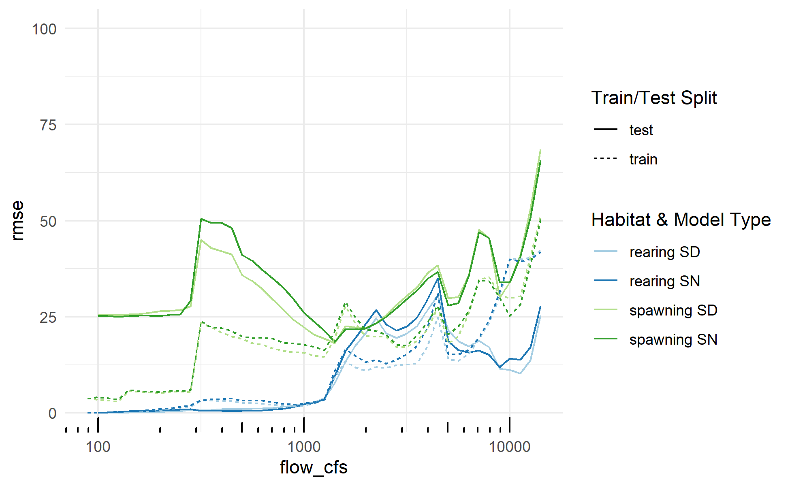<!-- -->

``` r
model_val_rmse <- 
  model_val |>
  group_by(train_test, model_hab, model_name, model_type) |>
  summarize(rmse = sqrt(mean((wua_per_lf_pred - wua_per_lf)^2))) |>
  pivot_wider(names_from = train_test, values_from = rmse, names_glue = "{.value}_{train_test}") |>
  mutate(rmse_infl = (rmse_test / rmse_train))
```

    ## `summarise()` has grouped output by 'train_test', 'model_hab', 'model_name'.
    ## You can override using the `.groups` argument.

``` r
model_val_rmse |>
  filter(model_type=="RF") |>
  knitr::kable()
```

| model_hab | model_name | model_type | rmse_test | rmse_train | rmse_infl |
|:----------|:-----------|:-----------|----------:|-----------:|----------:|
| rearing   | SD         | RF         |  15.21788 |   15.90375 | 0.9568741 |
| rearing   | SN         | RF         |  16.46141 |   17.08808 | 0.9633273 |
| spawning  | SD         | RF         |  33.30836 |   22.46797 | 1.4824820 |
| spawning  | SN         | RF         |  34.84396 |   23.08658 | 1.5092732 |

## Predictions

### Prediction dataset

``` r
pd_attr <- habistat::flowline_attr |> 
#  filter_variable_ranges() |> #stream_level<=4 & !is.na(gnis_name) 
  filter(substr(reachcode,1, 4) %in% c("1802", "1803", "1804")) |>
  select(any_of(c(names(basevars$SD), names(basevars$SN), names(predvars$SD), names(predvars$SN))))

#interp_flows_pred <- c(oom_range(100, 10000), 15000)
#interp_flows_pred <- seq(100,15000,100)
interp_flows_pred <- interp_flows 
# interp_flows_pred <- interp_flows |> 
#   round(-1) |> 
#   signif(2) |>
#   c(15000) |>
#   unique()

pd <- pd_attr |>
  expand_grid(flow_cfs = interp_flows_pred) |>
  mutate(flow_idx = as.integer(flow_cfs),
         flow_norm_cfs = coalesce(flow_cfs / da_scalar_maf, 0)) |> 
  mutate(slope_x_da_area_sq_km = slope * da_area_sq_km) |>
#  # TODO: Potential model improvement
#  # used total drainage area for the training dataset
#  # because there were some improperly classified flow lines in the training dataset
#  # but, use the divergence-routed drainage area for predictions
#  # so we aren't over-attributing habitat value to various diversion channels, etc.:
#  mutate(da_area_sq_km = da_area_sq_km_div) |>
  arrange(comid, flow_cfs) |>
  filter(flow_norm_cfs > 0)
```

### Run prediction routine

``` r
#model_predicted <-

# # FOR TESTING
# row <- model_result_cv |> filter(row_number()==6)
# row <- model_result_cv |> filter(row_number()==12)
# training_df <- row$training[[1]]
# x <- row$model_name[[1]]
# rec <- row$model_recipe[[1]]
# m <- row$model_fit[[1]]
# 
alpha_ci <- 0.90
alpha_pi <- 0.90

if(!file.exists(here::here("data-raw", "temp", "model_predicted.Rds"))) {

model_predicted <-  
  model_result_cv |>
  #filter(model_type=="RF") |>
  #select(model_bfc, model_variant, model_type, model_name, model_recipe, model_fit, training) |>
  mutate(predicted = pmap(list(training, model_name, model_hab, model_recipe, model_fit),
                               function(training_df, n, h, rec, m) {
                                 
      message(paste(n, h))
      
      pd_prepped <- 
        rec |> 
        prep(training_df) |> # train the preprocessor
        bake(pd) |> # apply the preprocessor
        drop_na() |>
        glimpse()
      model <- m$fit$fit # this is the underlying lm or ranger model object. Use this if we have preprocessed the data.
      
      # pd_prepped <-
      #   pd |> 
      #   select(rec$var_info$variable[which(rec$var_info$role %in% c("identifier", "predictor", "scalar"))]) |>
      #   drop_na() |>
      #   glimpse()
      # model <- m # this is a workflow object that contains the preprocessor steps. Use this when data is not yet preprocessed.
      
      #message(pd_prepped |> filter(is.na(flow_norm_cfs * da_ppt_mean_mm)) |> nrow())
      
      if(n == "SD") { 
        
        pd_prepped |>
        transmute(comid, flow_idx, 
                  # predicted
                  ihs_wua_per_lf_pred = predict(model, new_data=pd_prepped)[[".pred"]],
                  
#                  ihs_wua_per_lf_ci_lower = predict(model, type="conf_int", level=alpha_ci, new_data=pd_prepped)[[".pred_lower"]],
#                  ihs_wua_per_lf_ci_upper = predict(model, type="conf_int", level=alpha_ci, new_data=pd_prepped)[[".pred_upper"]],
#                  sem = semiIHS00_inv((ihs_wua_per_lf_ci_upper - ihs_wua_per_lf_pred) / qnorm(1-(1-alpha_ci)/2)), # std error of mean
#                  # TODO technically should change qnorm to qt with degrees of freedom specified
#                  
#                  ihs_wua_per_lf_pi_lower = predict(model, type="pred_int", level=alpha_pi, new_data=pd_prepped)[[".pred_lower"]],
#                  ihs_wua_per_lf_pi_upper = predict(model, type="pred_int", level=alpha_pi, new_data=pd_prepped)[[".pred_upper"]],
#                  sep = semiIHS00_inv((ihs_wua_per_lf_pi_upper - ihs_wua_per_lf_pred) / qnorm(1-(1-alpha_pi)/2)), # std error of prediction
                  
                  wua_per_lf_pred = semiIHS00_inv(ihs_wua_per_lf_pred),
                  
#                  wua_per_lf_ci_lower = wua_per_lf_pred - qnorm(1-(1-alpha_ci)/2) * sem,
#                  wua_per_lf_ci_upper = wua_per_lf_pred + qnorm(1-(1-alpha_ci)/2) * sem,
#                  wua_per_lf_pi_lower = wua_per_lf_pred - qnorm(1-(1-alpha_pi)/2) * sep,,
#                  wua_per_lf_pi_upper = wua_per_lf_pred + qnorm(1-(1-alpha_pi)/2) * sep,
                  
                  ) 
        
      } else if(n == "SN") {
        
        pd_prepped |>
        transmute(comid, flow_idx, da_scalar_maf, 
                  # predicted
                  ihs_wua_per_lf_norm_pred = predict(model, new_data=pd_prepped)[[".pred"]],
                  
#                  ihs_wua_per_lf_norm_ci_lower = predict(model, type="conf_int", level=alpha_ci, new_data=pd_prepped)[[".pred_lower"]],
#                  ihs_wua_per_lf_norm_ci_upper = predict(model, type="conf_int", level=alpha_ci, new_data=pd_prepped)[[".pred_upper"]],
#                  sem = semiIHS00_inv((ihs_wua_per_lf_norm_ci_upper - ihs_wua_per_lf_norm_pred) / qnorm(1-(1-alpha_ci)/2))),
                  
#                  ihs_wua_per_lf_norm_pi_lower = predict(model, type="pred_int", level=alpha_pi, new_data=pd_prepped)[[".pred_lower"]],
#                  ihs_wua_per_lf_norm_pi_upper = predict(model, type="pred_int", level=alpha_pi, new_data=pd_prepped)[[".pred_upper"]],
#                  sep = semiIHS00_inv((ihs_wua_per_lf_norm_pi_upper - ihs_wua_per_lf_norm_pred) / qnorm(1-(1-alpha_pi)/2))),
                  
                  wua_per_lf_norm_pred = semiIHS00_inv(ihs_wua_per_lf_norm_pred),
#                  wua_per_lf_norm_ci_lower = wua_per_lf_norm_pred - qnorm(1-(1-alpha_ci)/2) * sem, 
#                  wua_per_lf_norm_ci_upper = wua_per_lf_norm_pred + qnorm(1-(1-alpha_ci)/2) * sem,
#                  wua_per_lf_norm_pi_lower = wua_per_lf_norm_pred - qnorm(1-(1-alpha_pi)/2) * sep, 
#                  wua_per_lf_norm_pi_upper = wua_per_lf_norm_pred + qnorm(1-(1-alpha_pi)/2) * sep,
#                  
                  wua_per_lf_pred = wua_per_lf_norm_pred * da_scalar_maf,
#                  wua_per_lf_ci_lower = wua_per_lf_norm_ci_lower * da_scalar_maf,
#                  wua_per_lf_ci_upper = wua_per_lf_norm_ci_upper * da_scalar_maf,
#                  wua_per_lf_pi_lower = wua_per_lf_norm_pi_lower * da_scalar_maf,
#                  wua_per_lf_pi_upper = wua_per_lf_norm_pi_upper * da_scalar_maf,
                  )
      }
    })) |>
  select(model_hab, model_type, model_name, predicted) |>
  unnest(predicted) |>
  inner_join(pd |> select(comid, flow_idx, flow_cfs), by=join_by(comid, flow_idx)) # recover the untransformed flow value

#model_predicted_test |>
#  inner_join(habistat::wua_hydraulic, by=join_by(comid, model_hab == habitat, flow_cfs))

model_predicted |> saveRDS(here::here("data-raw", "temp", "model_predicted.Rds"))

} else {
  
model_predicted <- readRDS(here::here("data-raw", "temp", "model_predicted.Rds"))

}
```

### Flow range filter

``` r
if(!file.exists(here::here("data-raw", "results", "flow_ranges.Rds"))) {

library(future)
library(future.apply)
library(furrr)
plan(multisession, workers = availableCores() - 1) # split processing by reach across sessions
#plan(sequential)

flow_ranges <-
  habistat::flowline_attr |>
  filter(comid %in% pd$comid) |>
  drop_na(nf_bfl_dry_cfs, peak_q2_cfs, peak_q5_cfs, peak_q10_cfs, erom_q_ma_cfs) |>
  # use Q2 through Q10 estimates to extrapolate a Q100
  mutate(peak_flow_model = future_pmap(list(peak_q2_cfs, peak_q5_cfs, peak_q10_cfs),
                                   function(q2, q5, q10) {
                                     model_fit <- 
                                       lm(formula = log(q) ~ log(p),
                                        data = tibble(p = 1/c(2, 5, 10),
                                                      q = c(q2, q5, q10)))
                                     list(coeff = exp(summary(model_fit)$coefficients[[1, 1]]),
                                          power = summary(model_fit)$coefficients[[2, 1]])
                                   })) |>
  unnest_wider(peak_flow_model) |>
  mutate(peak_q100_cfs = coeff * (1/100) ^ power) |>
  transmute(comid, 
            flowrange_min = signif(floor(nf_bfl_dry_cfs_dry / 10) * 10, 2) |> as.integer(), 
            flowrange_med = signif(erom_q_ma_cfs, 2) |> as.integer() |> pmax(flowrange_min),
            flowrange_max = signif(ceiling(peak_q100_cfs / 100) * 100, 2) |> as.integer())

  flow_ranges |> saveRDS(here::here("data-raw", "results", "flow_ranges.Rds"))

} else {
  flow_ranges <- readRDS(here::here("data-raw", "results", "flow_ranges.Rds"))
}

usethis::use_data(flow_ranges, overwrite=T)
```

    ## ✔ Saving "flow_ranges" to "data/flow_ranges.rda".

    ## ☐ Document your data (see <https://r-pkgs.org/data.html>).

### Rearing

``` r
flowlines_pred <-
  habistat::flowline_geom_proj |>
  inner_join(habistat::flowline_attr, by=join_by(comid)) |>
  # filter for just the Sacramento and San Joaquin Basins
  filter(watershed_level_1 %in% c("Sacramento River", "San Joaquin River")) |>
  # filter based on size of the stream
  filter(((((stream_order >= 4) & (da_area_sq_km_div > 1)) | ((stream_order >= 3) & (da_area_sq_km_div >= 50))) & (divergence_ratio > 0.5)) | 
           (comid %in% habistat::cv_mainstems$comid)) |>
  filter((ftype %in% c("StreamRiver") & divergence_ratio > 0.5) | (comid %in% habistat::cv_mainstems$comid)) 
```

Investigate the selected rearing streams network (this is done
separately for spawning in spawning-expl.Rmd)

``` r
list_upstream_comids <- function(comid) {
  # USGS upstream trib search service
  # e.g. https://labs.waterdata.usgs.gov/api/nldi/linked-data/comid/12074740/navigation/UT/flowlines?f=json&distance=9999
  result <- nhdplusTools::navigate_nldi(list(featureSource = "comid", 
                                        featureID = comid), 
                                        mode = "upstreamTributaries", 
                                        distance_km = 9999)
  # returns a geojson, want just the list of comids
  return(as.integer(result$UT$nhdplus_comid))
}

# DETERMINE OUTLETS OF REARING STREAMS
rearing_outlets <- 
  habistat::flowline_attr |>
  filter(!is.na(river_cvpia)) |>
  filter(!(river_cvpia %in% c("Sacramento River", "San Joaquin River"))) |> 
  select(comid, da_area_sq_km, watershed_level_3, river_cvpia) |>
  # group by watershed and habitat type
  inner_join(readRDS(here::here("data-raw", "results", "cv_mainstems.Rds")) |> select(comid, habitat), by=join_by(comid)) |>
  filter(!is.na(habitat)) |>
  group_by(river_cvpia, habitat) |>
  # keep just the farthest DS to minimize amount of searching needed
  filter(da_area_sq_km == max(da_area_sq_km)) |> 
  ungroup()

# MAP ALL REARING REACHES AND THEIR OUTLETS
ggplot() + 
  geom_sf(data=habistat::cv_mainstems,
          aes(color = river_cvpia)) + 
  geom_point(data = rearing_outlets,
             aes(geometry = geometry,
                 color = river_cvpia,
                 shape = habitat), stat = "sf_coordinates") + 
  guides(color="none")
```

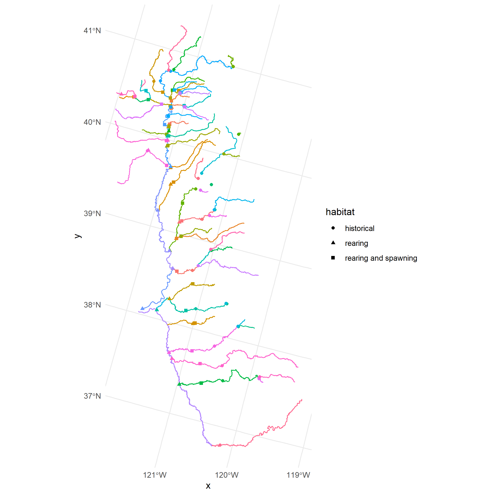<!-- -->

``` r
if(!file.exists(here::here("data-raw", "results", "rearing_tributaries.Rds"))) {

# LIST COMIDS MATCHING NETWORK SEARCH
rearing_tributaries <-
  rearing_outlets |>
  # get tributary network using USGS service
  mutate(trib_comids = map(comid, list_upstream_comids)) |>
  unnest(trib_comids) 
  
  rearing_tributaries |> saveRDS(here::here("data-raw", "results", "rearing_tributaries.Rds"))
} else {
  rearing_tributaries <- readRDS(here::here("data-raw", "results", "rearing_tributaries.Rds"))
}

rearing_tributaries_summarized <- 
  rearing_tributaries |>
  group_by(outlet_comid = comid, comid = trib_comids, river_cvpia, watershed_level_3) |>
  summarize(habitats = list(unique(habitat))) |>
  mutate(habitat = map_chr(habitats, function(x) case_when(any(str_detect("spawning", x)) ~ "rearing and spawning",
                                                           any(str_detect("rearing", x)) ~ "rearing",
                                                           any(str_detect("historical", x)) ~ "historical"))) |>
  select(-habitats) 
```

    ## `summarise()` has grouped output by 'outlet_comid', 'comid', 'river_cvpia'. You
    ## can override using the `.groups` argument.

``` r
# MAP ALL COMIDS UPSTREAM OF REARING REACHES
ggplot() + 
  geom_sf(data=habistat::flowline_geom_proj |>
            inner_join(rearing_tributaries_summarized %>%
                         inner_join(. |> 
                                      group_by(outlet_comid) |> 
                                      summarize(outlet_sort = n()), 
                                    by=join_by(outlet_comid))) |>
            filter(comid %in% flowlines_pred$comid) |>
            arrange(-outlet_sort),
          aes(color = river_cvpia), alpha=0.5) +
  geom_point(data = rearing_outlets,
          aes(geometry = geometry,
              color = river_cvpia,
              shape = habitat), stat = "sf_coordinates") + 
  guides(color="none")
```

    ## Joining with `by = join_by(comid)`

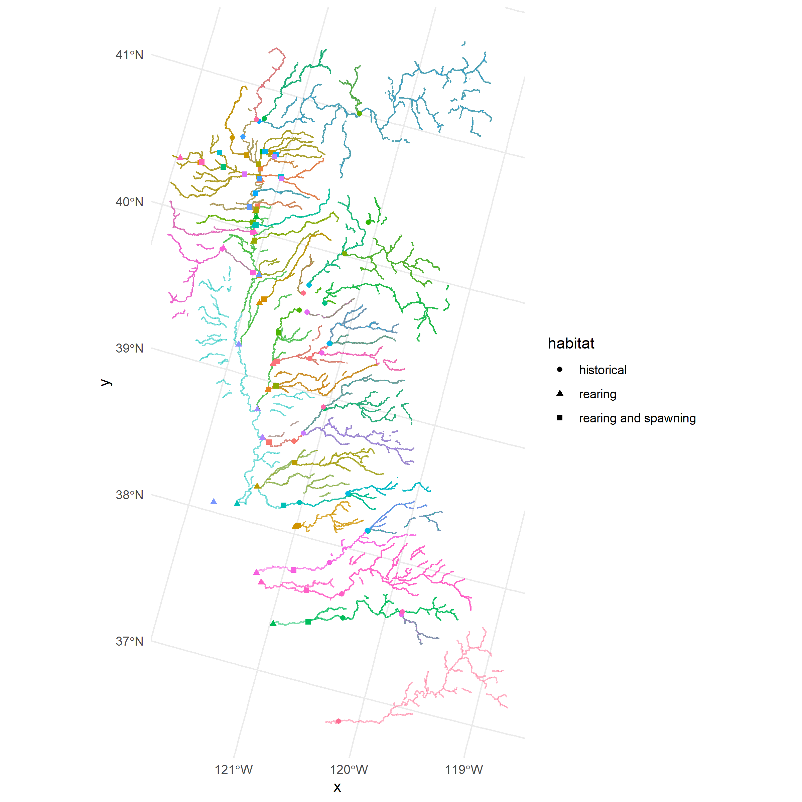<!-- -->

``` r
flowlines_pred |> 
  ggplot() + 
  geom_sf(data=habistat::cv_watersheds,#  |> filter(range_pisces == "extant"), 
          aes(fill=watershed_level_3), color=NA) + 
  geom_sf() +
  geom_sf(data=habistat::cv_mainstems, color="red")
```

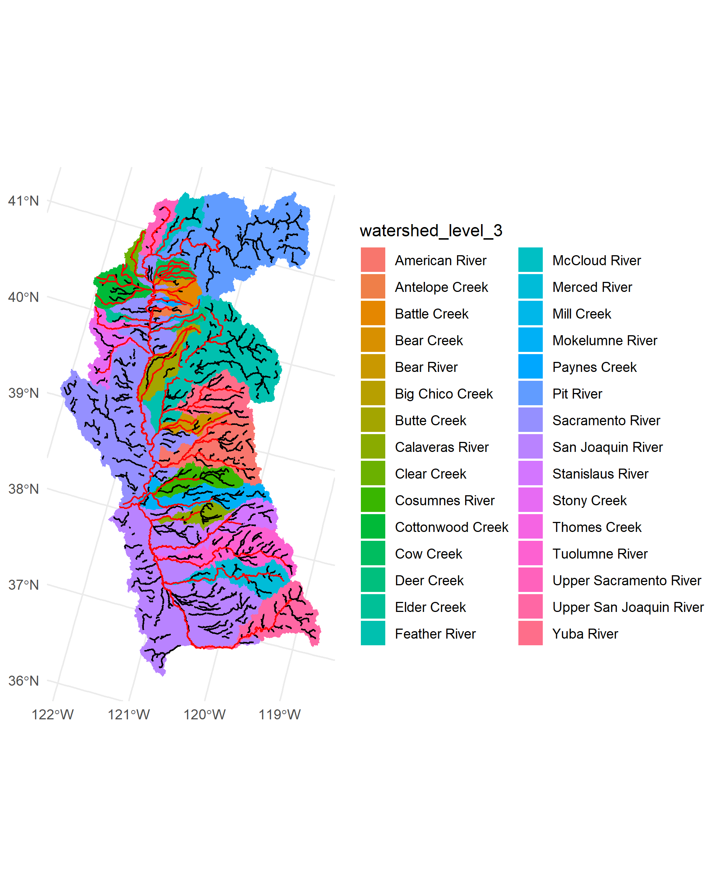<!-- -->

``` r
model_predicted_filtered <- 
  model_predicted |> 
  filter(comid %in% flowlines_pred$comid) |>
  left_join(habistat::flowline_attr |>
              select(comid, river_cvpia, starts_with("watershed_"), reach_length_ft), by=join_by(comid)) |>
  # select just the desired rows and columns for saving and reporting
  # pick the best variant of SD and SN models
  filter((model_type == "RF") & (model_hab == "rearing")) |>
  transmute(comid, model_name, flow_idx, flow_cfs, wua_per_lf_pred, 
         river_cvpia = as.factor(river_cvpia),
         watershed_level_3 = as.factor(watershed_level_3),
         reach_length_ft) |>
  # don't flow range filter here -- do it later
  # inner_join(flow_ranges, by=join_by(comid)) |>
  # filter((flow_cfs >= flowrange_min) & (flow_cfs <= flowrange_max)) |>
  select(-starts_with("flowrange_")) |>
  glimpse()
```

    ## Rows: 862,400
    ## Columns: 8
    ## $ comid             <dbl> 342455, 342455, 342455, 342455, 342455, 342455, 3424…
    ## $ model_name        <chr> "SD", "SD", "SD", "SD", "SD", "SD", "SD", "SD", "SD"…
    ## $ flow_idx          <int> 50, 56, 63, 70, 79, 89, 100, 112, 125, 141, 158, 177…
    ## $ flow_cfs          <dbl> 50.11872, 56.23413, 63.09573, 70.79458, 79.43282, 89…
    ## $ wua_per_lf_pred   <dbl> 0.02766613, 0.02902734, 0.02954483, 0.03133276, 0.03…
    ## $ river_cvpia       <fct> NA, NA, NA, NA, NA, NA, NA, NA, NA, NA, NA, NA, NA, …
    ## $ watershed_level_3 <fct> Stanislaus River, Stanislaus River, Stanislaus River…
    ## $ reach_length_ft   <dbl> 291.9948, 291.9948, 291.9948, 291.9948, 291.9948, 29…

``` r
model_predicted_filtered |> saveRDS(here::here("data-raw", "results", "model_predicted_filtered.Rds"))
#model_predicted_filtered <- readRDS(here::here("data-raw", "results", "model_predicted_filtered.Rds"))
```

### Spawning

``` r
spawning_context <- readRDS(here::here("data-raw", "results", "spawning_context.Rds"))

flowlines_pred_spawning <- 
  habistat::flowline_geom_proj |>
  left_join(spawning_context, by=join_by(comid)) |>
  filter(spawning_geographic_context) |>
  inner_join(habistat::flowline_attr |> select(comid, ftype, divergence_ratio), by=join_by(comid)) |>
  filter((ftype %in% c("StreamRiver") & divergence_ratio > 0.5) | (comid %in% habistat::cv_mainstems$comid)) 
  
flowlines_pred_spawning |> 
  ggplot() + 
  geom_sf(data=habistat::cv_watersheds,#  |> filter(range_pisces == "extant"), 
          aes(fill=watershed_level_3), color=NA) + 
  geom_sf()
```

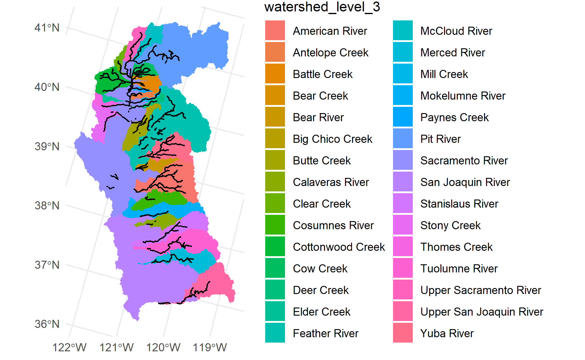<!-- -->

``` r
model_predicted_spawning <- 
  model_predicted |> 
  filter(comid %in% flowlines_pred_spawning$comid) |>
  left_join(habistat::flowline_attr |>
              select(comid, river_cvpia, starts_with("watershed_"), reach_length_ft), by=join_by(comid)) |>
  # select just the desired rows and columns for saving and reporting
  # pick the best variant of SD and SN models
  filter((model_type == "RF") & (model_hab == "spawning")) |>
  transmute(comid, model_name, flow_idx, flow_cfs, wua_per_lf_pred, 
         river_cvpia = as.factor(river_cvpia),
         watershed_level_3 = as.factor(watershed_level_3),
         reach_length_ft) |>
  # don't flow range filter here -- do it later
  # inner_join(flow_ranges, by=join_by(comid)) |>
  # filter((flow_cfs >= flowrange_min) & (flow_cfs <= flowrange_max)) |>
  select(-starts_with("flowrange_")) |>
  glimpse()
```

    ## Rows: 280,500
    ## Columns: 8
    ## $ comid             <dbl> 343009, 343009, 343009, 343009, 343009, 343009, 3430…
    ## $ model_name        <chr> "SD", "SD", "SD", "SD", "SD", "SD", "SD", "SD", "SD"…
    ## $ flow_idx          <int> 50, 56, 63, 70, 79, 89, 100, 112, 125, 141, 158, 177…
    ## $ flow_cfs          <dbl> 50.11872, 56.23413, 63.09573, 70.79458, 79.43282, 89…
    ## $ wua_per_lf_pred   <dbl> 41.07026, 41.05419, 41.19025, 40.86327, 40.73626, 40…
    ## $ river_cvpia       <fct> NA, NA, NA, NA, NA, NA, NA, NA, NA, NA, NA, NA, NA, …
    ## $ watershed_level_3 <fct> Stanislaus River, Stanislaus River, Stanislaus River…
    ## $ reach_length_ft   <dbl> 423.2283, 423.2283, 423.2283, 423.2283, 423.2283, 42…

``` r
model_predicted_spawning |> saveRDS(here::here("data-raw", "results", "model_predicted_spawning.Rds"))
```

### DSMHabitat comparison

``` r
mainstems_comid <- 
  read_sf(file.path("/vsizip", here::here("data-raw", "source", "rearing_spatial_data", "nhdplusv2_comid_habitat_xw.shp.zip"))) |>
  janitor::clean_names() |>
  st_zm() |>
  st_transform(st_crs(habistat::flowline_geom_proj)) |>
  mutate(length_ft = st_length(geometry) |> units::set_units("ft") |> units::drop_units()) |>
  filter(str_detect(habitat, "rearing")) |>
  left_join(habistat::flowline_attr |> select(comid, hqt_gradient_class), by=join_by(comid)) |>
  filter(!(river %in% c("Sacramento River", "San Joaquin River")))

mainstems <-
  mainstems_comid |>
  group_by(river, hqt_gradient_class) |>
  summarize() 
```

    ## `summarise()` has grouped output by 'river'. You can override using the
    ## `.groups` argument.

``` r
mainstems_comid |> 
  ggplot() + 
  geom_sf(aes(group=river, color=hqt_gradient_class)) + 
  theme(legend.key.height = unit(12, "point"))
```

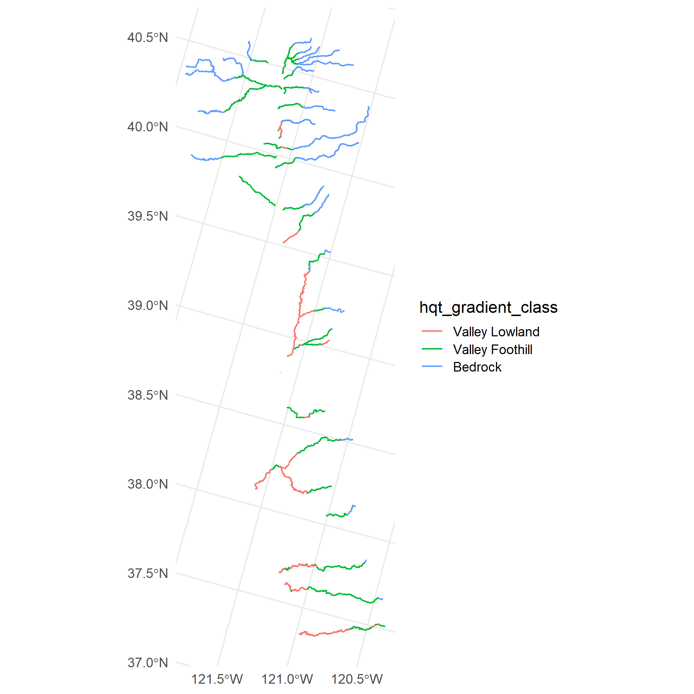<!-- -->

``` r
#remotes::install_github("CVPIA-OSC/DSMhabitat")
watersheds <- mainstems |> pull(river) |> unique()
watershed_name <- tolower(gsub(pattern = "-| ", replacement = "_", x = watersheds))
watershed_rda_name <- paste(watershed_name, "floodplain", sep = "_")

dsm_habitat_floodplain <- map_df(watershed_rda_name, function(watershed) {
  df <- as.data.frame(do.call(`::`, list(pkg = "DSMhabitat", name = watershed)))
}) |> 
  transmute(river = watershed,
            flow_cfs,
            FR_floodplain_m2 = FR_floodplain_acres * 4046.86,
            FR_floodplain_m2_suitable = DSMhabitat::apply_suitability(FR_floodplain_m2),
            FR_floodplain_acres_suitable = FR_floodplain_m2_suitable / 4046.86)

dsm_habitat_instream <- map_df(paste(watershed_name, "instream", sep = "_"), 
                               possibly(function(watershed) {
                                 df <- as.data.frame(do.call(`::`, list(pkg = "DSMhabitat", name = watershed)))
                                 }, otherwise = NULL)) |> 
  transmute(river = watershed,
            flow_cfs,
            FR_juv_wua) 

dsm_flows <- bind_rows(dsm_habitat_floodplain, dsm_habitat_instream) |>
  group_by(river, flow_cfs) |>
  summarize() |>
  ungroup() |>
  arrange(river, flow_cfs)
```

    ## `summarise()` has grouped output by 'river'. You can override using the
    ## `.groups` argument.

``` r
dsm_flow_ranges <- 
  dsm_flows |> 
  group_by(river) |> 
  summarize(min_flow_cfs = min(flow_cfs), max_flow_cfs = max(flow_cfs))

mainstems_comid |> 
  st_zm() |> 
  filter(comid %in% mainstems_comid$comid) |>
  ggplot() + 
  geom_sf(aes(color=river)) + 
  theme(legend.key.height = unit(12, "point"))
```

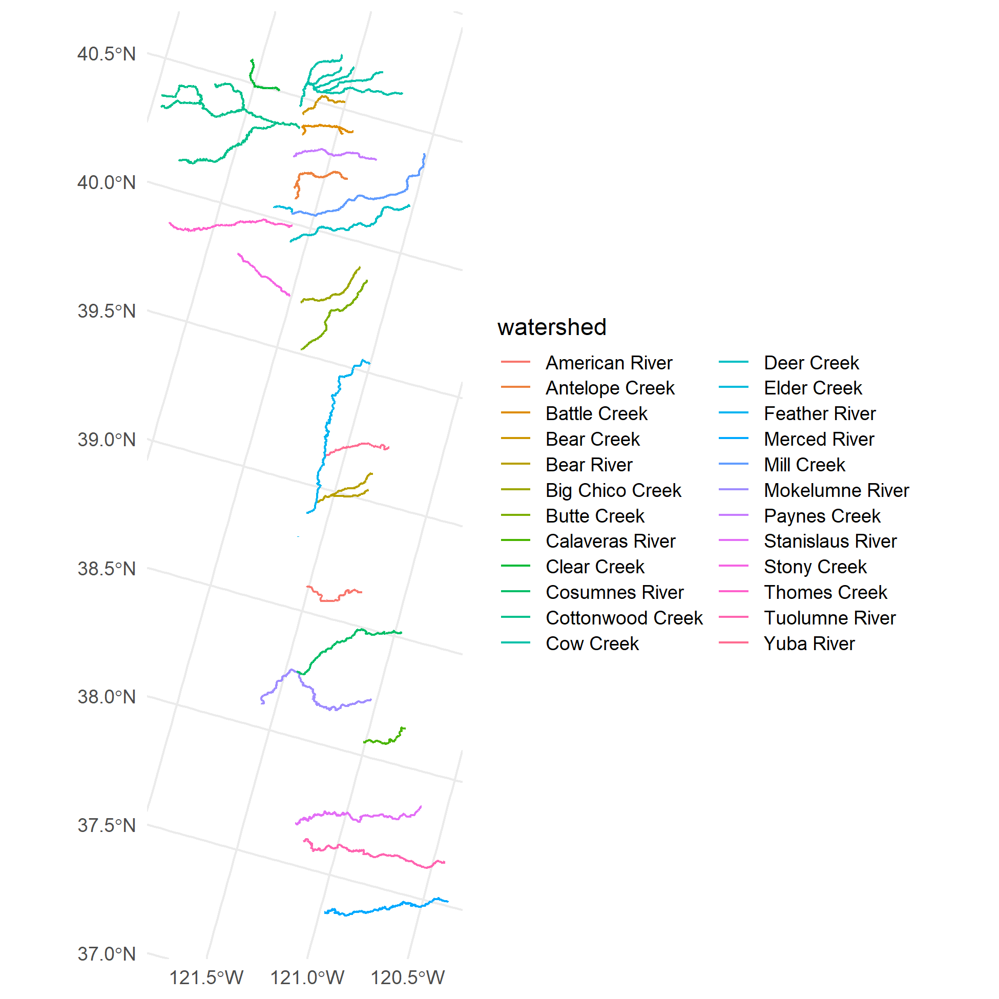<!-- -->

``` r
# combining both floodplain and instream rearing acreages/WUAs for comparison
dsm_habitat_combined <- mainstems |> 
  mutate(length_ft = st_length(geometry) |> units::set_units("ft") |> units::drop_units()) |>
  group_by(river) |> 
  summarize(length_ft = sum(length_ft)) |>
  st_drop_geometry() |>
  inner_join(full_join(dsm_habitat_instream, dsm_habitat_floodplain, by=join_by(river, flow_cfs)), by=join_by(river)) |>
  group_by(river) |>
  arrange(river, flow_cfs) |>
  mutate(FR_juv_wua = zoo::na.approx(FR_juv_wua, flow_cfs, na.rm=F),
         FR_floodplain_acres_suitable = zoo::na.approx(FR_floodplain_acres_suitable, flow_cfs, na.rm=F)) |>
  transmute(river, flow_cfs, 
            instream_wua_per_lf = coalesce(FR_juv_wua/1000,0),
            instream_suitable_ac = coalesce(FR_juv_wua/1000,0)*length_ft/43560,
            floodplain_wua_per_lf = coalesce(FR_floodplain_acres_suitable,0)*43560/length_ft,
            floodplain_suitable_ac = coalesce(FR_floodplain_acres_suitable,0),
            combined_wua_per_lf = instream_wua_per_lf + floodplain_wua_per_lf,
            combined_suitable_ac =  instream_suitable_ac + floodplain_suitable_ac) |>
  ungroup()
```

    ## Warning: There was 1 warning in `mutate()`.
    ## ℹ In argument: `FR_floodplain_acres_suitable =
    ##   zoo::na.approx(FR_floodplain_acres_suitable, flow_cfs, na.rm = F)`.
    ## ℹ In group 20: `river = "Stanislaus River"`.
    ## Caused by warning in `regularize.values()`:
    ## ! collapsing to unique 'x' values

``` r
dsm_habitat_wua_per_lf <- dsm_habitat_combined |>
  select(river, flow_cfs, instream_wua_per_lf, floodplain_wua_per_lf) |>
#  mutate(combined_wua_per_lf = pmax(instream_wua_per_lf, floodplain_wua_per_lf)) |>
  pivot_longer(cols=c(instream_wua_per_lf, floodplain_wua_per_lf)) |>
  mutate(name = paste("DSMhabitat", str_replace(name, "_wua_per_lf", "")),
         value = if_else(value>0, value, NA))

dsm_habitat_suitable_ac <- dsm_habitat_combined |>
  select(river, flow_cfs, instream_suitable_ac, floodplain_suitable_ac) |>
#  mutate(combined_suitable_ac = pmax(instream_suitable_ac, floodplain_suitable_ac)) |>
  pivot_longer(cols=c(instream_suitable_ac, floodplain_suitable_ac)) |>
  mutate(value = if_else(value>0, value, NA)) |>
  mutate(name = paste("DSMhabitat", str_replace(name, "_suitable_ac", "")),
         value = if_else(value>0, value, NA))
```

``` r
model_predicted_filtered |>
  filter(!is.na(river_cvpia)) |>
  filter(flow_cfs <= 15000) |>
  #filter(model_type == "RF") |>
  #group_by(model_bfc, model_variant, river_cvpia, flow_cfs) |>
  group_by(model_name, river_cvpia, flow_cfs) |>
  summarize(wua_per_lf_pred = sum(wua_per_lf_pred * reach_length_ft) / sum(reach_length_ft)) |>
  ggplot(aes(x = flow_cfs)) + 
  geom_line(aes(y = wua_per_lf_pred, 
                color = case_when(model_name=="SD" ~ "Scale-Dependent", 
                                  model_name=="SN" ~ "Scale-Normalized"), 
                #linetype = if_else(model_bfc, "Post-Model BFC Removal", "Prior BFC Removal")
                )) +
  geom_line(data=dsm_habitat_wua_per_lf |> 
              rename(river_cvpia = river), 
            aes(x = flow_cfs, y = value, color = name)) +
  facet_wrap(~river_cvpia, scales = "free_y") +
  scale_x_continuous(limits = c(0,15000)) +
  #scale_y_log10() + scale_x_log10()  +
  scale_color_brewer(name = "Model Type", palette ="Paired") + 
  #scale_linetype_discrete(name = "Baseflow Method") + 
  theme(panel.grid.minor = element_blank(), legend.position = "top", legend.box="vertical", axis.text.x = element_text(angle=90)) +
  guides(color = guide_legend(nrow = 2))
```

    ## `summarise()` has grouped output by 'model_name', 'river_cvpia'. You can
    ## override using the `.groups` argument.

    ## Warning: Removed 30 rows containing missing values or values outside the scale range
    ## (`geom_line()`).

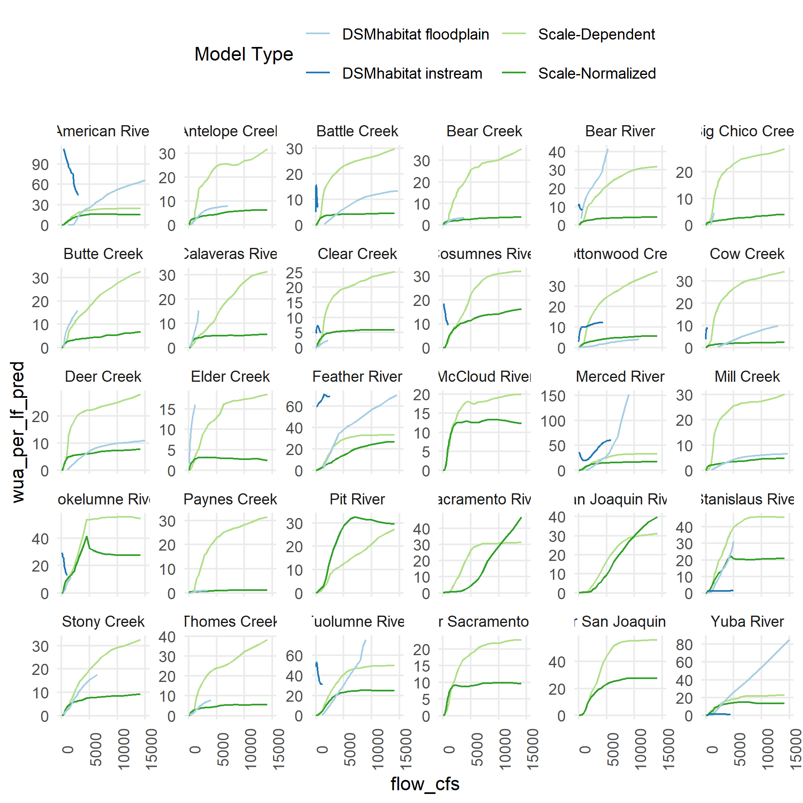<!-- -->

``` r
# ggsave(here::here("vignettes", "figures", "model_comparison_raw.png"))
```

### Combine the outputs

``` r
model_predicted_final <- bind_rows(
  # bring in the main rearing results where the baseflow was removed before
  model_predicted_filtered |> 
   # filter((!model_bfc) & (comid %in% baseflows_by_comid$comid)) |>
    mutate(habitat = "rearing"),
#  # now bring in the rearing model that included post-hoc baseflow channel removal
#  model_predicted_bfc_rm |>
#    select(-wua_per_lf_pred) |>
#    rename(wua_per_lf_pred = wua_per_lf_pred_nbfc) |>
#    select(-flow_cfs_nbfc, -baseflow_cfs) |>
#    mutate(habitat = "rearing"),
#  # bring in the main spawning results
  model_predicted_spawning |> 
   # filter((comid %in% baseflows_by_comid$comid)) |>
    mutate(habitat = "spawning")
  ) #|>
  #mutate(wua_acres_pred = wua_per_lf_pred * reach_length_ft / 43560,
  #       wua_acres_pred = wua_per_lf_pred * reach_length_ft / 43560)#|>
 # # join hydraulic modelled results for comparison
 # # left_join(wua_hydraulic |>
 # #             filter(habitat == "rearing"), 
 # #           by = join_by(comid, flow_cfs, model_bfc == bfc))
 # left_join(wua_hydraulic |>
 #             filter((habitat == "rearing") & !bfc), # always compare against the training data with BFC removed 
 #           by = join_by(comid, flow_cfs)) 

model_predicted_final |>
  saveRDS(here::here("data-raw", "results", "model_predicted_final.Rds"))

wua_predicted <- model_predicted_final
usethis::use_data(wua_predicted, overwrite = TRUE)
```

    ## ✔ Saving "wua_predicted" to "data/wua_predicted.rda".

    ## ☐ Document your data (see <https://r-pkgs.org/data.html>).

``` r
wua_predicted_cv_watersheds <- 
  wua_predicted |>
  filter(!is.na(watershed_level_3)) |>
  group_by(habitat, model_name, watershed_level_3, flow_idx, flow_cfs) |>
  summarize(wua_per_lf_pred = sum(wua_per_lf_pred * reach_length_ft) / sum(reach_length_ft),
            wua_acres_pred = sum(wua_per_lf_pred * reach_length_ft) / 43560) |>
  ungroup()
```

    ## `summarise()` has grouped output by 'habitat', 'model_name',
    ## 'watershed_level_3', 'flow_idx'. You can override using the `.groups` argument.

``` r
usethis::use_data(wua_predicted_cv_watersheds, overwrite = TRUE) 
```

    ## ✔ Saving "wua_predicted_cv_watersheds" to
    ##   "data/wua_predicted_cv_watersheds.rda".
    ## ☐ Document your data (see <https://r-pkgs.org/data.html>).

``` r
wua_predicted_cv_mainstems <- 
  wua_predicted |>
  filter(!is.na(river_cvpia)) |>
  group_by(habitat, model_name, river_cvpia, flow_idx, flow_cfs) |>
  summarize(wua_per_lf_pred = sum(wua_per_lf_pred * reach_length_ft) / sum(reach_length_ft),
            wua_acres_pred = sum(wua_per_lf_pred * reach_length_ft) / 43560) |>
  ungroup()
```

    ## `summarise()` has grouped output by 'habitat', 'model_name', 'river_cvpia',
    ## 'flow_idx'. You can override using the `.groups` argument.

``` r
usethis::use_data(wua_predicted_cv_mainstems, overwrite = TRUE)
```

    ## ✔ Saving "wua_predicted_cv_mainstems" to "data/wua_predicted_cv_mainstems.rda".
    ## ☐ Document your data (see <https://r-pkgs.org/data.html>).

``` r
wua_predicted_cv_mainstems |>
  mutate(river_cvpia_short = if_else((str_length(river_cvpia) >= 12) & !str_detect(river_cvpia, "Bear "),
                                     river_cvpia  |> str_replace(" Creek", "") |> str_replace(" River", ""),
                                     river_cvpia)) |>
  filter(habitat == "rearing") |>
  filter(flow_cfs <= 15000) |>
  ggplot(aes(x = flow_cfs)) + 
  geom_line(aes(y = wua_per_lf_pred, 
                color = case_when(model_name=="SD" ~ "Scale-Dependent", 
                                  model_name=="SN" ~ "Scale-Normalized"))) +
  facet_wrap(~river_cvpia_short, scales = "free_y") +
  scale_x_continuous(limits = c(0,15000)) +
  #scale_y_log10() + scale_x_log10()  +
  scale_color_discrete(name = "Model Type") + 
  scale_linetype_discrete(name = "Baseflow Method") + 
  theme(panel.grid.minor = element_blank(), legend.position = "top", legend.box="vertical", axis.text.x = element_text(angle=90)) +
  ylab("Suitable Habitat Area per Linear Ft (ft2/lf)") + xlab("Flow (cfs)")
```

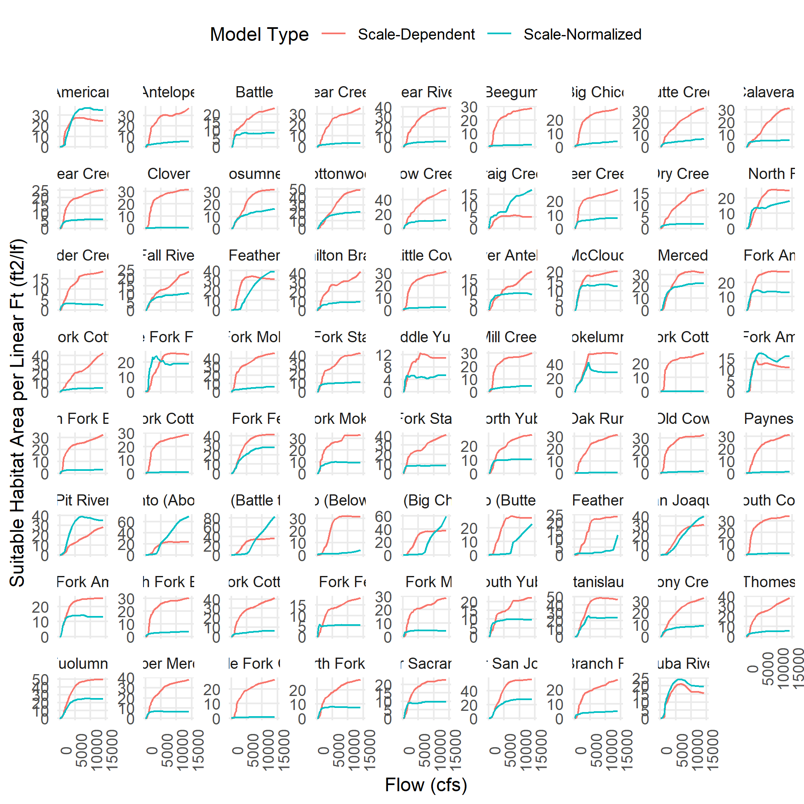<!-- -->

``` r
# ggsave(here::here("vignettes", "figures", "model_comparison.png"))
```

``` r
wua_predicted_cv_mainstems |>
  mutate(river_cvpia_short = if_else((str_length(river_cvpia) >= 12) & !str_detect(river_cvpia, "Bear "),
                                     river_cvpia  |> str_replace(" Creek", "") |> str_replace(" River", ""),
                                     river_cvpia)) |>
  filter(habitat == "spawning") |>
  filter(flow_cfs <= 15000) |>
  ggplot(aes(x = flow_cfs)) + 
  geom_line(aes(y = wua_per_lf_pred, 
                color = case_when(model_name=="SD" ~ "Scale-Dependent", 
                                  model_name=="SN" ~ "Scale-Normalized"))) +
  facet_wrap(~river_cvpia_short, scales = "free_y") +
  scale_x_continuous(limits = c(0,15000)) +
  #scale_y_log10() + scale_x_log10()  +
  scale_color_discrete(name = "Model Type") + 
  scale_linetype_discrete(name = "Baseflow Method") + 
  theme(panel.grid.minor = element_blank(), legend.position = "top", legend.box="vertical", axis.text.x = element_text(angle=90)) +
  ylab("Suitable Habitat Area per Linear Ft (ft2/lf)") + xlab("Flow (cfs)")
```

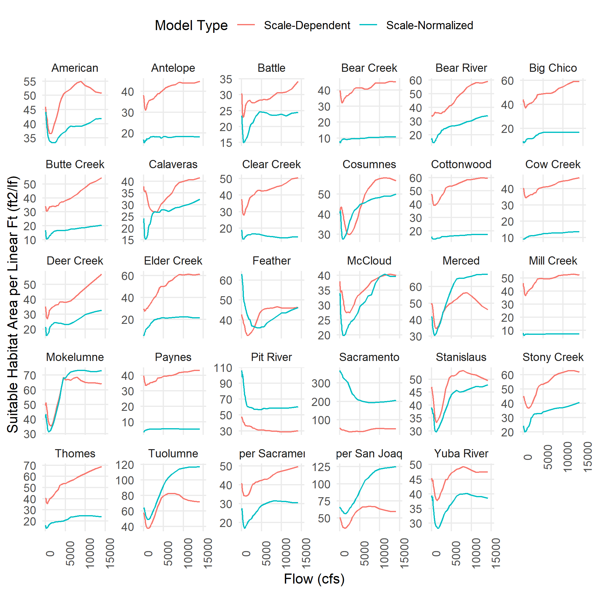<!-- -->

``` r
# ggsave(here::here("vignettes", "figures", "model_comparison.png"))
```
