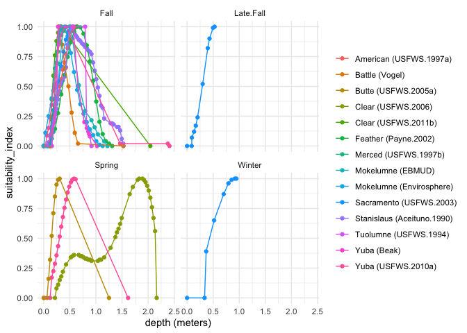
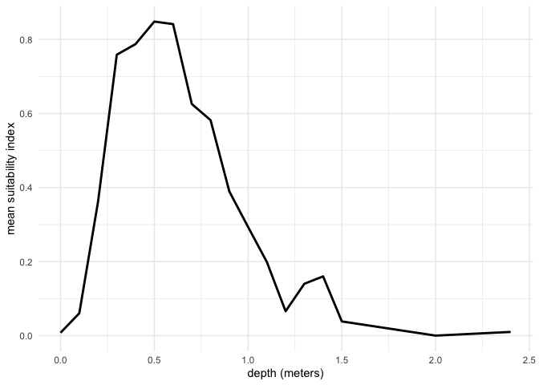
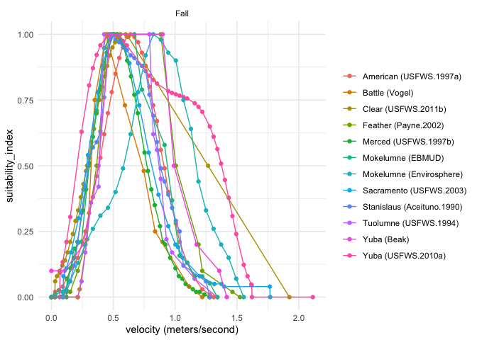
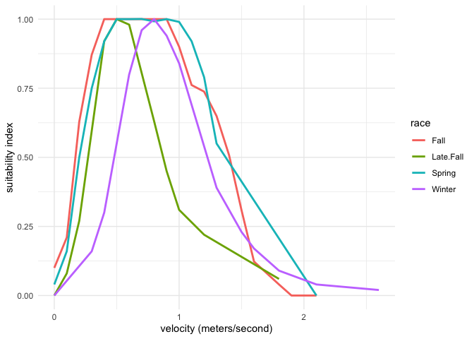

Spawning Habitat Suitability Criteria
================
[Maddee Rubenson](mailto:mrubenson@flowwest.com)
2024-07-11

- [Habitat Suitability Criteria](#habitat-suitability-criteria)
- [Objective](#objective)
- [Methods](#methods)
  - [Read in data](#read-in-data)
  - [Depth HSI](#depth-hsi)
  - [Velocity HSI](#velocity-hsi)

## Habitat Suitability Criteria

## Objective

Develop a habitat suitability criteria that can be used across
watersheds within the HabiStat model.

## Methods

### Read in data

Data is from various sources and was compiled by Mark Gard for use in
CVPIA DSMHabitat. Within the dataset are spawning criteria for depth,
velocity, and substrate for 11 watersheds and Fall, Late Fall, Winter,
Spring for Chinook Salmon.

``` r
hsc_raw <- readxl::read_excel(here::here('data-raw', 'source', 'hsc', 'HSC.xlsx'), sheet = "flat") |> 
  janitor::clean_names() |> 
  glimpse()
```

    ## Rows: 2,818
    ## Columns: 9
    ## $ citation           <chr> "USFWS.1997a", "USFWS.1997a", "USFWS.1997a", "USFWS…
    ## $ river              <chr> "American", "American", "American", "American", "Am…
    ## $ species            <chr> "Chinook", "Chinook", "Chinook", "Chinook", "Chinoo…
    ## $ race               <chr> "Fall", "Fall", "Fall", "Fall", "Fall", "Fall", "Fa…
    ## $ life_stage         <chr> "Spawning", "Spawning", "Spawning", "Spawning", "Sp…
    ## $ suitability_metric <chr> "Substrate", "Substrate", "Substrate", "Substrate",…
    ## $ units              <chr> "Code", "Code", "Code", "Code", "Code", "Code", "Co…
    ## $ units_si           <dbl> 0.1000000, 1.0000000, 1.2000000, 1.3000000, 1.40000…
    ## $ suitability_index  <dbl> 0.00, 0.00, 0.36, 1.00, 0.97, 0.97, 0.53, 0.28, 0.0…

``` r
spawning_hsc <- hsc_raw |> 
  filter(life_stage == "Spawning")


spawning_table <- hsc_raw |> 
  filter(life_stage == "Spawning",
         species == "Chinook") |>
  select(river, race, suitability_metric, citation) |> 
  mutate(suitability_metric = paste0(unique(suitability_metric), collapse = "; ")) |> 
  distinct() 

knitr::kable(spawning_table, caption = "All habitat suitability criteria compiled by Mark Gard")
```

| river      | race      | suitability_metric         | citation      |
|:-----------|:----------|:---------------------------|:--------------|
| American   | Fall      | Substrate; Depth; Velocity | USFWS.1997a   |
| Sacramento | Fall      | Substrate; Depth; Velocity | USFWS.2003    |
| Sacramento | Late.Fall | Substrate; Depth; Velocity | USFWS.2003    |
| Sacramento | Winter    | Substrate; Depth; Velocity | USFWS.2003    |
| Yuba       | Spring    | Substrate; Depth; Velocity | USFWS.2010a   |
| Yuba       | Fall      | Substrate; Depth; Velocity | USFWS.2010a   |
| Clear      | Spring    | Substrate; Depth; Velocity | USFWS.2006    |
| Clear      | Fall      | Substrate; Depth; Velocity | USFWS.2011b   |
| Butte      | Spring    | Substrate; Depth; Velocity | USFWS.2005a   |
| Merced     | Fall      | Substrate; Depth; Velocity | USFWS.1997b   |
| Stanislaus | Fall      | Substrate; Depth; Velocity | Aceituno.1990 |
| Tuolumne   | Fall      | Substrate; Depth; Velocity | USFWS.1994    |
| Battle     | Fall      | Substrate; Depth; Velocity | Vogel         |
| Feather    | Fall      | Substrate; Depth; Velocity | Payne.2002    |
| Yuba       | Fall      | Substrate; Depth; Velocity | Beak          |
| Mokelumne  | Fall      | Substrate; Depth; Velocity | Envirosphere  |
| Mokelumne  | Fall      | Substrate; Depth; Velocity | EBMUD         |

All habitat suitability criteria compiled by Mark Gard

### Depth HSI

``` r
spawning_hsc |> 
  filter(suitability_metric == "Depth") |> 
  filter(units_si < 3,
         species == "Chinook") |>   
  ggplot() + 
  geom_point(aes(x = units_si, y = suitability_index, color = paste0(river, " (", citation, ")"))) + 
  geom_line(aes(x = units_si, y = suitability_index, color = paste0(river, " (", citation, ")"))) + 
  facet_wrap(~race, scales = "free_x") + 
  xlab('depth (meters)') + 
  theme(legend.title=element_blank()) + 
  facet_wrap(~ race)
```

<!-- -->

``` r
# Take an average across all reaches
spawning_hsc |> 
  filter(suitability_metric == "Depth") |> 
  filter(units_si < 3,
         species == "Chinook") |>   
  mutate(units_si = round(units_si, 1)) |> 
  group_by(units_si, race) |> 
  summarise(max_suit_index = max(suitability_index)) |> 
  ggplot() + 
  geom_line(aes(x = units_si, y = max_suit_index, color = race), size = 1) + 
  xlab('depth (meters)') + 
  ylab('suitability index') 
```

<!-- -->

### Velocity HSI

``` r
spawning_hsc |> 
  filter(suitability_metric == "Velocity") |> 
  filter(units_si < 30,
         species == "Chinook") |>   
  ggplot() + 
  geom_point(aes(x = units_si, y = suitability_index, color = paste0(river, " (", citation, ")"))) + 
  geom_line(aes(x = units_si, y = suitability_index, color = paste0(river, " (", citation, ")"))) + 
  facet_wrap(~race, scales = "free_x") + 
  xlab('velocity (meters/second)') + 
  theme(legend.title=element_blank())
```

<!-- -->

``` r
# Take an average
spawning_hsc |> 
  filter(suitability_metric == "Velocity") |> 
  filter(units_si < 30,
         species == "Chinook") |>   
  mutate(units_si = round(units_si, 1)) |> 
  group_by(units_si, race) |> 
  summarise(max_suit_index = max(suitability_index)) |> 
  ggplot() + 
  geom_line(aes(x = units_si, y = max_suit_index, color = race), size = 1) + 
  xlab('velocity (meters/second)')  + 
  ylab('suitability index')
```

<!-- -->
