Spawning Data Exploration
================
[Skyler Lewis](mailto:slewis@flowwest.com)
2024-07-29

- [Determining the Geographic Scope](#determining-the-geographic-scope)
  - [HQT gradient class and known spawning
    reaches](#hqt-gradient-class-and-known-spawning-reaches)
  - [UCD eFlows Geomorph Classes](#ucd-eflows-geomorph-classes)
  - [Filter by Gradient and
    Elevation](#filter-by-gradient-and-elevation)
  - [Apply CVPIA watershed spawning ranges to adjacent
    tributaries](#apply-cvpia-watershed-spawning-ranges-to-adjacent-tributaries)
  - [Final version](#final-version)
- [Reach by Reach Analysis](#reach-by-reach-analysis)
  - [Sediment Transport Approach](#sediment-transport-approach)
  - [Alternative Approach](#alternative-approach)
- [Export result](#export-result)

``` r
library(tidyverse)
library(sf)
library(terra)

theme_set(theme_minimal())
```

``` r
flowlines <- readRDS(here::here("data-raw", "results", "flowline_geometries_proj.Rds"))

flowline_attributes <- readRDS(here::here("data-raw", "results", "flowline_attributes.Rds"))

source(here::here("data-raw", "scripts", "data-functions.R"))
```

Potential spawning area = intersection of

- UCD PISCES habitat areas polygons - current and historic - cross
  checked against CVPIA spawning ranges
- UCD eFlows geomorph classes that include gravel or step pool systems

Examine existing redd surveys and define ranges of river gradients and
other characteristics that predict spawning

- <https://catalog.data.gov/dataset/salmon-spawning-locations-redds-mapped-in-the-field-along-the-american-river-california-no>

Map the known redd locations like sailor bar

## Determining the Geographic Scope

### HQT gradient class and known spawning reaches

``` r
valley_lowland <- 
  readRDS(here::here("data-raw", "source", "hqt", "hqt_valley_lowland.Rds")) |> 
  st_transform(project_crs) |> 
  st_sf() |>
  st_set_geometry("geometry") |>
  mutate(hqt_gradient_class = "Valley Lowland")

cvpia_extents <- 
  read_sf(file.path("/vsizip", here::here("data-raw", "source", "rearing_spatial_data", "habitat_extents_combined_gradients_v3.shp.zip"))) |>
  janitor::clean_names() |>
  st_cast("LINESTRING") |>
  st_transform(project_crs)
```

    ## Warning in st_cast.sf(janitor::clean_names(read_sf(file.path("/vsizip", :
    ## repeating attributes for all sub-geometries for which they may not be constant

``` r
cvpia_extents_spawning <-
  cvpia_extents |> 
  filter(habitat == "spawning")

cvpia_extents_nhd <- 
  read_sf(file.path("/vsizip", here::here("data-raw", "source", "rearing_spatial_data", "nhdplusv2_comid_habitat_xw.shp.zip"))) |>
  st_zm() |>
  janitor::clean_names() |>
  st_cast("LINESTRING") |>
  st_transform(project_crs)

cvpia_extents_nhd_spawning <- 
  cvpia_extents_nhd |> 
  filter(str_detect(habitat, "spawning"))
```

``` r
spawning_mainstems <-
  read_sf(here::here("data-raw", "source", "rearing_spatial_data", "nhdplusv2_comid_habitat_xw.shp.zip")) |>
  janitor::clean_names() |>
  filter(str_detect(habitat, "spawning")) |>
  st_zm() |>
  st_transform(habistat::const_proj_crs()) |>
  select(river, comid) |>
  rename(river_cvpia = river)

rearing_mainstems <-
  read_sf(here::here("data-raw", "source", "rearing_spatial_data", "nhdplusv2_comid_habitat_xw.shp.zip")) |>
  janitor::clean_names() |>
  filter(str_detect(habitat, "rearing")) |>
  st_zm() |>
  st_transform(habistat::const_proj_crs()) |>
  select(river, comid) |>
  rename(river_cvpia = river)

historical_mainstems <-
  read_sf(here::here("data-raw", "source", "rearing_spatial_data", "nhdplusv2_comid_habitat_xw.shp.zip")) |>
  janitor::clean_names() |>
  filter(str_detect(habitat, "spawning") | str_detect(habitat, "rearing") | str_detect(habitat, "historical")) |>
  st_zm() |>
  st_transform(habistat::const_proj_crs()) |>
  select(river, comid) |>
  rename(river_cvpia = river)
```

``` r
ggplot() +
  geom_sf(data = valley_lowland, color=NA, fill="lightgoldenrod") +
  geom_sf(data = cvpia_extents, color="gray") +
  geom_sf(data = cvpia_extents_spawning, color="black") +
  geom_sf(data = cvpia_extents_spawning |> filter(species=="Spring Run Chinook"), color="red") 
```

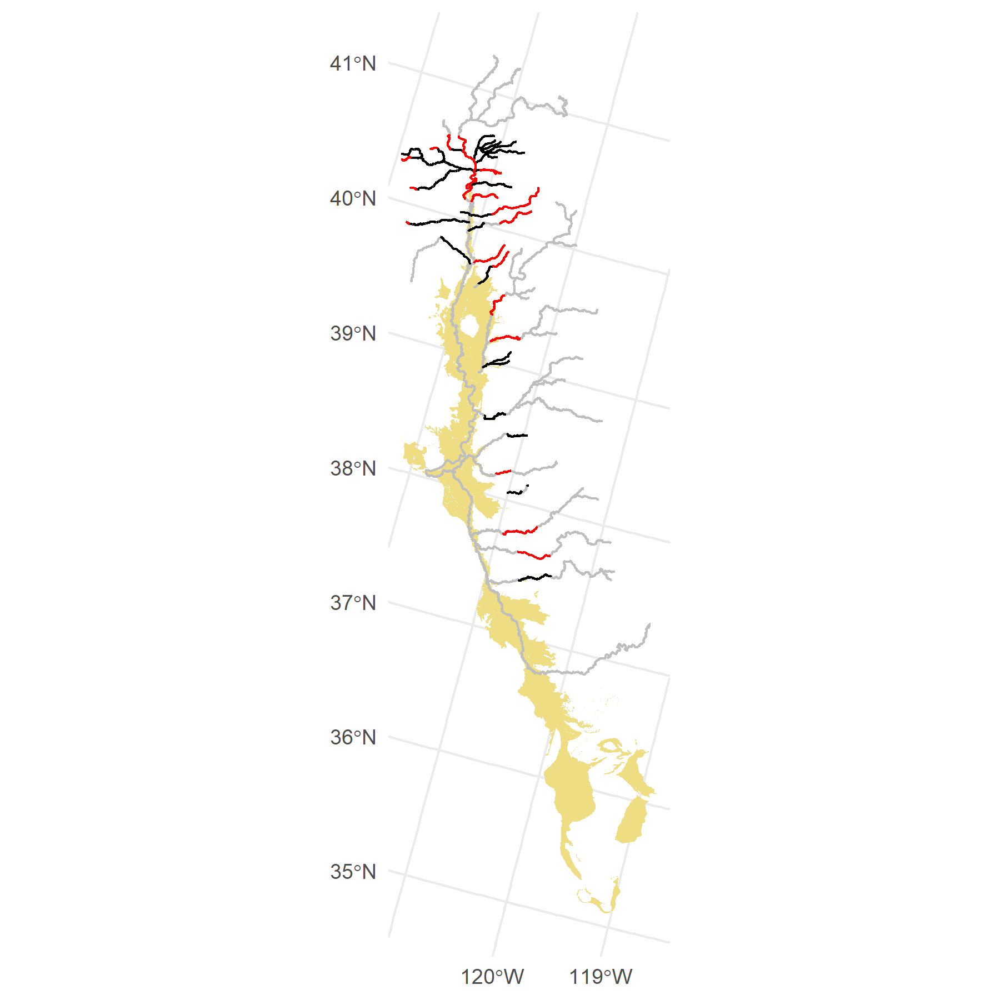<!-- -->

### UCD eFlows Geomorph Classes

``` r
#geomorph_class <- readRDS(here::here("data-raw", "results", "attr_geomorph_class.Rds"))
geomorph_classes <- readRDS(here::here("data-raw", "results", "attr_geomorph_class.Rds"))
geomorph_site_data <- readRDS(here::here("data-raw", "results", "geomorph_sites_ucd.Rds"))

geomorph_selected_reaches <- 
  flowlines |>
  inner_join(geomorph_classes, by=join_by(comid)) |>
  #filter(geomorph_class == "Unconfined, gravel-cobble, riffle-pool")
  #filter(str_detect(geomorph_class, "riffle-pool") | 
  #       str_detect(geomorph_class, "gravel") | 
  #       str_detect(geomorph_class, "low-gradient step-pool")) |>
  # for display purposes
  filter(comid %in% filter(flowline_attributes, da_area_sq_km > 50)$comid) 

ggplot() +
  geom_sf(data = valley_lowland, color=NA, fill="lightgoldenrod") +
  geom_sf(data = cvpia_extents, color="gray") +
  geom_sf(data = geomorph_selected_reaches, aes(color=geomorph_class)) +
  geom_sf(data = geomorph_site_data, aes(fill=geomorph_class), shape=21) +
  scale_fill_brewer(type="qual", palette="Paired", aesthetics = c("fill", "color")) +
  geom_sf(data = cvpia_extents_spawning |> st_line_sample(sample=c(0, 1)), color="black", size=1, shape=15)
```

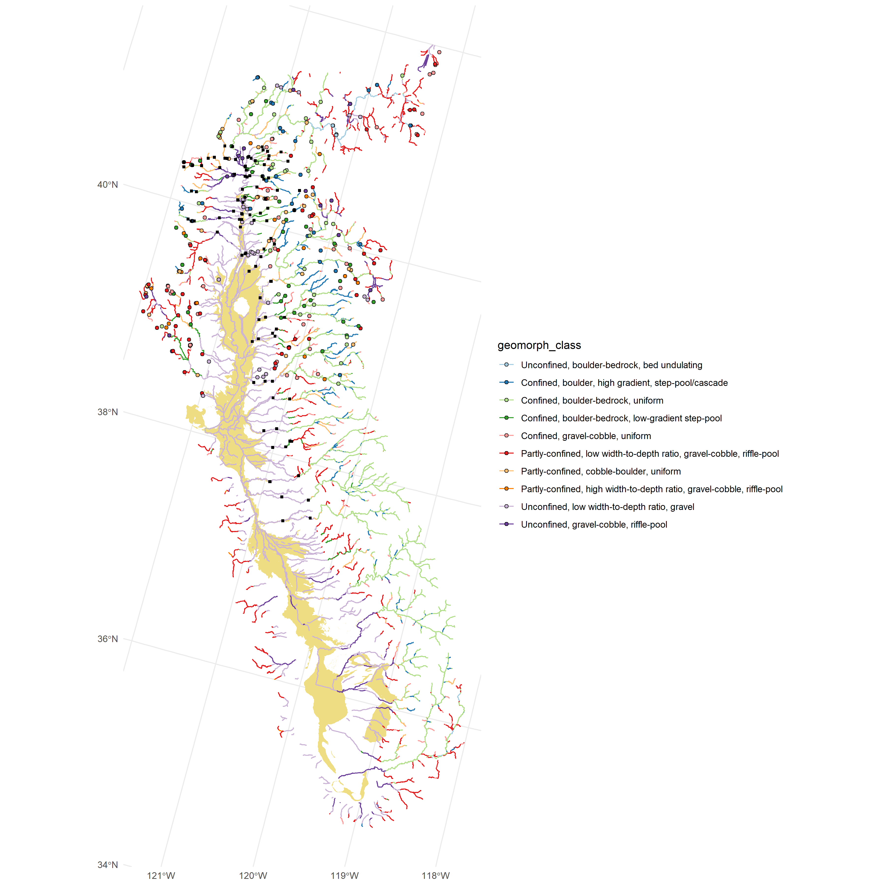<!-- -->

``` r
# breakdown of geomorph classes of geomorph sites that are within spawning reaches
spawning_reach_geomorph_sites <- 
  geomorph_site_data |> 
  filter(comid %in% cvpia_extents_nhd_spawning$comid) 

spawning_reach_geomorph_sites |>
  st_drop_geometry() |>
  group_by(geomorph_class) |>
  summarize(count = n()) |>
  arrange(-count)
```

    ## # A tibble: 8 × 2
    ##   geomorph_class                                                         count
    ##   <fct>                                                                  <int>
    ## 1 Partly-confined, cobble-boulder, uniform                                   6
    ## 2 Unconfined, low width-to-depth ratio, gravel                               5
    ## 3 Confined, boulder, high gradient, step-pool/cascade                        3
    ## 4 Confined, boulder-bedrock, uniform                                         3
    ## 5 Confined, boulder-bedrock, low-gradient step-pool                          3
    ## 6 Unconfined, gravel-cobble, riffle-pool                                     3
    ## 7 Partly-confined, high width-to-depth ratio, gravel-cobble, riffle-pool     2
    ## 8 Confined, gravel-cobble, uniform                                           1

``` r
# breakdown of spawning reaches by predicted geomorph class
spawning_reach_geomorph_classes <- 
  cvpia_extents_nhd_spawning |>
  left_join(geomorph_classes) 
```

    ## Joining with `by = join_by(comid)`

``` r
spawning_reach_geomorph_classes |>
  st_drop_geometry() |>
  group_by(geomorph_class) |>
  summarize(total_mi = sum(lengthkm) * 1000 / 0.3048 / 5280) |>
  arrange(-total_mi)
```

    ## # A tibble: 9 × 2
    ##   geomorph_class                                                        total_mi
    ##   <fct>                                                                    <dbl>
    ## 1 Unconfined, low width-to-depth ratio, gravel                           353.   
    ## 2 Confined, boulder-bedrock, uniform                                     138.   
    ## 3 Partly-confined, cobble-boulder, uniform                               111.   
    ## 4 Unconfined, gravel-cobble, riffle-pool                                  94.2  
    ## 5 Confined, boulder-bedrock, low-gradient step-pool                       49.3  
    ## 6 Confined, boulder, high gradient, step-pool/cascade                     32.2  
    ## 7 Partly-confined, low width-to-depth ratio, gravel-cobble, riffle-pool   28.9  
    ## 8 Confined, gravel-cobble, uniform                                        21.3  
    ## 9 <NA>                                                                     0.496

``` r
# plot
ggplot() + 
  geom_sf(data = spawning_reach_geomorph_classes, aes(color = geomorph_class)) + 
  geom_sf(data = spawning_reach_geomorph_sites, aes(fill = geomorph_class), shape=21) + 
  scale_fill_brewer(type="qual", palette="Paired", aesthetics = c("fill", "color"))
```

    ## Warning: Removed 8 rows containing missing values or values outside the scale range
    ## (`geom_sf()`).

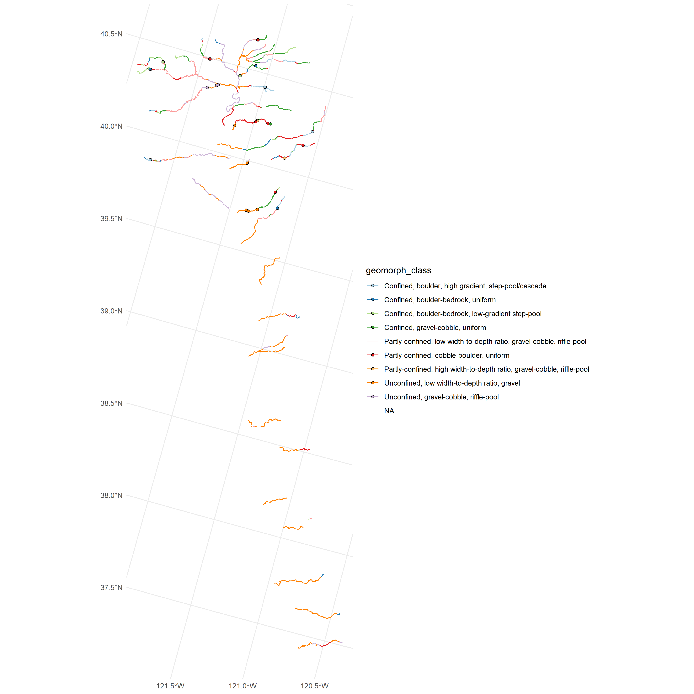<!-- -->

### Filter by Gradient and Elevation

``` r
cvpia_extents_nhd_spawning |>
  left_join(flowline_attributes) |>
  ggplot() + 
  geom_histogram(data=flowline_attributes, aes(x = slope, y = (after_stat(count / sum(count)))), alpha=0.5) + 
  geom_histogram(aes(x = slope, y = (after_stat(count / sum(count)))), fill="red", alpha=0.5) + 
  scale_x_log10() + 
  annotation_logticks(sides="b") + 
  geom_vline(aes(xintercept = 1E-02), linetype="dashed") +
  theme(panel.grid.minor = element_blank())
```

    ## Joining with `by = join_by(comid, gnis_id, gnis_name, lengthkm, reachcode,
    ## ftype, fcode)`
    ## `stat_bin()` using `bins = 30`. Pick better value with `binwidth`.

    ## Warning: Removed 38837 rows containing non-finite outside the scale range
    ## (`stat_bin()`).

    ## `stat_bin()` using `bins = 30`. Pick better value with `binwidth`.

    ## Warning: Removed 5 rows containing non-finite outside the scale range
    ## (`stat_bin()`).

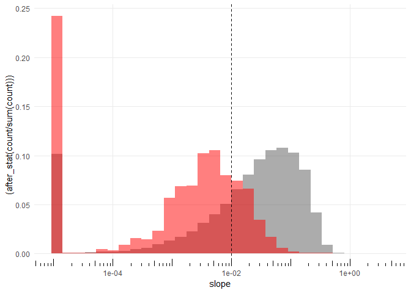<!-- -->

``` r
cvpia_extents_nhd_spawning |>
  left_join(flowline_attributes) |>
  ggplot() + 
  geom_histogram(data=flowline_attributes, aes(x = da_elev_min, y = (after_stat(count / sum(count)))), alpha=0.5) + 
  geom_histogram(aes(x = da_elev_min, y = (after_stat(count / sum(count)))), fill="red", alpha=0.5) +
  scale_x_log10() + 
  annotation_logticks(sides="b") + 
  geom_vline(aes(xintercept = 300), linetype="dashed") +
  theme(panel.grid.minor = element_blank())
```

    ## Joining with `by = join_by(comid, gnis_id, gnis_name, lengthkm, reachcode,
    ## ftype, fcode)`

    ## Warning in transformation$transform(x): NaNs produced

    ## Warning in scale_x_log10(): log-10 transformation introduced infinite values.

    ## `stat_bin()` using `bins = 30`. Pick better value with `binwidth`.

    ## Warning: Removed 39949 rows containing non-finite outside the scale range
    ## (`stat_bin()`).

    ## `stat_bin()` using `bins = 30`. Pick better value with `binwidth`.

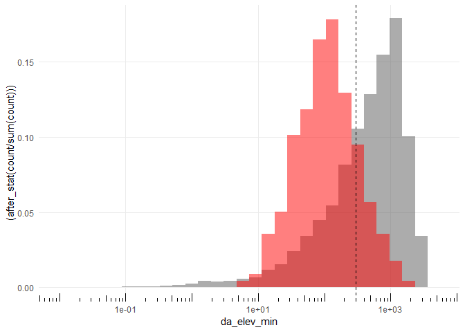<!-- -->

``` r
cvpia_extents_nhd_spawning |>
  left_join(flowline_attributes) |>
  ggplot() + 
  geom_histogram(data=flowline_attributes, aes(x = da_area_sq_km, y = (after_stat(count / sum(count)))), alpha=0.5) + 
  geom_histogram(aes(x = da_area_sq_km, y = (after_stat(count / sum(count)))), fill="red", alpha=0.5) + 
  scale_x_log10() + 
  annotation_logticks(sides="b") + 
  geom_vline(aes(xintercept = 1E02), linetype="dashed") +
  theme(panel.grid.minor = element_blank())
```

    ## Joining with `by = join_by(comid, gnis_id, gnis_name, lengthkm, reachcode,
    ## ftype, fcode)`

    ## Warning in scale_x_log10(): log-10 transformation introduced infinite values.

    ## `stat_bin()` using `bins = 30`. Pick better value with `binwidth`.

    ## Warning: Removed 37556 rows containing non-finite outside the scale range
    ## (`stat_bin()`).

    ## `stat_bin()` using `bins = 30`. Pick better value with `binwidth`.

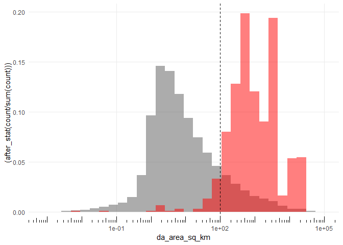<!-- -->

``` r
# filtered flowlines dataset
flowlines_filtered <- habistat::flowline_geom_proj |>
  # filter(comid %in% within_network_comids) |>
  left_join(habistat::flowline_attr) |>
  # filter for just the Sacramento and San Joaquin Basins
  filter(watershed_level_1 %in% c("Sacramento River", "San Joaquin River")) |>
  # filter based on size of the stream
  filter((((stream_order >= 4) & (da_area_sq_km > 1)) | ((stream_order >= 3) & (da_area_sq_km >= 50))) | 
           (comid %in% habistat::cv_mainstems$comid)) |>
  select(comid, geometry)
```

    ## Joining with `by = join_by(comid)`

``` r
flowlines_filtered |>
  ggplot() + geom_sf() + ggtitle("Flowlines Filtered by Stream Order and Drainage Area")
```

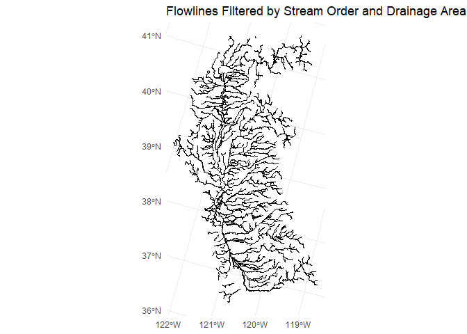<!-- -->

``` r
pisces_range_comid <- habistat::flowline_attr |>
  filter(range_cvchinook_historical) |> 
  pull(comid)

pisces_ranges <- 
  habistat::flowline_attr |> 
  transmute(comid, range = if_else(range_cvchinook_historical, "Within Historical Range", "Outside Historical Range")) |>
  st_drop_geometry()

flowlines_filtered |>
  left_join(pisces_ranges) |>
  filter(range == "Within Historical Range") |>
  ggplot() + geom_sf(aes(color = range)) + 
  geom_sf(data=spawning_mainstems, aes(color = "Spawning Mainstems")) +
  ggtitle("PISCES Ranges")
```

    ## Joining with `by = join_by(comid)`

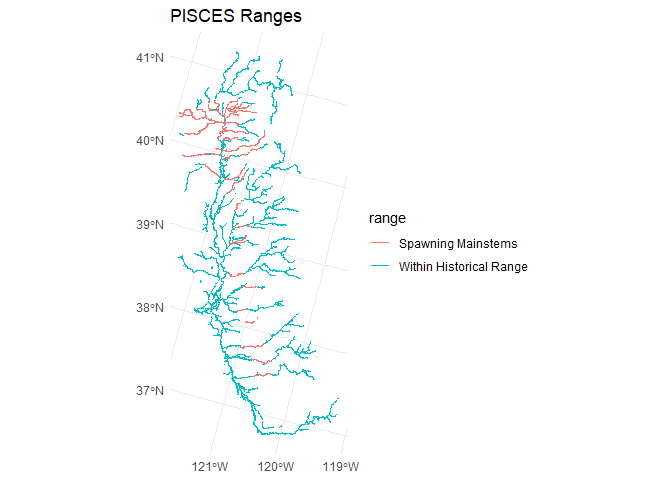<!-- -->

``` r
geomorph_filter_comid <- habistat::flowline_attr |>
  # # FILTER MAPPED CV CHINOOK RANGE (PISCES)
  # filter(range_cvchinook_extant) |> 
  # # FILTER HQT GRADIENT CLASS
  filter(hqt_gradient_class != "Valley Lowland")  |>
  # # FILTER GEOMORPH CLASSES
  filter(str_detect(geomorph_class, "riffle-pool") | 
         str_detect(geomorph_class, "gravel") | 
         str_detect(geomorph_class, "low-gradient step-pool")) |>
  #filter(slope <= 1E-2) |>
  pull(comid)

flowlines_filtered |>
  left_join(pisces_ranges) |>
  filter(comid %in% geomorph_filter_comid) |>
  ggplot() + geom_sf(aes(color = range)) + 
  geom_sf(data=spawning_mainstems, aes(color = "Spawning Mainstems")) +
  ggtitle("Geomorphic Filter")
```

    ## Joining with `by = join_by(comid)`

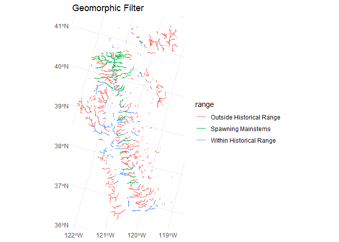<!-- -->

``` r
gradient_class_comid <- habistat::flowline_attr |>
  filter(hqt_gradient_class != "Valley Lowland")  |>
  pull(comid)

flowlines_filtered |>
  left_join(pisces_ranges) |>
  filter(comid %in% gradient_class_comid) |>
  ggplot() + geom_sf(aes(color = range)) + 
  geom_sf(data=spawning_mainstems, aes(color = "Spawning Mainstems")) +
  ggtitle("Gradient Class Filter")
```

    ## Joining with `by = join_by(comid)`

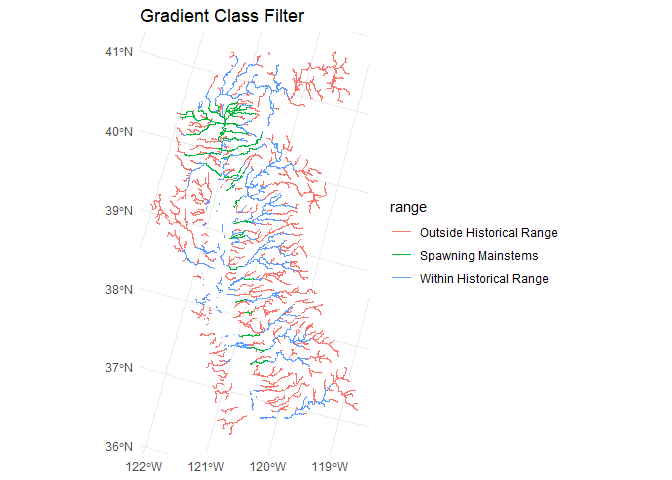<!-- -->

``` r
gradient_range_comid <- habistat::flowline_attr |>
  #filter(hqt_gradient_class != "Valley Lowland")  |>
  #filter(slope <= 1E-2) |>
  filter((slope <= 1E-1) & (slope >= 1E-3)) |>
  pull(comid)

flowlines_filtered |>
  left_join(pisces_ranges) |>
  filter(comid %in% gradient_range_comid) |>
  ggplot() + geom_sf(aes(color = range)) + 
  geom_sf(data=spawning_mainstems, aes(color = "Spawning Mainstems")) +
  ggtitle("Gradient Range Filter")
```

    ## Joining with `by = join_by(comid)`

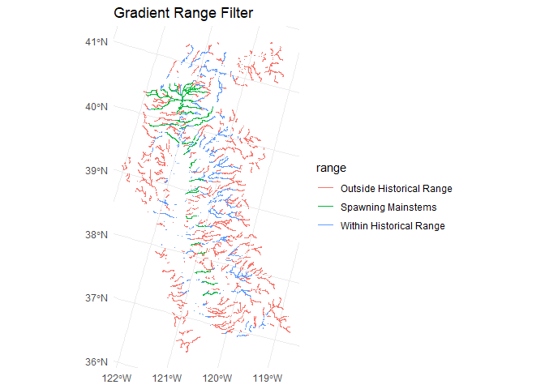<!-- -->

### Apply CVPIA watershed spawning ranges to adjacent tributaries

within each CVPIA watershed, get min and max of spawning flowline and
apply it to all streams within that watershed

``` r
# GET ELEVATION RANGES FOR EACH SPAWNING MAINSTEM
spawning_elevation_ranges <- 
  spawning_mainstems |> 
  left_join(habistat::flowline_attr |>
              select(comid, elev_min, elev_max, watershed_level_3)) |>
  group_by(watershed_level_3) |>
  summarize(spawning_elev_min = min(elev_min), 
            spawning_elev_max = max(elev_max)) |>
  st_drop_geometry()
```

    ## Joining with `by = join_by(comid)`

``` r
historical_elevation_ranges <- 
  historical_mainstems |> 
  left_join(habistat::flowline_attr |>
              select(comid, elev_min, elev_max, watershed_level_3)) |>
  group_by(watershed_level_3) |>
  summarize(historical_elev_min = min(elev_min), 
            historical_elev_max = max(elev_max)) |>
  st_drop_geometry()
```

    ## Joining with `by = join_by(comid)`

``` r
elevation_ranges <- 
  full_join(spawning_elevation_ranges, historical_elevation_ranges) |>
  mutate(query_elev_min = if_else(watershed_level_3 %in% c("Upper Sacramento River", "Upper San Joaquin River", "McCloud River", "Pit River"), 
                                  coalesce(spawning_elev_min, historical_elev_min), 
                                  spawning_elev_min),
         query_elev_max = if_else(watershed_level_3 %in% c("Upper Sacramento River", "Upper San Joaquin River", "McCloud River", "Pit River"), 
                                  coalesce(historical_elev_max, spawning_elev_max), 
                                  historical_elev_max))
```

    ## Joining with `by = join_by(watershed_level_3)`

``` r
elevation_ranges |>
  #select(watershed_level_3, query_elev_min, query_elev_max) |>
  knitr::kable()
```

| watershed_level_3       | spawning_elev_min | spawning_elev_max | historical_elev_min | historical_elev_max | query_elev_min | query_elev_max |
|:------------------------|------------------:|------------------:|--------------------:|--------------------:|---------------:|---------------:|
| American River          |              6.88 |             33.68 |                6.29 |             1395.78 |           6.88 |        1395.78 |
| Antelope Creek          |             81.91 |            400.40 |               64.74 |              400.40 |          81.91 |         400.40 |
| Battle Creek            |            102.86 |            467.03 |              102.86 |              467.03 |         102.86 |         467.03 |
| Bear Creek              |            111.00 |            403.83 |              111.00 |              403.83 |         111.00 |         403.83 |
| Bear River              |              9.89 |             60.16 |                9.89 |               60.16 |           9.89 |          60.16 |
| Big Chico Creek         |             35.91 |            360.39 |               35.91 |              360.39 |          35.91 |         360.39 |
| Butte Creek             |             29.68 |            320.47 |               27.81 |              320.47 |          29.68 |         320.47 |
| Calaveras River         |             38.58 |            164.74 |               38.58 |              164.74 |          38.58 |         164.74 |
| Clear Creek             |            128.46 |            294.58 |              128.46 |              409.98 |         128.46 |         409.98 |
| Cottonwood Creek        |            105.79 |            779.62 |              105.79 |              796.53 |         105.79 |         796.53 |
| Cow Creek               |            113.55 |           1434.78 |              113.55 |             1434.78 |         113.55 |        1434.78 |
| Deer Creek              |             51.80 |           1092.27 |               51.29 |             1092.27 |          51.80 |        1092.27 |
| Elder Creek             |             61.46 |             89.40 |               61.46 |               89.40 |          61.46 |          89.40 |
| Feather River           |             24.18 |             44.65 |                7.68 |             1499.90 |          24.18 |        1499.90 |
| Merced River            |             30.39 |             91.45 |               17.44 |              623.74 |          30.39 |         623.74 |
| Mill Creek              |             60.95 |           1669.79 |               60.95 |             1669.79 |          60.95 |        1669.79 |
| Mokelumne River         |             15.97 |             30.64 |                5.36 |              364.36 |          15.97 |         364.36 |
| Paynes Creek            |             79.80 |            974.41 |               79.80 |              974.41 |          79.80 |         974.41 |
| Sacramento River        |             34.25 |            153.34 |                5.67 |              311.23 |          34.25 |         311.23 |
| San Joaquin River       |             29.44 |            109.50 |                3.80 |              109.50 |          29.44 |         109.50 |
| Stanislaus River        |             23.23 |            102.71 |                6.50 |             1063.44 |          23.23 |        1063.44 |
| Stony Creek             |             44.73 |            113.73 |               44.73 |              310.07 |          44.73 |         310.07 |
| Thomes Creek            |             56.62 |            486.66 |               56.62 |              516.93 |          56.62 |         516.93 |
| Tuolumne River          |             22.57 |             80.73 |                7.33 |              854.89 |          22.57 |         854.89 |
| Yuba River              |             18.37 |             81.69 |               14.53 |             1569.78 |          18.37 |        1569.78 |
| McCloud River           |                NA |                NA |              325.42 |              924.43 |         325.42 |         924.43 |
| North Delta             |                NA |                NA |               -0.24 |                5.67 |             NA |           5.67 |
| Pit River               |                NA |                NA |              325.42 |             1012.90 |         325.42 |        1012.90 |
| South Delta             |                NA |                NA |                0.00 |                6.50 |             NA |           6.50 |
| Sutter Bypass           |                NA |                NA |                7.68 |                8.34 |             NA |           8.34 |
| Upper Sacramento River  |                NA |                NA |              311.23 |             1648.93 |         311.23 |        1648.93 |
| Upper San Joaquin River |                NA |                NA |               49.72 |             1016.16 |          49.72 |        1016.16 |

``` r
# PULL LIST OF COMIDS WITHIN SPAWNING ELEVATION RANGE
elevation_range_comid <- 
  habistat::flowline_attr |>
  #mutate(river_cvpia = watershed_level_3) |>
  inner_join(elevation_ranges) |>
  #filter(((elev_min >= spawning_elev_min) & (elev_max <= historical_elev_max))) |>
  filter(((elev_min >= query_elev_min) & (elev_max <= query_elev_max))) |>
  pull(comid)
```

    ## Joining with `by = join_by(watershed_level_3)`

``` r
flowlines_filtered |>
  left_join(pisces_ranges) |>
  filter(comid %in% elevation_range_comid) |>
  ggplot() + geom_sf(aes(color = range)) + 
  geom_sf(data=spawning_mainstems, aes(color = "Spawning Mainstems")) +
  ggtitle("Elevation Range Filter")
```

    ## Joining with `by = join_by(comid)`

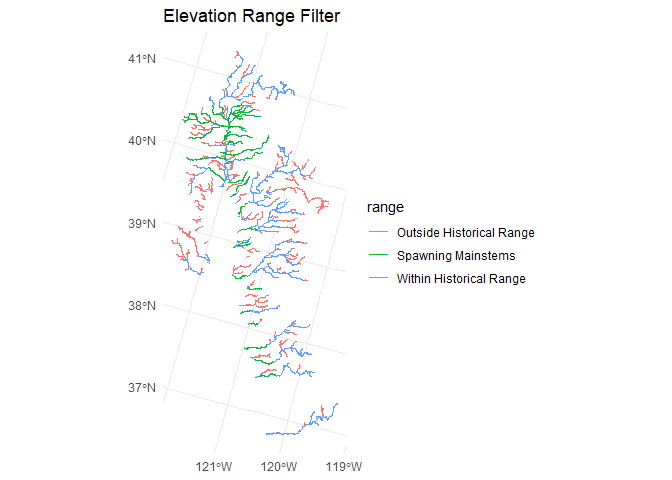<!-- -->

eliminate those that are not physically connected to the mainstems

use USGS COMID network search API to filter for tribs that flow into
mainstem spawning reaches

``` r
# FUNCTION TO PULL 
list_upstream_comids <- function(comid) {
  # USGS upstream trib search service
  # e.g. https://labs.waterdata.usgs.gov/api/nldi/linked-data/comid/12074740/navigation/UT/flowlines?f=json&distance=9999
  result <- nhdplusTools::navigate_nldi(list(featureSource = "comid", 
                                        featureID = comid), 
                                        mode = "upstreamTributaries", 
                                        distance_km = 9999)
  # returns a geojson, want just the list of comids
  return(as.integer(result$UT$nhdplus_comid))
}

# LIST COMIDS MATCHING NETWORK SEARCH AND ELEVATION RANGE FILTER
spawning_trib_comid <- 
  spawning_mainstems |>
  st_drop_geometry() |>
  left_join(habistat::flowline_attr |> select(comid, da_area_sq_km, watershed_level_3)) |>
  # keep just the farthest DS to minimize amount of searching needed
  #group_by(river_cvpia) |> filter(da_area_sq_km == max(da_area_sq_km)) |> ungroup() |>
  group_by(watershed_level_3) |> filter(da_area_sq_km == max(da_area_sq_km)) |> ungroup() |>
  # get tribuary network using USGS service
  mutate(trib_comids = map(comid, list_upstream_comids)) |>
  unnest(trib_comids) |>
  # apply the elevation range filter
  #filter(trib_comids %in% potential_spawning_comid) |>
  pull(trib_comids)
```

    ## Joining with `by = join_by(comid)`

``` r
flowlines_filtered |>
  left_join(pisces_ranges) |>
  filter(comid %in% spawning_trib_comid) |>
  filter(comid %in% elevation_range_comid) |>
  ggplot() + geom_sf(aes(color = range)) + 
  geom_sf(data=spawning_mainstems, aes(color = "Spawning Mainstems")) +
  ggtitle("Elevation Range Filter - Tributaries of Spawning Streams Only")
```

    ## Joining with `by = join_by(comid)`

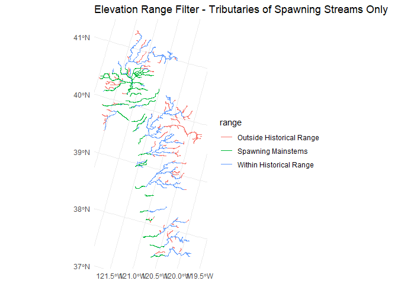<!-- -->

``` r
# LIST COMIDS MATCHING NETWORK SEARCH AND ELEVATION RANGE FILTER
rearing_trib_comid <- 
  historical_mainstems |>
  st_drop_geometry() |>
  left_join(habistat::flowline_attr |> select(comid, da_area_sq_km, watershed_level_3)) |>
  # keep just the farthest DS to minimize amount of searching needed
  #group_by(river_cvpia) |> filter(da_area_sq_km == max(da_area_sq_km)) |> ungroup() |>
  group_by(watershed_level_3) |> filter(da_area_sq_km == max(da_area_sq_km)) |> ungroup() |>
  # get tribuary network using USGS service
  mutate(trib_comids = map(comid, list_upstream_comids)) |>
  unnest(trib_comids) |>
  # apply the elevation range filter
  #filter(trib_comids %in% potential_spawning_comid) |>
  pull(trib_comids)
```

    ## Joining with `by = join_by(comid)`

``` r
flowlines_filtered |>
  left_join(pisces_ranges) |>
  filter(comid %in% rearing_trib_comid) |>
  filter(comid %in% elevation_range_comid) |>
  ggplot() + geom_sf(aes(color = range)) + 
  geom_sf(data=spawning_mainstems, aes(color = "Spawning Mainstems")) +
  ggtitle("Elevation Range Filter - Tributaries of Rearing Streams Only")
```

    ## Joining with `by = join_by(comid)`

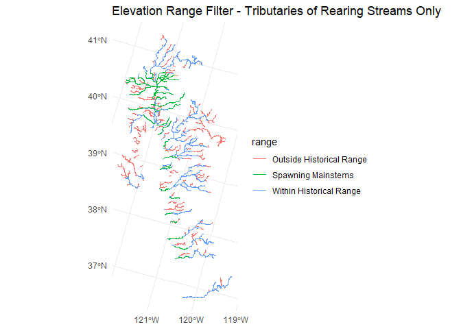<!-- -->

Test combining with additioanl filters – may be too strict

``` r
flowlines_filtered |>
  left_join(pisces_ranges) |>
  filter(comid %in% rearing_trib_comid) |>
  filter(comid %in% elevation_range_comid) |>
  filter(comid %in% gradient_range_comid) |>
  ggplot() + geom_sf(aes(color = range)) + 
  geom_sf(data=spawning_mainstems, aes(color = "Spawning Mainstems")) +
  ggtitle("Elevation, Gradient, and Tributary Filters")
```

    ## Joining with `by = join_by(comid)`

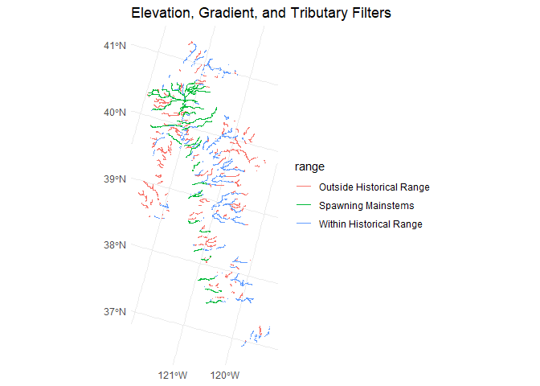<!-- -->

``` r
flowlines_filtered |>
  left_join(pisces_ranges) |>
  filter(comid %in% rearing_trib_comid) |>
  filter(comid %in% elevation_range_comid) |>
  filter(comid %in% geomorph_filter_comid) |>
  ggplot() + geom_sf(aes(color = range)) + 
  geom_sf(data=spawning_mainstems, aes(color = "Spawning Mainstems")) +
  ggtitle("Elevation, Geomorph, and Tributary Filters")
```

    ## Joining with `by = join_by(comid)`

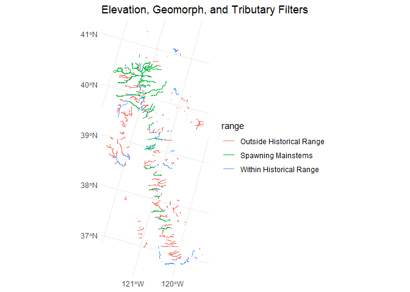<!-- -->

### Final version

Flowlines matching all of the following criteria:

- elevation \> minimum known spawning elevation for the watershed
- elevation \< maximum historical habitat elevation for the watershed
- tributary of a known rearing stream
- within a subcatchment identified as historical habitat in the PISCES
  dataset
- outside of the valley lowland area (i.e. in valley foothill or
  bedrock)
- (stream order \> 3 & drainage area \> 50 km2) OR (stream order \> 4)

``` r
spawning_flowlines_final <- flowlines_filtered |>
  filter((comid %in% spawning_mainstems$comid) | 
         ((comid %in% elevation_range_comid) &
          (comid %in% rearing_trib_comid) &
          (comid %in% pisces_range_comid) &
          (comid %in% gradient_class_comid) &
          (comid %in% flowlines_filtered$comid)))

spawning_flowlines_final |>
  ggplot() + 
  ggspatial::annotation_spatial(data=flowlines_filtered, color="#dddddd") +
  geom_sf(data=rearing_mainstems, aes(color = "Rearing Mainstems")) +
  geom_sf(aes(color = "Potential Spawning Habitat - All")) +
  geom_sf(data=spawning_mainstems, aes(color = "Potential Spawning Habitat - Mainstems")) +
  ggtitle("Final Spawning Reach Dataset") +
  scale_color_manual(name = "",
                     values = c("Potential Spawning Habitat - Mainstems" = "darkblue",
                                "Potential Spawning Habitat - All"= "cornflowerblue",
                                "Rearing Mainstems" = "darkgoldenrod"))
```

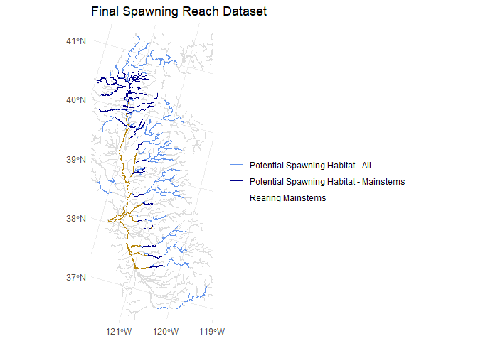<!-- -->

## Reach by Reach Analysis

### Sediment Transport Approach

Next, let’s locate particular reaches within this geographic scope that
are likely to have spawning gravels.

**During typical flows:**

Silts need to be in suspension so that they do not settle out and
bury/clog gravels. i.e. max grain size in suspension must be at least
0.0625 mm (phi = 4)

Mobilization threshold should not be so high as to scour gravels

**During high flows:**

Silts still need to be in suspension – see above.

Mobilization threshold *should* be high enough to mobilize gravels:

> Several uncertainties exist as to the suitability for successful
> spawning in the existing stream bed within Reach 1A, which include
> adequate (1) hyporheic and surface water exchange, (2) flow depth and
> velocity, (3) sediment attributes, and (4) hyporheic water quality.
> The channel area that currently contain and is expected to maintain
> each of these attributes in high quality should be used to quantify
> the amount of suitable spawning habitat. Most of these attributes and
> their contribution to spawning and incubation habitat quality are
> dependent on the maintenance of the spawning bed’s surface texture.
> **This maintenance is performed by occasional flows that are capable
> of dislodging the coarse grains (i.e., gravel and cobble), flushing
> the finer particles (e.g., sand and silt), and recruiting additional
> gravel.**

> After the completion of Friant Dam in the 1940s the reduced instream
> flow that ensued downstream resulted in a coarsened bed texture as
> finer grains were typically the only grains capable of being eroded.
> Several studies have concluded that mobilizing this coarsened bed
> surface as required to maintain salmon spawning habitat in Reach 1A
> generally requires flows in the range of 12,000 to 16,000 cfs (MEI,
> 2002; JSA and MEI, 2002; McBain and Trush, 2002; Stillwater Sciences,
> 2003), well above the maximum Restoration releases called for in the
> Settlement

- <https://www.restoresjr.net/?wpfb_dl=796>

``` r
# DEFINE WENTWORTH SIZE CLASSES
phi_levels <- seq(-12, 14, 1)
phi_labels <- c("very large boulder", "large boulder", "medium boulder", "small boulder", # -12:-9
                "large cobble", "small cobble", "very coarse gravel", "coarse gravel", # -8:-5
                "medium gravel", "fine gravel", "very fine gravel", "very coarse sand", # -4:-1
                "coarse sand", "medium sand", "fine sand", "very fine sand", # 0:3
                "coarse silt", "medium silt", "fine silt", "very fine silt", # 4:7
                "clay", "clay", "clay", "clay", "clay", "clay", "clay") # 8:14

tibble(phi = phi_levels, label = phi_labels) |> 
  mutate(max_diam_mm = 2^-phi) |> knitr::kable()
```

| phi | label              | max_diam_mm |
|----:|:-------------------|------------:|
| -12 | very large boulder |  4.0960e+03 |
| -11 | large boulder      |  2.0480e+03 |
| -10 | medium boulder     |  1.0240e+03 |
|  -9 | small boulder      |  5.1200e+02 |
|  -8 | large cobble       |  2.5600e+02 |
|  -7 | small cobble       |  1.2800e+02 |
|  -6 | very coarse gravel |  6.4000e+01 |
|  -5 | coarse gravel      |  3.2000e+01 |
|  -4 | medium gravel      |  1.6000e+01 |
|  -3 | fine gravel        |  8.0000e+00 |
|  -2 | very fine gravel   |  4.0000e+00 |
|  -1 | very coarse sand   |  2.0000e+00 |
|   0 | coarse sand        |  1.0000e+00 |
|   1 | medium sand        |  5.0000e-01 |
|   2 | fine sand          |  2.5000e-01 |
|   3 | very fine sand     |  1.2500e-01 |
|   4 | coarse silt        |  6.2500e-02 |
|   5 | medium silt        |  3.1250e-02 |
|   6 | fine silt          |  1.5625e-02 |
|   7 | very fine silt     |  7.8125e-03 |
|   8 | clay               |  3.9063e-03 |
|   9 | clay               |  1.9531e-03 |
|  10 | clay               |  9.7660e-04 |
|  11 | clay               |  4.8830e-04 |
|  12 | clay               |  2.4410e-04 |
|  13 | clay               |  1.2210e-04 |
|  14 | clay               |  6.1000e-05 |

<https://www.fs.usda.gov/Internet/FSE_DOCUMENTS/fsm91_054559.pdf>

``` r
# DEFINE CONSTANTS
# gravitational constant, cm/s2
g_cgs <- 981
# sedimetn grain density, g/cm3
rho_s_cgs <- 2.65
# water density, g/cm3
rho_cgs <- 1.00
# sediment specific_gravity
sed_sg <- rho_s_cgs / rho_cgs
# kinematic viscosity of water, cm2/s
nu_cgs <- 0.01

# CALCULATE BANKFULL BED MOBILIZATION AND SUSPENDED TRANSPORT
sediment_data <- flowline_attributes |>
  transmute(comid, slope, bf_depth_m, bf_width_m,
            # assume rectangular channel for the cross sectional area and wetted perimeter
            bf_xarea_m = bf_width_m * bf_depth_m,
            wetted_perimeter_m = (2 * bf_depth_m) + bf_width_m,
            hydraulic_radius_m = bf_xarea_m / wetted_perimeter_m,
            # Lamb et al. 2008 estiamte of critical Shield's parameter (tau*) based on slope
            critical_shields_number = 0.15 * slope^(1/4), 
            # Shields 1936 for uniform grains on flat bed: tau* = rho * hydraulic_radius * slope / ((sediment specific gravity - 1) * particle size)
            # This is a major simplificaiton assuming uniformity-- ideally we should account for particle of interest relative to D50 of reach-- but D50 is not known
            # Also, note that the depth-slope product for shear stress assumes hydraulic radius interchangeable for mean depth
            grain_size_mobilized_mm = 10 * rho_cgs * (hydraulic_radius_m * 100) * slope /  # hydraulic radius converted m to cm, result converted cm to mm
                                      (critical_shields_number * (sed_sg - 1)),
            grain_size_mobilized_phi = floor(-log(grain_size_mobilized_mm, 2)),
            largest_grain_class_mobilized = factor(grain_size_mobilized_phi, levels=phi_levels, labels=phi_labels),
            shear_velocity_cm_s = sqrt(g_cgs * (hydraulic_radius_m * 100) * slope),
            settling_velocity_ndim = rho_cgs * shear_velocity_cm_s^3 / 
                                     ((rho_s_cgs - rho_cgs) * g_cgs * nu_cgs),
            # dimensionless settling velocity = 1.71 * 10^-4 (dimensionless particle size)^2  (Dietrich, 1982, eq. 8)
            # dimensionless particle size = (rho_s - rho) * g * (particle size)^3 / (rho * nu^2)
            grain_size_suspended_ndim = sqrt(5832 * settling_velocity_ndim), # this is Dietrich, 1982, eq. 8, rearranged
            grain_size_suspended_mm = 10 * grain_size_suspended_ndim * rho_cgs * nu_cgs^2 /
                                      ((rho_s_cgs - rho_cgs) * g_cgs)^(1/3),
            grain_size_suspended_phi = floor(-log(grain_size_suspended_mm, 2)),
            largest_grain_class_suspended = factor(grain_size_suspended_phi, levels=phi_levels, labels=phi_labels))

spawning_flowlines_final |>
  left_join(sediment_data, by=join_by(comid)) |>
  pivot_longer(cols = c(largest_grain_class_mobilized, largest_grain_class_suspended)) |>
  mutate(name = str_replace(name, "largest_grain_class_", "")) |>
  filter(!is.na(value)) |>
  ggplot() + geom_sf(aes(color = value)) + facet_wrap(~name) +
  scale_color_discrete(name = "largest grain class") + 
  ggtitle("Bankfull bed mobilization and suspended transport")
```

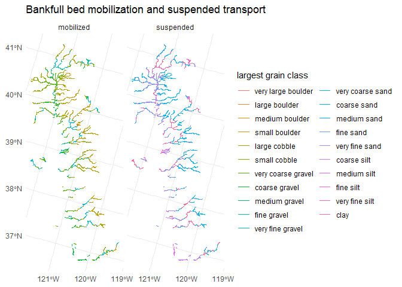<!-- -->

``` r
spawning_flowlines_final |>
  left_join(sediment_data, by=join_by(comid)) |>
  ggplot() + 
  geom_histogram(data=sediment_data, aes(x = -log(grain_size_mobilized_mm, 2), y = (after_stat(count / sum(count)))), alpha=0.5) + 
  geom_histogram(aes(x = -log(grain_size_mobilized_mm, 2), y = (after_stat(count / sum(count)))), fill="red", alpha=0.5) + 
  # scale_x_log10() + 
  # annotation_logticks(sides="b") + 
  # geom_vline(aes(xintercept = 0.0039, linetype="0.0039 mm Clay-Silt")) +
  # geom_vline(aes(xintercept = 0.0625, linetype="0.0625 mm Silt-Sand")) +
  # geom_vline(aes(xintercept = 2.0000, linetype="2.0000 mm Sand-Gravel")) +
  geom_vline(aes(xintercept = 8, linetype="Silt-Clay")) +
  geom_vline(aes(xintercept = 4, linetype="Sand-Silt")) +
  geom_vline(aes(xintercept = -1, linetype="Gravel-Sand")) +
  theme(panel.grid.minor = element_blank())
```

    ## `stat_bin()` using `bins = 30`. Pick better value with `binwidth`.

    ## Warning: Removed 39726 rows containing non-finite outside the scale range
    ## (`stat_bin()`).

    ## `stat_bin()` using `bins = 30`. Pick better value with `binwidth`.

    ## Warning: Removed 17 rows containing non-finite outside the scale range
    ## (`stat_bin()`).

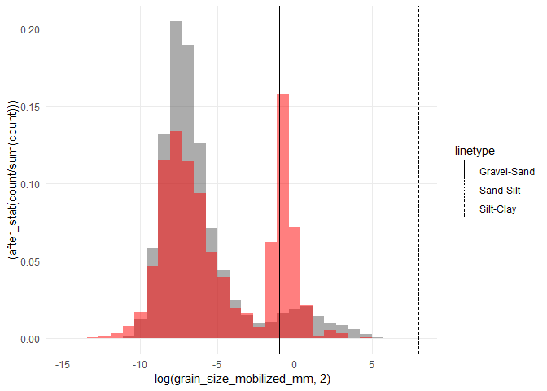<!-- -->

``` r
spawning_flowlines_final |>
  left_join(sediment_data, by=join_by(comid)) |>
  ggplot() + 
  geom_histogram(data=sediment_data, aes(x = -log(grain_size_suspended_mm, 2), y = (after_stat(count / sum(count)))), alpha=0.5) + 
  geom_histogram(aes(x = -log(grain_size_suspended_mm, 2), y = (after_stat(count / sum(count)))), fill="red", alpha=0.5) + 
  # scale_x_log10() + 
  # annotation_logticks(sides="b") + 
  # geom_vline(aes(xintercept = 0.0039, linetype="0.0039 mm Clay-Silt")) +
  # geom_vline(aes(xintercept = 0.0625, linetype="0.0625 mm Silt-Sand")) +
  # geom_vline(aes(xintercept = 2.0000, linetype="2.0000 mm Sand-Gravel")) +
  geom_vline(aes(xintercept = 8, linetype="Silt-Clay")) +
  geom_vline(aes(xintercept = 4, linetype="Sand-Silt")) +
  geom_vline(aes(xintercept = -1, linetype="Gravel-Sand")) +
  theme(panel.grid.minor = element_blank())
```

    ## `stat_bin()` using `bins = 30`. Pick better value with `binwidth`.

    ## Warning: Removed 39726 rows containing non-finite outside the scale range
    ## (`stat_bin()`).

    ## `stat_bin()` using `bins = 30`. Pick better value with `binwidth`.

    ## Warning: Removed 17 rows containing non-finite outside the scale range
    ## (`stat_bin()`).

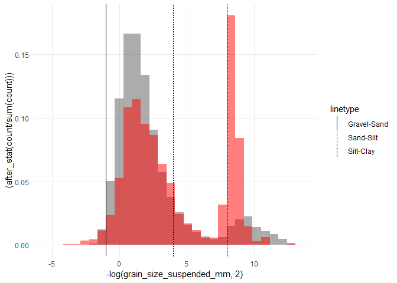<!-- -->

``` r
spawning_flowlines_final |>
  left_join(sediment_data, by=join_by(comid)) |>
  ggplot() + 
  geom_point(data=sediment_data, aes(x = -log(grain_size_mobilized_mm, 2), y = -log(grain_size_suspended_mm, 2)), alpha=0.5) + 
  geom_point(aes(x = -log(grain_size_mobilized_mm, 2), y = -log(grain_size_suspended_mm, 2)), color="red") + 
  geom_vline(aes(xintercept = 8, linetype="Silt-Clay")) +
  geom_vline(aes(xintercept = 4, linetype="Sand-Silt")) +
  geom_vline(aes(xintercept = -1, linetype="Gravel-Sand")) +
  geom_hline(aes(yintercept = 8, linetype="Silt-Clay")) +
  geom_hline(aes(yintercept = 4, linetype="Sand-Silt")) +
  geom_hline(aes(yintercept = -1, linetype="Gravel-Sand")) +
  theme(panel.grid.minor = element_blank())
```

    ## Warning: Removed 39726 rows containing missing values or values outside the scale range
    ## (`geom_point()`).

    ## Warning: Removed 17 rows containing missing values or values outside the scale range
    ## (`geom_point()`).

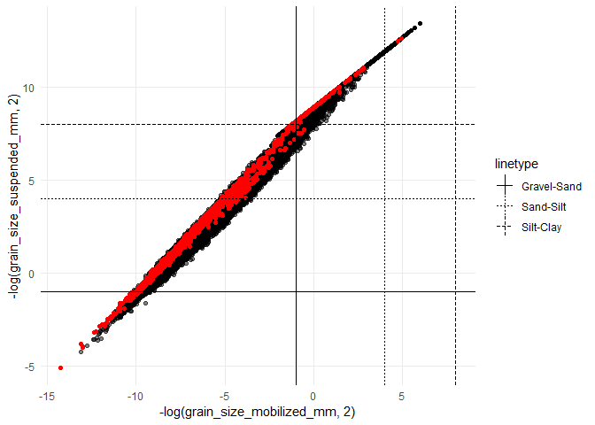<!-- -->

``` r
spawning_flowlines_final |>
  left_join(sediment_data, by=join_by(comid)) |>
  
  # eliminate reaches where largest grain size mobilized is within the silt or clay range
  filter(!(str_detect(largest_grain_class_suspended, "silt|clay"))) |> 
  
  # ensure that flows are sufficient to mobilize gravels/cobbles, but not so powerful as to be mobilizing boulders
  filter(str_detect(largest_grain_class_mobilized, "gravel|cobble")) |> 
  
  ggplot() +
  geom_sf(data=spawning_flowlines_final, aes(color="All Potential Spawning Habitat")) + 
  geom_sf(aes(color="Most Likely Spawning Gravel Reaches")) + 
  ggtitle("Spawning Gravel Likelihood based on Bankfull Sediment Transport") + 
  scale_color_manual(name = "", 
                     values = c("All Potential Spawning Habitat" = "cornflowerblue",
                                "Most Likely Spawning Gravel Reaches" = "mediumvioletred"))
```

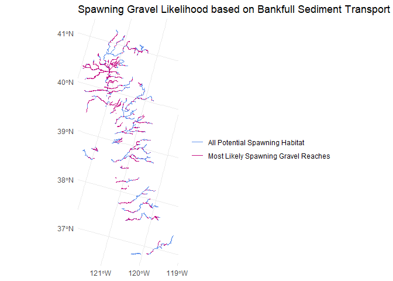<!-- -->

Validate this by looking at known redd locations

### Alternative Approach

Using the *predicted* UCD geomorph classifications

``` r
spawning_flowlines_final |>
  filter(comid %in% geomorph_filter_comid) |>
  ggplot() + 
  geom_sf(data=spawning_flowlines_final, aes(color="All Potential Spawning Habitat")) + 
  geom_sf(aes(color="Most Likely Spawning Gravel Reaches")) + 
  ggtitle("Spawning Gravel Likelihood based on Geomorphic Reach Classes") + 
  scale_color_manual(name = "", 
                     values = c("All Potential Spawning Habitat" = "cornflowerblue",
                                "Most Likely Spawning Gravel Reaches" = "mediumvioletred"))
```

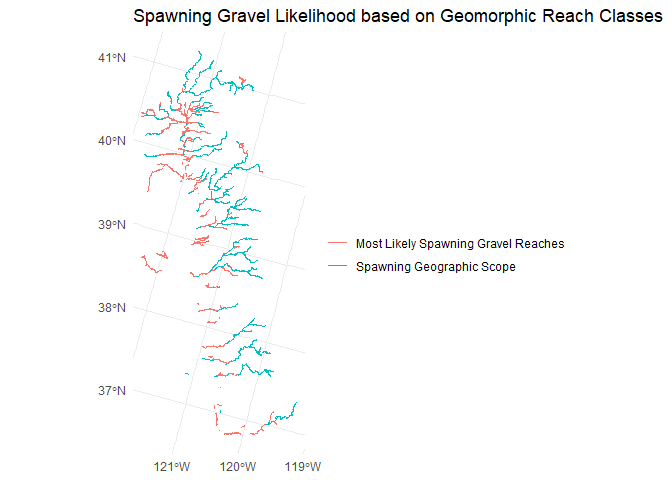<!-- -->

For a conservative (more inclusive) estimate, include reaches matching
either set of criteria

``` r
spawning_flowlines_final |>
  left_join(sediment_data, by=join_by(comid)) |>
  filter((!(str_detect(largest_grain_class_suspended, "silt|clay")) & 
            str_detect(largest_grain_class_mobilized, "gravel|cobble")) | 
           comid %in% geomorph_filter_comid) |>
  ggplot() +
  #ggspatial::annotation_spatial(data=flowlines_filtered, color="#dddddd") +
  geom_sf(data=spawning_flowlines_final, aes(color="Potential Spawning Habitat - All")) + 
  geom_sf(aes(color="Potential Spawning Habitat - Most Likely Spawning Gravels")) + 
  #scale_color_discrete(name = "") + 
  ggtitle("Spawning Gravel Likelihood") + 
  scale_color_manual(name = "", 
                     values = c("Potential Spawning Habitat - All" = "cornflowerblue",
                                "Potential Spawning Habitat - Most Likely Spawning Gravels" = "mediumvioletred"))
```

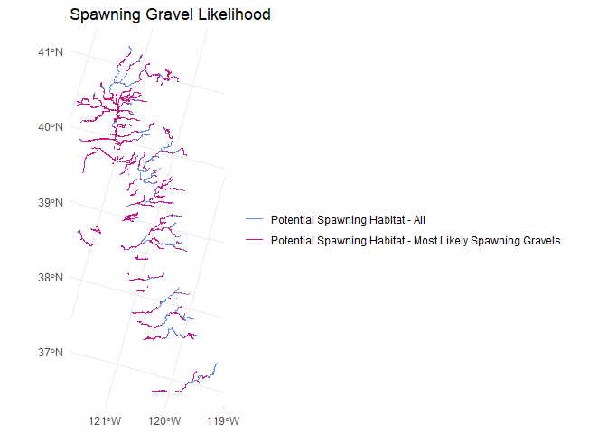<!-- -->

## Export result

``` r
spawning_context <- habistat::flowline_attr |>
  select(comid) |>
  left_join(sediment_data, by=join_by(comid)) |>
  transmute(comid,
            spawning_geographic_context = comid %in% spawning_flowlines_final$comid,
            spawning_gravel_via_sediment = 
              (!(str_detect(largest_grain_class_suspended, "silt|clay")) & 
                 str_detect(largest_grain_class_mobilized, "gravel|cobble")),
            spawning_gravel_via_geomorph = comid %in% geomorph_filter_comid,
            spawning_filter_all = spawning_geographic_context & 
              (spawning_gravel_via_sediment | spawning_gravel_via_geomorph))

spawning_context |> saveRDS(here::here("data-raw", "results", "spawning_context.Rds"))
```
