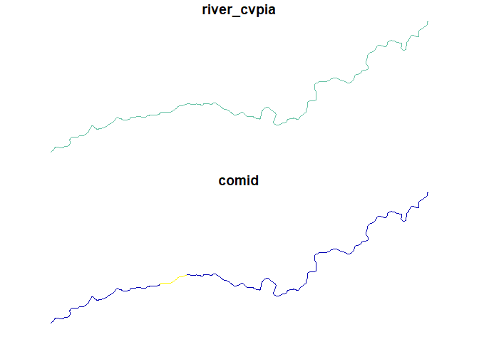
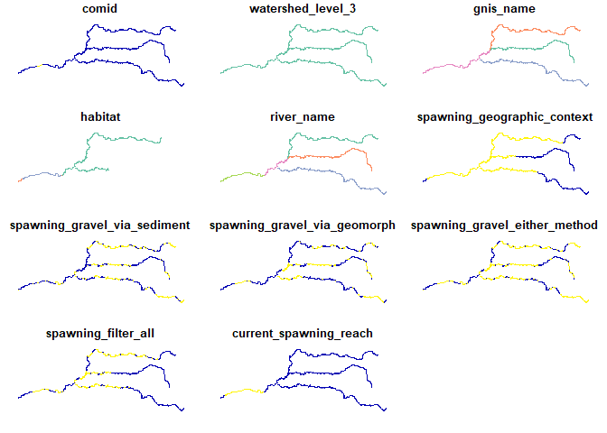
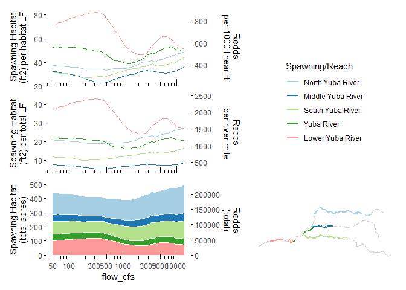
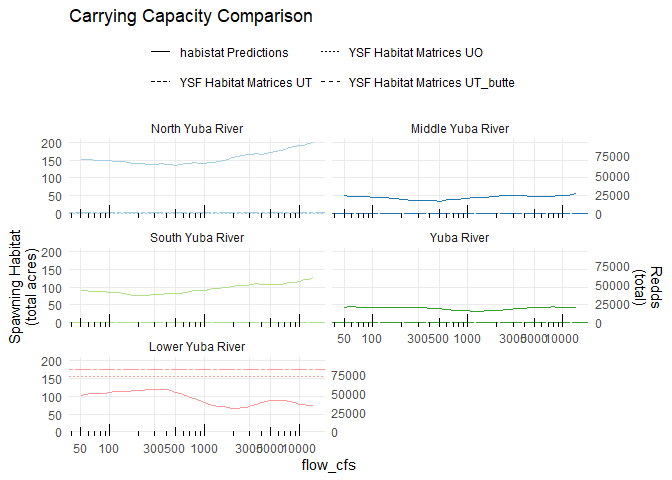
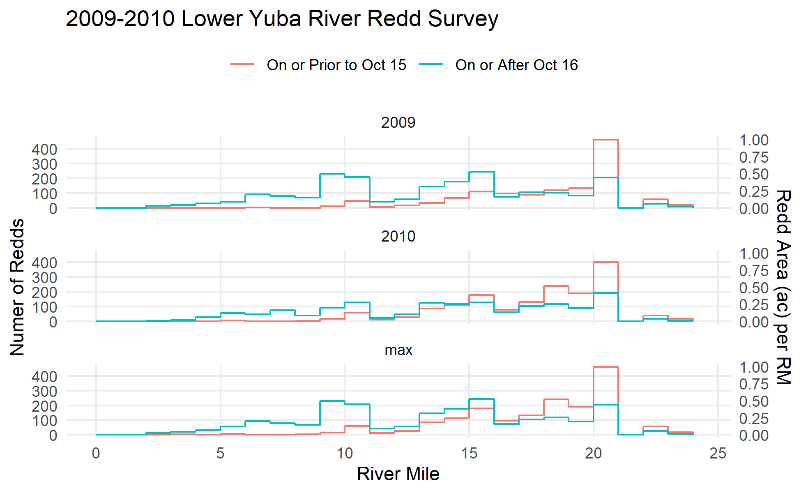
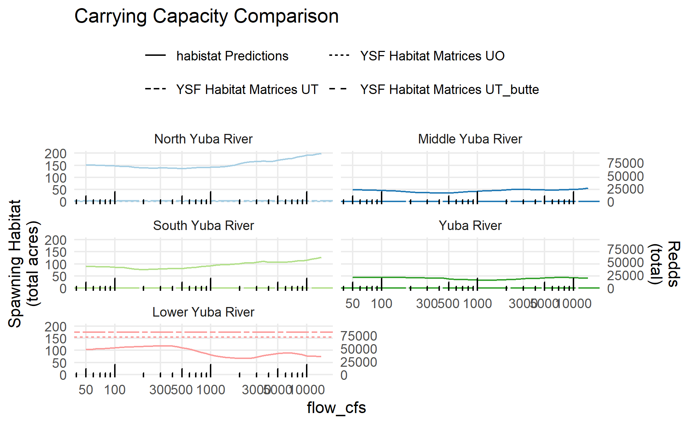
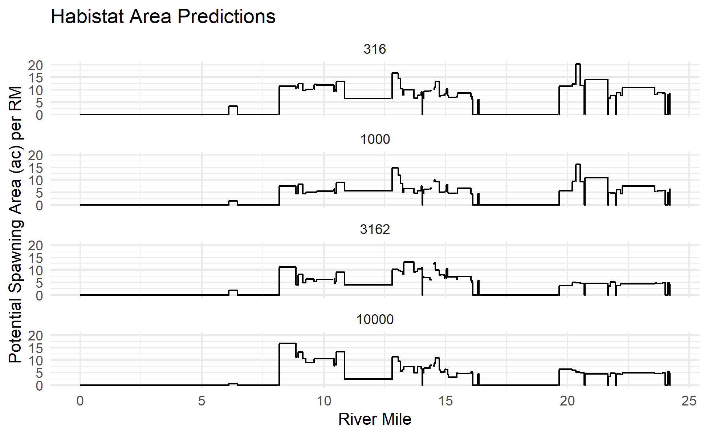
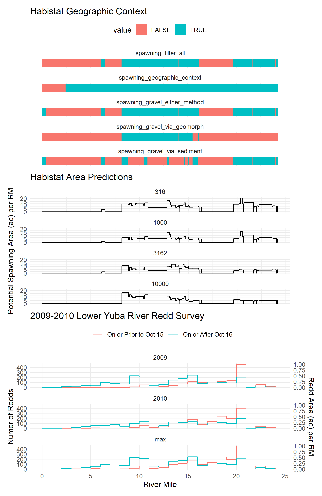

Spawning Gravel Carrying Capacity
================
[Skyler Lewis](mailto:slewis@flowwest.com)
2024-10-07

- [Yuba Case study](#yuba-case-study)
- [Actuals](#actuals)
- [Predictions](#predictions)
- [Compare against yuba relicensing
  estimates](#compare-against-yuba-relicensing-estimates)
- [Redds Survey](#redds-survey)
- [Generalize beyond Yuba](#generalize-beyond-yuba)
- [Summary of spawning lengths](#summary-of-spawning-lengths)

``` r
library(tidyverse)
```

    ## ── Attaching core tidyverse packages ──────────────────────── tidyverse 2.0.0 ──
    ## ✔ dplyr     1.1.4     ✔ readr     2.1.5
    ## ✔ forcats   1.0.0     ✔ stringr   1.5.1
    ## ✔ ggplot2   3.5.1     ✔ tibble    3.2.1
    ## ✔ lubridate 1.9.3     ✔ tidyr     1.3.1
    ## ✔ purrr     1.0.2     
    ## ── Conflicts ────────────────────────────────────────── tidyverse_conflicts() ──
    ## ✖ dplyr::filter() masks stats::filter()
    ## ✖ dplyr::lag()    masks stats::lag()
    ## ℹ Use the conflicted package (<http://conflicted.r-lib.org/>) to force all conflicts to become errors

``` r
library(sf)
```

    ## Linking to GEOS 3.12.1, GDAL 3.8.4, PROJ 9.3.1; sf_use_s2() is TRUE

``` r
library(habistat)
library(patchwork)
theme_set(theme_minimal())
glimpse_plot <- function(x, ...) {
  plot(x, ...)
  invisible(x)
}
knitr::opts_chunk$set(fig.width=6.5, fig.height=4, dpi=300)
```

## Yuba Case study

Map current and historical habitat reaches of the Yuba and its major
tributaries

``` r
habistat::cv_mainstems |> 
  filter(river_group == "Yuba River") |>
  filter(!is.na(habitat)) |>
  glimpse_plot()
```

<!-- -->

Map full lengths of Yuba and its major tributaries, and join in spawning
context layer

``` r
spawning_context <- 
  readRDS(here::here("data-raw", "results", "spawning_context.Rds"))

selected_streams <- 
  habistat::flowline_geom_proj |> 
  inner_join(habistat::flowline_attr |> select(comid, watershed_level_3, gnis_name), by=join_by(comid)) |>
  left_join(habistat::cv_mainstems |> st_drop_geometry() |> select(comid, habitat), by=join_by(comid)) |>
  filter(watershed_level_3 == "Yuba River") |> 
  filter(gnis_name %in% c("Yuba River", "Middle Yuba River", "North Yuba River", "South Yuba River")) |> 
  mutate(river_name = if_else(str_detect(coalesce(habitat,""), "rearing"), "Lower Yuba River", gnis_name) |>
         factor(levels = c("North Yuba River", "Middle Yuba River", "South Yuba River", "Yuba River", "Lower Yuba River"))) |>
  left_join(spawning_context, by=join_by(comid)) |>
  mutate(across(starts_with("spawning"), function(x) coalesce(x, FALSE))) |>
  mutate(current_spawning_reach = coalesce(str_detect(habitat, "spawning"), FALSE)) |>
  glimpse_plot(max.plot = Inf)
```

<!-- -->

## Actuals

Import estimates from the Yuba relicensing study

``` r
spawning_matrix_data <- read_csv(here::here("data-raw", "source", "spawning_data", "01_YSF-Habitat-Matrices-Report_table8_data.csv"), col_types = "cnnnnnnnnnnn") |>
  mutate(gnis_name = case_when(str_detect(reach, "North Yuba") ~ "North Yuba River",
                               str_detect(reach, "Middle Yuba") ~ "Middle Yuba River",
                               str_detect(reach, "South Yuba") ~ "South Yuba River",
                               TRUE ~ "Yuba River")) |>
  mutate(river_name = case_when(str_detect(reach, "North Yuba") ~ "North Yuba River",
                               str_detect(reach, "Middle Yuba") ~ "Middle Yuba River",
                               str_detect(reach, "South Yuba") ~ "South Yuba River",
                               str_detect(reach, "Lower Yuba") ~ "Lower Yuba River",
                               TRUE ~ "Yuba River")) |>
  glimpse()
```

    ## Warning: One or more parsing issues, call `problems()` on your data frame for details,
    ## e.g.:
    ##   dat <- vroom(...)
    ##   problems(dat)

    ## Rows: 28
    ## Columns: 13
    ## $ reach           <chr> "North Yuba River above New Bullards Bar Reservoir", "…
    ## $ year            <dbl> 2008, 2009, 2010, 2011, 2008, 2009, 2010, 2011, 2008, …
    ## $ length_UO       <dbl> 0.0, 0.0, 6.6, 23.4, 3.3, 3.7, 4.6, 5.7, 0.0, 0.0, 0.0…
    ## $ length_UT       <dbl> 7.7, 7.6, 24.0, 33.7, 7.5, 7.2, 9.8, 12.3, 0.0, 0.0, 0…
    ## $ length_UT_butte <dbl> 11.4, 11.2, 25.5, 33.7, 8.5, 8.1, 11.4, 14.8, 0.0, 0.0…
    ## $ gravel_UO       <dbl> 0, 0, 12, 195, 4, 5, 5, 10, 0, 0, 0, 0, NA, NA, NA, NA…
    ## $ gravel_UT       <dbl> 17, 17, 197, 316, 19, 18, 25, 42, 0, 0, 0, 4, NA, NA, …
    ## $ gravel_UT_butte <dbl> 29, 29, 202, 316, 22, 21, 36, 57, 0, 0, 0, 5, NA, NA, …
    ## $ redds_UO        <dbl> 0, 0, 129, 2069, 44, 51, 55, 110, 0, 0, 0, 0, NA, NA, …
    ## $ redds_UT        <dbl> 183, 179, 2094, 3358, 206, 190, 264, 451, 0, 0, 0, 40,…
    ## $ redds_UT_butte  <dbl> 305, 304, 2153, 3358, 238, 224, 379, 606, 0, 0, 0, 48,…
    ## $ gnis_name       <chr> "North Yuba River", "North Yuba River", "North Yuba Ri…
    ## $ river_name      <chr> "North Yuba River", "North Yuba River", "North Yuba Ri…

Summarize

``` r
spawning_matrix_summary <-
  spawning_matrix_data |>
  group_by(river_name, year) |>
  summarize(across(c(starts_with("length_"), starts_with("gravel_"), starts_with("redds_")), function(x) sum(x, na.rm=T)), .groups="drop") |>
  group_by(river_name) |>
  summarize(across(c(starts_with("length_"), starts_with("gravel_"), starts_with("redds_")), mean)) |>
  pivot_longer(cols = -river_name) |>
  separate(name, sep = "_", into = c("name", "method"), extra = "merge") |>
  pivot_wider() |>
  transmute(river_name = river_name |> factor(levels = c("North Yuba River", "Middle Yuba River", "South Yuba River", "Yuba River", "Lower Yuba River")),
            method,
            actual_length_mi = length, # units are miles
            actual_gravel_ac = gravel * 1000 / 43560)

spawning_matrix_summary |> knitr::kable()
```

| river_name        | method   | actual_length_mi | actual_gravel_ac |
|:------------------|:---------|-----------------:|-----------------:|
| Lower Yuba River  | UO       |           18.125 |      154.4765840 |
| Lower Yuba River  | UT       |           24.000 |      175.7174013 |
| Lower Yuba River  | UT_butte |           24.000 |      175.7174013 |
| Middle Yuba River | UO       |            4.325 |        0.1377410 |
| Middle Yuba River | UT       |            9.200 |        0.5968779 |
| Middle Yuba River | UT_butte |           10.700 |        0.7805326 |
| North Yuba River  | UO       |            9.800 |        1.1880165 |
| North Yuba River  | UT       |           20.550 |        3.1393480 |
| North Yuba River  | UT_butte |           22.750 |        3.3057851 |
| South Yuba River  | UO       |            0.000 |        0.0000000 |
| South Yuba River  | UT       |            0.750 |        0.0229568 |
| South Yuba River  | UT_butte |            0.875 |        0.0286961 |
| Yuba River        | UO       |            1.700 |        0.1377410 |
| Yuba River        | UT       |            1.700 |        0.1377410 |
| Yuba River        | UT_butte |            1.700 |        0.1377410 |

## Predictions

Look at predictions

``` r
lower_yuba_river <-
  habistat::cv_mainstems |>
  filter(river_cvpia == "Yuba River" & str_detect(habitat, "rearing"))

spawning_predictions_comid <- 
  habistat::wua_predicted |>
  inner_join(selected_streams |> select(comid, current_spawning_reach)) |>
  filter(habitat == "spawning") |>
  filter(model_name == "SD") |>
  filter(comid %in% filter(spawning_context, spawning_filter_all)$comid) |>
  inner_join(habistat::flowline_attr |> select(comid, gnis_name)) |>
  filter(gnis_name %in% c("Yuba River", "Middle Yuba River", "North Yuba River", "South Yuba River")) |>
  mutate(river_name = if_else(comid %in% lower_yuba_river$comid, "Lower Yuba River", gnis_name) |>
         factor(levels = c("North Yuba River", "Middle Yuba River", "South Yuba River", "Yuba River", "Lower Yuba River"))) 
```

    ## Joining with `by = join_by(comid)`
    ## Joining with `by = join_by(comid)`

``` r
total_reach_lengths <-
  habistat::flowline_attr |>
  mutate(river_name = if_else(comid %in% lower_yuba_river$comid, "Lower Yuba River", gnis_name) |>
         factor(levels = c("North Yuba River", "Middle Yuba River", "South Yuba River", "Yuba River", "Lower Yuba River"))) |>
  group_by(river_name) |> 
  summarize(river_length_ft = sum(reach_length_ft), .groups="drop") |>
  drop_na()

spawning_predictions <- 
  spawning_predictions_comid |>
  group_by(river_name, flow_cfs) |>
  mutate(total_wua_ft2 = wua_per_lf_pred * reach_length_ft) |>
  summarize(total_length_ft = sum(reach_length_ft),
            total_wua_ft2 = sum(total_wua_ft2),
            wua_ft2_per_lf = total_wua_ft2 / total_length_ft) |>
  left_join(total_reach_lengths, by=join_by(river_name)) |>
  mutate(wua_ft2_per_tot_lf = total_wua_ft2 / river_length_ft)
```

    ## `summarise()` has grouped output by 'river_name'. You can override using the
    ## `.groups` argument.

``` r
plt_wua <- spawning_predictions |>
  ggplot() + geom_line(aes(x = flow_cfs, y = wua_ft2_per_lf, color = river_name)) + 
  scale_x_log10(breaks = scales::breaks_log(10)) + annotation_logticks(sides="b") +
  ylab("Spawning Habitat\n(ft2) per habitat LF") + guides(color = "none") +
  scale_y_continuous(sec.axis = sec_axis(name = "Redds \nper 1000 linear ft", transform = ~./94*1000)) +
  scale_color_brewer(name = "Spawning/Reach", aesthetics = c("color", "fill"), palette="Paired")

plt_wua2 <- spawning_predictions |>
  ggplot() + geom_line(aes(x = flow_cfs, y = wua_ft2_per_tot_lf, color = river_name)) + 
  scale_x_log10(breaks = scales::breaks_log(10)) + annotation_logticks(sides="b") +
  ylab("Spawning Habitat\n(ft2) per total LF") + guides(color = "none") +
  scale_y_continuous(sec.axis = sec_axis(name = "Redds \nper river mile", transform = ~./94*5280)) +
  scale_color_brewer(name = "Spawning/Reach", aesthetics = c("color", "fill"), palette="Paired")

plt_tot <- spawning_predictions |>
  ggplot() + geom_area(aes(x = flow_cfs, y = total_wua_ft2 / 43560, fill = river_name), color = "white") + 
  scale_x_log10(breaks = scales::breaks_log(10)) + annotation_logticks(sides="b") +
  ylab("Spawning Habitat\n(total acres)") + guides(color = "none", fill = "none") + 
  scale_y_continuous(sec.axis = sec_axis(name = "Redds\n(total)", transform = ~./94*43560)) + 
  scale_color_brewer(name = "Spawning/Reach", aesthetics = c("color", "fill"), palette="Paired")

plt_map <- selected_streams |>
  filter(comid %in% spawning_predictions_comid$comid) |>
  ggplot() + geom_sf(data=selected_streams, color="lightgray") + 
  geom_sf(aes(color = river_name), linewidth=1) +
  theme(panel.grid = element_blank(), axis.text = element_blank()) + 
  scale_color_brewer(name = "Spawning/Reach", aesthetics = c("color", "fill"), palette="Paired")

((plt_wua / plt_wua2 / plt_tot) + 
    plot_layout(axes = "collect") & 
    theme(panel.grid.major = element_blank(), panel.grid.minor = element_blank(), axis.ticks.y = element_line())) | 
  (guide_area() / plt_map) +
  plot_layout(guides = "collect") 
```

<!-- -->

``` r
carrying_capacity <- 
  spawning_predictions |>
  mutate(ccap_redds = total_wua_ft2 / 94) # 01_YSF-Habitat-Matrices-Report estimate: 94ft^2/redd

carrying_capacity_summary <- 
  carrying_capacity |> 
  mutate(ccap_redds = total_wua_ft2 / 94) |>
  group_by(river_name) |> 
  summarize(at_flow = flow_cfs[which.max(ccap_redds)],
            ccap_redds = max(ccap_redds), .groups="drop") 

carrying_capacity_summary |> knitr::kable()
```

| river_name        |    at_flow | ccap_redds |
|:------------------|-----------:|-----------:|
| North Yuba River  | 14125.3754 |   92507.25 |
| Middle Yuba River | 14125.3754 |   26286.72 |
| South Yuba River  | 14125.3754 |   58621.43 |
| Yuba River        |  7943.2823 |   20698.51 |
| Lower Yuba River  |   316.2278 |   55177.78 |

Length of spawning habitat

``` r
stream_lengths_spawning_habitat <- 
  selected_streams |>
  filter(spawning_filter_all) |>
  group_by(river_name) |>
  summarize(length_ft = sum(st_length(geometry)) |> units::set_units("ft") |> units::drop_units(),
            length_mi = length_ft / 5280) |>
  st_drop_geometry()

stream_lengths_spawning_habitat |> knitr::kable()
```

| river_name        | length_ft | length_mi |
|:------------------|----------:|----------:|
| North Yuba River  | 177490.65 | 33.615653 |
| Middle Yuba River |  67309.20 | 12.747955 |
| South Yuba River  | 124733.39 | 23.623749 |
| Yuba River        |  36522.23 |  6.917089 |
| Lower Yuba River  |  63167.75 | 11.963589 |

Amount of spawning gravel and number of redds

Using the max value across all flows

``` r
stream_spawning_areas <- 
  spawning_predictions |>
  group_by(river_name) |>
  summarize(across(c(total_length_ft, total_wua_ft2, wua_ft2_per_lf), max), .groups="drop") |>
  mutate(spawn_area_ft2_1000 = total_wua_ft2 / 1000,
         spawn_area_acres = total_wua_ft2 / 43560,
         n_redds = total_wua_ft2 / 94) # 94 ft2 per redd

stream_spawning_areas |> knitr::kable()
```

| river_name        | total_length_ft | total_wua_ft2 | wua_ft2_per_lf | spawn_area_ft2_1000 | spawn_area_acres |  n_redds |
|:------------------|----------------:|--------------:|---------------:|--------------------:|-----------------:|---------:|
| North Yuba River  |       177500.00 |       8695682 |       48.98976 |            8695.682 |        199.62539 | 92507.25 |
| Middle Yuba River |        67309.71 |       2470952 |       36.71018 |            2470.952 |         56.72524 | 26286.72 |
| South Yuba River  |       124727.69 |       5510415 |       44.17956 |            5510.415 |        126.50171 | 58621.43 |
| Yuba River        |        36525.59 |       1945660 |       53.26840 |            1945.660 |         44.66620 | 20698.51 |
| Lower Yuba River  |        63044.62 |       5186711 |       82.27048 |            5186.711 |        119.07051 | 55177.78 |

## Compare against yuba relicensing estimates

Compare

``` r
spawning_matrix_summary |>
  inner_join(stream_lengths_spawning_habitat |> 
               group_by(river_name) |> 
               summarize(predicted_length_mi = sum(length_mi), .groups="drop"), 
             by=join_by(river_name)) |>
  inner_join(stream_spawning_areas |> 
               group_by(river_name) |> 
               summarize(predicted_spawning_ac = sum(spawn_area_acres), .groups="drop"), 
             by=join_by(river_name)) |>
  mutate(ratio_length = (predicted_length_mi / actual_length_mi) |> num(digits = 2),
         ratio_gravel = (predicted_spawning_ac / actual_gravel_ac) |> num(digits = 2)) |>
  select(river_name, method, 
         actual_length_mi, predicted_length_mi, ratio_length,
         actual_gravel_ac, predicted_spawning_ac, ratio_gravel) |>
  knitr::kable()
```

| river_name        | method   | actual_length_mi | predicted_length_mi | ratio_length | actual_gravel_ac | predicted_spawning_ac | ratio_gravel |
|:------------------|:---------|-----------------:|--------------------:|-------------:|-----------------:|----------------------:|-------------:|
| Lower Yuba River  | UO       |           18.125 |           11.963589 |         0.66 |      154.4765840 |             119.07051 |         0.77 |
| Lower Yuba River  | UT       |           24.000 |           11.963589 |         0.50 |      175.7174013 |             119.07051 |         0.68 |
| Lower Yuba River  | UT_butte |           24.000 |           11.963589 |         0.50 |      175.7174013 |             119.07051 |         0.68 |
| Middle Yuba River | UO       |            4.325 |           12.747955 |         2.95 |        0.1377410 |              56.72524 |       411.83 |
| Middle Yuba River | UT       |            9.200 |           12.747955 |         1.39 |        0.5968779 |              56.72524 |        95.04 |
| Middle Yuba River | UT_butte |           10.700 |           12.747955 |         1.19 |        0.7805326 |              56.72524 |        72.68 |
| North Yuba River  | UO       |            9.800 |           33.615653 |         3.43 |        1.1880165 |             199.62539 |       168.03 |
| North Yuba River  | UT       |           20.550 |           33.615653 |         1.64 |        3.1393480 |             199.62539 |        63.59 |
| North Yuba River  | UT_butte |           22.750 |           33.615653 |         1.48 |        3.3057851 |             199.62539 |        60.39 |
| South Yuba River  | UO       |            0.000 |           23.623749 |          Inf |        0.0000000 |             126.50171 |          Inf |
| South Yuba River  | UT       |            0.750 |           23.623749 |        31.50 |        0.0229568 |             126.50171 |      5510.41 |
| South Yuba River  | UT_butte |            0.875 |           23.623749 |        27.00 |        0.0286961 |             126.50171 |      4408.33 |
| Yuba River        | UO       |            1.700 |            6.917089 |         4.07 |        0.1377410 |              44.66620 |       324.28 |
| Yuba River        | UT       |            1.700 |            6.917089 |         4.07 |        0.1377410 |              44.66620 |       324.28 |
| Yuba River        | UT_butte |            1.700 |            6.917089 |         4.07 |        0.1377410 |              44.66620 |       324.28 |

``` r
spawning_predictions |>
  ggplot() + 
  geom_line(aes(x = flow_cfs, y = (total_wua_ft2 / 43560), color = river_name, linetype = "habistat Predictions")) + 
  #geom_line(aes(x = flow_cfs, y = (total_wua_ft2 / 43560) - actual_gravel_ac, color = river_name)) + 
  geom_hline(data = spawning_matrix_summary, aes(yintercept = actual_gravel_ac, color = river_name, linetype = paste("YSF Habitat Matrices", method))) +
  scale_x_log10(breaks = scales::breaks_log(10)) + annotation_logticks(sides="b") +
  ylab("Spawning Habitat\n(total acres)") + guides(color = "none", fill = "none") + 
  scale_y_continuous(sec.axis = sec_axis(name = "Redds\n(total)", transform = ~./94*43560)) + 
  scale_color_brewer(name = "Spawning/Reach", aesthetics = c("color", "fill"), palette="Paired") +
  facet_wrap(~river_name, ncol=2)  + theme(legend.position = "top", panel.grid.minor = element_blank()) +
  ggtitle("Carrying Capacity Comparison") + 
  guides(linetype = guide_legend(nrow=2, byrow=TRUE, title = ""))
```

<!-- -->

## Redds Survey

RM 0 is at the mouth of the river, and RM 24.3 is at the base of
Englebright Dam.

``` r
lyr_redd_survey <- read_csv(here::here("data-raw", "source", "spawning_data", "spring-run_and_fall-run_redds_for_Rene_data.csv")) |>
  janitor::clean_names() |>
  select(-redds_total) |>
  pivot_longer(starts_with("redds")) |>
  separate(name, sep = "_", into = c("var", "year")) |>
  separate(rm, sep = " - ", into = c("rm_start", "rm_end")) |>
  mutate(across(starts_with("rm_"), as.numeric)) |>
  mutate(time_range = factor(time_range, levels = c("On or Prior to Oct 15", "On or After Oct 16"))) |>
  select(-var) %>%
  bind_rows(. |>
    group_by(rm_start, rm_end, time_range) |>
    summarize(value = max(value)) |>
    mutate(year = "max"))
```

    ## Rows: 50 Columns: 5
    ## ── Column specification ────────────────────────────────────────────────────────
    ## Delimiter: ","
    ## chr (2): RM, Time Range
    ## dbl (3): Redds 2009, Redds 2010, Redds Total
    ## 
    ## ℹ Use `spec()` to retrieve the full column specification for this data.
    ## ℹ Specify the column types or set `show_col_types = FALSE` to quiet this message.
    ## `summarise()` has grouped output by 'rm_start', 'rm_end'. You can override using the `.groups` argument.

``` r
lyr_redd_survey |>
  group_by(year, time_range) |>
  summarize(total_redds = sum(value)) |>
  mutate(spawning_area_ac = total_redds * 94 / 43560) |>
  select(time_range, year, total_redds, spawning_area_ac) |>
  arrange(time_range, year)
```

    ## `summarise()` has grouped output by 'year'. You can override using the
    ## `.groups` argument.

    ## # A tibble: 6 × 4
    ## # Groups:   year [3]
    ##   time_range            year  total_redds spawning_area_ac
    ##   <fct>                 <chr>       <dbl>            <dbl>
    ## 1 On or Prior to Oct 15 2009         1263             2.73
    ## 2 On or Prior to Oct 15 2010         1600             3.45
    ## 3 On or Prior to Oct 15 max          1702             3.67
    ## 4 On or After Oct 16    2009         2046             4.42
    ## 5 On or After Oct 16    2010         1499             3.23
    ## 6 On or After Oct 16    max          2082             4.49

``` r
plt_redd_survey <-
  lyr_redd_survey |>
  ggplot() + 
  geom_step(aes(x = rm_start, y = value, color = time_range)) +
  xlab("River Mile") + ylab("Numer of Redds") + 
  facet_wrap(~year, ncol=1)  +
  ggtitle("2009-2010 Lower Yuba River Redd Survey") + 
  guides(color = guide_legend(nrow=1, byrow=TRUE, title = "")) +
  scale_y_continuous(sec.axis = sec_axis(name = "Redd Area (ac) per RM", transform = ~.*94/43560)) +
  theme(panel.grid.minor = element_blank(), legend.position="top") +
  scale_x_continuous(limits = c(0, 24.3))

print(plt_redd_survey)
```

<!-- -->

``` r
lyr_rm <- selected_streams |>
  filter(river_name == "Lower Yuba River") |>
  inner_join(habistat::flowline_attr |> select(comid, hydro_seq, reach_length_ft), by=join_by(comid)) |>
  arrange(hydro_seq) |>
  mutate(reach_length_mi = reach_length_ft / 5280,
         river_seq = row_number(),
         cum_length_end = cumsum(reach_length_mi),
         cum_length_start = cum_length_end - reach_length_mi,
         rm_start = scales::rescale(cum_length_start, 
                                    from = c(min(cum_length_start), max(cum_length_end)), 
                                    to = c(0, 24.3)),
         rm_end = scales::rescale(cum_length_end, 
                                    from = c(min(cum_length_start), max(cum_length_end)), 
                                    to = c(0, 24.3))) 

plt_spawning_filters <-
  lyr_rm |>
  pivot_longer(cols = starts_with("spawning_")) |>
  ggplot() + 
  facet_wrap(~name, ncol=1) +
  geom_rect(aes(xmin = rm_start, xmax = rm_end, ymin = -1, ymax = 1, fill = value)) +
  theme(panel.grid.major.y = element_blank(), 
        panel.grid.minor.y = element_blank(), 
        axis.text.y = element_blank(),
        legend.position = "top") +
  xlab("River Mile") + ggtitle("Habistat Geographic Context")

print(plt_spawning_filters)
```

<!-- -->

``` r
plt_habistat_by_rm <-
  lyr_rm |> 
  st_drop_geometry() |> 
  select(comid, rm_start, rm_end, spawning_filter_all) |>
  expand_grid(flow_idx = c(316, 1000, 3162, 10000)) |>
  left_join(spawning_predictions_comid, by=join_by(comid, flow_idx), relationship="one-to-one") |>
  #group_by(comid, rm_start, rm_end) |> 
  #summarize(wua_per_lf_pred = max(wua_per_lf_pred)) |>
  ggplot() +
  geom_step(aes(x = rm_start, y = if_else(spawning_filter_all, wua_per_lf_pred * 5280 / 43560, 0))) + 
  facet_wrap(~flow_idx, ncol = 1) + 
  ylab("Potential Spawning Area (ac) per RM") + xlab("River Mile") + 
  ggtitle("Habistat Area Predictions")

print(plt_habistat_by_rm)
```

<!-- -->

``` r
(plt_spawning_filters / plt_habistat_by_rm / plt_redd_survey) + plot_layout(axes = "collect")
```

<!-- -->

## Generalize beyond Yuba

Define river miles upon which to map results

``` r
  # length = vector of reach lengths
  # start = numbering system start
  # end = numbering system end
  # vectors should be already ordered
define_rm_start <- function(length, start, end) {
  cum_length_end <- cumsum(length)
  cum_length_start <- cum_length_end - length
  scales::rescale(cum_length_start,
                  from = c(min(cum_length_start), max(cum_length_end)), 
                  to = c(first(start), first(end)))
}

rm_reaches <- 
  tribble(~river_name,       ~river_cvpia,         ~ds_comid, ~ds_rm, ~us_comid, ~us_rm,
          "Mokelumne River", c("Mokelumne River", 
                               "South Mokelumne River"), 1889628,  -0.2, 3953353,  63.5, 
          "American River",   "American River",          15024919, -0.1, 15025009, 16.1,
          "Lower Yuba River", "Yuba River",              7982918, 0, 8062555, 24.3,
          "Feather River",    "Feather River",           7978071, -0.1, 7968113, 67.2,
          "Mill Creek",       "Mill Creek",              NA, NA, NA, NA,
          "Battle Creek",     "Battle Creek",            NA, NA, NA, NA,
          "Clear Creek",      "Clear Creek",             NA, NA, NA, NA)

comid_with_rm <- 
  rm_reaches |>
  drop_na() |>
  unnest(river_cvpia) |>
  inner_join(habistat::cv_mainstems) |>
  inner_join(habistat::flowline_attr |>
               select(comid, hydro_seq, reach_length_ft)) |>
  mutate(reach_length_mi = reach_length_ft / 5280) |>
  group_by(river_name, ds_rm, us_rm) |>
  arrange(river_name, hydro_seq) |>
  mutate(rm_start = define_rm_start(reach_length_ft, ds_rm, us_rm)) |>
  mutate(rm_end = rm_start + reach_length_mi) |>
  ungroup() |>
  select(river_name, comid, reach_length_mi, rm_start, rm_end)
```

    ## Joining with `by = join_by(river_cvpia)`
    ## Joining with `by = join_by(comid)`

``` r
comid_with_rm |>
  left_join(spawning_context, by=join_by(comid)) |>
  mutate(across(starts_with("spawning"), function(x) coalesce(x, FALSE))) |>
  #mutate(current_spawning_reach = coalesce(str_detect(habitat, "spawning"), FALSE)) |> 
  pivot_longer(cols = starts_with("spawning_")) |>
  filter(name == "spawning_filter_all") |>
  ggplot() + 
  facet_wrap(~river_name, ncol=1) +
  #facet_grid(cols = vars(river_name), rows = vars(name), scales = "free_x", space = "free_x", switch = "y") +
  geom_rect(aes(xmin = rm_start, xmax = rm_end, ymin = -1, ymax = 1, fill = value)) +
  theme(panel.grid.major.y = element_blank(), 
        panel.grid.minor.y = element_blank(), 
        axis.text.y = element_blank(),
        legend.position = "top") +
  xlab("River Mile") + ggtitle("Habistat Geographic Context")
```

<!-- -->

## Summary of spawning lengths

``` r
spawning_length_summary <- 
  habistat::cv_mainstems |>
  st_drop_geometry() |>
  inner_join(habistat::flowline_attr |> select(comid, reach_length_ft)) |>
  inner_join(spawning_context, by=join_by(comid)) |>
  mutate(identity = T) |>
  pivot_longer(cols = c(identity, starts_with("spawning_"))) |>
  mutate(spawning_rm = value * reach_length_ft / 5280) |>
  group_by(river_group, river_cvpia, name) |>
  summarize(spawning_rm = sum(spawning_rm)) 
```

    ## Joining with `by = join_by(comid)`
    ## `summarise()` has grouped output by 'river_group', 'river_cvpia'. You can
    ## override using the `.groups` argument.

``` r
var_labels <- tribble(
  ~name,                           ~label,                                                         ~color,
  "identity",                      "All Reaches",                                                  "gray",
  "spawning_geographic_context",   "CVPIA/Elevation Range",                                        "orange",
  "spawning_gravel_via_geomorph",  "Gravels via UCD Geomorph Class only",                          "darkcyan",
  "spawning_gravel_via_sediment",  "Gravels via Sediment Transport only",                          "darkturquoise",
  "spawning_gravel_either_method", "Gravels matching either method",                               "darkblue",
  "spawning_filter_all",           "Gravels matching either method, within CVPIA/Elevation Range", "mediumvioletred")

spawning_length_summary |>
  mutate(name = factor(name, levels = var_labels$name, labels = var_labels$label)) |>
  group_by(river_group, name) |>
  summarize(spawning_rm = sum(spawning_rm)) |>
  ggplot(aes(y = name, x = spawning_rm)) +
  facet_wrap(~river_group, ncol=4, scales="free_x") +
  geom_col(aes(fill = name), width=1, color="white") +
  theme(legend.position = "top",
        axis.text.y = element_blank(),
        panel.grid.minor = element_blank(),
        panel.grid.major.y = element_blank(),
        legend.key.size = unit(12, "pt"),
        legend.key.spacing.y = unit(0, "pt"),
        strip.text = element_text(size=8)) +
  guides(color = "none", fill = guide_legend(nrow=6, byrow=F, title = "")) +
  scale_y_discrete(limits=rev) + ylab("") + xlab("River Miles") +
  scale_fill_manual(values = var_labels$color)
```

    ## `summarise()` has grouped output by 'river_group'. You can override using the
    ## `.groups` argument.

<!-- -->
