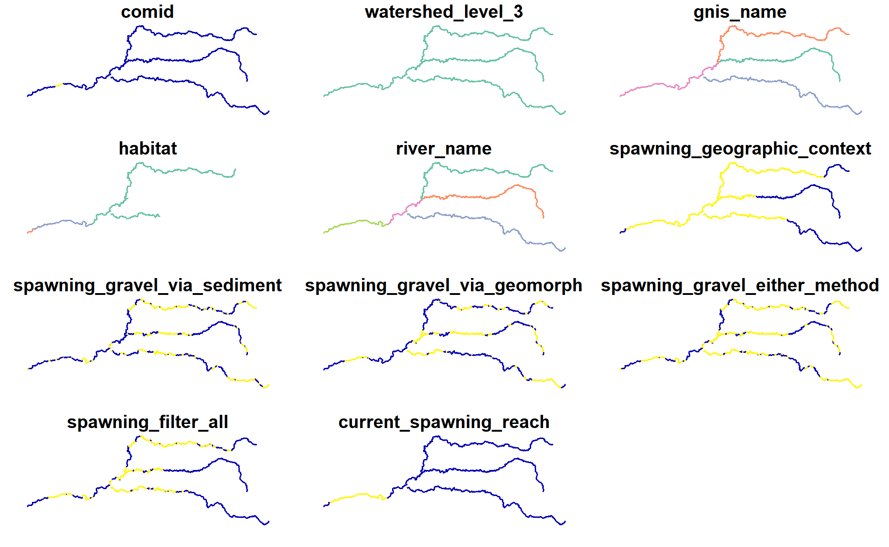
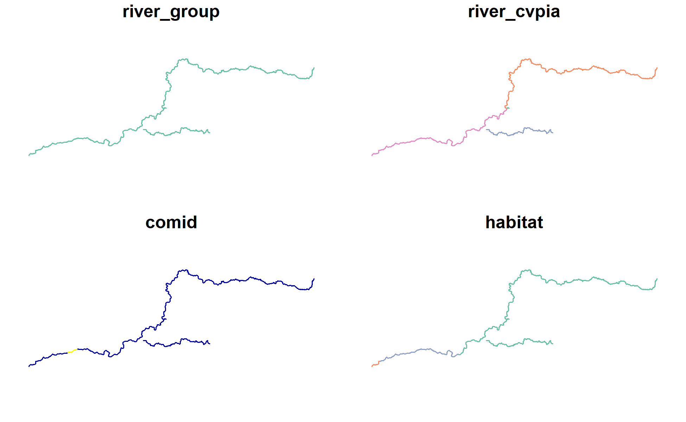

Spawning Gravel Carrying Capacity
================
[Skyler Lewis](mailto:slewis@flowwest.com)
2024-09-12

``` r
library(tidyverse)
```

    ## ── Attaching core tidyverse packages ──────────────────────── tidyverse 2.0.0 ──
    ## ✔ dplyr     1.1.4     ✔ readr     2.1.5
    ## ✔ forcats   1.0.0     ✔ stringr   1.5.1
    ## ✔ ggplot2   3.5.1     ✔ tibble    3.2.1
    ## ✔ lubridate 1.9.3     ✔ tidyr     1.3.1
    ## ✔ purrr     1.0.2     
    ## ── Conflicts ────────────────────────────────────────── tidyverse_conflicts() ──
    ## ✖ dplyr::filter() masks stats::filter()
    ## ✖ dplyr::lag()    masks stats::lag()
    ## ℹ Use the conflicted package (<http://conflicted.r-lib.org/>) to force all conflicts to become errors

``` r
library(sf)
```

    ## Linking to GEOS 3.12.1, GDAL 3.8.4, PROJ 9.3.1; sf_use_s2() is TRUE

``` r
library(habistat)
library(patchwork)
theme_set(theme_minimal())
```

CVPIA stream “Yuba River” is just the Lower Yuba River

``` r
habistat::cv_mainstems |> filter(str_detect(river_cvpia, "Yuba")) |> plot()
```

<!-- -->

Take all Yuba River mainstems instead

``` r
selected_streams <- 
habistat::flowline_geom_proj |> 
  inner_join(habistat::flowline_attr |> select(comid, watershed_level_3, gnis_name, river_cvpia)) |>
  filter(watershed_level_3 == "Yuba River") |> 
  filter(gnis_name %in% c("Yuba River", "Middle Yuba River", "North Yuba River", "South Yuba River")) 
```

    ## Joining with `by = join_by(comid)`

``` r
selected_streams |> plot()
```

<!-- -->

Filter for spawning context (likely spawning gravels)

``` r
spawning_context <- readRDS(here::here("data-raw", "results", "spawning_context.Rds")) |>
  glimpse()
```

    ## Rows: 178,868
    ## Columns: 5
    ## $ comid                        <dbl> 20245062, 24085230, 22226684, 22226720, 2…
    ## $ spawning_geographic_context  <lgl> FALSE, FALSE, FALSE, FALSE, FALSE, FALSE,…
    ## $ spawning_gravel_via_sediment <lgl> NA, NA, FALSE, FALSE, FALSE, TRUE, TRUE, …
    ## $ spawning_gravel_via_geomorph <lgl> FALSE, FALSE, FALSE, FALSE, FALSE, FALSE,…
    ## $ spawning_filter_all          <lgl> FALSE, FALSE, FALSE, FALSE, FALSE, FALSE,…

``` r
selected_streams |>
  filter(comid %in% filter(spawning_context, spawning_filter_all)$comid) |>
  plot()
```

<!-- -->

\*\*These are weird at the margins because of the flow range filter.
Need to use unfiltered version in `wua_predicted` – filter only for map
display not for calculations.

``` r
spawning_predictions_comid <- 
habistat::wua_predicted |>
  filter(comid %in% selected_streams$comid) |>
  filter(habitat == "spawning") |>
  filter(comid %in% filter(spawning_context, spawning_filter_all)$comid) |>
  inner_join(habistat::flowline_attr |> select(comid, gnis_name)) |>
  filter(gnis_name %in% c("Yuba River", "Middle Yuba River", "North Yuba River", "South Yuba River"))
```

    ## Joining with `by = join_by(comid)`

``` r
spawning_predictions <- 
  spawning_predictions_comid |>
  group_by(gnis_name, flow_cfs) |>
  mutate(total_wua_ft2 = wua_per_lf_pred * reach_length_ft) |>
  summarize(total_wua_ft2 = sum(total_wua_ft2)) |>
  inner_join(habistat::flowline_attr |> 
               group_by(gnis_name) |> 
               summarize(reach_length_ft = sum(reach_length_ft))) |>
  mutate(wua_ft2_per_lf = total_wua_ft2 / reach_length_ft)
```

    ## `summarise()` has grouped output by 'gnis_name'. You can override using the
    ## `.groups` argument.
    ## Joining with `by = join_by(gnis_name)`

``` r
spawning_predictions <- 
  spawning_predictions_comid |>
  group_by(gnis_name, flow_cfs) |>
  mutate(total_wua_ft2 = wua_per_lf_pred * reach_length_ft) |>
  summarize(total_length_ft = sum(reach_length_ft),
            total_wua_ft2 = sum(total_wua_ft2),
            wua_ft2_per_lf = total_wua_ft2 / total_length_ft) 
```

    ## `summarise()` has grouped output by 'gnis_name'. You can override using the
    ## `.groups` argument.

``` r
plt_wua <- spawning_predictions |>
  ggplot() + geom_line(aes(x = flow_cfs, y = wua_ft2_per_lf, color = gnis_name)) + 
  scale_x_log10()
plt_tot <- spawning_predictions |>
  ggplot() + geom_line(aes(x = flow_cfs, y = total_wua_ft2 / 43560, color = gnis_name)) + 
  scale_x_log10()
(plt_wua / plt_tot) + plot_layout(axes = "collect", guides = "collect")
```

<!-- -->

``` r
carrying_capacity <- 
spawning_predictions |>
  mutate(ccap_redds = total_wua_ft2 / 94) 
# 01_YSF-Habitat-Matrices-Report estimate: 94ft^2/redd

plt_ccap <- carrying_capacity |>
  ggplot() + #geom_line(aes(x = flow_cfs, y = ccap_redds, color = gnis_name)) + 
  scale_x_log10() + geom_hline(data = carrying_capacity |> 
                                 group_by(gnis_name) |> 
                                 summarize(ccap_redds = max(ccap_redds)), 
                               aes(yintercept = ccap_redds, color = gnis_name)) 

(plt_wua / plt_tot / plt_ccap) + plot_layout(axes = "collect", guides = "collect")
```

<!-- -->

Length of spawning habitat

Calculated just using the elevation/gradient filter

``` r
stream_lengths <- 
selected_streams |>
  group_by(gnis_name) |>
  summarize(length_ft = sum(st_length(geometry)) |> units::set_units("ft") |> units::drop_units(),
            length_mi = length_ft / 5280) |>
  st_drop_geometry()

stream_lengths |> knitr::kable()
```

| gnis_name         | length_ft | length_mi |
|:------------------|----------:|----------:|
| Middle Yuba River |  285162.7 |  54.00809 |
| North Yuba River  |  318645.8 |  60.34958 |
| South Yuba River  |  335796.8 |  63.59787 |
| Yuba River        |  208890.4 |  39.56258 |

Calculated using the sediment transport filters too

``` r
stream_lengths_filtered <- 
  selected_streams |>
  filter(comid %in% filter(spawning_context, spawning_filter_all)$comid) |>
  group_by(gnis_name) |>
  summarize(length_ft = sum(st_length(geometry)) |> units::set_units("ft") |> units::drop_units(),
            length_mi = length_ft / 5280) |>
  st_drop_geometry()

stream_lengths_filtered |> knitr::kable()
```

| gnis_name         | length_ft | length_mi |
|:------------------|----------:|----------:|
| Middle Yuba River |  67309.20 |  12.74796 |
| North Yuba River  | 177490.65 |  33.61565 |
| South Yuba River  | 124733.39 |  23.62375 |
| Yuba River        |  99689.98 |  18.88068 |

Amount of spawning gravel and number of redds

Using the max value across all flows

``` r
stream_spawning_areas <- 
  spawning_predictions |>
  group_by(gnis_name) |>
  summarize(across(c(total_length_ft, total_wua_ft2, wua_ft2_per_lf), max)) |>
  mutate(spawn_area_ft2_1000 = total_wua_ft2 / 1000,
         spawn_area_acres = total_wua_ft2 / 43560,
         n_redds = total_wua_ft2 / 94) # 94 ft2 per redd

stream_spawning_areas |> knitr::kable()
```

| gnis_name         | total_length_ft | total_wua_ft2 | wua_ft2_per_lf | spawn_area_ft2_1000 | spawn_area_acres |   n_redds |
|:------------------|----------------:|--------------:|---------------:|--------------------:|-----------------:|----------:|
| Middle Yuba River |        134619.4 |       4191477 |       31.13575 |            4191.477 |         96.22307 |  44590.18 |
| North Yuba River  |        323530.2 |      12513843 |       38.67906 |           12513.843 |        287.27831 | 133125.99 |
| South Yuba River  |        249455.4 |      14061713 |       56.36965 |           14061.713 |        322.81252 | 149592.69 |
| Yuba River        |        180964.6 |      13562229 |       75.93282 |           13562.229 |        311.34593 | 144279.03 |

Compare against estimates in the Yuba relicensing study

``` r
read_csv(here::here("data-raw", "source", "spawning_data", "01_YSF-Habitat-Matrices-Report_table8_data.csv"), col_types = "cnnnnnnnnnnn") |>
  mutate(gnis_name = case_when(str_detect(reach, "North Yuba") ~ "North Yuba River",
                               str_detect(reach, "Middle Yuba") ~ "Middle Yuba River",
                               str_detect(reach, "South Yuba") ~ "South Yuba River",
                               TRUE ~ "Yuba River")) |>
  group_by(gnis_name, year) |>
  summarize(across(c(starts_with("length_"), starts_with("gravel_"), starts_with("redds_")), function(x) sum(x, na.rm=T))) |>
  select(gnis_name, year, ends_with("_UT")) |>
  group_by(gnis_name) |>
  summarize(across(c(starts_with("length_"), starts_with("gravel_"), starts_with("redds_")), mean)) |>
  transmute(gnis_name,
            actual_length_mi = length_UT, # units are miles
            actual_gravel_ac = gravel_UT * 1000 / 43560) |> # convert 1000 ft2 to ft2 to acres) |>
  inner_join(stream_lengths_filtered |> transmute(gnis_name, predicted_length_mi = length_mi)) |>
  inner_join(stream_spawning_areas |> select(gnis_name, predicted_spawning_ac = spawn_area_acres)) |>
  mutate(ratio_length = (actual_length_mi / predicted_length_mi) |> num(digits = 2),
         ratio_gravel = (actual_gravel_ac / predicted_spawning_ac) |> num(digits = 2)) |>
  knitr::kable()
```

    ## Warning: One or more parsing issues, call `problems()` on your data frame for details,
    ## e.g.:
    ##   dat <- vroom(...)
    ##   problems(dat)

    ## `summarise()` has grouped output by 'gnis_name'. You can override using the
    ## `.groups` argument.
    ## Joining with `by = join_by(gnis_name)`
    ## Joining with `by = join_by(gnis_name)`

| gnis_name         | actual_length_mi | actual_gravel_ac | predicted_length_mi | predicted_spawning_ac | ratio_length | ratio_gravel |
|:------------------|-----------------:|-----------------:|--------------------:|----------------------:|-------------:|-------------:|
| Middle Yuba River |             9.20 |        0.5968779 |            12.74796 |              96.22307 |         0.72 |         0.01 |
| North Yuba River  |            20.55 |        3.1393480 |            33.61565 |             287.27831 |         0.61 |         0.01 |
| South Yuba River  |             0.75 |        0.0229568 |            23.62375 |             322.81252 |         0.03 |         0.00 |
| Yuba River        |            25.70 |      175.8551423 |            18.88068 |             311.34593 |         1.36 |         0.56 |
