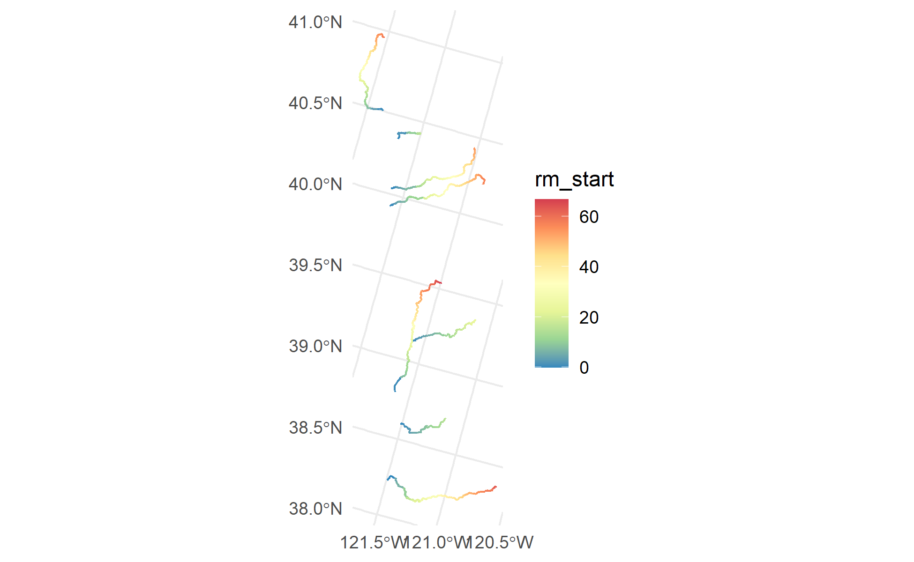
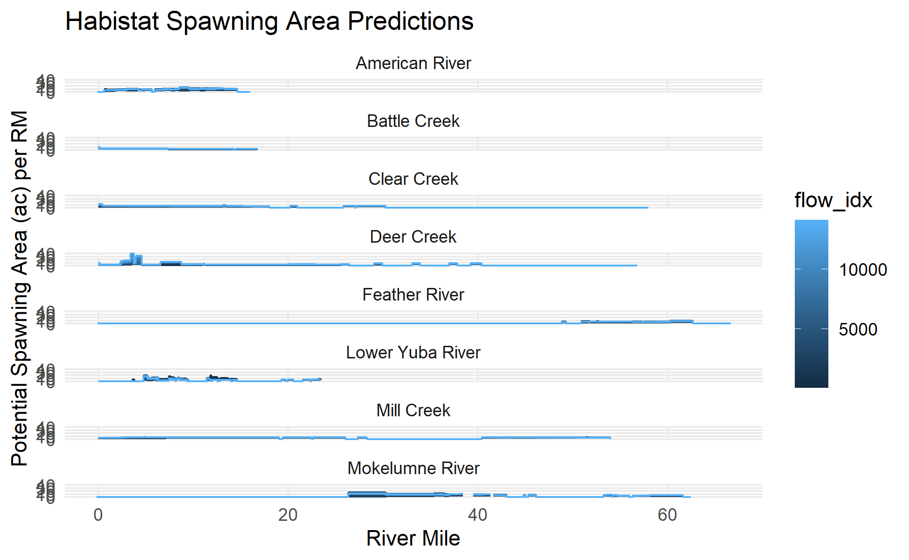
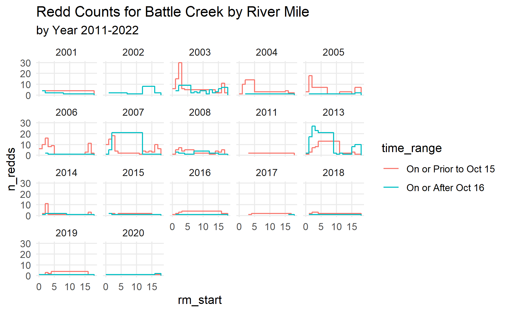
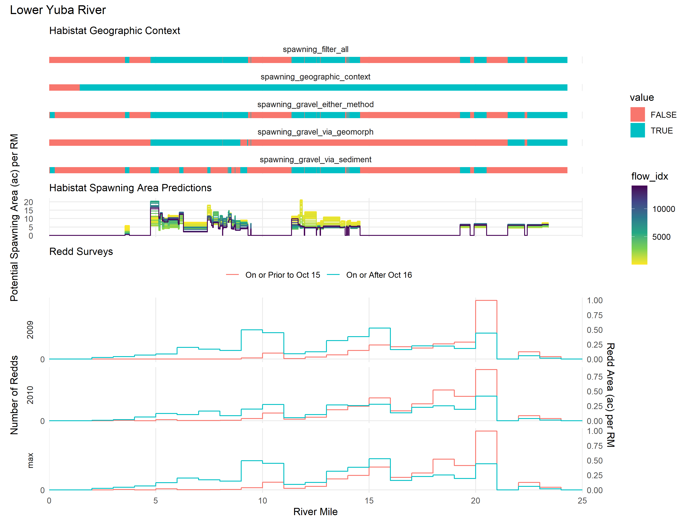
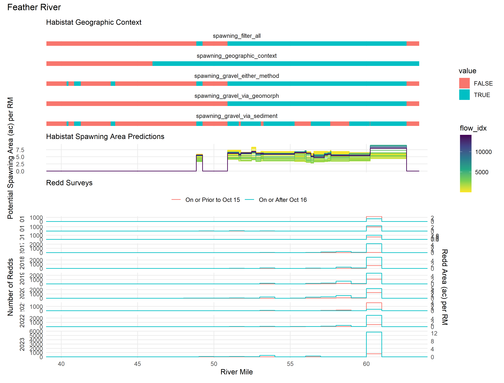

Spawning Gravel Carrying Capacity
================
[Skyler Lewis](mailto:slewis@flowwest.com)
2024-10-18

- [Spawning Reach Lengths](#spawning-reach-lengths)
- [Validation against Redd Surveys](#validation-against-redd-surveys)
  - [River Miles for Spawning
    Reaches](#river-miles-for-spawning-reaches)
  - [Habistat Geographic Context by
    RM](#habistat-geographic-context-by-rm)
  - [Habistat Predictions by River
    Mile](#habistat-predictions-by-river-mile)
  - [Redd Surveys by River Mile](#redd-surveys-by-river-mile)
    - [Function to create and apply river mile index to point
      dataset](#function-to-create-and-apply-river-mile-index-to-point-dataset)
    - [Feather River](#feather-river)
    - [Yuba River](#yuba-river)
    - [Battle Creek](#battle-creek)
    - [Butte Creek](#butte-creek)
    - [Clear Creek](#clear-creek)
    - [Deer Creek](#deer-creek)
    - [Mill Creek](#mill-creek)
  - [Combined Plots](#combined-plots)
- [Yuba Comparison against Relicensing
  Study](#yuba-comparison-against-relicensing-study)
  - [Actuals](#actuals)
  - [Predictions](#predictions)
  - [Comparison](#comparison)
- [Archive - Yuba habitat plots](#archive---yuba-habitat-plots)
  - [Habistat Reaches RM](#habistat-reaches-rm)
  - [Habistat Estimates RM](#habistat-estimates-rm)

``` r
library(tidyverse)
```

    ## ── Attaching core tidyverse packages ──────────────────────── tidyverse 2.0.0 ──
    ## ✔ dplyr     1.1.4     ✔ readr     2.1.5
    ## ✔ forcats   1.0.0     ✔ stringr   1.5.1
    ## ✔ ggplot2   3.5.1     ✔ tibble    3.2.1
    ## ✔ lubridate 1.9.3     ✔ tidyr     1.3.1
    ## ✔ purrr     1.0.2     
    ## ── Conflicts ────────────────────────────────────────── tidyverse_conflicts() ──
    ## ✖ dplyr::filter() masks stats::filter()
    ## ✖ dplyr::lag()    masks stats::lag()
    ## ℹ Use the conflicted package (<http://conflicted.r-lib.org/>) to force all conflicts to become errors

``` r
library(sf)
```

    ## Linking to GEOS 3.12.1, GDAL 3.8.4, PROJ 9.3.1; sf_use_s2() is TRUE

``` r
library(habistat)
library(patchwork)
theme_set(theme_minimal() + theme(panel.grid.minor = element_blank()))
glimpse_plot <- function(x, ...) {
  plot(x, ...)
  invisible(x)
}
knitr::opts_chunk$set(fig.width=6.5, fig.height=4, dpi=300)
```

## Spawning Reach Lengths

``` r
spawning_context <- 
  readRDS(here::here("data-raw", "results", "spawning_context.Rds"))

spawning_length_summary <- 
  habistat::cv_mainstems |>
  st_drop_geometry() |>
  inner_join(habistat::flowline_attr |> select(comid, reach_length_ft)) |>
  inner_join(spawning_context, by=join_by(comid)) |>
  mutate(identity = T) |>
  pivot_longer(cols = c(identity, starts_with("spawning_"))) |>
  mutate(spawning_rm = value * reach_length_ft / 5280) |>
  group_by(river_group, river_cvpia, name) |>
  summarize(spawning_rm = sum(spawning_rm)) 
```

    ## Joining with `by = join_by(comid)`
    ## `summarise()` has grouped output by 'river_group', 'river_cvpia'. You can
    ## override using the `.groups` argument.

``` r
var_labels <- tribble(
  ~name,                           ~label,                                                         ~color,
  "identity",                      "All Reaches",                                                  "gray",
  "spawning_geographic_context",   "CVPIA/Elevation Range",                                        "orange",
  "spawning_gravel_via_geomorph",  "Gravels via UCD Geomorph Class only",                          "darkcyan",
  "spawning_gravel_via_sediment",  "Gravels via Sediment Transport only",                          "darkturquoise",
  "spawning_gravel_either_method", "Gravels matching either method",                               "darkblue",
  "spawning_filter_all",           "Gravels matching either method, within CVPIA/Elevation Range", "mediumvioletred")

spawning_length_summary |>
  mutate(name = factor(name, levels = var_labels$name, labels = var_labels$label)) |>
  group_by(river_group, name) |>
  summarize(spawning_rm = sum(spawning_rm)) |>
  ggplot(aes(y = name, x = spawning_rm)) +
  facet_wrap(~river_group, ncol=4, scales="free_x") +
  geom_col(aes(fill = name), width=1, color="white") +
  theme(legend.position = "top",
        axis.text.y = element_blank(),
        panel.grid.minor = element_blank(),
        panel.grid.major.y = element_blank(),
        legend.key.size = unit(12, "pt"),
        legend.key.spacing.y = unit(0, "pt"),
        strip.text = element_text(size=8)) +
  guides(color = "none", fill = guide_legend(nrow=6, byrow=F, title = "")) +
  scale_y_discrete(limits=rev) + ylab("") + xlab("River Miles") +
  scale_fill_manual(values = var_labels$color)
```

    ## `summarise()` has grouped output by 'river_group'. You can override using the
    ## `.groups` argument.

<!-- -->

## Validation against Redd Surveys

### River Miles for Spawning Reaches

Define river miles upon which to map results

``` r
  # length = vector of reach lengths
  # start = numbering system start
  # end = numbering system end
  # vectors should be already ordered
define_rm_endpoint <- function(length, start, end, which="start") {
  cum_length_end_unscaled <- cumsum(length)
  cum_length_start_unscaled <- cum_length_end_unscaled - length
  cum_length_start_scaled <-
    scales::rescale(cum_length_start_unscaled,
                    from = c(min(cum_length_start_unscaled), max(cum_length_end_unscaled)), 
                    to = c(first(start), first(end)))
  cum_length_end_scaled <-
    scales::rescale(cum_length_end_unscaled,
                    from = c(min(cum_length_start_unscaled), max(cum_length_end_unscaled)), 
                    to = c(first(start), first(end)))
  return(switch(which,
                start = cum_length_start_scaled,
                end = cum_length_end_scaled))
}

# for streams with known RM schemes, define them:

rm_reaches <- 
  tribble(~river_name,       ~river_cvpia,         ~ds_comid, ~ds_rm, ~us_comid, ~us_rm,
          "Mokelumne River", c("Mokelumne River", 
                               "South Mokelumne River"), 1889628,  -0.2, 3953353,  63.5, 
          "American River",   "American River",          15024919, -0.1, 15025009, 16.1,
          "Lower Yuba River", "Yuba River",              7982918, 0, 8062555, 24.3,
          "Feather River",    "Feather River",           7978071, -0.1, 7968113, 67.2,
          "Battle Creek",     "Battle Creek",            2495738, 0, 2766034, 17.0)

comid_with_rm_custom <- 
  rm_reaches |>
  drop_na() |>
  unnest(river_cvpia) |>
  inner_join(habistat::cv_mainstems, by=join_by(river_cvpia)) |>
  inner_join(habistat::flowline_attr |>
               select(comid, hydro_seq, reach_length_ft), by=join_by(comid)) |>
  mutate(reach_length_mi = reach_length_ft / 5280) |>
  arrange(river_name, hydro_seq) |>
  group_by(river_name, ds_rm, us_rm) |>
  mutate(rm_start = define_rm_endpoint(reach_length_ft, ds_rm, us_rm, "start")) |>
  mutate(rm_end = define_rm_endpoint(reach_length_ft, ds_rm, us_rm, "end")) |>
  ungroup() |>
  select(river_name, comid, reach_length_mi, rm_start, rm_end)

# for streams without custom RM definitions above, just use accumulated NHD lengths:

comid_with_rm_nhd <-
  habistat::cv_mainstems |>
  st_drop_geometry() |>
  inner_join(habistat::flowline_attr |>
               select(comid, hydro_seq, reach_length_ft), by=join_by(comid)) |>
  mutate(reach_length_mi = reach_length_ft / 5280) |>
  arrange(river_cvpia, hydro_seq) |>
  group_by(river_cvpia) |>
  mutate(rm_end = cumsum(reach_length_mi),
         rm_start = rm_end - reach_length_mi) |>
  ungroup() |>
  filter(river_cvpia %in% c("Mill Creek", 
                            "Deer Creek",
                            "Clear Creek")) |>
  mutate(river_name = river_cvpia) |>
  select(river_name, comid, reach_length_mi, rm_start, rm_end) 

# combine the two datasets into one
comid_with_rm <- bind_rows("custom" = comid_with_rm_custom, 
                           "nhd" = comid_with_rm_nhd,
                           .id = "rm_source") |>
  glimpse()
```

    ## Rows: 521
    ## Columns: 6
    ## $ rm_source       <chr> "custom", "custom", "custom", "custom", "custom", "cus…
    ## $ river_name      <chr> "American River", "American River", "American River", …
    ## $ comid           <dbl> 15024889, 15024919, 15024935, 15024937, 15024939, 1502…
    ## $ reach_length_mi <dbl> 0.06089438, 1.25951941, 0.53065100, 0.20940209, 1.4192…
    ## $ rm_start        <dbl> -0.10000000, -0.06649361, 0.62654172, 0.91852602, 1.03…
    ## $ rm_end          <dbl> -0.06649361, 0.62654172, 0.91852602, 1.03374699, 1.814…

``` r
comid_with_rm |>
  inner_join(y = _, x = habistat::flowline_geom_proj, by=join_by(comid)) |>
  ggplot() + geom_sf(aes(color = rm_start)) + scale_color_distiller(palette="Spectral")
```

<!-- -->

### Habistat Geographic Context by RM

``` r
spawning_context_comid_rm <- 
  comid_with_rm |>
  left_join(spawning_context, by=join_by(comid)) |>
  mutate(across(starts_with("spawning"), function(x) coalesce(x, FALSE)))

spawning_context_comid_rm |>
  ggplot() + 
  facet_wrap(~river_name, ncol=1) +
  #facet_grid(cols = vars(river_name), rows = vars(name), scales = "free_x", space = "free_x", switch = "y") +
  geom_rect(aes(xmin = rm_start, xmax = rm_end, ymin = -1, ymax = 1, fill = spawning_filter_all)) +
  theme(panel.grid.major.y = element_blank(), 
        panel.grid.minor.y = element_blank(), 
        axis.text.y = element_blank(),
        legend.position = "top") +
  xlab("River Mile") + ggtitle("Habistat Geographic Context") +
  scale_fill_discrete(name = "Spawning Filter")
```

<!-- -->

``` r
spawning_context_comid_rm |>
  pivot_longer(cols = starts_with("spawning_")) |>
  ggplot() +
  facet_grid(cols=vars(river_name), rows=vars(name), scales="free_x", space="free_x") +
  geom_rect(aes(xmin = rm_start, xmax = rm_end, ymin = -1, ymax = 1, fill = value)) +
  theme(panel.grid.major.y = element_blank(),
        panel.grid.minor.y = element_blank(),
        axis.text.y = element_blank(),
        legend.position = "top") +
  xlab("River Mile") + ggtitle("Habistat Geographic Context") +
  scale_x_continuous(breaks=scales::breaks_width(10))
```

<!-- -->

### Habistat Predictions by River Mile

``` r
spawning_pred_comid <- 
  habistat::wua_predicted |>
  filter(comid %in% comid_with_rm$comid) |>
  filter(habitat == "spawning") |>
  filter(model_name == "SD") 

spawning_pred_comid_rm <-
  comid_with_rm |>
  inner_join(spawning_context, by=join_by(comid)) |>
  expand_grid(flow_idx = unique(spawning_pred_comid$flow_idx)) |> # = c(316, 1000, 3162, 10000)) |>
  left_join(spawning_pred_comid, by=join_by(comid, flow_idx), relationship="one-to-one") |>
  mutate(wua_ac_per_rm = if_else(spawning_filter_all, wua_per_lf_pred * 5280 / 43560, 0))

plt_spawning_pred_rm <-
  spawning_pred_comid_rm |>
  ggplot() +
  geom_step(aes(x = rm_start, 
                y = wua_ac_per_rm,
                color = flow_idx,
                group = flow_idx)) + 
  facet_wrap(~river_name, ncol = 1) + 
  ylab("Potential Spawning Area (ac) per RM") + xlab("River Mile") + 
  ggtitle("Habistat Spawning Area Predictions")

print(plt_spawning_pred_rm)
```

<!-- -->

### Redd Surveys by River Mile

#### Function to create and apply river mile index to point dataset

Apply to an `sf` point dataset via
e.g. `data |> mutate(rm_pt = river_miles(geometry, "Feather River"))`
where `geometry` is the name of the sf geometry column. Geometry needs
to be in the project CRS.

``` r
create_rm_idx <- function(river, rm_snap = 10) {
  rm_idx <- 
    comid_with_rm |>
    filter(river_name == river) |>
    inner_join(y=_, x=habistat::flowline_geom_proj, by=join_by(comid)) |>
    mutate(line_pts = map(geometry, \(x) st_line_sample(x, density=1/rm_snap))) |>
    unnest(line_pts) |>
    st_drop_geometry() |>
    st_as_sf(sf_column_name = "line_pts", crs = st_crs(habistat::flowline_geom_proj)) |>
    st_cast("POINT") |>
    group_by(comid) |>
    mutate(rm_pt = rm_start + ((row_number() - 1) * rm_snap) / 5280)
  return(rm_idx)
}

apply_rm_idx <- function(geometry, rm_idx) {
  rm_pt <- rm_idx$rm_pt[st_nearest_feature(geometry, rm_idx)]
  return(rm_pt)
}

river_miles <- function(geometry, river, rm_snap = 10) {
  rm_idx <- create_rm_idx(river, rm_snap)
  rm_pt <- apply_rm_idx(geometry, rm_idx)
  return(rm_pt)
}
```

#### Feather River

``` r
# create river miles spatial index for feather
# rm_snap <- 10 # ft

# feather_rm_idx <- 
#   comid_with_rm |>
#   filter(river_name == "Feather River") |>
#   inner_join(y=_, x=habistat::flowline_geom_proj, by=join_by(comid)) |>
#   mutate(line_pts = map(geometry, \(x) st_line_sample(x, density=1/rm_snap))) |>
#   unnest(line_pts) |>
#   st_drop_geometry() |>
#   st_as_sf(sf_column_name = "line_pts", crs = st_crs(habistat::flowline_geom_proj)) |>
#   st_cast("POINT") |>
#   group_by(comid) |>
#   mutate(rm_pt = rm_start + ((row_number() - 1) * rm_snap) / 5280)

feather_rm_idx <- create_rm_idx("Feather River")
```

    ## Warning in st_cast.sf(st_as_sf(st_drop_geometry(unnest(mutate(inner_join(y =
    ## filter(comid_with_rm, : repeating attributes for all sub-geometries for which
    ## they may not be constant

``` r
# from https://github.com/FlowWest/feather-redd/blob/review-data/data/all_redd_data.csv
feather_redd_data <- read_csv(here::here("data-raw", "source", "spawning_data", "feather", "all_redd_data.csv")) |>
  filter(latitude>0 & longitude<0) |>
  st_as_sf(coords = c("longitude", "latitude"), crs="EPSG:4269") |>
  st_transform(habistat::const_proj_crs()) |>
# mutate(rm_pt = feather_rm_idx$rm_pt[st_nearest_feature(geometry, feather_rm_idx)]) |>
# mutate(rm_pt = river_miles(geometry, "Feather River")) |>
  mutate(rm_pt = apply_rm_idx(geometry, feather_rm_idx)) |>
  mutate(survey_year = year(date) + if_else(month(date)>=7, 0, 1), # year starting in july
         date_normalized = date %m-% months(12*(survey_year - 2047)),
         time_range = if_else(date_normalized <= ymd("2047-10-15"), "On or Prior to Oct 15", "On or After Oct 16")
           |> factor(levels = c("On or Prior to Oct 15", "On or After Oct 16"))) |>
  rename(n_redds = number_redds, n_salmon = number_salmon) 
```

    ## Rows: 36870 Columns: 21
    ## ── Column specification ────────────────────────────────────────────────────────
    ## Delimiter: ","
    ## chr   (2): survey_wk, location
    ## dbl  (17): file_number, number_redds, number_salmon, depth_m, pot_depth_m, v...
    ## lgl   (1): boat_point
    ## date  (1): date
    ## 
    ## ℹ Use `spec()` to retrieve the full column specification for this data.
    ## ℹ Specify the column types or set `show_col_types = FALSE` to quiet this message.

``` r
feather_redd_data |>
  st_drop_geometry() |>
  group_by(survey_year, time_range) |>
  summarize(value = n(), .groups="drop") |>
  pivot_wider(names_from = c(time_range)) |>
  knitr::kable()
```

| survey_year | On or Prior to Oct 15 | On or After Oct 16 |
|------------:|----------------------:|-------------------:|
|        2014 |                  1207 |                690 |
|        2015 |                   963 |               1371 |
|        2016 |                   569 |               1001 |
|        2017 |                    51 |               2666 |
|        2018 |                   790 |               3373 |
|        2019 |                  1297 |               3741 |
|        2020 |                  1472 |               3955 |
|        2021 |                  2164 |                430 |
|        2022 |                   558 |               3202 |
|        2023 |                   719 |               6604 |

``` r
# summarize by named location
feather_redd_summary <- 
  feather_redd_data |>
  group_by(location) |>
  summarize(n_redds = sum(n_redds, na.rm=T),
            n_salmon = sum(n_salmon, na.rm=T)) |>
  st_union(by_feature=T) |>
  st_centroid() |>
  mutate(rm_pt = apply_rm_idx(geometry, feather_rm_idx))

feather_redds_by_rm_avg <-
  feather_redd_data |>
  st_drop_geometry() |>
  mutate(rm_start = as.integer(floor(rm_pt))) |>
  group_by(survey_year, time_range, rm_start) |>
  summarize(across(c(n_redds, n_salmon), \(x) sum(x, na.rm=T)), .groups="drop") |>
  group_by(time_range, rm_start) |>
  summarize(across(c(n_redds, n_salmon), \(x) mean(x, na.rm=T)), .groups="drop") |>
  complete(time_range = unique(time_range),
           rm_start = seq(min(rm_start), max(rm_start))) |>
  mutate(across(c(n_redds, n_salmon), \(x) coalesce(x, 0)))

feather_redds_by_rm_avg |> 
  ggplot() + geom_step(aes(x = rm_start, y = n_redds, color = time_range)) +
  xlab("River Mile") + ylab("Number of Redds") + 
  ggtitle("Feather River Redd Surveys (2014-2023 Mean)") + 
  guides(color = guide_legend(nrow=1, byrow=TRUE, title = "")) +
  scale_y_continuous(sec.axis = sec_axis(name = "Redd Area (ac) per RM", transform = ~.*94/43560)) +
  theme(panel.grid.minor = element_blank(), legend.position="top") 
```

<!-- -->

``` r
feather_redds_by_rm <-
  feather_redd_data |>
  st_drop_geometry() |>
  mutate(rm_start = as.integer(floor(rm_pt))) |>
  group_by(survey_year, time_range, rm_start) |>
  summarize(across(c(n_redds, n_salmon), \(x) sum(x, na.rm=T)), .groups="drop") |>
  complete(survey_year = unique(survey_year),
           time_range = unique(time_range),
           rm_start = seq(min(rm_start), max(rm_start))) |>
  mutate(survey_year = as.character(survey_year)) |>
  mutate(across(c(n_redds, n_salmon), \(x) coalesce(x, 0))) #%>%
  #bind_rows(. |>
  #  group_by(rm_start, time_range) |>
  #  summarize(across(c(n_redds, n_salmon), \(x) max(x, na.rm=T))) |>
  #  mutate(survey_year = "max"))

plt_feather_redd_survey_yr <-
  feather_redds_by_rm |> 
  ggplot() + geom_step(aes(x = rm_start, y = n_redds, color = time_range)) +
  xlab("River Mile") + ylab("Number of Redds") + 
  ggtitle("Feather River Redd Surveys") + 
  facet_grid(rows=vars(survey_year), scales="free_y", space="free_y") +
  guides(color = guide_legend(nrow=1, byrow=TRUE, title = "")) +
  scale_y_continuous(sec.axis = sec_axis(name = "Redd Area (ac) per RM", 
                                         transform = ~.*94/43560), 
                     breaks=scales::breaks_width(2000)) +
  theme(panel.grid.minor = element_blank(), legend.position="top") 

plt_feather_redd_survey_yr
```

<!-- -->

#### Yuba River

RM 0 is at the mouth of the river, and RM 24.3 is at the base of
Englebright Dam.

``` r
yuba_redds_by_rm <- 
  read_csv(here::here("data-raw", "source", "spawning_data", "yuba", "spring-run_and_fall-run_redds_for_Rene_data.csv")) |>
  janitor::clean_names() |>
  select(-redds_total) |>
  pivot_longer(starts_with("redds")) |>
  separate(name, sep = "_", into = c("var", "year")) |>
  separate(rm, sep = " - ", into = c("rm_start", "rm_end")) |>
  mutate(across(starts_with("rm_"), as.numeric)) |>
  mutate(time_range = factor(time_range, levels = c("On or Prior to Oct 15", "On or After Oct 16"))) |>
  select(-var) |>
  rename(survey_year = year) %>%
  bind_rows(. |>
    group_by(rm_start, rm_end, time_range) |>
    summarize(value = max(value)) |>
    mutate(survey_year = "max")) |>
  rename(n_redds = value)
```

    ## Rows: 50 Columns: 5
    ## ── Column specification ────────────────────────────────────────────────────────
    ## Delimiter: ","
    ## chr (2): RM, Time Range
    ## dbl (3): Redds 2009, Redds 2010, Redds Total
    ## 
    ## ℹ Use `spec()` to retrieve the full column specification for this data.
    ## ℹ Specify the column types or set `show_col_types = FALSE` to quiet this message.
    ## `summarise()` has grouped output by 'rm_start', 'rm_end'. You can override using the `.groups` argument.

``` r
yuba_redds_by_rm |>
  group_by(survey_year, time_range) |>
  summarize(total_redds = sum(n_redds)) |>
  mutate(spawning_area_ac = total_redds * 94 / 43560) |>
  select(time_range, survey_year, total_redds, spawning_area_ac) |>
  arrange(time_range, survey_year)
```

    ## `summarise()` has grouped output by 'survey_year'. You can override using the
    ## `.groups` argument.

    ## # A tibble: 6 × 4
    ## # Groups:   survey_year [3]
    ##   time_range            survey_year total_redds spawning_area_ac
    ##   <fct>                 <chr>             <dbl>            <dbl>
    ## 1 On or Prior to Oct 15 2009               1263             2.73
    ## 2 On or Prior to Oct 15 2010               1600             3.45
    ## 3 On or Prior to Oct 15 max                1702             3.67
    ## 4 On or After Oct 16    2009               2046             4.42
    ## 5 On or After Oct 16    2010               1499             3.23
    ## 6 On or After Oct 16    max                2082             4.49

``` r
plt_yuba_redd_survey <-
  yuba_redds_by_rm |>
  ggplot() + 
  geom_step(aes(x = rm_start, y = n_redds, color = time_range)) +
  xlab("River Mile") + ylab("Number of Redds") + 
  facet_wrap(~survey_year, ncol=1)  +
  ggtitle("2009-2010 Lower Yuba River Redd Survey") + 
  guides(color = guide_legend(nrow=1, byrow=TRUE, title = "")) +
  scale_y_continuous(sec.axis = sec_axis(name = "Redd Area (ac) per RM", transform = ~.*94/43560)) +
  theme(panel.grid.minor = element_blank(), legend.position="top") +
  scale_x_continuous(limits = c(0, 24.3))

print(plt_yuba_redd_survey)
```

<!-- -->

#### Battle Creek

All Spring Run Chinook from 2011 to 2022

``` r
# https://github.com/SRJPE/JPE-datasets/blob/main/data-raw/qc-markdowns/adult-holding-redd-and-carcass-surveys/battle-creek/battle_creek_redd_qc.md
battle_redd <- read_csv(here::here("data-raw", "source", "spawning_data", "battle", "jpe_battle_creek_redd_counts.csv")) |> 
  mutate(reach_orig = reach,
         reach = reach |> str_replace_all("R", "") |> as.integer() |> factor(levels = seq(1,7))) |>
  filter(species == "Chinook") |>  # removes O mykiss and lamprey, just a few rows
  select(date, longitude, latitude, river_mile, reach, reach_orig, redd_measured, redd_length) |> 
  filter(redd_measured == TRUE) |> 
  mutate(survey_year = year(date) + if_else(month(date)>=7, 0, 1), # year starting in july
         date_normalized = date %m-% months(12*(survey_year - 2047)),
         time_range = if_else(date_normalized <= ymd("2047-10-15"), "On or Prior to Oct 15", "On or After Oct 16")
           |> factor(levels = c("On or Prior to Oct 15", "On or After Oct 16"))) |>
  drop_na(survey_year) |>
  mutate(rm_start = floor(river_mile)) |>
  st_as_sf(coords = c("longitude", "latitude"), crs = "EPSG:4326", remove=F) |>
  st_transform(habistat::const_proj_crs()) |> 
  glimpse()
```

    ## Warning: One or more parsing issues, call `problems()` on your data frame for details,
    ## e.g.:
    ##   dat <- vroom(...)
    ##   problems(dat)

    ## Rows: 2496 Columns: 36
    ## ── Column specification ────────────────────────────────────────────────────────
    ## Delimiter: ","
    ## chr  (13): JPE_redd_id, survey_method, reach, reach_sub_unit, redd_loc, pre_...
    ## dbl  (18): longitude, latitude, river_mile, pre_redd_depth, redd_pit_depth, ...
    ## lgl   (4): redd_measured, date_measured, tailspill, fork
    ## date  (1): date
    ## 
    ## ℹ Use `spec()` to retrieve the full column specification for this data.
    ## ℹ Specify the column types or set `show_col_types = FALSE` to quiet this message.

    ## Warning: There was 1 warning in `mutate()`.
    ## ℹ In argument: `reach = factor(...)`.
    ## Caused by warning in `factor()`:
    ## ! NAs introduced by coercion

    ## Rows: 735
    ## Columns: 13
    ## $ date            <date> 2003-10-01, 2003-10-01, 2003-10-01, 2003-10-01, 2003-…
    ## $ longitude       <dbl> -122, -122, -122, -122, -122, -122, -122, -122, -122, …
    ## $ latitude        <dbl> 40, 40, 40, 40, 40, 40, 40, 40, 40, 40, 40, 40, 40, 40…
    ## $ river_mile      <dbl> 2, 1, 1, 2, 2, 2, 2, 2, 2, 1, 1, 1, 0, 2, 2, 2, 2, 2, …
    ## $ reach           <fct> 2, 2, 2, 2, 2, 2, 2, 2, 2, 2, 2, 3, 3, 3, 3, 3, 3, 3, …
    ## $ reach_orig      <chr> "R2", "R2", "R2", "R2", "R2", "R2", "R2", "R2", "R2", …
    ## $ redd_measured   <lgl> TRUE, TRUE, TRUE, TRUE, TRUE, TRUE, TRUE, TRUE, TRUE, …
    ## $ redd_length     <dbl> 182, 66, 80, 152, 170, 240, 140, 197, 265, 178, 165, 2…
    ## $ survey_year     <dbl> 2003, 2003, 2003, 2003, 2003, 2003, 2003, 2003, 2003, …
    ## $ date_normalized <date> 2047-10-01, 2047-10-01, 2047-10-01, 2047-10-01, 2047-…
    ## $ time_range      <fct> On or Prior to Oct 15, On or Prior to Oct 15, On or Pr…
    ## $ rm_start        <dbl> 2, 1, 1, 2, 2, 2, 2, 2, 2, 1, 1, 1, 0, 2, 2, 2, 2, 2, …
    ## $ geometry        <POINT [m]> POINT (-2172843 2186078), POINT (-2172843 218607…

``` r
battle_redd |> 
  group_by(rm_start, time_range) |> 
  summarise(n_redds = length(redd_measured)) %>%
  bind_rows(expand_grid(rm_start = max(.$rm_start) + 1, 
                          n_redds = 0, 
                          time_range = unique(.$time_range))) |>
  ggplot(aes(x = rm_start, y = n_redds, color = time_range)) +
  geom_step() +
  ggtitle('Redd Counts for Battle Creek by River Mile') +
  labs(subtitle = "total 2011-2022")
```

    ## `summarise()` has grouped output by 'rm_start'. You can override using the
    ## `.groups` argument.

<!-- -->

``` r
battle_redds_by_rm <- battle_redd |> 
  group_by(survey_year, time_range, rm_start) |> 
  summarise(n_redds = length(redd_measured)) 
```

    ## `summarise()` has grouped output by 'survey_year', 'time_range'. You can
    ## override using the `.groups` argument.

``` r
battle_redds_by_rm %>%
  bind_rows(expand_grid(rm_start = max(.$rm_start) + 1, 
                          n_redds = 0, 
                          survey_year = unique(.$survey_year),
                          time_range = unique(.$time_range))) |>
  ggplot(aes(x = rm_start, y = n_redds, color = time_range)) +
  geom_step() +
  facet_wrap(~survey_year) +
  ggtitle('Redd Counts for Battle Creek by River Mile') +
  labs(subtitle = "by Year 2011-2022")
```

<!-- -->

##### Battle Creek QC

**Investigate RM and locations:** Min and max RM seem inconsistent by
reach. Lat/lon on some reaches (from datasets with reach name coded with
“R”) are incorrectly integers. <mark>In lack of usable lat/lon, need to
locate river mile definitions in order to correctly compare against
habistat estimates.</mark>

``` r
battle_redd |>
  group_by(reach, reach_orig) |>
  filter(river_mile != 0) |>
  summarize(min(river_mile), max(river_mile), 
            min(latitude), max(latitude), 
            min(longitude), max(longitude)) |>
  st_drop_geometry() |>
  knitr::kable()
```

    ## `summarise()` has grouped output by 'reach'. You can override using the
    ## `.groups` argument.

| reach | reach_orig | min(river_mile) | max(river_mile) | min(latitude) | max(latitude) | min(longitude) | max(longitude) |
|:------|:-----------|----------------:|----------------:|--------------:|--------------:|---------------:|---------------:|
| 1     | 1          |       2.7844942 |       3.4604902 |      40.41670 |      40.41909 |      -121.9563 |      -121.9461 |
| 1     | R1         |       3.0000000 |       5.0000000 |      40.00000 |      40.00000 |      -122.0000 |      -122.0000 |
| 2     | 2          |       0.5356556 |       0.5356556 |      40.42407 |      40.42407 |      -121.9924 |      -121.9924 |
| 2     | R2         |       1.0000000 |       2.0000000 |      40.00000 |      40.00000 |      -122.0000 |      -122.0000 |
| 3     | R3         |       1.0000000 |      17.0000000 |      40.00000 |      40.00000 |      -122.0000 |      -122.0000 |
| 4     | 4          |      16.0250716 |      16.6922824 |      40.42314 |      40.42664 |      -122.0094 |      -121.9995 |
| 4     | R4         |       1.0000000 |      17.0000000 |      40.00000 |      40.00000 |      -122.0000 |      -122.0000 |
| 5     | R5         |       9.0000000 |      13.0000000 |      40.00000 |      40.00000 |      -122.0000 |      -122.0000 |
| 6     | R6         |       6.0000000 |       9.0000000 |      40.00000 |      40.00000 |      -122.0000 |      -122.0000 |
| 7     | R7         |       5.0000000 |       5.0000000 |      40.00000 |      40.00000 |      -122.0000 |      -122.0000 |

River miles defined in [USFWS (2018), *Summary of Actions to Jumpstart
the Reintroduction of Sacramento River Winter-run Chinook Salmon, to
Battle Creek, 2017 –
2018*](https://www.noaa.gov/sites/default/files/legacy/document/2020/Oct/07354626189.pdf),
Figure 3:

- Mainstem:
  - North/South fork confluence is at mainstem RM 16.80
- North fork:
  - Wildcat Road Bridge RM 0.88
  - Wilson Hill Road Bridge RM 8.82
  - North Fork Feeder Dam Area RM 9.42

Using manual RM definition on the Battle Creek mainstem only for now,
range 0 through 17 (~16.80). Need to confirm if some of these redds were
surveyed on the forks.

#### Butte Creek

No SRJPE redd data available

#### Clear Creek

All Spring Run Chinook redds from 2000 to 2019

``` r
clear_rm_idx <- create_rm_idx("Clear Creek")
```

    ## Warning in st_cast.sf(st_as_sf(st_drop_geometry(unnest(mutate(inner_join(y =
    ## filter(comid_with_rm, : repeating attributes for all sub-geometries for which
    ## they may not be constant

``` r
#https://github.com/FlowWest/JPE-datasets/blob/main/data-raw/qc-markdowns/adult-holding-redd-and-carcass-surveys/clear-creek/clear_creek_redds_survey_qc.md
clear_redd <- read_csv(here::here("data-raw", "source", "spawning_data", "clear", "jpe_clear_creek_redd_counts.csv")) |> 
  filter(species == "Chinook", 
         measured == TRUE) |> 
  select(date, longitude, latitude, surveyed_reach, measured) |>
  drop_na(longitude, latitude) |>
  mutate(survey_year = year(date) + if_else(month(date)>=7, 0, 1), # year starting in july
         date_normalized = date %m-% months(12*(survey_year - 2047)),
         time_range = if_else(date_normalized <= ymd("2047-10-15"), "On or Prior to Oct 15", "On or After Oct 16")
           |> factor(levels = c("On or Prior to Oct 15", "On or After Oct 16"))) |>
  drop_na(survey_year) |>
  st_as_sf(coords = c("longitude", "latitude"), crs = "EPSG:4326", remove=F) |>
  st_transform(habistat::const_proj_crs()) |> 
  mutate(rm_pt = apply_rm_idx(geometry, clear_rm_idx)) |>
  glimpse()
```

    ## Rows: 2217 Columns: 40
    ## ── Column specification ────────────────────────────────────────────────────────
    ## Delimiter: ","
    ## chr  (14): JPE_redd_id, survey_method, ucc_relate, picket_weir_relation, sur...
    ## dbl  (22): longitude, latitude, survey, river_mile, x1000ftbreak, picket_wei...
    ## lgl   (2): fish_on_redd, measured
    ## date  (2): date, date_measured
    ## 
    ## ℹ Use `spec()` to retrieve the full column specification for this data.
    ## ℹ Specify the column types or set `show_col_types = FALSE` to quiet this message.

    ## Rows: 1,334
    ## Columns: 10
    ## $ date            <date> 2005-09-06, 2005-09-06, 2005-09-09, 2005-09-19, 2005-…
    ## $ longitude       <dbl> -122.5485, -122.5458, -122.4547, -122.5505, -122.5488,…
    ## $ latitude        <dbl> 40.58482, 40.59007, 40.49539, 40.58623, 40.58481, 40.5…
    ## $ surveyed_reach  <chr> "R1", "R1", "R6", "R1", "R1", "R1", "R1", "R1", "R1", …
    ## $ measured        <lgl> TRUE, TRUE, TRUE, TRUE, TRUE, TRUE, TRUE, TRUE, TRUE, …
    ## $ survey_year     <dbl> 2005, 2005, 2005, 2005, 2005, 2005, 2005, 2005, 2005, …
    ## $ date_normalized <date> 2047-09-06, 2047-09-06, 2047-09-09, 2047-09-19, 2047-…
    ## $ time_range      <fct> On or Prior to Oct 15, On or Prior to Oct 15, On or Pr…
    ## $ geometry        <POINT [m]> POINT (-2199426 2261724), POINT (-2199053 226222…
    ## $ rm_pt           <dbl> 16.485102, 16.278663, 3.480519, 16.390405, 16.477526, …

``` r
clear_redd_counts <- 
  clear_redd |>
  st_drop_geometry() |>
  group_by(longitude, latitude, survey_year, time_range) |> 
  summarise(n_redds = length(measured), .groups="drop") |>
  st_as_sf(coords = c("longitude", "latitude"), crs = "EPSG:4326", remove=F) |>
  st_transform(habistat::const_proj_crs()) |>
  mutate(rm_pt = apply_rm_idx(geometry, clear_rm_idx))

clear_redd_counts |> 
  group_by(longitude, latitude, survey_year) |>
  summarise(n_redds = sum(n_redds), .groups="drop") |>
  ggplot() +
  ggspatial::annotation_spatial(habistat::cv_mainstems |>
                                  filter(river_group=="Clear Creek"), color="gray") +
  geom_sf(aes(color = n_redds)) +
  facet_wrap(~survey_year) +
  ggtitle('Redd Counts for Clear Creek by lat/long')
```

<!-- -->

``` r
clear_redds_by_rm <-
  clear_redd_counts |>
  st_drop_geometry() |>
  mutate(rm_start = as.integer(floor(rm_pt))) |>
  group_by(rm_start, survey_year, time_range) |>
  summarize(n_redds = sum(n_redds), .groups="drop") |>
  group_by(survey_year) |>
  complete(rm_start = seq(min(rm_start), max(rm_start))) |>
  mutate(n_redds = coalesce(n_redds, 0)) |>
  ungroup()

clear_redds_by_rm %>%
  bind_rows(expand_grid(rm_start = c(min(.$rm_start) - 1, max(.$rm_start) + 1), 
                        n_redds = 0, 
                        time_range = unique(.$time_range))) |>
  ggplot() +
  geom_step(aes(x = rm_start, y = n_redds, color = time_range)) +
  facet_wrap(~survey_year) +
  ggtitle('Redd Counts for Clear Creek by river mile')
```

<!-- -->

``` r
clear_redds_by_rm |> 
  group_by(rm_start, time_range) |>
  summarize(n_redds = max(n_redds))%>%
  bind_rows(expand_grid(rm_start = c(min(.$rm_start) - 1, max(.$rm_start) + 1), 
                        n_redds = 0, 
                        survey_year = unique(.$survey_year),
                        time_range = unique(.$time_range))) |>
  ggplot() +
  geom_step(aes(x = rm_start, y = n_redds, color = time_range)) +
  ggtitle('Redd Counts for Clear Creek by river mile (upper envelope)')
```

    ## `summarise()` has grouped output by 'rm_start'. You can override using the
    ## `.groups` argument.

    ## Warning: Unknown or uninitialised column: `survey_year`.

<!-- -->

#### Deer Creek

No SRJPE redd data available

#### Mill Creek

``` r
mill_rm_idx <- create_rm_idx("Mill Creek")
```

    ## Warning in st_cast.sf(st_as_sf(st_drop_geometry(unnest(mutate(inner_join(y =
    ## filter(comid_with_rm, : repeating attributes for all sub-geometries for which
    ## they may not be constant

``` r
# https://github.com/FlowWest/JPE-datasets/blob/main/data-raw/qc-markdowns/adult-holding-redd-and-carcass-surveys/mill-creek/mill-creek-redd-survey-qc-checklist.md
mill_redd <- read_csv(here::here("data-raw", "source", "spawning_data", "mill", "mill_redd_survey.csv")) |> glimpse()
```

    ## Rows: 388 Columns: 5
    ## ── Column specification ────────────────────────────────────────────────────────
    ## Delimiter: ","
    ## chr (1): location
    ## dbl (3): starting_elevation, year, redd_count
    ## lgl (1): surveyed
    ## 
    ## ℹ Use `spec()` to retrieve the full column specification for this data.
    ## ℹ Specify the column types or set `show_col_types = FALSE` to quiet this message.

    ## Rows: 388
    ## Columns: 5
    ## $ location           <chr> "Above Hwy 36", "Above Hwy 36", "Above Hwy 36", "Ab…
    ## $ starting_elevation <dbl> 5200, 5200, 5200, 5200, 5200, 5200, 5200, 5200, 520…
    ## $ year               <dbl> 1997, 1998, 1999, 2000, 2001, 2002, 2003, 2004, 200…
    ## $ redd_count         <dbl> 0, NA, NA, NA, NA, 12, 0, 0, 7, 19, 1, 1, 0, 0, 3, …
    ## $ surveyed           <lgl> TRUE, FALSE, FALSE, FALSE, FALSE, TRUE, TRUE, TRUE,…

``` r
mill_locations <- readxl::read_excel(here::here("data-raw", "source", "spawning_data", "mill", 'adult-holding-redd-and-carcass-surveys_mill-creek_data-raw_Mill Creek spring-run Redd Counts 2007-2023.xlsx'), sheet = "nearest temp-logger") |> 
  janitor::clean_names() |> 
  mutate(location = redd_survey_section |>
           str_replace_all("HIG", "Hole-in-Ground") |>
           str_replace_all("McCarty", "McCarthy") |>
           str_replace_all("Ranch House to above Avery", "Below Ranch House to above Avery")) |>
  st_as_sf(coords = c("long", "lat"), crs = "EPSG:4326", remove=F) |>
  st_transform(habistat::const_proj_crs()) |>
  mutate(rm_pt = apply_rm_idx(geometry, mill_rm_idx)) |>
  glimpse()
```

    ## Rows: 14
    ## Columns: 7
    ## $ redd_survey_section <chr> "Above Hwy 36", "Hwy 36 to Little HIG", "Litte HIG…
    ## $ nearest_temp_logger <chr> "Brokenshire", "Little Hole in Ground", "Hole in G…
    ## $ lat                 <dbl> 40.35695, 40.31853, 40.30641, 40.30641, 40.30641, …
    ## $ long                <dbl> -121.5107, -121.5303, -121.5651, -121.5651, -121.5…
    ## $ location            <chr> "Above Hwy 36", "Hwy 36 to Little Hole-in-Ground",…
    ## $ geometry            <POINT [m]> POINT (-2122339 2213551), POINT (-2125074 22…
    ## $ rm_pt               <dbl> 48.58509, 43.68125, 42.47300, 42.47300, 42.47300, …

``` r
mill_merge <- mill_redd |> 
  right_join(x = mill_locations, y = _, by=join_by(location)) |> 
  select(-starting_elevation) |> 
  filter(surveyed == TRUE) |>
  rename(survey_year = year) |>
  mutate(time_range = NA)

mill_redd_counts <-
  mill_merge |>
  st_drop_geometry() |>
  group_by(location, lat, long, survey_year, time_range) |> 
  summarise(n_redds = sum(redd_count), .groups="drop") |> 
  drop_na(long, lat) |>
  mutate(river = "Mill Creek") |> 
  st_as_sf(coords = c("long", "lat"), crs = "EPSG:4326", remove=F) |>
  st_transform(habistat::const_proj_crs()) |>
  mutate(rm_pt = apply_rm_idx(geometry, mill_rm_idx)) 

mill_redd_counts |> 
  group_by(long, lat, survey_year) |>
  summarise(n_redds = sum(n_redds), .groups="drop") |>
  ggplot() +
  ggspatial::annotation_spatial(habistat::cv_mainstems |>
                                  filter(river_group=="Mill Creek"), color="gray") +
  geom_sf(aes(color = n_redds)) +
  facet_wrap(~survey_year) +
  ggtitle('Redd Counts for Mill Creek by lat/long')
```

<!-- -->

``` r
mill_redds_by_rm <-
  mill_redd_counts |>
  st_drop_geometry() |>
  mutate(rm_start = as.integer(floor(rm_pt))) |>
  group_by(rm_start, survey_year, time_range) |>
  summarize(n_redds = sum(n_redds), .groups="drop") |>
  group_by(survey_year) |>
  complete(rm_start = seq(min(rm_start), max(rm_start))) |>
  mutate(n_redds = coalesce(n_redds, 0)) |>
  ungroup()

mill_redds_by_rm %>%
  bind_rows(expand_grid(rm_start = c(min(.$rm_start) - 1, max(.$rm_start) + 1), 
                        n_redds = 0, 
                        survey_year = unique(.$survey_year),
                        time_range = unique(.$time_range))) |>
  ggplot() +
  geom_step(aes(x = rm_start, y = n_redds, color = time_range)) +
  facet_wrap(~survey_year) +
  ggtitle('Redd Counts for Mill Creek by river mile')
```

<!-- -->

``` r
mill_redds_by_rm |> 
  group_by(rm_start, time_range) |>
  summarize(n_redds = max(n_redds)) %>%
  bind_rows(expand_grid(rm_start = c(min(.$rm_start) - 1, max(.$rm_start) + 1), 
                        n_redds = 0, 
                        time_range = unique(.$time_range))) |>
  ggplot() +
  geom_step(aes(x = rm_start, y = n_redds, color = time_range)) +
  ggtitle('Redd Counts for Mill Creek by river mile (upper envelope)')
```

    ## `summarise()` has grouped output by 'rm_start'. You can override using the
    ## `.groups` argument.

<!-- -->

### Combined Plots

``` r
redd_data <- list("Lower Yuba River" = yuba_redds_by_rm,
                  "Feather River" = feather_redds_by_rm,
                  "Clear Creek" = clear_redds_by_rm,
                  "Mill Creek" = mill_redds_by_rm,
                  "Battle Creek" = battle_redds_by_rm) #|>
 # bind_rows(.id = "river_name")

for (x in names(redd_data)) {
  
  plt_context <- 
    spawning_context_comid_rm |>
    filter(river_name == x) |>
    pivot_longer(cols = starts_with("spawning_")) |>
    ggplot() + 
    facet_wrap(~name, ncol=1) +
    geom_rect(aes(xmin = rm_start, xmax = rm_end, ymin = -1, ymax = 1, fill = value)) +
    theme(panel.grid.major.y = element_blank(), 
          panel.grid.minor.y = element_blank(), 
          axis.text.y = element_blank()) +
    xlab("River Mile") + labs(subtitle="Habistat Geographic Context") + 
    scale_x_continuous(breaks=scales::breaks_width(10))
  
  plt_preds <- 
    spawning_pred_comid_rm |>
    filter(river_name == x) |>
    ggplot() +
    geom_step(aes(x = rm_start, 
                  y = wua_ac_per_rm,
                  color = flow_idx,
                  group = flow_idx)) + 
    ylab("Potential Spawning Area (ac) per RM") + xlab("River Mile") + 
    labs(subtitle="Habistat Spawning Area Predictions") + 
    scale_x_continuous(breaks=scales::breaks_width(10)) + 
    scale_color_viridis_c(direction = -1)
  
  plt_redds <- 
    redd_data[[x]] %>%
    bind_rows(expand_grid(rm_start = c(min(.$rm_start) - 1, max(.$rm_start) + 1), 
                          n_redds = 0, 
                          survey_year = unique(.$survey_year),
                          time_range = unique(.$time_range))) |>
    ggplot() + 
    geom_step(aes(x = rm_start, y = n_redds, color = time_range)) +
    xlab("River Mile") + ylab("Number of Redds") + 
    facet_grid(rows=vars(survey_year), scales="free_y", space="free_y", switch="y")  +
    labs(subtitle="Redd Surveys") + 
    guides(color = guide_legend(nrow=1, byrow=TRUE, title = "")) +
    scale_y_continuous(sec.axis = sec_axis(name = "Redd Area (ac) per RM", transform = ~.*94/43560),
                       breaks = scales::breaks_width(1000)) +
    theme(panel.grid.minor = element_blank(), legend.position="top",
          strip.text.y = element_text(angle = 0), strip.placement = "outside")
  
  plt_combined <- (plt_context / plt_preds / plt_redds) + 
    plot_layout(axes = "collect", heights=c(3,1,5)) +
    plot_annotation(title = x) &
    scale_x_continuous(expand=c(0,0), limits=c(min(redd_data[[x]]$rm_start), max(redd_data[[x]]$rm_start)+1))
  
  print(plt_combined)
}
```

    ## Scale for x is already present.
    ## Adding another scale for x, which will replace the existing scale.
    ## Scale for x is already present.
    ## Adding another scale for x, which will replace the existing scale.
    ## Scale for x is already present.
    ## Adding another scale for x, which will replace the existing scale.
    ## Scale for x is already present.
    ## Adding another scale for x, which will replace the existing scale.

<!-- -->

    ## Warning: Removed 300 rows containing missing values or values outside the scale range
    ## (`geom_rect()`).

    ## Warning: Removed 2950 rows containing missing values or values outside the scale range
    ## (`geom_step()`).

    ## Scale for x is already present.
    ## Adding another scale for x, which will replace the existing scale.
    ## Scale for x is already present.
    ## Adding another scale for x, which will replace the existing scale.

<!-- -->

    ## Warning: Removed 165 rows containing missing values or values outside the scale range
    ## (`geom_rect()`).

    ## Warning: Removed 1600 rows containing missing values or values outside the scale range
    ## (`geom_step()`).

    ## Scale for x is already present.
    ## Adding another scale for x, which will replace the existing scale.
    ## Scale for x is already present.
    ## Adding another scale for x, which will replace the existing scale.

<!-- -->

    ## Warning: Removed 130 rows containing missing values or values outside the scale range
    ## (`geom_rect()`).

    ## Warning: Removed 1250 rows containing missing values or values outside the scale range
    ## (`geom_step()`).

    ## Scale for x is already present.
    ## Adding another scale for x, which will replace the existing scale.
    ## Scale for x is already present.
    ## Adding another scale for x, which will replace the existing scale.

<!-- --><!-- -->

## Yuba Comparison against Relicensing Study

Map current and historical habitat reaches of the Yuba and its major
tributaries

``` r
habistat::cv_mainstems |> 
  filter(river_group == "Yuba River") |>
  filter(!is.na(habitat)) |>
  glimpse_plot()
```

<!-- -->

Map full lengths of Yuba and its major tributaries, and join in spawning
context layer

``` r
selected_streams <- 
  habistat::flowline_geom_proj |> 
  inner_join(habistat::flowline_attr |> select(comid, watershed_level_3, gnis_name), by=join_by(comid)) |>
  left_join(habistat::cv_mainstems |> st_drop_geometry() |> select(comid, habitat), by=join_by(comid)) |>
  filter(watershed_level_3 == "Yuba River") |> 
  filter(gnis_name %in% c("Yuba River", "Middle Yuba River", "North Yuba River", "South Yuba River")) |> 
  mutate(river_name = if_else(str_detect(coalesce(habitat,""), "rearing"), "Lower Yuba River", gnis_name) |>
         factor(levels = c("North Yuba River", "Middle Yuba River", "South Yuba River", "Yuba River", "Lower Yuba River"))) |>
  left_join(spawning_context, by=join_by(comid)) |>
  mutate(across(starts_with("spawning"), function(x) coalesce(x, FALSE))) |>
  mutate(current_spawning_reach = coalesce(str_detect(habitat, "spawning"), FALSE)) |>
  glimpse_plot(max.plot = Inf)
```

<!-- -->

### Actuals

Import estimates from the Yuba relicensing study

``` r
spawning_matrix_data <- read_csv(here::here("data-raw", "source", "spawning_data", "yuba", "01_YSF-Habitat-Matrices-Report_table8_data.csv"), col_types = "cnnnnnnnnnnn") |>
  mutate(gnis_name = case_when(str_detect(reach, "North Yuba") ~ "North Yuba River",
                               str_detect(reach, "Middle Yuba") ~ "Middle Yuba River",
                               str_detect(reach, "South Yuba") ~ "South Yuba River",
                               TRUE ~ "Yuba River")) |>
  mutate(river_name = case_when(str_detect(reach, "North Yuba") ~ "North Yuba River",
                               str_detect(reach, "Middle Yuba") ~ "Middle Yuba River",
                               str_detect(reach, "South Yuba") ~ "South Yuba River",
                               str_detect(reach, "Lower Yuba") ~ "Lower Yuba River",
                               TRUE ~ "Yuba River")) |>
  glimpse()
```

    ## Warning: One or more parsing issues, call `problems()` on your data frame for details,
    ## e.g.:
    ##   dat <- vroom(...)
    ##   problems(dat)

    ## Rows: 28
    ## Columns: 13
    ## $ reach           <chr> "North Yuba River above New Bullards Bar Reservoir", "…
    ## $ year            <dbl> 2008, 2009, 2010, 2011, 2008, 2009, 2010, 2011, 2008, …
    ## $ length_UO       <dbl> 0.0, 0.0, 6.6, 23.4, 3.3, 3.7, 4.6, 5.7, 0.0, 0.0, 0.0…
    ## $ length_UT       <dbl> 7.7, 7.6, 24.0, 33.7, 7.5, 7.2, 9.8, 12.3, 0.0, 0.0, 0…
    ## $ length_UT_butte <dbl> 11.4, 11.2, 25.5, 33.7, 8.5, 8.1, 11.4, 14.8, 0.0, 0.0…
    ## $ gravel_UO       <dbl> 0, 0, 12, 195, 4, 5, 5, 10, 0, 0, 0, 0, NA, NA, NA, NA…
    ## $ gravel_UT       <dbl> 17, 17, 197, 316, 19, 18, 25, 42, 0, 0, 0, 4, NA, NA, …
    ## $ gravel_UT_butte <dbl> 29, 29, 202, 316, 22, 21, 36, 57, 0, 0, 0, 5, NA, NA, …
    ## $ redds_UO        <dbl> 0, 0, 129, 2069, 44, 51, 55, 110, 0, 0, 0, 0, NA, NA, …
    ## $ redds_UT        <dbl> 183, 179, 2094, 3358, 206, 190, 264, 451, 0, 0, 0, 40,…
    ## $ redds_UT_butte  <dbl> 305, 304, 2153, 3358, 238, 224, 379, 606, 0, 0, 0, 48,…
    ## $ gnis_name       <chr> "North Yuba River", "North Yuba River", "North Yuba Ri…
    ## $ river_name      <chr> "North Yuba River", "North Yuba River", "North Yuba Ri…

Summarize

``` r
spawning_matrix_summary <-
  spawning_matrix_data |>
  group_by(river_name, year) |>
  summarize(across(c(starts_with("length_"), starts_with("gravel_"), starts_with("redds_")), function(x) sum(x, na.rm=T)), .groups="drop") |>
  group_by(river_name) |>
  summarize(across(c(starts_with("length_"), starts_with("gravel_"), starts_with("redds_")), mean)) |>
  pivot_longer(cols = -river_name) |>
  separate(name, sep = "_", into = c("name", "method"), extra = "merge") |>
  pivot_wider() |>
  transmute(river_name = river_name |> factor(levels = c("North Yuba River", "Middle Yuba River", "South Yuba River", "Yuba River", "Lower Yuba River")),
            method,
            actual_length_mi = length, # units are miles
            actual_gravel_ac = gravel * 1000 / 43560)

spawning_matrix_summary |> knitr::kable()
```

| river_name        | method   | actual_length_mi | actual_gravel_ac |
|:------------------|:---------|-----------------:|-----------------:|
| Lower Yuba River  | UO       |           18.125 |      154.4765840 |
| Lower Yuba River  | UT       |           24.000 |      175.7174013 |
| Lower Yuba River  | UT_butte |           24.000 |      175.7174013 |
| Middle Yuba River | UO       |            4.325 |        0.1377410 |
| Middle Yuba River | UT       |            9.200 |        0.5968779 |
| Middle Yuba River | UT_butte |           10.700 |        0.7805326 |
| North Yuba River  | UO       |            9.800 |        1.1880165 |
| North Yuba River  | UT       |           20.550 |        3.1393480 |
| North Yuba River  | UT_butte |           22.750 |        3.3057851 |
| South Yuba River  | UO       |            0.000 |        0.0000000 |
| South Yuba River  | UT       |            0.750 |        0.0229568 |
| South Yuba River  | UT_butte |            0.875 |        0.0286961 |
| Yuba River        | UO       |            1.700 |        0.1377410 |
| Yuba River        | UT       |            1.700 |        0.1377410 |
| Yuba River        | UT_butte |            1.700 |        0.1377410 |

### Predictions

Look at predictions

``` r
lower_yuba_river <-
  habistat::cv_mainstems |>
  filter(river_cvpia == "Yuba River" & str_detect(habitat, "rearing"))

spawning_predictions_comid <- 
  habistat::wua_predicted |>
  inner_join(selected_streams |> select(comid, current_spawning_reach)) |>
  filter(habitat == "spawning") |>
  filter(model_name == "SD") |>
  filter(comid %in% filter(spawning_context, spawning_filter_all)$comid) |>
  inner_join(habistat::flowline_attr |> select(comid, gnis_name)) |>
  filter(gnis_name %in% c("Yuba River", "Middle Yuba River", "North Yuba River", "South Yuba River")) |>
  mutate(river_name = if_else(comid %in% lower_yuba_river$comid, "Lower Yuba River", gnis_name) |>
         factor(levels = c("North Yuba River", "Middle Yuba River", "South Yuba River", "Yuba River", "Lower Yuba River"))) 
```

    ## Joining with `by = join_by(comid)`
    ## Joining with `by = join_by(comid)`

``` r
total_reach_lengths <-
  habistat::flowline_attr |>
  mutate(river_name = if_else(comid %in% lower_yuba_river$comid, "Lower Yuba River", gnis_name) |>
         factor(levels = c("North Yuba River", "Middle Yuba River", "South Yuba River", "Yuba River", "Lower Yuba River"))) |>
  group_by(river_name) |> 
  summarize(river_length_ft = sum(reach_length_ft), .groups="drop") |>
  drop_na()

spawning_predictions <- 
  spawning_predictions_comid |>
  group_by(river_name, flow_cfs) |>
  mutate(total_wua_ft2 = wua_per_lf_pred * reach_length_ft) |>
  summarize(total_length_ft = sum(reach_length_ft),
            total_wua_ft2 = sum(total_wua_ft2),
            wua_ft2_per_lf = total_wua_ft2 / total_length_ft) |>
  left_join(total_reach_lengths, by=join_by(river_name)) |>
  mutate(wua_ft2_per_tot_lf = total_wua_ft2 / river_length_ft)
```

    ## `summarise()` has grouped output by 'river_name'. You can override using the
    ## `.groups` argument.

``` r
plt_wua <- spawning_predictions |>
  ggplot() + geom_line(aes(x = flow_cfs, y = wua_ft2_per_lf, color = river_name)) + 
  scale_x_log10(breaks = scales::breaks_log(10)) + annotation_logticks(sides="b") +
  ylab("Spawning Habitat\n(ft2) per habitat LF") + guides(color = "none") +
  scale_y_continuous(sec.axis = sec_axis(name = "Redds \nper 1000 linear ft", transform = ~./94*1000)) +
  scale_color_brewer(name = "Spawning/Reach", aesthetics = c("color", "fill"), palette="Paired")

plt_wua2 <- spawning_predictions |>
  ggplot() + geom_line(aes(x = flow_cfs, y = wua_ft2_per_tot_lf, color = river_name)) + 
  scale_x_log10(breaks = scales::breaks_log(10)) + annotation_logticks(sides="b") +
  ylab("Spawning Habitat\n(ft2) per total LF") + guides(color = "none") +
  scale_y_continuous(sec.axis = sec_axis(name = "Redds \nper river mile", transform = ~./94*5280)) +
  scale_color_brewer(name = "Spawning/Reach", aesthetics = c("color", "fill"), palette="Paired")

plt_tot <- spawning_predictions |>
  ggplot() + geom_area(aes(x = flow_cfs, y = total_wua_ft2 / 43560, fill = river_name), color = "white") + 
  scale_x_log10(breaks = scales::breaks_log(10)) + annotation_logticks(sides="b") +
  ylab("Spawning Habitat\n(total acres)") + guides(color = "none", fill = "none") + 
  scale_y_continuous(sec.axis = sec_axis(name = "Redds\n(total)", transform = ~./94*43560)) + 
  scale_color_brewer(name = "Spawning/Reach", aesthetics = c("color", "fill"), palette="Paired")

plt_map <- selected_streams |>
  filter(comid %in% spawning_predictions_comid$comid) |>
  ggplot() + geom_sf(data=selected_streams, color="lightgray") + 
  geom_sf(aes(color = river_name), linewidth=1) +
  theme(panel.grid = element_blank(), axis.text = element_blank()) + 
  scale_color_brewer(name = "Spawning/Reach", aesthetics = c("color", "fill"), palette="Paired")

((plt_wua / plt_wua2 / plt_tot) + 
    plot_layout(axes = "collect") & 
    theme(panel.grid.major = element_blank(), panel.grid.minor = element_blank(), axis.ticks.y = element_line())) | 
  (guide_area() / plt_map) +
  plot_layout(guides = "collect") 
```

<!-- -->

``` r
carrying_capacity <- 
  spawning_predictions |>
  mutate(ccap_redds = total_wua_ft2 / 94) # 01_YSF-Habitat-Matrices-Report estimate: 94ft^2/redd

carrying_capacity_summary <- 
  carrying_capacity |> 
  mutate(ccap_redds = total_wua_ft2 / 94) |>
  group_by(river_name) |> 
  summarize(at_flow = flow_cfs[which.max(ccap_redds)],
            ccap_redds = max(ccap_redds), .groups="drop") 

carrying_capacity_summary |> knitr::kable()
```

| river_name        |    at_flow | ccap_redds |
|:------------------|-----------:|-----------:|
| North Yuba River  | 14125.3754 |   92507.25 |
| Middle Yuba River | 14125.3754 |   26286.72 |
| South Yuba River  | 14125.3754 |   58621.43 |
| Yuba River        |  7943.2823 |   20698.51 |
| Lower Yuba River  |   316.2278 |   55177.78 |

Length of spawning habitat

``` r
stream_lengths_spawning_habitat <- 
  selected_streams |>
  filter(spawning_filter_all) |>
  group_by(river_name) |>
  summarize(length_ft = sum(st_length(geometry)) |> units::set_units("ft") |> units::drop_units(),
            length_mi = length_ft / 5280) |>
  st_drop_geometry()

stream_lengths_spawning_habitat |> knitr::kable()
```

| river_name        | length_ft | length_mi |
|:------------------|----------:|----------:|
| North Yuba River  | 177490.65 | 33.615653 |
| Middle Yuba River |  67309.20 | 12.747955 |
| South Yuba River  | 124733.39 | 23.623749 |
| Yuba River        |  36522.23 |  6.917089 |
| Lower Yuba River  |  63167.75 | 11.963589 |

Amount of spawning gravel and number of redds

Using the max value across all flows

``` r
stream_spawning_areas <- 
  spawning_predictions |>
  group_by(river_name) |>
  summarize(across(c(total_length_ft, total_wua_ft2, wua_ft2_per_lf), max), .groups="drop") |>
  mutate(spawn_area_ft2_1000 = total_wua_ft2 / 1000,
         spawn_area_acres = total_wua_ft2 / 43560,
         n_redds = total_wua_ft2 / 94) # 94 ft2 per redd

stream_spawning_areas |> knitr::kable()
```

| river_name        | total_length_ft | total_wua_ft2 | wua_ft2_per_lf | spawn_area_ft2_1000 | spawn_area_acres |  n_redds |
|:------------------|----------------:|--------------:|---------------:|--------------------:|-----------------:|---------:|
| North Yuba River  |       177500.00 |       8695682 |       48.98976 |            8695.682 |        199.62539 | 92507.25 |
| Middle Yuba River |        67309.71 |       2470952 |       36.71018 |            2470.952 |         56.72524 | 26286.72 |
| South Yuba River  |       124727.69 |       5510415 |       44.17956 |            5510.415 |        126.50171 | 58621.43 |
| Yuba River        |        36525.59 |       1945660 |       53.26840 |            1945.660 |         44.66620 | 20698.51 |
| Lower Yuba River  |        63044.62 |       5186711 |       82.27048 |            5186.711 |        119.07051 | 55177.78 |

### Comparison

Compare

``` r
spawning_matrix_summary |>
  inner_join(stream_lengths_spawning_habitat |> 
               group_by(river_name) |> 
               summarize(predicted_length_mi = sum(length_mi), .groups="drop"), 
             by=join_by(river_name)) |>
  inner_join(stream_spawning_areas |> 
               group_by(river_name) |> 
               summarize(predicted_spawning_ac = sum(spawn_area_acres), .groups="drop"), 
             by=join_by(river_name)) |>
  mutate(ratio_length = (predicted_length_mi / actual_length_mi) |> num(digits = 2),
         ratio_gravel = (predicted_spawning_ac / actual_gravel_ac) |> num(digits = 2)) |>
  select(river_name, method, 
         actual_length_mi, predicted_length_mi, ratio_length,
         actual_gravel_ac, predicted_spawning_ac, ratio_gravel) |>
  knitr::kable()
```

| river_name        | method   | actual_length_mi | predicted_length_mi | ratio_length | actual_gravel_ac | predicted_spawning_ac | ratio_gravel |
|:------------------|:---------|-----------------:|--------------------:|-------------:|-----------------:|----------------------:|-------------:|
| Lower Yuba River  | UO       |           18.125 |           11.963589 |         0.66 |      154.4765840 |             119.07051 |         0.77 |
| Lower Yuba River  | UT       |           24.000 |           11.963589 |         0.50 |      175.7174013 |             119.07051 |         0.68 |
| Lower Yuba River  | UT_butte |           24.000 |           11.963589 |         0.50 |      175.7174013 |             119.07051 |         0.68 |
| Middle Yuba River | UO       |            4.325 |           12.747955 |         2.95 |        0.1377410 |              56.72524 |       411.83 |
| Middle Yuba River | UT       |            9.200 |           12.747955 |         1.39 |        0.5968779 |              56.72524 |        95.04 |
| Middle Yuba River | UT_butte |           10.700 |           12.747955 |         1.19 |        0.7805326 |              56.72524 |        72.68 |
| North Yuba River  | UO       |            9.800 |           33.615653 |         3.43 |        1.1880165 |             199.62539 |       168.03 |
| North Yuba River  | UT       |           20.550 |           33.615653 |         1.64 |        3.1393480 |             199.62539 |        63.59 |
| North Yuba River  | UT_butte |           22.750 |           33.615653 |         1.48 |        3.3057851 |             199.62539 |        60.39 |
| South Yuba River  | UO       |            0.000 |           23.623749 |          Inf |        0.0000000 |             126.50171 |          Inf |
| South Yuba River  | UT       |            0.750 |           23.623749 |        31.50 |        0.0229568 |             126.50171 |      5510.41 |
| South Yuba River  | UT_butte |            0.875 |           23.623749 |        27.00 |        0.0286961 |             126.50171 |      4408.33 |
| Yuba River        | UO       |            1.700 |            6.917089 |         4.07 |        0.1377410 |              44.66620 |       324.28 |
| Yuba River        | UT       |            1.700 |            6.917089 |         4.07 |        0.1377410 |              44.66620 |       324.28 |
| Yuba River        | UT_butte |            1.700 |            6.917089 |         4.07 |        0.1377410 |              44.66620 |       324.28 |

``` r
spawning_predictions |>
  ggplot() + 
  geom_line(aes(x = flow_cfs, y = (total_wua_ft2 / 43560), color = river_name, linetype = "habistat Predictions")) + 
  #geom_line(aes(x = flow_cfs, y = (total_wua_ft2 / 43560) - actual_gravel_ac, color = river_name)) + 
  geom_hline(data = spawning_matrix_summary, aes(yintercept = actual_gravel_ac, color = river_name, linetype = paste("YSF Habitat Matrices", method))) +
  scale_x_log10(breaks = scales::breaks_log(10)) + annotation_logticks(sides="b") +
  ylab("Spawning Habitat\n(total acres)") + guides(color = "none", fill = "none") + 
  scale_y_continuous(sec.axis = sec_axis(name = "Redds\n(total)", transform = ~./94*43560)) + 
  scale_color_brewer(name = "Spawning/Reach", aesthetics = c("color", "fill"), palette="Paired") +
  facet_wrap(~river_name, ncol=2)  + theme(legend.position = "top", panel.grid.minor = element_blank()) +
  ggtitle("Carrying Capacity Comparison") + 
  guides(linetype = guide_legend(nrow=2, byrow=TRUE, title = ""))
```

<!-- -->

## Archive - Yuba habitat plots

### Habistat Reaches RM

``` r
lyr_rm <- selected_streams |>
  filter(river_name == "Lower Yuba River") |> # this is not an accurate filter of the LYR extent used for stationing
  inner_join(habistat::flowline_attr |> select(comid, hydro_seq, reach_length_ft), by=join_by(comid)) |>
  arrange(hydro_seq) |>
  mutate(reach_length_mi = reach_length_ft / 5280,
         river_seq = row_number(),
         cum_length_end = cumsum(reach_length_mi),
         cum_length_start = cum_length_end - reach_length_mi,
         rm_start = scales::rescale(cum_length_start, 
                                    from = c(min(cum_length_start), max(cum_length_end)), 
                                    to = c(0, 24.3)),
         rm_end = scales::rescale(cum_length_end, 
                                    from = c(min(cum_length_start), max(cum_length_end)), 
                                    to = c(0, 24.3))) 

lyr_rm |>
  ggplot() + geom_sf(aes(color = rm_start)) 
```

<!-- -->

``` r
plt_yuba_spawning_filters <-
  lyr_rm |>
  pivot_longer(cols = starts_with("spawning_")) |>
  ggplot() + 
  facet_wrap(~name, ncol=1) +
  geom_rect(aes(xmin = rm_start, xmax = rm_end, ymin = -1, ymax = 1, fill = value)) +
  theme(panel.grid.major.y = element_blank(), 
        panel.grid.minor.y = element_blank(), 
        axis.text.y = element_blank(),
        legend.position = "top") +
  xlab("River Mile") + ggtitle("Habistat Geographic Context")

print(plt_yuba_spawning_filters)
```

<!-- -->

### Habistat Estimates RM

``` r
plt_yuba_habistat_by_rm <-
  lyr_rm |> 
  st_drop_geometry() |> 
  select(comid, rm_start, rm_end, spawning_filter_all) |>
  expand_grid(flow_idx = c(316, 1000, 3162, 10000)) |>
  left_join(spawning_predictions_comid, by=join_by(comid, flow_idx), relationship="one-to-one") |>
  #group_by(comid, rm_start, rm_end) |> 
  #summarize(wua_per_lf_pred = max(wua_per_lf_pred)) |>
  ggplot() +
  geom_step(aes(x = rm_start, y = if_else(spawning_filter_all, wua_per_lf_pred * 5280 / 43560, 0))) + 
  facet_wrap(~flow_idx, ncol = 1) + 
  ylab("Potential Spawning Area (ac) per RM") + xlab("River Mile") + 
  ggtitle("Habistat Area Predictions")

print(plt_yuba_habistat_by_rm)
```

<!-- -->

``` r
test <- comid_with_rm |> filter(river_name == "Lower Yuba River")
```

``` r
(plt_yuba_spawning_filters / plt_yuba_habistat_by_rm / plt_yuba_redd_survey) + plot_layout(axes = "collect")
```

<!-- -->
