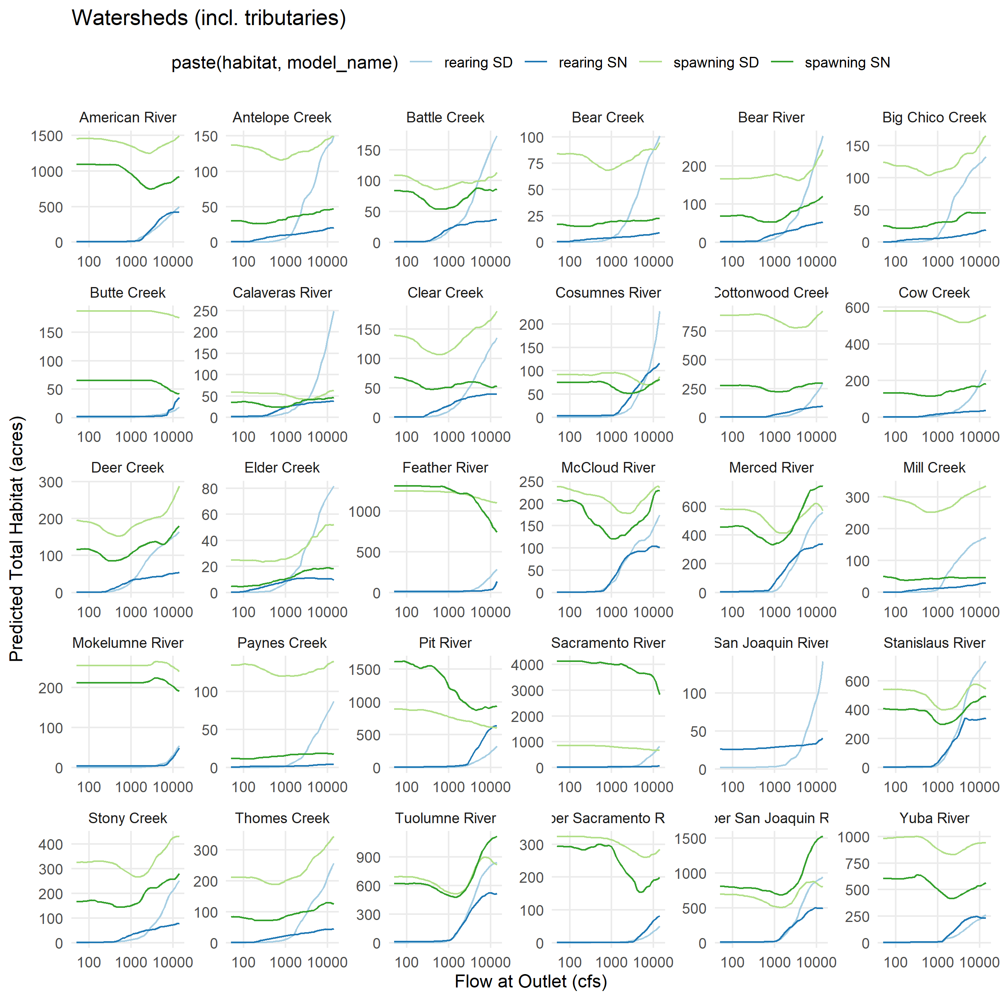

Predictor Data Preparation and Consolidation
================
[Skyler Lewis](mailto:slewis@flowwest.com)
2024-09-25

- [Basic Flow Crosswalk via Drainage Area and
  Precipitation](#basic-flow-crosswalk-via-drainage-area-and-precipitation)
  - [Applying the crosswalk to aggregate model
    results](#applying-the-crosswalk-to-aggregate-model-results)
- [Applying this method to the duration
  analyis](#applying-this-method-to-the-duration-analyis)
  - [Streamgage drainage area
    attributes](#streamgage-drainage-area-attributes)
  - [Example application to COMID-level flow-to-suitable-area
    curve](#example-application-to-comid-level-flow-to-suitable-area-curve)
  - [Example application to watershed-level flow-to-suitable-area
    curve](#example-application-to-watershed-level-flow-to-suitable-area-curve)

``` r
library(tidyverse)
```

    ## ── Attaching core tidyverse packages ──────────────────────── tidyverse 2.0.0 ──
    ## ✔ dplyr     1.1.4     ✔ readr     2.1.5
    ## ✔ forcats   1.0.0     ✔ stringr   1.5.1
    ## ✔ ggplot2   3.5.1     ✔ tibble    3.2.1
    ## ✔ lubridate 1.9.3     ✔ tidyr     1.3.1
    ## ✔ purrr     1.0.2     
    ## ── Conflicts ────────────────────────────────────────── tidyverse_conflicts() ──
    ## ✖ dplyr::filter() masks stats::filter()
    ## ✖ dplyr::lag()    masks stats::lag()
    ## ℹ Use the conflicted package (<http://conflicted.r-lib.org/>) to force all conflicts to become errors

``` r
library(sf)
```

    ## Linking to GEOS 3.12.1, GDAL 3.8.4, PROJ 9.3.1; sf_use_s2() is TRUE

``` r
library(habistat)
theme_set(theme_minimal())
```

## Basic Flow Crosswalk via Drainage Area and Precipitation

See watershed_delineation.R for dependencies

``` r
make_flow_xw <- function(group_var) {
  habistat::flowline_attr |>
  select({{group_var}}, 
         comid = comid,
         da_reach = da_area_sq_km_tot,
         pc_reach = da_ppt_mean_mm) |>
  drop_na({{group_var}}) |>
  group_by({{group_var}}) |>
  mutate(outlet_comid = comid[which.max(da_reach)]) |>
  mutate(da_outlet = da_reach[which(comid == outlet_comid)],
         pc_outlet = pc_reach[which(comid == outlet_comid)]) |>
  mutate(multiplier = (da_reach / da_outlet) * (pc_reach / pc_outlet)) |>
  arrange({{group_var}}, -multiplier)
}

cv_watersheds_flow_xw <- make_flow_xw(watershed_level_3)
cv_watersheds_flow_xw |> usethis::use_data(overwrite=T)
```

    ## ✔ Setting active project to
    ##   "C:/Users/skylerlewis/Github/swc-habitat-suitability-parallel".

    ## ✔ Saving "cv_watersheds_flow_xw" to "data/cv_watersheds_flow_xw.rda".

    ## ☐ Document your data (see <https://r-pkgs.org/data.html>).

``` r
cv_mainstems_flow_xw <- make_flow_xw(river_cvpia)
cv_mainstems_flow_xw |> usethis::use_data(overwrite=T)
```

    ## ✔ Saving "cv_mainstems_flow_xw" to "data/cv_mainstems_flow_xw.rda".
    ## ☐ Document your data (see <https://r-pkgs.org/data.html>).

``` r
habistat::flowline_geom_proj |>
  inner_join(cv_watersheds_flow_xw, by=join_by(comid)) |>
  filter(comid %in% habistat::wua_predicted$comid) |>
  ggplot() + 
  geom_sf(aes(color = multiplier)) + 
  geom_sf(data = habistat::flowline_geom_proj |> 
            filter(comid %in% cv_watersheds_flow_xw$outlet_comid) |> 
            st_line_sample(sample=1), 
          aes(color = 1)) + 
  scale_color_viridis_c(direction = -1) +
  ggtitle("Flow Multipliers by Watershed")
```

<!-- -->

``` r
habistat::flowline_geom_proj |>
  inner_join(cv_mainstems_flow_xw, by=join_by(comid)) |>
  filter(comid %in% habistat::wua_predicted$comid) |>
  ggplot() + 
  geom_sf(aes(color = multiplier)) + 
  geom_sf(data = habistat::flowline_geom_proj |> 
            filter(comid %in% cv_mainstems_flow_xw$outlet_comid) |> 
            st_line_sample(sample=1), 
          aes(color = 1)) + 
  scale_color_viridis_c(direction = -1) + 
  ggtitle("Flow Multipliers by Mainstem")
```

<!-- -->

### Applying the crosswalk to aggregate model results

``` r
wua_predicted_cv_watersheds <- 
  habistat::wua_predicted |>
  inner_join(cv_watersheds_flow_xw, 
             by=join_by(watershed_level_3, comid)) |>
  expand_grid(scaled = c(FALSE, TRUE)) |>
  mutate(flow_cfs = if_else(scaled, flow_cfs * multiplier, flow_cfs)) |>
  arrange(habitat, model_name, comid, flow_cfs) |>
  group_by(habitat, model_name, comid) |>
  mutate(wua_per_lf_pred = if_else(scaled, NA, wua_per_lf_pred)) |>
  mutate(wua_per_lf_pred = zoo::na.approx(wua_per_lf_pred, x = flow_cfs, na.rm=F, rule=2)) |>
  filter(scaled) |>
  select(-scaled) |>
  ungroup() |>
  group_by(habitat, model_name, watershed_level_3, flow_idx) |>
  summarize(wua_per_lf_pred = sum(wua_per_lf_pred * reach_length_ft) / sum(reach_length_ft),
            wua_acres_pred = sum(wua_per_lf_pred * reach_length_ft) / 43560, .groups="drop") |>
  inner_join(habistat::wua_predicted |> 
               group_by(flow_idx) |> 
               summarize(flow_cfs = first(flow_cfs), .groups="drop"),
             by = join_by(flow_idx))

wua_predicted_cv_watersheds |> usethis::use_data(overwrite=T)
```

    ## ✔ Saving "wua_predicted_cv_watersheds" to
    ##   "data/wua_predicted_cv_watersheds.rda".

    ## ☐ Document your data (see <https://r-pkgs.org/data.html>).

``` r
wua_predicted_cv_mainstems <- 
  habistat::wua_predicted |> 
  inner_join(cv_mainstems_flow_xw, 
             by=join_by(river_cvpia, comid)) |>
  expand_grid(scaled = c(FALSE, TRUE)) |>
  mutate(flow_cfs = if_else(scaled, flow_cfs * multiplier, flow_cfs)) |>
  arrange(habitat, model_name, comid, flow_cfs) |>
  group_by(habitat, model_name, comid) |>
  mutate(wua_per_lf_pred = if_else(scaled, NA, wua_per_lf_pred)) |>
  mutate(wua_per_lf_pred = zoo::na.approx(wua_per_lf_pred, x = flow_cfs, na.rm=F, rule=2)) |>
  filter(scaled) |>
  select(-scaled) |>
  ungroup() |>
  group_by(habitat, model_name, river_cvpia, flow_idx) |>
  summarize(wua_per_lf_pred = sum(wua_per_lf_pred * reach_length_ft) / sum(reach_length_ft),
            wua_acres_pred = sum(wua_per_lf_pred * reach_length_ft) / 43560, .groups="drop") |>
  inner_join(habistat::wua_predicted |> 
               group_by(flow_idx) |> 
               summarize(flow_cfs = first(flow_cfs), .groups="drop"),
             by = join_by(flow_idx))

wua_predicted_cv_mainstems |> usethis::use_data(overwrite=T)
```

    ## ✔ Saving "wua_predicted_cv_mainstems" to "data/wua_predicted_cv_mainstems.rda".
    ## ☐ Document your data (see <https://r-pkgs.org/data.html>).

Plotting the output

``` r
wua_predicted_cv_watersheds |>
  ggplot(aes(x = flow_cfs)) + 
  facet_wrap(~watershed_level_3, scales="free") + 
  geom_line(aes(y = wua_acres_pred, color = paste(habitat, model_name))) +
  scale_x_log10() +
  theme(legend.position = "top", panel.grid.minor = element_blank()) + 
  scale_color_brewer(palette = "Paired") +
  ylab("Predicted Total Habitat (acres)") + xlab("Flow at Outlet (cfs)")
```

<!-- -->

Versus the “naive” method

``` r
wua_predicted |>
  filter(!is.na(watershed_level_3)) |>
  group_by(habitat, model_name, watershed_level_3, flow_idx, flow_cfs) |>
  summarize(wua_per_lf_pred = sum(wua_per_lf_pred * reach_length_ft) / sum(reach_length_ft),
            wua_acres_pred = sum(wua_per_lf_pred * reach_length_ft) / 43560, .groups="drop") |>
  ggplot(aes(x = flow_cfs)) + 
  facet_wrap(~watershed_level_3, scales="free") + 
  geom_line(aes(y = wua_acres_pred, color = paste(habitat, model_name))) +
  scale_x_log10() +
  theme(legend.position = "top", panel.grid.minor = element_blank()) + 
  scale_color_brewer(palette = "Paired") +
  ylab("Predicted Total Habitat (acres)") + xlab("Flow (cfs)")
```

<!-- -->

## Applying this method to the duration analyis

- Associate each streamgage with a COMID, drainage area, and DA
  precipitation
- When doing COMID scale duration analysis, use these values to scale
  the x axis of the inundation curve directly
- When doing watershed scale duration analysis
  - pick a streamgage
  - for each selected comid,
    - create a flow-to-suitable-area curve along downscaled flows using
      complete-approx method (above)
    - make a flow-scaled version of the gage’s inundation curve
    - apply the flow-scaled inundation curve to the flow-scaled habitat
      curve
  - consolidate and sum the result curves

### Streamgage drainage area attributes

``` r
streamgage_da_attr <-
  habistat::cv_mainstems |>
  nest(stem_ln_geom = c(comid, habitat, geometry), .by = c(river_group, river_cvpia)) |>
  inner_join(habistat::streamgage_attr, by=join_by(river_group, river_cvpia)) |>
  inner_join(x=habistat::streamgage_geom |> nest(gage_pt_geom = c(geometry)), 
             y=_, 
             by=join_by(station_id)) |>
  mutate(gage_comid = map2_int(gage_pt_geom, stem_ln_geom,
                               function(gage_pt, stem_ln) stem_ln$comid[[st_nearest_feature(gage_pt, stem_ln)]])) |>
  select(station_id, gage_comid) |>
  inner_join(habistat::flowline_attr |>
              select(gage_comid = comid,
                     da_gage = da_area_sq_km,
                     pc_gage = da_ppt_mean_mm), 
             by=join_by(gage_comid)) |>
  glimpse()
```

    ## Rows: 163
    ## Columns: 4
    ## Groups: station_id [163]
    ## $ station_id <chr> "afo", "amf", "amk", "amr", "atc", "bas", "bat", "bcd", "bc…
    ## $ gage_comid <dbl> 948021150, 15024885, 14982590, 2829122, 8019804, 2766098, 2…
    ## $ da_gage    <dbl> 4928.9751, 4833.0171, 493.1172, 2838.5181, 321.4746, 798.25…
    ## $ pc_gage    <dbl> 1349.6419, 1363.6610, 1350.1780, 1019.7141, 1096.5603, 1227…

``` r
streamgage_da_attr |> usethis::use_data(overwrite = T)
```

    ## ✔ Saving "streamgage_da_attr" to "data/streamgage_da_attr.rda".

    ## ☐ Document your data (see <https://r-pkgs.org/data.html>).

### Example application to COMID-level flow-to-suitable-area curve

``` r
selected_comid <- 8020536  
selected_gage <- "dcv"
selected_habitat <- "rearing"
selected_model <- "SD"
selected_run <- "fall"
selected_wy_type <- "Dry"

fsa <-
  habistat::wua_predicted |>
  filter((model_name == selected_model) & 
           (habitat == selected_habitat) &
           (comid == selected_comid)) |>
  glimpse()
```

    ## Rows: 50
    ## Columns: 10
    ## $ comid             <dbl> 8020536, 8020536, 8020536, 8020536, 8020536, 8020536…
    ## $ model_name        <chr> "SD", "SD", "SD", "SD", "SD", "SD", "SD", "SD", "SD"…
    ## $ flow_idx          <int> 50, 56, 63, 70, 79, 89, 100, 112, 125, 141, 158, 177…
    ## $ flow_cfs          <dbl> 50.11872, 56.23413, 63.09573, 70.79458, 79.43282, 89…
    ## $ wua_per_lf_pred   <dbl> 0.01678549, 0.01748699, 0.01870815, 0.02189321, 0.02…
    ## $ river_group       <fct> Deer Creek, Deer Creek, Deer Creek, Deer Creek, Deer…
    ## $ river_cvpia       <fct> Deer Creek, Deer Creek, Deer Creek, Deer Creek, Deer…
    ## $ watershed_level_3 <fct> Deer Creek, Deer Creek, Deer Creek, Deer Creek, Deer…
    ## $ reach_length_ft   <dbl> 7732.94, 7732.94, 7732.94, 7732.94, 7732.94, 7732.94…
    ## $ habitat           <chr> "rearing", "rearing", "rearing", "rearing", "rearing…

``` r
selected_comid_attr <- 
  habistat::flowline_attr |>
  filter(comid == selected_comid) |>
  as.list()

drc <-
  habistat::streamgage_duration_rating_curves |>
  filter((station_id == selected_gage) & 
           (habitat == selected_habitat) & 
           (run == selected_run) & 
           (wy_group == selected_wy_type)) |>
  unnest(data) 

drc_scaled <- drc |>
  inner_join(streamgage_da_attr, by=join_by(station_id)) |>
  mutate(model_q = model_q * (selected_comid_attr$da_area_sq_km_tot / da_gage) * (selected_comid_attr$da_ppt_mean_mm / pc_gage)) |>
  glimpse()
```

    ## Rows: 150
    ## Columns: 12
    ## $ station_id             <chr> "dcv", "dcv", "dcv", "dcv", "dcv", "dcv", "dcv"…
    ## $ run                    <fct> fall, fall, fall, fall, fall, fall, fall, fall,…
    ## $ habitat                <fct> rearing, rearing, rearing, rearing, rearing, re…
    ## $ wy_group               <fct> Dry, Dry, Dry, Dry, Dry, Dry, Dry, Dry, Dry, Dr…
    ## $ model_q                <dbl> 46.81536, 93.63073, 140.44609, 187.26145, 234.0…
    ## $ avg_max_days_inundated <dbl> 142.0909091, 41.0909091, 14.0909091, 7.1818182,…
    ## $ durhsi_rearing_vl      <dbl> 0.66, 0.66, 0.66, 0.66, 0.66, 0.66, 0.66, 0.66,…
    ## $ durhsi_rearing_vf      <dbl> 0.66, 0.66, 0.66, 1.00, 1.00, 1.00, 1.00, 1.00,…
    ## $ durhsi_spawning        <dbl> 1, 0, 0, 0, 0, 0, 0, 0, 0, 0, 0, 0, 0, 0, 0, 0,…
    ## $ gage_comid             <dbl> 8020924, 8020924, 8020924, 8020924, 8020924, 80…
    ## $ da_gage                <dbl> 542.574, 542.574, 542.574, 542.574, 542.574, 54…
    ## $ pc_gage                <dbl> 1484.876, 1484.876, 1484.876, 1484.876, 1484.87…

``` r
habistat::duration_apply_dhsi_to_fsa_curve(
        fsa = fsa,
        fsa_q = flow_cfs,
        fsa_wua = wua_per_lf_pred,
        drc = drc_scaled,
        drc_q = model_q,
        drc_dhsi = durhsi_rearing_vf) |>
        glimpse()
```

    ## Rows: 192
    ## Columns: 10
    ## $ q                       <dbl> 50.11872, 56.23413, 63.09573, 70.79458, 79.432…
    ## $ wua                     <dbl> 0.01678549, 0.01748699, 0.01870815, 0.02189321…
    ## $ dhsi                    <dbl> 0.6600000, 0.6600000, 0.6600000, 0.6600000, 0.…
    ## $ marginal_wua            <dbl> 0.0167854917, 0.0007014949, 0.0012211614, 0.00…
    ## $ wua_added               <dbl> 0.0167854917, 0.0007014949, 0.0012211614, 0.00…
    ## $ marginal_durwua_added   <dbl> 0.0110784245, 0.0004629867, 0.0008059665, 0.00…
    ## $ wua_removed             <dbl> 0, 0, 0, 0, 0, 0, 0, 0, 0, 0, 0, 0, 0, 0, 0, 0…
    ## $ marginal_durwua_removed <dbl> 0, 0, 0, 0, 0, 0, 0, 0, 0, 0, 0, 0, 0, 0, 0, 0…
    ## $ marginal_durwua         <dbl> 0.0110784245, 0.0004629867, 0.0008059665, 0.00…
    ## $ durwua                  <dbl> 0.01107842, 0.01154141, 0.01234738, 0.01444952…

### Example application to watershed-level flow-to-suitable-area curve

``` r
# CONTINUE HERE
```

``` r
knitr::knit_exit()
```
