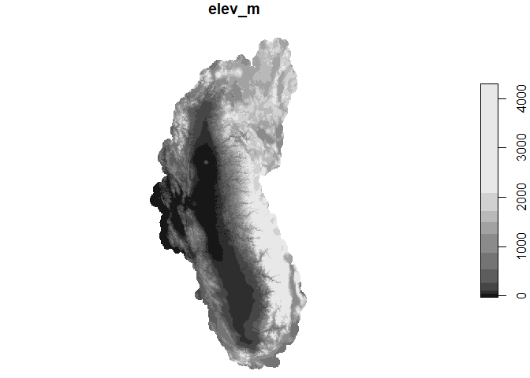
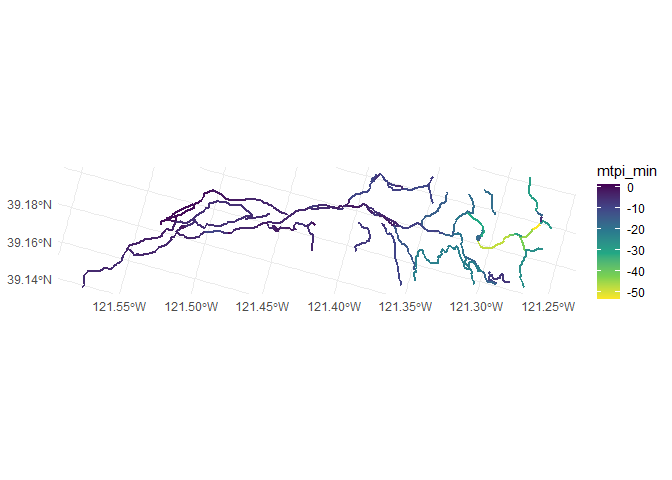
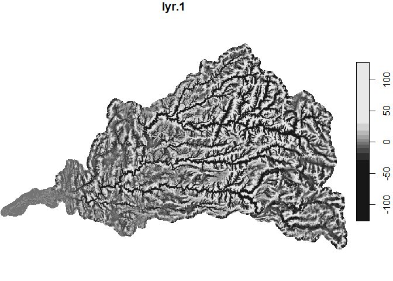
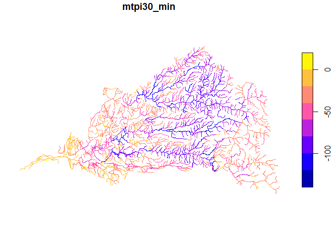
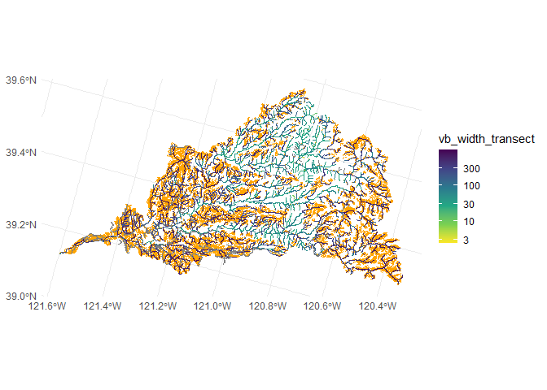

Terrain-Derived Predictors
================
[Skyler Lewis](mailto:slewis@flowwest.com)
2024-01-29

- [Load DEM](#load-dem)
  - [Data Source: 10m NHDPlusHR DEM](#data-source-10m-nhdplushr-dem)
  - [Data Source: 30m NHDPlusV2 DEM](#data-source-30m-nhdplusv2-dem)
- [Channel Confinement via mTPI](#channel-confinement-via-mtpi)
  - [Valley Bottom Width via Slope Cutoff
    Method](#valley-bottom-width-via-slope-cutoff-method)
  - [Valley Bottom Width via VBET](#valley-bottom-width-via-vbet)

``` r
selected_huc_8 <- c("18020107", "18020125")

flowlines <- readRDS("../data/flowline_geometries.Rds") |>
  left_join(readRDS("../data/flowline_attributes.Rds")) |>
  filter(huc_8 %in% selected_huc_8) |>
  st_transform(project_crs)
```

    ## Joining with `by = join_by(comid)`

``` r
catchments <- readRDS("../data/catchments.Rds")
# for now, this is just the catchments exported for the selected hucs
aoi <- catchments |> summarize() |> st_union()
```

## Load DEM

### Data Source: 10m NHDPlusHR DEM

This input has already been clipped to the AOI, converted from cm to m,
and crs redefined

Future improvement: script should pull straight from the source geotiff
and apply these changes programatically

``` r
dem <- read_stars("nhdplushr/dem_nhdplushr_yuba_meters_v2.tif") |>
  rename(elev = dem_nhdplushr_yuba_meters_v2.tif)

ggplot() + geom_stars(data=dem) + coord_fixed()
```

<!-- -->

Example calculating slope (can use `stars` or `terra`)

``` r
slope <- dem |> starsExtra::slope()

#slope <- dem |> terra::rast() |> terra::slope() |> st_as_stars()

ggplot() + geom_stars(data=slope) + coord_fixed()
```

<!-- -->

### Data Source: 30m NHDPlusV2 DEM

``` r
dir.create("temp/NEDSnapshot18b", recursive = TRUE)
```

    ## Warning in dir.create("temp/NEDSnapshot18b", recursive = TRUE):
    ## 'temp\NEDSnapshot18b' already exists

``` r
drive_file_by_id("1mBCDj4vd8DvJecm99FF6_kX5YKfg78hr") |>
  archive::archive_extract(dir = "temp/NEDSnapshot18b")
```

    ## ! Using an auto-discovered, cached token.

    ##   To suppress this message, modify your code or options to clearly consent to
    ##   the use of a cached token.

    ##   See gargle's "Non-interactive auth" vignette for more details:

    ##   <https://gargle.r-lib.org/articles/non-interactive-auth.html>

    ## ℹ The googledrive package is using a cached token for 'slewis@flowwest.com'.

    ## ⠙ 8 extracted | 281 MB (137 MB/s) | 2s⠹ 8 extracted | 287 MB (128 MB/s) | 2.2s⠸
    ## 8 extracted | 302 MB (124 MB/s) | 2.4s⠼ 8 extracted | 314 MB (118 MB/s) | 2.7s⠴
    ## 8 extracted | 323 MB (113 MB/s) | 2.9s⠦ 10 extracted | 332 MB (109 MB/s) |
    ## 3.1s⠧ 10 extracted | 342 MB (105 MB/s) | 3.3s⠇ 10 extracted | 356 MB (103 MB/s)
    ## | 3.5s⠏ 10 extracted | 369 MB (101 MB/s) | 3.7s⠋ 10 extracted | 384 MB ( 99
    ## MB/s) | 3.9s⠙ 10 extracted | 393 MB ( 96 MB/s) | 4.1s⠹ 10 extracted | 408 MB (
    ## 95 MB/s) | 4.3s⠸ 10 extracted | 417 MB ( 93 MB/s) | 4.5s⠼ 10 extracted | 427 MB
    ## ( 91 MB/s) | 4.7s⠴ 10 extracted | 437 MB ( 89 MB/s) | 4.9s⠦ 10 extracted | 445
    ## MB ( 87 MB/s) | 5.1s⠧ 10 extracted | 454 MB ( 86 MB/s) | 5.3s⠇ 10 extracted |
    ## 462 MB ( 84 MB/s) | 5.5s⠏ 10 extracted | 470 MB ( 82 MB/s) | 5.7s⠋ 10 extracted
    ## | 482 MB ( 81 MB/s) | 5.9s⠙ 10 extracted | 494 MB ( 81 MB/s) | 6.1s⠹ 10
    ## extracted | 501 MB ( 79 MB/s) | 6.3s⠸ 10 extracted | 508 MB ( 78 MB/s) | 6.5s⠼
    ## 10 extracted | 512 MB ( 76 MB/s) | 6.7s⠴ 10 extracted | 518 MB ( 75 MB/s) |
    ## 6.9s⠦ 10 extracted | 520 MB ( 73 MB/s) | 7.1s⠧ 10 extracted | 523 MB ( 71 MB/s)
    ## | 7.3s⠇ 10 extracted | 532 MB ( 71 MB/s) | 7.5s⠏ 10 extracted | 537 MB ( 69
    ## MB/s) | 7.7s⠋ 10 extracted | 546 MB ( 69 MB/s) | 7.9s⠙ 10 extracted | 558 MB (
    ## 68 MB/s) | 8.1s⠹ 10 extracted | 566 MB ( 68 MB/s) | 8.4s⠸ 10 extracted | 574 MB
    ## ( 67 MB/s) | 8.6s⠼ 10 extracted | 583 MB ( 67 MB/s) | 8.8s⠴ 10 extracted | 594
    ## MB ( 66 MB/s) | 9s ⠦ 10 extracted | 604 MB ( 66 MB/s) | 9.2s⠧ 10 extracted |
    ## 616 MB ( 66 MB/s) | 9.4s⠇ 10 extracted | 624 MB ( 65 MB/s) | 9.6s

``` r
dem30 <- stars::read_stars("temp/NEDSnapshot18b/elev_cm")

dem_crs <- st_crs(dem30)

dem30 |> mutate(elev_m = elev_cm/100) |> select(elev_m) |> plot()
```

    ## downsample set to 48

<!-- -->

## Channel Confinement via mTPI

mTPI as a measure of topographic confinement

Souce: Theobald DM, Harrison-Atlas D, Monahan WB, Albano CM. 2015.
Ecologically-relevant maps of landforms and physiographic diversity for
climate adaptation planning. PLOS ONE. DOI: 10.1371/journal.pone.0143619

``` r
dem_rast <- terra::rast(dem) 
cell_size <- 10 # mean(terra::res(dem_rast))
tpi_90 <- dem_rast - terra::focal(dem_rast, w=90/cell_size, fun="mean")
tpi_270 <- dem_rast - terra::focal(dem_rast, w=270/cell_size, fun="mean")
tpi_810 <- dem_rast - terra::focal(dem_rast, w=810/cell_size, fun="mean")
#tpi_2430 <- dem_rast - terra::focal(dem_rast, w=2430/cell_size, fun="mean")
mtpi <- terra::app(c(tpi_90, tpi_270, tpi_810), mean)
mtpi |> st_as_stars() |> plot()
```

    ## downsample set to 1

<!-- -->

``` r
flow_buffered <- terra::vect(flowlines) |> terra::buffer(width=50)
vec_mtpi_min <- terra::zonal(mtpi, flow_buffered, "min") |> rename(mtpi_min = mean)

mtpi_comid <- flowlines |>
  select(comid) |>
  mutate(vec_mtpi_min) |>
  st_drop_geometry() |> 
  select(comid, mtpi_min) |> 
  filter(!is.nan(mtpi_min))

flowlines |>
  inner_join(mtpi_comid) |>
  st_zm() |>
  ggplot() + 
  geom_sf(aes(color = mtpi_min), linewidth=1) + 
  scale_color_viridis_c(direction=-1)
```

    ## Joining with `by = join_by(comid)`

<!-- -->

Version converting to function and using the basin-wide 30m DEM

``` r
calc_mtpi <- function(dem, cell_size, neighborhoods=c(90,270,810,2430)) {
  is_stars <- "stars" %in% class(dem)
  if(is_stars){
    dem <- terra::rast(dem)
  }
  tpis <- terra::rast(lapply(neighborhoods, function(x) dem - terra::focal(dem, w=x/cell_size, fun="mean", na.rm=TRUE, na.policy="omit")))
  mtpi <- terra::app(tpis, mean)
  if(is_stars) {
    mtpi <- st_as_stars(mtpi)
  }
  return(mtpi)
}

# dem30_mtpi <- dem30 |> 
#   mutate(elev_m = elev_cm/100) |>
#   mutate(mtpi = calc_mtpi(elev_cm, 30, c(90,270,810)))
# # this proxy uses lazy operations that are only evaluated when called
# 
# flow_buffered <- terra::vect(flowlines) |> terra::buffer(width=50)
# mtpi30_aoi <- dem30_mtpi |> st_crop(aoi) |> select(mtpi) |> terra::rast()
# vec_mtpi30_min <- terra::zonal(mtpi_aoi, flow_buffered, "min") |> rename(mtpi30_min = mean)
# 
# #dem30_mtpi |> saveRDS("../data/dem30.Rds")
# 
# dem30_mtpi |> st_crop(aoi) |> select(mtpi) |> plot()


# alternate order not relying entirely on proxies
cell_size <- 30

flow_buffered <- terra::vect(flowlines) |> terra::buffer(width=cell_size/2)

aoi_buffer <- aoi |> st_buffer(2430/2) # big enough to not create edge effects
dem30_rast <- dem30 |> st_crop(aoi_buffer) |> terra::rast()
```

``` r
# uncomment to implement for entire watershed
# dem30_rast <- dem30 |> terra::rast()

dem30_rast_mtpi <- (calc_mtpi(dem30_rast, cell_size, c(90,270,810, 2430)) / 100) |> terra::app(round) |> terra::as.int() # convert to m, 16-bit integer

vec_mtpi30_min <- terra::zonal(dem30_rast_mtpi, flow_buffered, "min") |> rename(mtpi30_min = lyr.1)

dem30_rast_mtpi |> st_as_stars() |> plot()
```

    ## downsample set to 4

<!-- -->

``` r
flowlines_mtpi <- flowlines |> select(comid) |> mutate(vec_mtpi30_min) 

flowlines_mtpi |> st_zm() |> select(mtpi30_min) |> plot()
```

<!-- -->

``` r
flowlines_mtpi |> st_drop_geometry() |> saveRDS("../data/attr_mtpi.Rds")
```

### Valley Bottom Width via Slope Cutoff Method

Method described in
<https://watermanagement.ucdavis.edu/download_file/view_inline/144>

``` r
valley_bottom <- function(catchment, flowline, dem) {
  dem |> 
    st_crop(catchment) |> 
    starsExtra::slope() |>
    mutate(valley_bottom = if_else(slope<units::set_units(atan(0.25)*180/pi,"degrees"), 1, NA)) |>
    select(valley_bottom) |>
    st_as_sf(merge=TRUE) |>
    st_filter(st_zm(flowline)) #|> st_as_sfc()
}

valley_bottom_by_comid <- function(x, dem) {
  c <- catchments |> filter(comid==x)
  f <- flowlines |> filter(comid==x)
  valley_bottom(c, f, dem)
}

valley_width_naive <- function(geom_valley_bottom) {
   geom_valley_bottom |> 
    terra::vect() |> 
    terra::width()
}

perpendicular_transect <- function(pair=st_multipoint(), length=numeric()) {
  x1 <- pair[1]
  x2 <- pair[2]
  y1 <- pair[3]
  y2 <- pair[4]
  midpoint_x <- (x1+x2)/2
  midpoint_y <- (y1+y2)/2
  orig_bearing <- atan2((y2-y1), (x2-x1))
  perp_bearing <- orig_bearing + pi/2
  radius <- length/2
  perp_x1 <- midpoint_x + radius*cos(perp_bearing)
  perp_y1 <- midpoint_y + radius*sin(perp_bearing)
  perp_x2 <- midpoint_x - radius*cos(perp_bearing)
  perp_y2 <- midpoint_y - radius*sin(perp_bearing)
  return(st_linestring(c(st_point(c(perp_x1,perp_y1)), 
                         st_point(c(perp_x2, perp_y2)))))
}

perpendicular_transects <- function(ls=st_linestring(), length=numeric()) {
  if ("sf" %in% class(ls)){
    ls <- st_as_sfc(ls, crs=st_crs(ls))
  }
  if ("sfc" %in% class(ls)){
    m <- t(st_zm(ls[[1]]))
  } 
  if ("sfg" %in% class(ls)){
    m <- t(ls)
  }
  point_pairs <- lapply(seq(1, length(m)-3, 2), function(i) c(st_point(c(m[i], m[i+1])), st_point(c(m[i+2], m[i+3]))))
  perp_lines <- lapply(point_pairs, function(pair) perpendicular_transect(pair, length))
  return(st_sfc(perp_lines, crs=st_crs(ls)))
}

valley_width_via_transects <- function(geom_valley_bottom, flowline, max_width) {
  transects <- perpendicular_transects(flowline, length=max_width)
  if("sfg" %in% class(geom_valley_bottom)) {
    geom_valley_bottom <- st_sfc(geom_valley_bottom, crs=st_crs(transects))
  }
  clipped <- st_intersection(transects, geom_valley_bottom)
  return(mean(st_length(clipped)))
}
```

``` r
flowline <- flowlines |> filter(comid==8062593) |> st_zm()
catchment <- catchments |> filter(comid==8062593) |> st_transform(st_crs(flowline))
ggplot() + 
  #geom_stars(data=catchment_confinement(catchment, flowline, dem)) + 
  geom_sf(data=valley_bottom(catchment, flowline, dem)) +
  geom_sf(data=st_zm(flowline))
```

<!-- -->

``` r
valley_width_naive(valley_bottom(catchment, flowline, dem))
```

    ## [1] 666.9869

``` r
valley_polygon <- valley_bottom(catchment, flowline, dem)
valley_width_via_transects(valley_bottom(catchment, flowline, dem), flowline, max_width=1000)
```

    ## 148.7645 [m]

``` r
ggplot() + 
  geom_sf(data=catchment) +
  geom_sf(data=valley_polygon, fill="lightblue") +
  geom_sf(data=flowline, color="blue") +
  geom_sf(data=perpendicular_transects(flowline, length=1000) |> st_intersection(valley_polygon), color="red") 
```

<!-- -->

``` r
dem30_m <- st_as_stars(dem30_rast/100) 

flowline <- flowlines |> filter(comid==8062593) |> st_zm()
catchment <- catchments |> filter(comid==8062593) |> st_transform(st_crs(flowline))
ggplot() + 
  #geom_stars(data=catchment_confinement(catchment, flowline, dem)) + 
  geom_sf(data=valley_bottom(catchment, flowline, dem30_m)) +
  geom_sf(data=st_zm(flowline))
```

<!-- -->

``` r
valley_width_naive(valley_bottom(catchment, flowline, dem30_m))
```

    ## [1] 1069.055

``` r
valley_polygon <- valley_bottom(catchment, flowline, dem30_m)
valley_width_via_transects(valley_bottom(catchment, flowline, dem30_m), flowline, max_width=1000)
```

    ## 178.2545 [m]

``` r
ggplot() + 
  geom_sf(data=catchment) +
  geom_sf(data=valley_polygon, fill="lightblue") +
  geom_sf(data=flowline, color="blue") +
  geom_sf(data=perpendicular_transects(flowline, length=1000) |> st_intersection(valley_polygon), color="red") 
```

<!-- -->

``` r
#vb1 <- flowlines |> 
#  filter(huc_8 %in% selected_huc_8) |> 
#  #filter(comid==8062593) |> # comment out the filter to process all
#  mutate(flowline = st_set_crs(st_zm(geometry),project_crs)) |>
#  st_drop_geometry() |>
#  mutate(valley_bottom_geoms = st_as_sfc(bind_rows(map(comid, possibly(function(x) valley_bottom_by_comid(x, dem), otherwise=NA))), crs=project_crs)) |>
#  mutate(vb_width_simple = map_dbl(valley_bottom_geoms, possibly(function(x) valley_width_naive(x), otherwise=NA))) |> 
#  mutate(vb_width_transect = map2_dbl(valley_bottom_geoms, flowline, function(x, y) valley_width_via_transects(x, y, 1000)),
#         vb_width_transect = if_else(!is.nan(vb_width_transect),vb_width_transect,NA)) |> 
#  select(comid, flowline, valley_bottom_geoms, vb_width_simple, vb_width_transect) 
#
#vb1 |> saveRDS("../data/attr_vb1.Rds")
```

``` r
vb1 <- 
  flowlines |> 
  filter(huc_8 %in% selected_huc_8) |> #|> head(10) |>
  #filter(comid==8062593 | (comid>8062580 & comid<8062599)) |> # comment out the filter to process all
  mutate(flowline = st_set_crs(st_zm(geometry),project_crs)) |>
  st_drop_geometry() |>
  #mutate(valley_bottom_geoms = st_as_sfc(bind_rows(map(comid, possibly(function(x) valley_bottom_by_comid(x, dem30_m), otherwise=NA))), crs=project_crs))# |>
  mutate(valley_bottom_geoms = st_sfc(map(comid, possibly(function(x) st_union(valley_bottom_by_comid(x, dem30_m)$geometry)[[1]], otherwise=st_polygon())), crs=dem_crs)) |>
  mutate(vb_width_simple = map_dbl(valley_bottom_geoms, possibly(function(x) valley_width_naive(x), otherwise=NA))) |> 
  mutate(vb_width_transect = map2_dbl(valley_bottom_geoms, flowline, function(x, y) valley_width_via_transects(x, y, 1000)),
         vb_width_transect = if_else(!is.nan(vb_width_transect),vb_width_transect,0)) |> 
  select(comid, flowline, valley_bottom_geoms, vb_width_simple, vb_width_transect) 
```

    ## Warning: There were 2264 warnings in `mutate()`.
    ## The first warning was:
    ## ℹ In argument: `vb_width_simple = map_dbl(...)`.
    ## Caused by warning:
    ## ! [perim] unknown CRS. Results can be wrong
    ## ℹ Run `dplyr::last_dplyr_warnings()` to see the 2263 remaining warnings.

``` r
#vb1 |> saveRDS("../data/attr_vb1.Rds")
```

``` r
vb1 |> 
  filter(!is.na(vb_width_transect)) |> 
  st_set_geometry("flowline") |> 
  ggplot() +
  geom_sf(data=vb1$valley_bottom_geoms, color=NA, fill="orange") + 
  geom_sf(aes(color=vb_width_transect)) + 
  scale_color_viridis_c(direction=-1, trans="log10")
```

    ## Warning: Transformation introduced infinite values in discrete y-axis

<!-- -->

### Valley Bottom Width via VBET

Extract flowlines to use in vbet

``` r
flowlines_for_vbet <- flowlines |>
  filter(gnis_name %in% c("Yuba River")) |>
  st_transform(st_crs(dem)) |>
  st_zm() |> 
  st_crop(st_bbox(dem)) |>
  smoothr::densify(5)
```

    ## Warning: attribute variables are assumed to be spatially constant throughout
    ## all geometries
