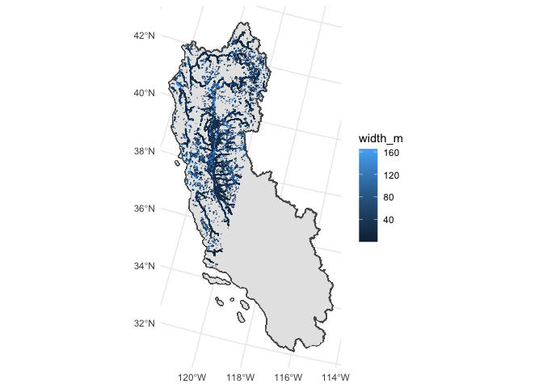
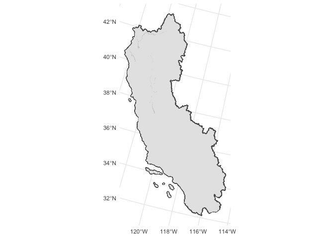

Channel Width Datasets
================
Maddee Rubenson (FlowWest)
2024-02-07

## River Channel Width Dataset Exploration

#### Summary

Aggregated channel width measurements for two datasets: Global River
Width Database (GRWD) and Merit Hydro. The dataset from Merit hydro was
more robust and covered a large spatial area than GRWD and therefore
will be used in this analysis by merging with NHD COMIDs.

## Global River Width Database

- <http://hydro.iis.u-tokyo.ac.jp/~yamadai/GWD-LR/>
- downloadable link here:<https://zenodo.org/records/1269595>

#### Vector files that overlap with the Central Valley

``` r
nk10 <- drive_file_by_id('1H-oAmip5Pp2H0sQJnGRT_srypQGy8dWE', vsizip=T) |>
  st_read()
```

    ## Reading layer `NK10' from data source `/vsizip/temp/NK10.zip' using driver `ESRI Shapefile'
    ## Simple feature collection with 52767 features and 10 fields
    ## Geometry type: LINESTRING
    ## Dimension:     XY
    ## Bounding box:  xmin: -124.4289 ymin: 40 xmax: -121.7742 ymax: 44
    ## Geodetic CRS:  WGS 84

``` r
nj10 <- drive_file_by_id('1xq-0uoJbCA5fQE38OsOK1mi9k3boXsmF', vsizip = T) |> 
  st_read()
```

    ## Reading layer `NJ10' from data source `/vsizip/temp/NJ10.zip' using driver `ESRI Shapefile'
    ## Simple feature collection with 29601 features and 10 fields
    ## Geometry type: LINESTRING
    ## Dimension:     XY
    ## Bounding box:  xmin: -122.2447 ymin: 37.3486 xmax: -120.972 ymax: 40
    ## Geodetic CRS:  WGS 84

``` r
all_width_data_in_cv <- nk10 |> 
  bind_rows(nj10) |> 
  janitor::clean_names() |> 
  filter(lake_flag == 0) |> 
  mutate(width_feet = width_m * 3.28084) |> 
  glimpse()
```

    ## Rows: 62,126
    ## Columns: 12
    ## $ utm_east    <int> 594210, 594510, 594540, 594570, 594600, 594630, 594660, 59…
    ## $ utm_north   <dbl> 4683810, 4683240, 4683210, 4683180, 4683180, 4683150, 4683…
    ## $ width_m     <int> 3131, 3167, 3134, 3092, 2988, 2925, 2923, 2922, 2942, 2995…
    ## $ nchannels   <dbl> 1, 2, 2, 2, 2, 2, 2, 2, 2, 2, 2, 2, 2, 2, 2, 2, 2, 2, 1, 1…
    ## $ segment_id  <int> 0, 0, 0, 0, 0, 0, 0, 0, 0, 0, 0, 0, 0, 0, 0, 0, 0, 0, 0, 0…
    ## $ segment_ind <dbl> 592, 612, 613, 614, 615, 616, 617, 618, 619, 620, 621, 622…
    ## $ lake_flag   <dbl> 0, 0, 0, 0, 0, 0, 0, 0, 0, 0, 0, 0, 0, 0, 0, 0, 0, 0, 0, 0…
    ## $ lon         <dbl> -121.8571, -121.8533, -121.8530, -121.8526, -121.8522, -12…
    ## $ lat         <dbl> 42.30069, 42.29552, 42.29525, 42.29511, 42.29497, 42.29470…
    ## $ elev_m      <int> 1262, 1268, 1268, 1268, 1268, 1268, 1268, 1268, 1268, 1268…
    ## $ geometry    <LINESTRING [°]> LINESTRING (-121.857 42.300..., LINESTRING (-12…
    ## $ width_feet  <dbl> 10272.3100, 10390.4203, 10282.1526, 10144.3573, 9803.1499,…

``` r
# ggplot(all_width_data_in_cv, aes(x = width_feet)) +
#   geom_histogram(bins = 100)

summary(all_width_data_in_cv$width_feet)
```

    ##      Min.   1st Qu.    Median      Mean   3rd Qu.      Max. 
    ##     3.281   137.795   206.693   291.299   354.331 10931.759

``` r
all_width_data_in_cv_trunc <- all_width_data_in_cv |> 
  filter(width_feet < 354) #3rd quantile 

ggplot(all_width_data_in_cv_trunc, aes(x = width_feet)) +
  geom_histogram()
```

<!-- -->

``` r
ggplot() +
  geom_sf(data = watersheds) +
  geom_sf(data = all_width_data_in_cv_trunc, aes(color = width_feet))
```

<!-- -->

``` r
#saveRDS(all_width_data_in_cv_trunc, 'width_data/global_width_dataset.RDS')
```

## Merit Hydro

Data source: <https://hydro.iis.u-tokyo.ac.jp/~yamadai/MERIT_Hydro/>

River width is reprepared in 4-byte float (float32), in meter. The
values larger than 0 represents the river width at the channel
centerlines. The value “-1” represents non-centerline water pixels, and
the value “0” corresponds to the non-water pixels.

The undefined pixels (oceans) are represented by the value -9999. River
channel width is calculated by the method described in \[Yamazaki et
al. 2012, WRR\], with some improvements/changes on the algorithm.

``` r
flowlines <- readRDS("../data/flowline_geometries.Rds") |>
  st_transform(project_crs)

import_merit <- function(fileid, varname) {
  drive_file_by_id(fileid, vsizip = F) |>
  raster::raster() |> 
  st_as_stars() |> 
  st_as_sf(merge = TRUE) |> 
  st_cast("MULTILINESTRING") |> 
  st_transform(project_crs) |> 
  rename_at(1, ~'width_m') |> 
  filter(width_m > 0)
}

merit_ids <- c(
  n40w125_wth = '1EU8qVDJy-UXfehkxgXXNbM1x5AJpxrpu',
  n35w125_wth = '10D-q6xHkVNqqqGVS98XpGYVrn2oqFDAi',
  n30w125_wth = '17vpwVL4HYa74-VrXkewWvWg2YUjyqVfC',
  n40w120_wth = '1JRH0pFpW-RcmRspJDSnf7OS2gwvlQPiQ',
  n35w120_wth = '1IO6URekLRy0OQmPubSml0vLs_3SyGWz_',
  n30w120_wth = '16g2VNKhS_W6gmu6LH8JXrLUrd9C4hnEb',
  n35w115_wth = '1ZHuuqAEKKBcH4bjzCQ3cvzNeMuy7aVVI',
  n30w115_wth = '1hD6xcG5lp77Qm2bJx0Z8E3X8PRIbn12S')

all_merit <- bind_rows(lapply(names(merit_ids), function(x) import_merit(merit_ids[x], x))) |>
  mutate(width_feet = width_m * 3.28084)

summary(all_merit)
```

    ##     width_m                    geometry        width_feet      
    ##  Min.   :    0.45   MULTILINESTRING:367273   Min.   :    1.48  
    ##  1st Qu.:   14.97   epsg:NA        :     0   1st Qu.:   49.11  
    ##  Median :   47.35   +proj=aea ...  :     0   Median :  155.34  
    ##  Mean   :  227.53                            Mean   :  746.50  
    ##  3rd Qu.:  153.26                            3rd Qu.:  502.83  
    ##  Max.   :20567.65                            Max.   :67479.17

``` r
# filter by third quartile
all_merit_trunc <- all_merit |> 
  filter(width_m <= 153.26)

# ggplot() + 
#   geom_sf(data = watersheds) +
#   geom_sf(data = all_merit_trunc, aes(color = width_feet))

ggplot() +
  geom_histogram(data = all_merit_trunc, aes(x = width_feet))
```

<!-- -->

## Aggregate width measurements by NHD

### Merit data

``` r
join_width_and_flowlines <- st_join(all_merit_trunc |> st_transform(project_crs), flowlines |> st_zm()) |> filter(!is.na(comid)) |> 
  select(comid, merit_width_m = width_m)

ggplot() +
  geom_sf(data = watersheds) + 
  geom_sf(data = join_width_and_flowlines, aes(color = merit_width_m)) 
```

<!-- -->

``` r
saveRDS(join_width_and_flowlines |> st_drop_geometry(), 'width_data/merit_width_dataset_comid_join.RDS')
```

### Global Width Database

``` r
join_width_and_flowlines_gwd <- st_join(all_width_data_in_cv_trunc |> st_transform(project_crs), flowlines |> st_zm()) |> 
  filter(!is.na(comid)) |> 
  select(comid, gwd_width_m = width_m) |> 
  mutate(gwd_width_m = as.numeric(gwd_width_m))

ggplot() +
  geom_sf(data = watersheds) + 
  geom_sf(data = join_width_and_flowlines_gwd, aes(color = gwd_width_m))
```

<!-- -->

``` r
saveRDS(join_width_and_flowlines_gwd |> st_drop_geometry(), "width_data/gwd_width_dataset_comid_join.RDS")
```
