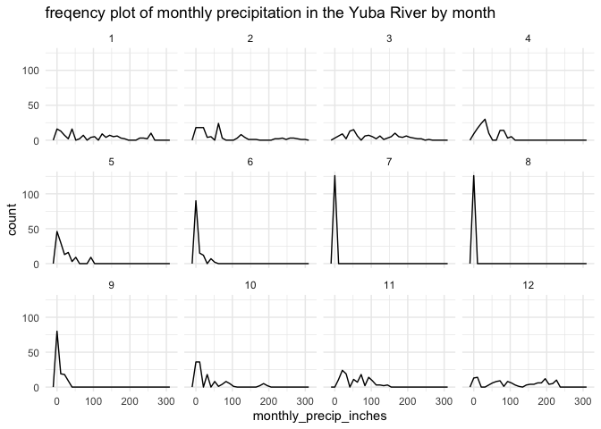

PRISM data aggregation
================
[Maddee Rubenson](mailto:mrubenson@flowwest.com)
2024-01-18

## PRISM data

PRISM (Parameter-elevation Regressions on Independent Slopes Model) is a
widely used dataset for providing high-resolution spatial data on
climate variables such as precipitation, temperature, and other related
variables. It is known for its high spatial resolution and long-term
data availability.

PRISM data are derived from a variety of sources such as weather
stations, satellites, and other observing systems. The data are then
processed using statistical methods to generate spatially continuous
datasets that cover large areas, often at a resolution of 4 kilometers
or finer.

PRISM website: <https://www.prism.oregonstate.edu/> Github `prism`
package: <https://github.com/ropensci/prism>

## Objective

Acquire PRISM-derived monthly and annual precipitation data for each
watershed in the Central Valley.

- years: 2010 - 2023
- months: January - December

### Slice precipitation data to Yuba River

Define a representative latitude and longitude for the Yuba River.

``` r
yuba <- c(-121.52628, 39.1758)

yuba_area_slice <- all_precip_data_cali_tidy |>
  mutate(lon_round = round(lon, 1),
         lat_round = round(lat, 1)) |>
  filter(lon_round == round(yuba[1], 1) &
         lat_round == round(yuba[2], 1)) |>
  mutate(year = as.numeric(str_extract(dataset, "\\d{4}")),
         month = as.numeric(str_extract(dataset, '\\d{2}(?=_)')))
```

### Summary Plots

``` r
yuba_area_slice |>
  ggplot(aes(x = monthly_precip_inches)) +
  geom_freqpoly() +
  facet_wrap(~month) +
  theme_minimal() +
  ggtitle('freqency plot of monthly precipitation in the Yuba River by month')
```

    ## `stat_bin()` using `bins = 30`. Pick better value with `binwidth`.

<!-- -->

### Summary

``` r
summary_table <- yuba_area_slice |> 
  group_by(month) |> 
  summarise(min_precip_in = min(monthly_precip_inches),
            max_precip_in = max(monthly_precip_inches),
            mean_precip_in = mean(monthly_precip_inches)) 

knitr::kable(summary_table, digits = 1)
```

| month | min_precip_in | max_precip_in | mean_precip_in |
|------:|--------------:|--------------:|---------------:|
|     1 |           2.8 |         262.7 |           97.7 |
|     2 |           0.0 |         299.2 |           75.6 |
|     3 |           4.3 |         253.4 |          103.7 |
|     4 |           2.0 |         104.3 |           39.4 |
|     5 |           0.0 |          95.9 |           19.8 |
|     6 |           0.0 |          48.0 |            7.1 |
|     7 |           0.0 |           0.4 |            0.0 |
|     8 |           0.0 |           4.6 |            0.4 |
|     9 |           0.0 |          32.9 |            6.6 |
|    10 |           0.0 |         195.9 |           36.1 |
|    11 |          12.1 |         143.4 |           58.1 |
|    12 |           4.1 |         229.4 |          111.6 |
