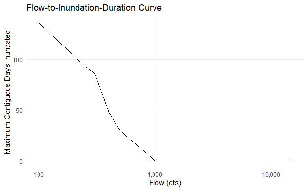
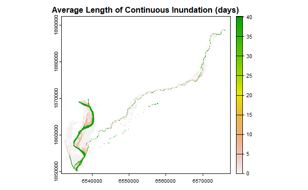

```{r setup, include = FALSE}
knitr::opts_chunk$set(
  collapse = TRUE,
  comment = "#>",
  base.dir = "./",
  base.url = "./articles",
  fig.path = "figures/duration-analysis-"
)
```

## Duration Analysis

The habitat areas (flow-to-suitable-area curves) predicted by the [Statistical Model](statistical_model.html) are derived from depth- and velocity-based habitat suitability index (HSI) criteria only.
Duration of inundation was not included at the statistical model step because it does not have the same one-to-one predictable relationship with flow: the duration of inundation at a given flow will vary by local hydrology and by water year.
Sometimes we might be interested in simulating a historic hydrology, other times we might be considering a potential future hydrology, so the ability to vary the inundation duration factor is necessary.

### Spatial Method

To precisely apply suitability criteria for inundation duration, inundation duration factors would need to be applied at the individual grid cell level in the same manner as depth and velocity.

For example, a series of depth raster grids at different flows, calculated using a hydraulic model, can be used to determine the first inundating flow for a given grid cell.
(For raster models, this can be calculated using the [raster_first_inundating_flow](../reference/raster_first_inundating_flow.html) function in habistat.) This example is shown for the Deer Creek hydraulic model:


Given a hydrograph for a particular water year, a relationship can be derived between flow and the number of contiguous days in a water year at which that flow is exceeded.
This method is implemented in the habistat function [duration_calc_days_inundated](../reference/duration_calc_days_inundated.html).



Combining the previous two steps, a spatial map of inundation duration can be created for this particular water year.
(**TODO: This map shows average length of contiguous inundation duration; update to show maximum contiguous inundation duration.**)



These duration values can then be used, in the same manner as depth and velocity, to calculate a habitat suitability index at each model grid cell.

However, for training the statistical model in habistat, we need a single flow-to-suitable-area curve for each reach to feed into the statistical model--*not* a series of curves for every potential hydrology.

### Non-Spatial Method

To solve this issue, habistat includes a simplified method of applying inundation duration criteria to an already generated flow-to-suitable-area curve, approximating a duration-weighted estimate:


**TODO: add step numbers so that they can be referenced elsewhere in the chart**

We start with the static depth and velocity based flow-to-suitable-area curve.

Next, we pull a hydrograph and calculate the inundation duration at each flow.To summarize the hydrology of a water year we are using the maximum contiguous days exceeding each given flow.
Then, we map these against the duration weighting factors, assigning zero for flows that are never reached.

Finally, we combine the flow-to-suitable-area curve and the flow-to-inundation-duration curve to produce a flow-to-suitable-area curve that has been scaled down using the duration criteria.
The following figure illustrates the process, which is implemented in the habistat function [duration_apply_dhsi_to_fsa_curve](../reference/duration_apply_dhsi_to_fsa_curve.html).


We apply the inundation duration suitability factors defined in the Habitat Quantification Tool based on the gradient class of the river:

+-------------------------+-----------------------+
| Valley Lowland          | Valley Foothill       |
+=========================+=======================+
| -   0 days: 0           | -   0 days: 0         |
| -   1 to 17 days: 0.66  | -   1 to 9 days: 1.00 |
| -   18 to 24 days: 1.00 | -   10+ days: 0.66    |
| -   25+ days: 0.66      |                       |
+-------------------------+-----------------------+

We assume that as we look at increasing flows (on the x axis), the marginal new habitat being added at each additional flow corresponds to area being newly inundated at that flow.
This is a simplification that is assumed to reflect the typical case.
So, the marginal habitat added at flow Q is multiplied by the corresponding inundation duration factor for that flow Q.

In the case where the flow-to-suitable-area curve slopes downward, the situation is different.
The loss in suitable habitat is not happening at the margin of the channel, it's happening somewhere within the channel in the area that was already inundated--most likely because the water has gotten too deep and too fast.
We don't know exactly where, so we apply an average of the previous duration factors.

The result is a scaled version of the original flow-to-suitable-area curve that accounts for the reduction in habitat suitability due to less-than-optimal duration lengths.
The scaled curve will be less than or equal to the original curve at each flow, but will never exceed it.


## Baseflow Channel Removal

The development team tested two methods for ensuring that habitat area within the perennial baseflow channel is excluded from habitat estimates, even where depths and velocities are within the suitable range of the habitat suitability index (HSI).

### Prior Baseflow Removal (Spatial Clip Method)

One option for removing the baseflow channel is to zero out the grid cells corresponding to the baseflow channel in the original hydraulic model output, prior to summarizing habitat suitability and creating the training dataset.
This method results in a more accurate separation of the baseflow channel, but bakes this into the model output.
The spatial extent of the baseflow channel can be estimated by choosing a specific baseflow (cfs) for each training reach and clipping out the inundation extent at this flow.

### Post-Model Prediction Baseflow Removal (Duration Method)

This alternative method keeps the baseflow channel in the training dataset, and instead eliminates baseflow in the non-hydraulically modeled reaches after prediction.
The duration suitability criteria method, described in the first part of this document, is used to approximate the removal of habitat associated with the baseflow channel.
This is achieved by simply altering the duration suitability criteria to 'zero out' high durations (e.g. \>=100 days).
A shortcut for this process is provided in the habistat function [flow_threshold_remove_baseflow_apply](../reference/flow_threshold_remove_baseflow_apply.html)

+-----------------------------+-----------------------------+
| Valley Lowland              | Valley Foothill             |
+=============================+=============================+
| -   0 days: 0               | -   0 days: 0               |
| -   1 to 17 days: 0.66      | -   1 to 9 days: 1.00       |
| -   18 to 24 days: 1.00     | -   10 **to 99** days: 0.66 |
| -   25 **to 99** days: 0.66 | -   **100+ days: 0.00**     |
| -   **100+ days: 0.00**     |                             |
+-----------------------------+-----------------------------+

If a flow value for baseflow is known (in cfs) then this flow could be directly used as the baseflow threshold rather than a number of days.
