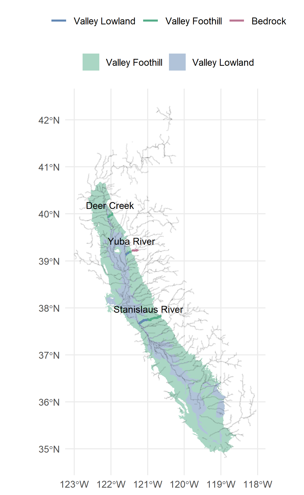

```{r setup, include = FALSE}
knitr::opts_chunk$set(
  collapse = TRUE,
  comment = "#>",
  base.dir = "./",
  base.url = "./articles",
  fig.path = "figures/training-data-"
)
```

## Data Sources

Depth and velocity outputs from existing two-dimensional hydraulic models were assembled for "training reaches" within the study area, at a variety of flows. The model is currently trained on the following models:

| Stream | Extent | Length | Author | Year | Platform | Flow Range |
| ------ | ------ | ------ | ------ | ---- | -------- | ---------- |
| Deer Creek | Delaney Slough to Sacramento River confluence | 40,000 LF | FlowWest | 2021 | HEC-RAS 2D | ___ - ___ cfs |
| Lower Yuba River | Englebright Dam to Feather River confluence | 120,000 LF | CBEC | 2020 | SRH-2D | ___ - ___ cfs |
| Stanislaus River | Knights Ferry to San Joaquin River confluence | 90,000 LF | NewFields | 2013 | SRH-2D | ___ - ___ cfs |
| Tuolumne River | Basso-La Grange Reach | ___ LF | FlowWest | ___ | HEC-RAS 2D | ___ - ___ cfs |

{width=50%}

The depth and velocity raster grids (for HEC-RAS 2D models) or vector meshes (for SRH-2D models) were divided up based on ComID reach delineations. Currently, this is a manual process that requires importing the model domain polygon into a GIS system, splitting it up into reaches, and assigning each reach a ComID number that corresponds to the overlapping NHDPlusV2 flowline.

## Habiat Suitability Index

A habitat suitability index was applied to each grid/mesh cell based on depth and velocity values. The simplest habitat suitability indices are binary, *i.e.*, 1 if a cell is within suitable depth and velocity range, else 0), and this approach is currently being used. However, it is possible to instead use a habitat suitability index that includes "somewhat suitable" fractional values between 0 and 1. 

### Rearing

We applied the following habitat suitability index (all units are in feet):

> HSI = 1 if (d>1.0 & d<=3.28 & v>0 & v<=1.5) else 0

This was developed for floodplain rearing for the [Chinook Salmon Habitat Quantification Tool](https://www.sfei.org/sites/default/files/biblio_files/SalmonHQT_UserGuide_2019.pdf) published by SFEI. According to this report,

> Suitable depths support foraging behavior and predator avoidance (Gregory 1993) and contribute to favorable primary production conditions. Juvenile Chinook salmon habitat suitability models for depth and velocity have been developed previously for numerous rivers in the Central Valley and elsewhere (Aceituno 1990) and applied to floodplain habitat estimates for the San Joaquin River (SJRRP 2012). These estimates suggest optimal depth values exist between 0.3 and 1 m (1–3.28 ft) in floodplain or off-channel conditions, and these depths are used in accepted HSI (Habitat Suitability Index) models (Figure A.6; Aceituno 1990, SJRRP 2012). The same studies, based on the velocity requirements for juvenile Chinook salmon, assigned optimal velocity values for those habitat types at between 0–0.46 m/sec (0–1.5 ft/sec; Figure A.6; Aceituno 1990). 

An alternative habitat suitability index was also tested:

> HSI = 1 if (d>0.5 & d<=5.2 & v>0 & v<=4.0) else 0

This index, derived from "juvenile salmonid observations from 11 different northern California rivers," was "developed for the California State Water Resources Control Board Voluntary Settlement Agreement and ... agreed upon by a committee of interested stakeholders as part of the Voluntary Settlement Agreement process during a meeting held November 9, 2017." It was previously applied by CBEC in the [Yuba River Flow Effects Modeling Project](https://drive.google.com/file/d/1UUjj0BxwIvbgL2k-frld6Fytx-bmi2Of/view). 

### Spawning

For spawning, we derived general habitat suitability criteria from a dataset compiled by Mark Gard for use in [CVPIA DSMHabitat](https://cvpia-osc.github.io/DSMhabitat/). Within the dataset are spawning criteria for depth, velocity, and substrate for 11 watersheds and Fall, Late Fall, Winter, Spring for Chinook Salmon.

<mark>TODO: Plot here of Mark Gard criteria</mark>

The depth factor of the HSI, as the least-restrictive estimate, uses the maximum depth with a nonzero suitability across all of the runs analyzed.

> HSI<sub>depth</sub> = 1 if d<=6.56 else 0

For winter run, a minimum depth also applies:

> HSI<sub>depth</sub> = 1 if (d > 1.00 & d<=6.56) else 0

The velocity factor of the HSI, rather than a binary threshold, uses a curve relationship with fractional suitabilities. This curve is the upper envelope of all the individual suitability curves for different runs. 

<mark>TODO: Plot here of the final suitability criteria.</mark>

If both depth and velocity criteria were fractional, then a geometric mean would be an appropriate method of combining the two. However, with the binary criterion, simple multiplication is appropriate. The overall suitability equals the velocity suitability if and only if the depth is suitable, otherwise the overall suitability is zero.

> HSI = HSI<sub>depth</sub> * HSI<sub>velocity</sub> = min(HSI<sub>depth</sub>, HSI<sub>velocity</sub>)

## Depth and Velocity Data Processing

The selected habitat suitability index was applied to the depth and velocity raster grids (for HEC-RAS 2D models) or vector meshes (for SRH-2D models). The habistat team developed a series of R functions--built with the `dplyr`, `sf`, and `terra` libraries--to import model geometry and depth/velocity results, apply habitat suitability indices, and summarize results by ComID reach. Both workflows consist of the following steps:

* Import depth and velocity grid/mesh for a particular flow.
* Calculate area (ft<sup>2</sup>) of each grid/mesh cell
* Calculate suitability (between 1 and 0) for each grid/mesh cell
* Calculate suitable area of each grid/mesh cell by multiplying area by suitability
* Aggregate grid/mesh cells by ComID (reach) polygon, calculating total area and total suitable area
* Divide total area and total suitable area by the length of the corresponding flowline (linear ft)

This process is conducted for each set of depth/velocity rasters corresponding to each flow. 

The result is two values for each ComID (reach) at each flow. Units are ft2/ft, which simplifies to ft:

* **suitable area per linear ft** is our habitat variable of interest-- the effective habitat area in the channel, normalized by reach length so that the (somewhat arbitrary) division of reaches does not influence model outputs. Because it's an area divided by a length, it can also be thought of as an "effective width of habitat." 

* **total inundated area per linear ft** can likewise be interpreted as the average width of wetted channel at the given flow. This is useful for comparison purposes.

### Vector Functions for SRH-2D Model Outputs

* [`vector_prep_mesh`](../reference/vector_prep_mesh.html) imports a polygon shapefile describing model cells, and calculates the area of each cell.
* [`vector_import_srh2d`](../reference/vector_import_srh2d.html) imports a series of tabular datasets containing the depth and velocity estimates by cell for all flows.
* [`vector_calculate_hsi`](../reference/vector_calculate_hsi.html) creates habitat suitability index estimates for each cell based on the specified suitability criteria. 
* [`vector_summarize_hsi`](../reference/vector_summarize_hsi.html) calculates suitable area of each grid/mesh cell by multiplying area by suitability, then aggregates cells by ComID (reach) polygon, calculating total area and total suitable area.
* [`suitability_postprocess`](../reference/suitability_postprocess.html) spatially joins the ComID (reach) polygons to the NHD flowlines, then divides total area and total suitable area by the length of the corresponding flowline. The result is *total inundated area (ft2) per linear ft* and *suitable habitat area (ft2) per linear ft* for each reach, at each flow.

### Raster Functions for HEC-RAS 2D Model Outputs

* [`raster_prep_grid`](../reference/raster_prep_grid.html) imports depth and velocity grid/mesh for all flows and combines them into a `terra` raster dataset. 
* [`raster_summarize_hsi`](../reference/raster_summarize_hsi.html) applies the specified habitat suitability index, then calculates zonal statistics by ComID (reach) polygon to achieve total area and total suitable area for each polygon.
* [`suitability_postprocess`](../reference/suitability_postprocess.html) spatially joins the ComID (reach) polygons to the NHD flowlines, then divides total area and total suitable area by the length of the corresponding flowline. The result is *total inundated area (ft2) per linear ft* and *suitable habitat area (ft2) per linear ft* for each reach, at each flow.

### Baseflow Channel Removal

For rearing reaches, it is also necessary to eliminate the area within within the perennial baseflow channel, even where depths and velocities are within the suitable range of the habitat suitability index (HSI). <mark>TODO Why?</mark>

This is achieved by zeroing out the grid cells corresponding to the baseflow channel in the original hydraulic model output, prior to summarizing habitat suitability and creating the training dataset. The spatial extent of the baseflow channel can be estimated by choosing a specific baseflow (cfs) for each training reach and clipping out the inundation extent at this flow. In most cases, this is the minimum of the available flows in the provided hydraulic model results grids.

The development team tested an alternative method which keeps the baseflow channel in the training dataset, and instead eliminates baseflow in the non-hydraulically modeled reaches after prediction. This is achieved by simply altering the duration suitability criteria to 'zero out' high durations (e.g. \>=100 days). However, it was determined that the assumptions inherent in the duratio suitability method would produce less accurate baseflow channel removal than simply spatially clipping.

## Output

The summarized habitat training dataset by reach is available in the data package as [`wua_hydraulic`](../reference/wua_hydraulic.html).

